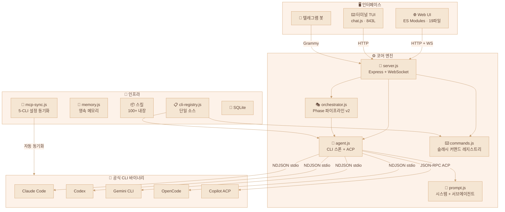
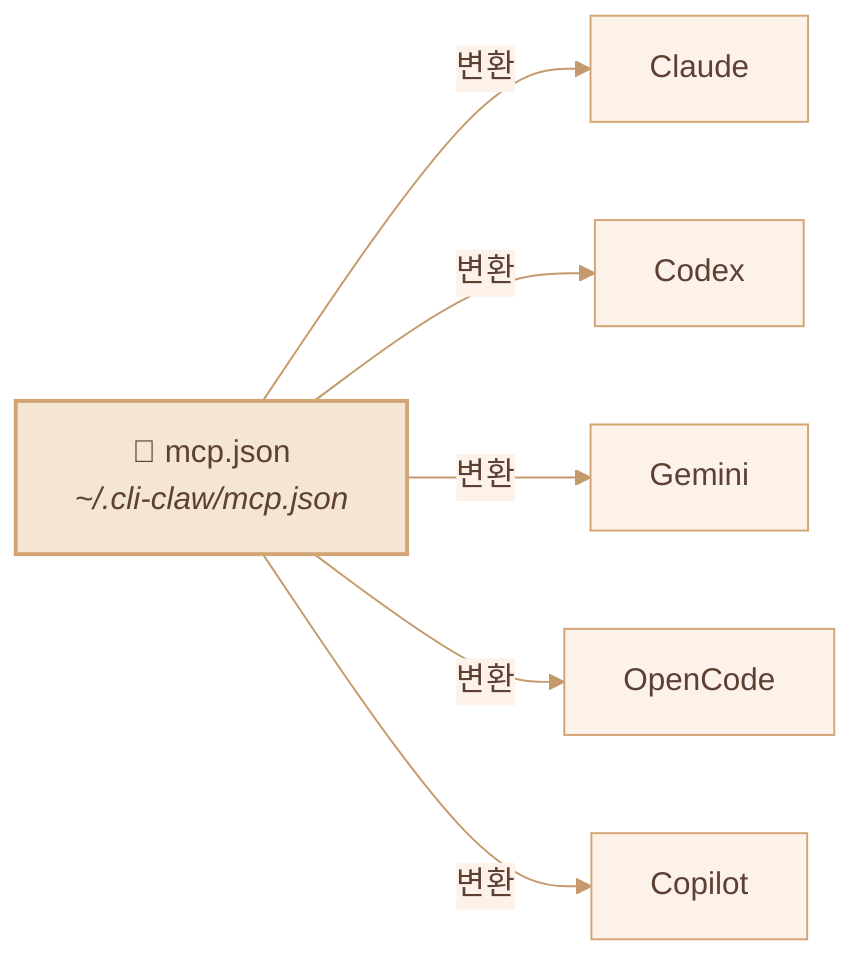
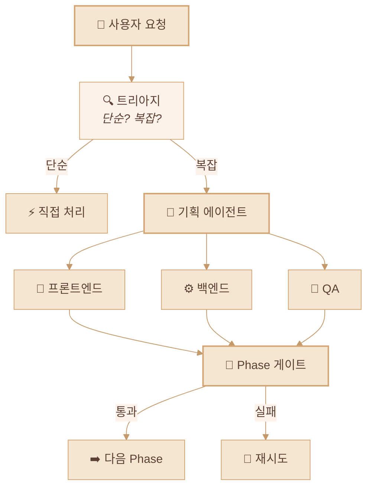

<div align="center">

# 🦞 CLI-CLAW

### 통합 AI 에이전트 오케스트레이션 플랫폼

*인터페이스 하나. CLI 다섯 개. 차단? 그런 건 없다.*

[](#-테스트)
[](https://nodejs.org)
[](LICENSE)

[English](README.md) / **한국어** / [中文](README.zh-CN.md)

<!-- 📸 실제 스크린샷으로 교체하세요 -->
<!--  -->

</div>

---

## 🌟 왜 CLI-CLAW인가?

대부분의 AI 코딩 도구는 결국 같은 벽에 부딪힙니다: **API 키 차단, 레이트 리밋, 이용약관 위반.**

CLI-CLAW는 접근 방식 자체가 다릅니다:

> 🛡️ **모든 요청이 공식 CLI 바이너리를 그대로 거칩니다** — `claude`, `codex`, `gemini`, `opencode`, `copilot --acp`.
>
> 래퍼 아닙니다. 프록시 아닙니다. 리버스 엔지니어링 아닙니다. **벤더가 직접 배포하는 그 바이너리를 씁니다.**
>
> **계정 안전합니다. 끝.**

<!-- 📸 실제 Web UI 스크린샷으로 교체하세요 -->
<!--  -->

---

## ✨ 핵심 강점

| | 강점 | 설명 |
|--|------|------|
| 🔒 | **CLI 네이티브 = 절대 차단 불가** | 공식 CLI 바이너리를 직접 스폰합니다. API 래퍼가 아닙니다. 차단 위험? 제로. |
| 🔄 | **5개 CLI, 1개 화면** | Claude · Codex · Gemini · OpenCode · Copilot — `/cli` 한 줄이면 전환 끝 |
| ⚡ | **자동 폴백** | `claude → codex → gemini` — 하나 죽으면 다음 놈이 받아칩니다 |
| 🎭 | **오케스트레이션 v2** | 역할 기반 서브에이전트 + 5단계 파이프라인 + 게이트 리뷰 |
| 🔌 | **MCP는 한 번이면 충분** | `mcp.json` 하나 → 5개 CLI 설정에 자동으로 깔림 |
| 📦 | **100+ 스킬** | 플러그인 시스템, 2×3 분류 (Active / Reference) |
| 🧠 | **영속 메모리** | 알아서 요약하고 기억합니다 + 프롬프트 자동 주입 |
| 📱 | **텔레그램 봇** | 양방향 포워딩 + origin 기반 라우팅 |
| 🌐 | **브라우저 자동화** | Chrome CDP + Vision Click (AI가 알아서 클릭) |

---

## 🏗️ 아키텍처



---

## 🚀 시작하기

### Step 1 — 설치 (한 줄이면 끝)

```bash
npm install -g cli-claw
```

이 한 줄이 자동으로:
- ✅ **5개 CLI 전부 설치** (claude, codex, gemini, opencode, copilot)
- ✅ MCP 서버 설치 (context7)
- ✅ 100+ 기본 스킬 복사
- ✅ 설정 디렉토리 생성 (`~/.cli-claw/`)
- ✅ 스킬 의존성 설치 (uv, playwright)

> bun이 있으면 `bun install -g`, 없으면 `npm i -g` 폴백.

### Step 2 — 인증 (쓰고 싶은 CLI만)

| CLI | 인증 명령어 | 비고 |
|-----|-----------|------|
| Claude | `claude` (최초 실행) | Anthropic 로그인 |
| Codex | `codex --login` | OpenAI 계정 |
| Copilot | `gh auth login` | GitHub 계정 (`gh` CLI 필요) |
| Gemini | `gemini` (최초 실행) | Google Cloud 로그인 |
| OpenCode | 설정파일에 API key | [opencode docs](https://opencode.ai) |

> 💡 **5개 다 필요 없습니다** — 하나만 있어도 동작합니다.

### Step 3 — 실행

```bash
cli-claw doctor     # 설치 상태 진단 (11항목)
cli-claw serve      # 서버 시작 → http://localhost:3457
cli-claw chat       # 또는 터미널 TUI
```

---

## 📋 기능 현황

### ✅ 구현 완료

| 기능 | 설명 | 복잡도 |
|------|------|:------:|
| **멀티-CLI 엔진** | Claude, Codex, Gemini, OpenCode, Copilot — 하나로 통합 스폰 | ⭐⭐⭐⭐ |
| **Copilot ACP** | JSON-RPC 2.0 over stdio, 실시간 스트리밍 | ⭐⭐⭐⭐ |
| **오케스트레이션 v2** | 트리아지 → 역할 분배 → 5단계 파이프라인 → 게이트 리뷰 | ⭐⭐⭐⭐⭐ |
| **MCP 동기화** | `mcp.json` → 5개 CLI 포맷 자동 변환 + symlink 보호 | ⭐⭐⭐⭐ |
| **스킬 시스템** | 100+ 내장 스킬, 2×3 분류 (Active/Reference) | ⭐⭐⭐ |
| **CLI 레지스트리** | 단일 소스 — 파일 1개 고치면 프론트/백 전부 자동 반영 | ⭐⭐⭐ |
| **슬래시 커맨드** | CLI / Web / Telegram 통합 자동완성 + 드롭다운 | ⭐⭐⭐ |
| **텔레그램 봇** | 양방향 포워딩, origin 기반 라우팅, 라이프사이클 관리 | ⭐⭐⭐⭐ |
| **영속 메모리** | `MEMORY.md` + 일일 자동 로그 + 세션 플러시 + 프롬프트 주입 | ⭐⭐⭐ |
| **브라우저 자동화** | Chrome CDP: 스냅샷, 클릭, 네비게이트, 스크린샷 | ⭐⭐⭐ |
| **비전 클릭** | 스크린샷 → AI 좌표 추출 → DPR 보정 → 클릭 (원커맨드) | ⭐⭐⭐⭐ |
| **하트비트** | 주기적 자동 실행 + 활성 시간 + 조용한 시간 | ⭐⭐ |
| **폴백 체인** | `claude → codex → gemini` 실패 시 자동 재시도 | ⭐⭐⭐ |
| **이벤트 중복 제거** | Claude `stream_event`/`assistant` 오버랩 방지 | ⭐⭐⭐ |
| **70개 단위 테스트** | `node:test` — 외부 의존성 0, events + telegram + registry + commands | ⭐⭐ |

### 🔜 구현 예정

| 기능 | 설명 | 우선순위 |
|------|------|:--------:|
| **Vector DB 메모리** | 임베딩 기반 의미 검색 (grep 대체) | 📋 |
| **비전 멀티프로바이더** | vision-click을 Claude, Gemini까지 확장 | 📋 |
| **음성 STT** | 텔레그램 음성→텍스트 스킬 통합 | 📋 |
| **스킬 마켓플레이스** | 커뮤니티 스킬 공유 + 버전 관리 | 💭 |

---

## 🔌 MCP — Model Context Protocol



```bash
cli-claw mcp                        # 등록된 MCP 서버 목록
cli-claw mcp install <package>      # 설치 + 등록 + 5개 CLI 전부 동기화
cli-claw mcp sync                   # mcp.json → 전체 CLI 동기화
cli-claw mcp reset [--force]        # 초기화 + 재동기화
```

> MCP 서버 한 번만 설치하세요 → **5개 CLI 전체**에서 바로 사용 가능합니다.

---

## 🎭 서브에이전트 오케스트레이션



| Phase | 이름 | 설명 |
|:-----:|------|------|
| 1 | 기획 | 작업 분해 + 에이전트 할당 |
| 2 | 기획검증 | 실행 가능성 점검 + 리소스 검증 |
| 3 | 개발 | 병렬 에이전트 실행 |
| 4 | 디버깅 | 오류 해결 + 테스트 수정 |
| 5 | 통합검증 | E2E 검증 + 머지 |

---

## ⌨️ CLI 명령어

```bash
# 서버 & UI
cli-claw serve                      # 서버 시작 (http://localhost:3457)
cli-claw chat                       # 터미널 TUI (3모드, 자동완성)
cli-claw init                       # 초기화 마법사
cli-claw doctor                     # 진단 (11개 체크, --json)
cli-claw status                     # 서버 상태 (--json)

# 스킬
cli-claw skill                      # 설치된 스킬 목록
cli-claw skill install <name>       # Codex / skills_ref / GitHub에서 설치
cli-claw skill remove <name>        # 삭제
cli-claw skill reset [--force]      # 초기화 (100+ 스킬 재분류)

# 메모리
cli-claw memory search <query>      # 메모리 파일 전체 검색
cli-claw memory list                # 파일 목록
cli-claw memory read <file>         # 특정 파일 읽기

# 브라우저
cli-claw browser start              # Chrome 시작 (CDP)
cli-claw browser snapshot           # Accessibility 트리
cli-claw browser screenshot         # 스크린샷 캡처
cli-claw browser vision-click "로그인"  # AI가 알아서 클릭

# 관리
cli-claw employee reset             # 기본 5명 에이전트로 재설정
cli-claw reset                      # 전체 초기화 (MCP/스킬/직원/세션)
```

---

## 🤖 프리셋 모델 & 직접 입력

> ⚠️ 아래는 **빠른 선택을 위한 프리셋**일 뿐입니다 — 아무 모델 ID든 직접 타이핑하면 CLI-CLAW가 그대로 사용합니다.

<details>
<summary><b>Claude Code</b> — claude-sonnet-4-6 (기본)</summary>

| 모델 | 설명 |
|------|------|
| `claude-sonnet-4-6` | 기본 — 빠르고 유능 |
| `claude-opus-4-6` | 최강 |
| `claude-sonnet-4-6[1m]` | 확장 사고 (Sonnet) |
| `claude-opus-4-6[1m]` | 확장 사고 (Opus) |
| `claude-haiku-4-5-20251001` | 가볍고 빠름 |

</details>

<details>
<summary><b>Codex</b> — gpt-5.3-codex (기본)</summary>

| 모델 | 설명 |
|------|------|
| `gpt-5.3-codex` | 기본 — 최신 |
| `gpt-5.3-codex-spark` | 경량 |
| `gpt-5.2-codex` | 이전 세대 |
| `gpt-5.1-codex-max` | 대용량 컨텍스트 |
| `gpt-5.1-codex-mini` | 저비용 |

</details>

<details>
<summary><b>Gemini CLI</b> — gemini-2.5-pro (기본)</summary>

| 모델 | 설명 |
|------|------|
| `gemini-3.0-pro-preview` | 최신 프리뷰 |
| `gemini-3.1-pro-preview` | 차세대 프리뷰 |
| `gemini-2.5-pro` | 기본 — 안정 |
| `gemini-3-flash-preview` | 빠른 프리뷰 |
| `gemini-2.5-flash` | 가장 빠름 |

</details>

<details>
<summary><b>OpenCode</b> — 🆓 무료 모델 포함</summary>

| 모델 | 설명 |
|------|------|
| `anthropic/claude-opus-4-6-thinking` | 기본 |
| `anthropic/claude-sonnet-4-6-thinking` | Sonnet 사고 |
| `opencode/big-pickle` | 🆓 무료 |
| `opencode/GLM-5 Free` | 🆓 무료 |
| `opencode/MiniMax M2.5 Free` | 🆓 무료 |
| `opencode/Kimi K2.5 Free` | 🆓 무료 |
| `opencode/GPT 5 Nano Free` | 🆓 무료 |

</details>

<details>
<summary><b>Copilot (ACP)</b> — 🆓 무료 티어 포함</summary>

| 모델 | 비용 | 설명 |
|------|:----:|------|
| `gpt-4.1` | 🆓 | 기본 무료 모델 |
| `gpt-5-mini` | 🆓 | 무료 미니 |
| `claude-haiku-4.5` | 0.33x | 가성비 Claude |
| `claude-sonnet-4.6` | 1x | 기본 — 유능 |
| `gpt-5.3-codex` | 1x | 최신 Codex |
| `claude-opus-4.6` | 3x | 최강 |

</details>

> 💡 **위 목록은 프리셋일 뿐** — UI든 CLI든 아무 모델 ID나 직접 타이핑하면 그대로 넘어갑니다.
>
> 🔧 프리셋에 새 CLI/모델을 추가하고 싶다면? `src/cli-registry.js` **딱 1개 파일만 수정** — 전체 자동 반영.

---

## 🧪 테스트

```bash
npm test    # 70개 테스트, ~90ms, 외부 의존성 0
```

상세는 [TESTS.md](TESTS.md) 참조.

| 테스트 파일 | 커버리지 |
|------------|---------|
| `events.test.js` | NDJSON 파서, 세션 ID, 툴 라벨, ACP |
| `events-acp.test.js` | ACP `session/update` — 5개 이벤트 타입 |
| `telegram-forwarding.test.js` | origin 필터, 폴백, 청킹, 마크다운 |
| `cli-registry.test.js` | 구조, 기본값, 모델 선택지 |
| `bus.test.js` | Broadcast, 리스너, WS 목 |
| `commands-parse.test.js` | parseCommand, executeCommand, 자동완성 |
| `worklog.test.js` | Phase, 대기 에이전트 파서 |

---

## 📡 REST API

<details>
<summary><b>40+ 엔드포인트</b></summary>

| 분류 | 엔드포인트 |
|------|-----------|
| 코어 | `GET /api/session`, `POST /api/message`, `POST /api/stop` |
| 레지스트리 | `GET /api/cli-registry` — CLI/모델 단일 소스 |
| 오케스트레이션 | `POST /api/orchestrate/continue`, `POST /api/employees/reset` |
| 커맨드 | `POST /api/command`, `GET /api/commands?interface=` |
| 설정 | `GET/PUT /api/settings`, `GET/PUT /api/prompt` |
| 메모리 | `GET/POST /api/memory`, `GET /api/claw-memory/search` |
| MCP | `GET/PUT /api/mcp`, `POST /api/mcp/sync,install,reset` |
| 스킬 | `GET /api/skills`, `POST /api/skills/enable,disable` |
| 브라우저 | `POST /api/browser/start,stop,act,navigate,screenshot` |
| 직원 | `GET/POST /api/employees`, `PUT/DELETE /api/employees/:id` |
| 할당량 | `GET /api/quota` (Claude/Codex/Gemini/Copilot 사용량) |

</details>

---

## 📜 라이선스

ISC
