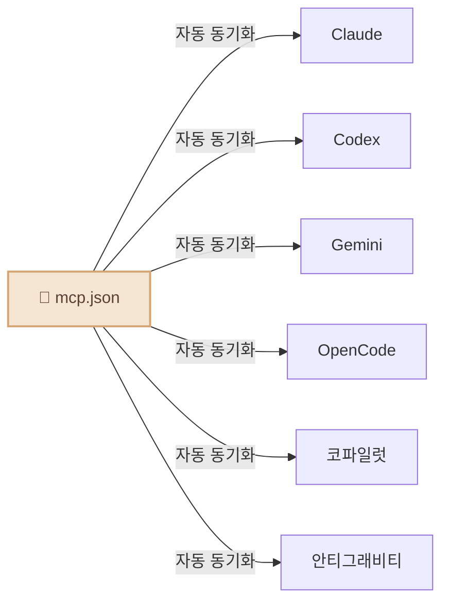

<div align="center">

# 🦈 CLI-JAW

### 5대 AI 엔진을 품은 나만의 로컬 비서

*Claude, Codex, Gemini... 이제 번갈아 쓰지 마세요.*

[](#-테스트)
[](https://typescriptlang.org)
[](https://nodejs.org)
[](LICENSE)
[](https://npmjs.com/package/cli-jaw)
[](#-도커--컨테이너-격리)
[](#)

[English](README.md) / **한국어** / [中文](README.zh-CN.md)

<video src="https://github.com/user-attachments/assets/a7cf17c9-bfb3-44f0-b7fd-d001a39643fd" autoplay loop muted playsinline width="100%"></video>

</div>

<details>
<summary>🪟 <b>Windows 사용자이신가요?</b> — WSL 원클릭 설치</summary>

**Step 1: WSL 설치** (PowerShell 관리자 권한 — 최초 1회)

```powershell
wsl --install
```

안내에 따라 컴퓨터를 재시작하세요. 재부팅 후 시작 메뉴에서 **Ubuntu**를 실행하세요.

**Step 2: CLI-JAW 설치** (Ubuntu/WSL 터미널에서)

```bash
curl -fsSL https://raw.githubusercontent.com/lidge-jun/cli-jaw/master/scripts/install-wsl.sh | bash
```

**Step 3: AI 엔진 인증** (하나 선택)

```bash
gh auth login    # GitHub Copilot (무료)
opencode         # OpenCode (무료 모델 제공)
claude auth      # Anthropic Claude
codex login      # OpenAI Codex
gemini           # Google Gemini
```

**Step 4: 시작하기**

```bash
jaw serve
# → http://localhost:3457
```

> 💡 스크립트는 [fnm](https://github.com/Schniz/fnm)으로 Node.js를 관리합니다. 이미 `nvm`이 있으면 그걸 사용합니다.

</details>

<details>
<summary>🍎 <b>터미널이 처음이신가요?</b> — 원클릭 Node.js + CLI-JAW 설치</summary>

터미널에 이 한 줄만 붙여넣으세요 — 알아서 감지하고 다 설치해줍니다:

```bash
curl -fsSL https://raw.githubusercontent.com/lidge-jun/cli-jaw/master/scripts/install.sh | bash
```

> 💡 **그냥 써보고 싶다면?** 설치 없이 바로 실행: `npx cli-jaw serve`

</details>

---

## 🚀 설치 & 실행 (30초)

```bash
npm install -g cli-jaw
jaw serve
```

**끝.** **http://localhost:3457** 열고 바로 채팅하세요. 🦈

> **Node.js ≥ 22** ([다운로드](https://nodejs.org)) + 아래에서 **AI CLI 최소 1개** 인증 필요.

---

## 🔑 AI 엔진 인증

**하나만** 있으면 돼요 — 가진 거 골라서:

```bash
# ── 무료 ──
gh auth login                # GitHub Copilot (무료 플랜) — 이후: gh copilot --help
opencode                     # OpenCode — 첫 실행 시 자동 인증 (무료 모델 있음)

# ── 유료 ──
claude auth                  # Anthropic Claude
codex login                  # OpenAI Codex
gemini                       # Google Gemini — 첫 실행 시 인증
```

준비 상태 확인: `jaw doctor`

<details>
<summary>📋 <code>jaw doctor</code> 출력 예시</summary>

```
🦈 CLI-JAW Doctor — 12 checks

 ✅ Node.js        v22.15.0
 ✅ npm             v10.9.4
 ✅ Claude CLI      installed
 ✅ Codex CLI       installed
 ⚠️ Gemini CLI      not found (optional)
 ✅ OpenCode CLI    installed
 ✅ Copilot CLI     installed
 ✅ Database        jaw.db OK
 ✅ Skills          17 active, 90 reference
 ✅ MCP             3 servers configured
 ✅ Memory          MEMORY.md exists
 ✅ Server          port 3457 available
```

</details>

> 💡 **5개 다 깔 필요 없어요.** 하나만 있으면 됩니다. 어떤 엔진이 설치돼 있는지 자동 감지하고, 없으면 다음 엔진으로 자연스럽게 넘어갑니다.

---

## CLI-JAW란 무엇인가요?

CLI-JAW는 내 컴퓨터에 상주하며 이미 익숙한 인터페이스인 **웹, 터미널, 텔레그램**에서 작동하는 **개인용 AI 비서**입니다. 궁금한 것을 묻고, 작업을 위임하고, 워크플로우를 자동화하세요.


> 💬 *"오늘 일정 정리해줘"* → 텔레그램으로 바로 정리해서 보내줘요
> 💬 *"이 모듈 리팩토링하고 테스트도 짜줘"* → 서브에이전트가 알아서, 커피 한 잔 하고 오면 돼요
> 💬 *"저 PDF 다운받아서 핵심만 노션에 정리해"* → 브라우저 + 노션 스킬 조합으로 뚝딱

단일 모델만을 사용하는 기존 비서들과 달리, CLI-JAW는 5개의 AI 엔진(Claude, Codex, Gemini, OpenCode, Copilot)을 공식 CLI를 통해 오케스트레이션하여 모든 제공업체의 장점을 통합된 경험으로 제공합니다. 하나의 엔진 사용량이 초과되면 자동으로 다음 엔진으로 전환됩니다. 107개의 내장 스킬이 브라우저 자동화부터 문서 생성까지 모든 것을 처리합니다.

|                                         | 왜 CLI-JAW인가요?                                                                                                |
| --------------------------------------- | ---------------------------------------------------------------------------------------------------------------- |
| 🛡️ **안전한 서비스 약관 준수**           | 공식 CLI만 사용합니다 — API 키 스크래핑이나 리버스 엔지니어링이 없으므로 계정 정지 위험이 없습니다.              |
| 🤖 **검증된 에이전트 도구**              | 실전에서 검증된 5개의 코딩 에이전트(Claude, Codex, Gemini, OpenCode, Copilot)를 한 곳에서 사용하세요.            |
| ⚡ **멀티 에이전트 자동 전환(Fallback)** | 엔진 하나가 멈춰도 걱정 없습니다. 다음 엔진이 즉시 이어받아 중단 없는 작업이 가능합니다.                         |
| 🎭 **오케스트레이션 기반 성능 극대화**   | 복잡한 작업은 전문화된 서브 에이전트에게 분산시켜 처리량을 극대화합니다.                                         |
| 📦 **107개의 내장 스킬**                 | 브라우저 자동화, 문서 생성, 텔레그램 연동, 영구 메모리 등 설치 즉시 사용 가능한 기능들을 제공합니다.             |
| 🖥️ **크로스 플랫폼**                     | macOS, Linux, Windows — ENOENT-safe CLI 스폰, 자동 감지, `.cmd` shim 지원, 네이티브 설치 전부 크로스플랫폼 동작. |


---

## 비서가 어떤 일을 할 수 있나요?


- 🤖 **5개의 AI 엔진, 1명의 비서** — Claude · Codex · Gemini · OpenCode · Copilot. `/cli` 명령어로 전환하세요.
- ⚡ **자동 전환(Fallback)** — 엔진 하나가 다운되면 다음 엔진이 매끄럽게 이어받습니다.
- 🎭 **멀티 에이전트 오케스트레이션** — 복잡한 작업은 전문화된 서브 에이전트들에게 자동으로 분산됩니다.
- 📦 **107개의 스킬** — 브라우저 제어, 파일 편집, 이미지 생성, 웹 검색 외 [다양한 기능](#-스킬-시스템).
- 🧠 **영구 메모리** — 세션을 넘나들며 과거의 대화와 사용자 선호도를 기억합니다.
- 📱 **텔레그램 봇** — 휴대폰으로 비서와 채팅하고, 음성/사진/파일을 전송하세요.
- 🌐 **브라우저 자동화** — 비서가 알아서 웹을 탐색하고, 클릭하고, 타이핑하고, 스크린샷을 찍을 수 있습니다.
- 🔌 **MCP 생태계** — 한 번만 설치하면 5개의 AI 엔진 모두에서 즉시 사용 가능합니다.
- 🔍 **웹 검색** — MCP 도구를 통한 실시간 정보 검색.
- ⏰ **하트비트 작업** — 자동으로 실행되는 반복 일정을 등록하세요.

---

### 기타 실행 방법

```bash
jaw chat         # 터미널 TUI (브라우저 필요 없음)
jaw launchd      # 부팅 시 자동 실행 (macOS)
```

> ⚠️ **설치 시 참고:** `npm install -g cli-jaw`는 postinstall 스크립트를 실행하여 스킬 디렉토리, 커스텀 인스트럭션, MCP 설정을 구성합니다. 기존 설정은 덮어쓰지 않고 병합됩니다.

---

## 📦 스킬 시스템

**107개 스킬** 내장 — 브라우저, GitHub, 노션, 텔레그램, 메모리, PDF, 이미지 생성 등 [다양하게](#).

<details>
<summary>전체 스킬 목록 보기</summary>

| 티어               | 수량  | 작동 방식                                        |
| ------------------ | :---: | ------------------------------------------------ |
| **Active 스킬**    |  17   | 매번 AI한테 자동으로 주입돼요. 항상 켜져 있어요. |
| **Reference 스킬** |  90   | 관련 작업을 시키면 그때 AI가 읽어서 써요.        |

#### Active 스킬 (항상 켜짐)

| 스킬                                                                | 기능                                               |
| ------------------------------------------------------------------- | -------------------------------------------------- |
| `browser`                                                           | Chrome 자동화 — 스냅샷, 클릭, 네비게이트, 스크린샷 |
| `github`                                                            | 이슈, PR, CI, 코드 리뷰 (`gh` CLI 사용)            |
| `notion`                                                            | Notion 페이지 및 데이터베이스 관리                 |
| `memory`                                                            | 세션 간 영속 장기 메모리                           |
| `telegram-send`                                                     | Telegram으로 사진, 문서, 음성 메시지 전송          |
| `vision-click`                                                      | 스크린샷 → AI가 좌표 찾기 → 클릭 (원커맨드)        |
| `imagegen`                                                          | OpenAI Image API로 이미지 생성/편집                |
| `pdf` / `docx` / `xlsx`                                             | 오피스 문서 읽기, 생성, 편집                       |
| `screen-capture`                                                    | macOS 스크린샷 및 카메라 캡처                      |
| `openai-docs`                                                       | 최신 OpenAI API 문서                               |
| `dev` / `dev-frontend` / `dev-backend` / `dev-data` / `dev-testing` | 서브에이전트용 개발 가이드                         |

#### Reference 스킬 (필요할 때만)

90개 스킬이 더 있어요 — spotify, 날씨, 딥리서치, TTS, 비디오 다운로드, Apple 미리알림, 1Password, Terraform, PostgreSQL, Jupyter 등.

```bash
jaw skill install <name>    # reference → active로 영구 활성화
```

</details>

---

## 📱 텔레그램 — 내 주머니 속의 비서

비서는 책상 앞에만 머물지 않습니다. 텔레그램을 통해 어디서든 대화하세요:

```
📱 Telegram ←→ 🦈 CLI-JAW ←→ 🤖 AI 엔진
```

<details>
<summary>📋 텔레그램 설정 (3단계)</summary>

1. **봇 만들기** — [@BotFather](https://t.me/BotFather)에게 `/newbot` → 토큰 복사
2. **설정** — `jaw init --telegram-token 토큰` 실행하거나 Web UI 설정에서 입력
3. **채팅 시작** — 봇에게 아무 메시지나 보내세요. 첫 메시지에서 채팅 ID가 자동 저장됩니다.

</details>

**텔레그램에서 가능한 작업:**
- 💬 비서와 채팅 (5개 AI 엔진 중 선택)
- 🎤 음성 메시지 전송 (자동 텍스트 변환)
- 📎 처리를 위한 파일 및 사진 전송
- ⚡ 명령어 실행 (`/cli`, `/model`, `/status`)
- 🔄 실시간 AI 엔진 전환

**비서가 보내주는 내용:**
- 마크다운 서식이 적용된 AI 응답
- 생성된 이미지, PDF, 문서
- 예약된 작업 결과 (하트비트 작업)
- 브라우저 스크린샷

<p align="center">
  
</p>

---

## 🎭 멀티 에이전트 오케스트레이션


복잡한 작업의 경우, 비서가 전문 서브 에이전트에게 작업을 위임합니다:


비서는 작업에 오케스트레이션이 필요한지 직접 응답이 필요한지 **스스로 결정**합니다. 별도의 설정이 필요 없습니다.

---

## 🔌 MCP — 단일 설정, 6개의 AI 엔진

```bash
jaw mcp install @anthropic/context7    # 한 번만 설치
# → Claude, Codex, Gemini, OpenCode, Copilot, Antigravity 전부 자동 동기화
```



설정 파일 6개를 별도로 수정할 필요가 없습니다. 한 번만 설치하면 모든 AI 엔진에 적용됩니다.

---

## ⌨️ CLI 명령어

```bash
jaw serve                         # 서버 시작
jaw launchd                       # 부팅 시 자동 실행 (macOS)
jaw launchd status                # 데몬 상태 확인
jaw launchd unset                 # 자동 실행 해제
jaw chat                          # 터미널 TUI
jaw doctor                        # 진단 (12개 체크)
jaw skill install <name>          # 스킬 설치
jaw mcp install <package>         # MCP 설치 → 6개 CLI 전부 동기화
jaw memory search <query>         # 메모리 검색
jaw browser start                 # Chrome 시작 (CDP)
jaw browser vision-click "로그인"  # AI가 알아서 클릭
jaw clone ~/my-project            # 인스턴스 복제
jaw --home ~/my-project serve --port 3458  # 두 번째 인스턴스 실행
jaw reset                         # 전체 초기화
```

---

## 🏗️ 멀티 인스턴스 — 프로젝트별 독립 환경

CLI-JAW의 독립된 인스턴스를 여러 개 실행할 수 있어요 — 각각 고유한 설정, 메모리, 스킬, 데이터베이스를 가집니다.

```bash
# 기본 인스턴스를 새 프로젝트로 복제
jaw clone ~/my-project

# 다른 포트로 실행
jaw --home ~/my-project serve --port 3458

# 또는 둘 다 부팅 시 자동 실행
jaw launchd                                    # 기본 → 포트 3457
jaw --home ~/my-project launchd --port 3458    # 프로젝트 → 포트 3458
```

각 인스턴스는 완전히 독립적입니다 — 작업 디렉토리, 메모리, MCP 설정이 모두 다릅니다. 업무/개인 컨텍스트 분리나 프로젝트별 AI 설정에 안성맞춤이에요.

| 플래그 / 환경변수     | 기능                                     |
| --------------------- | ---------------------------------------- |
| `--home <경로>`       | 이 실행에 사용할 커스텀 홈 디렉토리 지정 |
| `--home=<경로>`       | 동일 (`=` 구문)                          |
| `CLI_JAW_HOME=<경로>` | 환경변수로 지정                          |
| `jaw clone <대상>`    | 현재 인스턴스를 새 디렉토리로 복제       |
| `--port <포트>`       | `serve` / `launchd`용 커스텀 포트        |

---

## 🤖 모델

각 CLI마다 프리셋이 있지만, **아무 모델 ID나** 직접 쳐도 돼요.

<details>
<summary>전체 프리셋 보기</summary>

| CLI          | 기본값                     | 주요 모델                                      |
| ------------ | -------------------------- | ---------------------------------------------- |
| **Claude**   | `claude-sonnet-4-6`        | opus-4-6, haiku-4-5, 확장 사고 변형            |
| **Codex**    | `gpt-5.3-codex`            | spark, 5.2, 5.1-max, 5.1-mini                  |
| **Gemini**   | `gemini-2.5-pro`           | 3.0-pro-preview, 3-flash-preview, 2.5-flash    |
| **OpenCode** | `claude-opus-4-6-thinking` | 🆓 big-pickle, GLM-5, MiniMax, Kimi, GPT-5-Nano |
| **Copilot**  | `gpt-4.1` 🆓                | 🆓 gpt-5-mini, claude-sonnet-4.6, opus-4.6      |

</details>

> 🔧 프리셋에 모델 추가하고 싶으면: `src/cli/registry.ts` 하나만 고치면 전체 자동 반영.

---

## 🐳 Docker — 컨테이너 격리

보안 격리를 위해 Docker 컨테이너에서 실행 — AI 에이전트가 호스트 파일에 접근 불가.

```bash
docker compose up -d        # → http://localhost:3457
```

> 자세한 내용은 [English README](README.md#-docker--container-isolation) 참고.
> `Dockerfile` (npm 배포판) / `Dockerfile.dev` (로컬 소스) 두 가지 제공.

---

## 🛠️ 개발

<details>
<summary>빌드, 실행, 프로젝트 구조</summary>

```bash
# 빌드 (TypeScript → JavaScript)
npm run build          # tsc → dist/

# 소스에서 실행 (개발용)
npm run dev            # tsx server.ts
npx tsx bin/cli-jaw.ts serve   # .ts에서 직접 실행

# 빌드 결과물로 실행 (프로덕션)
node dist/bin/cli-jaw.js serve
```

**프로젝트 구조:**

```
src/
├── agent/          # AI 에이전트 라이프사이클 & 스폰
├── browser/        # Chrome CDP 자동화
├── cli/            # CLI 레지스트리 & 모델 프리셋
├── core/           # DB, 설정, 로깅
├── http/           # Express 서버 & 미들웨어
├── memory/         # 영속 메모리 시스템
├── orchestrator/   # 멀티에이전트 오케스트레이션 파이프라인
├── prompt/         # 프롬프트 주입 & AGENTS.md 생성
├── routes/         # REST API 엔드포인트 (40+)
├── security/       # 입력 검증 & 가드레일
└── telegram/       # 텔레그램 봇 연동
```

> TypeScript — `strict: true`, `NodeNext` 모듈 해상도, ES2022 타겟.

</details>

---

## 🧪 테스트

<details>
<summary>445 pass · 1 skipped · 외부 의존성 0</summary>

```bash
npm test
```

`tsx --test`로 실행 (Node.js 네이티브 테스트 러너 + TypeScript).

</details>

---

## 📖 문서

| 문서                                    | 내용                                                |
| --------------------------------------- | --------------------------------------------------- |
| [ARCHITECTURE.md](docs/ARCHITECTURE.md) | 시스템 설계, 모듈 그래프, REST API (40+ 엔드포인트) |
| [TESTS.md](TESTS.md)                    | 테스트 커버리지, 테스트 계획                        |

---

## 🔧 문제 해결

| 증상                         | 원인                               | 해결 방법                                                                   |
| ---------------------------- | ---------------------------------- | --------------------------------------------------------------------------- |
| `command not found: cli-jaw` | npm 전역 bin이 PATH에 없음         | `npm config get prefix` 확인 후 `bin/`을 PATH에 추가                        |
| `doctor`에서 CLI 누락 표시   | 해당 CLI 미설치                    | `npm i -g @anthropic-ai/claude-code` 등 설치                                |
| 포트 3457 사용 중            | 다른 프로세스가 점유               | `PORT=4000 jaw serve` 또는 기존 프로세스 종료                               |
| 텔레그램 봇 무반응           | 토큰 미설정 또는 Chat ID 누락      | `jaw init --telegram-token ...` 재실행                                      |
| 텔레그램 ✓✓ 지연 표시        | Telegram 서버 측 전달 확인 타이밍  | 정상 동작 — 서버 부하에 따라 수 분 걸릴 수 있음. 버그 아님                  |
| `npm install -g` 권한 오류   | 글로벌 디렉토리 권한 문제          | `sudo npm i -g cli-jaw` 또는 [nvm](https://github.com/nvm-sh/nvm) 사용 권장 |
| 빌드 실패 (`tsc` 에러)       | Node 22 미만 버전                  | `node -v` 확인 → 22 이상으로 업그레이드                                     |
| 메모리가 세션 간 유지 안 됨  | `~/.cli-jaw/memory/` 디렉토리 없음 | `jaw init` 재실행하면 자동 생성                                             |

---

## 🤝 기여하기

기여 환영합니다! 시작하는 방법:

1. 레포를 포크하고 `main`에서 브랜치를 만드세요
2. `npm run build && npm test`로 빌드 & 테스트가 통과하는지 확인
3. PR을 보내주세요 — 빠르게 리뷰할게요

> 📋 버그를 찾았거나 아이디어가 있으신가요? [이슈 열기](https://github.com/lidge-jun/cli-jaw/issues)

---

<div align="center">

**⭐ CLI-JAW가 도움이 됐다면 Star 한 번 눌러주세요!**

Made with ❤️ by the CLI-JAW community

[ISC License](LICENSE)

</div>
