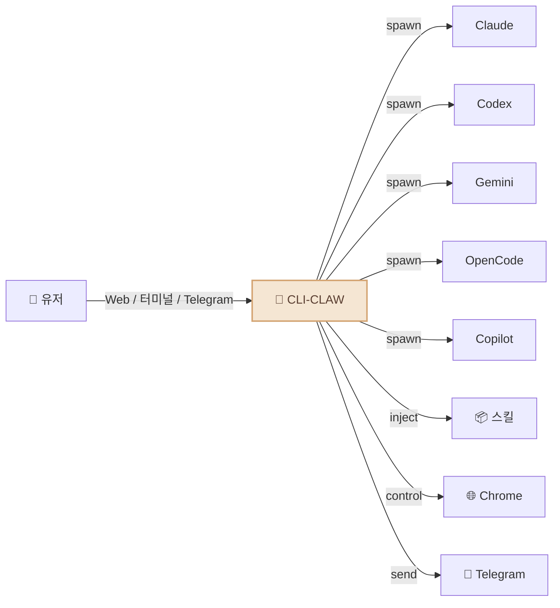

<div align="center">

# 🦞 CLI-CLAW

### 통합 AI 에이전트 오케스트레이션 플랫폼

*인터페이스 하나. CLI 다섯 개. 차단? 그런 건 없다.*

[](#-테스트)
[](https://nodejs.org)
[](LICENSE)

[English](README.md) / **한국어** / [中文](README.zh-CN.md)

<!-- 📸 TODO: Web UI 스크린샷 -->
<!--  -->

</div>

---

## 왜 CLI-CLAW인가?

대부분의 AI 코딩 도구는 결국 같은 벽에 부딪힙니다: **API 키 차단, 레이트 리밋, 이용약관 위반.**

CLI-CLAW는 접근 방식 자체가 다릅니다 — 모든 요청이 벤더가 직접 배포하는 **공식 CLI 바이너리**를 그대로 거칩니다. 래퍼가 아닙니다. 프록시도 아닙니다. 계정 안전합니다.

### 뭐가 다른데?

| | CLI-CLAW | API 래퍼들 | 다른 오케스트레이터 |
|--|----------|-----------|-------------------|
| **이용약관 준수** | ✅ 공식 CLI 바이너리 사용 | ❌ 직접 API 호출 = 차단 위험 | ⚠️ 케바케 |
| **멀티 모델** | 5개 CLI 통합 | 보통 1개 프로바이더 | 1-2개 |
| **자동 폴백** | `claude → codex → gemini` | 수동 전환 | ❌ |
| **MCP 동기화** | 한 번 설치 → 5개 CLI | 도구별 개별 설정 | ❌ |
| **스킬 생태계** | 107개 내장 스킬 | 플러그인 다양 | 제한적 |
| **비용** | Copilot/OpenCode 무료 티어 | API 비용 발생 | API 비용 발생 |

<!-- 📸 TODO: 터미널 TUI 스크린샷 -->
<!--  -->

---

## 이런 걸 합니다



- 🔄 **5개 CLI, 1개 화면** — Claude · Codex · Gemini · OpenCode · Copilot. `/cli`로 전환.
- ⚡ **자동 폴백** — `claude → codex → gemini`. 하나 죽으면 다음이 자동으로 받아칩니다.
- 🎭 **멀티 에이전트 오케스트레이션** — 복잡한 작업을 역할 기반 서브에이전트들이 5단계 파이프라인으로 처리.
- 🔌 **MCP 동기화** — MCP 서버 한 번 설치하면 5개 CLI 전부에서 즉시 사용 가능.
- 📦 **107개 스킬** — 내장 플러그인 시스템, 두 가지 티어 (아래 [스킬 시스템](#-스킬-시스템) 참조).
- 🧠 **영속 메모리** — 대화 자동 요약, 장기 기억, 프롬프트 주입.
- 📱 **텔레그램 봇** — 채팅, 사진/문서/음성 수신, 폰에서 에이전트 제어.
- 🌐 **브라우저 자동화** — Chrome CDP + AI 기반 Vision Click.
- 🔍 **웹 검색** — MCP 도구를 통한 실시간 웹 검색 (Context7 등).
- 🌍 **다국어** — 한국어 / English, 어디서나 (UI, API, CLI, Telegram).

---

## 빠른 시작

```bash
# 설치 (5개 CLI, MCP, 107개 스킬 전부 자동 설정)
npm install -g cli-claw

# 쓰고 싶은 CLI만 인증 (하나만 있어도 됩니다)
claude auth          # Anthropic
codex login          # OpenAI
gemini               # Google (최초 실행)

# 시작
cli-claw doctor      # 뭐가 설치됐는지 확인 (12개 체크)
cli-claw serve       # Web UI → http://localhost:3457
cli-claw chat        # 또는 터미널 TUI
```

> 💡 **5개 다 필요 없습니다.** 하나만 있어도 됩니다. Copilot과 OpenCode는 무료 티어가 있어요.

---

## 📦 스킬 시스템

CLI-CLAW에는 **107개의 내장 스킬**이 두 가지 티어로 구성되어 있습니다:

| 티어 | 수량 | 작동 방식 |
|------|:----:|----------|
| **Active 스킬** | 17 | AI 프롬프트에 자동 주입. 항상 사용 가능. |
| **Reference 스킬** | 90 | 관련 작업을 요청하면 AI가 필요 시 읽어서 사용. |

### Active 스킬 (항상 켜짐)

시스템 프롬프트에 자동으로 주입됩니다:

| 스킬 | 기능 |
|------|------|
| `browser` | Chrome 자동화 — 스냅샷, 클릭, 네비게이트, 스크린샷 |
| `github` | 이슈, PR, CI, 코드 리뷰 (`gh` CLI 사용) |
| `notion` | Notion 페이지 및 데이터베이스 관리 |
| `memory` | 세션 간 영속 장기 메모리 |
| `telegram-send` | Telegram으로 사진, 문서, 음성 메시지 전송 |
| `vision-click` | 스크린샷 → AI가 좌표 찾기 → 클릭 (원커맨드) |
| `imagegen` | OpenAI Image API로 이미지 생성/편집 |
| `pdf` / `docx` / `xlsx` | 오피스 문서 읽기, 생성, 편집 |
| `screen-capture` | macOS 스크린샷 및 카메라 캡처 |
| `openai-docs` | 최신 OpenAI API 문서 |
| `dev` / `dev-frontend` / `dev-backend` / `dev-data` / `dev-testing` | 서브에이전트용 개발 가이드 |

### Reference 스킬 (필요 시 사용)

90개의 스킬이 준비되어 있습니다. 관련 작업을 요청하면 AI가 스킬 가이드를 읽고 따릅니다:

```bash
# Reference 스킬 예시:
spotify-player     # Spotify 재생 제어
weather            # 날씨 예보
deep-research      # 다단계 웹 리서치
tts                # 텍스트 음성 변환
video-downloader   # 비디오 다운로드
apple-reminders    # Apple 미리알림 관리
1password          # 1Password CLI 연동
terraform          # Infrastructure as Code
postgres           # PostgreSQL 작업
jupyter-notebook   # Jupyter 노트북 실행
sentry             # 에러 모니터링
# ... 외 79개 더
```

Reference 스킬을 영구 활성화하려면:

```bash
cli-claw skill install <name>    # reference → active로 이동
```

---

## 📱 텔레그램 연동

CLI-CLAW는 단순 챗봇이 아닙니다 — 완전한 **양방향 브릿지**입니다:

```
📱 Telegram ←→ 🦞 CLI-CLAW ←→ 🤖 AI 에이전트
```

**텔레그램에서 할 수 있는 것:**
- 💬 5개 AI CLI 중 아무거나 골라서 대화
- 📸 스크린샷, 생성된 이미지, 문서 수신
- 🎤 음성 메시지 전송 (자동 텍스트 변환)
- 📎 파일 전송 → AI가 처리
- ⚡ 슬래시 커맨드 (`/cli`, `/model`, `/status` 등)
- 🔄 CLI와 모델 실시간 전환

**CLI-CLAW가 텔레그램으로 보내는 것:**
- 마크다운 포맷 AI 응답
- 생성된 이미지, PDF, 문서
- 하트비트 작업 결과 (예약 실행)
- 브라우저 스크린샷

<!-- 📸 TODO: 텔레그램 봇 스크린샷 -->
<!--  -->

---

## 🎭 오케스트레이션

복잡한 작업은 전문화된 서브에이전트들에게 분배합니다:


AI가 **스스로** 오케스트레이션이 필요한지 판단합니다. 설정할 거 없어요.

---

## 🔌 MCP — 한 번 설정, 다섯 CLI

```bash
cli-claw mcp install @anthropic/context7    # 한 번만 설치
# → Claude, Codex, Gemini, OpenCode, Copilot 전부 자동 동기화
```


5개 설정 파일 따로 편집? 그런 거 없습니다. MCP 서버 한 번 설치 → 전체 CLI가 받아갑니다.

---

## ⌨️ CLI 명령어

```bash
cli-claw serve                         # 서버 시작
cli-claw chat                          # 터미널 TUI
cli-claw doctor                        # 진단 (12개 체크)
cli-claw skill install <name>          # 스킬 설치
cli-claw mcp install <package>         # MCP 설치 → 5개 CLI 전부 동기화
cli-claw memory search <query>         # 메모리 검색
cli-claw browser start                 # Chrome 시작 (CDP)
cli-claw browser vision-click "로그인"  # AI가 알아서 클릭
cli-claw reset                         # 전체 초기화
```

---

## 🤖 모델

각 CLI에 프리셋이 준비되어 있지만, **아무 모델 ID나** 직접 타이핑해도 됩니다.

<details>
<summary>전체 프리셋 보기</summary>

| CLI | 기본값 | 주요 모델 |
|-----|--------|-----------|
| **Claude** | `claude-sonnet-4-6` | opus-4-6, haiku-4-5, 확장 사고 변형 |
| **Codex** | `gpt-5.3-codex` | spark, 5.2, 5.1-max, 5.1-mini |
| **Gemini** | `gemini-2.5-pro` | 3.0-pro-preview, 3-flash-preview, 2.5-flash |
| **OpenCode** | `claude-opus-4-6-thinking` | 🆓 big-pickle, GLM-5, MiniMax, Kimi, GPT-5-Nano |
| **Copilot** | `gpt-4.1` 🆓 | 🆓 gpt-5-mini, claude-sonnet-4.6, opus-4.6 |

</details>

> 🔧 프리셋에 모델 추가: `src/cli/registry.js` 하나만 수정 — 전체 자동 반영.

---

## 🧪 테스트

```bash
npm test    # 246개 테스트, ~500ms, 외부 의존성 0
```

---

## 📖 문서

| 문서 | 내용 |
|------|------|
| [ARCHITECTURE.md](docs/ARCHITECTURE.md) | 시스템 설계, 모듈 그래프, 전체 기능 목록, REST API (40+ 엔드포인트) |
| [TESTS.md](TESTS.md) | 테스트 커버리지, 티어 모델, Phase 20 테스트 계획 |

---

## 라이선스

ISC
