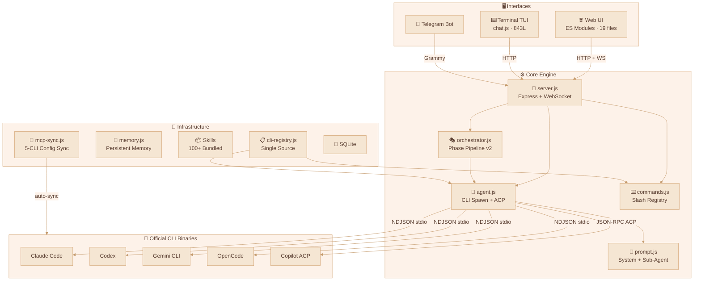
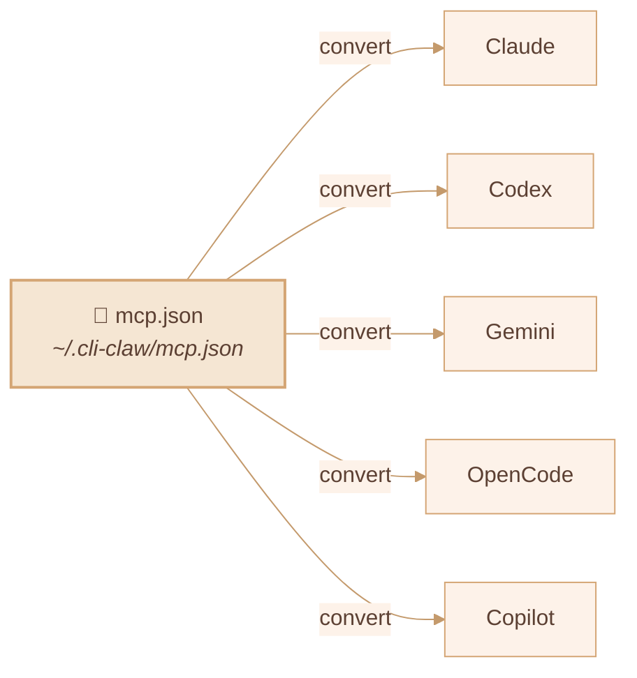
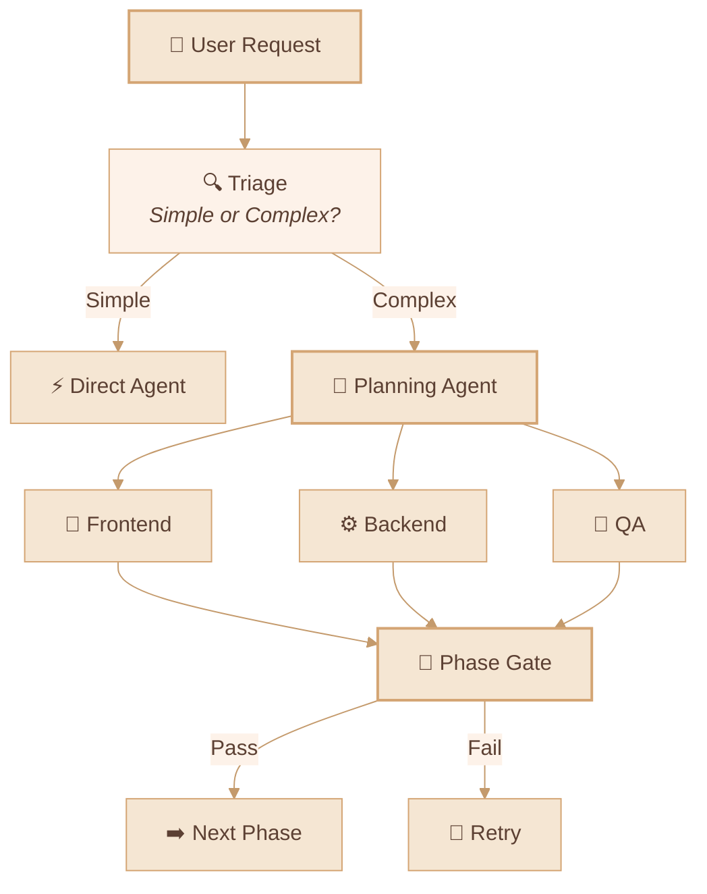

<div align="center">

# 🦞 CLI-CLAW

### Unified AI Agent Orchestration Platform

*One interface. Five CLIs. Zero API bans.*

[](#-tests)
[](https://nodejs.org)
[](LICENSE)

**English** / [한국어](README.ko.md) / [中文](README.zh-CN.md)

<!-- 📸 Replace with actual screenshot -->
<!--  -->

</div>

---

## 🌟 Why CLI-CLAW?

Most AI coding tools hit the same wall: **API key bans, rate limits, TOS violations.**

CLI-CLAW takes a fundamentally different approach:

> 🛡️ **Every interaction goes through official CLI binaries** — `claude`, `codex`, `gemini`, `opencode`, `copilot --acp`.
>
> Not wrappers. Not proxied APIs. Not reverse engineering. **The same binary your vendor ships.**
>
> **Your account stays safe. Period.**

<!-- 📸 Replace with actual Web UI screenshot -->
<!--  -->

---

## ✨ Key Strengths

| | Strength | Description |
|--|----------|-------------|
| 🔒 | **CLI-Native = Ban-Proof** | Spawns official CLI binaries — not API wrappers. No ban risk ever. |
| 🔄 | **5 CLIs, 1 Interface** | Claude · Codex · Gemini · OpenCode · Copilot — switch with `/cli` |
| ⚡ | **Auto Fallback** | `claude → codex → gemini` — if one fails, the next picks up |
| 🎭 | **Orchestration v2** | Role-based sub-agents + 5-phase pipeline with gate reviews |
| 🔌 | **MCP Everywhere** | One `mcp.json` → auto-syncs to all 5 CLI configs |
| 📦 | **100+ Skills** | Plugin system with 2×3 classification (Active / Reference) |
| 🧠 | **Persistent Memory** | Auto-summarize + long-term memory + prompt injection |
| 📱 | **Telegram Bot** | Bidirectional forwarding + origin-based routing |
| 🌐 | **Browser Automation** | Chrome CDP + Vision Click (AI-powered, one command) |

---

## 🏗️ Architecture



---

## 🚀 Quick Start

```bash
# Install globally
npm install -g cli-claw

# Start the server (Web UI + API)
cli-claw serve
# → http://localhost:3457

# Or use the terminal TUI
cli-claw chat
```

---

## 📋 Feature Status

### ✅ Implemented

| Feature | Description | Complexity |
|---------|-------------|:----------:|
| **Multi-CLI Engine** | Claude, Codex, Gemini, OpenCode, Copilot — unified spawn | ⭐⭐⭐⭐ |
| **Copilot ACP** | JSON-RPC 2.0 over stdio, real-time streaming | ⭐⭐⭐⭐ |
| **Orchestration v2** | Triage → role dispatch → 5-phase pipeline → gate reviews | ⭐⭐⭐⭐⭐ |
| **MCP Sync** | `mcp.json` → 5 CLI formats auto-conversion + symlink protection | ⭐⭐⭐⭐ |
| **Skill System** | 100+ bundled skills, 2×3 classification (Active/Reference) | ⭐⭐⭐ |
| **CLI Registry** | Single source of truth — modify one file, auto-propagate everywhere | ⭐⭐⭐ |
| **Slash Commands** | Unified across CLI / Web / Telegram with autocomplete + dropdowns | ⭐⭐⭐ |
| **Telegram Bot** | Bidirectional forwarding, origin-based routing, lifecycle mgmt | ⭐⭐⭐⭐ |
| **Persistent Memory** | `MEMORY.md` + daily auto-log + session flush + prompt injection | ⭐⭐⭐ |
| **Browser Automation** | Chrome CDP: snapshot, click, navigate, screenshot | ⭐⭐⭐ |
| **Vision Click** | Screenshot → AI coordinate → DPR correction → click (one cmd) | ⭐⭐⭐⭐ |
| **Heartbeat** | Scheduled auto-execution with active hours + quiet hours | ⭐⭐ |
| **Fallback Chains** | `claude → codex → gemini` automatic retry on failure | ⭐⭐⭐ |
| **Event Deduplication** | Claude `stream_event`/`assistant` overlap prevention | ⭐⭐⭐ |
| **65 Unit Tests** | `node:test` — zero deps, events + telegram + registry + commands | ⭐⭐ |

### 🔜 Planned

| Feature | Description | Priority |
|---------|-------------|:--------:|
| **Vector DB Memory** | Embedding-based semantic retrieval (replacing grep) | 📋 |
| **Vision Multi-Provider** | Extend vision-click to Claude, Gemini | 📋 |
| **Voice STT** | Telegram voice-to-text skill integration | 📋 |
| **Skill Marketplace** | Community skill sharing + versioning | 💭 |

---

## 🔌 MCP — Model Context Protocol



```bash
cli-claw mcp                        # List registered MCP servers
cli-claw mcp install <package>      # Install + register + sync all 5 CLIs
cli-claw mcp sync                   # Sync mcp.json → all CLIs
cli-claw mcp reset [--force]        # Reset + re-sync
```

> Install an MCP server once → available to **all five CLIs** instantly.

---

## 🎭 Sub-Agent Orchestration



| Phase | Name | Description |
|:-----:|------|-------------|
| 1 | Planning | Task decomposition + agent assignment |
| 2 | Plan Review | Feasibility check + resource validation |
| 3 | Development | Parallel agent execution |
| 4 | Debugging | Error resolution + test fixes |
| 5 | Integration | End-to-end validation + merge |

---

## ⌨️ CLI Commands

```bash
# Server & UI
cli-claw serve                      # Start server (http://localhost:3457)
cli-claw chat                       # Terminal TUI (3 modes, autocomplete)
cli-claw init                       # Setup wizard
cli-claw doctor                     # Diagnostics (11 checks, --json)
cli-claw status                     # Server status (--json)

# Skills
cli-claw skill                      # List installed skills
cli-claw skill install <name>       # Install from Codex / skills_ref / GitHub
cli-claw skill remove <name>        # Remove
cli-claw skill reset [--force]      # Reset (re-classify 100+ skills)

# Memory
cli-claw memory search <query>      # Search across memory files
cli-claw memory list                # List all memory files
cli-claw memory read <file>         # Read specific file

# Browser
cli-claw browser start              # Launch Chrome (CDP)
cli-claw browser snapshot           # Accessibility tree
cli-claw browser screenshot         # Capture screenshot
cli-claw browser vision-click "Login"  # AI-powered click

# Management
cli-claw employee reset             # Reset to default 5 agents
cli-claw reset                      # Full reset (MCP/skills/employees/session)
```

---

## 🤖 Preconfigured Models & Custom Input

> ⚠️ These are **preconfigured presets for quick selection** — you can type **any model ID** directly in any CLI, and CLI-CLAW will use it as-is.

<details>
<summary><b>Claude Code</b> — claude-sonnet-4-6 (default)</summary>

| Model | Description |
|-------|-------------|
| `claude-sonnet-4-6` | Default — fast, capable |
| `claude-opus-4-6` | Most powerful |
| `claude-sonnet-4-6[1m]` | Extended thinking (Sonnet) |
| `claude-opus-4-6[1m]` | Extended thinking (Opus) |
| `claude-haiku-4-5-20251001` | Fast, lightweight |

</details>

<details>
<summary><b>Codex</b> — gpt-5.3-codex (default)</summary>

| Model | Description |
|-------|-------------|
| `gpt-5.3-codex` | Default — latest |
| `gpt-5.3-codex-spark` | Lightweight |
| `gpt-5.2-codex` | Previous generation |
| `gpt-5.1-codex-max` | High context |
| `gpt-5.1-codex-mini` | Budget |

</details>

<details>
<summary><b>Gemini CLI</b> — gemini-2.5-pro (default)</summary>

| Model | Description |
|-------|-------------|
| `gemini-3.0-pro-preview` | Latest preview |
| `gemini-3.1-pro-preview` | Next gen preview |
| `gemini-2.5-pro` | Default — stable |
| `gemini-3-flash-preview` | Fast preview |
| `gemini-2.5-flash` | Fastest |

</details>

<details>
<summary><b>OpenCode</b> — includes 🆓 free models</summary>

| Model | Description |
|-------|-------------|
| `anthropic/claude-opus-4-6-thinking` | Default |
| `anthropic/claude-sonnet-4-6-thinking` | Sonnet thinking |
| `opencode/big-pickle` | 🆓 Free |
| `opencode/GLM-5 Free` | 🆓 Free |
| `opencode/MiniMax M2.5 Free` | 🆓 Free |
| `opencode/Kimi K2.5 Free` | 🆓 Free |
| `opencode/GPT 5 Nano Free` | 🆓 Free |

</details>

<details>
<summary><b>Copilot (ACP)</b> — includes 🆓 free tier</summary>

| Model | Cost | Description |
|-------|:----:|-------------|
| `gpt-4.1` | 🆓 | Default free model |
| `gpt-5-mini` | 🆓 | Free mini |
| `claude-haiku-4.5` | 0.33x | Budget Claude |
| `claude-sonnet-4.6` | 1x | Default — capable |
| `gpt-5.3-codex` | 1x | Latest Codex |
| `claude-opus-4.6` | 3x | Most powerful |

</details>

> 💡 **These are just presets** — type any model ID directly in the UI or CLI, and CLI-CLAW will pass it through.
>
> 🔧 Want to add a new CLI or model to the presets? Edit `src/cli-registry.js` — **one file, auto-propagates everywhere**.

---

## 🧪 Tests

```bash
npm test                            # All 65 tests
node --test tests/unit/*.test.js    # Unit tests only
npm run test:watch                  # Watch mode
```

| Test File | Coverage |
|-----------|----------|
| `events.test.js` | NDJSON parser, session ID, tool labels, ACP |
| `events-acp.test.js` | ACP `session/update` — 5 event types |
| `telegram-forwarding.test.js` | Origin filter, fallback, chunking, markdown |
| `cli-registry.test.js` | Structure, defaults, model choices |
| `bus.test.js` | Broadcast, listeners, WS mock |
| `commands-parse.test.js` | parseCommand, executeCommand, completions |
| `worklog.test.js` | Phases, pending agent parser |

---

## 📡 REST API

<details>
<summary><b>40+ endpoints</b></summary>

| Category | Endpoints |
|----------|-----------|
| Core | `GET /api/session`, `POST /api/message`, `POST /api/stop` |
| Registry | `GET /api/cli-registry` — CLI/model single source |
| Orchestration | `POST /api/orchestrate/continue`, `POST /api/employees/reset` |
| Commands | `POST /api/command`, `GET /api/commands?interface=` |
| Settings | `GET/PUT /api/settings`, `GET/PUT /api/prompt` |
| Memory | `GET/POST /api/memory`, `GET /api/claw-memory/search` |
| MCP | `GET/PUT /api/mcp`, `POST /api/mcp/sync,install,reset` |
| Skills | `GET /api/skills`, `POST /api/skills/enable,disable` |
| Browser | `POST /api/browser/start,stop,act,navigate,screenshot` |
| Employees | `GET/POST /api/employees`, `PUT/DELETE /api/employees/:id` |
| Quota | `GET /api/quota` (Claude/Codex/Gemini/Copilot usage) |

</details>

---

## 📜 License

ISC
