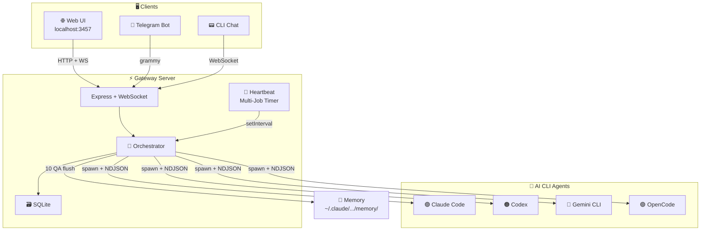
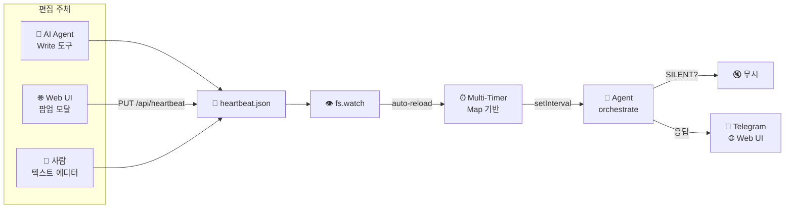
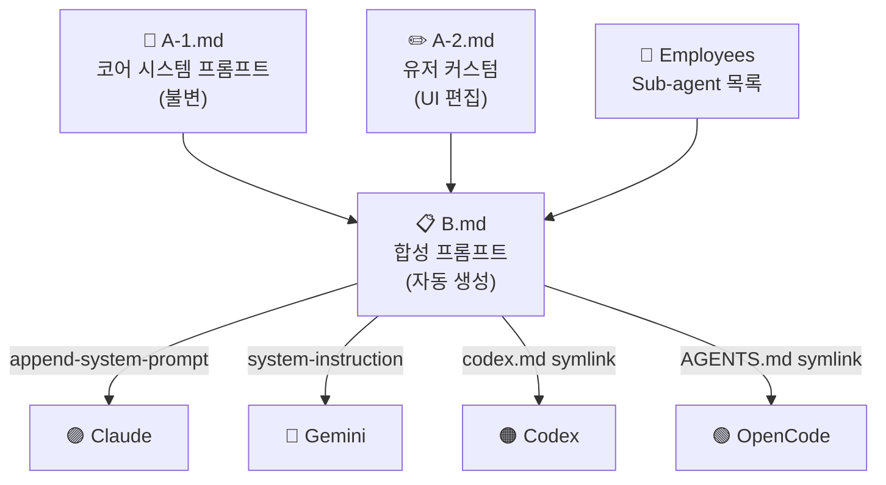

# 🦞 CLI-Claw

<div align="center">

**CLI 래핑 기반 AI 시스템 에이전트**

Claude Code · Codex · Gemini CLI를 단일 인터페이스로 제어

Web UI • Telegram • CLI 터미널에서 동시 접근

</div>

---

## Quick Start

```bash
git clone git@github.com:bitkyc08-arch/cli-claw.git
cd cli-claw && npm install

node bin/cli-claw.js init       # 초기 설정
node bin/cli-claw.js serve      # → http://localhost:3457
```

---

## Architecture



## Orchestration Flow

```mermaid
sequenceDiagram
    participant U as 사용자
    participant G as Gateway
    participant P as 🎯 Planning Agent
    participant S as 🔧 Sub-Agents

    U->>G: 메시지 전송
    G->>P: orchestrate(prompt)
    P->>P: 분석 + subtask 분배

    rect rgb(40, 40, 60)
        Note over P,S: 🔄 Multi-Round Loop
        P->>S: subtask 배분
        S-->>P: 결과 보고
        P->>P: 평가 (완료? 재시도?)
    end

    P-->>G: 최종 응답
    G-->>U: 📱 Telegram + 🌐 Web + 📟 CLI
```



## Heartbeat System



## Prompt Injection



---

## CLI Commands

```bash
cli-claw serve  [--port 3457] [--open]    # 서버 시작 (포그라운드)
cli-claw init   [--non-interactive]        # 초기 설정 마법사
cli-claw doctor [--json]                   # 설치/설정 진단
cli-claw chat   [--raw]                    # 터미널 채팅 (REPL / ndjson)
cli-claw status                            # 서버 상태 확인
```

## Data Paths

```
~/.cli-claw/
├── settings.json       ← 서버 설정
├── claw.db             ← 대화 히스토리 (SQLite)
├── heartbeat.json      ← 예약 작업 (AI + UI + 사람 편집)
├── .migrated-v1        ← 마이그레이션 마커
├── skills/             ← 에이전트 스킬
└── prompts/
    ├── A-1.md           ← 코어 프롬프트 (불변)
    ├── A-2.md           ← 유저 프롬프트 (UI 편집)
    ├── B.md             ← 합성 프롬프트 (자동)
    └── HEARTBEAT.md     ← 하트비트 체크리스트

~/.claude/projects/<hash>/memory/  ← Claude 네이티브 메모리 (자동 flush)
```

## Features

| 기능                 | 설명                                        |
| -------------------- | ------------------------------------------- |
| 🤖 **Multi-CLI**      | Claude, Codex, Gemini, OpenCode 동적 전환   |
| 🎯 **Orchestration**  | Planning agent → Sub-agent 배분 → 평가 루프 |
| 📱 **Telegram**       | 양방향 봇 연동 + typing indicator           |
| 💓 **Heartbeat**      | 다중 예약 작업, fs.watch 자동 리로드        |
| 🌐 **Web UI**         | 실시간 채팅 + 설정 + 에이전트 관리          |
| 📟 **CLI Chat**       | 터미널 REPL + `--raw` ndjson 파이프         |
| 🔗 **Symlink Infra**  | `.agents/skills/` 자동 연결 (postinstall)   |
| 🔄 **Session Resume** | CLI 세션 유지 + 컨텍스트 이어가기           |
| 🧠 **Memory**         | 10 QA 비동기 flush → Claude 메모리 저장     |
| 🩺 **Doctor**         | 설치 상태 자가 진단                         |

## API

| Method    | Path                         | Description               |
| --------- | ---------------------------- | ------------------------- |
| `GET`     | `/api/session`               | 세션 상태                 |
| `GET`     | `/api/messages`              | 메시지 히스토리           |
| `POST`    | `/api/message`               | 메시지 전송 → agent spawn |
| `POST`    | `/api/clear`                 | 메시지 초기화             |
| `GET/PUT` | `/api/settings`              | 설정 CRUD                 |
| `GET/PUT` | `/api/heartbeat`             | 하트비트 jobs CRUD        |
| `GET/PUT` | `/api/prompt`                | A-2 프롬프트              |
| `GET`     | `/api/cli-status`            | CLI 설치/인증 상태        |
| `GET`     | `/api/memory-files`          | 메모리 설정 + 파일 목록   |
| `GET/DEL` | `/api/memory-files/:file`    | 파일 열람/삭제            |
| `PUT`     | `/api/memory-files/settings` | 메모리 설정 변경          |

## Requirements

- **Node.js 22+**
- Claude Code / Codex / Gemini CLI 중 1개 이상 + 인증
- (선택) Telegram Bot Token — [@BotFather](https://t.me/BotFather)

## Roadmap

```mermaid
graph LR
    P1["✅ Phase 1-3<br/>Foundation"]
    P4["✅ Phase 4<br/>Web UI"]
    P5["✅ Phase 5<br/>Orchestration"]
    P6["✅ Phase 6<br/>Telegram"]
    P7["✅ Phase 7<br/>Integration"]
    P8["✅ Phase 8<br/>Heartbeat"]
    P9["✅ Phase 9<br/>CLI Package"]
    P10["⬜ Phase 10<br/>Photo Input"]
    P11["✅ Phase 11<br/>Memory"]

    P1 --> P4 --> P5 --> P6 --> P7 --> P8 --> P9 --> P10 --> P11

    style P1 fill:#2d6a4f
    style P4 fill:#2d6a4f
    style P5 fill:#2d6a4f
    style P6 fill:#2d6a4f
    style P7 fill:#2d6a4f
    style P8 fill:#2d6a4f
    style P9 fill:#2d6a4f
    style P10 fill:#555
    style P11 fill:#2d6a4f
```



---

<div align="center">
<sub>Built with 🦞 by CLI-Claw</sub>
</div>
