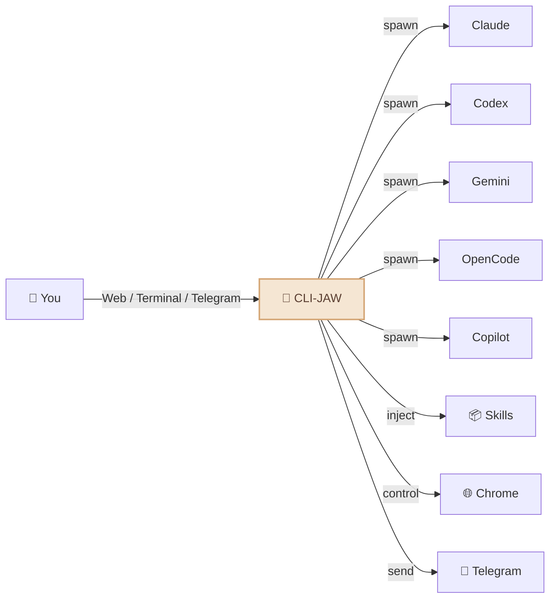
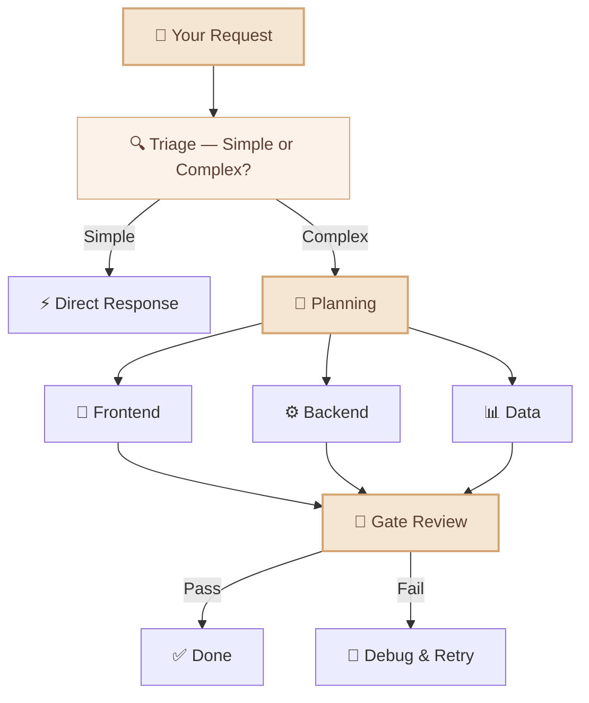
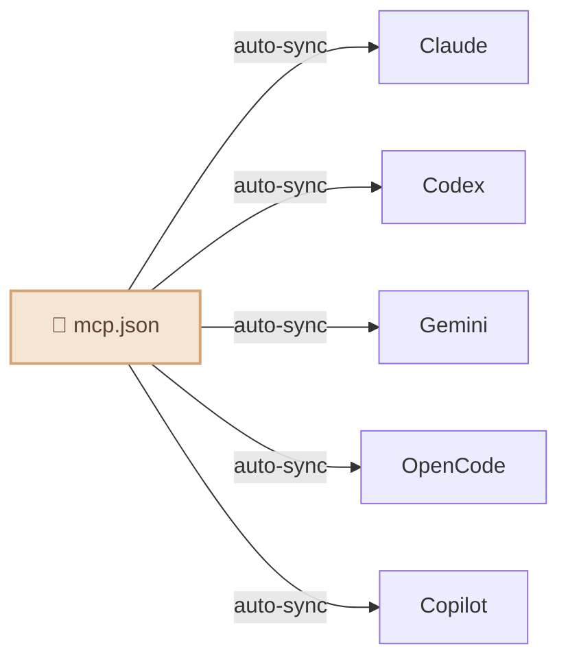

<div align="center">

# 🦈 CLI-JAW

### Your Personal AI Assistant — Powered by 5 AI Engines

*One assistant. Five brains. Always on.*

[](#-tests)
[](https://typescriptlang.org)
[](https://nodejs.org)
[](LICENSE)
[](https://npmjs.com/package/cli-jaw)

**English** / [한국어](README.ko.md) / [中文](README.zh-CN.md)


</div>

---

> ⚠️ **Installation Notice:** `npm install -g cli-jaw` runs a postinstall script that may modify your globally installed CLI skill directories (`~/.agents/skills/`, `~/.claude/skills/`), custom instructions (`~/AGENTS.md` → `~/CLAUDE.md` symlink), and MCP config (`~/.cli-jaw/mcp.json` → syncs to Claude/Codex/Gemini/OpenCode/Copilot). Existing configs are preserved and merged, not overwritten.

## What is CLI-JAW?

CLI-JAW is a **personal AI assistant** that lives on your machine and works from the interfaces you already use — **Web, Terminal, and Telegram**. Ask it anything, delegate tasks, automate your workflows.

> 💬 *"Summarize today's schedule"* → answer on Telegram  
> 💬 *"Refactor this module and write tests"* → sub-agents handle it while you grab coffee  
> 💬 *"Download that PDF and put the key points in Notion"* → browser + Notion skill, done

Unlike single-model assistants, CLI-JAW orchestrates **5 AI engines** (Claude, Codex, Gemini, OpenCode, Copilot) through their official CLIs — giving you the best of every provider in one unified experience. If one engine is busy, it automatically falls back to the next. 122 built-in skills handle everything from browser automation to document generation.

|                                | Why CLI-JAW?                                                                             |
| ------------------------------ | ---------------------------------------------------------------------------------------- |
| 🛡️ **TOS-Safe**                 | Uses official CLIs only — no API key scraping, no reverse engineering, no ban risk.      |
| 🤖 **Verified Agent Tools**     | 5 battle-tested coding agents (Claude, Codex, Gemini, OpenCode, Copilot) under one roof. |
| ⚡ **Multi-Agent Fallback**     | One engine down? The next picks up automatically. Zero downtime.                         |
| 🎭 **Orchestrated Performance** | Complex tasks split across specialized sub-agents for maximum throughput.                |
| 📦 **122 Built-in Skills**      | Browser automation, document generation, Telegram, memory — ready out of the box.        |
| 🖥️ **Cross-Platform**           | macOS, Linux, Windows (WSL) — browser launch, CLI detection, and install all work natively. |


---

## What can your assistant do?



- 🤖 **5 AI engines, 1 assistant** — Claude · Codex · Gemini · OpenCode · Copilot. Switch with `/cli`.
- ⚡ **Auto fallback** — If one engine is down, the next picks up seamlessly.
- 🎭 **Multi-agent orchestration** — Complex tasks get split across specialized sub-agents automatically.
- 📦 **122 skills** — Browser control, file editing, image generation, web search, and [much more](#-skill-system).
- 🧠 **Persistent memory** — Your assistant remembers past conversations and preferences across sessions.
- 📱 **Telegram bot** — Chat with your assistant from your phone, send voice/photos/files.
- 🌐 **Browser automation** — Your assistant can navigate the web, click, type, and screenshot.
- 🔌 **MCP ecosystem** — Install once, available to all 5 AI engines instantly.
- 🔍 **Web search** — Real-time information via MCP tools.
- ⏰ **Heartbeat jobs** — Schedule recurring tasks that run automatically.

---

## Quick Start

### Prerequisites

| Requirement           | Why                                     |
| --------------------- | --------------------------------------- |
| **Node.js ≥ 22**      | Runtime. [Download](https://nodejs.org) |
| **At least 1 AI CLI** | The engine that powers your assistant   |

> 🆓 **Free options:** [Copilot CLI](https://docs.github.com/en/copilot) (GitHub free tier) and [OpenCode](https://opencode.ai) have free models — no credit card needed.

### Install

```bash
# 1. Install globally
npm install -g cli-jaw

# 2. Run setup wizard (creates config, installs skills)
jaw init

# 3. Health check — see what's ready
jaw doctor
```

<details>
<summary>📋 Example <code>jaw doctor</code> output</summary>

```
🦈 CLI-JAW Doctor — 12 checks

 ✅ Node.js        v22.15.0
 ✅ npm             v10.9.4
 ✅ Claude CLI      installed
 ✅ Codex CLI       installed
 ⚠️ Gemini CLI      not found (optional)
 ✅ OpenCode CLI    installed
 ✅ Copilot CLI     installed
 ✅ Database        jaw.db OK
 ✅ Skills          17 active, 90 reference
 ✅ MCP             3 servers configured
 ✅ Memory          MEMORY.md exists
 ✅ Server          port 3457 available
```

</details>

### Authenticate your AI engines

```bash
# Pick whichever you have — even 1 is enough
claude auth          # Anthropic  (paid)
codex login          # OpenAI     (paid)
gemini               # Google     (first run triggers auth)
# OpenCode            # auto-auth on first run
# Copilot             # uses GitHub login (free tier available)
```

### Launch

```bash
jaw serve        # Web UI → http://localhost:3457
jaw launchd      # Auto-start on boot (macOS)
# — or —
jaw chat         # Terminal TUI (no browser needed)
```

> 💡 **You don't need all 5.** Even one CLI is enough to start. Your assistant auto-detects which engines are available and falls back gracefully.

---

## 📦 Skill System

**122 skills** out of the box — browser, github, notion, telegram, memory, pdf, image generation, and [much more](#).

<details>
<summary>View all skills</summary>

| Tier                 | Count | How it works                                              |
| -------------------- | :---: | --------------------------------------------------------- |
| **Active Skills**    |  17   | Auto-injected into every AI prompt. Always available.     |
| **Reference Skills** | 105   | AI reads them on-demand when you ask for a relevant task. |

#### Active Skills (always on)

| Skill                                                               | What it does                                              |
| ------------------------------------------------------------------- | --------------------------------------------------------- |
| `browser`                                                           | Chrome automation — snapshot, click, navigate, screenshot |
| `github`                                                            | Issues, PRs, CI, code review via `gh` CLI                 |
| `notion`                                                            | Create/manage Notion pages and databases                  |
| `memory`                                                            | Persistent long-term memory across sessions               |
| `telegram-send`                                                     | Send photos, documents, voice messages to Telegram        |
| `vision-click`                                                      | Screenshot → AI finds coordinates → clicks (one command)  |
| `imagegen`                                                          | Generate/edit images via OpenAI Image API                 |
| `pdf` / `docx` / `xlsx`                                             | Read, create, edit office documents                       |
| `screen-capture`                                                    | macOS screenshot and camera capture                       |
| `openai-docs`                                                       | Up-to-date OpenAI API documentation                       |
| `dev` / `dev-frontend` / `dev-backend` / `dev-data` / `dev-testing` | Development guidelines for sub-agents                     |

#### Reference Skills (on-demand)

88+ more skills ready to use — spotify, weather, deep-research, tts, video-downloader, apple-reminders, 1password, terraform, postgres, jupyter-notebook, sentry, whatsapp, and more.

```bash
jaw skill install <name>    # Activate a reference skill permanently
```

</details>

---

## 📱 Telegram — Your Assistant in Your Pocket

Your assistant isn't tied to your desk. Chat from anywhere via Telegram:

```
📱 Telegram ←→ 🦈 CLI-JAW ←→ 🤖 AI Engines
```

<details>
<summary>📋 Telegram setup (3 steps)</summary>

1. **Create a bot** — Message [@BotFather](https://t.me/BotFather) → `/newbot` → copy the token
2. **Configure** — Run `jaw init --telegram-token YOUR_TOKEN` or edit settings in the Web UI
3. **Start chatting** — Send any message to your bot. Your chat ID is auto-saved on first message.

</details>

**What you can do from Telegram:**
- 💬 Chat with your assistant (any of 5 AI engines)
- 🎤 Send voice messages (auto-transcribed)
- 📎 Send files and photos for processing
- ⚡ Run commands (`/cli`, `/model`, `/status`)
- 🔄 Switch AI engines on the fly

**What your assistant sends back:**
- AI responses with markdown formatting
- Generated images, PDFs, documents
- Scheduled task results (heartbeat jobs)
- Browser screenshots

<p align="center">
  
</p>

---

## 🎭 Multi-Agent Orchestration

For complex tasks, your assistant delegates work to specialized sub-agents:




Your assistant **decides by itself** whether a task needs orchestration or a direct response. No configuration needed.

---

## 🔌 MCP — One Config, Five AI Engines

```bash
jaw mcp install @anthropic/context7    # Install once
# → Automatically syncs to Claude, Codex, Gemini, OpenCode, Copilot
```



No more editing 5 different config files. Install once → all AI engines get it.

---

## ⌨️ CLI Commands

```bash
jaw serve                         # Start server
jaw chat                          # Terminal TUI
jaw doctor                        # Diagnostics (12 checks)
jaw skill install <name>          # Install a skill
jaw mcp install <package>         # Install MCP → syncs to all 5 CLIs
jaw memory search <query>         # Search memory
jaw browser start                 # Launch Chrome (CDP)
jaw browser vision-click "Login"  # AI-powered click
jaw clone ~/my-project            # Clone instance for a separate project
jaw --home ~/my-project serve --port 3458  # Run a second instance
jaw launchd                       # Auto-start on boot (macOS)
jaw launchd --port 3458           # Auto-start with custom port
jaw launchd status                # Check daemon status
jaw launchd unset                 # Remove auto-start
jaw reset                         # Full reset
```

---

## 🏗️ Multi-Instance — Separate Projects, Separate Contexts

Run multiple isolated instances of CLI-JAW — each with its own settings, memory, skills, and database.

```bash
# Clone your default instance to a new project
jaw clone ~/my-project

# Run it on a different port
jaw --home ~/my-project serve --port 3458

# Or auto-start both on boot
jaw launchd                                    # default → port 3457
jaw --home ~/my-project launchd --port 3458    # project → port 3458
```

Each instance is fully independent — different working directory, different memory, different MCP config. Perfect for separating work/personal contexts or per-project AI setups.

| Flag / Env             | What it does                                |
| ---------------------- | ------------------------------------------- |
| `--home <path>`        | Use a custom home directory for this run    |
| `--home=<path>`        | Same, with `=` syntax                       |
| `CLI_JAW_HOME=<path>`  | Set via environment variable                |
| `jaw clone <target>`   | Clone current instance to a new directory   |
| `--port <port>`        | Custom port for `serve` / `launchd`         |

---

## 🤖 Models

Each CLI comes with preconfigured presets, but you can type **any model ID** directly.

<details>
<summary>View all presets</summary>

| CLI          | Default                    | Notable Models                                  |
| ------------ | -------------------------- | ----------------------------------------------- |
| **Claude**   | `claude-sonnet-4-6`        | opus-4-6, haiku-4-5, extended thinking variants |
| **Codex**    | `gpt-5.3-codex`            | spark, 5.2, 5.1-max, 5.1-mini                   |
| **Gemini**   | `gemini-2.5-pro`           | 3.0-pro-preview, 3-flash-preview, 2.5-flash     |
| **OpenCode** | `claude-opus-4-6-thinking` | 🆓 big-pickle, GLM-5, MiniMax, Kimi, GPT-5-Nano  |
| **Copilot**  | `gpt-4.1` 🆓                | 🆓 gpt-5-mini, claude-sonnet-4.6, opus-4.6       |

</details>

> 🔧 To add models: edit `src/cli/registry.ts` — one file, auto-propagates everywhere.

---

## 🛠️ Development

<details>
<summary>Build, run, and project structure</summary>

```bash
# Build (TypeScript → JavaScript)
npm run build          # tsc → dist/

# Run from source (development)
npm run dev            # tsx server.ts (hot-reload friendly)
npx tsx bin/cli-jaw.ts serve   # Run CLI directly from .ts

# Run from build (production)
node dist/bin/cli-jaw.js serve
```

**Project structure:**

```
src/
├── agent/          # AI agent lifecycle & spawning
├── browser/        # Chrome CDP automation
├── cli/            # CLI registry & model presets
├── core/           # DB, config, logging
├── http/           # Express server & middleware
├── memory/         # Persistent memory system
├── orchestrator/   # Multi-agent orchestration pipeline
├── prompt/         # Prompt injection & AGENTS.md generation
├── routes/         # REST API endpoints (40+)
├── security/       # Input sanitization & guardrails
└── telegram/       # Telegram bot integration
```

> TypeScript with `strict: true`, `NodeNext` module resolution, targeting ES2022.

</details>

---

## 🧪 Tests

<details>
<summary>306 pass · 1 skipped · zero external dependencies</summary>

```bash
npm test
```

All tests run via `tsx --test` (native Node.js test runner + TypeScript).

</details>

---

## 📖 Documentation

| Document                                | What's inside                                         |
| --------------------------------------- | ----------------------------------------------------- |
| [ARCHITECTURE.md](docs/ARCHITECTURE.md) | System design, module graph, REST API (40+ endpoints) |
| [TESTS.md](TESTS.md)                    | Test coverage and test plan                           |

---

## ❓ Troubleshooting

<details>
<summary>Common issues</summary>

| Problem                      | Solution                                                                                    |
| ---------------------------- | ------------------------------------------------------------------------------------------- |
| `cli-jaw: command not found` | Run `npm install -g cli-jaw` again. Check `npm bin -g` is in your `$PATH`.                  |
| `Error: node version`        | Upgrade to Node.js ≥ 22: `nvm install 22` or download from [nodejs.org](https://nodejs.org) |
| Agent timeout / no response  | Run `jaw doctor` to check CLI auth. Re-authenticate with `claude auth` / `codex login`.     |
| `EADDRINUSE: port 3457`      | Another instance is running. Stop it or use `jaw serve --port 3458`.                        |
| Telegram bot not responding  | Check token with `jaw doctor`. Ensure `jaw serve` is running.                               |
| Skills not loading           | Run `jaw skill reset` then `jaw mcp sync`.                                                  |
| Browser commands fail        | Install Chrome/Chromium. Run `jaw browser start` first.                                     |

</details>

---

## 🤝 Contributing

Contributions are welcome! Here's how to get started:

1. Fork the repo and create your branch from `master`
2. Run `npm run build && npm test` to make sure everything works
3. Submit a PR — we'll review it promptly

> 📋 Found a bug or have a feature idea? [Open an issue](https://github.com/bitkyc08-arch/cli-jaw/issues)

---

<div align="center">

**⭐ If CLI-JAW helps you, give it a star — it means a lot!**

Made with ❤️ by the CLI-JAW community

[ISC License](LICENSE)

</div>
