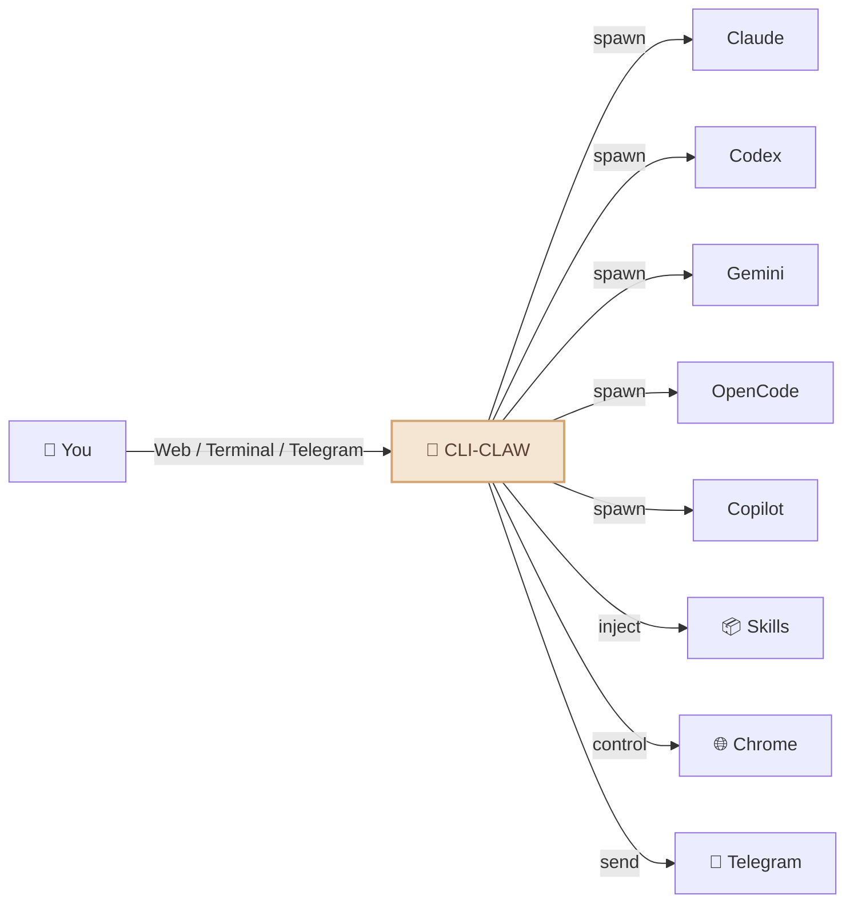
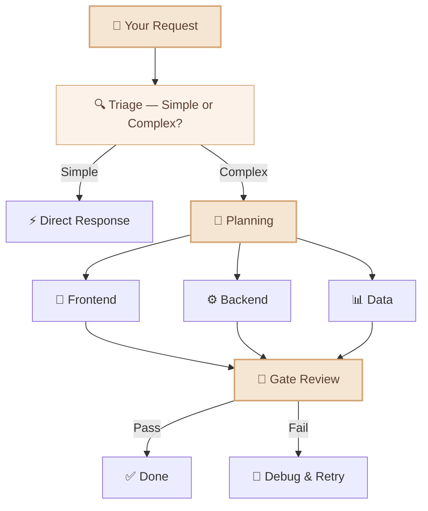
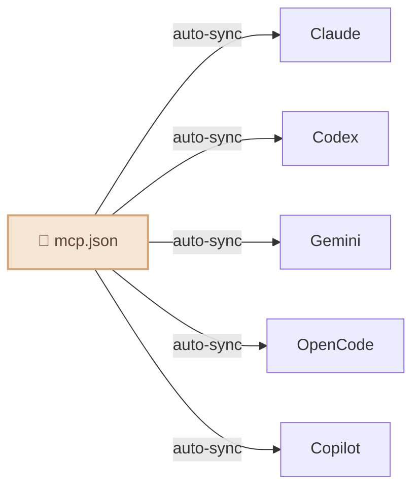

<div align="center">

# 🦞 CLI-CLAW

### Your Personal AI Assistant — Powered by 5 AI Engines

*One assistant. Five brains. Always on.*

[](#-tests)
[](https://typescriptlang.org)
[](https://nodejs.org)
[](LICENSE)

**English** / [한국어](README.ko.md) / [中文](README.zh-CN.md)


</div>

---

## What is CLI-CLAW?

CLI-CLAW is a **personal AI assistant** that lives on your machine and works from the interfaces you already use — **Web, Terminal, and Telegram**. Ask it anything, delegate tasks, automate your workflows.

> 💬 *"Summarize today's schedule"* → answer on Telegram  
> 💬 *"Refactor this module and write tests"* → sub-agents handle it while you grab coffee  
> 💬 *"Download that PDF and put the key points in Notion"* → browser + Notion skill, done

Unlike single-model assistants, CLI-CLAW orchestrates **5 AI engines** (Claude, Codex, Gemini, OpenCode, Copilot) through their official CLIs — giving you the best of every provider in one unified experience. If one engine is busy, it automatically falls back to the next. 107 built-in skills handle everything from browser automation to document generation.

| | Why CLI-CLAW? |
|---|---|
| 🛡️ **TOS-Safe** | Uses official CLIs only — no API key scraping, no reverse engineering, no ban risk. |
| 🤖 **Verified Agent Tools** | 5 battle-tested coding agents (Claude, Codex, Gemini, OpenCode, Copilot) under one roof. |
| ⚡ **Multi-Agent Fallback** | One engine down? The next picks up automatically. Zero downtime. |
| 🎭 **Orchestrated Performance** | Complex tasks split across specialized sub-agents for maximum throughput. |
| 📦 **107 Built-in Skills** | Browser automation, document generation, Telegram, memory — ready out of the box. |


---

## What can your assistant do?



- 🤖 **5 AI engines, 1 assistant** — Claude · Codex · Gemini · OpenCode · Copilot. Switch with `/cli`.
- ⚡ **Auto fallback** — If one engine is down, the next picks up seamlessly.
- 🎭 **Multi-agent orchestration** — Complex tasks get split across specialized sub-agents automatically.
- 📦 **107 skills** — Browser control, file editing, image generation, web search, and [much more](#-skill-system).
- 🧠 **Persistent memory** — Your assistant remembers past conversations and preferences across sessions.
- 📱 **Telegram bot** — Chat with your assistant from your phone, send voice/photos/files.
- 🌐 **Browser automation** — Your assistant can navigate the web, click, type, and screenshot.
- 🔌 **MCP ecosystem** — Install once, available to all 5 AI engines instantly.
- 🔍 **Web search** — Real-time information via MCP tools.
- ⏰ **Heartbeat jobs** — Schedule recurring tasks that run automatically.

---

## Quick Start

```bash
# Install (sets up everything: 5 CLIs, MCP, 105+ skills)
npm install -g cli-claw

# Authenticate whichever CLIs you want (even 1 is enough)
claude auth          # Anthropic
codex login          # OpenAI
gemini               # Google (first run)

# Go
cli-claw doctor      # Check what's installed (12 checks)
cli-claw serve       # Web UI → http://localhost:3457
cli-claw chat        # Or use terminal TUI
```

> 💡 **You don't need all 5.** Even one CLI is enough to start. Copilot and OpenCode have free tiers.

---

## 📦 Skill System

**107 skills** out of the box — browser, github, notion, telegram, memory, pdf, image generation, and [much more](#).

<details>
<summary>View all skills</summary>

| Tier | Count | How it works |
|------|:-----:|--------------|
| **Active Skills** | 17 | Auto-injected into every AI prompt. Always available. |
| **Reference Skills** | 90 | AI reads them on-demand when you ask for a relevant task. |

#### Active Skills (always on)

| Skill | What it does |
|-------|-------------|
| `browser` | Chrome automation — snapshot, click, navigate, screenshot |
| `github` | Issues, PRs, CI, code review via `gh` CLI |
| `notion` | Create/manage Notion pages and databases |
| `memory` | Persistent long-term memory across sessions |
| `telegram-send` | Send photos, documents, voice messages to Telegram |
| `vision-click` | Screenshot → AI finds coordinates → clicks (one command) |
| `imagegen` | Generate/edit images via OpenAI Image API |
| `pdf` / `docx` / `xlsx` | Read, create, edit office documents |
| `screen-capture` | macOS screenshot and camera capture |
| `openai-docs` | Up-to-date OpenAI API documentation |
| `dev` / `dev-frontend` / `dev-backend` / `dev-data` / `dev-testing` | Development guidelines for sub-agents |

#### Reference Skills (on-demand)

88+ more skills ready to use — spotify, weather, deep-research, tts, video-downloader, apple-reminders, 1password, terraform, postgres, jupyter-notebook, sentry, and more.

```bash
cli-claw skill install <name>    # Activate a reference skill permanently
```

</details>

---

## 📱 Telegram — Your Assistant in Your Pocket

Your assistant isn't tied to your desk. Chat from anywhere via Telegram:

```
📱 Telegram ←→ 🦞 CLI-CLAW ←→ 🤖 AI Engines
```

**What you can do from Telegram:**
- 💬 Chat with your assistant (any of 5 AI engines)
- 🎤 Send voice messages (auto-transcribed)
- 📎 Send files and photos for processing
- ⚡ Run commands (`/cli`, `/model`, `/status`)
- 🔄 Switch AI engines on the fly

**What your assistant sends back:**
- AI responses with markdown formatting
- Generated images, PDFs, documents
- Scheduled task results (heartbeat jobs)
- Browser screenshots

<p align="center">
  
</p>

---

## 🎭 Multi-Agent Orchestration

For complex tasks, your assistant delegates work to specialized sub-agents:




Your assistant **decides by itself** whether a task needs orchestration or a direct response. No configuration needed.

---

## 🔌 MCP — One Config, Five AI Engines

```bash
cli-claw mcp install @anthropic/context7    # Install once
# → Automatically syncs to Claude, Codex, Gemini, OpenCode, Copilot
```



No more editing 5 different config files. Install once → all AI engines get it.

---

## ⌨️ CLI Commands

```bash
cli-claw serve                         # Start server
cli-claw chat                          # Terminal TUI
cli-claw doctor                        # Diagnostics (12 checks)
cli-claw skill install <name>          # Install a skill
cli-claw mcp install <package>         # Install MCP → syncs to all 5 CLIs
cli-claw memory search <query>         # Search memory
cli-claw browser start                 # Launch Chrome (CDP)
cli-claw browser vision-click "Login"  # AI-powered click
cli-claw reset                         # Full reset
```

---

## 🤖 Models

Each CLI comes with preconfigured presets, but you can type **any model ID** directly.

<details>
<summary>View all presets</summary>

| CLI | Default | Notable Models |
|-----|---------|----------------|
| **Claude** | `claude-sonnet-4-6` | opus-4-6, haiku-4-5, extended thinking variants |
| **Codex** | `gpt-5.3-codex` | spark, 5.2, 5.1-max, 5.1-mini |
| **Gemini** | `gemini-2.5-pro` | 3.0-pro-preview, 3-flash-preview, 2.5-flash |
| **OpenCode** | `claude-opus-4-6-thinking` | 🆓 big-pickle, GLM-5, MiniMax, Kimi, GPT-5-Nano |
| **Copilot** | `gpt-4.1` 🆓 | 🆓 gpt-5-mini, claude-sonnet-4.6, opus-4.6 |

</details>

> 🔧 To add models: edit `src/cli/registry.ts` — one file, auto-propagates everywhere.

---

## 🛠️ Development

<details>
<summary>Build, run, and project structure</summary>

```bash
# Build (TypeScript → JavaScript)
npm run build          # tsc → dist/

# Run from source (development)
npm run dev            # tsx server.ts (hot-reload friendly)
npx tsx bin/cli-claw.ts serve   # Run CLI directly from .ts

# Run from build (production)
node dist/bin/cli-claw.js serve
```

**Project structure:**

```
src/
├── agent/          # AI agent lifecycle & spawning
├── browser/        # Chrome CDP automation
├── cli/            # CLI registry & model presets
├── core/           # DB, config, logging
├── http/           # Express server & middleware
├── memory/         # Persistent memory system
├── orchestrator/   # Multi-agent orchestration pipeline
├── prompt/         # Prompt injection & AGENTS.md generation
├── routes/         # REST API endpoints (40+)
├── security/       # Input sanitization & guardrails
└── telegram/       # Telegram bot integration
```

> TypeScript with `strict: true`, `NodeNext` module resolution, targeting ES2022.

</details>

---

## 🧪 Tests

<details>
<summary>252 pass · 1 skipped · zero external dependencies</summary>

```bash
npm test
```

All tests run via `tsx --test` (native Node.js test runner + TypeScript).

</details>

---

## 📖 Documentation

| Document | What's inside |
|----------|---------------|
| [ARCHITECTURE.md](docs/ARCHITECTURE.md) | System design, module graph, REST API (40+ endpoints) |
| [TESTS.md](TESTS.md) | Test coverage and test plan |

---

## 🤝 Contributing

Contributions are welcome! Here's how to get started:

1. Fork the repo and create your branch from `main`
2. Run `npm run build && npm test` to make sure everything works
3. Submit a PR — we'll review it promptly

> 📋 Found a bug or have a feature idea? [Open an issue](https://github.com/cli-claw/cli-claw/issues)

---

<div align="center">

**⭐ If CLI-CLAW helps you, give it a star — it means a lot!**

Made with ❤️ by the CLI-CLAW community

[ISC License](LICENSE)

</div>
