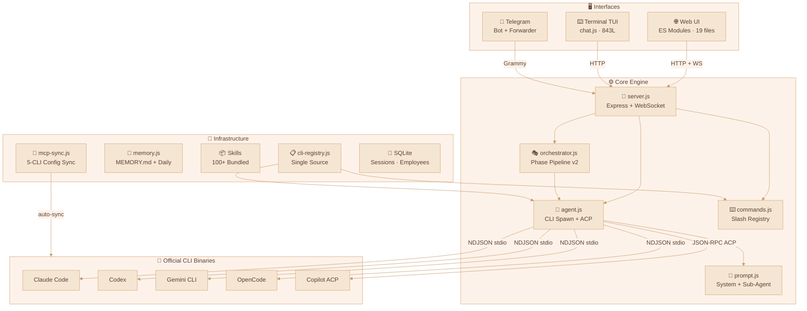
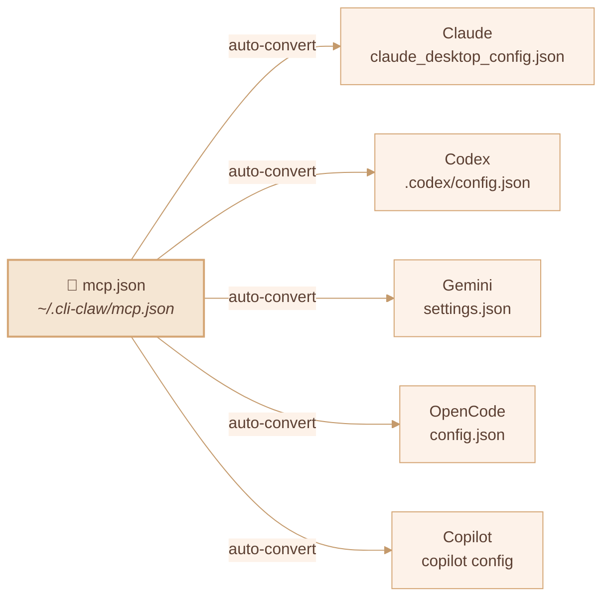
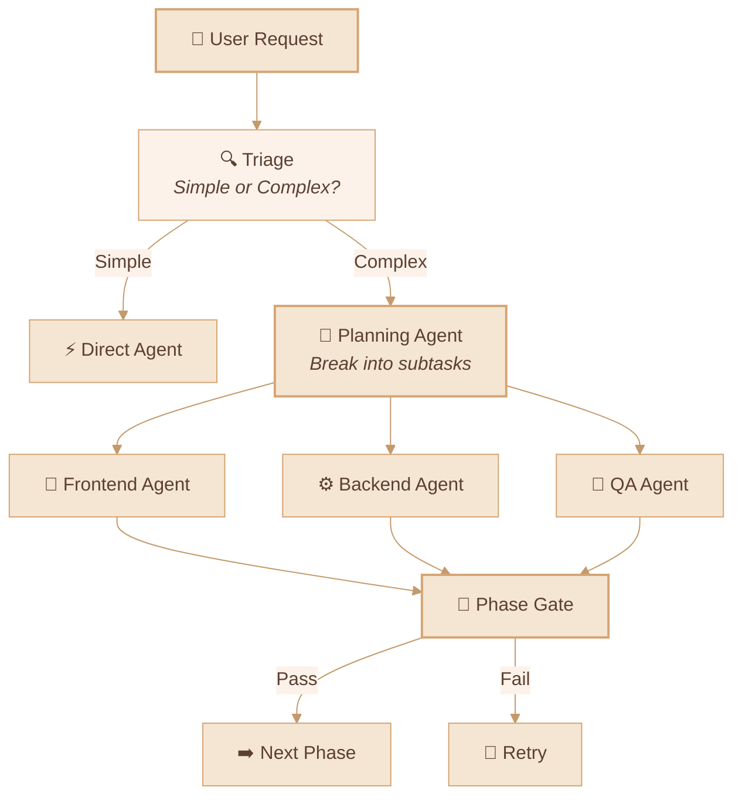

<div align="center">

# 🦞 CLI-CLAW

### Unified AI Agent Orchestration Platform

*One interface. Five CLIs. Zero API bans.*

[](#tests)
[](https://nodejs.org)
[](LICENSE)

**[English](#-overview)** · **[한국어](#-개요)** · **[中文](#-概述)**

<!-- 
  📸 Screenshot placeholder — replace with actual screenshot
   
-->

</div>

---

## 🌟 Overview

**CLI-CLAW** orchestrates multiple AI coding agents through their **official CLI interfaces** — not reverse-engineered APIs. This means:

> 🛡️ **No API key bans. No rate limit workarounds. No TOS violations.**
> 
> Every Claude, Codex, Gemini, OpenCode, and Copilot interaction goes through the same binary that official tools use. Your account stays safe.

CLI-CLAW provides a unified **Web UI**, **Terminal TUI**, and **Telegram bot** to manage them all — with sub-agent orchestration, persistent memory, 100+ skills, MCP server sync, and browser automation built in.

<!-- 
  📸 Web UI screenshot placeholder
   
-->

---

## ✨ Key Strengths

### 🔒 CLI-Native = Ban-Proof

Unlike API wrappers or proxy solutions, CLI-CLAW spawns **official CLI binaries** (`claude`, `codex`, `gemini`, `opencode`, `copilot --acp`). Each CLI handles its own authentication, rate limiting, and session management. **You cannot be banned for using your own CLI.**

### 🔄 5 CLI × Unified Interface

Switch between Claude, Codex, Gemini, OpenCode, and Copilot with a single `/cli` command. Automatic **fallback chains** — if Claude is busy, route to Codex, then Gemini.

### 🎭 Sub-Agent Orchestration v2

Dispatch tasks to role-based agents (frontend, backend, QA, DevOps) with **5-phase pipeline**: Planning → Verification → Development → Debugging → Integration Testing.

### 🧩 MCP Sync Across All CLIs

One `mcp.json` → automatically converts and syncs to all 5 CLI config formats. Install once, use everywhere.

---

## 🏗️ Architecture



<!-- 
  📸 Architecture diagram screenshot placeholder (for GitHub dark mode fallback)
   
-->

---

## 🚀 Quick Start

```bash
# Install globally
npm install -g cli-claw

# Start the server (Web UI + API)
cli-claw serve
# → http://localhost:3457

# Or use the terminal TUI
cli-claw chat
```

---

## 📋 Feature Status

### ✅ Implemented

| Feature | Description | Complexity |
|---------|-------------|:----------:|
| **Multi-CLI Engine** | Claude, Codex, Gemini, OpenCode, Copilot — unified spawn | ⭐⭐⭐⭐ |
| **Copilot ACP** | JSON-RPC 2.0 over stdio, real-time streaming | ⭐⭐⭐⭐ |
| **Orchestration v2** | Triage → role dispatch → 5-phase pipeline → gate reviews | ⭐⭐⭐⭐⭐ |
| **MCP Sync** | `mcp.json` → 5 CLI formats auto-conversion + symlink protection | ⭐⭐⭐⭐ |
| **Skill System** | 100+ bundled skills, 2×3 classification (Active/Reference) | ⭐⭐⭐ |
| **CLI Registry** | Single source of truth — add CLI/model in one file, auto-propagate | ⭐⭐⭐ |
| **Slash Commands** | Unified across CLI/Web/Telegram with autocomplete + dropdowns | ⭐⭐⭐ |
| **Telegram Bot** | Bidirectional forwarding, origin-based routing, lifecycle mgmt | ⭐⭐⭐⭐ |
| **Persistent Memory** | `MEMORY.md` + daily auto-log + session flush + prompt injection | ⭐⭐⭐ |
| **Browser Automation** | Chrome CDP: snapshot, click, navigate, screenshot | ⭐⭐⭐ |
| **Vision Click** | Screenshot → AI coordinate → DPR correction → click (one command) | ⭐⭐⭐⭐ |
| **Heartbeat** | Scheduled auto-execution with active hours + quiet hours | ⭐⭐ |
| **Fallback Chains** | `claude → codex → gemini` automatic retry on failure | ⭐⭐⭐ |
| **Event Deduplication** | Claude `stream_event`/`assistant` overlap prevention | ⭐⭐⭐ |
| **65 Unit Tests** | `node:test` — zero dependencies, events + telegram + registry | ⭐⭐ |

### 🔜 Planned

| Feature | Description | Priority |
|---------|-------------|:--------:|
| **Vector DB Memory** | Embedding-based semantic retrieval (replacing grep) | 📋 |
| **Vision Multi-Provider** | Extend vision-click beyond Codex (Claude, Gemini) | 📋 |
| **Voice STT** | Telegram voice-to-text skill integration | 📋 |
| **Skill Marketplace** | Community skill sharing + versioning | 💭 |

---

## 🔌 MCP — Model Context Protocol



```bash
cli-claw mcp                        # List registered MCP servers
cli-claw mcp install <package>      # Install + register + sync
cli-claw mcp sync                   # Sync mcp.json → all 5 CLIs
cli-claw mcp reset [--force]        # Reset + re-sync
```

> Install an MCP server once, and it's available to **all five CLIs** instantly.

---

## 🎭 Sub-Agent Orchestration



Five orchestration phases with worklog tracking:

| Phase | Name | Description |
|:-----:|------|-------------|
| 1 | 기획 (Planning) | Task decomposition + agent assignment |
| 2 | 기획검증 (Plan Review) | Feasibility check + resource validation |
| 3 | 개발 (Development) | Parallel agent execution |
| 4 | 디버깅 (Debugging) | Error resolution + test fixes |
| 5 | 통합검증 (Integration) | End-to-end validation + merge |

---

## ⌨️ CLI Commands

```bash
# Server & UI
cli-claw serve                      # Start server (http://localhost:3457)
cli-claw chat                       # Terminal TUI (3 modes, autocomplete)
cli-claw init                       # Setup wizard
cli-claw doctor                     # Diagnostics (11 checks, --json)
cli-claw status                     # Server status (--json)

# Skills
cli-claw skill                      # List installed skills
cli-claw skill install <name>       # Install from Codex / skills_ref / GitHub
cli-claw skill remove <name>        # Remove
cli-claw skill reset [--force]      # Reset (re-classify 100+ skills)

# Memory
cli-claw memory search <query>      # Search across memory files
cli-claw memory list                # List all memory files
cli-claw memory read <file>         # Read specific file

# Browser
cli-claw browser start              # Launch Chrome (CDP)
cli-claw browser snapshot           # Accessibility tree
cli-claw browser screenshot         # Capture screenshot
cli-claw browser vision-click "Login"  # AI-powered click (DPR auto-correction)

# Management
cli-claw employee reset             # Reset to default 5 agents
cli-claw reset                      # Full reset (MCP/skills/employees/session)
```

---

## 🤖 Supported Models

<details>
<summary><b>Claude Code</b></summary>

| Model | Description |
|-------|-------------|
| `claude-sonnet-4-6` | Default — fast, capable |
| `claude-opus-4-6` | Most powerful |
| `claude-sonnet-4-6[1m]` | Extended thinking (Sonnet) |
| `claude-opus-4-6[1m]` | Extended thinking (Opus) |
| `claude-haiku-4-5-20251001` | Fast, lightweight |

</details>

<details>
<summary><b>Codex</b></summary>

| Model | Description |
|-------|-------------|
| `gpt-5.3-codex` | Default — latest |
| `gpt-5.3-codex-spark` | Lightweight |
| `gpt-5.2-codex` | Previous generation |
| `gpt-5.1-codex-max` | High context |
| `gpt-5.1-codex-mini` | Budget |

</details>

<details>
<summary><b>Gemini CLI</b></summary>

| Model | Description |
|-------|-------------|
| `gemini-3.0-pro-preview` | Latest preview |
| `gemini-3.1-pro-preview` | Next gen preview |
| `gemini-2.5-pro` | Default — stable |
| `gemini-3-flash-preview` | Fast preview |
| `gemini-2.5-flash` | Fastest |

</details>

<details>
<summary><b>OpenCode</b> (includes free models)</summary>

| Model | Description |
|-------|-------------|
| `anthropic/claude-opus-4-6-thinking` | Default |
| `anthropic/claude-sonnet-4-6-thinking` | Sonnet thinking |
| `opencode/big-pickle` | 🆓 Free |
| `opencode/GLM-5 Free` | 🆓 Free |
| `opencode/MiniMax M2.5 Free` | 🆓 Free |
| `opencode/Kimi K2.5 Free` | 🆓 Free |
| `opencode/GPT 5 Nano Free` | 🆓 Free |

</details>

<details>
<summary><b>Copilot (ACP)</b> — includes free tier</summary>

| Model | Cost | Description |
|-------|:----:|-------------|
| `gpt-4.1` | 🆓 | Default free model |
| `gpt-5-mini` | 🆓 | Free mini |
| `claude-haiku-4.5` | 0.33x | Budget Claude |
| `claude-sonnet-4.6` | 1x | Default — capable |
| `gpt-5.3-codex` | 1x | Latest Codex |
| `claude-opus-4.6` | 3x | Most powerful |

</details>

> 💡 Type any model ID directly — CLI-CLAW accepts custom model inputs.
>
> 🔧 Adding a new CLI or model? Edit `src/cli-registry.js` — **one file, auto-propagates everywhere.**

---

## 🧪 Tests

```bash
npm test                            # All 65 tests
node --test tests/unit/*.test.js    # Unit tests only
npm run test:watch                  # Watch mode
```

| Test File | Coverage |
|-----------|----------|
| `events.test.js` | NDJSON parser, session ID, tool labels, ACP events |
| `events-acp.test.js` | ACP `session/update` — 5 event types |
| `telegram-forwarding.test.js` | Origin filter, fallback, chunking, markdown |
| `cli-registry.test.js` | Structure, defaults, model choices |
| `bus.test.js` | Broadcast, listeners, WS mock |
| `commands-parse.test.js` | parseCommand, executeCommand, completions |
| `worklog.test.js` | Phases, pending agent parser |

---

## 📡 REST API

<details>
<summary><b>40+ endpoints</b></summary>

| Category | Endpoints |
|----------|-----------|
| Core | `GET /api/session`, `POST /api/message`, `POST /api/stop` |
| Registry | `GET /api/cli-registry` — CLI/model single source |
| Orchestration | `POST /api/orchestrate/continue`, `POST /api/employees/reset` |
| Commands | `POST /api/command`, `GET /api/commands?interface=` |
| Settings | `GET/PUT /api/settings`, `GET/PUT /api/prompt` |
| Memory | `GET/POST /api/memory`, `GET /api/claw-memory/search` |
| MCP | `GET/PUT /api/mcp`, `POST /api/mcp/sync,install,reset` |
| Skills | `GET /api/skills`, `POST /api/skills/enable,disable` |
| Browser | `POST /api/browser/start,stop,act,navigate,screenshot` |
| Employees | `GET/POST /api/employees`, `PUT/DELETE /api/employees/:id` |
| Quota | `GET /api/quota` (Claude/Codex/Gemini/Copilot usage) |

</details>

---

## 📜 License

ISC

---

<div align="center">

<br/>

# 🦞 CLI-CLAW

</div>

---

## 🌟 개요

**CLI-CLAW**는 여러 AI 코딩 에이전트를 **공식 CLI 인터페이스**를 통해 오케스트레이션하는 통합 플랫폼입니다.

> 🛡️ **API 키 차단 없음. 레이트 리밋 우회 없음. TOS 위반 없음.**
> 
> Claude, Codex, Gemini, OpenCode, Copilot 모든 상호작용이 공식 바이너리를 통해 이루어집니다. 계정이 안전합니다.

### 핵심 강점

- **🔒 CLI 네이티브 = 차단 불가** — 공식 CLI 바이너리를 직접 스폰하므로 API 래퍼와 달리 계정 차단 위험이 없습니다
- **🔄 5개 CLI 통합** — `/cli` 한 줄로 Claude ↔ Codex ↔ Gemini ↔ OpenCode ↔ Copilot 전환
- **🎭 서브에이전트 오케스트레이션 v2** — 5단계 파이프라인 (기획 → 기획검증 → 개발 → 디버깅 → 통합검증)
- **🔌 MCP 5개 CLI 동기화** — `mcp.json` 하나로 5개 CLI 설정 자동 변환
- **📦 100+ 내장 스킬** — 2×3 분류 (Active/Reference)
- **🧠 영속 메모리** — 대화 자동 요약 + 장기 기억 + 프롬프트 주입
- **📱 텔레그램 봇** — 양방향 포워딩 + origin 기반 라우팅

### ✅ 구현됨 vs 🔜 예정

| 구현됨 | 예정 |
|--------|------|
| Multi-CLI 엔진 (5종) | Vector DB 메모리 |
| Copilot ACP (JSON-RPC) | Vision 멀티프로바이더 |
| 오케스트레이션 v2 | 음성 STT 스킬 |
| MCP 5-target 동기화 | 스킬 마켓플레이스 |
| 65개 단위 테스트 | |

> 상세 내용은 영문 README를 참조하세요.

---

<div align="center">

<br/>

# 🦞 CLI-CLAW

</div>

---

## 🌟 概述

**CLI-CLAW** 通过 **官方 CLI 接口** 编排多个 AI 编程代理 — 而非逆向工程 API。这意味着：

> 🛡️ **无 API 密钥封禁。无速率限制绕过。无违反服务条款。**
> 
> Claude、Codex、Gemini、OpenCode、Copilot 的所有交互都通过官方二进制文件进行。您的账户始终安全。

### 核心优势

- **🔒 CLI 原生 = 防封禁** — 直接调用官方 CLI 二进制文件，不同于 API 包装器，不存在封号风险
- **🔄 5 CLI 统一接口** — 一个 `/cli` 命令切换 Claude ↔ Codex ↔ Gemini ↔ OpenCode ↔ Copilot
- **🎭 子代理编排 v2** — 5 阶段流水线：规划 → 验证 → 开发 → 调试 → 集成测试
- **🔌 MCP 5 CLI 同步** — 一个 `mcp.json`，自动转换并同步到所有 5 个 CLI 配置
- **📦 100+ 内置技能** — 2×3 分类（活跃/参考）
- **🧠 持久记忆** — 会话自动摘要 + 长期记忆 + 提示注入
- **📱 Telegram 机器人** — 双向转发 + 来源路由

### ✅ 已实现 vs 🔜 计划中

| 已实现 | 计划中 |
|--------|--------|
| Multi-CLI 引擎（5种） | Vector DB 记忆 |
| Copilot ACP (JSON-RPC) | Vision 多提供商 |
| 编排 v2 | 语音 STT 技能 |
| MCP 5-target 同步 | 技能市场 |
| 65 个单元测试 | |

> 详细内容请参阅英文 README。
