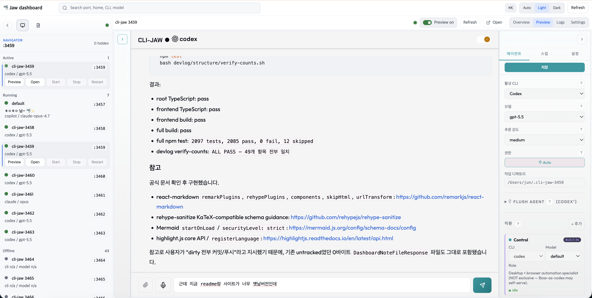

<div align="center">

# CLI-JAW

### Stop juggling AI coding tools. Use all of them at once.

[](https://npmjs.com/package/cli-jaw)
[](https://github.com/lidge-jun/cli-jaw/releases)
[](https://typescriptlang.org)
[](https://nodejs.org)
[](LICENSE)
[](#-docker)

**English** / [한국어](README.ko.md) / [中文](README.zh-CN.md) / [日本語](README.ja.md)



</div>

---

## What is CLI-JAW?

CLI-JAW is an open-source platform that unifies the AI coding CLIs you already use — Claude, Codex, Codex App, Gemini CLI, Grok CLI, OpenCode, Copilot CLI — into one assistant with one memory and one dashboard. Your main CLI calls the others as "employees" (sub-agents), so you stop copy-pasting between heavy apps and start giving orders from a single place.

It routes through the subscriptions you already pay for. No per-token API billing. No rate limits on top of what you already have.

One developer is managing 100k+ lines of code with this thing. It's basically a super-app: multi-instance manager + mini-Obsidian notes + Kanban board + browser automation, running locally on your machine.

---

## What's New in 2.0.0

This is the general availability release. Here's what landed:

| Feature | What it means |
|---|---|
| **Manager Dashboard** | A super-app control plane. See every running JAW instance, start/stop/restart them, preview live Web UIs, inspect settings — all from one browser tab |
| **Notes Workspace** | A mini-Obsidian baked into the dashboard. Folders, rename/move, split editor+preview, KaTeX math, Mermaid diagrams, syntax-highlighted code blocks |
| **Kanban Board** | Drag running instances into lanes. Card editor for tracking what each instance is working on |
| **Employee System** | Your main CLI dispatches other CLIs as workers. "Fix the frontend" goes to OpenCode. "Update the API" goes to Codex. You approve the results |
| **Responsive Mobile Layout** | Sidebar overlay, touch-friendly controls. Manage your fleet from your phone |

Plus: explicit PABCD orchestration (`/orchestrate`, `/pabcd`, `/continue`), 230+ reference skills, SQLite FTS5 memory search, cron/every heartbeat jobs, and Computer Use desktop automation.

---

## Recent Architecture Updates

| Area | Update |
|---|---|
| **PABCD** | Worklog resume is explicit: use `/continue`. Natural language “continue” stays a normal prompt |
| **Gemini CLI** | Full-access Gemini runs use `--skip-trust --approval-mode yolo` plus `--include-directories` for OS home access; WSL also includes the Windows user home when discoverable |
| **Grok CLI** | `grok-build` is supported as a standard CLI runtime with streaming-json parsing. `--effort` is deliberately disabled for `grok-build` because the server rejects `reasoningEffort` even though the CLI help lists the flag |
| **Claude E** | The experimental `claude-i` provider now runs through the `claude-e` package/runtime. Detection honors `CLAUDE_E_BIN`, bundled npm `claude-e`, PATH `claude-e`, then compatibility `claude-exec` / `jaw-claude-i` / `claude-i` fallbacks |
| **Messaging** | `/api/channel/send` is the canonical Telegram/Discord outbound path; legacy channel-specific endpoints remain |
| **Heartbeat** | Jobs support `every` and `cron` schedules with optional IANA time zones |
| **Browser web-AI** | Runtime diagnostics/orphan cleanup, persistent tab lifecycle, session reattach, and ChatGPT/Gemini/Grok vendor paths are documented in `structure/` |
| **OfficeCLI** | Office skills now treat HWP/HWPX separately: HWPX is a stable primary path, while binary HWP is rhwp sidecar-gated through `officecli hwp doctor --json` and `officecli capabilities --json` |
| **Release gates** | `npm run gate:all` runs named release/doc parity checks when developing locally |

---

## Two-Line Install

Existing users who already manage Codex, Gemini, Claude, MCP servers, OfficeCLI, or other tools can run a safe update first. Safe install creates `~/.cli-jaw` only, skips optional tool/runtime setup, and lets you run `jaw init` later when you want interactive setup.

```bash
# macOS/Linux safe update
JAW_SAFE=1 npm install -g cli-jaw
```

```powershell
# Windows PowerShell safe update
$env:JAW_SAFE="1"; npm install -g cli-jaw
```

Normal install performs the full setup:

```bash
npm install -g cli-jaw
jaw dashboard
```

That's it. Open **http://localhost:3457**. Requires Node.js 22+.

> `jaw serve` also works if you prefer the classic server mode.
>
> Auto-start on boot: `jaw service install` (auto-detects systemd / launchd / Docker).

---

## Platform Setup

<details>
<summary><b>macOS</b> — one-click script</summary>

1. Open **Terminal** (`Cmd + Space` → type `Terminal`)
2. Paste and hit Enter:

```bash
curl -fsSL https://raw.githubusercontent.com/lidge-jun/cli-jaw/master/scripts/install.sh | bash
```

3. Authenticate (see below) and launch:

```bash
jaw dashboard
```

</details>

<details>
<summary><b>Windows / WSL</b> — one-click script</summary>

**Step 1: Install WSL** (PowerShell as Admin)

```powershell
wsl --install
```

Restart, then open **Ubuntu** from the Start Menu.

**Step 2: Install CLI-JAW**

```bash
curl -fsSL https://raw.githubusercontent.com/lidge-jun/cli-jaw/master/scripts/install-wsl.sh | bash
```

**Step 3: Reload and start**

```bash
source ~/.bashrc
jaw dashboard
```

The installer uses the user-local npm prefix (`~/.local`) and writes
`~/.local/bin` to both `~/.bashrc` and `~/.profile`, so new Ubuntu shells can
find `jaw` and the bundled CLI tools.

The WSL script is the integrated Linux setup path: it verifies `jaw --version`,
requests bundled CLI tools in strict mode, installs OfficeCLI, and verifies
`officecli --version` before reporting success. Browser support is checked after
Chromium/Windows Chrome detection; if no runnable browser is found, the installer
prints a warning instead of pretending web-ai/browser automation is fully ready.

<details>
<summary>WSL Troubleshooting</summary>

| Problem | Fix |
|---|---|
| `unzip: command not found` | Rerun the installer |
| `jaw: command not found` | Run `source ~/.bashrc` or `export PATH="$HOME/.local/bin:$PATH"` |
| `officecli: command not found` | Rerun the WSL installer or `bash "$(npm root -g)/cli-jaw/scripts/install-officecli.sh"` |
| Permission errors | `sudo chown -R $USER $(npm config get prefix)` |

</details>
</details>

<details>
<summary><b>Linux</b></summary>

You know what to do.

```bash
npm install -g cli-jaw
jaw dashboard
```

Generic Linux `npm install -g cli-jaw` keeps optional helper installs
best-effort for compatibility. Use the WSL one-click script when you want the
stricter integrated setup guarantees, or verify manually with:

```bash
jaw --version
officecli --version
jaw doctor
```

</details>

---

## Authenticate

You only need **one**. Pick whichever subscription you already have:

```bash
# Free options
copilot login        # GitHub Copilot (free tier available)
opencode             # OpenCode — free models available

# Paid (monthly subscription you already pay for)
claude auth login    # Anthropic Claude Max
codex login          # OpenAI ChatGPT Pro
gemini               # Google Gemini Advanced
grok login --oauth   # xAI Grok / Grok Heavy
```

Check everything at once: `claude auth status && jaw doctor`

<details>
<summary>Example jaw doctor output</summary>

```
🦈 CLI-JAW Doctor — 12 checks

 ✅ Node.js        v22.15.0
 ✅ Claude CLI      installed
 ✅ Codex CLI       installed
 ⚠️ Gemini CLI      not found (optional)
 ✅ OpenCode CLI    installed
 ✅ Copilot CLI     installed
 ✅ Database        jaw.db OK
 ✅ Skills          32 active, 194 reference
 ✅ MCP             3 servers configured
 ✅ Memory          structured/ exists
 ✅ Server          port 3457 available
```

</details>

---

## The Dashboard

The dashboard is the main way to use CLI-JAW 2.0. It's a local web app that acts as command center for all your AI instances.

### Instance Management

The navigator panel shows every JAW instance — running, stopped, or offline. For each one you can:

- **Start / Stop / Restart** with one click
- See the active CLI engine, model, port, and working directory
- Use **perm mode** for persistent instances that survive reboots
- Launch new instances pointed at different project directories

### Live Preview

Select any running instance and its Web UI embeds directly in the dashboard via a preview proxy. Chat with your AI, see streaming responses, drag-and-drop files — all without leaving the manager.

### Notes

A markdown vault lives inside the dashboard. Think mini-Obsidian:

- Folder tree with create/rename/move/delete
- Raw, split, and preview editing modes
- Dirty-state markers so you don't lose unsaved work
- KaTeX math rendering, Mermaid diagrams, syntax-highlighted code blocks

### Kanban Board

Drag instance cards into lanes (Backlog / Ready / Active / Review / Done). Each card links to the live instance and has an editor for notes. Good for tracking what each AI session is working on when you're running multiple instances.

### Settings Inspector

View and edit runtime settings for any selected instance: active CLI, model, reasoning effort, permission mode, working directory, employees, skills, MCP servers.

---

## How the Employee System Works

This is the core idea: **your main CLI calls other CLIs as workers.**

You talk to one AI (the "Boss"). When it needs specialized work, it dispatches tasks to employees — each running their own CLI with their own model:

```
You: "Fix the frontend styling and update the API endpoint"

Boss (Claude) thinks...
  ├── Dispatches to Frontend employee (OpenCode) → "Fix the CSS grid layout in dashboard.tsx"
  ├── Dispatches to Backend employee (Codex)     → "Update /api/users to return pagination metadata"
  └── Synthesizes both results for you
```

```bash
# Under the hood, it's one command:
jaw dispatch --agent "Frontend" --task "Fix the CSS grid layout in dashboard.tsx"
```

Employees are other AI CLIs configured in your settings. Each has its own session, its own model, its own context. The Boss reviews their output before presenting it to you.

### Employees vs. Sub-agents

These are different things:

| | Employees | Sub-agents |
|---|---|---|
| **What** | Other AI CLIs (Codex, OpenCode, etc.) configured as workers | Built-in parallel task tool within a single CLI |
| **When** | Multi-specialist work across different codebases or domains | Internal research, file reads, parallel analysis |
| **How** | `jaw dispatch --agent "Name" --task "..."` | Automatic — the CLI spawns them internally |

Use employees for "Frontend does CSS, Backend does API." Use sub-agents for "read these 5 files in parallel before deciding."

---

## AI Runtime Surfaces

No per-token API billing. Route through subscriptions you already pay for.

| CLI | Default Model | Auth | Cost |
|---|---|---|---|
| **Claude** | `opus-4-6` | `claude auth login` | Claude Max subscription |
| **Codex** | `gpt-5.5` | `codex login` | ChatGPT Pro subscription |
| **Codex App** | `gpt-5.4` | `codex login` | ChatGPT Pro subscription |
| **Gemini** | `gemini-3.1-pro-preview` | `gemini` | Gemini Advanced subscription |
| **Grok** | `grok-build` | `grok login --oauth` | Grok subscription; quota is auth/status-only |
| **OpenCode** | `minimax-m2.7` | `opencode` | Free models available |
| **Copilot** | `gpt-5-mini` | `copilot login` | Free tier available |

**Fallback chain**: if one engine is rate-limited, the next picks up. Configure with `/fallback [cli1 cli2...]`.

**OpenCode wildcard**: connect any model endpoint — OpenRouter, local LLMs, any OpenAI-compatible API.

> Switch engines live: `/cli codex`. Switch models: `/model gpt-5.5`. Works from Web, Terminal, Telegram, or Discord.

---

## PABCD Orchestration

For complex tasks, CLI-JAW uses a 5-phase workflow. You approve every transition.

```
P (Plan) → A (Audit) → B (Build) → C (Check) → D (Done) → IDLE
   ⛔          ⛔          ⛔         auto        auto
```

| Phase | What happens |
|---|---|
| **P — Plan** | Boss writes a diff-level plan. Stops for your review |
| **A — Audit** | Read-only worker verifies the plan is feasible (imports exist, signatures match) |
| **B — Build** | Boss implements. Read-only worker verifies the result |
| **C — Check** | Type-check (`tsc --noEmit`), docs update, consistency check |
| **D — Done** | Summary of all changes. Returns to idle |

State is DB-persisted and survives restarts. Workers cannot modify files — only verify. Activate with `jaw orchestrate`, `/orchestrate`, or `/pabcd`; resume an active worklog explicitly with `/continue`.

---

## Memory

Three layers, each covering a different recall horizon.

| Layer | What it stores | How it works |
|---|---|---|
| **History Block** | Recent session context | Last 10 sessions, max 8000 chars, scoped to working directory. Injected at prompt start |
| **Memory Flush** | Structured knowledge from conversations | Triggered after threshold (default 10 turns). Extracts episodes, daily logs, semantic notes as markdown |
| **Soul + Task Snapshot** | Identity and semantic recall | Core values, tone, boundaries. FTS5 index returns up to 4 semantically relevant hits per prompt |

All three layers feed into the system prompt automatically. Memory is searchable:

```bash
jaw memory search "how did we set up the API auth?"
```

---

## Skills

230+ skills covering dev workflows, office documents, automation, and media.

| Category | Skills | What they cover |
|---|---|---|
| **Office** | `pdf`, `docx`, `xlsx`, `pptx`, `hwp` | Read, create, edit documents. HWPX is the stable Korean document path; binary HWP is rhwp-backed and capability-gated via OfficeCLI |
| **Automation** | `browser`, `vision-click`, `screen-capture`, `desktop-control` | Chrome CDP, AI-powered coordinate click, macOS screenshots, Computer Use |
| **Media** | `video`, `imagegen`, `lecture-stt`, `tts` | Remotion video, OpenAI image generation, lecture transcription, text-to-speech |
| **Integration** | `github`, `notion`, `telegram-send`, `memory` | Issues/PRs/CI, Notion pages, Telegram media delivery, persistent memory |
| **Visualization** | `diagram` | SVG diagrams, charts, interactive visualizations rendered in chat |
| **Dev Guides** | `dev`, `dev-frontend`, `dev-backend`, `dev-data`, `dev-testing`, `dev-pabcd` | Engineering guidelines injected into agent prompts |

Reference skills live in `skills_ref/` and install into the active runtime on demand; active skills are loaded from the user runtime home.

```bash
jaw skill install <name>    # activate a reference skill
jaw skill list              # see what's available
```

---

## Browser & Desktop Automation

| Capability | How it works |
|---|---|
| **Chrome CDP** | Navigate, click, type, screenshot, evaluate JS, scroll, press keys — full DevTools Protocol control |
| **Vision-click** | Screenshot the screen → AI extracts target coordinates → clicks. `jaw browser vision-click "Login button"` |
| **Computer Use** | Desktop app automation via Codex Computer Use MCP. Use Safari for localhost and it feels like the Codex app |
| **Web-AI vendors** | `jaw browser web-ai --vendor chatgpt\|gemini\|grok` with session lifecycle, diagnostics, and source-audit/answer-artifact support where implemented |
| **Diagram Skill** | Generate SVG diagrams and interactive visualizations, rendered inline in chat |

Computer Use lets you control any macOS app — Finder, Safari, System Settings, Xcode — through natural language. Point it at your localhost dev server in Safari and you get a full visual testing loop.

---

## Messaging

### Telegram

```
📱 Telegram ←→ 🦈 CLI-JAW ←→ 🤖 AI Engines
```

Text chat, voice messages (auto-transcribed via multi-provider STT), file/photo upload, slash commands (`/cli`, `/model`, `/status`), scheduled task delivery via `every`/`cron` heartbeat jobs.

<details>
<summary>Setup (3 steps)</summary>

1. Message [@BotFather](https://t.me/BotFather) → `/newbot` → copy the token
2. `jaw init --telegram-token YOUR_TOKEN` or use Web UI settings
3. Send any message to your bot. Chat ID is auto-saved on first message

</details>

### Discord

Same capabilities as Telegram — text, files, commands. Channel/thread routing, canonical `/api/channel/send`, and forwarder support for agent result broadcast. Setup via Web UI settings.

### Voice & STT

Voice input works on Web (mic button), Telegram (voice messages), and Discord. Providers: OpenAI-compatible, Google Vertex AI, or any custom endpoint.

---

## MCP

[Model Context Protocol](https://modelcontextprotocol.io) lets AI agents use external tools. CLI-JAW manages MCP config for supported MCP-aware engines from one file.

```bash
jaw mcp install @anthropic/context7
# → syncs to Claude, Codex, Gemini, OpenCode, Copilot config files simultaneously
```

No more editing several different JSON files. Install once, every MCP-aware engine gets it. Grok CLI is a standard runtime here, but it is not counted as MCP-sync capable until Grok exposes a compatible config surface.

```bash
jaw mcp sync       # re-sync after manual edits
```

---

## CLI Commands

```bash
# Core
jaw dashboard                     # launch manager dashboard
jaw serve                         # start server (http://localhost:3457)
jaw chat                          # terminal TUI
jaw doctor                        # 12-point diagnostics

# Instances
jaw clone ~/project               # clone instance to new directory
jaw --home ~/project serve --port 3458  # run second instance
jaw service install               # auto-start on boot

# AI & Orchestration
jaw dispatch --agent "Backend" --task "..."  # dispatch employee
jaw orchestrate                   # enter/control PABCD workflow
# in chat: /continue               # explicit worklog/PABCD resume

# Skills & MCP
jaw skill install <name>          # activate a skill
jaw skill list                    # list available skills
jaw mcp install <package>         # install MCP → syncs supported MCP-aware engines
jaw mcp sync                      # re-sync MCP configs

# Memory
jaw memory search <query>         # search across all memory layers
jaw memory save <file> <content>  # save to structured memory

# Browser
jaw browser start                 # launch Chrome (CDP)
jaw browser fetch "https://example.com" --json --trace  # adaptive URL reader
jaw browser snapshot              # capture page state
jaw browser vision-click "Login"  # AI-powered click

# Maintenance
jaw reset                         # full reset
```

---

## Multi-Instance & Docker

### Multi-Instance

Run isolated instances with separate settings, memory, and database:

```bash
jaw clone ~/my-project
jaw --home ~/my-project serve --port 3458
```

Each instance is fully independent — different working directory, different memory, different MCP config. The manager dashboard sees them all.

### Docker

```bash
docker compose up -d       # → http://localhost:3457
```

Non-root `jaw` user, Chromium sandbox enabled. Data persists in `jaw-data` named volume.

<details>
<summary>Docker details</summary>

```bash
# Dev build
docker build -f Dockerfile.dev -t cli-jaw:dev .
docker run -d -p 3457:3457 --env-file .env cli-jaw:dev

# Pin version
docker build --build-arg CLI_JAW_VERSION=2.0.0 -t cli-jaw:2.0.0 .

# If Chromium sandbox fails
docker run -e CHROME_NO_SANDBOX=1 -p 3457:3457 cli-jaw
```

</details>

---

## Development

```bash
npm run build          # tsc → dist/
npm run dev            # tsx server.ts (hot-reload)
npm test               # native Node.js test runner
npm run gate:all       # named release/docs parity gates
```

Architecture details: [ARCHITECTURE.md](docs/ARCHITECTURE.md) · Test coverage: [TESTS.md](TESTS.md) · Internal structure docs: [structure/](structure/)

---

## How It Compares

| | CLI-JAW 2.0 | Hermes Agent | Claude Code |
|---|---|---|---|
| **Model access** | Claude, Codex, Codex App, Gemini, Grok, OpenCode, and Copilot through vendor auth where supported | API keys (OpenRouter 200+, Nous Portal) | Anthropic only |
| **Cost model** | Monthly subscriptions you already pay for | Per-token API billing | Anthropic subscription |
| **Primary UI** | Manager dashboard + Web PWA + Mac app + TUI | TUI only | CLI + IDE plugins |
| **Dashboard** | Multi-instance manager, Kanban, Notes workspace | None | None |
| **Messaging** | Telegram (voice) + Discord | Telegram/Discord/Slack/WhatsApp/Signal | None |
| **Memory** | 3-layer (History/Flush/Soul) + SQLite FTS5 | Self-improving loop + Honcho | File-based auto-memory |
| **Multi-agent** | Employee system (dispatch other CLIs) + PABCD | Subagent spawn | Task tool |
| **Browser automation** | Chrome CDP + vision-click + Computer Use | Limited | Via MCP |
| **Execution** | Local + Docker | Local/Docker/SSH/Daytona/Modal | Local |
| **Skills** | 230+ bundled | Self-creating + agentskills.io | User-configured |
| **i18n** | English, Korean, Chinese, Japanese | English | English |

---

## Troubleshooting

| Problem | Solution |
|---|---|
| `cli-jaw: command not found` | `npm install -g cli-jaw` again. Check `~/.local/bin` or `npm bin -g` is in `$PATH` |
| `Error: node version` | Upgrade to Node.js 22+: `nvm install 22` |
| `NODE_MODULE_VERSION` mismatch | `npm run ensure:native` (auto-rebuilds native modules) |
| `EADDRINUSE: port 3457` | Another instance running. Use `--port 3458` or stop it first |
| Telegram / Discord auth fails | Run `jaw doctor`, check tokens, restart `jaw serve` |
| Browser commands fail | Install Chrome/Chromium. Run `jaw browser start` first |
| Employee dispatch hangs | Ensure the employee CLI is authenticated (`jaw doctor`) |
| Computer Use not working | macOS only. Codex CLI required. Check Automation permission in System Settings |

---

## Contributing

1. Fork and branch from `master`
2. `npm run build && npm test`
3. Submit a PR

Bug reports and feature ideas: [Open an issue](https://github.com/lidge-jun/cli-jaw/issues)

---

<div align="center">

**[MIT License](LICENSE)** · Built by developers who got tired of tab-switching between AI apps.

</div>
