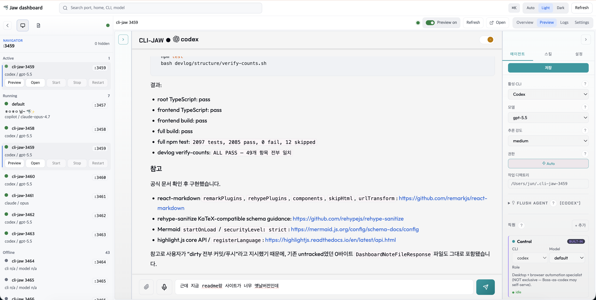

<div align="center">

# CLI-JAW

### Your personal AI agent. 2 lines to install. 13 AI runtime surfaces in one dashboard.

[](https://npmjs.com/package/cli-jaw)
[](https://github.com/lidge-jun/cli-jaw/releases)
[](https://typescriptlang.org)
[](https://nodejs.org)
[](LICENSE)
[](#-docker)

**English** / [한국어](README.ko.md) / [中文](README.zh-CN.md) / [日本語](README.ja.md)

</div>

## Install

Activity-capable clients use `presentation.mode`: `activity` by default, or `legacy`
for the previous transcript view. This preference is independent of provider transport.
Activity clients obtain their chat identity from the server snapshot before subscribing
to semantic updates; see [runtime integration](structure/runtime-integration.md).
Activity history is retained in the bounded trace journal and replayed with a fixed
cursor. Owned raw trace requests also carry their captured chat session.
Print runtimes project accepted messages and tool updates into the same journal;
the existing lifecycle still selects the final answer, including when Activity fails.

<details>
<summary><b>Safe install</b> — for existing users who want minimal changes</summary>

```bash
# macOS / Linux
JAW_SAFE=1 npm install -g cli-jaw    # skips optional tool/runtime setup
jaw init                              # interactive setup later when you're ready
```


<!-- windows-support:start GENERATED by scripts/render-windows-support.mts
     native-status: beta
     preferred-path: wsl
     node-floor: 22.4.0
     manager-port: 24576
     runtime-port: 3457
     registered-service: windows-startup
     install-command: irm https://raw.githubusercontent.com/lidge-jun/cli-jaw/main/scripts/install.ps1 | iex
-->

**Windows support.** WSL is the recommended, stable path. A native PowerShell installer also exists, but it is still **beta**:

```powershell
irm https://raw.githubusercontent.com/lidge-jun/cli-jaw/main/scripts/install.ps1 | iex
```

Requires Node.js 22.4+.

The manager dashboard runs on **24576**, and each agent web UI on **3457**. If a restrictive execution policy blocks `jaw.ps1`, use the `.cmd` entry point instead of loosening the policy:

```powershell
jaw.cmd doctor
```

Native Windows autostart is registered through the windows-startup backend. `jaw service install` also covers macOS (launchd) and Linux (systemd).

<!-- windows-support:end -->

Either way cli-jaw now tells the two apart precisely: `jaw doctor --json` reports
`platform` as `windows-native` or `wsl`, and each gets its own diagnostics. Native
Windows no longer receives "reinstall inside WSL" advice just because WSL interop
is configured on the machine.

</details>

```bash
# macOS / Linux / WSL with Node.js 22+ already installed
npm install -g cli-jaw
jaw dashboard
```

> **npm 12+?** npm now blocks dependency install scripts by default. If you see `npm warn allow-scripts`, install with the scripts approved:
>
> ```bash
> npm install -g cli-jaw --allow-scripts=cli-jaw
> ```

### Windows npm install recovery

npm 12+ may finish a global install while blocking CLI-JAW's dependency
`postinstall`. Approve only this package and reinstall, or save the approval for
future upgrades:

```powershell
npm install -g cli-jaw --allow-scripts=cli-jaw
npm config set allow-scripts=cli-jaw --location=user
jaw doctor
```

If PowerShell reports that `jaw.ps1` cannot be loaded because script execution
is disabled, choose one of these bounded workarounds:

```powershell
Set-ExecutionPolicy -Scope CurrentUser RemoteSigned
jaw.cmd doctor
node "$(npm prefix -g)\node_modules\cli-jaw\dist\bin\cli-jaw.js" doctor
```

`jaw.ps1` is PowerShell's npm shim and is subject to execution policy;
`jaw.cmd` is the equivalent cmd shim and does not use that policy. The direct
`node` form bypasses both shims. `jaw doctor` reports a blocked/stale install,
leftover npm staging directories, and the current PowerShell policy; it also
prints the matching recovery guidance.

That's it. Open **http://localhost:24576** for the manager dashboard. Per-instance agent Web UIs still run from **http://localhost:3457** when you start `jaw serve`. Requires [Node.js 22.4+](https://nodejs.org).

> **First time?** The default npm install initializes CLI-JAW and attempts native Claude setup. Other AI CLIs are optional; install them all during npm setup with `CLI_JAW_INSTALL_CLI_TOOLS=1 npm install -g cli-jaw` on macOS/Linux. On Windows, use the WSL install path below.

### Optional JWC Runtime

JWC is optional and external-only. The default npm install and Electron desktop sidecar do not bundle `jawcode`, `@jawcode-dev`, `@oven`, `bun`, or a `jwc` payload. To use JWC, install the runtime into CLI-JAW's external prefix and opt in with the printed SDK path:

```bash
jaw jwc install
export JWC_SDK_PATH="/absolute/path/printed/by/jaw-jwc-install/sdk.js"
jaw jwc doctor
```

To remove the optional external JWC dependencies later:

```bash
jaw jwc clean
```

<details>
<summary><b>macOS one-click</b> — don't have Node.js? This installs everything</summary>

```bash
curl -fsSL https://raw.githubusercontent.com/lidge-jun/cli-jaw/main/scripts/install.sh | bash
source "${ZDOTDIR:-$HOME}/.zshrc" 2>/dev/null || true
bash "$(npm root -g)/cli-jaw/scripts/verify-fresh-install.sh"
```

</details>

<details>
<summary><b>Windows (WSL — Windows Subsystem for Linux)</b> — one-click from scratch</summary>

```powershell
# 1. Install WSL (PowerShell as Admin)
wsl --install
```

Restart, open **Ubuntu**, then:

```bash
# 2. Install CLI-JAW + all dependencies
curl -fsSL https://raw.githubusercontent.com/lidge-jun/cli-jaw/main/scripts/install-wsl.sh | bash
source ~/.bashrc
jaw dashboard
bash "$(npm root -g)/cli-jaw/scripts/verify-fresh-install.sh"
```

From Windows PowerShell into WSL, run commands through a login shell so the WSL profile PATH is loaded:

```powershell
wsl.exe -d Ubuntu -- bash -lc "jaw dashboard"
```

</details>

<details>
<summary><b>Native Windows (PowerShell beta)</b> — detached server logs</summary>

`jaw serve` preserves the stdout and stderr streams it inherits and also appends
both streams to `<JAW_HOME>\logs\serve.log`. At startup, a file already at 5 MiB
is rotated once to `serve.log.1`. Native Windows still does not have a registered
`jaw service` logging backend. PowerShell's
`Start-Process -RedirectStandardOutput/-RedirectStandardError` creates or
truncates its target files on every launch, so do not point those options at
the instance-owned `serve.log`.

If separate operator-owned stdout/stderr files are needed, run the redirection
inside a child PowerShell process instead. This example appends them under
`<JAW_HOME>\logs` without the `Start-Process` truncate default:

```powershell
$jawHome = 'C:\jaw\worker-a'
$port = 3458
$logDir = Join-Path $jawHome 'logs'
$outLog = Join-Path $logDir 'serve.out.log'
$errLog = Join-Path $logDir 'serve.err.log'
New-Item -ItemType Directory -Force -Path $logDir -ErrorAction Stop | Out-Null
foreach ($path in @($outLog, $errLog)) {
    # OpenOrCreate preserves existing content while proving that the child can append.
    $probe = [IO.File]::Open($path, 'OpenOrCreate', 'Write', 'ReadWrite')
    $probe.Dispose()
}

$jaw = (Get-Command jaw.cmd -ErrorAction Stop).Source
$childCommand = "& '$jaw' --home '$jawHome' serve --port $port --no-open 1>> '$outLog' 2>> '$errLog'"
$encoded = [Convert]::ToBase64String([Text.Encoding]::Unicode.GetBytes($childCommand))
Start-Process -FilePath powershell.exe -ArgumentList '-NoProfile', '-EncodedCommand', $encoded -WindowStyle Hidden | Out-Null
```

Read each stream from a separate PowerShell terminal (`Get-Content -Wait`
occupies its terminal). These commands use explicit paths because variables
from the launch terminal are not available in a new PowerShell session:

```powershell
# Terminal 1
Get-Content -LiteralPath 'C:\jaw\worker-a\logs\serve.out.log' -Tail 100 -Wait

# Terminal 2
Get-Content -LiteralPath 'C:\jaw\worker-a\logs\serve.err.log' -Tail 100 -Wait
```

Lifecycle commands are home-scoped and verify `<JAW_HOME>\jaw.pid.json`
before signalling:

```powershell
& $jaw --home $jawHome service stop --port $port
& $jaw --home $jawHome service restart --port $port
```

A standalone `service restart` safely relaunches the instance detached, but
cannot recreate the operator's file redirection. To preserve file capture,
`stop`, optionally rotate the closed logs, and run the launch block again:

```powershell
$pidFile = Join-Path $jawHome 'jaw.pid.json'
$serverProcess = $null
if (Test-Path -LiteralPath $pidFile -PathType Leaf) {
    $record = Get-Content -LiteralPath $pidFile -Raw -ErrorAction Stop | ConvertFrom-Json
    $serverProcess = Get-Process -Id ([int]$record.pid) -ErrorAction SilentlyContinue
}

& $jaw --home $jawHome service stop --port $port
if ($LASTEXITCODE -ne 0) {
    throw "jaw service stop failed with exit code $LASTEXITCODE"
}
if ($serverProcess) {
    try {
        if (-not $serverProcess.WaitForExit(5000)) {
            throw "jaw serve pid $($serverProcess.Id) did not exit within 5000ms"
        }
    } finally {
        $serverProcess.Dispose()
    }
}

$stamp = Get-Date -Format 'yyyyMMdd-HHmmss'
foreach ($path in @($outLog, $errLog)) {
    if (Test-Path -LiteralPath $path) {
        Move-Item -LiteralPath $path -Destination "$path.$stamp" -ErrorAction Stop
    }
}
# Run the Start-Process launch block above again.
```

Do not use `Get-Process node | Stop-Process`; it can terminate unrelated
cli-jaw instances and AI runtime processes.

</details>

<details>
<summary><b>Fresh-machine evidence</b> — maintainer release check</summary>

Run this on a clean VM before publishing installer changes. It writes environment snapshots, installer logs, the exact collector/installer/verifier scripts that ran, their SHA-256 hashes, verifier logs, and new-shell PATH probes into `~/cli-jaw-fresh-install-evidence-*`.

```bash
# macOS Terminal
COLLECTOR=/tmp/cli-jaw-collect-fresh-install-evidence.sh
curl -fsSL https://raw.githubusercontent.com/lidge-jun/cli-jaw/main/scripts/collect-fresh-install-evidence.sh -o "$COLLECTOR"
bash "$COLLECTOR" --target macos

# Ubuntu inside WSL
COLLECTOR=/tmp/cli-jaw-collect-fresh-install-evidence.sh
curl -fsSL https://raw.githubusercontent.com/lidge-jun/cli-jaw/main/scripts/collect-fresh-install-evidence.sh -o "$COLLECTOR"
bash "$COLLECTOR" --target wsl
```

From Windows PowerShell, enter the supported WSL path:

```powershell
wsl.exe -d Ubuntu -- bash -lc 'COLLECTOR=/tmp/cli-jaw-collect-fresh-install-evidence.sh; curl -fsSL https://raw.githubusercontent.com/lidge-jun/cli-jaw/main/scripts/collect-fresh-install-evidence.sh -o "$COLLECTOR"; bash "$COLLECTOR" --target wsl'
```

If the collector says `powershell.exe` is not available inside WSL, run this from Windows PowerShell before auditing:

```powershell
wsl.exe -d Ubuntu -- bash -lc 'EVIDENCE_DIR="$(ls -dt ~/cli-jaw-fresh-install-evidence-* | head -1)"; { echo "command=wsl.exe -d Ubuntu -- bash -lc jaw --version"; jaw --version; } | tee "$EVIDENCE_DIR/33-powershell-to-wsl-probe.log"'
```

For an unmerged branch or local VM checkout, pass the local installer and verifier explicitly:

```bash
bash scripts/collect-fresh-install-evidence.sh --target macos --install-script scripts/install.sh --verifier-script scripts/verify-fresh-install.sh
bash scripts/collect-fresh-install-evidence.sh --target wsl --install-script scripts/install-wsl.sh --verifier-script scripts/verify-fresh-install.sh
```

Audit each collected directory before treating it as target evidence:

```bash
EVIDENCE_DIR="$(ls -dt ~/cli-jaw-fresh-install-evidence-* | head -1)"
AUDITOR="$(npm root -g)/cli-jaw/scripts/audit-fresh-install-evidence.mjs"
node "$AUDITOR" "$EVIDENCE_DIR" --target macos
node "$AUDITOR" "$EVIDENCE_DIR" --target wsl

# For a local checkout, audit with the checkout's auditor:
node scripts/audit-fresh-install-evidence.mjs "$EVIDENCE_DIR" --target macos
node scripts/audit-fresh-install-evidence.mjs "$EVIDENCE_DIR" --target wsl
```

Before publishing installer changes, run the matrix gate with both strict evidence directories:

```bash
GATE="$(npm root -g)/cli-jaw/scripts/verify-release-evidence.mjs"
node "$GATE" --macos /path/to/macos-evidence --wsl /path/to/wsl-evidence

# For a local checkout:
node scripts/verify-release-evidence.mjs --macos /path/to/macos-evidence --wsl /path/to/wsl-evidence
```

The matrix gate rejects evidence collected with stale collector, installer, or verifier scripts; archived evidence scripts must match the current package or checkout that runs the gate.

When `scripts/promote-to-main.sh`, `scripts/release-preview.sh`, or `npm publish` detects installer-sensitive changes since the previous tag, it runs this same matrix gate before any git push or npm publish. Set the evidence directories before starting a release:

```bash
CLI_JAW_MACOS_EVIDENCE_DIR=/path/to/macos-evidence \
CLI_JAW_WSL_EVIDENCE_DIR=/path/to/wsl-evidence \
bash scripts/promote-to-main.sh
```

`scripts/promote-to-main.sh` promotes **only an already-certified `preview` head**. It refuses to start unless a successful `test.yml` push run exists for that exact `preview` SHA. With no argument it promotes the live `origin/preview` head; an optional SHA argument must equal that same head, so it acts as an assertion rather than a way to promote an older commit.

The script dispatches the npm publish and then exits without checking whether the publish succeeded, and it cannot be re-run afterwards. Recovery for a partially completed release — npm publish missing, GitHub release missing, a bad version on `latest`, or a red commit on `main` — is documented in [`structure/infra.md` § 릴리스 파이프라인과 부분 실패 복구](structure/infra.md#릴리스-파이프라인과-부분-실패-복구-preview--main--npm).

</details>

<details>
<summary><b>Docker</b></summary>

```bash
docker compose up -d       # → http://localhost:3457
```

</details>

---

## What is CLI-JAW?

CLI-JAW is an open-source platform that unifies the AI coding CLIs you already use — Pi, Claude, Claude E, AI-E, Antigravity, Codex, Codex App, Cursor, Grok, Kiro, OpenCode, and Copilot — into **one assistant with one memory and one dashboard**.

Your main CLI (the “Boss”) calls the others as “employees.” You stop copy-pasting between apps and start giving orders from a single place.

- **No API keys needed** — routes through subscriptions you already pay for
- **No per-token billing** — flat monthly cost, same as what you already have
- **Runs locally** — your code never leaves your machine

<div align="center">



</div>

---

## Authenticate

You only need **one**. Pick whichever subscription you already have:

```bash
# Free options (no credit card needed)
copilot login        # GitHub Copilot (free tier available)
opencode             # OpenCode — free models available
kiro                 # AWS Kiro (free tier with AWS account)

# Paid (monthly subscription you already pay for)
claude auth login    # Anthropic Claude Pro or higher
codex login          # OpenAI ChatGPT Pro or higher
cursor-agent login   # Cursor
grok login --oauth   # xAI Grok / Grok Heavy
```

Check everything at once: `jaw doctor`

<details>
<summary>Example jaw doctor output</summary>

```
🦈 CLI-JAW Doctor — 13 checks

 ✅ Node.js        v22.15.0
 ✅ Claude CLI      installed
 ✅ Codex CLI       installed
 ✅ Cursor CLI      installed
 ✅ OpenCode CLI    installed
 ✅ Copilot CLI     installed
 ✅ Database        jaw.db OK
 ✅ Skills          29 active, 238 reference
 ✅ MCP (plugins)   3 servers configured
 ✅ Memory          structured/ exists
 ✅ Server          port 3457 available
```

</details>

---

## The Dashboard

The dashboard is your command center. `jaw dashboard` starts the manager at `http://localhost:24576`; individual agent Web UIs are served by `jaw serve` from `http://localhost:3457` and nearby managed ports.
Live Web/TUI updates use the SSE-first `GET /api/events` channel, with legacy WebSocket fallback only for older servers where SSE never opens.

Codex app-server and Pi RPC also record versioned, redacted runtime events independently of channel delivery. Native terminal handling keeps empty final answers distinct from live previews; Slack/Telegram/Discord retain their existing final-response, acknowledgement and queue-notice flow. The Activity presentation mode is a separate follow-on change, not enabled by this event foundation.

Cursor, Grok and Claude retain `print` compatibility mode. Their optional `perCli.<cli>.transport` setting is validated independently of display preferences; selecting an unimplemented native adapter gives an explicit error, never silently launches print. Existing settings without this field stay print, and native/print session storage is isolated. `/api/cli-status` reports compiled native main/worker support separately from cached binary/authentication readiness.

Cursor main turns support the native ACP path with explicit `transport: "native"` and literal `permissions: "auto"`; restrictive native permissions and workers are rejected before prompt-file or session preparation. Model/effort use native advertised choices (Composer models may require unset effort). Canonical tool/commentary activity is separate from the full final answer; interrupted text remains available for steer salvage. Native I/O refreshes only its own collector through a private, text-free callback. Display defaults and owned history UI remain separate rollout layers.

Native Cursor redirects use **cancel-reprompt**, not in-band input: the original prompt's cancelled response and pending updates finish before the replacement is sent in the same native session. cli-jaw restores the original request, accepted redirects and bounded incomplete output as context while keeping current instructions active. `/steer` uses this path; another pending redirect may queue, but a failed or indeterminate dispatch is not automatically retried. `/queue steer <n>` retains its separate interrupt-and-run-now behavior.

Native decision APIs are available at `GET /api/runtime/requests?sessionId=...` and `POST /api/runtime/requests/:id`. They use the existing instance authentication policy, exact run/session/scope/turn matching and opaque choice handles. Decisions expire after two minutes; accepting a response records a choice, not tool completion. Provider activation and Activity approval controls remain separate follow-on layers; messaging behavior is unchanged.

### Instance Manager

See every running AI instance — start, stop, restart with one click. Preview live Web UIs directly in the dashboard.

Manager preview embeds the selected instance's regular Web UI. On long-running
homes with large chat databases, a fresh Chrome tab can briefly allocate more
memory while the preview loads its recent message window, renders markdown and
structured cards, and lets Chrome's garbage collector settle. If memory drops
back after a few minutes, treat it as a cold-load peak rather than a manager
server leak; the `jaw dashboard` manager process should stay much smaller than
the embedded browser renderer and the individual `jaw serve` worker processes.

<div align="center">


</div>

### Kanban Board

Drag instance cards into lanes (Backlog → Ready → In Progress → Review → Done). Track what each AI session is working on.

<div align="center">


</div>

### Priority Matrix

Eisenhower matrix for your tasks and reminders. Prioritize what matters.

<div align="center">


</div>

### Notes

A mini-Obsidian inside the dashboard. Folders, visual (WYSIWYG) + raw + split editing, KaTeX (math rendering), Mermaid (diagram-as-code), syntax-highlighted code blocks.

<div align="center">


</div>

### Agent Status

Monitor each AI engine's health and usage at a glance.

<div align="center">


</div>

### Desktop App

Prefer a native window to a browser tab? CLI-JAW ships an **Electron desktop shell** that boots the manager dashboard and supervises the underlying `jaw dashboard serve` process for you. Packaged desktop builds include a Node.js sidecar server, so the app can prefer its bundled `jaw` shim before falling back to a global terminal install.

For end users, download the desktop artifact from **GitHub Releases**:

- **macOS**: download the DMG, drag CLI-JAW into Applications, then launch it. Current builds are unsigned / un-notarized, so first launch may require right-click → **Open** in Finder.
- **Windows**: download the NSIS installer. It includes the same sidecar server and adds the packaged `jaw` shim to PATH.
- **Linux**: download the AppImage, make it executable, and run it.

After first launch, accept the **Install CLI command** prompt to create the terminal `jaw` command from the bundled sidecar. If you skip the prompt, use the tray menu item **Install CLI to Terminal** later. This path does not require a global npm install for the packaged app or terminal shim.

Developer build:

```bash
# one-time, from the repo root
npm install && npm --prefix electron install

npm run electron:dev          # develop with hot reload
npm run electron:dist:mac     # build macOS arm64 .dmg + .zip with bundled sidecar
```

The packaged app lands in `electron/dist/`. The GitHub Actions desktop release workflow builds macOS arm64 DMG/ZIP, Windows x64 NSIS/ZIP, and Linux AppImage artifacts on release publish or manual dispatch. Native modules such as `better-sqlite3` stay in the manager/sidecar server — the Electron main process never imports them.

---

## How the Employee System Works

This is the core idea: **your main CLI calls other CLIs as workers.**

You talk to one AI (the "Boss"). When it needs specialized work, it dispatches tasks to employees — each running their own CLI with their own model:

```
You: "Fix the frontend styling and update the API endpoint"

Boss (Claude) thinks...
  ├── Dispatches to Frontend employee (OpenCode) → "Fix the CSS grid layout in dashboard.tsx"
  ├── Dispatches to Backend employee (Codex)     → "Update /api/users to return pagination metadata"
  └── Synthesizes both results for you
```

```bash
# Under the hood, it's one command:
jaw dispatch --agent "Frontend" --task "Fix the CSS grid layout in dashboard.tsx"
jaw dispatch --agent "Backend" --task "Run read-only verification" --watch
jaw dispatch --virtual "security" --task "Review this branch for auth and secret leaks" --watch
jaw worker status Backend
```

Employees are other AI CLIs configured in your settings. Each has its own session, its own model, its own context. For one-off specialist checks, the Boss can also dispatch an ephemeral virtual employee with `--virtual`; it uses the same dispatch machinery but is not saved to the employee database. The Boss reviews their output before presenting it to you.

### Employees vs. Sub-agents

These are different things:

| | Employees | Sub-agents |
|---|---|---|
| **What** | Other AI CLIs (Codex, OpenCode, etc.) configured as workers | Built-in parallel task tool within a single CLI |
| **When** | Multi-specialist work across different codebases or domains | Internal research, file reads, parallel analysis |
| **How** | `jaw dispatch --agent "Name" --task "..."` | Automatic — the CLI spawns them internally |

Use employees for "Frontend does CSS, Backend does API." Use sub-agents for "read these 5 files in parallel before deciding."

---

## AI Runtime Surfaces

No per-token API billing. Route through subscriptions you already pay for.

| CLI | Default Model | Auth | Cost |
|---|---|---|---|
| **Pi** | `grok-composer-2.5-fast` | Settings profile API key, local proxy, or `PI_CODING_AGENT_BIN` | First-class `pi --mode rpc` runtime for local/API endpoints through an isolated `PI_CODING_AGENT_DIR` |
| **Claude** | `claude-opus-4-8` | `claude auth login` | Claude Pro subscription or higher |
| **Claude E** | `claude-opus-4-8` | underlying `claude auth login` | Claude Pro subscription or higher; preferred for June subscription allowance |
| **AI-E** | provider-selected | selected provider auth | Multi-provider runtime wrapper |
| **Antigravity** | AGY-selected | checked by `agy` at run time | Experimental AGY print-mode runtime (`agy -p`); optional `--model` is capability-probed (observed in AGY 1.0.12); resume via `--conversation`; no separate effort flag |
| **Codex** | `gpt-5.5` | `codex login` | ChatGPT Pro subscription or higher |
| **Codex App** | `gpt-5.5` | `codex login` | ChatGPT Pro subscription or higher |
| **Cursor** | `composer-2.5` | `cursor-agent login` or `CURSOR_API_KEY` | Cursor subscription; quota is auth/status-only |
| **Grok** | `grok-build` | `grok login --oauth` | Grok subscription; weekly usage pool read from `~/.grok/auth.json` via Grok Build billing |
| **Kiro** | registry-selected | `kiro` | AWS Kiro free tier; `kiro-cli chat --no-interactive` runtime |
| **OpenCode** | `opencode-go/kimi-k2.6` | `opencode` | Free models available |
| **Copilot** | `claude-sonnet-4.6` | `copilot login` | Free tier available |

GPT 5.5 and Claude Opus 4.8 are enabled from Pro-tier subscriptions and higher. Starting in June, select `claude-e` when you want CLI-JAW to use the Claude allowance bundled with the subscription plan.

On a new install, CLI-JAW prefers **Codex App** when the local `app-server` entrypoint and Codex authentication are ready. Existing installations keep their saved runtime until the one-time Settings notice is explicitly accepted; choosing “keep” preserves the current runtime. Set `CLI_JAW_DEFAULT_CLI=claude` to override the clean-install policy.

OpenCodex routing remains owned by Codex's root `openai_base_url` setting. CLI-JAW only compares that read-only URL with the live OpenCodex runtime-port and `/healthz` fingerprint for diagnostics; it does not rewrite Codex config or inject an execution endpoint.

The quota/status panel keeps the same runtime keyset as the registry. Cold status requests return a neutral “checking” snapshot immediately while binary, authentication, and capability probes run in a bounded child process. Wrapper runtimes (`ai-e`, `claude-e`, `codex-app`) delegate to their underlying provider, while Pi/AGY/Cursor/OpenCode are shown as auth/status-only when their CLIs do not expose quota windows. Grok uses the current Grok CLI auth store for the SuperGrok weekly usage pool and falls back to legacy monthly credits when the weekly endpoint is unavailable.

**Fallback chain**: if one engine is rate-limited, the next picks up. Configure with `/fallback [cli1 cli2...]`.

**OpenCode wildcard**: connect any model endpoint — OpenRouter, local LLMs (Large Language Models), any OpenAI-compatible API.

> Switch engines live: `/cli codex`. Switch models: `/model gpt-5.5`. Works from Web, Terminal, Telegram, Discord, or Slack.

**Mid-run steering**: the default policy is `multiSession.midRunPolicy: 'steer'`. JWC and Codex App accept in-flight input; native Cursor cancels and drains the active prompt, then re-prompts in the same session with application-restored context. Other paths interrupt the current run and carry bounded partial output into a new run; this is not a guarantee of complete history retention. Prefer waiting in line? Choose `followup` or `collect` in Settings → Agent.

---

## PABCD Orchestration (Plan → Audit → Build → Check → Done)

For complex tasks, CLI-JAW uses a structured 5-phase workflow. You approve every transition — nothing ships without your OK.

```
P (Plan) → A (Audit) → B (Build) → C (Check) → D (Done) → IDLE
   ⛔          ⛔          ⛔         auto        auto
```

| Phase | What happens |
|---|---|
| **P — Plan** | Boss writes a diff-level plan. Stops for your review |
| **A — Audit** | Read-only worker verifies the plan is feasible (imports exist, signatures match) |
| **B — Build** | Boss implements. Read-only worker verifies the result |
| **C — Check** | Type-check (`tsc --noEmit`), docs update, consistency check |
| **D — Done** | Summary of all changes. Returns to idle |

State is database-persisted and survives restarts. Workers cannot modify files — only verify. Activate with `jaw orchestrate`, `/orchestrate`, or `/pabcd`; resume an active worklog explicitly with `/continue`. Forward phase transitions require evidence attestation, e.g. `jaw orchestrate B --attest '{"from":"A","to":"B","did":"<what you did>"}'` (C→D also needs pasted `checkOutput` and `exitCode`). Workflow helper slash commands include `/plan`, `/interview`, `/deliberate`, `/planaudit`, `/review`, `/search`, `/goal`, `/goalplan`, `/team`, `/task`, `/fork`, and `/gd`; `/plan` is a compatibility guide that explains "this is PABCD P" and points to the right next command instead of creating a second planning mode. `/search <query>` routes search intent through the active search skill: classify local vs external lookup, rewrite focused queries, discover candidate URLs, and only then use browser commands such as `browser fetch` for evidence verification. Bounded automation is expressed as `/goal run ...`, not a separate top-level `/autopilot`. Durable goals — `/goal <objective>` plus `update`/`done`/`cancel`/`pause`/`resume` — are functional and survive restarts, and a goal resume re-fires the work on every interface (Web/CLI included, not just messaging). AI-initiated `goal pause --agent --audit` arms a two-tap gate: one audit/finalizer continuation may run with `pause_gate_pending`, and if that turn exits with the gate still armed, `goal_pause_gate_pending` suppresses further auto-continuation until a productive checkpoint or a second audited pause. `/gd` is shorthand for `/goal done --force` (skips the completion evidence gate). `/goal run` (`preflight`/`start`/`stop`/`status`) is a tracking-only preview: it gates on preflight and tracks turn/dispatch budget, with enforcement still to come.

---

## Memory

Three layers, each covering a different recall horizon.

| Layer | What it stores | How it works |
|---|---|---|
| **History Block** | Recent session context | Last 10 sessions, max 8000 chars, scoped to working directory. Injected at prompt start |
| **Memory Flush** | Structured knowledge from conversations | Triggered after threshold (default 10 turns). Extracts episodes, daily logs, semantic notes as markdown |
| **Soul + Task Snapshot** | Identity and semantic recall | Core values, tone, boundaries. Full-text search index returns up to 4 semantically relevant hits per prompt |

All three layers feed into the system prompt automatically. Memory is searchable:

```bash
jaw memory search "how did we set up the API auth?"
```

---

## Skills

200+ reference skills plus active runtime skills cover dev workflows, office documents, automation, media, and content writing.

| Category | Skills | What they cover |
|---|---|---|
| **Office** | `jaw-pdf`, `jaw-docx`, `jaw-xlsx`, `jaw-pptx`, `jaw-hwp` | Read, create, edit documents. HWP/HWPX (Korean word-processor formats) supported natively |
| **Automation** | `jaw-browser`, `vision-click`, `jaw-screen-capture`, `jaw-desktop-control` | Chrome DevTools Protocol (CDP) browser control, AI-powered coordinate click, macOS screenshots, Computer Use |
| **Media** | `jaw-video`, `imagegen`, `lecture-stt`, `tts` | Remotion video, OpenAI image generation, lecture transcription, text-to-speech |
| **Integration** | `jaw-github`, `notion`, `jaw-telegram-send`, `jaw-memory` | Issues/PRs/CI, Notion pages, Telegram media delivery, persistent memory |
| **Visualization** | `jaw-diagram` | SVG diagrams, charts, interactive visualizations rendered in chat |
| **Content / Writing** | `k-writing` | Korean promotional/content writing: thread, Instagram cardnews, LinkedIn, website/blog, and humanize outputs with mandatory search, hook scoring, and anti-AI checks |
| **Dev Guides** | `jaw-dev`, `jaw-dev-frontend`, `jaw-dev-backend`, `jaw-dev-data`, `jaw-dev-testing`, `jaw-dev-pabcd` | Engineering guidelines injected into agent prompts |

Reference skills live in `skills_ref/` and install into the active runtime on demand; active skills are loaded from the user runtime home.

```bash
jaw skill install <name>    # activate a reference skill
jaw skill list              # see what's available
```

---

## Browser & Desktop Automation

| Capability | How it works |
|---|---|
| **Chrome DevTools Protocol** | Navigate, click, type, screenshot, evaluate JS, scroll, press keys — remote control for Chrome |
| **Vision-click** | Screenshot the screen → AI extracts target coordinates → clicks. `jaw browser vision-click "Login button"` |
| **Computer Use** | Desktop app automation via Codex Computer Use. Use Safari for localhost and it feels like the Codex app |
| **Web-AI vendors** | `jaw browser web-ai --vendor chatgpt\|gemini\|grok` with session lifecycle, diagnostics, source-audit/answer-artifact support, and ChatGPT code-mode zip recovery |
| **Diagram Skill** | Generate SVG diagrams and interactive visualizations, rendered inline in chat |

Computer Use lets you control desktop apps — Finder, Safari, System Settings, Xcode on macOS; any window on Windows — through natural language. Point it at your localhost dev server in a browser and you get a full visual testing loop. The two hosts expose different APIs (macOS is app-scoped, Windows is window-scoped), and the `jaw-desktop-control` skill routes between them.

---

## Messaging

### Telegram

```
📱 Telegram ←→ 🦈 CLI-JAW ←→ 🤖 AI Engines
```

Text chat, voice messages (auto-transcribed via STT — speech-to-text), file/photo upload, slash commands (52 registered, 51 visible; workflow helpers include `/plan`, `/interview`, `/review`, `/search`, `/goal`, `/orchestrate`, `/task`, `/fork`, `/gd`; dynamic `/skill:<id>` on CLI/Web), forum-topic routing and **Dashboard Telegram Hub** (`/setthread`, `/threads`, `/hubhelp`, per-topic model/systemPrompt overrides in Manager UI), scheduled task delivery via `every`/`cron` heartbeat jobs.

<details>
<summary>Setup (3 steps)</summary>

1. Message [@BotFather](https://t.me/BotFather) → `/newbot` → copy the token
2. `jaw init --telegram-token YOUR_TOKEN` or use Web UI settings
3. Send any message to your bot. Chat ID is auto-saved on first message

</details>

### Discord

Same capabilities as Telegram — text, files, commands. Channel/thread routing, canonical `/api/channel/send`, and forwarder support for agent result broadcast. Setup via Web UI settings.

You can enable multiple inbound channels at once. The manager and Web UI settings separate **enabled channels** from the **home channel**: enabled channels start their transport gateways; the home channel is the fallback for proactive sends and legacy `settings.channel` is a deprecated read-only alias for one major version.

### Slack

Socket Mode bot with the same shared command catalog — mentions, DMs, slash commands, file/image relay, thread replies. Each Slack-triggered agent turn receives the current conversation ID and parent thread timestamp explicitly, so history/member lookups and targeted replies do not depend on parsing an internal session label or enabling multi-session.

Heartbeat jobs can opt into Slack mention watching with `mentionWatch: { channel: "slack", userId, channelIds, maxHits?, since? }`. This runs inside the existing `runHeartbeatJob`, not a separate daemon: it walks explicitly configured, joined channels backward with `conversations.history` because `search.messages` is a user-token method and bot tokens cannot hold `search:read`. The scan keeps a completed-message frontier and unfinished-walk resume bound, rotates the first channel between ticks, stops the tick on 429, and reports channel IDs beyond the 60-channel ceiling. Before each hit it yields to active PABCD, agent work, queued messages, or pending replay; the agent returns answer text only, then the server posts it to the source thread with `sendChannelOutput` and records the message as seen. Failed sends remain eligible for retry, so delivery is at-least-once. Keep watch jobs disabled (`enabled: false`) until the channel subset and target user are configured; every tick intersects `channelIds` with the current `slack.channelIds` allowlist again.

Each answer runs in the chat session bound to the thread it is answering, so the reply shares that conversation's history instead of the shared default session. The execution scope is deliberately a different one (`mention-watch:<remoteKey>`): a background turn registered in the thread's own scope would look busy to the next human message, which Slack then steers into it rather than starting a new run. Because placement is per conversation, the yield check is too — the thread must be PABCD-`IDLE`, its session must have no work in flight, and its lane must be free. The lane is checked and never awaited, since a lane wait has no bound while the heartbeat holds every other job. A session row is created only when a hit is actually being answered, because a remote-bound session cannot be deleted afterwards.

<details>
<summary>Setup (guided wizard)</summary>

1. `jaw slack setup` — prints the app manifest (or `jaw slack manifest | pbcopy`), opens the Slack app creation page, then validates your two tokens live (`auth.test` + `apps.connections.open`) and writes the settings
2. `/invite @cli-jaw` in each channel the bot should read, then restart `jaw serve`

Why not OAuth one-click? Slack issues the app-level token (`xapp-`, required for Socket Mode) only from the app settings UI, and the PKCE localhost flow bans bot scopes — a browser click cannot configure a self-hosted Socket Mode bot. The wizard is the shortest honest path.

For Docker/Kubernetes deployments, `SLACK_BOT_TOKEN`, `SLACK_APP_TOKEN`, `SLACK_TEAM_ID`, and `SLACK_CHANNEL_IDS` are runtime-only owners of their matching fields. While any are present, Settings keeps connection editing/reset read-only as a group and the CLI setup paths refuse mixed input; remove the variables and restart cli-jaw before changing the connection there. Persistence strips only fields owned by configured variables, so environment values are never copied into `settings.json` and metadata-only overrides do not erase file-backed tokens. Delivery preferences such as mention/thread/forwarding behavior remain editable.

</details>

### Voice & STT

Voice input works on Web (mic button), Telegram (voice messages), and Discord. Providers: OpenAI-compatible, Google Vertex AI, or any custom endpoint.

---

## MCP (Model Context Protocol)

[MCP](https://modelcontextprotocol.io) is a standard that lets AI tools share capabilities — like plugins for AI agents. CLI-JAW manages MCP config for all your engines from one file.

```bash
jaw mcp install @anthropic/context7
# → syncs to Claude, Codex, Kiro, OpenCode, Copilot, and Antigravity config files simultaneously
```

No more editing several different JSON files. Install once, every MCP-aware engine gets it. Grok CLI is a standard runtime here, but it is not counted as MCP-sync capable until Grok exposes a compatible config surface. Antigravity MCP sync is a separate config target from the `agy` runtime registry entry.

```bash
jaw mcp sync       # re-sync after manual edits
```

---

## CLI Commands

```bash
# Core
jaw dashboard                     # launch manager dashboard
jaw serve                         # start server (http://localhost:3457)
jaw chat                          # terminal chat UI
jaw chat search "query"           # search chat history
jaw ask "question"                # one prompt, one answer — no TTY needed
echo "question" | jaw ask -       # same, reading the prompt from stdin
jaw doctor                        # installation and runtime diagnostics
jaw slack setup                   # guided Slack app setup (manifest + token validation)
jaw messaging ingress list        # inspect / replay the durable inbound journal

# Instances
jaw clone ~/project               # clone instance to new directory
jaw --home ~/project serve --port 3458  # run second instance
jaw service install               # auto-start on boot (macOS/Linux)
jaw --home ~/project service restart --port 3458  # restart only this instance
jaw --home ~/project service stop --port 3458     # stop only this instance
jaw project set ~/repo            # set projectDirs for review/orchestration
jaw lock                          # protect this instance from stop-all flows

# AI & Orchestration
jaw employee list                         # list configured + static employees
jaw dispatch --agent "Backend" --task "..."  # dispatch employee
jaw dispatch --agent "Backend" --task "..." --watch  # dispatch and stream safe progress
jaw dispatch --virtual "testing" --task "..." --watch  # one-off virtual employee
jaw worker status Backend            # inspect current/previous employee progress
jaw orchestrate                   # enter/control PABCD workflow
jaw goal status                   # persistent goal lifecycle
jaw task list                     # agent-native task checklist
# in chat: /continue               # explicit worklog/PABCD resume

# Skills & MCP
jaw skill install <name>          # activate a skill
jaw skill list                    # list available skills
jaw mcp install <package>         # install MCP → syncs supported MCP-aware engines
jaw mcp sync                      # re-sync MCP configs

# Memory
jaw memory search <query>         # search across all memory layers
jaw memory save <file> <content>  # save to structured memory

# Browser
jaw browser start                 # launch Chrome automation
jaw browser fetch "https://example.com" --json --trace  # adaptive URL reader
jaw browser snapshot              # capture page state
jaw browser vision-click "Login"  # AI-powered click
jaw browser web-ai status         # ChatGPT/Gemini/Grok web-AI session tooling
jaw browser web-ai code --vendor chatgpt --model thinking --effort heavy --prompt "Build an MVP" --output-zip ./result.zip

# Search
# in chat: /search "npm trusted publishing official docs"  # search-skill routing + evidence verification

# Dashboard connectors
jaw dashboard memory search "query"  # read-only cross-instance memory search
jaw dashboard chat search "query"    # cross-instance chat search
jaw connector board add --title "Fix docs"
jaw reminders add "Follow up tomorrow"

# Maintenance
jaw reset                         # full reset
```

---

## Multi-Instance

Run isolated instances with separate settings, memory, and database:

```bash
jaw clone ~/my-project
jaw --home ~/my-project serve --port 3458
```

Each instance is fully independent — different working directory, different memory, different MCP config. The manager dashboard sees them all.

For a standalone `jaw serve`, use the home-scoped lifecycle commands instead of killing every Node process. The server records verifiable ownership in `<JAW_HOME>/jaw.pid.json`; `stop` and `restart` refuse stale, foreign, or unverifiable records. Registered launchd/systemd instances delegate to their service manager.

```bash
# Windows PowerShell
jaw --home C:\jaw\worker-a service restart --port 3458

# macOS/Linux
jaw --home "$HOME/jaw/worker-a" service stop --port 3458
```

### Remote and headless hosts

`ssh host 'jaw serve ...'` runs a non-login, non-interactive shell that reads none of the
files the installer adds `~/.local/bin` to, so `jaw` can work when you log in and still fail
over SSH with `nohup: failed to run command 'jaw'`. Run `jaw doctor` and check the
**Non-interactive PATH (ssh)** row, then call jaw by absolute path or export PATH inside the
remote command.

On a host with no service manager (a container whose PID 1 is tini, for example),
`jaw service --backend supervisor` generates a keep-alive loop to wire into your container
entrypoint or cron. Full guide: [structure/remote-headless.md](structure/remote-headless.md).

---

## Development

```bash
npm run build          # tsc → dist/
npm run build:frontend # vite → public/dist/
npm run dev            # tsx server.ts (hot-reload)
npm test               # programmatic node:test driver (tests/run.mts, isolation:'process')
npm run gate:all       # named release/docs parity gates (incl. doc-drift, strict-baseline, redaction-sinks)
npm run docs:check     # AST commands/routes inventory vs structure docs
bash structure/check-doc-drift.sh
```

Architecture details: [ARCHITECTURE.md](docs/ARCHITECTURE.md) · Pre-prompt context hooks: [pre-prompt-context-hooks.md](docs/dev/pre-prompt-context-hooks.md) · Internal structure docs: [structure/](structure/)

---

## How It Compares

| | CLI-JAW 2.x | Hermes Agent | Claude Code |
|---|---|---|---|
| **Model access** | Pi, Antigravity, AI-E, Claude, Claude E, Codex, Codex App, Cursor, Gemini, Grok, Kiro, OpenCode, and Copilot through vendor/native auth where supported | API keys (OpenRouter 200+, Nous Portal) | Anthropic only |
| **Cost model** | Monthly subscriptions you already pay for | Per-token API billing | Anthropic subscription |
| **Primary UI** | Manager dashboard + Web app + Electron desktop + terminal UI | Terminal only | CLI + IDE plugins |
| **Dashboard** | Multi-instance manager, Kanban, Notes workspace | None | None |
| **Messaging** | Telegram (voice) + Discord + Slack | Telegram/Discord/Slack/WhatsApp/Signal | None |
| **Memory** | 3-layer (History/Flush/Soul) + full-text search | Self-improving loop + Honcho | File-based auto-memory |
| **Multi-agent** | Employee system (dispatch other CLIs) + PABCD | Subagent spawn | Task tool |
| **Browser automation** | Chrome DevTools + vision-click + Computer Use | Limited | Via MCP |
| **Execution** | Local + Docker | Local/Docker/SSH/Daytona/Modal | Local |
| **Skills** | 200+ reference skills + active runtime skills | Self-creating + agentskills.io | User-configured |
| **Languages** | English, Korean, Chinese, Japanese | English | English |

---

## Troubleshooting

| Problem | Solution |
|---|---|
| `cli-jaw: command not found` | `npm install -g cli-jaw` again. macOS/Linux/WSL: check `~/.local/bin` or `npm prefix -g` + `/bin` is in `$PATH`. From Windows PowerShell, invoke WSL through a login shell: `wsl.exe -d Ubuntu -- bash -lc "jaw dashboard"`. |
| `npm warn allow-scripts ...` | npm >= 12 blocks dependency install scripts by default, so the install "succeeds" without running CLI-JAW's setup. Fix: `npm install -g cli-jaw --allow-scripts=cli-jaw` or persist with `npm config set allow-scripts=cli-jaw --location=user`. Do **not** copy npm's own printed hint — it omits the package argument and fails with `ENOENT package.json` ([npm/cli#9835](https://github.com/npm/cli/issues/9835)). Already installed? `jaw init` finishes setup without reinstalling. |
| pnpm/bun blocked build scripts | pnpm 11+: `pnpm add -g --allow-build=cli-jaw cli-jaw` (pnpm ≤ 10: `pnpm approve-builds -g`). bun: `bun add -g --trust cli-jaw`. |
| `cli-jaw: permission denied` | The global shim can see CLI-JAW, but its `dist/bin/cli-jaw.js` target is not executable. Re-run `npm install -g cli-jaw` or, in a checkout, run `npm run build && npm run check:cli-bin-links`. |
| Fresh install verifier fails | `scripts/verify-fresh-install.sh` checks both public aliases: `jaw` and `cli-jaw`. Fix the reported PATH or executable-bit issue, then rerun `bash "$(npm root -g)/cli-jaw/scripts/verify-fresh-install.sh"`. |
| `Error: node version` | Upgrade to Node.js 22.4+: `nvm install 22` |
| `NODE_MODULE_VERSION` mismatch | `npm run ensure:native` (auto-rebuilds native modules) |
| `EADDRINUSE: port 3457` | Another instance running. Use `--port 3458` or stop it first |
| Telegram / Discord / Slack auth fails | Run `jaw doctor`, check tokens, restart `jaw serve` |
| Browser commands fail | Install Chrome/Chromium. Run `jaw browser start` first |
| Employee dispatch hangs | Run `jaw employee list`, ensure the employee CLI is authenticated (`jaw doctor`), then retry with `jaw dispatch --watch` |
| Employee dispatch returns non-JSON or HTML | The server may be stale or missing the route. Run `npm run build` or restart the manager/dashboard process. |
| Computer Use not working | macOS or Windows; Codex CLI required. macOS: check Automation permission in System Settings. Windows: run calls inside `node_repl` and keep the Codex desktop app running in the logged-on session — an empty `list_windows()` means you are not on the pipe, not that no windows are open |

---

## Contributing

1. Fork and branch from `dev`
2. `npm run build && npm run build:frontend && npm test`
3. For release-sensitive changes, also run `npm run gate:all` and any focused checks for the touched surface.
4. Submit a PR

Bug reports and feature ideas: [Open an issue](https://github.com/lidge-jun/cli-jaw/issues)

---

<div align="center">

**[MIT License](LICENSE)** · Built by developers who got tired of tab-switching between AI apps.

</div>
