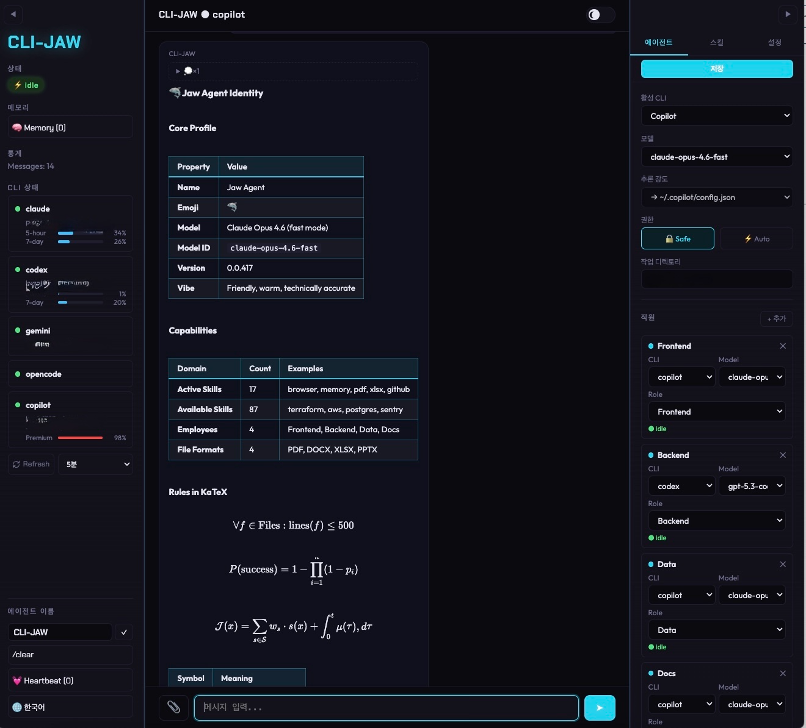
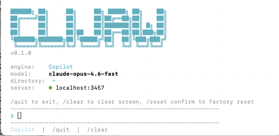
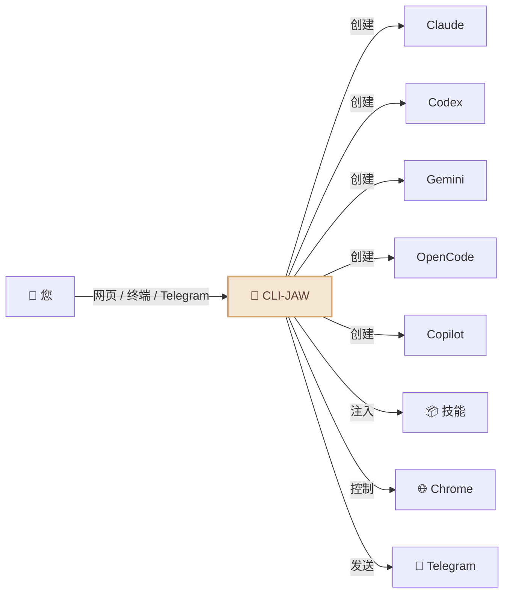
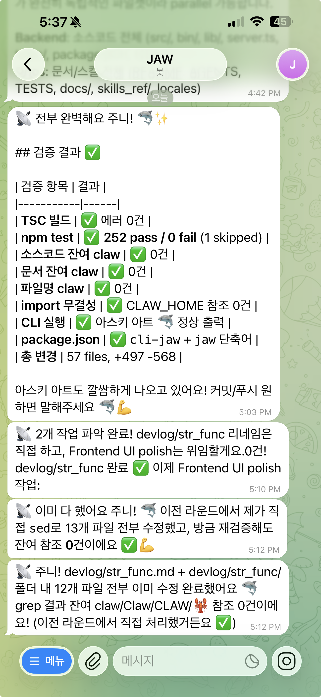
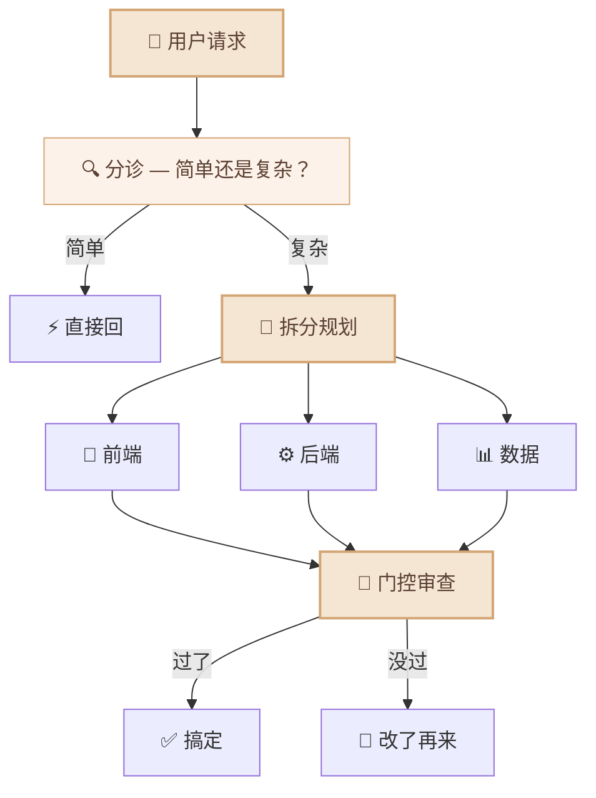
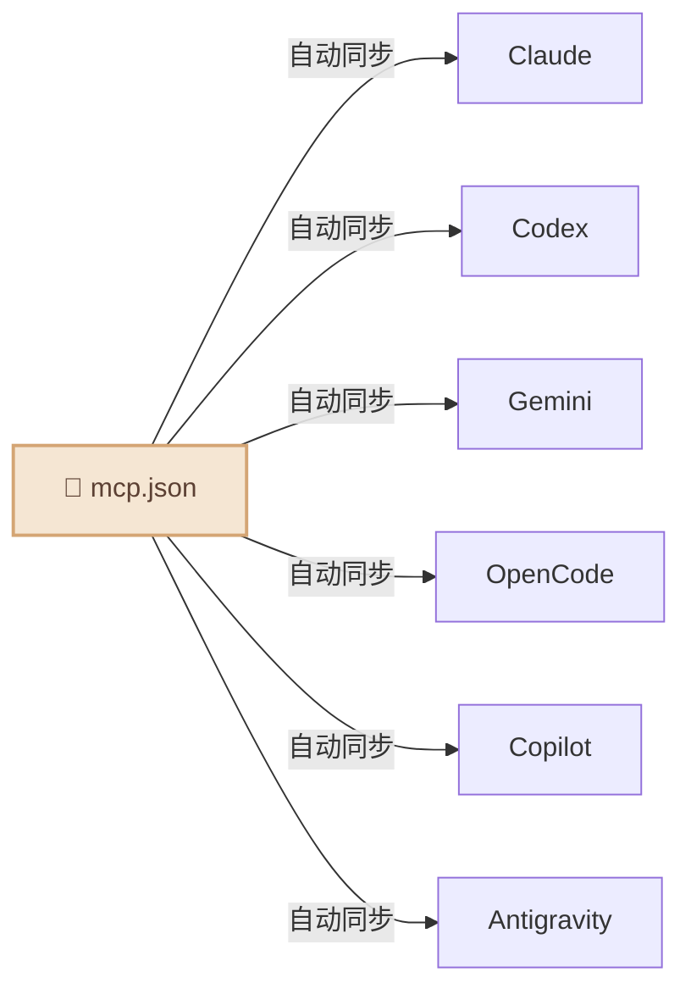

<div align="center">

# 🦈 CLI-JAW

### 内置 5 大 AI 引擎的专属本地助手

*Claude、Codex、Gemini... 从此告别来回切换。*

[](#-测试)
[](https://typescriptlang.org)
[](https://nodejs.org)
[](LICENSE)
[](https://npmjs.com/package/cli-jaw)
[](#-docker--容器隔离)
[](#)

[English](README.md) / [한국어](README.ko.md) / **中文**

<video src="https://github.com/user-attachments/assets/a7cf17c9-bfb3-44f0-b7fd-d001a39643fd" autoplay loop muted playsinline width="100%"></video>

</div>

<details>
<summary>🪟 <b>你在用 Windows 吗？</b> — WSL 一键安装</summary>

**第一步：安装 WSL**（以管理员身份运行 PowerShell — 仅需一次）

```powershell
wsl --install
```

按提示重启电脑。重启后从开始菜单打开 **Ubuntu**。

**第二步：安装 CLI-JAW**（在 Ubuntu/WSL 终端中）

```bash
curl -fsSL https://raw.githubusercontent.com/lidge-jun/cli-jaw/master/scripts/install-wsl.sh | bash
```

**第三步：认证 AI 引擎**（任选其一）

```bash
gh auth login    # GitHub Copilot（免费）
opencode         # OpenCode（提供免费模型）
claude auth      # Anthropic Claude
codex login      # OpenAI Codex
gemini           # Google Gemini
```

**第四步：启动聊天**

```bash
jaw serve
# → http://localhost:3457
```

> 💡 脚本使用 [fnm](https://github.com/Schniz/fnm) 管理 Node.js。如果已有 `nvm`，则自动使用 nvm。

</details>

<details>
<summary>🍎 <b>终端新手？</b> — 一键安装 Node.js + CLI-JAW</summary>

在终端粘贴这一行 — 自动检测并安装所有依赖：

```bash
curl -fsSL https://raw.githubusercontent.com/lidge-jun/cli-jaw/master/scripts/install.sh | bash
```

> 💡 **只想试试？** 无需安装，直接运行：`npx cli-jaw serve`

</details>

---

## 🚀 安装与启动（30 秒）

```bash
npm install -g cli-jaw
jaw serve
```

**搞定。** 打开 **http://localhost:3457** 直接开聊。🦈

> 需要 **Node.js ≥ 22**（[下载](https://nodejs.org)）+ 下方**至少 1 个 AI CLI** 完成认证。

---

## 🔑 认证 AI 引擎

只需 **一个** — 选你有的就行：

```bash
# ── 免费 ──
gh auth login                # GitHub Copilot（免费套餐）— 然后: gh copilot --help
opencode                     # OpenCode — 首次运行自动认证（有免费模型）

# ── 付费 ──
claude auth                  # Anthropic Claude
codex login                  # OpenAI Codex
gemini                       # Google Gemini — 首次运行触发认证
```

检查就绪状态：`jaw doctor`

<details>
<summary>📋 <code>jaw doctor</code> 输出示例</summary>

```
🦈 CLI-JAW Doctor — 12 checks

 ✅ Node.js        v22.15.0
 ✅ npm             v10.9.4
 ✅ Claude CLI      installed
 ✅ Codex CLI       installed
 ⚠️ Gemini CLI      not found (optional)
 ✅ OpenCode CLI    installed
 ✅ Copilot CLI     installed
 ✅ Database        jaw.db OK
 ✅ Skills          17 active, 90 reference
 ✅ MCP             3 servers configured
 ✅ Memory          MEMORY.md exists
 ✅ Server          port 3457 available
```

</details>

> 💡 **不必全装 5 个。** 有一个就能跑。助手会自动检测可用引擎，缺了就无缝切换到下一个。

---

## CLI-JAW 是什么？

CLI-JAW 是驻留在您本地机器上的**专属 AI 助手**，并在您熟悉的界面中运行 — **网页、终端和 Telegram**。您可以向它提出任何问题、委派任务或是自动化您的工作流。


> 💬 *"帮我整理一下今天的日程"* → 直接在 Telegram 上收到整理好的结果
> 💬 *"重构这个模块，顺便写好测试"* → 子 Agent 搞定，你喝杯咖啡回来就行
> 💬 *"把那个 PDF 下载下来，关键信息放到 Notion 里"* → 浏览器 + Notion 技能组合，搞定

与单一模型的助手不同，CLI-JAW 通过官方 CLI 命令行工具对 **5 大 AI 引擎**（Claude、Codex、Gemini、OpenCode、Copilot）进行编排 — 为您提供各大供应商最优势的能力及统一的体验。当一个引擎处于繁忙状态时，它会自动无缝切换至下一个。107 个内置技能可处理从浏览器自动化到文档生成的所有事务。

|                                 | 为什么选择 CLI-JAW？                                                                  |
| ------------------------------- | ------------------------------------------------------------------------------------- |
| 🛡️ **安全合规 (TOS-Safe)**       | 仅使用官方 CLI — 无 API 密钥抓取、无逆向工程、无封号风险。                            |
| 🤖 **经过验证的智能体工具**      | 5 大实战级编码智能体（Claude、Codex、Gemini、OpenCode、Copilot）集于一身。            |
| ⚡ **多模型自动回退 (Fallback)** | 单一引擎发生故障？下一个立即接管。确保零停机。                                        |
| 🎭 **基于编排的性能优化**        | 复杂的任务会被拆分给专业的子智能体，以实现效率最大化。                                |
| 📦 **107 个内置技能**            | 浏览器自动化、文档生成、Telegram 通知、持久化记忆 — 开箱即用。                        |
| 🖥️ **跨平台支持**                | macOS、Linux、Windows — ENOENT-safe CLI 启动、自动检测、`.cmd` 支持，跨平台原生运行。 |



---

## 您的助手能做什么？



- 🤖 **5 大 AI 引擎，1 个专属助手** — Claude · Codex · Gemini · OpenCode · Copilot。使用 `/cli` 命令一键切换。
- ⚡ **自动回退 (Fallback)** — 即使一个引擎出现故障，下一个也会无缝接管。
- 🎭 **多智能体编排** — 复杂任务会自动拆分给专业的子智能体并行处理。
- 📦 **107 个技能** — 浏览器控制、文件编辑、图片生成、网页搜索以及[更多功能](#-技能系统)。
- 🧠 **持久化记忆** — 跨越不同会话，记住您过往的对话和偏好设定。
- 📱 **Telegram 机器人** — 通过手机即可与您的助手聊天、发送语音/图片/文件。
- 🌐 **浏览器自动化** — 您的助手能够自动导航网页、点击、打字并进行截图。
- 🔌 **MCP 生态系统** — 仅需安装一次，立刻应用于所有 5 大 AI 引擎。
- 🔍 **网页搜索** — 通过 MCP 工具实时获取最新信息。
- ⏰ **心跳任务** — 设置计划任务，令其在后台自动循环执行。

---

### 其他启动方式

```bash
jaw chat         # 终端 TUI（无需浏览器）
jaw launchd      # 开机自动启动 (macOS)
```

> ⚠️ **安装须知：** `npm install -g cli-jaw` 运行 postinstall 脚本，设置技能目录、自定义指令和 MCP 配置。现有配置不会被覆盖，而是合并处理。

---

## 📦 技能系统

**107 个技能**开箱即用 — 浏览器、GitHub、Notion、Telegram、记忆、PDF、图片生成等[应有尽有](#)。

<details>
<summary>查看全部技能</summary>

| 层级         | 数量  | 工作方式                           |
| ------------ | :---: | ---------------------------------- |
| **活跃技能** |  17   | 每次对话自动加载，随时可用。       |
| **参考技能** |  90   | 用到的时候 AI 自己去读，按需调用。 |

#### 活跃技能（常驻）

| 技能                                                                | 功能                                    |
| ------------------------------------------------------------------- | --------------------------------------- |
| `browser`                                                           | Chrome 自动化 — 快照、点击、导航、截图  |
| `github`                                                            | 问题、PR、CI、代码审查（使用 `gh` CLI） |
| `notion`                                                            | 创建/管理 Notion 页面和数据库           |
| `memory`                                                            | 跨会话持久长期记忆                      |
| `telegram-send`                                                     | 向 Telegram 发送照片、文档、语音消息    |
| `vision-click`                                                      | 截图 → AI 找坐标 → 点击（一条命令）     |
| `imagegen`                                                          | 通过 OpenAI Image API 生成/编辑图像     |
| `pdf` / `docx` / `xlsx`                                             | 读取、创建、编辑办公文档                |
| `screen-capture`                                                    | macOS 截图和摄像头捕获                  |
| `openai-docs`                                                       | 最新 OpenAI API 文档                    |
| `dev` / `dev-frontend` / `dev-backend` / `dev-data` / `dev-testing` | 子 Agent 开发指南                       |

#### 参考技能（按需调用）

90 个技能随时待命 — Spotify、天气、深度研究、TTS、视频下载、Apple 提醒事项、1Password、Terraform、PostgreSQL、Jupyter 等。

```bash
jaw skill install <name>    # 参考 → 活跃，永久激活
```

</details>

---

## 📱 Telegram — 您口袋里的助手

您的助手不再被局限于办公桌前。通过 Telegram 随时随地开展对话：

```
📱 Telegram ←→ 🦈 CLI-JAW ←→ 🤖 AI 引擎
```

<details>
<summary>📋 Telegram 配置（3 步搞定）</summary>

1. **创建机器人** — 给 [@BotFather](https://t.me/BotFather) 发 `/newbot` → 复制 Token
2. **配置** — 运行 `jaw init --telegram-token 你的TOKEN`，或在 Web UI 设置中填入
3. **开聊** — 给你的机器人发任意消息。首次发送时 Chat ID 会自动保存。

</details>

**您可以在 Telegram 中进行哪些操作：**
- 💬 与您的助手聊天（在 5 大 AI 引擎中任选其一）
- 🎤 发送语音消息（自动转写为文字）
- 📎 发送文件和图片进行处理
- ⚡ 运行系统命令（`/cli`、`/model`、`/status`）
- 🔄 随时随地切换 AI 引擎

**您的助手会返回什么内容：**
- 带有 Markdown 格式的 AI 答复
- 生成的图片、PDF 及各类文档
- 计划任务（心跳任务）的执行结果
- 浏览器快照与截图

<p align="center">
  
</p>

---

## 🎭 多智能体编排

对于复杂的任务，您的助手会自动将其委派给专业的子智能体：




您的助手会**自主决定**任务是需要编排介入，还是直接予以答复。完全无需额外配置。

---

## 🔌 MCP — 单次配置，驱动 6 大 AI 引擎

```bash
jaw mcp install @anthropic/context7    # 安装一次
# → 自动同步到 Claude、Codex、Gemini、OpenCode、Copilot、Antigravity
```



只需告别编辑 6 份不同配置文件的繁琐流程。单次安装，所有 AI 引擎立刻生效。

---

## ⌨️ CLI 命令

```bash
jaw serve                         # 启动服务器
jaw launchd                       # 开机自动启动 (macOS)
jaw launchd status                # 查看守护进程状态
jaw launchd unset                 # 取消自动启动
jaw chat                          # 终端 TUI
jaw doctor                        # 诊断（12 项检查）
jaw skill install <name>          # 安装技能
jaw mcp install <package>         # 安装 MCP → 同步全部 6 CLI
jaw memory search <query>         # 搜索记忆
jaw browser start                 # 启动 Chrome（CDP）
jaw browser vision-click "登录"    # AI 智能点击
jaw clone ~/my-project            # 实例克隆
jaw --home ~/my-project serve --port 3458  # 运行第二个实例
jaw reset                         # 全面重置
```

---

## 🏗️ 多实例 — 项目级别的独立环境

可以同时运行多个独立的 CLI-JAW 实例 — 每个都有自己的设置、记忆、技能和数据库。

```bash
# 将默认实例克隆到新项目
jaw clone ~/my-project

# 在不同端口运行
jaw --home ~/my-project serve --port 3458

# 或者两个都设置开机自启
jaw launchd                                    # 默认 → 端口 3457
jaw --home ~/my-project launchd --port 3458    # 项目 → 端口 3458
```

每个实例完全独立 — 工作目录、记忆、MCP 配置各不相同。非常适合工作/个人环境分离或按项目配置 AI。

| 参数 / 环境变量       | 功能                           |
| --------------------- | ------------------------------ |
| `--home <路径>`       | 指定本次运行使用的自定义主目录 |
| `--home=<路径>`       | 同上（`=` 语法）               |
| `CLI_JAW_HOME=<路径>` | 通过环境变量指定               |
| `jaw clone <目标>`    | 将当前实例克隆到新目录         |
| `--port <端口>`       | `serve` / `launchd` 自定义端口 |

---

## 🤖 模型

每个 CLI 都有预设快捷选项，但你也可以直接输 **任意模型 ID**。

<details>
<summary>查看全部预设</summary>

| CLI          | 默认值                     | 主要模型                                       |
| ------------ | -------------------------- | ---------------------------------------------- |
| **Claude**   | `claude-sonnet-4-6`        | opus-4-6、haiku-4-5、扩展思考变体              |
| **Codex**    | `gpt-5.3-codex`            | spark、5.2、5.1-max、5.1-mini                  |
| **Gemini**   | `gemini-2.5-pro`           | 3.0-pro-preview、3-flash-preview、2.5-flash    |
| **OpenCode** | `claude-opus-4-6-thinking` | 🆓 big-pickle、GLM-5、MiniMax、Kimi、GPT-5-Nano |
| **Copilot**  | `gpt-4.1` 🆓                | 🆓 gpt-5-mini、claude-sonnet-4.6、opus-4.6      |

</details>

> 🔧 想加模型？改 `src/cli/registry.ts` 这一个文件就行，全局自动生效。

---

## 🐳 Docker — 容器隔离

在 Docker 容器中运行以实现安全隔离 — AI 代理无法访问主机文件。

```bash
docker compose up -d        # → http://localhost:3457
```

> 详细信息请参阅 [English README](README.md#-docker--container-isolation)。
> 提供 `Dockerfile`（npm 发布版）和 `Dockerfile.dev`（本地源码构建）两种方式。

---

## 🛠️ 开发

<details>
<summary>构建、运行和项目结构</summary>

```bash
# 构建（TypeScript → JavaScript）
npm run build          # tsc → dist/

# 从源码运行（开发）
npm run dev            # tsx server.ts
npx tsx bin/cli-jaw.ts serve   # 直接运行 .ts 文件

# 从构建产物运行（生产）
node dist/bin/cli-jaw.js serve
```

**项目结构：**

```
src/
├── agent/          # AI 代理生命周期 & 生成
├── browser/        # Chrome CDP 自动化
├── cli/            # CLI 注册表 & 模型预设
├── core/           # DB、配置、日志
├── http/           # Express 服务器 & 中间件
├── memory/         # 持久记忆系统
├── orchestrator/   # 多 Agent 编排流水线
├── prompt/         # 提示注入 & AGENTS.md 生成
├── routes/         # REST API 端点（40+）
├── security/       # 输入验证 & 安全护栏
└── telegram/       # Telegram 机器人集成
```

> TypeScript — `strict: true`、`NodeNext` 模块解析、ES2022 目标。

</details>

---

## 🧪 测试

<details>
<summary>445 pass · 1 skipped · 零外部依赖</summary>

```bash
npm test
```

用 `tsx --test` 跑（Node.js 原生测试 + TypeScript）。

</details>

---

## 📖 文档

| 文档                                    | 内容                                   |
| --------------------------------------- | -------------------------------------- |
| [ARCHITECTURE.md](docs/ARCHITECTURE.md) | 系统设计、模块图、REST API（40+ 端点） |
| [TESTS.md](TESTS.md)                    | 测试覆盖率、测试计划                   |

---

## 🔧 故障排查

| 症状                         | 原因                          | 解决方法                                                                 |
| ---------------------------- | ----------------------------- | ------------------------------------------------------------------------ |
| `command not found: cli-jaw` | npm 全局 bin 不在 PATH 中     | 运行 `npm config get prefix`，将 `bin/` 加入 PATH                        |
| `doctor` 显示 CLI 缺失       | 对应 CLI 未安装               | 按提示安装，如 `npm i -g @anthropic-ai/claude-code`                      |
| 端口 3457 被占用             | 其他进程占用了端口            | 改用 `PORT=4000 jaw serve` 或终止占用进程                                |
| Telegram 机器人无响应        | Token 未配置或缺少 Chat ID    | 重新运行 `jaw init --telegram-token ...`                                 |
| Telegram ✓✓ 延迟显示         | Telegram 服务器端交付确认时序 | 正常行为 — 服务器负载较高时可能延迟数分钟，非 Bug                        |
| `npm install -g` 权限错误    | 全局目录权限不足              | 使用 `sudo npm i -g cli-jaw` 或推荐 [nvm](https://github.com/nvm-sh/nvm) |
| 构建失败（`tsc` 报错）       | Node 版本低于 22              | `node -v` 检查 → 升级至 22+                                              |
| 会话间记忆未保留             | `~/.cli-jaw/memory/` 目录缺失 | 重新运行 `jaw init` 自动创建                                             |

---

## 🤝 参与贡献

欢迎贡献！上手方法：

1. Fork 仓库，从 `main` 拉个分支
2. `npm run build && npm test` 确认一切正常
3. 提交 PR — 我们会尽快 review

> 📋 发现 Bug 或者有好点子？[提个 Issue](https://github.com/lidge-jun/cli-jaw/issues)

---

<div align="center">

**⭐ 觉得 CLI-JAW 好用？点个 Star 支持一下吧！**

Made with ❤️ by the CLI-JAW community

[ISC License](LICENSE)

</div>
