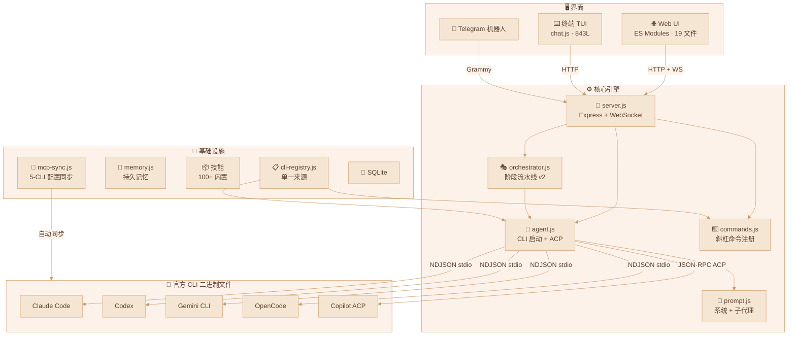
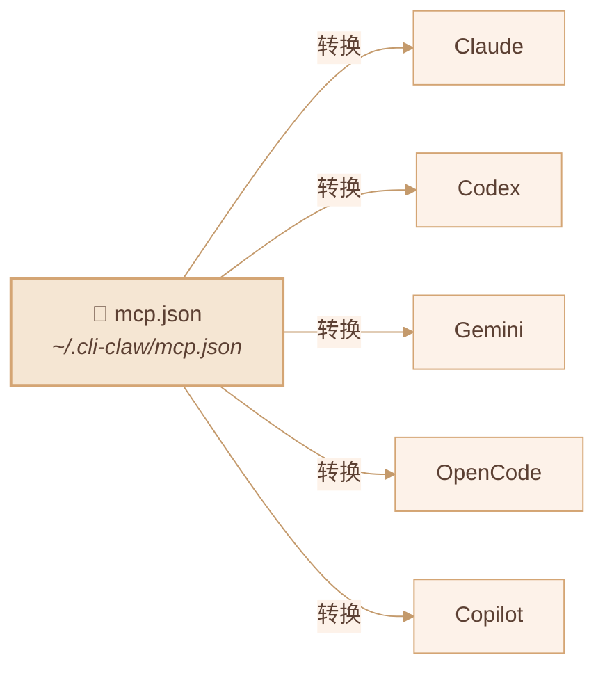
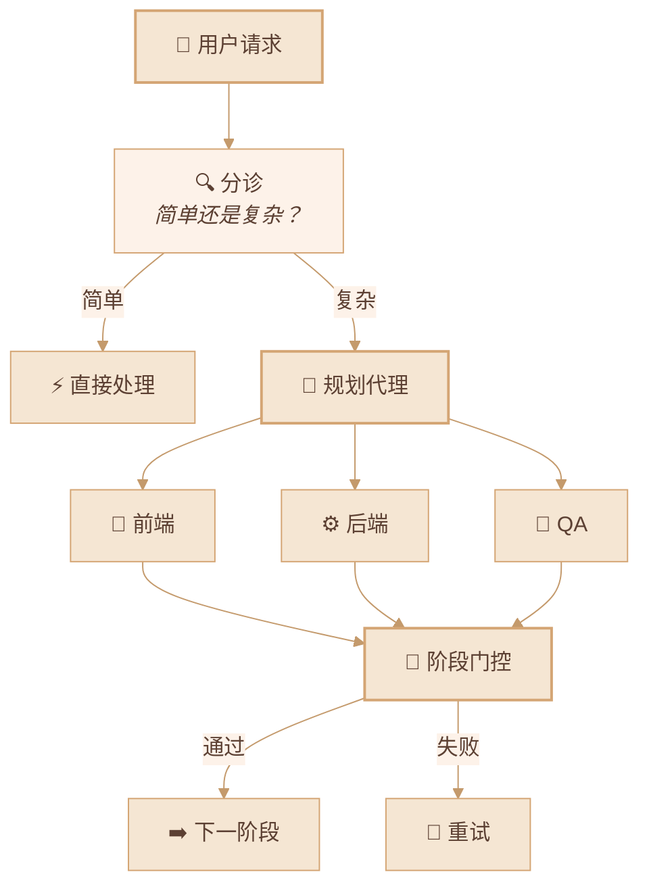

<div align="center">

# 🦞 CLI-CLAW

### 统一 AI 代理编排平台

*一个界面，五个 CLI，封号？不存在的。*

[](#-测试)
[](https://nodejs.org)
[](LICENSE)

[English](README.md) / [한국어](README.ko.md) / **中文**

<!-- 📸 替换为实际截图 -->
<!--  -->

</div>

---

## 🌟 为什么选择 CLI-CLAW？

大多数 AI 编程工具最终都撞上同一堵墙：**API 密钥封禁、速率限制、违反服务条款。**

CLI-CLAW 从根本上换了思路：

> 🛡️ **所有交互都走官方 CLI 二进制文件** — `claude`、`codex`、`gemini`、`opencode`、`copilot --acp`。
>
> 不是包装器。不是代理 API。不是逆向工程。**就是厂商自己发的那个二进制文件。**
>
> **账户安全，没得商量。**

<!-- 📸 替换为实际 Web UI 截图 -->
<!--  -->

---

## ✨ 核心优势

| | 优势 | 说明 |
|--|------|------|
| 🔒 | **CLI 原生 = 绝不封号** | 直接启动官方 CLI 二进制文件，不是什么 API 包装器。封号风险？零。 |
| 🔄 | **五大 CLI，一个界面** | Claude · Codex · Gemini · OpenCode · Copilot — `/cli` 一键切换 |
| ⚡ | **自动回退** | `claude → codex → gemini` — 一个挂了，下一个自动顶上 |
| 🎭 | **编排 v2** | 角色型子代理 + 5 阶段流水线 + 门控审查 |
| 🔌 | **MCP 一次搞定** | 一个 `mcp.json` → 5 个 CLI 配置自动同步 |
| 📦 | **100+ 技能** | 插件系统，2×3 分类（活跃 / 参考） |
| 🧠 | **持久记忆** | 自动总结 + 长期记忆 + 提示注入 |
| 📱 | **Telegram 机器人** | 双向转发 + 来源路由 |
| 🌐 | **浏览器自动化** | Chrome CDP + Vision Click（AI 一键点击） |

---

## 🏗️ 架构



---

## 🚀 快速开始

### Step 1 — 安装（一条命令搞定一切）

```bash
npm install -g cli-claw
```

这一条命令自动完成：
- ✅ 安装**全部 5 个 CLI 工具**（claude, codex, gemini, opencode, copilot）
- ✅ 设置 MCP 服务器（context7）
- ✅ 复制 100+ 默认技能
- ✅ 创建配置目录（`~/.cli-claw/`）
- ✅ 安装技能依赖（uv, playwright）

> 有 bun 用 `bun install -g`，没有则回退到 `npm i -g`。

### Step 2 — 认证（只需要你用的 CLI）

| CLI | 认证命令 | 备注 |
|-----|----------|------|
| Claude | `claude`（首次运行） | Anthropic 登录 |
| Codex | `codex --login` | OpenAI 账号 |
| Copilot | `gh auth login` | GitHub 账号（需要 `gh` CLI） |
| Gemini | `gemini`（首次运行） | Google Cloud 登录 |
| OpenCode | 配置文件中 API key | 参见 [opencode docs](https://opencode.ai) |

> 💡 **不需要全部 5 个** — 哪怕只有一个 CLI 也能用。

### Step 3 — 运行

```bash
cli-claw doctor     # 检查安装状态（11 项检查）
cli-claw serve      # 启动服务器 → http://localhost:3457
cli-claw chat       # 或使用终端 TUI
```

---

## 📋 功能状态

### ✅ 已实现

| 功能 | 说明 | 复杂度 |
|------|------|:------:|
| **多 CLI 引擎** | Claude、Codex、Gemini、OpenCode、Copilot — 统一启动 | ⭐⭐⭐⭐ |
| **Copilot ACP** | JSON-RPC 2.0 over stdio，实时流式传输 | ⭐⭐⭐⭐ |
| **编排 v2** | 分诊 → 角色分配 → 5 阶段流水线 → 门控审查 | ⭐⭐⭐⭐⭐ |
| **MCP 同步** | `mcp.json` → 5 CLI 格式自动转换 + 符号链接保护 | ⭐⭐⭐⭐ |
| **技能系统** | 100+ 内置技能，2×3 分类（活跃/参考） | ⭐⭐⭐ |
| **CLI 注册表** | 单一来源 — 改一个文件，全局自动生效 | ⭐⭐⭐ |
| **斜杠命令** | CLI / Web / Telegram 统一自动补全 + 下拉菜单 | ⭐⭐⭐ |
| **Telegram 机器人** | 双向转发、来源路由、生命周期管理 | ⭐⭐⭐⭐ |
| **持久记忆** | `MEMORY.md` + 每日自动日志 + 会话刷新 + 提示注入 | ⭐⭐⭐ |
| **浏览器自动化** | Chrome CDP：快照、点击、导航、截图 | ⭐⭐⭐ |
| **视觉点击** | 截图 → AI 坐标 → DPR 校正 → 点击（一条命令） | ⭐⭐⭐⭐ |
| **心跳** | 定时自动执行 + 活跃时间 + 安静时间 | ⭐⭐ |
| **回退链** | `claude → codex → gemini` 失败自动重试 | ⭐⭐⭐ |
| **事件去重** | Claude `stream_event`/`assistant` 重叠防止 | ⭐⭐⭐ |
| **70 单元测试** | `node:test` — 零外部依赖 | ⭐⭐ |

### 🔜 计划中

| 功能 | 说明 | 优先级 |
|------|------|:------:|
| **Vector DB 记忆** | 基于嵌入的语义检索（替代 grep） | 📋 |
| **视觉多提供商** | 将 vision-click 扩展到 Claude、Gemini | 📋 |
| **语音 STT** | Telegram 语音转文字技能集成 | 📋 |
| **技能市场** | 社区技能共享 + 版本管理 | 💭 |

---

## 🔌 MCP — 模型上下文协议



```bash
cli-claw mcp                        # 列出已注册的 MCP 服务器
cli-claw mcp install <package>      # 安装 + 注册 + 同步全部 5 CLI
cli-claw mcp sync                   # mcp.json → 所有 CLI 同步
cli-claw mcp reset [--force]        # 重置 + 重新同步
```

> 安装一次 MCP 服务器 → **五个 CLI** 立即可用。

---

## 🎭 子代理编排



| 阶段 | 名称 | 说明 |
|:----:|------|------|
| 1 | 规划 | 任务分解 + 代理分配 |
| 2 | 规划验证 | 可行性检查 + 资源验证 |
| 3 | 开发 | 并行代理执行 |
| 4 | 调试 | 错误修复 + 测试修复 |
| 5 | 集成验证 | E2E 验证 + 合并 |

---

## ⌨️ CLI 命令

```bash
# 服务器 & UI
cli-claw serve                      # 启动服务器（http://localhost:3457）
cli-claw chat                       # 终端 TUI（3 模式，自动补全）
cli-claw init                       # 初始化向导
cli-claw doctor                     # 诊断（11 项检查，--json）
cli-claw status                     # 服务器状态（--json）

# 技能
cli-claw skill                      # 已安装技能列表
cli-claw skill install <name>       # 从 Codex / skills_ref / GitHub 安装
cli-claw skill remove <name>        # 删除
cli-claw skill reset [--force]      # 重置（重新分类 100+ 技能）

# 记忆
cli-claw memory search <query>      # 搜索全部记忆文件
cli-claw memory list                # 文件列表
cli-claw memory read <file>         # 读取指定文件

# 浏览器
cli-claw browser start              # 启动 Chrome（CDP）
cli-claw browser snapshot           # 无障碍树
cli-claw browser screenshot         # 截图
cli-claw browser vision-click "登录"  # AI 智能点击

# 管理
cli-claw employee reset             # 重置为默认 5 名代理
cli-claw reset                      # 全面重置（MCP/技能/员工/会话）
```

---

## 🤖 预配置模型 & 自定义输入

> ⚠️ 以下仅为**预配置的快捷选项**——你可以直接输入**任何模型 ID**，CLI-CLAW 全盘接受。

<details>
<summary><b>Claude Code</b> — claude-sonnet-4-6（默认）</summary>

| 模型 | 说明 |
|------|------|
| `claude-sonnet-4-6` | 默认 — 快速且强大 |
| `claude-opus-4-6` | 最强 |
| `claude-sonnet-4-6[1m]` | 扩展思考（Sonnet） |
| `claude-opus-4-6[1m]` | 扩展思考（Opus） |
| `claude-haiku-4-5-20251001` | 轻量快速 |

</details>

<details>
<summary><b>Codex</b> — gpt-5.3-codex（默认）</summary>

| 模型 | 说明 |
|------|------|
| `gpt-5.3-codex` | 默认 — 最新 |
| `gpt-5.3-codex-spark` | 轻量 |
| `gpt-5.2-codex` | 上一代 |
| `gpt-5.1-codex-max` | 大上下文 |
| `gpt-5.1-codex-mini` | 经济 |

</details>

<details>
<summary><b>Gemini CLI</b> — gemini-2.5-pro（默认）</summary>

| 模型 | 说明 |
|------|------|
| `gemini-3.0-pro-preview` | 最新预览 |
| `gemini-3.1-pro-preview` | 下一代预览 |
| `gemini-2.5-pro` | 默认 — 稳定 |
| `gemini-3-flash-preview` | 快速预览 |
| `gemini-2.5-flash` | 最快 |

</details>

<details>
<summary><b>OpenCode</b> — 含 🆓 免费模型</summary>

| 模型 | 说明 |
|------|------|
| `anthropic/claude-opus-4-6-thinking` | 默认 |
| `anthropic/claude-sonnet-4-6-thinking` | Sonnet 思考 |
| `opencode/big-pickle` | 🆓 免费 |
| `opencode/GLM-5 Free` | 🆓 免费 |
| `opencode/MiniMax M2.5 Free` | 🆓 免费 |
| `opencode/Kimi K2.5 Free` | 🆓 免费 |
| `opencode/GPT 5 Nano Free` | 🆓 免费 |

</details>

<details>
<summary><b>Copilot (ACP)</b> — 含 🆓 免费层</summary>

| 模型 | 费用 | 说明 |
|------|:----:|------|
| `gpt-4.1` | 🆓 | 默认免费模型 |
| `gpt-5-mini` | 🆓 | 免费迷你 |
| `claude-haiku-4.5` | 0.33x | 经济 Claude |
| `claude-sonnet-4.6` | 1x | 默认 — 强大 |
| `gpt-5.3-codex` | 1x | 最新 Codex |
| `claude-opus-4.6` | 3x | 最强 |

</details>

> 💡 **上面只是预设**——在任何 CLI 中你都可以直接键入任意模型 ID，CLI-CLAW 照单全收。
>
> 🔧 想添加新 CLI 或模型？修改 `src/cli-registry.js` **一个文件**——全局自动生效。

---

## 🧪 测试

```bash
npm test    # 70 个测试，~90ms，零外部依赖
```

详情参见 [TESTS.md](TESTS.md)。

| 测试文件 | 覆盖范围 |
|----------|----------|
| `events.test.js` | NDJSON 解析器、会话 ID、工具标签、ACP |
| `events-acp.test.js` | ACP `session/update` — 5 种事件类型 |
| `telegram-forwarding.test.js` | 来源过滤、回退、分块、markdown |
| `cli-registry.test.js` | 结构、默认值、模型选项 |
| `bus.test.js` | 广播、监听器、WS 模拟 |
| `commands-parse.test.js` | parseCommand、executeCommand、补全 |
| `worklog.test.js` | 阶段、待处理代理解析 |

---

## 📡 REST API

<details>
<summary><b>40+ 端点</b></summary>

| 分类 | 端点 |
|------|------|
| 核心 | `GET /api/session`、`POST /api/message`、`POST /api/stop` |
| 注册表 | `GET /api/cli-registry` — CLI/模型单一来源 |
| 编排 | `POST /api/orchestrate/continue`、`POST /api/employees/reset` |
| 命令 | `POST /api/command`、`GET /api/commands?interface=` |
| 设置 | `GET/PUT /api/settings`、`GET/PUT /api/prompt` |
| 记忆 | `GET/POST /api/memory`、`GET /api/claw-memory/search` |
| MCP | `GET/PUT /api/mcp`、`POST /api/mcp/sync,install,reset` |
| 技能 | `GET /api/skills`、`POST /api/skills/enable,disable` |
| 浏览器 | `POST /api/browser/start,stop,act,navigate,screenshot` |
| 员工 | `GET/POST /api/employees`、`PUT/DELETE /api/employees/:id` |
| 配额 | `GET /api/quota`（Claude/Codex/Gemini/Copilot 用量） |

</details>

---

## 📜 许可证

ISC
