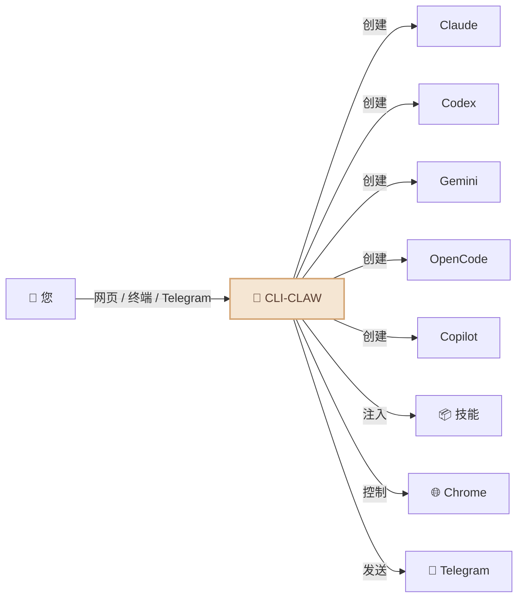
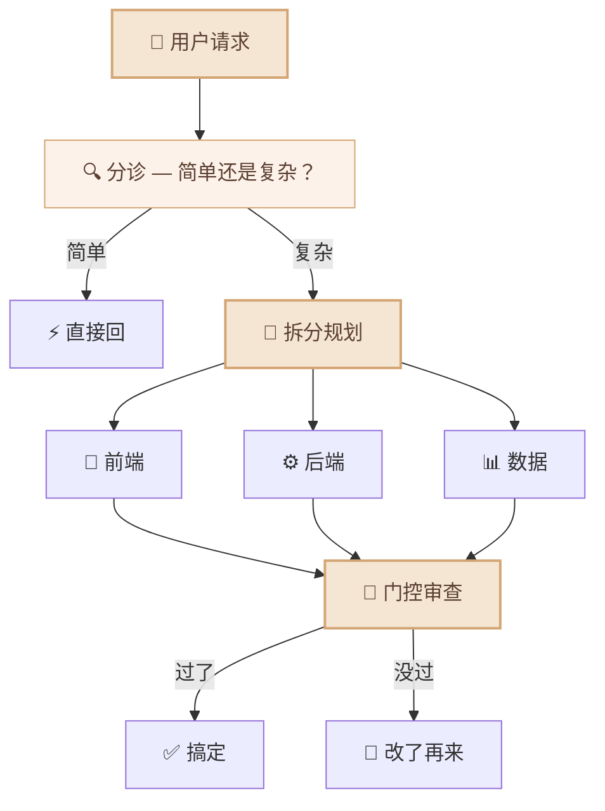
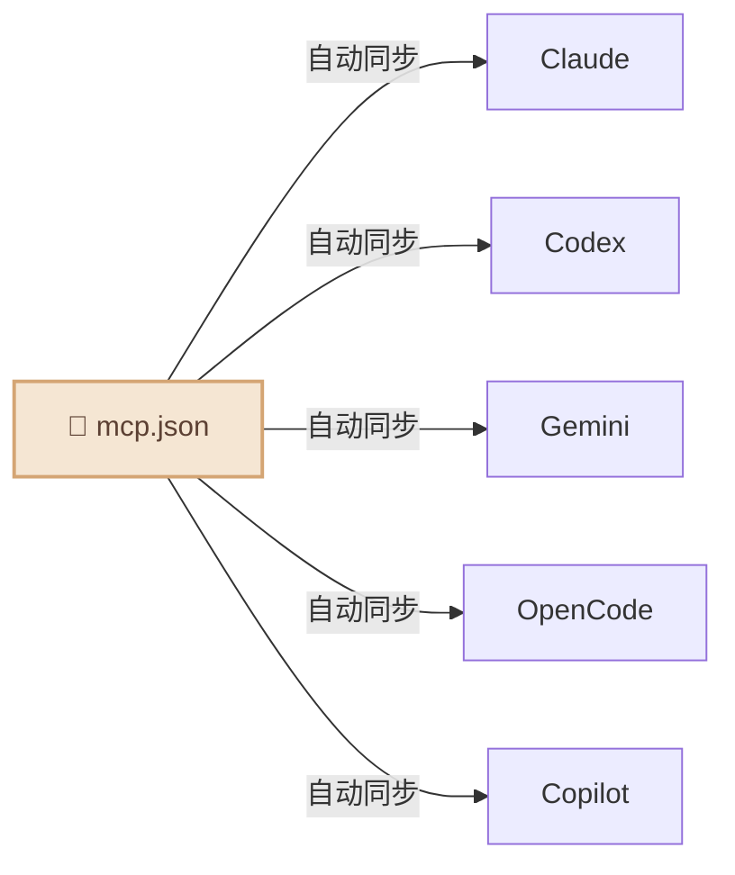

<div align="center">

# 🦞 CLI-CLAW

### 您的专属 AI 助手 — 由 5 大 AI 引擎驱动

*一个助手。五颗大脑。全天候待命。*

[](#-测试)
[](https://typescriptlang.org)
[](https://nodejs.org)
[](LICENSE)

[English](README.md) / [한국어](README.ko.md) / **中文**


</div>

---

## CLI-CLAW 是什么？

CLI-CLAW 是驻留在您本地机器上的**专属 AI 助手**，并在您熟悉的界面中运行 — **网页、终端和 Telegram**。您可以向它提出任何问题、委派任务或是自动化您的工作流。

> 💬 *"帮我整理一下今天的日程"* → 直接在 Telegram 上收到整理好的结果  
> 💬 *"重构这个模块，顺便写好测试"* → 子 Agent 搞定，你喝杯咖啡回来就行  
> 💬 *"把那个 PDF 下载下来，关键信息放到 Notion 里"* → 浏览器 + Notion 技能组合，搞定

与单一模型的助手不同，CLI-CLAW 通过官方 CLI 命令行工具对 **5 大 AI 引擎**（Claude、Codex、Gemini、OpenCode、Copilot）进行编排 — 为您提供各大供应商最优势的能力及统一的体验。当一个引擎处于繁忙状态时，它会自动无缝切换至下一个。107 个内置技能可处理从浏览器自动化到文档生成的所有事务。

| | 为什么选择 CLI-CLAW？ |
|---|---|
| 🛡️ **安全合规 (TOS-Safe)** | 仅使用官方 CLI — 无 API 密钥抓取、无逆向工程、无封号风险。 |
| 🤖 **经过验证的智能体工具** | 5 大实战级编码智能体（Claude、Codex、Gemini、OpenCode、Copilot）集于一身。 |
| ⚡ **多模型自动回退 (Fallback)** | 单一引擎发生故障？下一个立即接管。确保零停机。 |
| 🎭 **基于编排的性能优化** | 复杂的任务会被拆分给专业的子智能体，以实现效率最大化。 |
| 📦 **107 个内置技能** | 浏览器自动化、文档生成、Telegram 通知、持久化记忆 — 开箱即用。 |


---

## 您的助手能做什么？



- 🤖 **5 大 AI 引擎，1 个专属助手** — Claude · Codex · Gemini · OpenCode · Copilot。使用 `/cli` 命令一键切换。
- ⚡ **自动回退 (Fallback)** — 即使一个引擎出现故障，下一个也会无缝接管。
- 🎭 **多智能体编排** — 复杂任务会自动拆分给专业的子智能体并行处理。
- 📦 **107 个技能** — 浏览器控制、文件编辑、图片生成、网页搜索以及[更多功能](#-技能系统)。
- 🧠 **持久化记忆** — 跨越不同会话，记住您过往的对话和偏好设定。
- 📱 **Telegram 机器人** — 通过手机即可与您的助手聊天、发送语音/图片/文件。
- 🌐 **浏览器自动化** — 您的助手能够自动导航网页、点击、打字并进行截图。
- 🔌 **MCP 生态系统** — 仅需安装一次，立刻应用于所有 5 大 AI 引擎。
- 🔍 **网页搜索** — 通过 MCP 工具实时获取最新信息。
- ⏰ **心跳任务** — 设置计划任务，令其在后台自动循环执行。

---

## 快速开始

```bash
# 安装（自动设置一切：5 个 CLI、MCP、105+ 个技能）
npm install -g cli-claw

# 认证你要用的 CLI（有一个就够）
claude auth          # Anthropic
codex login          # OpenAI
gemini               # Google（首次运行）

# 开始
cli-claw doctor      # 检查安装状态（12 项检查）
cli-claw serve       # Web UI → http://localhost:3457
cli-claw chat        # 或使用终端 TUI
```

> 💡 **不用 5 个全装。** 有一个就能用。Copilot 和 OpenCode 都有免费额度。

---

## 📦 技能系统

**107 个技能**开箱即用 — 浏览器、GitHub、Notion、Telegram、记忆、PDF、图片生成等[应有尽有](#)。

<details>
<summary>查看全部技能</summary>

| 层级 | 数量 | 工作方式 |
|------|:----:|----------|
| **活跃技能** | 17 | 每次对话自动加载，随时可用。 |
| **参考技能** | 88+ | 用到的时候 AI 自己去读，按需调用。 |

#### 活跃技能（常驻）

| 技能 | 功能 |
|------|------|
| `browser` | Chrome 自动化 — 快照、点击、导航、截图 |
| `github` | 问题、PR、CI、代码审查（使用 `gh` CLI） |
| `notion` | 创建/管理 Notion 页面和数据库 |
| `memory` | 跨会话持久长期记忆 |
| `telegram-send` | 向 Telegram 发送照片、文档、语音消息 |
| `vision-click` | 截图 → AI 找坐标 → 点击（一条命令） |
| `imagegen` | 通过 OpenAI Image API 生成/编辑图像 |
| `pdf` / `docx` / `xlsx` | 读取、创建、编辑办公文档 |
| `screen-capture` | macOS 截图和摄像头捕获 |
| `openai-docs` | 最新 OpenAI API 文档 |
| `dev` / `dev-frontend` / `dev-backend` / `dev-data` / `dev-testing` | 子 Agent 开发指南 |

#### 参考技能（按需调用）

88 个技能随时待命 — Spotify、天气、深度研究、TTS、视频下载、Apple 提醒事项、1Password、Terraform、PostgreSQL、Jupyter 等。

```bash
cli-claw skill install <name>    # 参考 → 活跃，永久激活
```

</details>

---

## 📱 Telegram — 您口袋里的助手

您的助手不再被局限于办公桌前。通过 Telegram 随时随地开展对话：

```
📱 Telegram ←→ 🦞 CLI-CLAW ←→ 🤖 AI 引擎
```

**您可以在 Telegram 中进行哪些操作：**
- 💬 与您的助手聊天（在 5 大 AI 引擎中任选其一）
- 🎤 发送语音消息（自动转写为文字）
- 📎 发送文件和图片进行处理
- ⚡ 运行系统命令（`/cli`、`/model`、`/status`）
- 🔄 随时随地切换 AI 引擎

**您的助手会返回什么内容：**
- 带有 Markdown 格式的 AI 答复
- 生成的图片、PDF 及各类文档
- 计划任务（心跳任务）的执行结果
- 浏览器快照与截图

<p align="center">
  
</p>

---

## 🎭 多智能体编排

对于复杂的任务，您的助手会自动将其委派给专业的子智能体：




您的助手会**自主决定**任务是需要编排介入，还是直接予以答复。完全无需额外配置。

---

## 🔌 MCP — 单次配置，驱动 5 大 AI 引擎

```bash
cli-claw mcp install @anthropic/context7    # 安装一次
# → 自动同步到 Claude、Codex、Gemini、OpenCode、Copilot
```



只需告别编辑 5 份不同配置文件的繁琐流程。单次安装，所有 AI 引擎立刻生效。

---

## ⌨️ CLI 命令

```bash
cli-claw serve                         # 启动服务器
cli-claw chat                          # 终端 TUI
cli-claw doctor                        # 诊断（12 项检查）
cli-claw skill install <name>          # 安装技能
cli-claw mcp install <package>         # 安装 MCP → 同步全部 5 CLI
cli-claw memory search <query>         # 搜索记忆
cli-claw browser start                 # 启动 Chrome（CDP）
cli-claw browser vision-click "登录"    # AI 智能点击
cli-claw reset                         # 全面重置
```

---

## 🤖 模型

每个 CLI 都有预设快捷选项，但你也可以直接输 **任意模型 ID**。

<details>
<summary>查看全部预设</summary>

| CLI | 默认值 | 主要模型 |
|-----|--------|----------|
| **Claude** | `claude-sonnet-4-6` | opus-4-6、haiku-4-5、扩展思考变体 |
| **Codex** | `gpt-5.3-codex` | spark、5.2、5.1-max、5.1-mini |
| **Gemini** | `gemini-2.5-pro` | 3.0-pro-preview、3-flash-preview、2.5-flash |
| **OpenCode** | `claude-opus-4-6-thinking` | 🆓 big-pickle、GLM-5、MiniMax、Kimi、GPT-5-Nano |
| **Copilot** | `gpt-4.1` 🆓 | 🆓 gpt-5-mini、claude-sonnet-4.6、opus-4.6 |

</details>

> 🔧 想加模型？改 `src/cli/registry.ts` 这一个文件就行，全局自动生效。

---

## 🛠️ 开发

<details>
<summary>构建、运行和项目结构</summary>

```bash
# 构建（TypeScript → JavaScript）
npm run build          # tsc → dist/

# 从源码运行（开发）
npm run dev            # tsx server.ts
npx tsx bin/cli-claw.ts serve   # 直接运行 .ts 文件

# 从构建产物运行（生产）
node dist/bin/cli-claw.js serve
```

**项目结构：**

```
src/
├── agent/          # AI 代理生命周期 & 生成
├── browser/        # Chrome CDP 自动化
├── cli/            # CLI 注册表 & 模型预设
├── core/           # DB、配置、日志
├── http/           # Express 服务器 & 中间件
├── memory/         # 持久记忆系统
├── orchestrator/   # 多 Agent 编排流水线
├── prompt/         # 提示注入 & AGENTS.md 生成
├── routes/         # REST API 端点（40+）
├── security/       # 输入验证 & 安全护栏
└── telegram/       # Telegram 机器人集成
```

> TypeScript — `strict: true`、`NodeNext` 模块解析、ES2022 目标。

</details>

---

## 🧪 测试

<details>
<summary>252 pass · 1 skipped · 零外部依赖</summary>

```bash
npm test
```

用 `tsx --test` 跑（Node.js 原生测试 + TypeScript）。

</details>

---

## 📖 文档

| 文档 | 内容 |
|------|------|
| [ARCHITECTURE.md](docs/ARCHITECTURE.md) | 系统设计、模块图、REST API（40+ 端点） |
| [TESTS.md](TESTS.md) | 测试覆盖率、测试计划 |

---

## 🤝 参与贡献

欢迎贡献！上手方法：

1. Fork 仓库，从 `main` 拉个分支
2. `npm run build && npm test` 确认一切正常
3. 提交 PR — 我们会尽快 review

> 📋 发现 Bug 或者有好点子？[提个 Issue](https://github.com/cli-claw/cli-claw/issues)

---

<div align="center">

**⭐ 觉得 CLI-CLAW 好用？点个 Star 支持一下吧！**

Made with ❤️ by the CLI-CLAW community

[ISC License](LICENSE)

</div>
