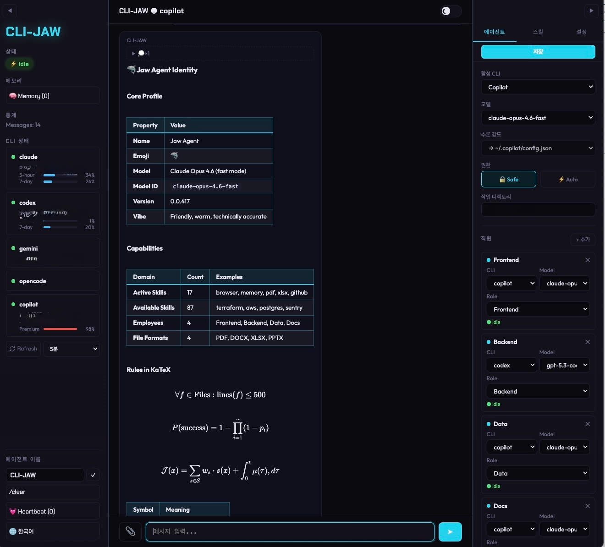
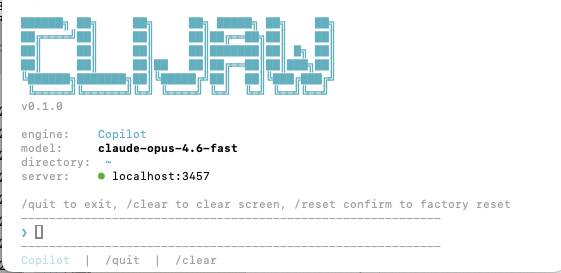
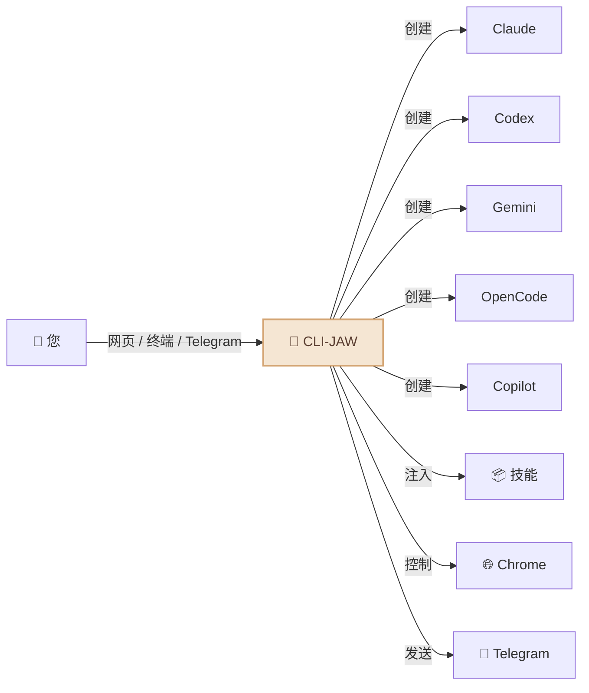
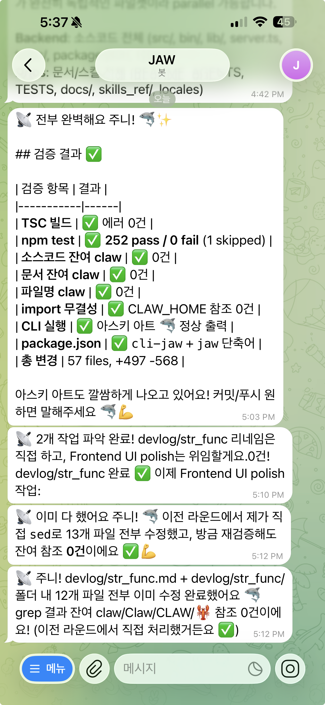
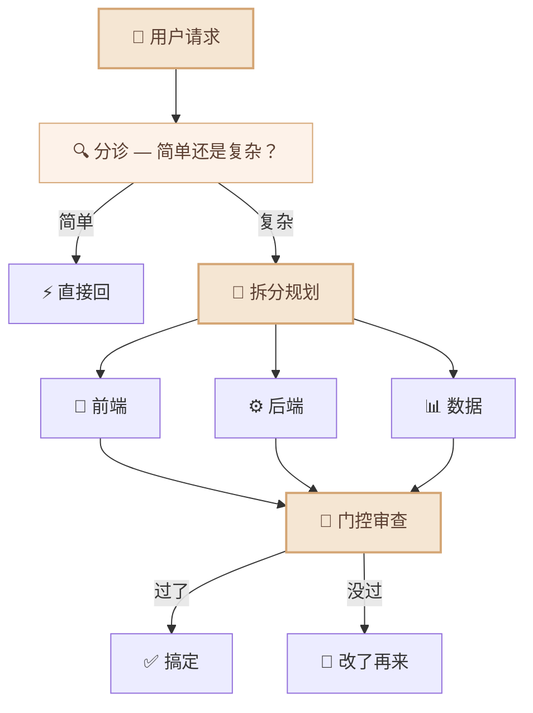
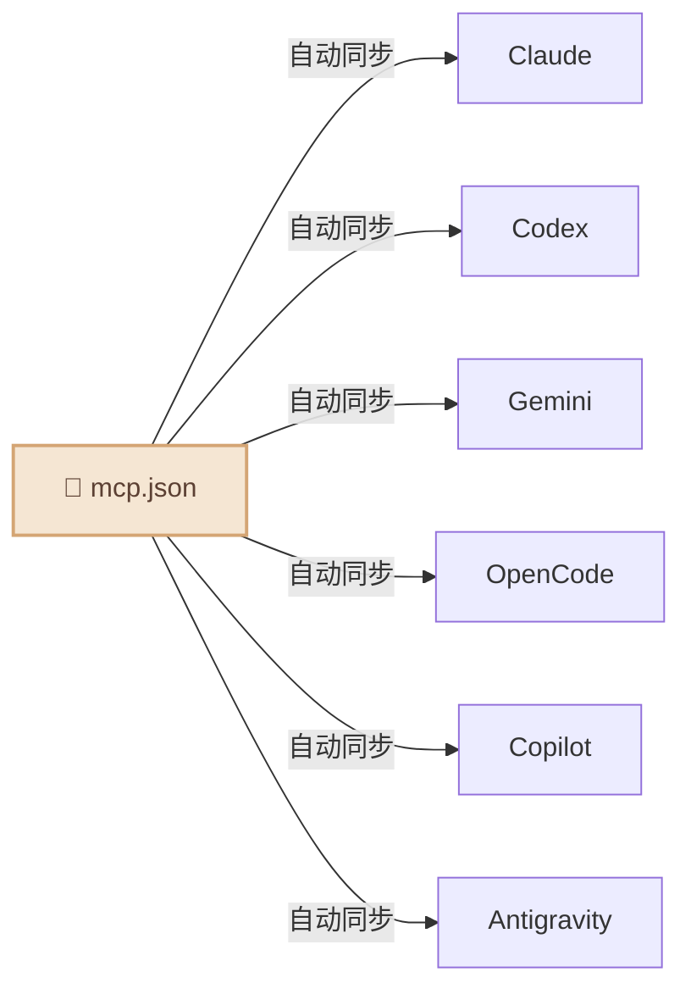

<div align="center">

# 🦈 CLI-JAW

### 内置 5 大 AI 引擎的专属本地助手

*Claude、Codex、Gemini... 从此告别来回切换。*

[](#-测试)
[](https://typescriptlang.org)
[](https://nodejs.org)
[](LICENSE)
[](https://npmjs.com/package/cli-jaw)
[](#-docker--容器隔离)
[](#)

[English](README.md) / [한국어](README.ko.md) / **中文**

<video src="https://github.com/user-attachments/assets/a7cf17c9-bfb3-44f0-b7fd-d001a39643fd" autoplay loop muted playsinline width="100%"></video>

</div>

## 快速链接

- [安装与启动](#-安装与启动30-秒) · [认证 AI 引擎](#-认证-ai-引擎) · [CLI-JAW 是什么？](#cli-jaw-是什么)
- [功能](#您的助手能做什么) · [技能](#-技能系统) · [Telegram](#-telegram--您口袋里的助手) · [语音 & STT](#-语音--stt--语音转文字)
- [多智能体编排](#-多智能体编排) · [MCP](#-mcp--单次配置驱动-6-大-ai-引擎) · [CLI 命令](#️-cli-命令)
- [多实例](#️-多实例--项目级别的独立环境) · [模型](#-模型) · [Docker](#-docker--容器隔离)
- [开发](#️-开发) · [测试](#-测试) · [文档](#-文档) · [故障排查](#-故障排查) · [参与贡献](#-参与贡献)

<details>
<summary>🪟 <b>你在用 Windows 吗？</b> — WSL 一键安装</summary>

**第一步：安装 WSL**（以管理员身份运行 PowerShell — 仅需一次）

```powershell
wsl --install
```

按提示重启电脑。重启后从开始菜单打开 **Ubuntu**。

**第二步：安装 CLI-JAW**（在 Ubuntu/WSL 终端中）

```bash
curl -fsSL https://raw.githubusercontent.com/lidge-jun/cli-jaw/master/scripts/install-wsl.sh | bash
```

脚本自动安装必备软件（`curl`、`unzip`、`git`）、Node.js 22+ 和 CLI-JAW。

**第三步：重新加载 Shell**（重要 — 使 PATH 更改生效）

```bash
source ~/.bashrc
```

**第四步：认证 AI 引擎**（任选其一）

```bash
copilot login    # GitHub Copilot（免费）
opencode         # OpenCode（提供免费模型）
claude auth      # Anthropic Claude
codex login      # OpenAI Codex
gemini           # Google Gemini
```

**第五步：启动聊天**

```bash
jaw serve
# → http://localhost:3457
```

> 💡 脚本使用 [fnm](https://github.com/Schniz/fnm) 管理 Node.js。如果已有 `nvm`，则自动使用 nvm。

<details>
<summary>🔧 <b>WSL 故障排查</b></summary>

| 问题                                    | 解决方法                                                 |
| --------------------------------------- | -------------------------------------------------------- |
| `unzip: command not found`              | 重新运行安装脚本 — 现已自动安装 `unzip`                   |
| 安装后 `jaw: command not found`          | 运行 `source ~/.bashrc` 重新加载 PATH                     |
| 仍然找不到 `jaw`                         | 运行 `export PATH="$(npm config get prefix)/bin:$PATH"`   |
| `npm install -g` 权限错误                | 运行 `sudo chown -R $USER $(npm config get prefix)`       |

</details>

</details>

<details>
<summary>🍎 <b>终端新手？</b> — 一键安装 Node.js + CLI-JAW</summary>

**第一步：打开终端**

打开 **Finder** → **应用程序** → **实用工具** → **终端.app**
（或者按 `⌘ Space` 然后输入 `Terminal`）

**第二步：粘贴并按 Enter**

```bash
curl -fsSL https://raw.githubusercontent.com/lidge-jun/cli-jaw/master/scripts/install.sh | bash
```

Node.js + CLI-JAW 会自动安装。等到出现 🎉 就完成了。

**第三步：登录并启动**

```bash
copilot login    # 或者: claude auth / codex login / gemini login
jaw serve
```

在浏览器中打开 **http://localhost:3457**。搞定！🦈

</details>

---

## 🚀 安装与启动（30 秒）

```bash
npm install -g cli-jaw
jaw serve
```

**搞定。** 打开 **http://localhost:3457** 直接开聊。🦈

> 🕐 **想让它 24 小时运行？** `jaw service install` — 自动检测 systemd、launchd 或 Docker。

> 需要 **Node.js ≥ 22**（[下载](https://nodejs.org)）+ 下方**至少 1 个 AI CLI** 完成认证。

---

## 🔑 认证 AI 引擎

只需 **一个** — 选你有的就行：

```bash
# ── 免费 ──
copilot login                # GitHub Copilot（免费套餐）
opencode                     # OpenCode — 首次运行自动认证（有免费模型）

# ── 付费 ──
claude auth                  # Anthropic Claude
codex login                  # OpenAI Codex
gemini                       # Google Gemini — 首次运行触发认证
```

检查就绪状态：`jaw doctor`

<details>
<summary>📋 <code>jaw doctor</code> 输出示例</summary>

```
🦈 CLI-JAW Doctor — 12 checks

 ✅ Node.js        v22.15.0
 ✅ npm             v10.9.4
 ✅ Claude CLI      installed
 ✅ Codex CLI       installed
 ⚠️ Gemini CLI      not found (optional)
 ✅ OpenCode CLI    installed
 ✅ Copilot CLI     installed
 ✅ Database        jaw.db OK
 ✅ Skills          22 active, 94 reference
 ✅ MCP             3 servers configured
 ✅ Memory          MEMORY.md exists
 ✅ Server          port 3457 available
```

</details>

> 💡 **不必全装 5 个。** 有一个就能跑。助手会自动检测可用引擎，缺了就无缝切换到下一个。

---

## CLI-JAW 是什么？

CLI-JAW 是驻留在您本地机器上的**专属 AI 助手**，并在您熟悉的界面中运行 — **网页、终端、Telegram 和 Discord**。您可以向它提出任何问题、委派任务或是自动化您的工作流。


> 💬 *"帮我整理一下今天的日程"* → 直接在 Telegram 上收到整理好的结果
> 💬 *"重构这个模块，顺便写好测试"* → 子 Agent 搞定，你喝杯咖啡回来就行
> 💬 *"把那个 PDF 下载下来，关键信息放到 Notion 里"* → 浏览器 + Notion 技能组合，搞定

与单一模型的助手不同，CLI-JAW 通过官方 CLI 命令行工具对 **5 大 AI 引擎**（Claude、Codex、Gemini、OpenCode、Copilot）进行编排 — 为您提供各大供应商最优势的能力及统一的体验。当一个引擎处于繁忙状态时，它会自动无缝切换至下一个。116 个内置技能可处理从浏览器自动化到文档生成的所有事务。

|                                 | 为什么选择 CLI-JAW？                                                                  |
| ------------------------------- | ------------------------------------------------------------------------------------- |
| 🛡️ **安全合规 (TOS-Safe)**       | 仅使用官方 CLI — 无 API 密钥抓取、无逆向工程、无封号风险。                            |
| 🤖 **经过验证的智能体工具**      | 5 大实战级编码智能体（Claude、Codex、Gemini、OpenCode、Copilot）集于一身。            |
| ⚡ **多模型自动回退 (Fallback)** | 单一引擎发生故障？下一个立即接管。确保零停机。                                        |
| 🎭 **基于编排的性能优化**        | 复杂的任务会被拆分给专业的子智能体，以实现效率最大化。                                |
| 📦 **116 个内置技能**            | 浏览器自动化、文档生成、Telegram 通知、持久化记忆 — 开箱即用。                        |
| 🖥️ **跨平台支持**                | macOS、Linux、Windows — ENOENT-safe CLI 启动、自动检测、`.cmd` 支持，跨平台原生运行。 |



---

## 🆕 新功能 (v1.4.0)

| 功能                 | 说明                                                                                                                                                                                                      |
| -------------------- | --------------------------------------------------------------------------------------------------------------------------------------------------------------------------------------------------------- |
| 🧠 **高级记忆系统**   | 5 层分级存储（Profile、Episodes、Semantic、Procedures、Sessions）。混合检索：FTS5 + 语义搜索 + 查询扩展。Gemini Flash-Lite 嵌入。完整 UI 运维仪表盘（重建索引/审计）。                                    |
| 🎨 **模块化开发技能** | `dev-frontend`（1,428 行、13 文件）和 `dev-backend`（1,275 行、9 文件）从单一 SKILL.md 扩展为模块化结构，含核心参考（美学、反套路、安全、架构）和技术栈指南（React、Next.js、Node、Python、PostgreSQL）。 |
| 📄 **办公套件扩展**   | 新增 HWP（韩文文档）支持。增强 PPTX 生成。活跃技能增至 21 个（原 18 个）。                                                                                                                                |
| ⚡ **ACP 进度心跳**   | 长时间代理运行期间实时 `stderr_activity` 事件推送。UI 模态控件支持条件心跳调度。                                                                                                                          |
| 🔄 **技能重置**       | `jaw skill reset` — 支持 `--soft`（重新加载）和 `--hard`（完全重装）模式。`JAW_HOME` 与 `settings.json` 不一致时自动修正 `workingDir`。                                                                   |
| 🎬 **视频技能**       | 基于 Remotion 的 JSON 时间线定义程序化视频渲染。支持逐段旁白同步的 TTS 整合。                                                                                                                             |
| 📐 **1M 上下文切换**  | 通过 `config.toml` 注入为支持的模型启用/禁用 1M Token 上下文窗口。                                                                                                                                        |
| 🚀 **预览版发布**     | 带时间戳版本（`v1.4.0-preview.YYYYMMDD`）的自动化预览发布流水线。GitHub prerelease 集成。                                                                                                                 |

---

## 您的助手能做什么？


```mermaid
graph LR
    YOU["👤 您"] -->|网页 / 终端 / Telegram| JAW["🦈 CLI-JAW"]
    JAW -->|创建| C["Claude"]
    JAW -->|创建| X["Codex"]
    JAW -->|创建| G["Gemini"]
    JAW -->|创建| O["OpenCode"]
    JAW -->|创建| P["Copilot"]
    JAW -->|注入| SK["📦 技能"]
    JAW -->|控制| BR["🌐 Chrome"]
    JAW -->|发送| TG["📱 Telegram"]
    
    style JAW fill:#f5e6d3,stroke:#d4a574,stroke-width:2px,color:#5c4033
```

- 🤖 **5 大 AI 引擎，1 个专属助手** — Claude · Codex · Gemini · OpenCode · Copilot。使用 `/cli` 命令一键切换。
- ⚡ **自动回退 (Fallback)** — 即使一个引擎出现故障，下一个也会无缝接管。
- 🎭 **多智能体编排** — 复杂任务会自动拆分给专业的子智能体并行处理。
- 🎤 **语音输入** — Web 麦克风按钮 + Telegram 语音消息。多供应商 STT（OpenAI、Vertex AI）。
- 📝 **提示词模板** — 使用可视化节点地图编辑器创建、管理和复用提示词模板。
- 📦 **116 个技能** — 浏览器控制、文件编辑、图片生成、网页搜索以及[更多功能](#-技能系统)。
- 🧠 **持久化记忆** — 跨越不同会话，记住您过往的对话和偏好设定。
- 📱 **Telegram 机器人** — 通过手机即可与您的助手聊天、发送语音/图片/文件。
- 🌐 **浏览器自动化** — 您的助手能够自动导航网页、点击、打字并进行截图。
- 🔌 **MCP 生态系统** — 仅需安装一次，立刻应用于所有 5 大 AI 引擎。
- 🔍 **网页搜索** — 通过 MCP 工具实时获取最新信息。
- ⏰ **心跳任务** — 设置计划任务，令其在后台自动循环执行。

---

### 其他启动方式

```bash
jaw chat         # 终端 TUI（无需浏览器）
jaw service install  # 开机自动启动 (systemd/launchd/docker 自动检测)
```

> ⚠️ **安装须知：** `npm install -g cli-jaw` 运行 postinstall 脚本，设置技能目录、自定义指令和 MCP 配置。现有配置不会被覆盖，而是合并处理。

---

## 📦 技能系统

**116 个技能**开箱即用 — 浏览器、GitHub、Notion、Telegram、记忆、PDF、图片生成等[应有尽有](#)。

<details>
<summary>查看全部技能</summary>

| 层级         | 数量  | 工作方式                           |
| ------------ | :---: | ---------------------------------- |
| **活跃技能** |  22   | 每次对话自动加载，随时可用。       |
| **参考技能** |  94   | 用到的时候 AI 自己去读，按需调用。 |

#### 活跃技能（常驻）

| 技能                                                                | 功能                                    |
| ------------------------------------------------------------------- | --------------------------------------- |
| `browser`                                                           | Chrome 自动化 — 快照、点击、导航、截图              |
| `github`                                                            | 问题、PR、CI、代码审查（使用 `gh` CLI）             |
| `notion`                                                            | 创建/管理 Notion 页面和数据库                       |
| `memory`                                                            | 跨会话持久长期记忆                                  |
| `telegram-send`                                                     | 向 Telegram 发送照片、文档、语音消息                |
| `vision-click`                                                      | 截图 → AI 找坐标 → 点击（一条命令）                 |
| `pdf` / `pdf-expert` / `docx` / `xlsx` / `pptx` / `hwp`            | 读取、创建、编辑办公及 PDF 文档（含韩文 HWP）       |
| `screen-capture`                                                    | macOS 截图和摄像头捕获                              |
| `video`                                                             | 基于 Remotion 的 JSON 编程式视频渲染                 |
| `dev` / `dev-frontend` / `dev-backend` / `dev-data` / `dev-testing` | 子 Agent 开发指南                                   |
| `dev-pabcd` / `dev-scaffolding` / `dev-code-reviewer`               | 编排、脚手架和代码审查指南                          |

#### 参考技能（按需调用）

94 个技能随时待命 — imagegen、openai-docs、Spotify、天气、深度研究、TTS、视频下载、Apple 提醒事项、1Password、Terraform、PostgreSQL、Jupyter 等。

```bash
jaw skill install <name>    # 参考 → 活跃，永久激活
```

</details>

---

## 📱 Telegram — 您口袋里的助手

您的助手不再被局限于办公桌前。通过 Telegram 随时随地开展对话：

```
📱 Telegram ←→ 🦈 CLI-JAW ←→ 🤖 AI 引擎
```

<details>
<summary>📋 Telegram 配置（3 步搞定）</summary>

1. **创建机器人** — 给 [@BotFather](https://t.me/BotFather) 发 `/newbot` → 复制 Token
2. **配置** — 运行 `jaw init --telegram-token 你的TOKEN`，或在 Web UI 设置中填入
3. **开聊** — 给你的机器人发任意消息。首次发送时 Chat ID 会自动保存。

</details>

**您可以在 Telegram 中进行哪些操作：**
- 💬 与您的助手聊天（在 5 大 AI 引擎中任选其一）
- 🎤 发送语音消息（自动转写为文字）
- 📎 发送文件和图片进行处理
- 🎙️ 在单条消息中组合语音 + 文字 + 文件附件
- ⚡ 运行系统命令（`/cli`、`/model`、`/status`）
- 🔄 随时随地切换 AI 引擎

**您的助手会返回什么内容：**
- 带有 Markdown 格式的 AI 答复
- 生成的图片、PDF 及各类文档
- 计划任务（心跳任务）的执行结果
- 浏览器快照与截图

<p align="center">
  
</p>

---

## 🎤 语音 & STT — 语音转文字

CLI-JAW 通过多供应商 STT 在所有界面支持语音输入：

| 供应商               | 设置方法                                   |
| -------------------- | ------------------------------------------ |
| **OpenAI 兼容**      | Settings UI → STT → OpenAI 端点 + API 密钥 |
| **Google Vertex AI** | Settings UI → STT → Vertex AI 凭证         |
| **自定义端点**       | 任何 OpenAI 兼容的 STT API URL             |

**可以使用语音的场景：**

- 🌐 **Web UI** — 点击麦克风按钮实时录音并转写
- 📱 **Telegram** — 发送语音消息，AI 处理前自动转写
- 🎙️ **多模态** — 在单条消息中组合语音 + 文字 + 文件附件

所有 STT 设置（供应商、API 密钥、语言）均在 **Settings UI** 中管理 — 无需编辑配置文件。

---

## 🎭 多智能体编排

对于复杂的任务，您的助手会自动将其委派给专业的子智能体：



```mermaid
graph TD
    USER["👤 用户请求"] --> TRIAGE["🔍 分诊 — 简单还是复杂？"]
    
    TRIAGE -->|简单| DIRECT["⚡ 直接回"]
    TRIAGE -->|复杂| PLAN["📝 拆分规划"]
    
    PLAN --> FE["🎨 前端"]
    PLAN --> BE["⚙️ 后端"]  
    PLAN --> DATA["📊 数据"]
    
    FE --> GATE["🚪 门控审查"]
    BE --> GATE
    DATA --> GATE
    
    GATE -->|过了| NEXT["✅ 搞定"]
    GATE -->|没过| RETRY["🔄 改了再来"]

    style USER fill:#f5e6d3,stroke:#d4a574,stroke-width:2px,color:#5c4033
    style TRIAGE fill:#fdf2e9,stroke:#d4a574,color:#5c4033
    style PLAN fill:#f5e6d3,stroke:#d4a574,stroke-width:2px,color:#5c4033
    style GATE fill:#f5e6d3,stroke:#d4a574,stroke-width:2px,color:#5c4033
```

您的助手会**自主决定**任务是需要编排介入，还是直接予以答复。完全无需额外配置。

---

## 🔌 MCP — 单次配置，驱动 6 大 AI 引擎

```bash
jaw mcp install @anthropic/context7    # 安装一次
# → 自动同步到 Claude、Codex、Gemini、OpenCode、Copilot、Antigravity
```


```mermaid
graph LR
    MJ["📄 mcp.json"] -->|自动同步| CL["Claude"]
    MJ -->|自动同步| CX["Codex"]
    MJ -->|自动同步| GM["Gemini"]
    MJ -->|自动同步| OC["OpenCode"]
    MJ -->|自动同步| CP["Copilot"]
    MJ -->|自动同步| AG["Antigravity"]
    
    style MJ fill:#f5e6d3,stroke:#d4a574,stroke-width:2px,color:#5c4033
```

只需告别编辑 6 份不同配置文件的繁琐流程。单次安装，所有 AI 引擎立刻生效。

---

## ⌨️ CLI 命令

```bash
jaw serve                         # 启动服务器
jaw service install               # 开机自动启动 (systemd/launchd/docker 自动检测)
jaw service status                # 查看守护进程状态
jaw service unset                 # 取消自动启动
jaw service logs                  # 查看服务日志
jaw chat                          # 终端 TUI
jaw doctor                        # 诊断（12 项检查）
jaw skill install <name>          # 安装技能
jaw mcp install <package>         # 安装 MCP → 同步全部 6 CLI
jaw memory search <query>         # 搜索记忆
jaw browser start                 # 启动 Chrome（CDP）
jaw browser vision-click "登录"    # AI 智能点击
jaw clone ~/my-project            # 实例克隆
jaw --home ~/my-project serve --port 3458  # 运行第二个实例
jaw reset                         # 全面重置
```

---

## 🏗️ 多实例 — 项目级别的独立环境

可以同时运行多个独立的 CLI-JAW 实例 — 每个都有自己的设置、记忆、技能和数据库。

```bash
# 将默认实例克隆到新项目
jaw clone ~/my-project

# 在不同端口运行
jaw --home ~/my-project serve --port 3458

# 或者两个都设置开机自启
jaw service install                                # 默认 → 端口 3457
jaw --home ~/my-project service install --port 3458 # 项目 → 端口 3458
```

每个实例完全独立 — 工作目录、记忆、MCP 配置各不相同。非常适合工作/个人环境分离或按项目配置 AI。

| 参数 / 环境变量       | 功能                           |
| --------------------- | ------------------------------ |
| `--home <路径>`       | 指定本次运行使用的自定义主目录 |
| `--home=<路径>`       | 同上（`=` 语法）               |
| `CLI_JAW_HOME=<路径>` | 通过环境变量指定               |
| `jaw clone <目标>`    | 将当前实例克隆到新目录         |
| `--port <端口>`       | `serve` / `service` 自定义端口 |

---

## 🤖 模型

每个 CLI 都有预设快捷选项，但你也可以直接输 **任意模型 ID**。

<details>
<summary>查看全部预设</summary>

| CLI          | 默认值                     | 主要模型                                       |
| ------------ | -------------------------- | ---------------------------------------------- |
| **Claude**   | `claude-sonnet-4-6`        | opus-4-6、haiku-4-5、扩展思考变体              |
| **Codex**    | `gpt-5.3-codex`            | spark、5.2、5.1-max、5.1-mini                  |
| **Gemini**   | `gemini-2.5-pro`           | 3.0-pro-preview、3-flash-preview、2.5-flash    |
| **OpenCode** | `claude-opus-4-6-thinking` | 🆓 big-pickle、GLM-5、MiniMax、Kimi、GPT-5-Nano |
| **Copilot**  | `gpt-4.1` 🆓                | 🆓 gpt-5-mini、claude-sonnet-4.6、opus-4.6      |

</details>

> 🔧 想加模型？改 `src/cli/registry.ts` 这一个文件就行，全局自动生效。

---

## 🐳 Docker — 容器隔离

在 Docker 容器中运行以实现安全隔离 — AI 代理无法访问主机文件。

```bash
docker compose up -d        # → http://localhost:3457
```

> 详细信息请参阅 [English README](README.md#-docker--container-isolation)。
> 提供 `Dockerfile`（npm 发布版）和 `Dockerfile.dev`（本地源码构建）两种方式。

---

## 🛠️ 开发

<details>
<summary>构建、运行和项目结构</summary>

```bash
# 构建（TypeScript → JavaScript）
npm run build          # tsc → dist/

# 从源码运行（开发）
npm run dev            # tsx server.ts
npx tsx bin/cli-jaw.ts serve   # 直接运行 .ts 文件

# 从构建产物运行（生产）
node dist/bin/cli-jaw.js serve
```

**项目结构：**

```
src/
├── agent/          # AI 代理生命周期 & 生成
├── browser/        # Chrome CDP 自动化
├── cli/            # CLI 注册表 & 模型预设
├── core/           # DB、配置、日志
├── http/           # Express 服务器 & 中间件
├── memory/         # 持久记忆系统
├── orchestrator/   # 多 Agent 编排流水线
├── prompt/         # 提示注入 & AGENTS.md 生成
├── routes/         # REST API 端点（40+）
├── security/       # 输入验证 & 安全护栏
└── telegram/       # Telegram 机器人集成
```

> TypeScript — `strict: true`、`NodeNext` 模块解析、ES2022 目标。

</details>

---

## 🧪 测试

<details>
<summary>888 pass · 2 skipped · 零外部依赖</summary>

```bash
npm test
```

用 `tsx --test` 跑（Node.js 原生测试 + TypeScript）。

</details>

---

## 📖 文档

| 文档                                    | 内容                                   |
| --------------------------------------- | -------------------------------------- |
| [ARCHITECTURE.md](docs/ARCHITECTURE.md) | 系统设计、模块图、REST API（40+ 端点） |
| [TESTS.md](TESTS.md)                    | 测试覆盖率、测试计划                   |

---

## 🔧 故障排查

| 症状                         | 原因                          | 解决方法                                                                 |
| ---------------------------- | ----------------------------- | ------------------------------------------------------------------------ |
| `command not found: cli-jaw` | npm 全局 bin 不在 PATH 中     | 运行 `npm config get prefix`，将 `bin/` 加入 PATH                        |
| `doctor` 显示 CLI 缺失       | 对应 CLI 未安装               | 按提示安装，如 `npm i -g @anthropic-ai/claude-code`                      |
| 端口 3457 被占用             | 其他进程占用了端口            | 改用 `PORT=4000 jaw serve` 或终止占用进程                                |
| Telegram 机器人无响应        | Token 未配置或缺少 Chat ID    | 重新运行 `jaw init --telegram-token ...`                                 |
| Telegram ✓✓ 延迟显示         | Telegram 服务器端交付确认时序 | 正常行为 — 服务器负载较高时可能延迟数分钟，非 Bug                        |
| `npm install -g` 权限错误    | 全局目录权限不足              | 使用 `sudo npm i -g cli-jaw` 或推荐 [nvm](https://github.com/nvm-sh/nvm) |
| 构建失败（`tsc` 报错）       | Node 版本低于 22              | `node -v` 检查 → 升级至 22+                                              |
| 会话间记忆未保留             | `~/.cli-jaw/memory/` 目录缺失 | 重新运行 `jaw init` 自动创建                                             |

> 📋 需要全新重装？请参阅 [英文 README 的 Fresh Start 指南](README.md#-troubleshooting)。

---

## 🤝 参与贡献

欢迎贡献！上手方法：

1. Fork 仓库，从 `master` 拉个分支
2. `npm run build && npm test` 确认一切正常
3. 提交 PR — 我们会尽快 review

> 📋 发现 Bug 或者有好点子？[提个 Issue](https://github.com/lidge-jun/cli-jaw/issues)

---

<div align="center">

**⭐ 觉得 CLI-JAW 好用？点个 Star 支持一下吧！**

Made with ❤️ by the CLI-JAW community

[ISC License](LICENSE)

</div>
