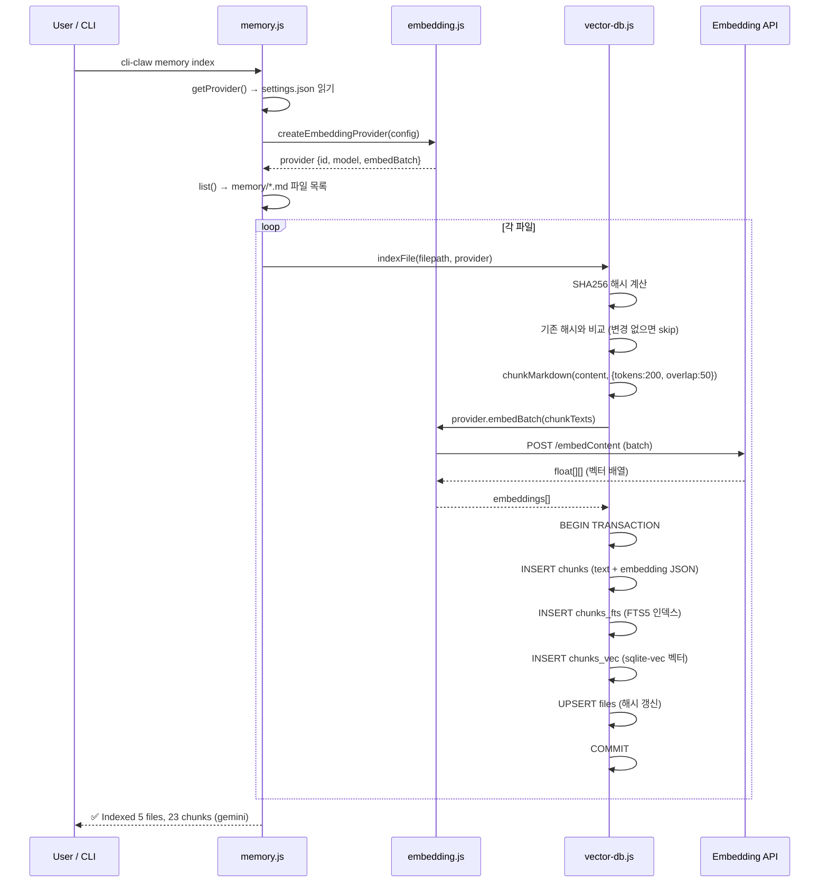
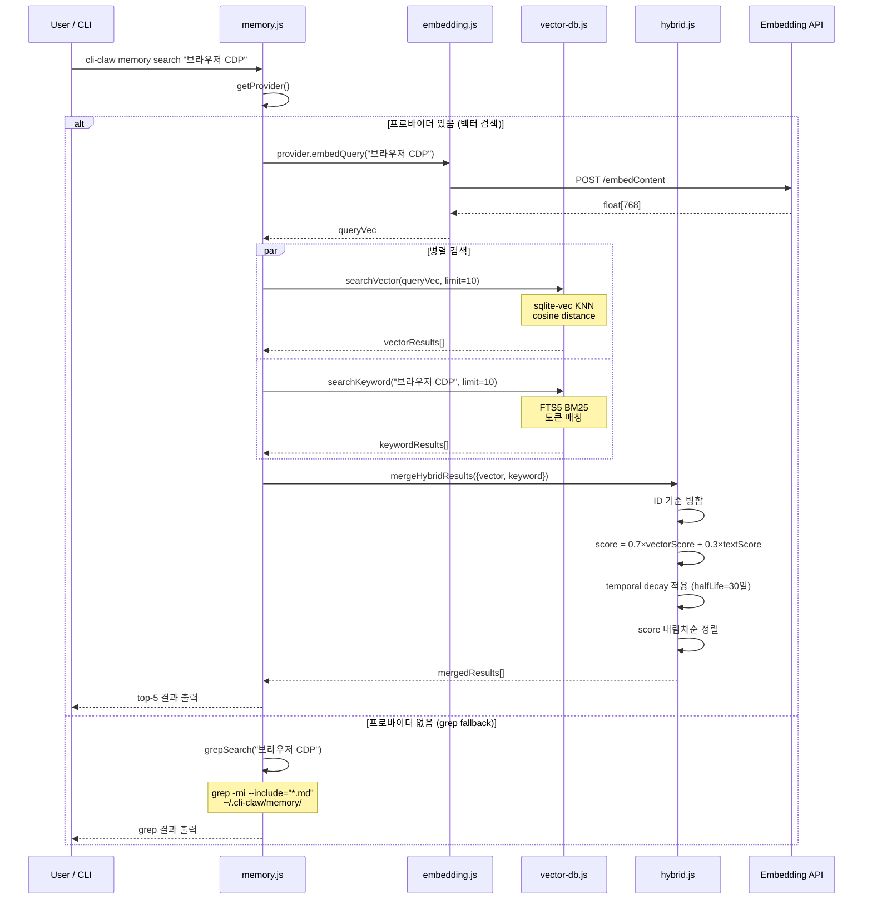
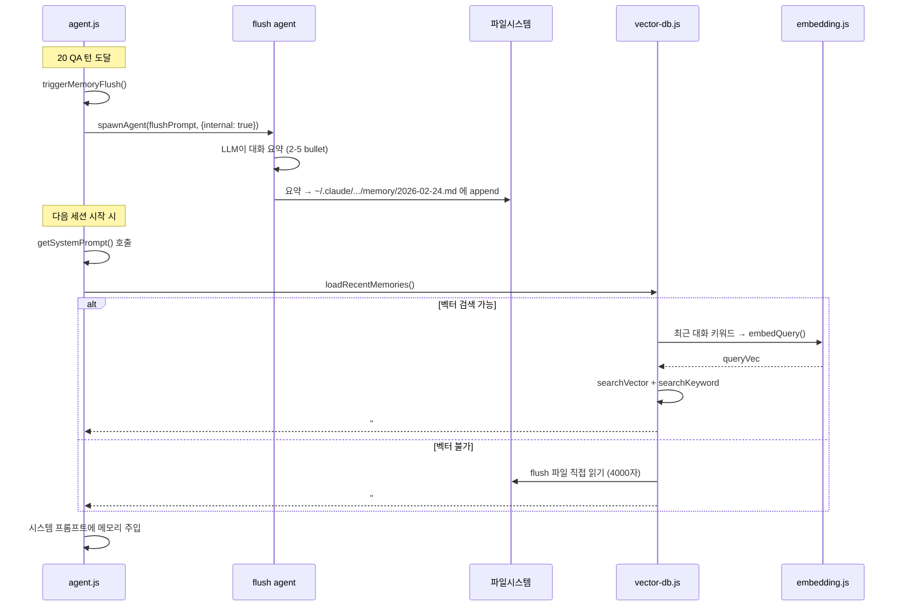
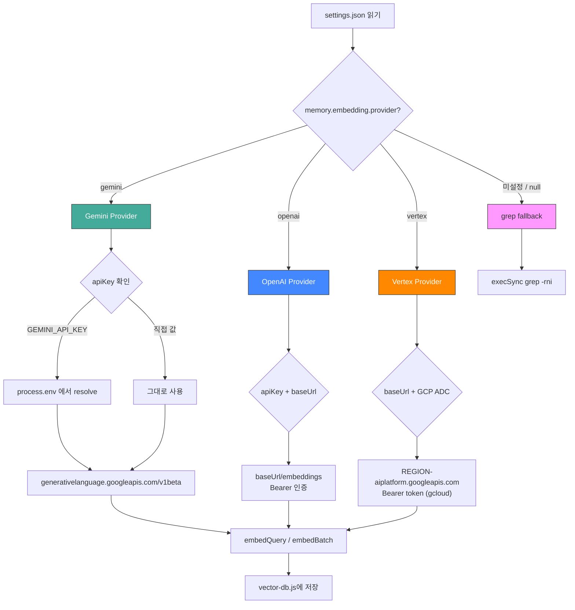
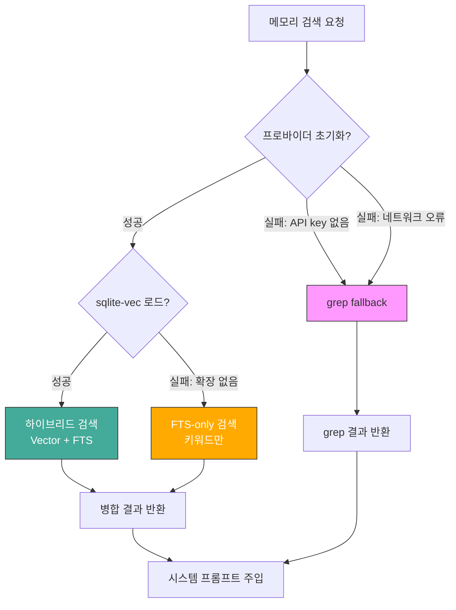

# Phase 3 — Vector Embedding Memory System

> 상태: 📋 계획
> 의존: Phase A 완료 (grep 기반 메모리)

## 목표

cli-claw의 grep 기반 메모리를 **sqlite-vec + 멀티 프로바이더 임베딩**으로 업그레이드.
설정 기반으로 임베딩 프로바이더를 선택할 수 있게 하고, 미설정 시 기존 grep으로 graceful fallback.

---

## 임베딩 프로바이더 옵션

| 프로바이더 | 모델 기본값              | 차원 | 필요 설정                  | 비용       | 비고                             |
| ---------- | ------------------------ | ---- | -------------------------- | ---------- | -------------------------------- |
| `gemini`   | `gemini-embedding-001`   | 768  | `GEMINI_API_KEY`           | 무료~저렴  | **권장**                         |
| `openai`   | `text-embedding-3-small` | 1536 | `OPENAI_API_KEY` + baseUrl | 저렴       | OpenAI-compatible 서버 지원      |
| `vertex`   | `text-embedding-005`     | 768  | GCP 프로젝트 + ADC         | 저렴, 빠름 | Gemini API 변형 (baseUrl만 다름) |
| `local`    | TBD                      | TBD  | node-llama-cpp 설치        | 무료       | **Phase 4** (리소스 큼)          |
| (미설정)   | —                        | —    | 없음                       | —          | grep fallback                    |

### 설정 (`~/.cli-claw/settings.json`)

```json
{
  "memory": {
    "enabled": true,
    "flushEvery": 20,
    "embedding": {
      "provider": "gemini",
      "model": "gemini-embedding-001",
      "apiKey": "GEMINI_API_KEY",
      "baseUrl": ""
    }
  }
}
```

- `apiKey`: 직접 값 또는 환경변수 이름 (예: `"GEMINI_API_KEY"` → `process.env.GEMINI_API_KEY` 자동 resolve)
- `baseUrl`: OpenAI-compatible 서버용 (예: `http://localhost:11434/v1`)
- Vertex: `baseUrl`을 Vertex endpoint로 설정 + GCP ADC auth

---

## 아키텍처

```mermaid
graph LR
    subgraph Input["입력"]
        FLUSH["메모리 flush<br/>(20 QA마다)"]
        SAVE["cli-claw memory save"]
        FILE["memory/*.md 파일 변경"]
    end

    subgraph Embed["임베딩 (src/embedding.js)"]
        GEM["Gemini API"]
        OAI["OpenAI API"]
        VTX["Vertex API"]
    end

    subgraph Store["저장 (src/vector-db.js)"]
        DB["better-sqlite3<br/>+ sqlite-vec"]
        CHUNKS["chunks 테이블"]
        VEC["chunks_vec 가상 테이블"]
        FTS["chunks_fts FTS5 테이블"]
    end

    subgraph Search["검색 (src/hybrid.js)"]
        VS["벡터 검색<br/>cosine similarity"]
        KS["키워드 검색<br/>FTS5 BM25"]
        MG["병합 + 스코어링"]
        TD["temporal decay"]
    end

    Input --> Embed
    Embed --> Store
    Store --> Search
    Search --> |top-K| SYS["시스템 프롬프트<br/>주입"]
```



### 워크플로우 1: 인덱싱 (`cli-claw memory index`)



### 워크플로우 2: 하이브리드 검색 (`cli-claw memory search`)



### 워크플로우 3: 메모리 flush → 벡터 인덱싱



### 워크플로우 4: 프로바이더 선택 흐름



### 워크플로우 5: Graceful Degradation (장애 대응)



---

## 파일별 구현 계획

### 1. `src/embedding.js` (신규, ~130줄)

임베딩 프로바이더 팩토리. openclaw-ref의 `embeddings.ts`, `embeddings-gemini.ts`, `embeddings-openai.ts`, `embeddings-remote-fetch.ts` 참조.

```js
/**
 * @typedef {Object} EmbeddingProvider
 * @property {string} id - 'gemini' | 'openai' | 'vertex'
 * @property {string} model
 * @property {(text: string) => Promise<number[]>} embedQuery
 * @property {(texts: string[]) => Promise<number[][]>} embedBatch
 */

export function createEmbeddingProvider(config) {
  if (!config?.provider) return null;
  switch (config.provider) {
    case 'gemini':  return createGeminiProvider(config);
    case 'openai':  return createOpenAIProvider(config);
    case 'vertex':  return createVertexProvider(config);
    default: return null;
  }
}
```

#### Gemini Provider (ref: `embeddings-gemini.ts` L62-137)

```js
function createGeminiProvider(config) {
  const apiKey = resolveApiKey(config.apiKey);  // 환경변수 resolve
  const model = config.model || 'gemini-embedding-001';
  const baseUrl = (config.baseUrl || 'https://generativelanguage.googleapis.com/v1beta').replace(/\/+$/, '');
  const modelPath = `models/${model}`;

  return {
    id: 'gemini',
    model,
    async embedQuery(text) {
      if (!text.trim()) return [];
      const res = await fetch(`${baseUrl}/${modelPath}:embedContent?key=${apiKey}`, {
        method: 'POST',
        headers: { 'Content-Type': 'application/json' },
        body: JSON.stringify({
          content: { parts: [{ text }] },
          taskType: 'RETRIEVAL_QUERY',
        }),
      });
      if (!res.ok) throw new Error(`gemini embed failed: ${res.status} ${await res.text()}`);
      const data = await res.json();
      return data.embedding?.values ?? [];
    },
    async embedBatch(texts) {
      if (!texts.length) return [];
      const requests = texts.map(text => ({
        model: modelPath,
        content: { parts: [{ text }] },
        taskType: 'RETRIEVAL_DOCUMENT',
      }));
      const res = await fetch(`${baseUrl}/${modelPath}:batchEmbedContents?key=${apiKey}`, {
        method: 'POST',
        headers: { 'Content-Type': 'application/json' },
        body: JSON.stringify({ requests }),
      });
      if (!res.ok) throw new Error(`gemini batch embed failed: ${res.status}`);
      const data = await res.json();
      return texts.map((_, i) => data.embeddings?.[i]?.values ?? []);
    },
  };
}
```

#### OpenAI-compatible Provider (ref: `embeddings-openai.ts` L30-61)

```js
function createOpenAIProvider(config) {
  const apiKey = resolveApiKey(config.apiKey);
  const model = config.model || 'text-embedding-3-small';
  const baseUrl = (config.baseUrl || 'https://api.openai.com/v1').replace(/\/+$/, '');

  const embed = async (input) => {
    const res = await fetch(`${baseUrl}/embeddings`, {
      method: 'POST',
      headers: {
        'Content-Type': 'application/json',
        'Authorization': `Bearer ${apiKey}`,
      },
      body: JSON.stringify({ model, input }),
    });
    if (!res.ok) throw new Error(`openai embed failed: ${res.status}`);
    const data = await res.json();
    return (data.data ?? []).map(entry => entry.embedding ?? []);
  };

  return {
    id: 'openai', model,
    embedQuery: async (text) => (await embed([text]))[0] ?? [],
    embedBatch: embed,
  };
}
```

#### Vertex Provider (ref: `embeddings-gemini.ts` + Vertex baseUrl)

```js
function createVertexProvider(config) {
  // Vertex는 Gemini API와 동일 포맷, baseUrl만 다름
  // https://{REGION}-aiplatform.googleapis.com/v1/projects/{PROJECT}/locations/{REGION}/publishers/google
  // auth: GCP Application Default Credentials (gcloud auth print-access-token)
  const provider = createGeminiProvider({
    ...config,
    baseUrl: config.baseUrl || config.vertexEndpoint,
    // apiKey 대신 Bearer token 사용
  });
  provider.id = 'vertex';
  return provider;
}
```

> Vertex auth는 `gcloud auth print-access-token`으로 Bearer 토큰 획득.
> 복잡도 때문에 V1에서는 baseUrl + Bearer 토큰 직접 설정 방식으로 구현.

#### 유틸리티

```js
function resolveApiKey(raw) {
  if (!raw) return process.env.GEMINI_API_KEY || process.env.OPENAI_API_KEY || '';
  // 환경변수 이름이면 resolve
  if (/^[A-Z_]+$/.test(raw) && process.env[raw]) return process.env[raw];
  return raw;
}
```

---

### 2. `src/vector-db.js` (신규, ~220줄)

better-sqlite3 + sqlite-vec 기반. openclaw-ref의 `memory-schema.ts`, `sqlite-vec.ts`, `manager-sync-ops.ts`, `internal.ts` 참조.

#### DB 초기화

```js
import Database from 'better-sqlite3';
import { join } from 'path';
import { CLAW_HOME } from './config.js';
import crypto from 'crypto';

const DB_PATH = join(CLAW_HOME, 'memory', 'vector.db');
let db = null;
let vecLoaded = false;
let vecDims = null;

export function getVectorDB() {
  if (db) return db;
  db = new Database(DB_PATH);

  // sqlite-vec 확장 로드
  try {
    const sqliteVec = await import('sqlite-vec');
    sqliteVec.load(db);
    vecLoaded = true;
  } catch (e) {
    console.log('[vector-db] sqlite-vec unavailable, FTS-only mode:', e.message);
  }

  // 스키마 생성 (ref: memory-schema.ts)
  db.exec(`
    CREATE TABLE IF NOT EXISTS files (
      path TEXT PRIMARY KEY,
      hash TEXT NOT NULL,
      mtime INTEGER NOT NULL,
      size INTEGER NOT NULL
    );
    CREATE TABLE IF NOT EXISTS chunks (
      id TEXT PRIMARY KEY,
      path TEXT NOT NULL,
      start_line INTEGER NOT NULL,
      end_line INTEGER NOT NULL,
      hash TEXT NOT NULL,
      model TEXT NOT NULL,
      text TEXT NOT NULL,
      embedding TEXT NOT NULL,
      updated_at INTEGER NOT NULL
    );
    CREATE INDEX IF NOT EXISTS idx_chunks_path ON chunks(path);
  `);

  // FTS5
  try {
    db.exec(`
      CREATE VIRTUAL TABLE IF NOT EXISTS chunks_fts USING fts5(
        text, id UNINDEXED, path UNINDEXED
      );
    `);
  } catch (e) {
    console.log('[vector-db] FTS5 unavailable:', e.message);
  }

  return db;
}
```

#### 벡터 테이블 (동적 차원)

```js
// ref: manager-sync-ops.ts L209-222
export function ensureVectorTable(dimensions) {
  if (!vecLoaded || vecDims === dimensions) return;
  if (vecDims && vecDims !== dimensions) {
    db.exec('DROP TABLE IF EXISTS chunks_vec');
  }
  db.exec(`
    CREATE VIRTUAL TABLE IF NOT EXISTS chunks_vec USING vec0(
      id TEXT PRIMARY KEY,
      embedding FLOAT[${dimensions}]
    );
  `);
  vecDims = dimensions;
}
```

#### 청킹 (ref: `internal.ts` L184-265)

```js
export function chunkMarkdown(content, { tokens = 200, overlap = 50 } = {}) {
  const lines = content.split('\n');
  const maxChars = Math.max(32, tokens * 4);
  const overlapChars = Math.max(0, overlap * 4);
  const chunks = [];
  let current = [], currentChars = 0;

  const flush = () => {
    if (!current.length) return;
    const text = current.map(e => e.line).join('\n');
    chunks.push({
      startLine: current[0].lineNo,
      endLine: current[current.length - 1].lineNo,
      text,
      hash: crypto.createHash('sha256').update(text).digest('hex'),
    });
  };

  const carryOverlap = () => {
    if (overlapChars <= 0) { current = []; currentChars = 0; return; }
    let acc = 0;
    const kept = [];
    for (let i = current.length - 1; i >= 0; i--) {
      acc += current[i].line.length + 1;
      kept.unshift(current[i]);
      if (acc >= overlapChars) break;
    }
    current = kept;
    currentChars = kept.reduce((s, e) => s + e.line.length + 1, 0);
  };

  for (let i = 0; i < lines.length; i++) {
    const line = lines[i] ?? '';
    const lineSize = line.length + 1;
    if (currentChars + lineSize > maxChars && current.length > 0) {
      flush();
      carryOverlap();
    }
    current.push({ line, lineNo: i + 1 });
    currentChars += lineSize;
  }
  flush();
  return chunks;
}
```

#### 파일 인덱싱

```js
export async function indexFile(filepath, provider) {
  const content = fs.readFileSync(filepath, 'utf8');
  const relPath = path.relative(join(CLAW_HOME, 'memory'), filepath);
  const hash = crypto.createHash('sha256').update(content).digest('hex');

  // 변경 없으면 스킵
  const existing = db.prepare('SELECT hash FROM files WHERE path = ?').get(relPath);
  if (existing?.hash === hash) return { skipped: true };

  const chunks = chunkMarkdown(content);
  const texts = chunks.map(c => c.text);
  const embeddings = await provider.embedBatch(texts);

  // 트랜잭션으로 일괄 저장
  const tx = db.transaction(() => {
    // 기존 청크 삭제
    db.prepare('DELETE FROM chunks WHERE path = ?').run(relPath);
    try { db.prepare('DELETE FROM chunks_fts WHERE path = ?').run(relPath); } catch {}
    try { db.prepare('DELETE FROM chunks_vec WHERE id IN (SELECT id FROM chunks WHERE path = ?)').run(relPath); } catch {}

    // 파일 레코드 갱신
    db.prepare('INSERT OR REPLACE INTO files (path, hash, mtime, size) VALUES (?, ?, ?, ?)')
      .run(relPath, hash, Date.now(), content.length);

    // 청크 + 임베딩 저장
    const insertChunk = db.prepare(
      'INSERT INTO chunks (id, path, start_line, end_line, hash, model, text, embedding, updated_at) VALUES (?, ?, ?, ?, ?, ?, ?, ?, ?)'
    );
    const insertFts = db.prepare('INSERT INTO chunks_fts (text, id, path) VALUES (?, ?, ?)');

    for (let i = 0; i < chunks.length; i++) {
      const c = chunks[i];
      const vec = embeddings[i];
      const id = `${relPath}:${c.startLine}-${c.endLine}`;
      insertChunk.run(id, relPath, c.startLine, c.endLine, c.hash, provider.model, c.text, JSON.stringify(vec), Date.now());
      try { insertFts.run(c.text, id, relPath); } catch {}

      // sqlite-vec 저장
      if (vecLoaded && vec.length > 0) {
        ensureVectorTable(vec.length);
        try {
          db.prepare('INSERT OR REPLACE INTO chunks_vec (id, embedding) VALUES (?, ?)').run(id, JSON.stringify(vec));
        } catch {}
      }
    }
  });
  tx();
  return { chunks: chunks.length, path: relPath };
}
```

#### 검색 — 벡터

```js
// ref: internal.ts L297-316 (cosine similarity)
export function cosineSimilarity(a, b) {
  if (!a.length || !b.length) return 0;
  const len = Math.min(a.length, b.length);
  let dot = 0, normA = 0, normB = 0;
  for (let i = 0; i < len; i++) {
    dot += a[i] * b[i];
    normA += a[i] * a[i];
    normB += b[i] * b[i];
  }
  return normA && normB ? dot / (Math.sqrt(normA) * Math.sqrt(normB)) : 0;
}

export function searchVector(queryVec, limit = 10) {
  if (!vecLoaded) return [];
  // sqlite-vec KNN 검색
  const rows = db.prepare(`
    SELECT v.id, v.distance, c.path, c.start_line, c.end_line, c.text
    FROM chunks_vec v
    JOIN chunks c ON c.id = v.id
    WHERE v.embedding MATCH ?
    ORDER BY v.distance
    LIMIT ?
  `).all(JSON.stringify(queryVec), limit);

  return rows.map(r => ({
    id: r.id, path: r.path,
    startLine: r.start_line, endLine: r.end_line,
    snippet: r.text.slice(0, 500),
    vectorScore: 1 / (1 + r.distance),  // distance → similarity
  }));
}
```

#### 검색 — FTS5 키워드

```js
// ref: hybrid.ts L33-49
export function searchKeyword(query, limit = 10) {
  const tokens = query.match(/[\p{L}\p{N}_]+/gu)?.map(t => t.trim()).filter(Boolean) ?? [];
  if (!tokens.length) return [];
  const ftsQuery = tokens.map(t => `"${t.replace(/"/g, '')}"`).join(' AND ');

  try {
    const rows = db.prepare(`
      SELECT id, path, rank, text
      FROM chunks_fts
      WHERE chunks_fts MATCH ?
      ORDER BY rank
      LIMIT ?
    `).all(ftsQuery, limit);

    return rows.map(r => ({
      id: r.id, path: r.path,
      snippet: r.text.slice(0, 500),
      textScore: 1 / (1 + Math.max(0, r.rank)),  // BM25 rank → score
    }));
  } catch { return []; }
}
```

---

### 3. `src/hybrid.js` (신규, ~80줄)

FTS + Vector 결과 병합. openclaw-ref의 `hybrid.ts`와 `temporal-decay.ts` 간소화.

```js
// ref: hybrid.ts L51-149

const DAY_MS = 86400000;

/**
 * 하이브리드 검색 결과 병합
 * @param {Object} params
 * @param {Array} params.vector - [{id, path, snippet, vectorScore, startLine, endLine}]
 * @param {Array} params.keyword - [{id, path, snippet, textScore}]
 * @param {number} params.vectorWeight - 기본 0.7
 * @param {number} params.textWeight - 기본 0.3
 * @param {number} params.halfLifeDays - temporal decay 반감기 (0이면 비활성)
 */
export function mergeHybridResults({
  vector = [], keyword = [],
  vectorWeight = 0.7, textWeight = 0.3,
  halfLifeDays = 30,
}) {
  const byId = new Map();

  for (const r of vector) {
    byId.set(r.id, { ...r, vectorScore: r.vectorScore, textScore: 0 });
  }
  for (const r of keyword) {
    const existing = byId.get(r.id);
    if (existing) {
      existing.textScore = r.textScore;
      if (r.snippet?.length > 0) existing.snippet = r.snippet;
    } else {
      byId.set(r.id, { ...r, vectorScore: 0, textScore: r.textScore });
    }
  }

  let results = Array.from(byId.values()).map(entry => ({
    ...entry,
    score: vectorWeight * entry.vectorScore + textWeight * entry.textScore,
  }));

  // Temporal decay (ref: temporal-decay.ts L24-34)
  if (halfLifeDays > 0) {
    const lambda = Math.LN2 / halfLifeDays;
    const now = Date.now();
    results = results.map(r => {
      const dateMatch = r.path?.match(/(\d{4}-\d{2}-\d{2})/);
      if (!dateMatch) return r;  // 날짜 없는 파일은 evergreen
      const fileDate = new Date(dateMatch[1]).getTime();
      const ageDays = Math.max(0, (now - fileDate) / DAY_MS);
      return { ...r, score: r.score * Math.exp(-lambda * ageDays) };
    });
  }

  return results.sort((a, b) => b.score - a.score);
}
```

> MMR은 제외 — 메모리 규모가 작아서 다양성 문제 없음 (필요시 추후 추가)

---

### 4. `src/memory.js` 수정 (+50줄)

```diff
+ import { createEmbeddingProvider } from './embedding.js';
+ import * as vectorDB from './vector-db.js';
+ import { mergeHybridResults } from './hybrid.js';

+ let _provider = null;
+ let _providerInitialized = false;

+ function getProvider() {
+   if (_providerInitialized) return _provider;
+   _providerInitialized = true;
+   const embConfig = settings.memory?.embedding;
+   _provider = createEmbeddingProvider(embConfig);
+   if (_provider) console.log(`[memory] embedding: ${_provider.id}/${_provider.model}`);
+   else console.log('[memory] embedding: disabled (grep fallback)');
+   return _provider;
+ }

  export function search(query) {
+   const provider = getProvider();
+   if (provider) return hybridSearch(query, provider);
    // 기존 grep (fallback)
    return grepSearch(query);
  }

+ export async function hybridSearch(query, provider, opts = {}) {
+   const db = vectorDB.getVectorDB();
+   const queryVec = await provider.embedQuery(query);
+   const vecResults = vectorDB.searchVector(queryVec, opts.limit || 10);
+   const kwResults = vectorDB.searchKeyword(query, opts.limit || 10);
+   const merged = mergeHybridResults({
+     vector: vecResults, keyword: kwResults,
+     vectorWeight: 0.7, textWeight: 0.3, halfLifeDays: 30,
+   });
+   return merged.slice(0, opts.limit || 5);
+ }

+ export async function indexAllMemoryFiles() {
+   const provider = getProvider();
+   if (!provider) throw new Error('Embedding provider not configured');
+   vectorDB.getVectorDB();  // DB 초기화
+   const files = list();
+   let total = 0;
+   for (const f of files) {
+     const result = await vectorDB.indexFile(
+       join(MEMORY_DIR, f.path), provider
+     );
+     if (!result.skipped) total += result.chunks;
+   }
+   return { files: files.length, chunks: total, provider: provider.id };
+ }
```

---

### 5. `bin/commands/memory.js` 수정 (+30줄)

```diff
+ case 'index':
+   const { indexAllMemoryFiles } = await import('../../src/memory.js');
+   const result = await indexAllMemoryFiles();
+   console.log(`✅ Indexed ${result.files} files, ${result.chunks} chunks (${result.provider})`);
+   break;

+ case 'status':
+   const { settings } = await import('../../src/config.js');
+   const emb = settings.memory?.embedding;
+   if (!emb?.provider) {
+     console.log('Embedding: disabled (grep fallback)');
+   } else {
+     console.log(`Provider: ${emb.provider}`);
+     console.log(`Model: ${emb.model || '(default)'}`);
+     console.log(`API Key: ${emb.apiKey ? '***configured***' : 'missing'}`);
+   }
+   break;
```

---

### 6. `src/prompt.js` 수정 (+20줄)

`loadRecentMemories()` 개선 — 임베딩이 가능하면 벡터 검색으로 관련 메모리 주입:

```diff
  export function loadRecentMemories() {
+   // 벡터 검색이 가능하면 최근 대화 키워드로 관련 메모리 검색
+   try {
+     const { getProvider, hybridSearch } = require('./memory.js');
+     if (getProvider()) {
+       // 최근 대화에서 키워드 추출 → 벡터 검색
+       const recent = getRecentMessages?.all?.(3)?.reverse() ?? [];
+       const keywords = recent.map(m => m.content).join(' ').slice(0, 500);
+       if (keywords.trim()) {
+         const results = await hybridSearch(keywords, getProvider(), { limit: 5 });
+         if (results.length) {
+           const entries = results.map(r => `- [${r.path}] ${r.snippet.split('\n')[0]}`);
+           return '\n\n---\n## Relevant Memories (vector search)\n' + entries.join('\n');
+         }
+       }
+     }
+   } catch {}
    // fallback: 기존 파일 기반
    try { ... }
  }
```

---

### 7. `package.json` 수정

```diff
  "dependencies": {
+   "sqlite-vec": "^0.1.6"
  }
```

> `better-sqlite3`는 이미 있음. `sqlite-vec`만 추가 (~2MB prebuilt 바이너리).
> `node:sqlite`는 사용하지 않음 — 배포용으로 Node.js 버전 제약을 피하기 위해 `better-sqlite3` 유지.

---

## 파일 요약

| 파일                     | 액션   | 줄 수 | 참조 (openclaw-ref)                                                       |
| ------------------------ | ------ | ----- | ------------------------------------------------------------------------- |
| `src/embedding.js`       | NEW    | ~130  | `embeddings.ts`, `embeddings-gemini.ts`, `embeddings-openai.ts`           |
| `src/vector-db.js`       | NEW    | ~220  | `memory-schema.ts`, `sqlite-vec.ts`, `internal.ts`, `manager-sync-ops.ts` |
| `src/hybrid.js`          | NEW    | ~80   | `hybrid.ts`, `temporal-decay.ts`                                          |
| `src/memory.js`          | MODIFY | +50   | `manager.ts` search integration                                           |
| `bin/commands/memory.js` | MODIFY | +30   | CLI commands                                                              |
| `src/prompt.js`          | MODIFY | +20   | prompt injection                                                          |
| `package.json`           | MODIFY | +1    | `sqlite-vec` dependency                                                   |

**총 ~530줄 신규 코드, 3개 신규 파일, 1개 npm 의존성 추가**

---

## 구현 순서

```
1. package.json에 sqlite-vec 추가 + npm install
2. src/embedding.js — 프로바이더 팩토리 (gemini 먼저)
3. src/vector-db.js — DB 초기화 + 청킹 + 인덱싱
4. src/hybrid.js — 하이브리드 검색 병합
5. src/memory.js — 기존 search()에 벡터 검색 통합
6. bin/commands/memory.js — index/status 커맨드
7. src/prompt.js — 벡터 기반 메모리 프롬프트 주입
```

---

## 테스트 계획

### 수동 테스트

```bash
# 1. 임베딩 상태 확인
cli-claw memory status
# → Provider: gemini, Model: gemini-embedding-001

# 2. 전체 인덱싱
cli-claw memory index
# → ✅ Indexed 5 files, 23 chunks (gemini)

# 3. 하이브리드 검색
cli-claw memory search "브라우저 설정"
# → 벡터 + FTS 결과, 스코어 포함

# 4. grep fallback (임베딩 미설정)
# settings.json에서 embedding 제거 후
cli-claw memory search "브라우저"
# → 기존 grep 결과 동일
```

---

## 향후 고도화 (Phase 4+)

- [ ] `local` 프로바이더 (node-llama-cpp + embeddinggemma)
- [ ] MMR re-ranking (검색 다양성)
- [ ] 파일 감시 (chokidar) — 메모리 파일 변경 시 자동 재인덱싱
- [ ] 임베딩 캐시 (`embedding_cache` 테이블) — 동일 텍스트 재임베딩 방지
- [ ] 세션 대화 인덱싱 — SQLite messages 테이블에서 직접 임베딩
