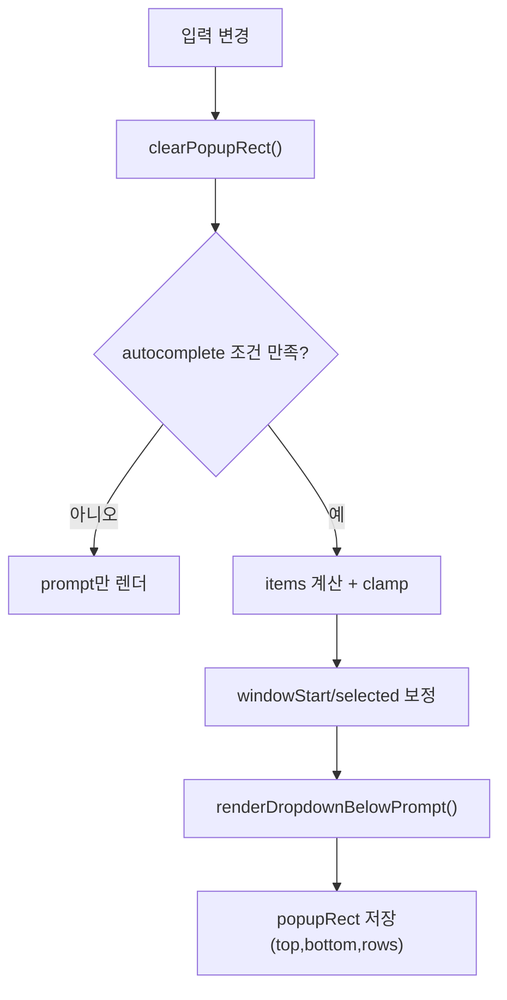

# Phase 1.2b: 아래 방향 드롭다운 + 후보 컷오프(windowing) 계획

이번 1.2b의 비가역 요구사항은 한 줄이다. 드롭다운은 반드시 입력창 **아래**에 떠야 한다. 위로 뜨는 방식은 폐기한다. 동시에 후보가 너무 많이 쌓여 화면을 더럽히는 문제를 해결해야 한다. 따라서 1.2b는 “아래 렌더 고정 + 표시 개수 제한 + 방향키 스크롤”의 조합으로 간다.

현재 증상은 두 가지다. 첫째, 후보가 반복 출력되어 화면에 잔상이 남는다. 둘째, 목록이 길어질수록 사용자가 원하는 항목으로 이동하기 어렵다. 이 문제는 렌더 영역 경계를 정확히 추적하지 않아서 생긴다. 해결은 간단하다. popup의 렌더 사각형(rect)을 상태로 저장하고, 다음 렌더 전에 그 rect만 정확히 지운다.

UI 목표는 Codex 스타일과 동일하다. 입력 아래에 고정된 후보 목록이 뜬다. 선택 항목은 강조된다. 위아래 키로 움직이며, 목록이 길면 내부 window가 따라 움직인다. `/`를 지우는 순간 dropdown은 즉시 사라지고 원래 입력 레이아웃으로 복귀한다.



---

## 기술 참조

| 항목 | 1.2 현재 | 1.2b 목표 |
| --- | --- | --- |
| 드롭다운 방향 | 위쪽 렌더(임시 회피) | 아래쪽 렌더 고정 |
| 표시 개수 | `maxRows` 고정, 화면 상태 고려 약함 | `visibleRows = min(hardCap, items, availableBelow)` |
| 긴 목록 이동 | 선택 인덱스만 이동 | windowing(`windowStart`) 동반 이동 |
| 잔상 정리 | 상대 이동 clear | popup rect 기반 정밀 clear |
| UX 밀도 | 후보 과다 노출 | 컷오프 + 잔여 개수 힌트 |

## 핵심 정책 (확정)

1. 드롭다운은 입력 아래에만 렌더한다.
2. 기본 표시 개수 hard cap은 `6`으로 둔다.
3. 화면 여유가 부족하면 `availableBelow`만큼만 그린다.
4. 후보가 더 많으면 마지막 줄에 `… +N more` 힌트를 표시한다.
5. `↑/↓` 이동 시 선택이 window 밖으로 나가면 `windowStart`를 조정한다.
6. `/` 삭제 또는 공백 입력으로 autocomplete 조건이 깨지면 popup rect를 즉시 clear한다.

## 상태 모델 변경

| 필드 | 설명 |
| --- | --- |
| `ac.items` | 전체 후보 |
| `ac.selected` | 전체 후보 기준 선택 인덱스 |
| `ac.windowStart` | 현재 윈도우 시작 인덱스 |
| `ac.visibleRows` | 현재 화면에 그릴 후보 행 수 |
| `ac.popupRect` | 마지막 렌더 영역 `{ topRow, bottomRow, rows }` |

## 렌더 알고리즘 (아래 고정)

1. prompt 렌더 후 커서 행(`promptRow`)을 기준점으로 잡는다.
2. `availableBelow = (scrollBottomRow - promptRow)`를 계산한다.
3. `visibleRows = min(6, items.length, availableBelow)`를 계산한다.
4. window 범위는 `[windowStart, windowStart + visibleRows)`로 자른다.
5. `promptRow + 1`부터 순서대로 후보를 렌더한다.
6. 렌더한 영역을 `popupRect`에 저장한다.

## 키 처리 정책

| 키 | 처리 |
| --- | --- |
| `↑` (`\x1b[A`, `\x1bOA`) | `selected--`, 필요 시 `windowStart--` |
| `↓` (`\x1b[B`, `\x1bOB`) | `selected++`, 필요 시 `windowStart++` |
| `Tab` | 선택 후보로 입력 치환 |
| `Enter` | 선택 적용(인자 필요 시 공백 포함) |
| `ESC` | popup close |
| `Backspace` | 입력 갱신, `/` 제거 시 popup clear + 원복 |

## 구현 단계

1. `ac` 상태에 `windowStart`, `visibleRows`, `popupRect` 추가
2. `clearAutocomplete()`를 rect 기반 clear로 교체
3. `renderAutocomplete()`를 below-anchor + windowing 방식으로 교체
4. `up/down` 처리에 window 이동 로직 추가
5. `… +N more` 힌트 줄 추가
6. `resize` 시 `availableBelow` 재계산 + 재렌더

## 완료 기준 (DoD)

- [ ] 드롭다운이 항상 입력 아래에 표시된다
- [ ] 기본 최대 6줄만 보이고, 나머지는 스크롤 이동으로 접근된다
- [ ] 화면에 후보 잔상(중복 라인)이 남지 않는다
- [ ] `/` -> `Backspace` 20회 반복 시 원복이 안정적이다
- [ ] `↑/↓/Tab/Enter/ESC` 동작이 끊기지 않는다

## 수동 테스트

```bash
cd /Users/jun/Developer/new/700_projects/cli-claw
node bin/cli-claw.js chat
```

1. `/` 입력: 입력 아래에 6줄 이내로 표시되는지 확인
2. `↓` 연타: 선택 이동과 window 스크롤이 같이 되는지 확인
3. `/` 삭제: 드롭다운 즉시 제거 + 빈 영역 미발생 확인
4. 터미널 높이 축소 후 `/` 입력: `availableBelow` 만큼만 그려지는지 확인

## 예상 공수

| 작업 | 시간 |
| --- | --- |
| 상태/rect 모델 변경 | 25m |
| below-anchor 렌더 전환 | 40m |
| windowing + 키 이동 | 35m |
| 잔여 힌트/리사이즈 보정 | 20m |
| 수동 검증 | 20m |
| 합계 | 약 2.3h |

## 변경 기록

- 2026-02-24: 1.2b 신규 계획 작성. 요구사항을 “아래 드롭다운 강제 + 후보 컷오프 + windowing”으로 확정.
