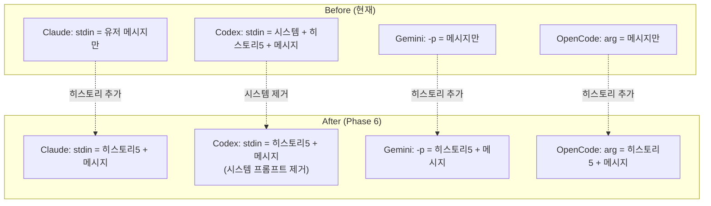

# Phase 6: Prompt Injection Normalization + Log Cleanup

> 상태: 📋 계획 | 날짜: 2026-02-24
> 범위: CLI별 프롬프트 삽입 정규화 — 히스토리 통합 + 시스템 프롬프트 중복 제거 + NDJSON 로그 정리
> 선행조건: Phase 5 (Stabilization)
> 참고: `str_func/prompt_flow.md` — 현재 프롬프트 흐름 전체 문서

---

## 문제 진단

### 현재 상태 (agent.js:206-227)

```js
const skipStdin = cli === 'gemini' || cli === 'opencode' || (cli === 'codex' && isResume);

if (!skipStdin) {
    if (cli === 'claude') {
        stdinContent = prompt;  // ← 유저 메시지만
    } else {
        // Codex 신규 세션
        stdinContent = `[Claw Platform Context]\n${sp}`;        // ← 시스템 프롬프트 (중복!)
        if (!isResume && !forceNew) {
            const recent = getRecentMessages.all(5).reverse();  // ← 히스토리 5개
            stdinContent += `\n\n[Recent History]\n${history}`;
        }
        stdinContent += `\n\n[User Message]\n${prompt}`;
    }
}
```

### 문제점 3가지

| #   | 문제                                           | 영향                                                                            |
| --- | ---------------------------------------------- | ------------------------------------------------------------------------------- |
| P1  | **히스토리 주입이 Codex 신규 세션에만 적용**   | Claude/Gemini/OpenCode 신규 세션은 히스토리 없이 시작 → 첫 메시지에서 맥락 단절 |
| P2  | **Codex 시스템 프롬프트 이중 전달**            | `.codex/AGENTS.md` (regenerateB) + stdin 전문 → 토큰 낭비 + 잠재적 충돌         |
| P3  | **CLI별 삽입 로직이 하나의 if-else에 혼재**    | 새 CLI 추가 시 분기 복잡도 증가, 테스트 어려움                                  |
| P4  | **NDJSON console.log가 JSON 전문 그대로 출력** | `[claw:raw]` + `[claw:event]` 중복, 읽을 수 없는 로그, 디버깅 불가              |

---

## 목표

1. **모든 CLI 신규 세션에 히스토리 5개 주입** (resume에는 불필요)
2. **시스템 프롬프트는 각 CLI의 네이티브 채널에만 전달** (중복 제거)
3. **삽입 로직을 CLI별 전략 패턴으로 분리** (가독성 + 확장성)
4. **NDJSON 로그 정리** — JSON 껍데기를 벗기고 type별 한 줄 요약 로그로 변환

---

## 설계

### 개선 후 CLI별 삽입 매트릭스

| CLI          | 시스템 프롬프트           | 히스토리 (new only) | 유저 메시지 | resume                  |
| ------------ | ------------------------- | ------------------- | ----------- | ----------------------- |
| **Claude**   | `--append-system-prompt`  | ✅ stdin에 추가      | stdin       | `--resume` (히스토리 ❌) |
| **Codex**    | `.codex/AGENTS.md` (기존) | ✅ stdin에 추가      | stdin       | resume arg (히스토리 ❌) |
| **Gemini**   | `GEMINI_SYSTEM_MD` env    | ✅ `-p` 인자 앞에    | `-p` 인자   | `--resume` (히스토리 ❌) |
| **OpenCode** | ❌ 없음 (제약)             | ✅ 위치 인자 앞에    | 위치 인자   | `-s` (히스토리 ❌)       |

### 히스토리 포맷

```text
[Recent Context — 5 messages]
[user] 이전 질문 1
[assistant] 이전 응답 1
[user] 이전 질문 2
[assistant] 이전 응답 2 (truncated)
[user] 이전 질문 3
---
[Current Message]
{prompt}
```

> **주의**: 히스토리 각 메시지는 최대 500자로 truncate (토큰 절약)

---

## 파일별 상세 변경

### [MODIFY] `src/agent.js`

#### 변경 1: 히스토리 빌더 함수 추출

```js
// 새 함수 — CLI 무관하게 재사용
function buildHistoryBlock(maxMsgs = 5, maxCharsPerMsg = 500) {
    const recent = getRecentMessages.all(maxMsgs).reverse();
    if (recent.length === 0) return '';
    const lines = recent.map(m => {
        const content = m.content.length > maxCharsPerMsg
            ? m.content.slice(0, maxCharsPerMsg) + '…'
            : m.content;
        return `[${m.role}] ${content}`;
    });
    return `\n\n[Recent Context — ${recent.length} messages]\n${lines.join('\n\n')}`;
}
```

#### 변경 2: stdin 조립 정규화

```diff
- const skipStdin = cli === 'gemini' || cli === 'opencode' || (cli === 'codex' && isResume);
- if (!skipStdin) {
-     if (cli === 'claude') {
-         stdinContent = prompt;
-     } else {
-         const sp = customSysPrompt || getSystemPrompt();
-         stdinContent = `[Claw Platform Context]\n${sp}`;
-         if (!isResume && !forceNew) { ... }
-         stdinContent += `\n\n[User Message]\n${prompt}`;
-     }
- }

+ // 히스토리: 신규 세션 + 비internal 일 때만
+ const historyBlock = (!isResume && !forceNew) ? buildHistoryBlock() : '';
+
+ // CLI별 stdin/전달 분기
+ switch (cli) {
+     case 'claude':
+         // 시스템 → --append-system-prompt (이미 args에 포함)
+         // stdin → 히스토리 + 유저 메시지
+         child.stdin.write(historyBlock + '\n\n' + prompt);
+         break;
+
+     case 'codex':
+         if (!isResume) {
+             // 시스템 → .codex/AGENTS.md (regenerateB에서 저장)
+             // stdin → 히스토리 + 유저 메시지만 (시스템 프롬프트 제거!)
+             child.stdin.write(historyBlock + '\n\n[User Message]\n' + prompt);
+         }
+         // resume: skipStdin (codex resume는 args로 전달)
+         break;
+
+     case 'gemini':
+         // 시스템 → GEMINI_SYSTEM_MD env (이미 설정됨)
+         // -p 인자에 히스토리 + 메시지 결합
+         // (gemini는 stdin 사용 안함 — args에서 -p 수정 필요)
+         break;
+
+     case 'opencode':
+         // 시스템 → 없음 (제약)
+         // 위치 인자에 히스토리 + 메시지 결합
+         break;
+ }
+ child.stdin.end();
```

#### 변경 3: Gemini/OpenCode args에 히스토리 반영

```js
// buildArgs 수정 — Gemini
case 'gemini': {
    // 히스토리를 prompt 앞에 prepend
    const fullPrompt = historyBlock
        ? `${historyBlock}\n\n---\n${prompt}`
        : (prompt || '');
    return ['-p', fullPrompt,
        ...(model && model !== 'default' ? ['-m', model] : []),
        '-y', '-o', 'stream-json'];
}

// buildArgs 수정 — OpenCode
case 'opencode': {
    const fullPrompt = historyBlock
        ? `${historyBlock}\n\n---\n${prompt}`
        : (prompt || '');
    return ['run',
        ...(model && model !== 'default' ? ['-m', model] : []),
        ...(effort ? ['--variant', effort] : []),
        '--format', 'json',
        fullPrompt];
}
```

> ⚠️ **주의**: `buildArgs`에 `historyBlock`을 전달해야 하므로 함수 시그니처 변경 필요
> `buildArgs(cli, model, effort, prompt, sysPrompt)` → `buildArgs(cli, model, effort, prompt, sysPrompt, historyBlock)`

#### 변경 4: Codex 시스템 프롬프트 stdin 제거 확인

`.codex/AGENTS.md`에 이미 전체 시스템 프롬프트가 저장되어 있으므로 (`regenerateB()`),
stdin에서 `[Claw Platform Context]` 섹션을 **제거**한다.

```text
Before (Codex stdin):
  [Claw Platform Context]     ← 제거 (AGENTS.md와 중복)
  {getSystemPrompt() 전체}    ← 제거
  [Recent History]             ← 유지
  [User Message]               ← 유지

After (Codex stdin):
  [Recent Context — 5 messages]  ← 히스토리
  [User Message]                 ← 유저 메시지
```

---

## P4: NDJSON Console Log Cleanup

### 현재 문제

`agent.js`에서 NDJSON 이벤트를 두 줄로 중복 출력:

```js
// agent.js:243-244 — 제거 대상
console.log(`[claw:event:${agentLabel}] ${cli} type=${event.type}`);  // 요약만
console.log(`[claw:raw:${agentLabel}] ${line.slice(0, 300)}`);       // JSON 전문
```

결과: 로그가 JSON 떡칠, 의미 있는 정보 파악 불가.

### 해결: type별 한 줄 요약 로그

#### [MODIFY] `src/events.js` — `logEventSummary()` 추가

```js
export function logEventSummary(agentLabel, cli, event) {
    const item = event.item || {};

    // Codex 이벤트
    if (cli === 'codex') {
        if (event.type === 'item.started' && item.type === 'command_execution') {
            console.log(`[${agentLabel}] cmd: ${item.command || ''}`);
            return;
        }
        if (event.type === 'item.completed') {
            switch (item.type) {
                case 'reasoning':
                    console.log(`[${agentLabel}] reasoning: ${item.text || ''}`);
                    return;
                case 'agent_message':
                    console.log(`[${agentLabel}] agent: ${(item.text || '').slice(0, 200)}`);
                    return;
                case 'command_execution': {
                    const cmd = (item.command || '').slice(0, 100);
                    const out = (item.aggregated_output || '').trim();
                    const outPreview = out.length > 200
                        ? out.slice(0, 200) + '…'
                        : out;
                    console.log(`[${agentLabel}] cmd: ${cmd} → exit ${item.exit_code}`);
                    if (outPreview) console.log(`  ${outPreview.replace(/\n/g, '\n  ')}`);
                    return;
                }
                case 'web_search':
                    console.log(`[${agentLabel}] search: ${item.query || item.action?.query || ''}`);
                    return;
            }
        }
        if (event.type === 'turn.completed' && event.usage) {
            const u = event.usage;
            console.log(`[${agentLabel}] tokens: in=${u.input_tokens?.toLocaleString()} (cached=${u.cached_input_tokens?.toLocaleString()}) out=${u.output_tokens?.toLocaleString()}`);
            return;
        }
    }

    // Claude 이벤트
    if (cli === 'claude') {
        if (event.type === 'assistant' && event.message?.content) {
            for (const b of event.message.content) {
                if (b.type === 'tool_use') console.log(`[${agentLabel}] tool: ${b.name}`);
                if (b.type === 'thinking') console.log(`[${agentLabel}] thinking: ${(b.thinking || '').slice(0, 100)}`);
            }
            return;
        }
        if (event.type === 'result') {
            console.log(`[${agentLabel}] result: $${event.total_cost_usd?.toFixed(4)} / ${event.num_turns} turns / ${((event.duration_ms || 0) / 1000).toFixed(1)}s`);
            return;
        }
    }

    // Gemini / OpenCode — 기존 간단 로그 유지
    if (event.type !== 'system')
        console.log(`[${agentLabel}] ${cli}:${event.type}`);
}
```

#### [MODIFY] `src/agent.js` — raw/event 로그 제거

```diff
  for (const line of lines) {
      if (!line.trim()) continue;
      try {
          const event = JSON.parse(line);
-         console.log(`[claw:event:${agentLabel}] ${cli} type=${event.type}`);
-         console.log(`[claw:raw:${agentLabel}] ${line.slice(0, 300)}`);
+         logEventSummary(agentLabel, cli, event);
          if (!ctx.sessionId) ctx.sessionId = extractSessionId(cli, event);
          extractFromEvent(cli, event, ctx, agentLabel);
      } catch { /* non-JSON line */ }
  }
```

### Before → After 예시

**Before** (현재):
```
[claw:event:planning] codex type=item.completed
[claw:raw:planning] {"type":"item.completed","item":{"id":"item_5","type":"command_execution","command":"/bin/zsh -lc 'cli-claw memory list'","aggregated_output":"  MEMORY.md   0.1 KB  2026-02-23\n","exit_code":0,"status":"completed"}}
[claw:event:planning] codex type=item.completed
[claw:raw:planning] {"type":"item.completed","item":{"id":"item_7","type":"reasoning","text":"**Planning detailed procedure saving**"}}
[claw:event:planning] codex type=item.completed
[claw:raw:planning] {"type":"item.completed","item":{"id":"item_8","type":"agent_message","text":"`projects/dcinside.md`로 새 메모리 파일을 만들고..."}}
```

**After** (Phase 6):
```
[planning] cmd: /bin/zsh -lc 'cli-claw memory list' → exit 0
  MEMORY.md                      0.1 KB  2026-02-23
[planning] reasoning: Planning detailed procedure saving
[planning] agent: `projects/dcinside.md`로 새 메모리 파일을 만들고, 이번에 실제 성공한 방식을 절차로 저장하겠습니다.
```

---

### 향후 확장: DB trace 저장 (Option B, 메모리 고도화 시)

현재 DB `messages.content`에는 `agent_message` 텍스트만 저장.
reasoning/command 흐름도 보존하려면:

```sql
ALTER TABLE messages ADD COLUMN trace TEXT DEFAULT NULL;
```

- `trace` = 정리된 로그 (reasoning + cmd + output)
- 히스토리 주입: `content`만 사용 (경량)
- 열람/디버그: `trace` 포함 표시
- **지금은 구현하지 않음** — 메모리 고도화 시 함께 진행

---

## 리스크

| #   | 리스크                                        | 확률 | 영향 | 대응                                                    |
| --- | --------------------------------------------- | ---- | ---- | ------------------------------------------------------- |
| R1  | Claude stdin 히스토리가 세션 내 메시지와 중복 | 보통 | 보통 | resume일 때는 히스토리 주입 안함 (이미 세션 안에 있음)  |
| R2  | Codex AGENTS.md 제거 후 시스템 프롬프트 누락  | 낮음 | 높음 | AGENTS.md는 유지, stdin 중복만 제거                     |
| R3  | Gemini `-p` 인자 길이 제한                    | 낮음 | 보통 | 히스토리 500자/msg × 5 = 2500자 → 안전 범위             |
| R4  | OpenCode 위치 인자 길이 제한                  | 낮음 | 보통 | 동일                                                    |
| R5  | 히스토리 truncate로 중요 맥락 누락            | 보통 | 낮음 | 500자면 대부분 충분, 필요시 조정 가능                   |
| R6  | 로그 정리 후 디버깅 정보 부족                 | 낮음 | 보통 | raw JSON은 `DEBUG=1` 환경변수 시에만 출력하는 옵션 추가 |

---

## 검증

### curl 스크립트

```bash
# 1. 서버 시작 후 메시지 몇 개 보내기
curl -s -X POST http://localhost:3457/api/message \
  -H 'Content-Type: application/json' \
  -d '{"message":"hello test 1"}' | jq .

# 2. 각 CLI로 전환 후 새 메시지 보내기 — 로그에서 히스토리 주입 확인
# Claude:
curl -s -X PUT http://localhost:3457/api/settings \
  -H 'Content-Type: application/json' \
  -d '{"cli":"claude"}' | jq .

# 코덱스 로그에서 '[Claw Platform Context]' 가 사라졌는지 확인
# 모든 CLI 로그에서 '[Recent Context —' 가 나타나는지 확인
```

### 수동 검증

1. **각 CLI × 3가지 시나리오** 테스트:
   - 신규 세션: 히스토리 5개 포함되는지 확인 (서버 로그)
   - resume 세션: 히스토리 미포함 확인
   - forceNew (memory flush): 히스토리 미포함 확인

2. **Codex 중복 제거 확인**:
   - `.codex/AGENTS.md` 파일 존재 확인
   - stdin에 시스템 프롬프트가 더 이상 포함되지 않는지 로그 확인

3. **토큰 비교** (선택):
   - 변경 전/후 Codex 첫 메시지의 토큰 사용량 비교 → 시스템 프롬프트 분량만큼 절약되면 성공

---

## 난이도 / 공수

| 항목                             | 난이도 | 공수            |
| -------------------------------- | ------ | --------------- |
| `buildHistoryBlock()` 함수 추출  | 🟢      | 15m             |
| Claude stdin 히스토리 추가       | 🟢      | 15m             |
| Codex stdin 시스템 프롬프트 제거 | 🟡      | 20m (회귀 주의) |
| Gemini buildArgs 히스토리 반영   | 🟡      | 20m             |
| OpenCode buildArgs 히스토리 반영 | 🟢      | 10m             |
| `logEventSummary()` + raw 제거   | 🟡      | 30m             |
| 로그 확인 + 4 CLI 수동 테스트    | 🟡      | 40m             |
| prompt_flow.md 동기화            | 🟢      | 15m             |
| **합계**                         |        | **~2.7h**       |

---

## 개선 전/후 비교



**핵심 원칙**: 시스템 프롬프트는 각 CLI의 **네이티브 채널**에만, 히스토리는 **모든 CLI 신규 세션**에 통일.
