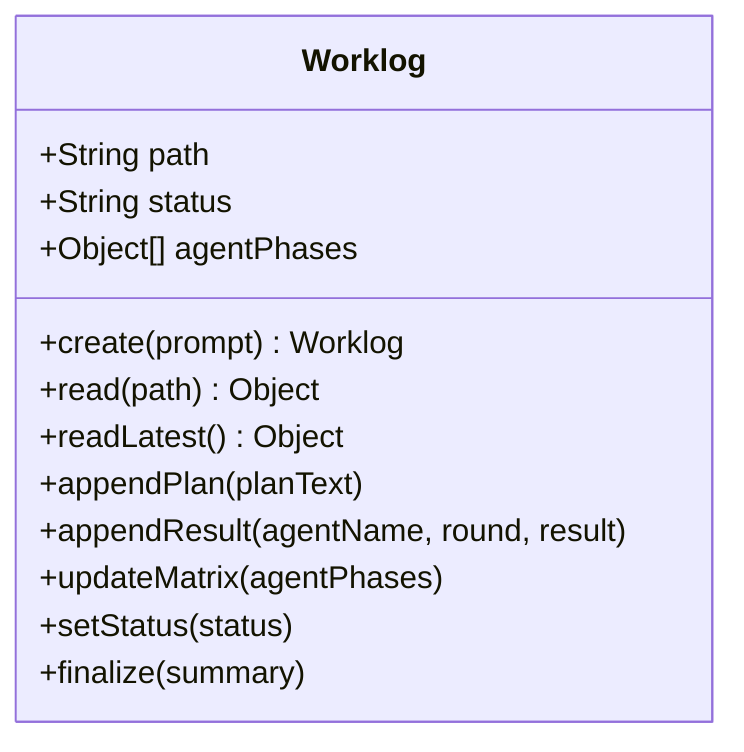

# Phase 1: 기반 모듈 (worklog + dev 스킬 + 역할 정리)

> **의존**: 없음 (독립 작업)
> **검증일**: 2026-02-24
> **산출물**: `src/worklog.js`, `.agents/skills/dev/`, `constants.js` 수정

---

## 1-A: `src/worklog.js` (NEW)

worklog 생성/읽기/쓰기/symlink 관리를 담당하는 독립 모듈.



```javascript
// src/worklog.js
import fs from 'fs';
import { join } from 'path';
import { CLAW_HOME } from './config.js';

const WORKLOG_DIR = join(CLAW_HOME, 'worklogs');
const LATEST_LINK = join(WORKLOG_DIR, 'latest.md');

// ─── Create ──────────────────────────────────────────
export function createWorklog(prompt) {
  fs.mkdirSync(WORKLOG_DIR, { recursive: true });
  const ts = new Date().toISOString().replace(/[:-]/g, '').slice(0, 15);
  const slug = prompt.slice(0, 30).replace(/[^a-zA-Z가-힣0-9]/g, '_');
  const filename = `${ts}_${slug}.md`;
  const path = join(WORKLOG_DIR, filename);

  const initial = `# Work Log: ${prompt.slice(0, 80)}
- Created: ${new Date().toISOString()}
- Status: planning
- Rounds: 0/3

## Plan
(대기 중)

## Verification Criteria
(대기 중)

## Agent Status Matrix
| Agent | Role | Phase | Gate |
| ----- | ---- | ----- | ---- |

## Execution Log

## Final Summary
(미완료)
`;

  fs.writeFileSync(path, initial);
  // symlink 갱신
  try { fs.unlinkSync(LATEST_LINK); } catch {}
  fs.symlinkSync(path, LATEST_LINK);

  return { path, filename };
}

// ─── Read ────────────────────────────────────────────
export function readLatestWorklog() {
  if (!fs.existsSync(LATEST_LINK)) return null;
  const realPath = fs.realpathSync(LATEST_LINK);
  return { path: realPath, content: fs.readFileSync(realPath, 'utf8') };
}

// ─── Append ──────────────────────────────────────────
export function appendToWorklog(path, section, content) {
  const file = fs.readFileSync(path, 'utf8');
  const marker = `## ${section}`;
  const idx = file.indexOf(marker);
  if (idx === -1) {
    fs.appendFileSync(path, `\n## ${section}\n${content}\n`);
  } else {
    const nextSection = file.indexOf('\n## ', idx + marker.length);
    const insertPos = nextSection === -1 ? file.length : nextSection;
    const updated = file.slice(0, insertPos) + '\n' + content + '\n' + file.slice(insertPos);
    fs.writeFileSync(path, updated);
  }
}

// ─── Matrix Update ───────────────────────────────────
export function updateMatrix(path, agentPhases) {
  const PHASES = { 1: '기획', 2: '기획검증', 3: '개발', 4: '디버깅', 5: '통합검증' };
  const table = agentPhases.map(ap =>
    `| ${ap.agent} | ${ap.role} | Phase ${ap.currentPhase}: ${PHASES[ap.currentPhase]} | ${ap.completed ? '✅ 완료' : ap.gatePassed ? '✅ 통과' : '⏳ 진행 중'} |`
  ).join('\n');

  const file = fs.readFileSync(path, 'utf8');
  const header = '## Agent Status Matrix';
  const start = file.indexOf(header);
  const nextSection = file.indexOf('\n## ', start + header.length);
  const replacement = `${header}\n| Agent | Role | Phase | Gate |\n|-------|------|-------|------|\n${table}\n`;
  const updated = file.slice(0, start) + replacement + file.slice(nextSection);
  fs.writeFileSync(path, updated);
}

// ─── Status Update ───────────────────────────────────
export function updateWorklogStatus(path, status, round) {
  const file = fs.readFileSync(path, 'utf8');
  const updated = file
    .replace(/- Status: .*/, `- Status: ${status}`)
    .replace(/- Rounds: .*/, `- Rounds: ${round}/3`);
  fs.writeFileSync(path, updated);
}
```

---

## 1-B: Dev 스킬 생성

[개발스킬-설계안.md](file:///Users/jun/Developer/new/_INBOX/개발스킬-설계안.md) §3 기반:

```
.agents/skills/dev/
├── SKILL.md                  ← Hub (≤100줄): 라우팅 + 공통 규칙
└── reference/
    ├── frontend.md           ← frontend-design ref 기반
    ├── backend.md            ← 새로 작성
    ├── data.md               ← 새로 작성
    └── testing.md            ← webapp-testing ref 기반
```

**핵심**: orchestrator가 `role` 값에 따라 해당 reference를 sub-agent 프롬프트에 주입.

---

## 1-C: `constants.js` 역할 정리

```diff
 export const ROLE_PRESETS = [
-    { value: 'frontend', label: '🎨 프론트엔드', prompt: 'React/Vue 기반 UI 컴포넌트 개발, 스타일링' },
-    { value: 'backend', label: '⚙️ 백엔드', prompt: 'API 서버, DB 스키마, 비즈니스 로직 구현' },
-    { value: 'fullstack', label: '🔄 풀스택', prompt: '프론트엔드와 백엔드 모두 담당' },
-    { value: 'devops', label: '🚀 DevOps', prompt: 'CI/CD, Docker, 인프라 자동화' },
-    { value: 'qa', label: '🧪 QA', prompt: '테스트 작성, 버그 재현, 품질 관리' },
-    { value: 'data', label: '📊 데이터', prompt: '데이터 파이프라인, ETL, 분석 쿼리' },
-    { value: 'docs', label: '📝 테크라이터', prompt: 'API 문서화, README, 가이드 작성' },
-    { value: 'custom', label: '✏️ 커스텀...', prompt: '' },
+    { value: 'frontend', label: '🎨 프런트엔드', prompt: 'UI/UX 구현, CSS, 컴포넌트 개발', skill: 'dev/reference/frontend.md' },
+    { value: 'backend',  label: '⚙️ 백엔드',     prompt: 'API, DB, 서버 로직 구현',     skill: 'dev/reference/backend.md' },
+    { value: 'data',     label: '📊 데이터',     prompt: '데이터 파이프라인, 분석, ML',   skill: 'dev/reference/data.md' },
+    { value: 'docs',     label: '📝 문서작성',   prompt: '문서화, README, API docs',     skill: 'documentation' },
+    { value: 'custom',   label: '✏️ 커스텀...',   prompt: '',                             skill: null },
 ];
```

**변경 포인트:**
- `skill` 필드 추가 → orchestrator가 role에서 주입할 스킬 자동 결정
- fullstack/devops/qa 제거 → 과정(phase)으로 흡수
- DB `role` 컬럼은 기존과 호환 (prompt 텍스트 저장)

---

## 검증된 리스크

### 🔴 HIGH: Dev 스킬 경로 불일치

설계 문서에서 `.agents/skills/dev/` 경로를 사용하지만, 런타임은 다른 경로:

```javascript
// src/config.js (실제 코드)
export const SKILLS_DIR = join(CLAW_HOME, 'skills');  // ~/.cli-claw/skills
export const SKILLS_REF_DIR = join(CLAW_HOME, 'skills_ref');
```

**해결**: dev 스킬을 `~/.cli-claw/skills/dev/`에 위치시키거나, 별도로 `SKILLS_DIR`에서 로딩하도록 `prompt.js`가 이미 처리. `.agents/skills/dev/`에 원본을 두고 `skills_ref` 번들 메커니즘으로 복사하는 기존 패턴을 따를 것.

### 🔴 HIGH: ROLE_PRESETS 변경 시 기존 데이터 깨짐

현재 UI(`employees.js`)는 `ROLE_PRESETS.find(r => r.prompt === a.role)`로 **prompt 텍스트 exact match**:

```javascript
// employees.js:19 (현재 코드)
const matched = ROLE_PRESETS.find(r => r.prompt === a.role);
const presetVal = matched ? matched.value : (a.role ? 'custom' : 'frontend');
```

preset을 삭제/변경하면 → 기존 DB에 저장된 `role` 텍스트가 매치 안 됨 → `custom`으로 폴백.

**해결**:
1. DB 마이그레이션은 불필요 (폴백이 `custom`으로 안전하게 동작)
2. 하지만 기존 직원의 역할이 "풀스택" 등이면 UI에서 `custom`으로 보임
3. **Phase 1에서 UI 업데이트 시 레거시 매핑 추가**:

```javascript
const LEGACY_ROLE_MAP = {
  'React/Vue 기반 UI 컴포넌트 개발, 스타일링': 'frontend',
  'API 서버, DB 스키마, 비즈니스 로직 구현': 'backend',
  '프론트엔드와 백엔드 모두 담당': 'frontend',  // fullstack → frontend
  'CI/CD, Docker, 인프라 자동화': 'custom',
  '테스트 작성, 버그 재현, 품질 관리': 'custom',
  '데이터 파이프라인, ETL, 분석 쿼리': 'data',
  'API 문서화, README, 가이드 작성': 'docs',
};
```

### 🟡 MEDIUM: Worklog 동시 쓰기 레이스

Phase 1에서는 worklog.js만 만드는 단계이므로 직접적 위험 없음.
하지만 Phase 2에서 병렬 sub-agent가 동시에 worklog에 쓸 때 `read-modify-write` 레이스 발생 가능.

**해결 (Phase 2에서 처리)**:
- Sub-agent의 worklog 쓰기는 **장려하되 의존하지 않음** (하이브리드 방식)
- Orchestrator의 append는 **순차적** (await 후 append)
- Sub-agent 동시 쓰기는 **conflict 가능성 인정**, orchestrator append가 canonical source
