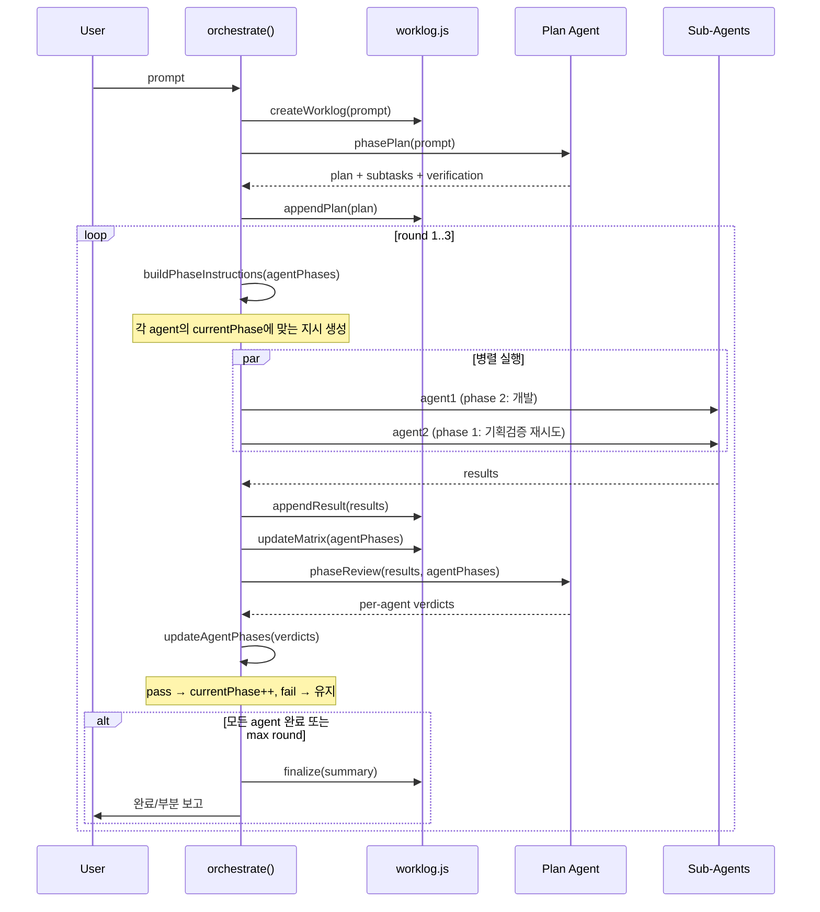

# Phase 2: Orchestrator v2 (핵심 리팩터링)

> **의존**: Phase 1 (`worklog.js`, dev 스킬, 역할 정리)
> **산출물**: `src/orchestrator.js` v2, `src/prompt.js` 확장

---

## 전체 흐름



---

## 코드: `orchestrator.js` v2

```javascript
// src/orchestrator.js v2
import { broadcast } from './bus.js';
import { insertMessage, getEmployees } from './db.js';
import { getSystemPrompt, getSubAgentPromptV2 } from './prompt.js';
import { spawnAgent } from './agent.js';
import { createWorklog, appendToWorklog, updateMatrix, updateWorklogStatus, readLatestWorklog } from './worklog.js';

const MAX_ROUNDS = 3;

// ─── Phase 정의 ──────────────────────────────────────
const PHASES = { 1: '기획', 2: '기획검증', 3: '개발', 4: '디버깅', 5: '통합검증' };

const PHASE_PROFILES = {
  frontend: [1, 2, 3, 4, 5],
  backend:  [1, 2, 3, 4, 5],
  data:     [1, 2, 3, 4, 5],
  docs:     [1, 3, 5],
  custom:   [3],
};

const PHASE_INSTRUCTIONS = {
  1: '이 계획의 실현 가능성을 검증하세요. 문서를 보강하세요. 코드 작성 금지.',
  2: '설계 문서를 검증하고 누락된 부분을 보완하세요.',
  3: '문서를 참조하여 코드를 작성하세요. 변경 로그를 worklog에 기록하세요.',
  4: '코드를 실행/테스트하고 버그를 수정하세요. 디버그 로그를 기록하세요.',
  5: '다른 영역과의 통합을 검증하세요. 최종 문서를 작성하세요.',
};

// ─── Per-Agent Phase Tracking ────────────────────────
function initAgentPhases(subtasks) {
  return subtasks.map(st => {
    const profile = PHASE_PROFILES[st.role || 'custom'] || [3];
    return {
      agent: st.agent,
      task: st.task,
      role: st.role || 'custom',
      phaseProfile: profile,
      currentPhaseIdx: 0,
      currentPhase: profile[0],
      completed: false,
      history: [],
    };
  });
}

function advancePhase(ap, passed) {
  if (!passed) return;
  if (ap.currentPhaseIdx < ap.phaseProfile.length - 1) {
    ap.currentPhaseIdx++;
    ap.currentPhase = ap.phaseProfile[ap.currentPhaseIdx];
  } else {
    ap.completed = true;
  }
}

// ─── Plan Phase ──────────────────────────────────────
async function phasePlan(prompt, worklog) {
  const planOpts = { agentId: 'planning' };
  broadcast('agent_status', { agentId: 'planning', agentName: '🎯 기획', status: 'planning' });

  const planPrompt = `## 작업 요청
${prompt}

## 출력 형식 (반드시 준수)
1. 자연어로 계획을 설명하세요.
2. 검증 기준을 반드시 포함하세요.
3. subtask JSON을 아래 형식으로 출력하세요:

\`\`\`json
{
  "subtasks": [
    { "agent": "직원이름", "role": "frontend|backend|data|docs", "task": "구체적 지시" }
  ]
}
\`\`\`

worklog 경로: ${worklog.path}
이 파일에 계획을 기록하세요.`;

  const { promise } = spawnAgent(planPrompt, planOpts);
  const result = await promise;

  const planText = stripSubtaskJSON(result.text);
  appendToWorklog(worklog.path, 'Plan', planText || '(Plan Agent 응답 없음)');

  const subtasks = parseSubtasks(result.text);
  return { planText, subtasks };
}

// ─── Distribute Phase (per-agent phase-aware) ────────
async function distributeByPhase(agentPhases, worklog, round) {
  const emps = getEmployees.all();
  const results = [];

  const active = agentPhases.filter(ap => !ap.completed);
  if (active.length === 0) return results;

  const promises = active.map(ap => {
    const emp = emps.find(e =>
      e.name === ap.agent || e.name?.includes(ap.agent) || ap.agent.includes(e.name)
    );
    if (!emp) {
      results.push({ agent: ap.agent, role: ap.role, status: 'skipped', text: 'Agent not found' });
      return Promise.resolve();
    }

    const instruction = PHASE_INSTRUCTIONS[ap.currentPhase];
    const phaseLabel = PHASES[ap.currentPhase];
    const sysPrompt = getSubAgentPromptV2(emp, ap.role, ap.currentPhase);

    const taskPrompt = `## 작업 지시 [${phaseLabel}]
${ap.task}

## 현재 Phase: ${ap.currentPhase} (${phaseLabel})
${instruction}

## Worklog
이 파일을 먼저 읽으세요: ${worklog.path}
작업 완료 후 반드시 Execution Log 섹션에 결과를 기록하세요.`;

    broadcast('agent_status', {
      agentId: emp.id, agentName: emp.name,
      status: 'running', phase: ap.currentPhase, phaseLabel,
    });

    const { promise } = spawnAgent(taskPrompt, {
      agentId: emp.id, cli: emp.cli, model: emp.model,
      forceNew: true, sysPrompt,
    });

    return promise.then(r => {
      const result = {
        agent: ap.agent, role: ap.role, id: emp.id,
        phase: ap.currentPhase, phaseLabel,
        status: r.code === 0 ? 'done' : 'error',
        text: r.text || '',
      };
      results.push(result);
      broadcast('agent_status', { agentId: emp.id, agentName: emp.name, status: result.status, phase: ap.currentPhase });
    });
  });

  await Promise.all(promises);

  // 하이브리드 기록: orchestrator가 결과를 worklog에 append
  for (const r of results) {
    appendToWorklog(worklog.path, 'Execution Log',
      `### Round ${round} — ${r.agent} (${r.role}, ${r.phaseLabel})
- Status: ${r.status}
- Result: ${r.text.slice(0, 500)}`
    );
  }

  return results;
}

// ─── Review Phase (per-agent verdict) ────────────────
async function phaseReview(results, agentPhases, worklog, round) {
  const report = results.map(r =>
    `- **${r.agent}** (${r.role}, ${r.phaseLabel}): ${r.status === 'done' ? '✅' : '❌'}\n  ${r.text.slice(0, 400)}`
  ).join('\n');

  const matrixStr = agentPhases.map(ap =>
    `- ${ap.agent}: role=${ap.role}, phase=${ap.currentPhase}(${PHASES[ap.currentPhase]}), completed=${ap.completed}`
  ).join('\n');

  const reviewPrompt = `## 라운드 ${round} 결과 리뷰

### 실행 결과
${report}

### 현재 Agent 상태
${matrixStr}

### Worklog
${worklog.path} — 이 파일의 변경사항도 확인하세요.

## 판정 (각 agent별로 개별 판정)
각 agent에 대해:
- **PASS**: quality gate 통과 → 다음 phase로 진행
- **FAIL**: 재시도 필요 → 같은 phase 유지, 피드백 제공

JSON으로 출력:
\`\`\`json
{
  "verdicts": [
    { "agent": "이름", "pass": true, "feedback": "..." },
    { "agent": "이름", "pass": false, "feedback": "수정 필요: ..." }
  ],
  "allDone": false
}
\`\`\`

모든 작업이 완료되면 allDone: true + 사용자에게 보여줄 자연어 요약을 함께 작성.`;

  broadcast('agent_status', { agentId: 'planning', agentName: '🎯 기획', status: 'reviewing' });
  const { promise } = spawnAgent(reviewPrompt, { agentId: 'planning', internal: true });
  const evalR = await promise;

  let verdicts = null;
  try {
    const fenced = evalR.text.match(/```json\n([\s\S]*?)\n```/);
    if (fenced) verdicts = JSON.parse(fenced[1]);
  } catch {}

  return { verdicts, rawText: evalR.text };
}

// ─── Main Orchestrate v2 ────────────────────────────
export async function orchestrate(prompt) {
  const employees = getEmployees.all();

  if (employees.length === 0) {
    const { promise } = spawnAgent(prompt);
    const result = await promise;
    const stripped = stripSubtaskJSON(result.text);
    broadcast('orchestrate_done', { text: stripped || result.text || '' });
    return;
  }

  const worklog = createWorklog(prompt);
  broadcast('worklog_created', { path: worklog.path });

  const { planText, subtasks } = await phasePlan(prompt, worklog);
  if (!subtasks?.length) {
    broadcast('orchestrate_done', { text: planText || '' });
    return;
  }

  const agentPhases = initAgentPhases(subtasks);
  updateMatrix(worklog.path, agentPhases);

  for (let round = 1; round <= MAX_ROUNDS; round++) {
    updateWorklogStatus(worklog.path, 'round_' + round, round);
    broadcast('round_start', { round, agentPhases });

    const results = await distributeByPhase(agentPhases, worklog, round);
    const { verdicts, rawText } = await phaseReview(results, agentPhases, worklog, round);

    if (verdicts?.verdicts) {
      for (const v of verdicts.verdicts) {
        const ap = agentPhases.find(a => a.agent === v.agent);
        if (ap) {
          advancePhase(ap, v.pass);
          ap.history.push({ round, phase: ap.currentPhase, pass: v.pass, feedback: v.feedback });
        }
      }
    }
    updateMatrix(worklog.path, agentPhases);

    const allDone = agentPhases.every(ap => ap.completed);
    if (allDone || verdicts?.allDone) {
      const summary = stripSubtaskJSON(rawText) || '모든 작업 완료';
      appendToWorklog(worklog.path, 'Final Summary', summary);
      updateWorklogStatus(worklog.path, 'done', round);
      insertMessage.run('assistant', summary, 'orchestrator', '');
      broadcast('orchestrate_done', { text: summary, worklog: worklog.path });
      break;
    }

    broadcast('round_done', { round, action: 'next', agentPhases });

    if (round === MAX_ROUNDS) {
      const done = agentPhases.filter(ap => ap.completed);
      const pending = agentPhases.filter(ap => !ap.completed);
      const partial = `## 완료 (${done.length})\n${done.map(a => `- ✅ ${a.agent} (${a.role})`).join('\n')}\n\n` +
        `## 미완료 (${pending.length})\n${pending.map(a => `- ⏳ ${a.agent} (${a.role}) — Phase ${a.currentPhase}: ${PHASES[a.currentPhase]}`).join('\n')}\n\n` +
        `이어서 진행하려면 "이어서 해줘"라고 말씀하세요.\nWorklog: ${worklog.path}`;
      appendToWorklog(worklog.path, 'Final Summary', partial);
      updateWorklogStatus(worklog.path, 'partial', round);
      insertMessage.run('assistant', partial, 'orchestrator', '');
      broadcast('orchestrate_done', { text: partial, worklog: worklog.path });
    }
  }
}
```

---

## 코드: `prompt.js` 확장 — `getSubAgentPromptV2`

```javascript
// prompt.js에 추가
export function getSubAgentPromptV2(emp, role, currentPhase) {
  let prompt = getSubAgentPrompt(emp);

  const ROLE_SKILL_MAP = {
    frontend: join(SKILLS_DIR, 'dev', 'reference', 'frontend.md'),
    backend:  join(SKILLS_DIR, 'dev', 'reference', 'backend.md'),
    data:     join(SKILLS_DIR, 'dev', 'reference', 'data.md'),
    docs:     null,
  };

  const skillPath = ROLE_SKILL_MAP[role];
  if (skillPath && fs.existsSync(skillPath)) {
    const skillContent = fs.readFileSync(skillPath, 'utf8');
    prompt += `\n\n## Development Guide (${role})\n${skillContent}`;
  }

  const PHASES = { 1: '기획', 2: '기획검증', 3: '개발', 4: '디버깅', 5: '통합검증' };
  prompt += `\n\n## Current Phase: ${currentPhase} (${PHASES[currentPhase]})`;
  prompt += `\n당신은 지금 "${PHASES[currentPhase]}" 단계를 수행 중입니다.`;

  return prompt;
}
```
