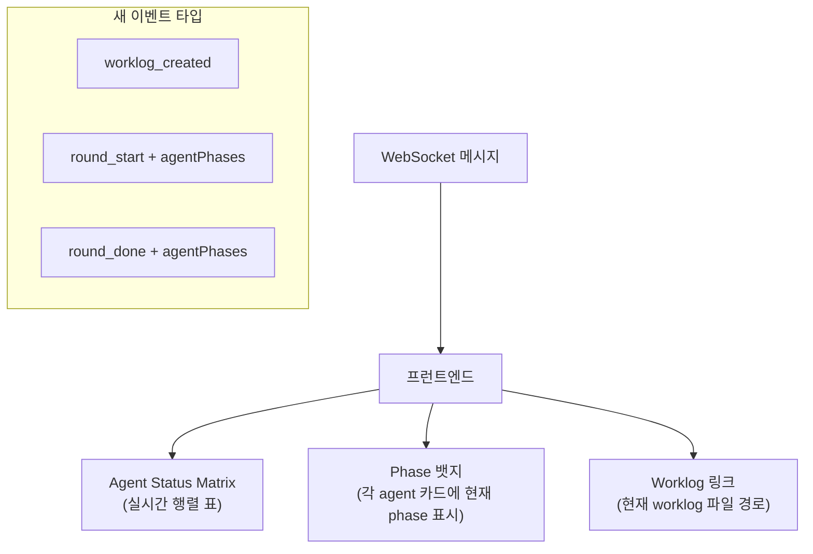
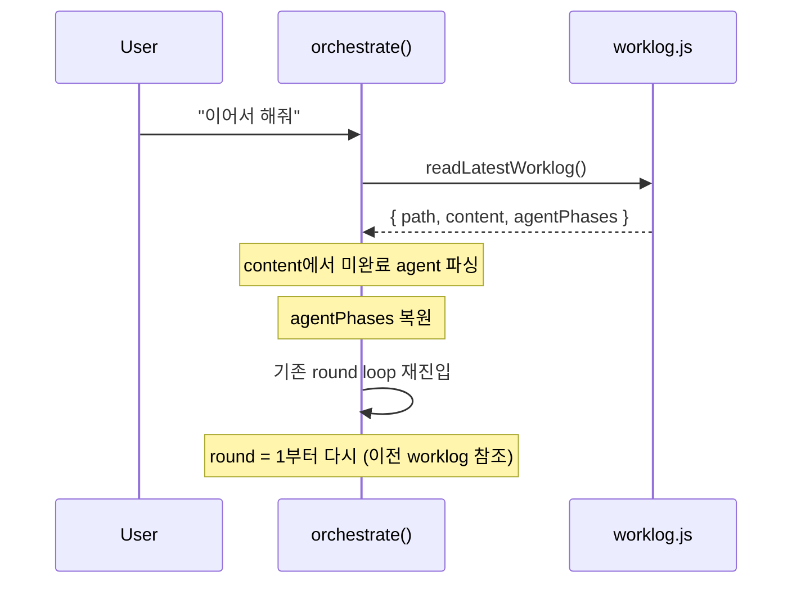

# Phase 3: UX + 연속성

> **의존**: Phase 2 (`orchestrator.js` v2)
> **검증일**: 2026-02-24
> **산출물**: 프런트엔드 행렬 표시, "이어서 해줘" 연속성, 새 API 엔드포인트

---

## 3-A: 프런트엔드 행렬 표시



**bus.js**: 기존 브로드캐스트에 `agentPhases` 배열 추가로 전달.

**프런트엔드**: `employees.js`의 각 agent 카드에 phase 뱃지 표시:

```javascript
// public/js/features/employees.js 확장
function renderPhaseBadge(phase, phaseLabel) {
  const colors = { 1: '#60a5fa', 2: '#a78bfa', 3: '#34d399', 4: '#fbbf24', 5: '#f472b6' };
  return `<span style="background:${colors[phase]};color:#000;padding:1px 6px;border-radius:9px;font-size:10px">${phaseLabel}</span>`;
}
```

---

## 3-B: "이어서 해줘" 연속성



```javascript
// orchestrator.js에 추가
export async function orchestrateContinue() {
  const latest = readLatestWorklog();
  if (!latest) {
    broadcast('orchestrate_done', { text: '이어갈 worklog가 없습니다.' });
    return;
  }

  const pending = parseWorklogPending(latest.content);
  if (!pending.length) {
    broadcast('orchestrate_done', { text: '모든 작업이 이미 완료되었습니다.' });
    return;
  }

  const resumePrompt = `## 이어서 작업
이전 worklog를 읽고 미완료 항목을 이어서 진행하세요.

Worklog: ${latest.path}

미완료 항목:
${pending.map(p => `- ${p.agent} (${p.role}): Phase ${p.currentPhase}`).join('\n')}

subtask JSON을 출력하세요.`;

  return orchestrate(resumePrompt);
}
```

---

## 파일 변경 요약

| 파일                              | 작업                                |
| --------------------------------- | ----------------------------------- |
| `public/js/features/employees.js` | [MODIFY] phase 뱃지 표시            |
| `public/js/ws.js`                 | [MODIFY] 새 이벤트 핸들링           |
| `src/orchestrator.js`             | [MODIFY] `orchestrateContinue` 추가 |
| `server.js` (루트)                | [MODIFY] "이어서" API 엔드포인트    |

---

## 검증된 리스크

### 🟡 MEDIUM: `parseWorklogPending` 미정의

`orchestrateContinue()`에서 사용하는 `parseWorklogPending(latest.content)` 함수가 설계에 정의 안 됨.

**해결**: `worklog.js`에 추가 구현 필요. worklog의 Agent Status Matrix 테이블을 파싱해서 `completed: false`인 agent 목록 반환:

```javascript
export function parseWorklogPending(content) {
  const lines = content.split('\n');
  const pending = [];
  let inMatrix = false;
  for (const line of lines) {
    if (line.includes('## Agent Status Matrix')) { inMatrix = true; continue; }
    if (inMatrix && line.startsWith('## ')) break;
    if (inMatrix && line.includes('⏳')) {
      const cols = line.split('|').map(c => c.trim()).filter(Boolean);
      if (cols.length >= 3) {
        const phaseMatch = cols[2].match(/Phase (\d+)/);
        pending.push({ agent: cols[0], role: cols[1], currentPhase: phaseMatch ? +phaseMatch[1] : 3 });
      }
    }
  }
  return pending;
}
```

### 🟡 MEDIUM: `server.js` 경로 주의

파일 변경 요약에 `src/server.js`로 표기되어 있었지만 실제 서버 파일은 **루트 `server.js`**.

### 🟡 MEDIUM: WS 이벤트 프런트엔드 처리

새 이벤트 (`worklog_created`, `round_start`, `round_done`)를 `ws.js`에서 핸들링 추가 필요.
현재 `ws.js`에는 이 이벤트 타입이 없으므로 무시됨 → Phase 3에서 반드시 추가.

