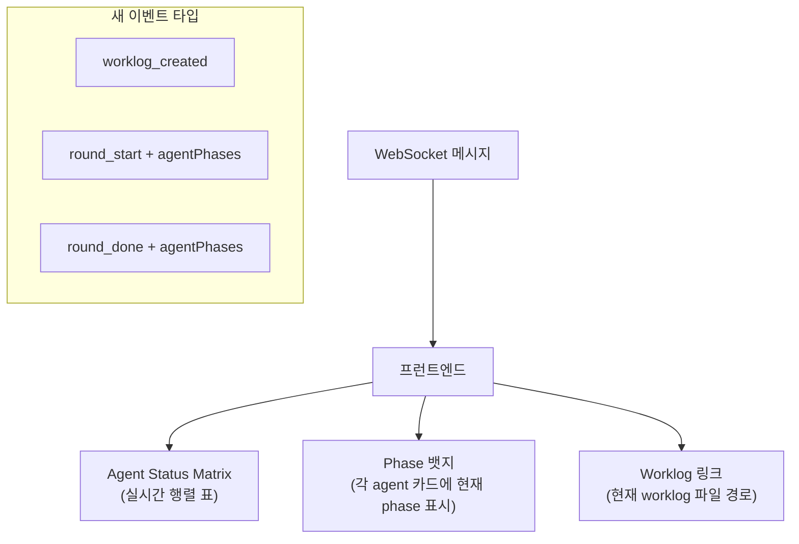
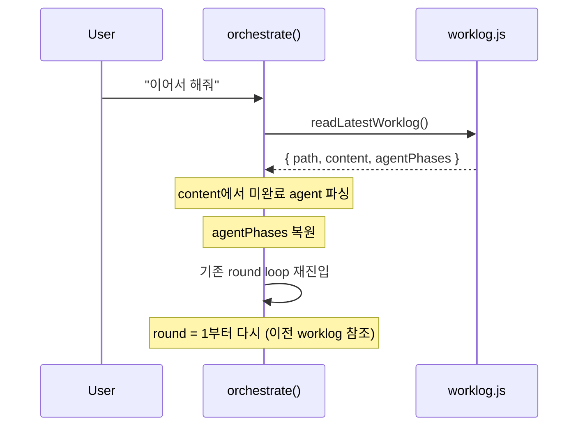

# Phase 3: UX + 연속성

> **의존**: Phase 2 (`orchestrator.js` v2)
> **산출물**: 프런트엔드 행렬 표시, "이어서 해줘" 연속성, 새 API 엔드포인트

---

## 3-A: 프런트엔드 행렬 표시



**bus.js**: 기존 브로드캐스트에 `agentPhases` 배열 추가로 전달.

**프런트엔드**: `employees.js`의 각 agent 카드에 phase 뱃지 표시:

```javascript
// public/js/features/employees.js 확장
function renderPhaseBadge(phase, phaseLabel) {
  const colors = { 1: '#60a5fa', 2: '#a78bfa', 3: '#34d399', 4: '#fbbf24', 5: '#f472b6' };
  return `<span style="background:${colors[phase]};color:#000;padding:1px 6px;border-radius:9px;font-size:10px">${phaseLabel}</span>`;
}
```

---

## 3-B: "이어서 해줘" 연속성



```javascript
// orchestrator.js에 추가
export async function orchestrateContinue() {
  const latest = readLatestWorklog();
  if (!latest) {
    broadcast('orchestrate_done', { text: '이어갈 worklog가 없습니다.' });
    return;
  }

  const pending = parseWorklogPending(latest.content);
  if (!pending.length) {
    broadcast('orchestrate_done', { text: '모든 작업이 이미 완료되었습니다.' });
    return;
  }

  const resumePrompt = `## 이어서 작업
이전 worklog를 읽고 미완료 항목을 이어서 진행하세요.

Worklog: ${latest.path}

미완료 항목:
${pending.map(p => `- ${p.agent} (${p.role}): Phase ${p.currentPhase}`).join('\n')}

subtask JSON을 출력하세요.`;

  return orchestrate(resumePrompt);
}
```

---

## 파일 변경 요약

| 파일                              | 작업                                |
| --------------------------------- | ----------------------------------- |
| `public/js/features/employees.js` | [MODIFY] phase 뱃지 표시            |
| `public/js/ws.js`                 | [MODIFY] 새 이벤트 핸들링           |
| `src/orchestrator.js`             | [MODIFY] `orchestrateContinue` 추가 |
| `src/server.js`                   | [MODIFY] "이어서" API 엔드포인트    |
