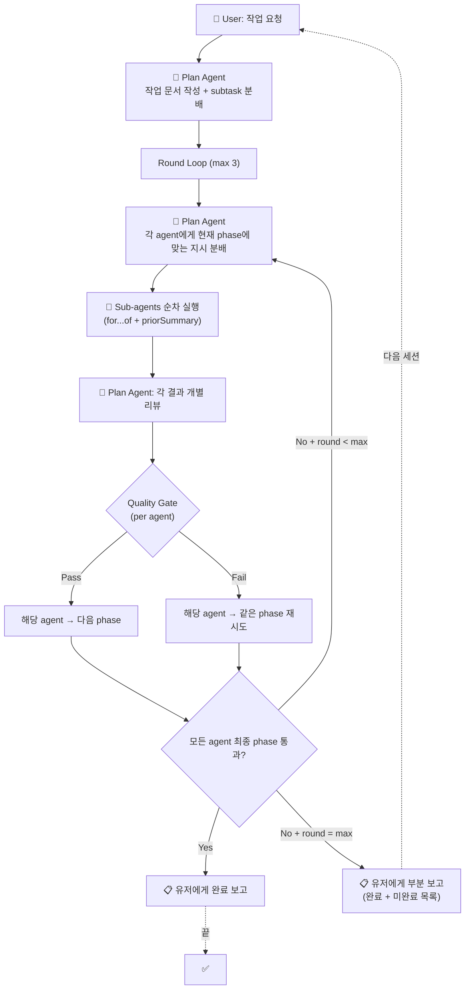
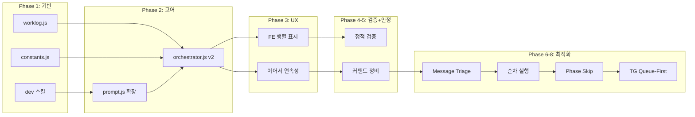

# Orchestration v2: Progressive Refinement Loop

> **날짜**: 2026-02-24
> **상태**: 구현 완료
> **관련**: [개발스킬-설계안](file:///Users/jun/Developer/new/_INBOX/개발스킬-설계안.md), [orchestrator.js](file:///Users/jun/Developer/new/700_projects/cli-claw/src/orchestrator.js)

---

## 핵심 전제

| 에이전트       | Resume | 맥락 유지 방법                |
| -------------- | ------ | ----------------------------- |
| **Plan Agent** | ✅ 가능 | DB 로그 (`buildHistoryBlock`) |
| **Sub-agent**  | ❌ 불가 | **문서 파일이 유일한 수단**   |

→ 모든 작업은 **문서 중심(document-centric)**. 문서가 에이전트 간 유일한 핸드오프.

---

## 워크플로우: Per-Agent Quality Gate Progression

> [!CAUTION]
> **라운드 ≠ 전체 동시 이동**. 각 sub-agent가 **독립적으로** quality gate를 통과한다.
> 같은 라운드에서 Agent A는 구현(phase 2) 중이고 Agent B는 설계검증(phase 1) 재시도 중일 수 있다.

### Phase 정의

> [!NOTE]
> 초기 설계에서는 3단계(설계검증→구현→디버깅)였으나, N×A 행렬 모델 도입 후 **5단계**로 확장.
> 역할에 따라 일부 phase를 건너뛸 수 있어 실질적으로는 3~5단계 유동적.

| Phase | 이름     | 목적                              | Quality Gate (통과 조건)      |
| ----- | -------- | --------------------------------- | ----------------------------- |
| **1** | 기획     | plan 검증, 문서 보강/작성         | Plan Agent가 "설계 충분" 판정 |
| **2** | 기획검증 | 설계 문서 검증, 누락 보완         | Plan Agent가 "검증 완료" 판정 |
| **3** | 개발     | 문서 참조하여 **코드 작성**, 로그 | Plan Agent가 "코드 정상" 판정 |
| **4** | 디버깅   | 코드 실행/테스트, 버그 수정       | Plan Agent가 "버그 해결" 판정 |
| **5** | 통합검증 | 다른 영역 통합, 최종 문서 작성    | Plan Agent가 "완료" 판정      |

### 핵심: Per-Agent 진행률



### 예시: Sub-agent 3명의 라운드별 진행

|             | Agent A (프런트)  | Agent B (백엔드)       | Agent C (테스트)       |
| ----------- | ----------------- | ---------------------- | ---------------------- |
| **Round 1** | Phase 1: 기획 ✅   | Phase 1: 기획 ✅        | Phase 1: 기획 ❌        |
| **Round 2** | Phase 3: 개발 ✅   | Phase 3: 개발 ❌        | Phase 1: 기획 재시도 ✅ |
| **Round 3** | Phase 4: 디버깅 ✅ | Phase 3: 개발 재시도 ✅ | Phase 3: 개발 ✅        |
| **결과**    | ✅ 완료            | ⚠️ Phase 4 미진입       | ⚠️ Phase 4 미진입       |

→ 유저에게: "A 완료, B·C는 개발까지 완료했으나 디버깅 미완. 이어서 할까요?"

### 데이터 모델: subtask 상태 추적

```javascript
// orchestrator v2: per-agent phase tracking
const agentPhases = subtasks.map(st => ({
  agent: st.agent,
  task: st.task,
  role: st.role,
  currentPhase: 1,    // 1=기획, 2=기획검증, 3=개발, 4=디버깅, 5=통합검증
  completed: false,
  history: [],        // 각 라운드 결과 기록
}));
```

Plan Agent 리뷰 후:
```javascript
// Plan Agent가 각 agent별로 판정
for (const ap of agentPhases) {
  const verdict = planAgentVerdict[ap.agent]; // { pass: true/false, feedback: '...' }
  if (verdict.pass && ap.currentPhase < 3) {
    ap.currentPhase++;  // gate 통과 → 다음 phase
  } else if (verdict.pass && ap.currentPhase === 3) {
    ap.completed = true; // 최종 완료
  }
  // fail이면 currentPhase 유지 (같은 phase 재시도)
  ap.history.push({ round, phase: ap.currentPhase, verdict });
}
```

### Plan Agent 분배 시 phase별 지시

```javascript
// 같은 라운드에서도 agent마다 다른 지시
for (const ap of agentPhases) {
  if (ap.completed) continue;
  
  const instruction = PHASE_INSTRUCTIONS[ap.currentPhase];
  // Agent A: "코드를 작성하세요" (phase 2)
  // Agent B: "설계를 다시 검증하세요" (phase 1 재시도)
  dispatch(ap.agent, instruction + '\n\n' + ap.history.last?.feedback);
}
```

> [!IMPORTANT]
> **핵심 차이**: 현재 코드는 "라운드 = 전체 동시 진행"이지만,
> v2는 "라운드 = Plan Agent가 각 agent를 **개별 판정**하고 **개별 phase 지시**".
> 같은 라운드에서 Agent A는 phase 3, Agent B는 phase 1일 수 있다.

## N(역할) × A(과정) 행렬 모델

### 핵심 통찰

> [!IMPORTANT]
> **에이전트 = 풀스택CLI**. 어떤 CLI 에이전트든 코딩·QA·DevOps 다 가능하다.
> **스킬 = 역할 분화**. 에이전트에게 어떤 스킬을 주입하느냐로 전문성이 결정된다.
> → 역할(N)은 스킬로 정의하고, 과정(A)은 동적으로 할당/건너뛰기 가능.

### 현재 ROLE_PRESETS (constants.js)

| value       | label        | prompt (역할 설명)                        |
| ----------- | ------------ | ----------------------------------------- |
| `frontend`  | 🎨 프론트엔드 | React/Vue 기반 UI 컴포넌트 개발, 스타일링 |
| `backend`   | ⚙️ 백엔드     | API 서버, DB 스키마, 비즈니스 로직 구현   |
| `fullstack` | 🔄 풀스택     | 프론트엔드와 백엔드 모두 담당             |
| `devops`    | 🚀 DevOps     | CI/CD, Docker, 인프라 자동화              |
| `qa`        | 🧪 QA         | 테스트 작성, 버그 재현, 품질 관리         |
| `data`      | 📊 데이터     | 데이터 파이프라인, ETL, 분석 쿼리         |
| `docs`      | 📝 테크라이터 | API 문서화, README, 가이드 작성           |
| `custom`    | ✏️ 커스텀...  | (자유 입력)                               |

> DB: `employees (id, name, cli, model, role TEXT)` — role에 prompt 텍스트가 직접 저장됨.

### 분석: 역할 통합/분리

현재 7개 preset 중 일부는 **과정(phase)**에 가까움:
- `qa` → 디버깅/검증 **과정**이지 **역할**이 아님 (모든 역할이 QA 가능)
- `devops` → 기획/통합검증 **과정**에 가까움
- `fullstack` → frontend + backend 합친 것 (별도 역할 불필요)

**N×A 행렬에서의 정리:**

| 현재 preset | 행렬에서                                | 이유                                         |
| ----------- | --------------------------------------- | -------------------------------------------- |
| `frontend`  | **역할 유지** ✅                         | dev/reference/frontend.md 주입               |
| `backend`   | **역할 유지** ✅                         | dev/reference/backend.md 주입                |
| `fullstack` | **폐기** → frontend + backend 각각 분배 | 행렬에서 동일 agent에 두 역할 부여 가능      |
| `devops`    | **과정에 흡수**                         | 기획(PM/DevOps)·통합검증 과정이 이 역할      |
| `qa`        | **과정에 흡수**                         | 디버깅·검증 과정이 이 역할                   |
| `data`      | **역할 유지** ✅                         | dev/reference/science.md (또는 data.md) 주입 |
| `docs`      | **역할 유지** ✅                         | documentation 스킬 주입                      |
| `custom`    | **유지** ✅                              | 확장용                                       |

### 제안: v2 역할 체계 (기본 4개 + custom)

```
역할(Role)    = 무엇을 전문으로 하는가 (스킬로 결정)
과정(Phase)   = 지금 어떤 단계를 수행하는가 (quality gate로 결정)
```

| value      | label             | 주입 스킬                   | phase 프로필                            |
| ---------- | ----------------- | --------------------------- | --------------------------------------- |
| `frontend` | 🎨 프런트엔드      | `dev/reference/frontend.md` | 기획→검증→개발→디버깅→통합              |
| `backend`  | ⚙️ 백엔드          | `dev/reference/backend.md`  | 기획→검증→개발→디버깅→통합              |
| `data`     | 📊 데이터/사이언스 | `dev/reference/data.md`     | 기획→검증→개발→디버깅→통합              |
| `docs`     | 📝 문서작성        | 기존 `documentation` 스킬   | 기획→개발→통합검증 (검증·디버깅 건너뜀) |
| `custom`   | ✏️ 커스텀          | 사용자 지정                 | Plan Agent 재량                         |

> [!TIP]
> **qa/devops/fullstack은 역할이 아닌 과정**이다.
> - 모든 역할이 자기 도메인의 QA를 "디버깅" phase에서 수행
> - DevOps는 "기획" phase와 "통합검증" phase에 자연스럽게 포함
> - fullstack은 Plan Agent가 같은 agent에 frontend+backend 작업을 모두 할당하면 됨

### 제안: ROLE_PRESETS v2 (constants.js)

```javascript
export const ROLE_PRESETS = [
    // ── 개발 역할 (dev skill reference 주입) ──
    { value: 'frontend', label: '🎨 프런트엔드', prompt: 'UI/UX 구현, CSS, 컴포넌트 개발', skill: 'dev/reference/frontend.md' },
    { value: 'backend',  label: '⚙️ 백엔드',     prompt: 'API, DB, 서버 로직 구현',     skill: 'dev/reference/backend.md' },
    { value: 'data',     label: '📊 데이터',     prompt: '데이터 파이프라인, 분석, ML',   skill: 'dev/reference/data.md' },
    // ── 비개발 역할 (별도 스킬 주입) ──
    { value: 'docs',     label: '📝 문서작성',   prompt: '문서화, README, API docs',     skill: 'documentation' },
    // ── 확장 ──
    { value: 'custom',   label: '✏️ 커스텀...',   prompt: '',                             skill: null },
];
```

**변경 포인트:**
- `skill` 필드 추가 → orchestrator가 role에서 주입할 스킬 자동 결정
- fullstack/devops/qa 제거 → 과정(phase)으로 흡수
- DB `role` 컬럼은 기존과 호환 (prompt 텍스트 저장)

### 역할 × 과정 행렬 (최종)

| 역할＼과정     | 기획  | 기획검증 | 개발  | 디버깅 | 통합검증 |
| -------------- | :---: | :------: | :---: | :----: | :------: |
| **🎨 frontend** |   📋   |    ✅     |   🔨   |   🐛    |    🔗     |
| **⚙️ backend**  |   📋   |    ✅     |   🔨   |   🐛    |    🔗     |
| **📊 data**     |   📋   |    ✅     |   🔨   |   🐛    |    🔗     |
| **📝 docs**     |   📋   |    —     |   🔨   |   —    |    🔗     |
| **✏️ custom**   |   ?   |    ?     |   🔨   |   ?    |    ?     |

`—` = 건너뛰기 가능 / `?` = Plan Agent 재량

### Phase 프로필: 역할별 기본 phase 경로

```javascript
const PHASE_PROFILES = {
  frontend: [1, 2, 3, 4, 5],  // 전 과정
  backend:  [1, 2, 3, 4, 5],  // 전 과정
  data:     [1, 2, 3, 4, 5],  // 전 과정
  docs:     [1, 3, 5],         // 기획→개발→통합검증 (검증·디버깅 skip)
  custom:   [3],               // 기본: 개발 only (Plan Agent가 확장 가능)
};

// Phase 번호 매핑
const PHASES = {
  1: '기획',
  2: '기획검증',
  3: '개발',
  4: '디버깅',
  5: '통합검증',
};
```

### 기본 직원 구성 제안

사용자가 처음 직원을 추가할 때 **2명 기본 세트** 제안:

| 이름     | CLI           | Role     | 이유                        |
| -------- | ------------- | -------- | --------------------------- |
| 프런트 🎨 | (사용자 선택) | frontend | 대부분 프로젝트에 UI 있음   |
| 백엔드 ⚙️ | (사용자 선택) | backend  | 대부분 프로젝트에 서버 있음 |

필요 시 추가:
- 📝 문서작성 — 문서화 산출물 필요 시
- 📊 데이터 — ML/데이터 파이프라인 작업 시

> [!NOTE]
> **최소 1명**으로도 동작해야 함. 1명이면 fullstack처럼 모든 phase를 순차 진행.
> Plan Agent가 직원 수에 따라 자동으로 분배 전략을 조정.

## 구현 설계

상세 설계는 Phase별 별도 문서 참조:

| Phase       | 문서                                                                                            | 핵심 산출물                                      |
| ----------- | ----------------------------------------------------------------------------------------------- | ------------------------------------------------ |
| **1: 기반** | [phase1.md](file:///Users/jun/Developer/new/700_projects/cli-claw/devlog/260224_orch/phase1.md) | `worklog.js`, dev 스킬, `constants.js` 정리      |
| **2: 코어** | [phase2.md](file:///Users/jun/Developer/new/700_projects/cli-claw/devlog/260224_orch/phase2.md) | `orchestrator.js` v2, `prompt.js` 확장           |
| **3: UX**   | [phase3.md](file:///Users/jun/Developer/new/700_projects/cli-claw/devlog/260224_orch/phase3.md) | 프런트엔드 행렬 표시, "이어서 해줘" 연속성       |
| **4: 검증** | [phase4.md](file:///Users/jun/Developer/new/700_projects/cli-claw/devlog/260224_orch/phase4.md) | Phase 1-3 정적 검증                              |
| **5: 안정** | [phase5.md](file:///Users/jun/Developer/new/700_projects/cli-claw/devlog/260224_orch/phase5.md) | isContinueIntent, seedDefault, /employee, /reset |
| **6: 분류** | [phase6.md](file:///Users/jun/Developer/new/700_projects/cli-claw/devlog/260224_orch/phase6.md) | needsOrchestration, 순차 실행, 프롬프트 조정     |
| **7: 최적** | [phase7.md](file:///Users/jun/Developer/new/700_projects/cli-claw/devlog/260224_orch/phase7.md) | Smart Agent Allocation, start_phase skip         |
| **8: TG**   | [phase8.md](file:///Users/jun/Developer/new/700_projects/cli-claw/devlog/260224_orch/phase8.md) | Telegram Queue-First, Timeout 확장               |




