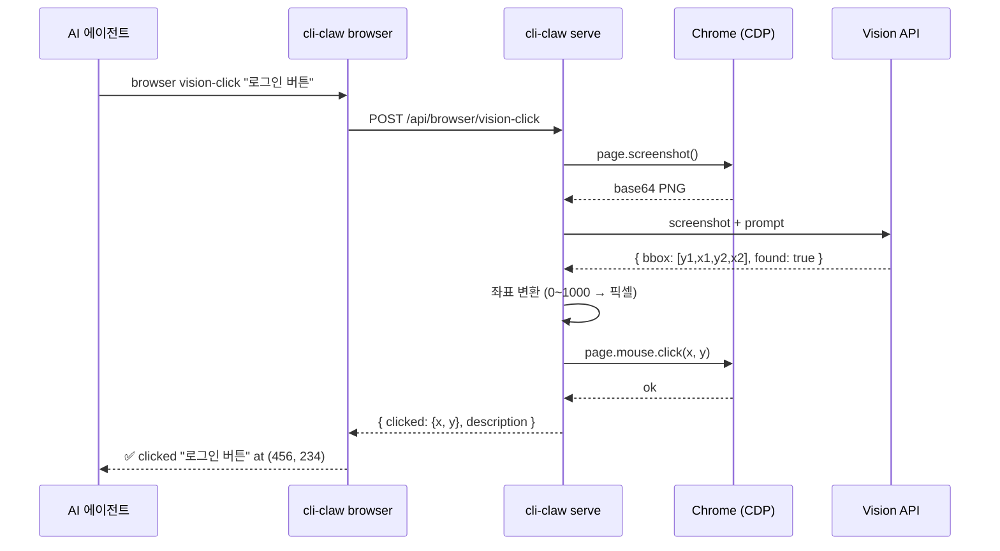

# Vision Click — 비전 기반 브라우저 제어

> ref 스냅샷으로 잡히지 않는 비-DOM 요소(Canvas, 가상 키패드, iframe)를 **비전 모델로 스크린샷 분석 → 좌표 추출 → 클릭/입력**하는 기능.

---

## 왜 필요한가?

현재 `cli-claw browser` 스킬은 `ariaSnapshot` → ref ID 시스템을 쓴다. 이건 **DOM 요소에 대해서만** 작동한다.

| 상황                      | ref 기반    | Vision 기반   |
| ------------------------- | ----------- | ------------- |
| `<button>로그인</button>` | ✅ `e3`      | ✅ 가능        |
| Canvas 기반 가상 키패드   | ❌ DOM 아님  | ✅ 좌표 추출   |
| Shadow DOM / 복잡 iframe  | ❌ 접근 불가 | ✅ 시각적 탐지 |
| 이미지로 렌더된 버튼      | ❌ 역할 없음 | ✅ 비전 인식   |
| Figma/Canvas 앱           | ❌           | ✅             |

**즉, ref의 한계를 비전이 보완하는 관계.**

---

## 아키텍처



---

## 구현 코드 스니펫

### 1. `src/browser/vision.js` — 핵심 비전 모듈

```javascript
// src/browser/vision.js
import { getActivePage } from './connection.js';

/**
 * Vision provider interface.
 * 각 모델별 구현은 analyzeScreenshot()를 반환하는 팩토리.
 */

// ─── Gemini (recommended) ────────────────────────
async function geminiAnalyze(screenshotB64, query, viewport) {
    const { GoogleGenerativeAI } = await import('@google/generative-ai');
    const genAI = new GoogleGenerativeAI(process.env.GEMINI_API_KEY);
    const model = genAI.getGenerativeModel({
        model: process.env.VISION_MODEL || 'gemini-2.5-flash',
        generationConfig: { responseMimeType: 'application/json' },
    });

    const result = await model.generateContent([
        { inlineData: { mimeType: 'image/png', data: screenshotB64 } },
        { text: `이 스크린샷(${viewport.width}x${viewport.height}px)에서 "${query}"을 찾아줘.
JSON 응답: { "found": boolean, "bbox": [ymin, xmin, ymax, xmax], "confidence": "high"|"medium"|"low", "description": "설명" }
bbox는 0~1000 정규화 좌표.` },
    ]);

    const parsed = JSON.parse(result.response.text());
    if (!parsed.found) return { found: false };

    // 0~1000 → 실제 픽셀 좌표 변환
    const [ymin, xmin, ymax, xmax] = parsed.bbox;
    return {
        found: true,
        x: Math.round(((xmin + xmax) / 2) * viewport.width / 1000),
        y: Math.round(((ymin + ymax) / 2) * viewport.height / 1000),
        confidence: parsed.confidence,
        description: parsed.description,
    };
}

// ─── Claude ──────────────────────────────────────
async function claudeAnalyze(screenshotB64, query, viewport) {
    const resp = await fetch('https://api.anthropic.com/v1/messages', {
        method: 'POST',
        headers: {
            'Content-Type': 'application/json',
            'x-api-key': process.env.ANTHROPIC_API_KEY,
            'anthropic-version': '2023-06-01',
        },
        body: JSON.stringify({
            model: process.env.VISION_MODEL || 'claude-sonnet-4-20250514',
            max_tokens: 256,
            messages: [{
                role: 'user',
                content: [
                    { type: 'image', source: { type: 'base64', media_type: 'image/png', data: screenshotB64 } },
                    { type: 'text', text: `이 스크린샷(${viewport.width}x${viewport.height}px)에서 "${query}"의 중심 픽셀 좌표를 찾아줘.
JSON만 반환: { "found": boolean, "x": number, "y": number, "confidence": "high"|"medium"|"low", "description": "설명" }` },
                ],
            }],
        }),
    });
    const data = await resp.json();
    const text = data.content?.[0]?.text || '{}';
    return JSON.parse(text.match(/\{[\s\S]*\}/)?.[0] || '{"found":false}');
}

// ─── GPT-4o ──────────────────────────────────────
async function gptAnalyze(screenshotB64, query, viewport) {
    const resp = await fetch('https://api.openai.com/v1/chat/completions', {
        method: 'POST',
        headers: {
            'Content-Type': 'application/json',
            'Authorization': `Bearer ${process.env.OPENAI_API_KEY}`,
        },
        body: JSON.stringify({
            model: process.env.VISION_MODEL || 'gpt-4o',
            max_tokens: 256,
            response_format: { type: 'json_object' },
            messages: [{
                role: 'user',
                content: [
                    { type: 'image_url', image_url: { url: `data:image/png;base64,${screenshotB64}` } },
                    { type: 'text', text: `이 스크린샷(${viewport.width}x${viewport.height}px)에서 "${query}"의 중심 픽셀 좌표를 찾아줘.
JSON만 반환: { "found": boolean, "x": number, "y": number, "confidence": "high"|"medium"|"low", "description": "설명" }` },
                ],
            }],
        }),
    });
    const data = await resp.json();
    const text = data.choices?.[0]?.message?.content || '{}';
    return JSON.parse(text);
}

// ─── Provider router ─────────────────────────────
const PROVIDERS = { gemini: geminiAnalyze, claude: claudeAnalyze, gpt: gptAnalyze };

function getProvider() {
    const name = (process.env.VISION_PROVIDER || 'gemini').toLowerCase();
    if (!PROVIDERS[name]) throw new Error(`Unknown VISION_PROVIDER: ${name}. Use: gemini|claude|gpt`);
    return PROVIDERS[name];
}

// ─── Public API ──────────────────────────────────

export async function visionQuery(port, query) {
    const page = await getActivePage(port);
    const screenshot = await page.screenshot({ type: 'png' });
    const b64 = screenshot.toString('base64');
    const viewport = page.viewportSize() || { width: 1280, height: 720 };
    const analyze = getProvider();
    return analyze(b64, query, viewport);
}

export async function visionClick(port, target, opts = {}) {
    const result = await visionQuery(port, target);
    if (!result.found) return { success: false, error: `"${target}" 을 화면에서 찾지 못함` };

    const page = await getActivePage(port);
    if (opts.doubleClick) {
        await page.mouse.dblclick(result.x, result.y);
    } else {
        await page.mouse.click(result.x, result.y);
    }
    return { success: true, clicked: { x: result.x, y: result.y }, description: result.description };
}

export async function visionType(port, target, text) {
    // 1. 비전으로 입력 필드 찾아서 클릭
    const clickResult = await visionClick(port, target);
    if (!clickResult.success) return clickResult;

    // 2. 키보드 입력
    const page = await getActivePage(port);
    await page.keyboard.type(text, { delay: 50 });
    return { success: true, typed: text, at: clickResult.clicked };
}
```

### 2. `server.js` — API 라우트 추가

```javascript
// server.js에 추가할 라우트들

import { visionClick, visionType, visionQuery } from './src/browser/vision.js';

app.post('/api/browser/vision-click', async (req, res) => {
    try {
        const { target, doubleClick } = req.body;
        const result = await visionClick(CDP_PORT, target, { doubleClick });
        res.json(result);
    } catch (e) { res.status(500).json({ error: e.message }); }
});

app.post('/api/browser/vision-type', async (req, res) => {
    try {
        const { target, text } = req.body;
        const result = await visionType(CDP_PORT, target, text);
        res.json(result);
    } catch (e) { res.status(500).json({ error: e.message }); }
});

app.post('/api/browser/vision-query', async (req, res) => {
    try {
        const { query } = req.body;
        const result = await visionQuery(CDP_PORT, query);
        res.json(result);
    } catch (e) { res.status(500).json({ error: e.message }); }
});
```

### 3. `bin/commands/browser.js` — CLI 커맨드 추가

```javascript
// switch문에 추가할 case들

case 'vision-click': {
    const target = process.argv.slice(4).filter(a => !a.startsWith('--')).join(' ');
    if (!target) { console.error('Usage: cli-claw browser vision-click "<target>"'); process.exit(1); }
    const opts = {};
    if (process.argv.includes('--double')) opts.doubleClick = true;
    const r = await api('POST', '/vision-click', { target, ...opts });
    if (r.success) console.log(`👁️ clicked "${target}" at (${r.clicked.x}, ${r.clicked.y}) — ${r.description}`);
    else console.error(`❌ ${r.error}`);
    break;
}

case 'vision-type': {
    const args = process.argv.slice(4);
    const target = args[0];
    const text = args.slice(1).join(' ');
    const r = await api('POST', '/vision-type', { target, text });
    if (r.success) console.log(`👁️ typed "${text}" at (${r.at.x}, ${r.at.y})`);
    else console.error(`❌ ${r.error}`);
    break;
}

case 'vision-query': {
    const query = process.argv.slice(4).join(' ');
    const r = await api('POST', '/vision-query', { query });
    console.log(JSON.stringify(r, null, 2));
    break;
}
```

---

## 사용 예시

```bash
# 1. 비전으로 Canvas 가상 키패드 입력
cli-claw browser vision-click "숫자 5 버튼"
cli-claw browser vision-click "숫자 3 버튼"
cli-claw browser vision-click "확인 버튼"

# 2. 비전으로 입력 필드 찾아서 타이핑
cli-claw browser vision-type "이메일 입력란" "user@example.com"

# 3. 화면 상태 질의
cli-claw browser vision-query "로그인이 성공했는가?"
# → { "found": true, "description": "마이페이지 환영 메시지가 보입니다" }

# 4. ref 기반과 혼합 사용 (핵심 패턴)
cli-claw browser snapshot --interactive       # ref로 잡히는 건 ref로
cli-claw browser type e3 "user@example.com"   # DOM 요소 → ref
cli-claw browser vision-click "가상 키패드 7" # 비-DOM → vision
```

---

## 환경변수

```bash
# Vision Provider 선택 (기본: gemini)
VISION_PROVIDER=gemini   # gemini | claude | gpt

# Provider별 API 키 (선택한 것만 필요)
GEMINI_API_KEY=...
ANTHROPIC_API_KEY=...
OPENAI_API_KEY=...

# 모델 오버라이드 (선택)
VISION_MODEL=gemini-2.5-flash  # 기본값. 다른 모델도 가능
```

---

## 모델별 심층 비교 (2026-02 기준)

### 좌표 추출 능력 (MLB 20-80 스케일)

| 능력              | Gemini 2.5 Flash | Gemini 2.5 Pro | Claude Opus 4.6 | Claude Sonnet 4.6 | GPT-5.3 Codex | GPT-5.2 Thinking |
| ----------------- | ---------------- | -------------- | --------------- | ----------------- | ------------- | ---------------- |
| **네이티브 bbox** | 70               | 75             | 30              | 30                | 55            | 60               |
| **좌표 정확도**   | 60               | 70             | 65 (CU)         | 55                | 65            | 70               |
| **JSON 안정성**   | 70               | 70             | 55              | 55                | 65            | 65               |
| **속도**          | 75               | 50             | 40              | 55                | 50            | 40               |
| **비용**          | 80               | 50             | 25              | 40                | 40            | 30               |
| **종합**          | **70**           | **63**         | **43**          | **47**            | **55**        | **53**           |

> 출처: [Gemini Vision API Bounding Box docs](https://ai.google.dev/gemini-api/docs/vision), [Anthropic Opus 4.6 release](https://anthropic.com), [OpenAI GPT-5.3-Codex release (2026-02-05)](https://openai.com), [ScreenSpot-Pro benchmark](https://emergentmind.com), web search 2026-02-24

---

### Gemini 2.5 Flash — 여전히 최적

**Jan 2026 Agentic Vision Update** 이후 한 단계 더 올가감:

1.  **네이티브 0~1000 정규화 bbox** — 학습 데이터에 bbox 태스크 포함. 다른 모델은 좌표를 "추측"하지만, Gemini는 실제 grounding 태스크로 학습됨.
2.  **Agentic Vision (2026-01)** — 스크린샷 분석 시 자동 zoom-in + 단계별 추론. 작은 텍스트나 시리얼 넘버까지 감지.
3.  **`responseMimeType: 'application/json'`** — JSON 출력을 API 레벨에서 강제. 파싱 실패 리스크 최소.
4.  **Flash = 최저가** — 스크린샷 1회 분석당 ~$0.001.

> 출처: [Reddit — Gemini 2.5 Flash Agentic Vision Update](https://reddit.com), [Medium — Gemini 2.5 Pro bbox precision](https://medium.com)

**Gemini 2.5 Pro**는 문서/인보이스의 고정밀 bbox 추출에 특화. UI 요소 좌표 추출에는 Flash로 충분.

---

### Claude Opus 4.6 — Computer Use 접근법

**2026-02 릴리스.** Computer Use가 크게 업그레이드됨:

-   **OSWorld 벤치마크 61.4%** (Sonnet 4.5 기준, 업계 선두)
-   **픽셀 카운팅 학습** — "화면에서 픽셀을 세어 정확한 클릭 좌표 생성" 방식
-   **1M 토큰 컨텍스트** — 복잡한 멀티스텝 시나리오에 유리

> 출처: [Anthropic Opus 4.6 release notes](https://anthropic.com), [Tom's Guide Opus 4.6 review](https://tomsguide.com), [Dev.to Sonnet 4.5 OSWorld](https://dev.to)

**하지만 vision-click용으로는 미묘한 이유:**

| 장점                               | 단점                                                            |
| ---------------------------------- | --------------------------------------------------------------- |
| 화면 전체 제어 가능 (Computer Use) | **bbox 네이티브 아님** — 픽셀 카운팅은 learned grounding과 다름 |
| 복잡한 멀티스텝 시나리오에 강함    | **비용 10x~20x** (Gemini Flash 대비)                            |
| 공간 추론 개선됨                   | **속도 느림** — 대형 모델 지연                                  |
| tool_use로 좌표 구조화 반환 가능   | **JSON 직접 반환 불안정** — 마크다운 섞임 이슈                  |

**Computer Use API 통합 방식 (대안 아키텍처):**

```javascript
// Claude Computer Use를 vision provider로 쓸 경우
// ⚠️ 주의: 일반 메시지 API가 아닌 tool_use 기반
async function claudeComputerUseAnalyze(screenshotB64, query, viewport) {
    const resp = await fetch('https://api.anthropic.com/v1/messages', {
        method: 'POST',
        headers: {
            'Content-Type': 'application/json',
            'x-api-key': process.env.ANTHROPIC_API_KEY,
            'anthropic-version': '2023-06-01',
            'anthropic-beta': 'computer-use-2025-01-24',
        },
        body: JSON.stringify({
            model: 'claude-opus-4-20260210',
            max_tokens: 1024,
            tools: [{
                type: 'computer_20250124',
                name: 'computer',
                display_width_px: viewport.width,
                display_height_px: viewport.height,
                display_number: 1,
            }],
            messages: [{
                role: 'user',
                content: [
                    { type: 'image', source: { type: 'base64', media_type: 'image/png', data: screenshotB64 } },
                    { type: 'text', text: `이 스크린샷에서 "${query}"을 찾아서 클릭해줘.` },
                ],
            }],
        }),
    });
    const data = await resp.json();
    // Computer Use는 tool_use 블록으로 좌표를 반환
    const toolUse = data.content?.find(b => b.type === 'tool_use');
    if (!toolUse || toolUse.input.action !== 'mouse_move') {
        return { found: false };
    }
    const [x, y] = toolUse.input.coordinate;
    return { found: true, x, y, confidence: 'medium', description: query };
}
```

> [!IMPORTANT]
> Computer Use API는 **tool_use 흐름**이라서 일반 vision 분석보다 복잡하고 비쌈. cli-claw의 "좌표만 빠르게 추출" 패턴에는 **Gemini가 더 적합**하지만, 이미 Claude로 에이전트를 운영 중이라면 API 키 하나로 통합할 수 있다는 장점이 있음.

---

### GPT-5.3-Codex — 다크호스 🐴

**2026-02-05 릴리스.** GPT-5.2의 추론 + GPT-5.2-Codex의 코딩을 통합한 에이전틱 코딩 모델.

> 출처: [OpenAI GPT-5.3-Codex announcement](https://openai.com), [DataCamp GPT-5.3-Codex review](https://datacamp.com), [Laravel News](https://laravel-news.com)

**핵심 발견 — ScreenSpot-Pro 벤치마크:**

| 모델                 | ScreenSpot-Pro 점수 | 비고                |
| -------------------- | ------------------- | ------------------- |
| GPT-5.1              | 64.2%               | 이전 세대           |
| **GPT-5.2 Thinking** | **86.3%**           | Python 도구 결합 시 |
| **GPT-5.2 Pro**      | **91%**             | 리더보드 최고       |
| GPT-5.3-Codex        | ~86%+ (추정)        | 5.2 Thinking 기반   |

> 출처: [ScreenSpot-Pro benchmark (emergentmind.com)](https://emergentmind.com), [OpenAI GPT-5.2 system card](https://openai.com), [Medium — GPT-5.2 ScreenSpot-Pro](https://medium.com)

**ScreenSpot-Pro**는 전문 GUI의 고해상도 스크린샷에서 자연어로 지정된 요소의 정확한 바운딩 박스를 찾는 벤치마크. 23개 앱, 5개 산업, 3개 OS를 커버. **GPT-5.2가 여기서 86.3%를 찍었다는 건 GUI 요소 좌표 추출이 실용 가능 수준**이라는 뜻.

**GPT-5.3-Codex가 vision-click에 쓸만한 이유:**

| 장점                                                | 단점                                              |
| --------------------------------------------------- | ------------------------------------------------- |
| ScreenSpot-Pro 86.3% — GUI grounding 세계 최고 수준 | Codex 자체는 코딩 특화, vision은 GPT-5.2에서 상속 |
| `response_format: json_object` 지원                 | 네이티브 bbox 형식 없음 (픽셀 좌표 텍스트 반환)   |
| 코드 생성 + 비전 통합 — 멀티스텝 자동화에 유리      | Gemini Flash 대비 **비용 5x~10x**                 |
| Codex-Spark (2026-02-12): 실시간 추론 최적화        | Spark는 비전 성능 미확인                          |
| 에이전트 도구 호출 네이티브 지원                    | API 호출당 latency 높음                           |

**GPT-5.3-Codex 코드 스니펫:**

```javascript
// GPT-5.3-Codex vision provider
// ScreenSpot-Pro에서 검증된 GUI grounding 능력 활용
async function codex53Analyze(screenshotB64, query, viewport) {
    const resp = await fetch('https://api.openai.com/v1/chat/completions', {
        method: 'POST',
        headers: {
            'Content-Type': 'application/json',
            'Authorization': `Bearer ${process.env.OPENAI_API_KEY}`,
        },
        body: JSON.stringify({
            model: 'gpt-5.3-codex',  // or 'gpt-5.3-codex-spark' for faster
            max_tokens: 256,
            response_format: { type: 'json_object' },
            messages: [{
                role: 'system',
                content: `You are a precise GUI element locator trained on ScreenSpot-Pro.
Given a screenshot and element description, return the center pixel coordinate.
Screenshot dimensions: ${viewport.width}x${viewport.height}px.
Return ONLY JSON: { "found": bool, "x": int, "y": int, "confidence": "high"|"medium"|"low", "description": "..." }`,
            }, {
                role: 'user',
                content: [
                    { type: 'image_url', image_url: {
                        url: `data:image/png;base64,${screenshotB64}`,
                        detail: 'high',   // ← 고해상도 분석 강제
                    }},
                    { type: 'text', text: `Find "${query}" and return its center pixel coordinate.` },
                ],
            }],
        }),
    });
    const data = await resp.json();
    return JSON.parse(data.choices?.[0]?.message?.content || '{"found":false}');
}
```

> [!TIP]
> **GPT-5.3-Codex-Spark** (2026-02-12 릴리스)는 실시간 추론 최적화 모델. vision-click처럼 빠른 응답이 필요한 패턴에 유리할 수 있으나, 비전 grounding 성능은 아직 미검증.

---

### 종합 비교표

| 항목             | Gemini 2.5 Flash               | Claude Opus 4.6 (CU)       | GPT-5.3-Codex                  |
| ---------------- | ------------------------------ | -------------------------- | ------------------------------ |
| **접근 방식**    | 네이티브 bbox grounding        | 픽셀 카운팅 (Computer Use) | GUI grounding (ScreenSpot-Pro) |
| **좌표 형식**    | `[ymin,xmin,ymax,xmax]` 0~1000 | `[x, y]` 픽셀 (tool_use)   | `{x, y}` 픽셀 (json_object)    |
| **GUI 벤치마크** | — (별도 벤치 없음)             | OSWorld 61.4%              | **ScreenSpot-Pro 86.3%**       |
| **JSON 강제**    | ✅ `responseMimeType`           | ❌ tool_use 파싱 필요       | ✅ `response_format`            |
| **비용/호출**    | ~$0.001                        | ~$0.02                     | ~$0.005~0.01                   |
| **최적 용도**    | 빠른 좌표 추출 (우리 패턴)     | 복잡한 멀티스텝 GUI 제어   | **코드+비전 통합 자동화**      |
| **추가 의존성**  | `@google/generative-ai`        | 없음 (REST)                | 없음 (REST)                    |
| **추천도**       | ⭐⭐⭐⭐⭐                          | ⭐⭐⭐                        | ⭐⭐⭐⭐                           |

### 결론

-   **기본 provider = Gemini 2.5 Flash**. bbox가 학습된 유일한 모델. 가장 빠르고 저렴.
-   **GPT-5.3-Codex = 진짜 다크호스**. ScreenSpot-Pro 86.3%는 놀라운 수치. GUI 요소 grounding이 실용 수준. 다만 네이티브 bbox 형식이 아니라 텍스트로 좌표를 반환하기 때문에 가끔 파싱 에러 가능. **비용도 Gemini의 5~10x.**
-   **이미 Claude 키가 있고 복잡한 GUI 시나리오** → Opus 4.6 Computer Use도 viable. 다만 비용 20x.
-   **모든 provider는 `VISION_PROVIDER` 환경변수로 런타임 스위칭** 가능하게 설계함.

```bash
# Provider 선택
VISION_PROVIDER=gemini   # 기본, 최적
VISION_PROVIDER=codex    # GPT-5.3-Codex (ScreenSpot-Pro 검증)
VISION_PROVIDER=claude   # Opus 4.6 Computer Use

# 모델 오버라이드
VISION_MODEL=gpt-5.3-codex-spark  # Codex Spark (빠른 추론)
```

---

## 의존성

```json
// package.json에 추가 (Gemini 사용 시)
{
  "@google/generative-ai": "^0.24.0"
}
```

Claude/GPT는 REST API 직접 호출이라 추가 의존성 없음.

---

## 리스크 & 대응

| 리스크                    | 대응                                                    |
| ------------------------- | ------------------------------------------------------- |
| 좌표 부정확 → 잘못된 클릭 | 클릭 전 `confidence` 체크 + 클릭 후 `snapshot`으로 검증 |
| Claude CU API 변경        | beta API라 버전 핀닝 (`anthropic-beta` 헤더) 필수       |

---

## 변경 기록

- 2026-02-24: 초안. eyepeteerMCP 아이디어 기반, 멀티 모델 분석 추가.
- 2026-02-24: v2. Opus 4.6 Computer Use, GPT-5/Codex, Gemini Agentic Vision Update 심층 분석 추가.
