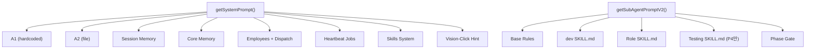

# Phase 17 — 에이전트 토큰 주입 분석 및 개선 방안

> 목표: 프롬프트가 어떻게 조립/주입되는지 정밀 측정, 왜 토큰이 쌓이는지 보고, 개선안 제시

---

## 1. 프롬프트 조립 파이프라인



---

## 2. 실측 토큰 브레이크다운 (2026-02-25 기준)

### Main Agent (`getSystemPrompt()`)

| 레이어 | 크기 (chars) | ~토큰 | 소스 |
|--------|-------------|-------|------|
| A1 (Core Rules) | 3,990 | ~998 | 하드코딩 (`prompt.js`) |
| A2 (User Config) | 352 | ~88 | `~/.cli-claw/prompts/A-2.md` |
| Session Memory | 186 | ~47 | `~/.claude/projects/.../memory/*.md` (10K cap) |
| Core Memory | 1,394 | ~349 | `~/.cli-claw/memory/MEMORY.md` (1.5K cap) |
| Orchestration System | 1,011 | ~253 | DB employees + dispatch format |
| Heartbeat Jobs | 303 | ~76 | `~/.cli-claw/heartbeat.json` |
| Skills System | 2,495 | ~624 | 17 active 이름 + 104 ref CSV |
| **총계** | **9,394** | **~2,349** | |

### Sub-Agent (`getSubAgentPromptV2()`)

| 구성 | chars | ~토큰 |
|------|-------|-------|
| Base (rules + browser + TG + memory + active skills) | 1,454 | ~364 |
| dev SKILL.md | 3,086 | ~772 |
| dev-frontend SKILL.md | 4,232 | ~1,058 |
| Phase Gate (context + rules) | ~500 | ~125 |
| **Frontend Phase 1-3,5 총계** | **~8,500** | **~2,125** |
| + dev-testing SKILL.md (Phase 4만) | +3,881 | +970 |
| **Frontend Phase 4 총계** | **~12,354** | **~3,089** |

### 참고: 스킬 파일 크기 Top 5

| 스킬 | 크기 |
|------|------|
| docx | 17,091 |
| xlsx | 11,027 |
| notion | 10,138 |
| imagegen | 9,916 |
| github | 5,719 |

---

## 3. 오케스트레이션 토큰 사용 시나리오

### Case: 3 agents × 5 phases × 1 round (최소)

```
Plan spawn:      1 × 9,394 =   9,394 chars
Sub-agent spawn: 3 × 5 × 8,500 = 127,500 chars  ← 핵심 낭비
+ taskPrompt:    15 × ~2,000  =  30,000 chars
Review spawn:    1 × 9,394    =   9,394 chars
────────────────────────────────
총계:                           ~176,000 chars (~44,000 tokens)
```

### Case: 3 agents × 5 phases × 3 rounds (최악)

```
Plan:    3 ×  9,394  =  28,182
Agents: 45 ×  8,500  = 382,500  ← 이게 문제
Task:   45 ×  2,000  =  90,000
Review:  3 ×  9,394  =  28,182
────────────────────────────────
총계:                  ~528,864 chars (~132,000 tokens)
```

---

## 4. 왜 이렇게 쌓이나?

### 핵심: **매 spawn마다 프롬프트 전체 재생성**

```text
distributeByPhase() loop:
  for each active agent:
    sysPrompt = getSubAgentPromptV2(emp, role, phase)  ← 디스크 I/O 3-4회
    taskPrompt = "## 작업 지시..." + worklog + prior results
    spawnAgent(taskPrompt, { sysPrompt, forceNew: true })
      → agent.js: buildArgs(cli, ..., sysPrompt)
        → Claude: --append-system-prompt <sysPrompt 전체>
        → Codex: regenerateB() → AGENTS.md 파일 재작성
        → Gemini: GEMINI_SYSTEM_MD 임시파일 재작성
```

| 낭비 패턴 | 설명 |
|-----------|------|
| **디스크 I/O 반복** | `readFileSync(dev/SKILL.md)` + `readFileSync(dev-frontend/SKILL.md)` 매 phase마다 |
| **동일 sysPrompt 재생성** | 같은 agent(같은 role)는 phase만 바뀌고 스킬 내용 동일 → 그런데 매번 처음부터 조립 |
| **regenerateB() 중복** | Codex/OpenCode 경로에서 `regenerateB()` → B.md + AGENTS.md 재작성, 내용 같아도 |
| **Claude --append 이중 주입** | main agent의 `--append-system-prompt`에 orchestration rules + skills 포함 → sub-agent는 자체 rules + skills 포함 → 둘 다 주입 |

---

## 5. 개선안

### Option A: SQLite 세션 캐싱 (주니 제안 ✅ 추천)

```sql
-- db.js에 추가
CREATE TABLE IF NOT EXISTS prompt_cache (
    agent_id    TEXT PRIMARY KEY,      -- 'main' 또는 employee ID
    role        TEXT,
    prompt_hash TEXT,                  -- 입력 변경 감지용
    prompt_text TEXT,                  -- 조립된 프롬프트 캐시
    created_at  DATETIME DEFAULT CURRENT_TIMESTAMP
);
```

**흐름**:
1. `getSubAgentPromptV2()` 호출 전에 DB 캐시에서 `(agent_id, role)` 조회
2. 입력(스킬 목록 + role + phase)의 hash 비교 → 같으면 캐시 반환
3. 다르면 재생성 + 캐시 업데이트

**장점**: 디스크 I/O 제거 + 프롬프트 조립 스킵 + 워크플로우 변경 불필요
**예상 효과**: 15회 readFileSync → 1회 (첫 spawn만)

### Option B: 인메모리 Map 캐싱 (가벼운 대안)

```js
// prompt.js 상단
const promptCache = new Map();  // key: `${role}:${phase}` → value: prompt string

export function getSubAgentPromptV2(emp, role, currentPhase) {
    const cacheKey = `${role}:${currentPhase}`;
    if (promptCache.has(cacheKey)) return promptCache.get(cacheKey);
    // ... 기존 조립 로직 ...
    promptCache.set(cacheKey, prompt);
    return prompt;
}

// orchestrate() 시작 시 캐시 클리어
export function clearPromptCache() { promptCache.clear(); }
```

**장점**: 구현 1분, 코드 5줄
**단점**: 프로세스 재시작 시 사라짐 (but orchestration은 단일 프로세스 내에서 완료)

### Option C: 프롬프트 분리 (중기)

스킬 내용을 프롬프트에서 분리 → 스킬 이름만 주입 + 첫 메시지에서 "이 스킬 파일을 읽어라" 지시

```diff
- prompt += `\n\n## Development Guide (Common)\n${fs.readFileSync(devCommonPath, 'utf8')}`;
+ prompt += `\n\n## Development Guide\nRead: ~/.cli-claw/skills/dev/SKILL.md`;
```

**장점**: 토큰 70% 감소 (8,500 → 2,500)
**단점**: 에이전트가 스킬 파일 읽기 실행해야 함 → latency + 추가 tool use

---

## 6. 추천 실행 순서

| 우선순위 | 작업 | 예상 토큰 절감 | 난이도 |
|---------|------|---------------|--------|
| **P0** | Option B: 인메모리 캐싱 | 15회→1회 I/O | 5줄 |
| **P1** | Option A: SQLite 캐시 테이블 | 프로세스 간 재사용 | 20줄 |
| **P2** | Option C: 스킬 참조화 | ~70% 토큰 절감 | CLI 의존 |

> [!IMPORTANT]
> Option B만으로도 즉각 효과. A는 B 위에 얹으면 되고, C는 별도 검증 필요.
