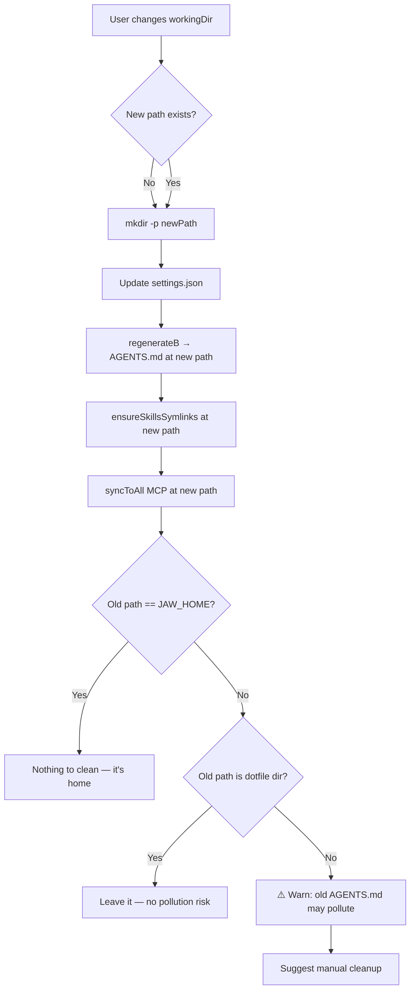

# Working Directory Refactor — Default `~` -> `~/.cli-jaw`

**Date**: 2026-02-26
**Status**: Smoke-tested ✅ — Ready for implementation
**Priority**: High (prevents instruction pollution for standalone CLI users)

---

## Problem

Current defaults use `~/` (user home) as the working directory.
That means:

1. `~/AGENTS.md` is generated in user's home — visible to ALL CLI tools
2. `~/CLAUDE.md` symlink → `~/AGENTS.md` also exists
3. Agent process `cwd` starts at `~/`
4. A-2 template says `Working Directory: ~/`

### The Real Issue: Instruction Pollution

When users run Claude, Codex, or Copilot **standalone** (outside cli-jaw) in any
directory like `~/Developer/my-app/`, these CLIs **walk up the directory tree** and
discover `~/AGENTS.md` or `~/CLAUDE.md`. This causes the standalone CLI to load
the full Jaw Agent system prompt — "I am Jaw Agent, a system-level AI assistant..."
— even when the user never intended to use cli-jaw.

This pollutes every standalone Claude/Codex/Copilot session on the machine.

## How Each CLI Receives Instructions

### From cli-jaw code (spawn.ts / args.ts)

| CLI | Method | cwd-dependent? |
|-----|--------|---------------|
| Claude | `--append-system-prompt` (CLI argument) | ❌ No |
| Gemini | `GEMINI_SYSTEM_MD` env var → tmp file | ❌ No |
| Codex | None — reads `AGENTS.md` from cwd | ✅ Yes |
| Copilot | None — reads `AGENTS.md` from cwd (ACP) | ✅ Yes |
| OpenCode | prompt argument | ❌ No |

### CLI's own built-in behavior (independent of cli-jaw)

| CLI | Auto-discovery | Walks up dirs? | Affected by ~/AGENTS.md? |
|-----|---------------|----------------|--------------------------|
| Claude CLI | Reads `CLAUDE.md`, `AGENTS.md` from cwd + parents | ✅ Yes | ✅ **Polluted** |
| Codex CLI | Reads `AGENTS.md` from cwd + parents | ✅ Yes | ✅ **Polluted** |
| Copilot CLI | Reads `AGENTS.md` from cwd + parents | ✅ Yes | ✅ **Polluted** |
| Gemini CLI | Uses `GEMINI_SYSTEM_MD` env only | ❌ No | ❌ Safe |
| OpenCode CLI | Uses `--prompt` arg | ❌ No | ❌ Safe |

---

## Smoke Test Results (2026-02-26)

Tested with `~/AGENTS.md` and `~/CLAUDE.md` **removed**, only `~/.cli-jaw/AGENTS.md` present.
Each CLI run from `cwd: ~/.cli-jaw` using the exact same method as `spawn.ts`.

| CLI | Model | Spawn Method | Identity | Skills | Employees | Result |
|-----|-------|-------------|----------|--------|-----------|--------|
| Claude | default | `--append-system-prompt "$(B.md)"` | ✅ Jaw Agent 🦈 | ✅ 17 | ✅ 4 | **PASS** |
| Codex | gpt-5.3-codex | `exec --skip-git-repo-check` (auto-reads AGENTS.md) | ✅ Jaw Agent | ✅ 17 | ✅ 4 | **PASS** |
| Copilot | gpt-5-mini | `-p` (reads AGENTS.md from cwd) | ✅ Jaw | ✅ 17 | ✅ 4 | **PASS** |
| Gemini | default | `GEMINI_SYSTEM_MD=/tmp/jaw-gemini-sys.md` | ✅ Jaw 🦈 | ✅ 17 | ✅ 4 | **PASS** |

### Key Findings
- `~/.cli-jaw` is a non-git dotfile directory — all 5 CLIs execute without errors
- Codex `exec` mode auto-reads `AGENTS.md` from cwd (previously uncertain)
- Codex uses `--skip-git-repo-check` (already in `args.ts:20`)
- No CLI requires `~/.cli-jaw` to be a git repo

---

## Proposed Change

Change default `workingDir` from `~/` to `~/.cli-jaw` (= `JAW_HOME`).

### Why This Fixes The Pollution

- `AGENTS.md` moves from `~/AGENTS.md` to `~/.cli-jaw/AGENTS.md`
- Hidden directory `.cli-jaw` is NOT traversed by CLI parent-directory walks
  (CLIs stop at repo root or home, they don't descend into dotfiles)
- Standalone `claude` in `~/Developer/my-app/` walks up → finds nothing → clean session
- cli-jaw spawn uses `cwd: ~/.cli-jaw` → finds `AGENTS.md` → works normally

### workingDir Change Strategy: Option A — Leave Old, Start Fresh

When a user changes `settings.workingDir` at runtime:
- New `AGENTS.md` is generated at the new path via `regenerateB()`
- Old path's `AGENTS.md` stays — no auto-delete, no migration

**Rationale:** Simple, no risk of data loss. Dotfile directories don't cause CLI pollution.

---

## UX: workingDir Runtime Management

### What Lives WHERE

```
~/.cli-jaw/  (JAW_HOME — fixed, never moves)
├── jaw.db              ← SQLite DB (conversations, sessions, memories)
├── settings.json       ← user config (includes workingDir path)
├── mcp.json            ← unified MCP server config
├── memory/MEMORY.md    ← persistent long-term memory
├── prompts/            ← A-1.md, A-2.md, B.md
├── skills/             ← installed skill definitions
├── skills_ref/         ← reference skills (87)
├── uploads/            ← media files
└── worklogs/           ← orchestration logs

{workingDir}/  (dynamic — user can change)
├── AGENTS.md           ← generated prompt (regenerateB)
├── CLAUDE.md           ← symlink → AGENTS.md
├── .mcp.json           ← Claude Code MCP config (syncToAll)
├── .agents/skills/     ← symlink → ~/.cli-jaw/skills/
└── .claude/skills/     ← symlink → ~/.cli-jaw/skills/
```

**Key insight:** JAW_HOME stores all persistent data. workingDir only holds
**generated/symlinked artifacts** that CLI tools need at their cwd.
So "move" is meaningless — there's nothing to move. Only "re-generate at new path."

### Decision Tree



### Why `move` Is Impractical

| Reason | Detail |
|--------|--------|
| Nothing to move | workingDir only has generated files (AGENTS.md, .mcp.json, symlinks) |
| Persistent data is fixed | jaw.db, memories, skills, prompts live at JAW_HOME permanently |
| Symlinks are path-specific | `.agents/skills/` symlinks point to `~/.cli-jaw/skills/` — must be re-created, not moved |
| Re-generation is instant | `regenerateB()` + `ensureSkillsSymlinks()` + `syncToAll()` takes <100ms |

### Why `copy` Is Also Unnecessary

Session memory at `~/.claude/projects/{hash}/memory/` is hashed from the workingDir
path. Changing workingDir means a new hash = new session memory space. The old session
memory stays untouched for Claude CLI to manage. cli-jaw's own persistent memory
(jaw.db, MEMORY.md) is at JAW_HOME — never affected by workingDir changes.

### Proposed CLI Command

```bash
cli-jaw workdir set /path/to/new/dir
```

**What it does (in order):**
1. Validate path (mkdir -p if needed)
2. Update `settings.json` → `workingDir: newPath`
3. Call `regenerateB()` → writes AGENTS.md + CLAUDE.md to new path
4. Call `ensureSkillsSymlinks(newPath)` → creates `.agents/skills/` symlink
5. Call `syncToAll(mcp, newPath)` → writes `.mcp.json` for Claude Code
6. Print summary + warn if old path had non-dotfile AGENTS.md

**No `move`, no `copy` needed.** Just set + regenerate.

---

## UX: Frontend Simplification

### Remove Permissions Toggle

Current UI has `🔒 Safe` / `⚡ Auto` toggle in sidebar settings.

**Problem with Safe mode:**
- Claude: removes `--dangerously-skip-permissions` → requires manual approval for every tool call
- Codex: removes `--dangerously-bypass-approvals-and-sandbox` → sandbox-only mode
- Copilot: passes `safe` to AcpClient → restricted permissions

**In practice:** Safe mode makes cli-jaw unusable as an autonomous agent.
CLI tools can't execute commands, read/write files, or use tools without manual
confirmation on each action — which defeats the entire purpose of cli-jaw.

**Decision:** Remove the permissions toggle from frontend. Hardcode `auto`.
Keep `settings.permissions` in config for API/power-user override if needed.

### Remove Working Directory Input

Current UI has a text input `<input id="inpCwd" value="~/">` in sidebar.

**Problem:** Free-text input with no validation. User types a path, but:
- No feedback on whether it's valid
- No regeneration of AGENTS.md/symlinks
- Easy to break by typo

**Decision:** Remove the text input. Working directory changes via:
- `cli-jaw workdir set /path` (CLI command — with full validation + regeneration)
- `cli-jaw init` (interactive wizard — guided setup)

### Frontend Changes

**`public/index.html`** — Remove from sidebar settings:
```html
<!-- REMOVE: permissions toggle -->
<div>
    <label data-i18n="label.permissions">권한</label>
    <div class="perm-toggle">
        <button class="perm-btn" id="permSafe">🔒 Safe</button>
        <button class="perm-btn active" id="permAuto">⚡ Auto</button>
    </div>
</div>

<!-- REMOVE: working directory input -->
<div>
    <label data-i18n="label.workingDir">작업 디렉토리</label>
    <input type="text" id="inpCwd" value="~/">
</div>
```

**`public/app.js` (or equivalent)** — Remove JS handlers for `permSafe`, `permAuto`, `inpCwd`.

---

## Affected Files & Diffs

### Phase 1: Core Defaults (PATCH-1 + PATCH-2 + PATCH-3)

**`src/core/config.ts:101`** — Default setting
```diff
-        workingDir: os.homedir(),
+        workingDir: JAW_HOME,
```

**`bin/commands/init.ts:46`** — Init wizard default
```diff
-    await ask('Working directory', settings.workingDir || os.homedir());
+    await ask('Working directory', settings.workingDir || path.join(os.homedir(), '.cli-jaw'));
```

**`src/prompt/builder.ts:210`** — A-2 default template
```diff
-- ~/
+- ~/.cli-jaw
```

**`bin/postinstall.ts:166-167`** — CLAUDE.md symlink target
```diff
-const agentsMd = path.join(home, 'AGENTS.md');
-const claudeMd = path.join(home, 'CLAUDE.md');
+const agentsMd = path.join(jawHome, 'AGENTS.md');
+const claudeMd = path.join(jawHome, 'CLAUDE.md');
```

### Phase 2: Frontend Cleanup (PATCH-4)

**`public/index.html`** — Remove permissions toggle + workingDir input
**`public/app.js`** (or related JS) — Remove corresponding event handlers

### Phase 3: CLI Command (PATCH-5) — Future

**`bin/commands/workdir.ts`** (new file) — `cli-jaw workdir set <path>`

### No change needed

| File | Why |
|------|-----|
| `src/prompt/builder.ts:547` (`regenerateB`) | Uses `settings.workingDir` — auto-follows |
| `src/agent/spawn.ts:465` | Uses `cwd: settings.workingDir` — auto-follows |
| `lib/mcp-sync.ts:226` (`ensureSkillsSymlinks`) | Takes `workingDir` param — auto-follows |

---

## Risk Assessment

| Risk | Level | Mitigation |
|------|-------|------------|
| Existing users with saved `workingDir: ~/` | None | `loadSettings()` merges; saved value wins |
| AGENTS.md path shifts | None | Smoke-tested — all 4 CLIs pass from `~/.cli-jaw` |
| Agent can't access `~/` | None | Full-permission mode; absolute paths work |
| Stale `~/AGENTS.md` from old default | Low | One-time manual cleanup or `cli-jaw init` prompt |
| Non-git directory | None | Codex `--skip-git-repo-check` already in place |
| Removing permissions toggle | None | Safe mode was unusable anyway; API override remains |
| Removing workdir input | None | CLI command provides better UX with validation |

## Migration

- **Existing users**: keep their persisted `workingDir` (no forced change)
- **New installs**: default to `~/.cli-jaw`
- **Upgrade path**: release notes suggest `rm ~/AGENTS.md ~/CLAUDE.md` once
- **Optional**: `cli-jaw init` detects old `~/AGENTS.md` and offers to clean up

---

## Implementation Order

> ⚠️ **REVIEW FIX R2 (2026-02-26)**: Updated to match multi-instance roadmap phases.
> Old order (PATCH-1~5) was for the initial workdir-only refactor.
> New order integrates with the full multi-instance architecture.

### Phase 1: workingDir Default → JAW_HOME *(this plan's PATCH-1 + 2 + 3)* ✅ DONE
- [x] PATCH-1: `config.ts:101` + `init.ts:46` — workingDir default → JAW_HOME
- [x] PATCH-2: `builder.ts:210` — A-2 template path `~/` → `~/.cli-jaw/`
- [x] PATCH-3: `postinstall.ts:166-167` — CLAUDE.md symlink → JAW_HOME
- [x] Run 286 tests — all pass (was 252 baseline, +9 new P1+P2 tests)
- **Scope**: 4 files, 5 lines
- **Commit**: `e910e84`

### Phase 2.0: JAW_HOME Import Centralization *(prerequisite for env var)* ✅ DONE
- [x] Refactor 8 files to `import { JAW_HOME } from config.ts`:
  - `doctor.ts:11`, `init.ts:11`, `mcp.ts:29`, `browser.ts:13`, `skill.ts:16`
  - `mcp-sync.ts:17`, `launchd.ts:15`, `postinstall.ts:28`
- [x] Run 286 tests — pure refactor, zero behavior change
- **Scope**: 8 files, ~8 lines each (replace local definition with import)
- **Commit**: `e910e84`

### Phase 2.1-2.2: JAW_HOME Dynamic *(env var + --home flag)* ✅ DONE
- [x] `config.ts:27` — add CLI_JAW_HOME env var support (tilde regex: `/^~(?=\/|$)/`)
- [x] `cli-jaw.ts` — parse `--home` flag with manual indexOf (NOT parseArgs — absorbs subcommand flags) *(R7 accepted, approach changed)*
- [x] `builder.ts` — replace 9 hardcoded `~/.cli-jaw` in prompts with `${JAW_HOME}` *(RE-1)*
- [x] Run 286 tests (277 baseline + 9 new: P1-001/002, P20-001/002, P2-001~005)
- **Scope**: 3 files, ~30 lines
- **Constraint**: cli-jaw.ts MUST NOT add static imports to internal modules *(R6 ESM safety)*
- **Discovery**: `parseArgs({ strict: false })` absorbs ALL unknown flags (--json, --port etc), breaking subcommands. Used manual indexOf + --home= detection instead.
- **Commit**: `e910e84`

### Phase 2.3: Hotfix — Multi-Instance Safety *(R8 review)* ✅ DONE
- [x] `postinstall.ts` — legacy rename guard: only migrate when `JAW_HOME === ~/.cli-jaw` (prevents `jaw --home X init` from moving `~/.cli-jaw` to X)
- [x] `init.ts:44` — workingDir default fallback: `os.homedir()/.cli-jaw` → `JAW_HOME` (respects --home)
- [x] `mcp.ts:59-60` — workingDir fallback: `homedir()` → `JAW_HOME` (+ removed unused `homedir` import)
- **Scope**: 3 files, ~5 lines

### Phase 2 Frontend: PATCH-4 *(optional cleanup)*
- [ ] `public/index.html:172-183` — remove permissions toggle + workdir input

### Phase 3: `jaw clone` Command *(independent, after Phase 2)*
- [ ] New file `bin/commands/clone.ts` + routing in `cli-jaw.ts`
- [ ] Uses subprocess for regenerateB (env var must work first)
- **Scope**: 1 new file (~120 lines), 1 modified

### Phase 4: Multi-Instance launchd + Port Separation *(independent, after Phase 2)*
- [ ] `launchd.ts` — dynamic LABEL with hash-based instanceId *(R7: collision prevention)*
- [ ] `launchd.ts` — manual `--port` parsing (same pattern as --home: indexOf + --port=) *(R7+R8: NOT parseArgs)*
- [ ] `launchd.ts` — `xmlEsc()` helper for all plist string interpolations *(R7: XML injection)*
- [ ] `launchd.ts` — `--home`/`--port` pass-through, path quoting *(RE-5)*
- [ ] `browser.ts:11` — change `getServerUrl('3457')` → `getServerUrl(undefined)` *(RE-2)*
- [ ] `memory.ts:7` — change `getServerUrl('3457')` → `getServerUrl(undefined)` *(RE-2)*
- ~~`mcp.ts:58` — change `homedir()` fallback → `JAW_HOME` *(RE-4)*~~ → Moved to Phase 2.3
- **Scope**: 4 files, ~50 lines (launchd ~40 + browser/memory ~3 each)

### Phase 99: Frontend Instance UI *(far future)*

---

## Source Validation Snapshot

Verified against source (2026-02-26, commit `e910e84` + Phase 2.3 hotfix):

- `src/core/config.ts:27` → `JAW_HOME = process.env.CLI_JAW_HOME || join(os.homedir(), '.cli-jaw')` ✅ Dynamic
- `src/core/config.ts:101` → `workingDir: JAW_HOME` ✅ Phase 1
- `bin/commands/init.ts:44` → `settings.workingDir || JAW_HOME` ✅ Phase 2.3
- `bin/cli-jaw.ts:24-35` → manual indexOf --home + --home= parsing ✅ Phase 2.2
- `src/prompt/builder.ts` → 9x `${JAW_HOME}` interpolation ✅ RE-1
- `bin/postinstall.ts:31` → `isDefaultHome && ...` legacy rename guard ✅ Phase 2.3
- `bin/commands/mcp.ts:59-60` → `JAW_HOME` fallback (was `homedir()`) ✅ Phase 2.3
- `public/index.html:172-183` → permissions toggle + workdir input ← PATCH-4 (pending)
- `src/prompt/builder.ts:547-548` → `join(settings.workingDir, 'AGENTS.md')` (no change needed)
- `src/agent/spawn.ts:465` → `cwd: settings.workingDir` (no change needed)
- `src/agent/args.ts:20` → `'--skip-git-repo-check'` (already in place)

---

## Review Fixes Applied (2026-02-26)

Findings from code review were verified against actual code. All plan documents updated:

### HIGH Issues Fixed

1. **Phase 2 scope severely underestimated**
   - Original: "2 files, ~15 lines"
   - Reality: **8 files** define local JAW_HOME (not importing from config.ts)
   - Files: `doctor.ts:11`, `init.ts:11`, `mcp.ts:29`, `browser.ts:13`, `skill.ts:16`, `mcp-sync.ts:17`, `launchd.ts:15`, `postinstall.ts:28`
   - Fix: Added **Phase 2.0** sub-phase — centralize all JAW_HOME imports first
   - Updated: `PHASE-2_jaw_home_dynamic.md`, `ROADMAP_multi_instance.md`

2. **Phase 3 clone uses nonexistent doctor --json regeneration**
   - `doctor --json` returns `{ checks: [...] }` only — does NOT call `regenerateB()`
   - ~~Fix: Changed to direct `import { regenerateB }` from builder.ts~~
   - **R2 superseded**: Direct import won't work (ES module const freeze). Changed to subprocess.
   - Updated: `PHASE-3_clone_command.md`

3. **Test plans reference nonexistent endpoints/fields**
   - `/api/status` does NOT exist → actual: `/api/cli-status`
   - `jawHome`/`configDir` not in doctor --json output
   - Fix: Updated all test plans in PHASE-2, PHASE-3, PHASE-4
   
### MEDIUM Issues Fixed

4. **launchd subcommands mismatch**
   - Docs: `jaw launchd install`, `--dry-run` — don't exist
   - Reality: default action = install, subcommands = `unset`, `status` only
   - Fix: Updated PHASE-4 smoke tests, ROADMAP examples

5. **--no-ref vs --link-ref inconsistency**
   - ROADMAP FAQ said `--no-ref`, PHASE-3 spec said `--link-ref`
   - Fix: Unified to `--link-ref` (symlinks skills_ref instead of copying)
   - Updated: `ROADMAP_multi_instance.md` FAQ

6. **resolve() doesn't handle ~ expansion**
   - Fix: Added explicit `.replace(/^~/, os.homedir())` before `resolve()`
   - Updated: `PHASE-2_jaw_home_dynamic.md` diffs + edge cases table

---

## Review Fixes R2 Applied (2026-02-26 01:26)

Second pass review found issues remaining after R1 fixes. All verified and corrected:

### HIGH Issues Fixed

1. **Phase 3 regenerateB direct import WILL NOT WORK**
   - `JAW_HOME` is `export const` — evaluated once at ES module load time
   - Setting `process.env.CLI_JAW_HOME` after import has zero effect on frozen constants
   - ES module cache means re-importing returns the same cached module instance
   - Fix: Changed to subprocess approach (`execSync` with `CLI_JAW_HOME` env var)
   - Updated: `PHASE-3_clone_command.md` lines 111-130 with full explanation
   - Source: Context7 Node.js ESM docs confirm cache behavior

2. **Phase 4 smoke test self-contradiction**
   - Installed without `--port` but tested `curl localhost:3458` (port mismatch)
   - `launchd status` output shows PID/plist/log — NOT port number
   - Fix: Added `--port 3458` to install step, use `curl` for port verification
   - Updated: `PHASE-4_port_launchd.md` smoke test section

3. **PLAN.md execution TODO outdated**
   - Still referenced old PATCH-1~5 order, didn't include Phase 2.0/2.1 flow
   - Fix: Complete rewrite of Implementation Order with proper phase sequence
   - Updated: `PLAN.md` Implementation Order section

### MEDIUM Issues Fixed

4. **Phase 2 test P2-003 verification too weak**
   - Just checked `settingsCheck` exists — would pass even without custom home
   - Fix: Assert `homeCheck.detail === tmpHome` (doctor returns JAW_HOME as detail)
   - Updated: `PHASE-2_jaw_home_dynamic.md` test P2-003

5. **File count inconsistencies**
   - PHASE-2 header said "9 files" — actual: 10 (8 refactor + 2 new logic)
   - ROADMAP said "6개" then listed 8
   - Fix: Corrected all counts with breakdown
   - Updated: `PHASE-2_jaw_home_dynamic.md` header, `ROADMAP_multi_instance.md`

6. **Non-existent dir "auto-creation" claim inaccurate**
   - `doctor` runs `accessSync(JAW_HOME, W_OK)` (doctor.ts:64) — throws on missing dir
   - Fix: Split edge case by command (serve=creates, doctor=fails correctly)
   - Updated: `PHASE-2_jaw_home_dynamic.md` edge cases table

7. **launchd load/unload is legacy API**
   - Current code uses `launchctl load -w` / `launchctl unload` (launchd.ts:78,120)
   - Apple recommends `bootstrap/bootout` since macOS 10.10+
   - Fix: Added legacy note with migration path, keep load/unload for now
   - Updated: `PHASE-4_port_launchd.md` Cross-Platform Note section

---

## Review Fixes R3 Applied (2026-02-26 01:37)

Third pass review focused on "would this actually execute?" validation.

### HIGH Issues Fixed

1. **--home parsing breaks command detection**
   - `const command = process.argv[2]` (cli-jaw.ts:22) → `jaw --home /path doctor` sets command='--home'
   - Fix: Explicit note that --home parse + splice MUST precede `const command` line
   - Added full execution order diagram with argv transformation
   - Updated: `PHASE-2_jaw_home_dynamic.md` section 2.2

2. **Phase 2.0 import paths incorrect for lib/ and bin/ files**
   - Generic example used `../../src/core/config.js` for ALL files
   - `lib/mcp-sync.ts` and `bin/postinstall.ts` need `../src/core/config.js` (one level up, not two)
   - Fix: Added per-file "Correct Import Path" column to table
   - Verified against existing imports (browser.ts:9, status.ts:6 use `../../src/core/config.js`)
   - Updated: `PHASE-2_jaw_home_dynamic.md` Phase 2.0 table

3. **Phase 3 clone.ts subprocess paths wrong**
   - `path.resolve(__dirname, '../..')` from `dist/bin/commands/` = `dist/`
   - Then `./dist/src/core/config.js` resolves to `dist/dist/src/...` — WRONG
   - Fix: Use `path.join(__dirname, '..', '..')` (= `dist/`) + `./src/core/config.js`
   - Follows project convention (serve.ts:14 uses same pattern)
   - Updated: `PHASE-3_clone_command.md` regeneration block

4. **Phase 3 arg parsing: `--from A B` picks A as target**
   - Old: `args.findIndex(a => !a.startsWith('-'))` picks first non-dash arg
   - `jaw clone --from /src /target` → first non-dash = '/src' (--from's value) → wrong target
   - Fix: Replaced manual parsing with `parseArgs()` + `allowPositionals: true`
   - `parseArgs` correctly separates flag values from positional args
   - Updated: `PHASE-3_clone_command.md` entire arg parsing section

### MEDIUM Issues Fixed

5. **"6 files" vs "8 files" in PHASE-2 review note**
   - Line 8 said "6 files" but table lists 8
   - Fix: Corrected to "8 files"
   - Updated: `PHASE-2_jaw_home_dynamic.md` line 8

6. **PLAN R1 log contradicts R2 log**
   - R1: "Fix: Changed to direct import { regenerateB }"
   - R2: "Direct import WILL NOT WORK"
   - Fix: R1 entry now shows strikethrough with "R2 superseded" note
   - Updated: `PLAN.md` R1 section item 2

### Validated (NOT issues)

- **Top-level await in `node -e`**: Works on Node v22+ (tested: `node -e "const x = await ..."` → OK)
- **`__dirname` in ESM**: Project already uses `dirname(fileURLToPath(import.meta.url))` pattern
  (cli-jaw.ts:11, serve.ts:13, chat.ts:36) — clone.ts must include same boilerplate

---

## Review Fixes R4 — Ripple Effects (2026-02-26 01:42)

Fourth pass focused on "what breaks AFTER Phase 2 is applied" — downstream effects on other commands.

### Findings Categorized

| ID | Severity | Finding | Phase 2 Blocker? | Fix Phase |
|----|----------|---------|------------------|-----------|
| RE-1 | HIGH | builder.ts prompt has ~10 hardcoded `~/.cli-jaw` paths | **YES** — agent gets wrong paths | **Phase 2.1** |
| RE-2 | HIGH | browser.ts/memory.ts hardcode `getServerUrl('3457')` | No — port issue, not home | **Phase 4** |
| RE-3 | MEDIUM | postinstall.ts uses homedir() for symlinks | No — runs at install time | **Phase 3** |
| RE-4 | MEDIUM | mcp.ts workingDir fallback is homedir() | No — auto-fixes after Phase 1 | **Phase 2.0** |
| RE-5 | MEDIUM | launchd shell commands lack path quoting | No — default path has no spaces | **Phase 4** |

### Actions Taken

1. **RE-1 (prompt paths)**: Added to Phase 2.1 scope in Implementation Order.
   Detailed fix table added to `PHASE-2_jaw_home_dynamic.md` Ripple Effects section.
   Fix is 1 file (builder.ts), ~10 lines — replace `~/.cli-jaw` with `${JAW_HOME}`.

2. **RE-2 (port hardcode)**: Added to Phase 4 scope in Implementation Order.
   Fix: `getServerUrl('3457')` → `getServerUrl(undefined)` (falls through to `process.env.PORT`).
   Note: `chat.ts:17` already does this correctly with `parseArgs` port option.

3. **RE-3 (postinstall)**: Documented as non-blocker. postinstall is `npm install -g` hook,
   runs once for the binary. Per-instance setup handled by `jaw clone` / `jaw init`.

4. **RE-4 (mcp fallback)**: Added to Phase 2.0 scope (natural to fix during import centralization).
   Change `|| homedir()` to `|| JAW_HOME`.

5. **RE-5 (quoting)**: Added to Phase 4 scope. Quote `"${LOG_DIR}"` and `"${PLIST_PATH}"`.

### What was already patched (skipped)

- **R3 already fixed**: --home argv position (3 explicit references in PHASE-2 doc section 2.2)
  The R4 reviewer re-flagged this, but it was fully addressed in R3 with argv transformation diagram.

---

## Review Fix Log — R5 (260226, final consistency pass)

### Issue 1: ROADMAP --home snippet missing splice
**Finding**: ROADMAP_multi_instance.md:116 showed --home parsing without `process.argv.splice(homeIdx, 2)`. Without splice, `const command = process.argv[2]` would still see `--home` as the command.
**Fix**: Added `process.argv.splice(homeIdx, 2)` + comment explaining it must precede command extraction.
**Source**: bin/cli-jaw.ts:22 (`const command = process.argv[2]`)

### Issue 2: Phase 4 scope mismatch between ROADMAP and PLAN
**Finding**: ROADMAP mermaid said "2파일 ~30줄" while PLAN said "4 files ~10 lines". After R4's RE-2 additions (browser.ts, memory.ts, mcp.ts), Phase 4 now covers 4 files with ~40 lines total.
**Fix**: ROADMAP mermaid → "4파일 ~40줄", PLAN scope → "4 files, ~40 lines".

### Issue 3: PHASE-3 parseArgs reference error
**Finding**: PHASE-3_clone_command.md:40 claimed parseArgs is "already used in serve.ts/launchd.ts". launchd.ts does NOT use parseArgs.
**Fix**: Changed to "already used in serve.ts/chat.ts" (verified: serve.ts:35, bin/commands/chat.ts both use parseArgs).

### Issue 4: ROADMAP import path example (fixed in R5 partial)
**Finding**: ROADMAP:102 import example only showed `../../` form but lib/postinstall need `../`.
**Fix**: Already applied in R5 partial pass — added per-directory import path table matching PHASE-2 doc.

---

## Review Fix Log — R6 (260226, external brain-compile review)

An external reviewer flagged 6 issues (3 "FATAL", 2 "HIGH", 1 "MEDIUM").
After code-level verification, **3 of 6 were proven NOT valid** and **3 are valid improvements**.

### Rejected findings (verified NOT valid)

1. **FATAL-1 (ESM hoisting trap)**: Reviewer claimed `--home` parsing in cli-jaw.ts would be
   defeated by ESM static import hoisting freezing `JAW_HOME` before runtime code executes.
   **REJECTED**: cli-jaw.ts only statically imports Node built-ins (`node:path`, `node:url`, `node:fs`).
   All subcommand loading uses dynamic `await import('./commands/xxx.js')` — these execute AFTER
   the `--home` parsing code. No wrapper file (`bin/run.ts`) is needed.
   **Constraint added**: cli-jaw.ts MUST NEVER add static imports to internal modules.

2. **FATAL-2 (fresh install crash)**: Reviewer claimed `symlinkSync` in postinstall would crash
   because `~/.cli-jaw/` doesn't exist on fresh install.
   **REJECTED**: `ensureDir(jawHome)` is called at postinstall.ts:103 (creates the directory with
   `recursive: true`) BEFORE the symlink code at line 165-170. Additionally, the symlink is
   guarded by `fs.existsSync(agentsMd)` — on fresh install, AGENTS.md doesn't exist so the
   symlink is simply skipped.

3. **FATAL-3 (node -e TLA crash)**: Reviewer claimed `await` in `node -e` would throw SyntaxError
   because `node -e` defaults to CJS context.
   **REJECTED**: Already verified in R3 — Node v22.22.0 supports TLA in `node -e` without
   `--input-type=module`. Re-confirmed: `node -e 'const { join } = await import("node:path"); console.log(join("/a","b"))'` exits cleanly.

### Accepted findings (applied)

4. **HIGH (--home= syntax)**: `process.argv.indexOf('--home')` does NOT match `--home=/path`.
   `parseArgs` handles both `--home /path` and `--home=/path` correctly (verified).
   **Fix**: Added R6-2 note to PHASE-2 doc recommending `parseArgs({ strict: false })` upgrade.
   Also added R6-4 note to PHASE-4 for `--port=` syntax same issue.

5. **HIGH (tilde regex)**: `/^~/` matches `~username/path` and produces corrupt paths like
   `/Users/junnyusername/path`. Verified: `/^~(?=\/|$)/` correctly skips `~username` form.
   **Fix**: Updated regex in PHASE-2 (section 2.2), ROADMAP (Phase 2.1 + 2.2 snippets).

6. **MEDIUM (launchd label collision + XML injection)**:
   - `basename(JAW_HOME)` collides when multiple instances share the same leaf name.
     Added hash-based uniqueness approach as comment in PHASE-4 doc.
   - Path values with `&`, `<`, `>` break plist XML silently.
     Added `xmlEsc()` helper recommendation in PHASE-4 doc (R6-5).

### Files modified
- `PHASE-2_jaw_home_dynamic.md`: Tilde regex fix + ESM safety note + parseArgs note
- `PHASE-4_port_launchd.md`: Label collision note + XML escape note + port parseArgs + scope update
- `ROADMAP_multi_instance.md`: Tilde regex fix (2 locations)
- `PLAN.md`: This R6 review log

---

## Review Fix Log — R7 (260226, "note vs code" consistency enforcement)

### Problem
R6 accepted 3 findings but applied them as **advisory notes** rather than actual diff code changes.
The executable diff snippets still used the old patterns (indexOf, argv.find, /^~/, raw interpolation,
basename-only label). An implementer following the diffs would reproduce all the bugs R6 identified.

### All 6 findings — VALID, all upgraded from notes to executable diffs

1. **--home indexOf → parseArgs**: PHASE-2 section 2.2 diff rewritten to use `parseArgs({ strict: false })`
   with `allowPositionals: true`. Handles both `--home /path` and `--home=/path`.
   ROADMAP Phase 2.2 snippet also updated to match.

2. **--port argv.find → parseArgs**: PHASE-4 section 4.1.2 diff rewritten to use `parseArgs()`.
   Old `process.argv.find((a, i) => process.argv[i - 1] === '--port')` completely removed.

3. **Tilde regex /^~/ → /^~(?=\/|$)/ in section 2.1**: PHASE-2 config.ts diff (line 74) fixed.
   This was the last remaining unpatched location (section 2.2 was already fixed in R6).

4. **XML escape applied to plist diffs**: All `<string>${...}</string>` interpolations in PHASE-4
   generatePlist() now use `xmlEsc()`. Helper function added to the diff.

5. **Launchd label hash activated**: instanceId() in PHASE-4 section 4.1 changed from
   comment-only hash suggestion to actual `createHash('md5')` implementation.
   `com.cli-jaw.jaw-work-a1b2c3d4` format prevents all collision scenarios.

6. **PLAN.md checklist updated**: Phase 2.1-2.2 now lists parseArgs + tilde regex + ESM constraint.
   Phase 4 now has 7 explicit checklist items (was 4) covering hash label, parseArgs, xmlEsc.
   Scope updated to ~50 lines (was ~40).

### Files modified
- `PHASE-2_jaw_home_dynamic.md`: section 2.1 tilde regex + section 2.2 full parseArgs rewrite
- `PHASE-4_port_launchd.md`: instanceId hash + parseArgs port + xmlEsc + import lines
- `ROADMAP_multi_instance.md`: Phase 2.2 snippet parseArgs + Phase 4 scope "~50줄"
- `PLAN.md`: Phase 2/4 checklists expanded + this R7 review log
