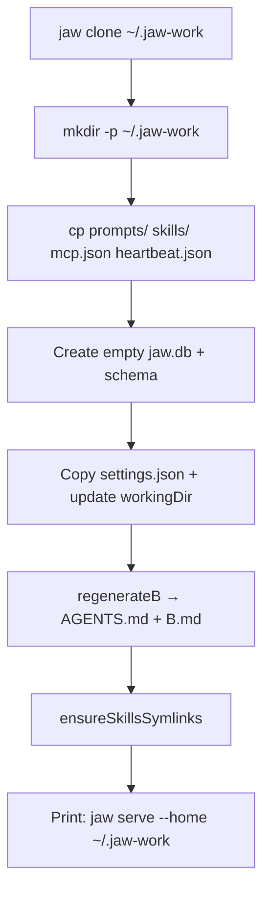
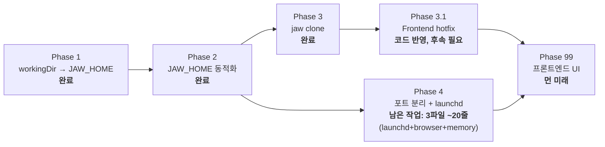

# Roadmap: Self-Contained Multi-Instance cli-jaw

## The Dream

```bash
# 기본 — 아무데서나 실행하면 ~/.cli-jaw 사용
jaw serve

# 특정 인스턴스 — 완전 독립된 에이전트
jaw serve --home ~/.jaw-work
jaw serve --home ~/.jaw-lab
```

각 인스턴스는 **완전 자급자족** (self-contained):
```
~/.jaw-work/                    ← 하나의 독립 에이전트 = 하나의 디렉토리
├── AGENTS.md                   ← 이 에이전트의 시스템 프롬프트
├── CLAUDE.md                   ← symlink → AGENTS.md
├── jaw.db                      ← 이 에이전트의 대화 기록
├── settings.json               ← 이 에이전트의 CLI/모델 설정
├── memory/MEMORY.md            ← 이 에이전트의 장기 메모리
├── prompts/                    ← 이 에이전트의 프롬프트
│   ├── A-1.md                  ← 코어 지시 (공유 가능)
│   ├── A-2.md                  ← 성격/설정 (인스턴스별 고유)
│   └── B.md                    ← 빌드된 전체 프롬프트
├── skills/                     ← 이 에이전트의 스킬셋
├── skills_ref/                 ← 레퍼런스 스킬
├── mcp.json                    ← 이 에이전트의 MCP 서버
├── heartbeat.json              ← 이 에이전트의 반복 작업
├── worklogs/                   ← 이 에이전트의 작업 로그
├── uploads/                    ← 이 에이전트의 미디어
├── .mcp.json                   ← Claude Code용 MCP (syncToAll)
└── .agents/skills/             ← symlink → ./skills/
```

---

## Why This Works

**핵심 통찰: JAW_HOME = workingDir**

현재는 JAW_HOME(데이터)과 workingDir(에이전트 cwd)이 분리되어 있는데,
이 둘을 합치면 모든 게 한 디렉토리에 모인다:

| 현재 | 목표 |
|------|------|
| JAW_HOME = `~/.cli-jaw` (하드코딩) | JAW_HOME = `--home` 인자 or env var |
| workingDir = `~/` (settings.json) | workingDir = JAW_HOME (자동) |
| AGENTS.md → workingDir | AGENTS.md → JAW_HOME (= workingDir) |
| 데이터와 에이전트 cwd 분리 | **하나의 디렉토리 = 하나의 에이전트** |

---

## Roadmap

### Phase 1: workingDir → JAW_HOME (이번 리팩토링) ✅ 스모크 테스트 완료

**목표**: workingDir 기본값을 `~/` → `~/.cli-jaw`로 변경
**효과**: AGENTS.md가 JAW_HOME 안으로 들어감 → 오염 방지 + 자급자족 구조의 첫 단추

변경: 4 파일, 5 줄
- `config.ts:101` — workingDir 기본값 → JAW_HOME
- `init.ts:46` — init 위자드 기본값
- `builder.ts:210` — A-2 템플릿 경로
- `postinstall.ts:166-167` — CLAUDE.md 심링크 경로

**Phase 1 이후 상태:**
```
~/.cli-jaw/  ← JAW_HOME = workingDir = 에이전트 cwd
├── AGENTS.md        ← 여기로 이동 (기존 ~/)
├── jaw.db
├── settings.json
├── memory/
├── prompts/
├── skills/
├── mcp.json
└── ...
```
이미 자급자족 구조! 단 JAW_HOME이 하드코딩이라 인스턴스 분리 불가.

---

### Phase 2: JAW_HOME 동적화 (env var + --home 플래그)

**목표**: JAW_HOME을 런타임에 지정 가능하게

> ⚠️ **REVIEW FIX (2026-02-26)**: 원래 "1 파일, 1 줄"이라 했으나 실제로는 
> **8개 파일이 JAW_HOME을 로컬로 재정의**하고 있음. Phase 2.0으로 먼저 중앙화 필요.

**Phase 2.0 — JAW_HOME 중앙화 (8 파일):**

다음 파일들이 `config.ts`에서 import하지 않고 로컬로 JAW_HOME을 정의:
- `bin/commands/doctor.ts:11`
- `bin/commands/init.ts:11`
- `bin/commands/mcp.ts:29`
- `bin/commands/browser.ts:13`
- `bin/commands/skill.ts:16`
- `lib/mcp-sync.ts:17`
- `bin/commands/launchd.ts:15` (LOG_DIR 경로에 하드코딩)
- `bin/postinstall.ts:28`

모두 `import { JAW_HOME } from '../../src/core/config.js'`로 교체.
단, `lib/mcp-sync.ts`와 `bin/postinstall.ts`는 `'../src/core/config.js'`로 (깊이가 다름).
상세 경로는 PHASE-2 문서의 Phase 2.0 테이블 참조.

**Phase 2.1 — env var (config.ts, 3줄):**
```typescript
// config.ts:27
// Before:
export const JAW_HOME = join(os.homedir(), '.cli-jaw');
// After:
export const JAW_HOME = process.env.CLI_JAW_HOME
    ? resolve(process.env.CLI_JAW_HOME.replace(/^~(?=\/|$)/, os.homedir()))
    : join(os.homedir(), '.cli-jaw');
```

**Phase 2.2 — CLI 플래그 (cli-jaw.ts):**
```typescript
// --home 플래그 파싱 → process.env.CLI_JAW_HOME 설정
// ⚠️ const command = process.argv[2] 보다 먼저 실행해야 함!
// Manual indexOf (NOT parseArgs — strict:false absorbs all subcommand flags)
const _homeIdx = process.argv.indexOf('--home');
const _homeEqArg = process.argv.find(a => a.startsWith('--home='));
if (_homeIdx !== -1 && process.argv[_homeIdx + 1]) {
    process.env.CLI_JAW_HOME = resolve(
        process.argv[_homeIdx + 1]!.replace(/^~(?=\/|$)/, homedir())
    );
    process.argv.splice(_homeIdx, 2);
} else if (_homeEqArg) {
    const val = _homeEqArg.slice('--home='.length);
    process.env.CLI_JAW_HOME = resolve(val.replace(/^~(?=\/|$)/, homedir()));
    process.argv.splice(process.argv.indexOf(_homeEqArg), 1);
}
// 이 다음에 const command = process.argv[2]; 위치
```

**Phase 2 이후:**
```bash
jaw serve                          # → ~/.cli-jaw (기본)
jaw serve --home ~/.jaw-work       # → ~/.jaw-work (독립)
CLI_JAW_HOME=~/.jaw-lab jaw serve  # → ~/.jaw-lab (독립)
```

**영향 범위**: Phase 2.0 이후, config.ts에서 JAW_HOME이 파생되는 모든 상수가 자동으로 따라감.
PROMPTS_DIR, DB_PATH, SKILLS_DIR 등 전부 JAW_HOME 기반.

**workingDir 처리**: settings.json의 workingDir 기본값이 JAW_HOME이므로,
새 인스턴스의 workingDir도 자동으로 해당 인스턴스 홈을 가리킴.

---

### Phase 3: `jaw clone` 명령어 ✅ 완료

**목표**: 기존 인스턴스를 복제해서 새 인스턴스 생성

```bash
jaw clone ~/.jaw-work              # ~/.cli-jaw → ~/.jaw-work 복제
jaw clone ~/.jaw-work --from ~/.jaw-lab  # 다른 소스에서 복제
```

**복제 대상:**
| 항목 | 복제? | 이유 |
|------|-------|------|
| prompts/ (A-1, A-2) | ✅ 복사 | 새 인스턴스의 성격 기반 |
| skills/, skills_ref/ | ✅ 복사 | 스킬셋 독립 |
| mcp.json | ✅ 복사 | MCP 서버 구성 독립 |
| heartbeat.json | ✅ 복사 | 반복 작업 독립 |
| settings.json | ✅ 복사 + workingDir 수정 | 새 경로 반영 |
| jaw.db | ❌ 새로 생성 | 대화 기록은 새로 시작 |
| memory/MEMORY.md | ⚙️ 옵션 | `--with-memory` 플래그로 선택 |
| worklogs/ | ❌ 빈 디렉토리 | 작업 로그는 새로 시작 |
| uploads/ | ❌ 빈 디렉토리 | 미디어는 새로 시작 |
| AGENTS.md, B.md | 🔄 재생성 | regenerateB()로 새로 빌드 |

**복제 flow:**


---

### Phase 3.1: 프론트엔드 hotfix ✅ 코드 반영 (후속 필요)

**완료된 것:**
- settings 패널 `workingDir` 입력값을 서버값으로 로드 (`value=""` + JS populate)
- 권한 토글 UI 제거, Auto 배지 고정

**남은 것 (3.1 follow-up):**
- `workingDir` 변경 시 서버에서 `regenerateB()/ensureSkillsSymlinks()/syncToAll()` 자동 수행
- 기존 `permissions: safe` 사용자 자동 정규화(또는 마이그레이션 안내)

---

### Phase 4: 포트 분리 + 동시 실행 🚧 진행 중

**목표**: 여러 인스턴스를 동시에 실행

```bash
jaw serve                          # port 3457 (기본)
jaw serve --home ~/.jaw-work --port 3458
jaw serve --home ~/.jaw-lab --port 3459
```

**이미 반영됨 (launchd core):**
- 인스턴스별 Label 해시 (`com.cli-jaw.<instance>-<hash>`)
- plist XML escaping (`xmlEsc`)
- ProgramArguments에 `--home <JAW_HOME> serve --port <PORT>` 전달

**남은 핵심:**
- `browser.ts` / `memory.ts` 서버 URL 하드코딩(`3457`) 제거
- launchctl 명령에서 plist path quoting 보강
- 미지원 플래그(`--dry-run`)는 install 실행 대신 명시 에러

**launchd 멀티 인스턴스:**
```bash
# NOTE: `jaw launchd`의 기본 동작이 install임 (별도 install 서브커맨드 없음)
jaw launchd                                          # com.cli-jaw.default (기본)
jaw --home ~/.jaw-work launchd                       # com.cli-jaw.jaw-work
jaw --home ~/.jaw-work launchd status                # 상태 확인
jaw --home ~/.jaw-work launchd unset                 # 해제
```

---

### Phase 99: 프론트엔드 인스턴스 관리 (미래)

**목표**: 웹 UI에서 인스턴스 목록 조회, 전환, 생성

먼 미래. Phase 1-4만 해도 핵심 꿈 완전 실현.

---

## 의존성 정리



**Phase 1 → 2는 필수 순서** (workingDir이 먼저 JAW_HOME 안으로 와야 자급자족)
**Phase 3과 Phase 4는 독립** (병렬 가능)
**Phase 3.1은 완료됐지만 운영 안정화를 위한 후속(3.1 follow-up) 필요**
**Phase 99는 3+4 이후 (먼 미래)**

---

## Dependency with Other Plans

### `260226_session_cleanup` (pipeline.ts Phase Range + Checkpoint)

**의존성: ❌ 없음 — 완전 독립.**

| | workdir refactor | session_cleanup |
|--|-----------------|-----------------|
| 대상 파일 | config.ts, init.ts, builder.ts, postinstall.ts, cli-jaw.ts, launchd.ts, clone.ts(new) | pipeline.ts |
| 파일 겹침 | 0 | 0 |
| 기능 영역 | 데이터 경로 / 인스턴스 분리 | 오케스트레이션 phase 제어 |
| 실행 순서 | 아무거나 먼저 | 아무거나 먼저 |

병렬 진행 안전.

---

## FAQ

### Q: `npm install -g`로 하나만 설치해도 되나?
**A:** 맞아. 바이너리는 하나, 데이터만 분리. Docker에서 같은 이미지로 여러 컨테이너 띄우는 것과 동일.

### Q: AGENTS.md는 어디에?
**A:** `{JAW_HOME}/AGENTS.md`. Phase 1 이후 workingDir = JAW_HOME이니까 자동으로 JAW_HOME 안에 생김.
멀티 인스턴스에서도 각 인스턴스의 JAW_HOME 안에 각자의 AGENTS.md가 생김.

### Q: 기존 사용자는?
**A:** Phase 1은 기본값만 변경 — 기존 settings.json의 workingDir이 우선됨.
Phase 2의 env var / --home은 완전 opt-in.

### Q: skills_ref (87개, ~3.5MB)를 매번 복사?
**A:** `jaw clone`에서 `--link-ref` 옵션으로 심링크 공유 가능 (복사 대신 symlink → 3.5MB 절약).
skills_ref는 읽기 전용이라 공유해도 안전.

### Q: `jaw launchd --dry-run` 지원하나?
**A:** 아직 미지원. 현재는 `launchd`, `launchd status`, `launchd unset`만 공식 동작으로 간주해야 함.

### Q: 동시 실행 시 SQLite 충돌?
**A:** 각 인스턴스가 별도 jaw.db 사용 → 충돌 없음.
