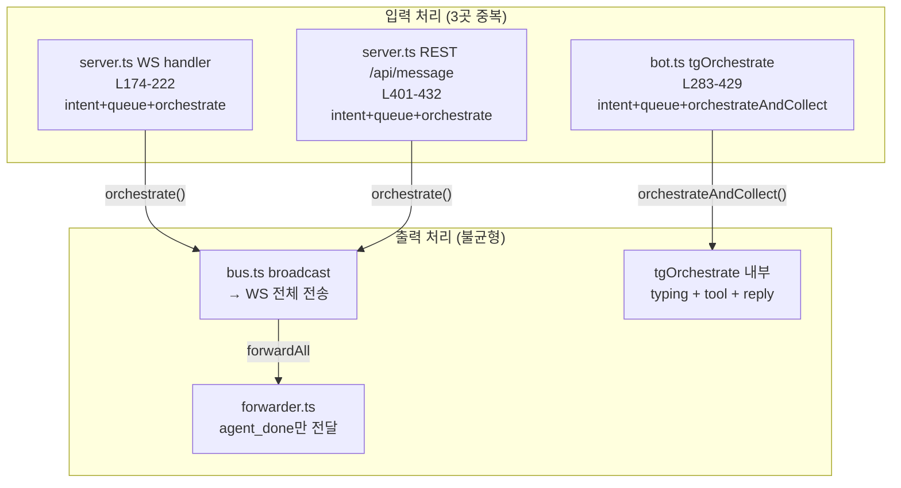

# Interface Unification: WebUI · CLI · Telegram 입력/출력 통합

## 메타
- Date: 2026-02-26
- Status: Phase 1 (계획검증 완료, 6건 수정 반영)
- 관련 파일: server.ts, src/telegram/bot.ts, src/telegram/forwarder.ts, bin/commands/chat.ts
- 리뷰: [REVIEW.md](file:///Users/junny/Documents/BlogProject/cli-jaw/devlog/260226_interface_unify/REVIEW.md)

---

## 0. 문제 정의

**메시지를 받아서 → 의도 판별 → 큐/실행 → orchestrate → 결과 전달** 패턴이:
- `server.ts` WS handler (L174-222)
- `server.ts` REST `/api/message` (L401-432)
- `bot.ts` `tgOrchestrate` (L283-429)

**3곳에 중복 구현**되어 있고, 각각 미묘하게 다름.

추가로 Telegram 출력 경로가 **2갈래**:
- 직접 입력 (`tgOrchestrate`): typing + tool status + HTML reply
- 다른 인터페이스에서 전달 (`forwarder.ts`): `agent_done` → 결과만 전달 (typing 없음)

→ **같은 orchestrate인데 입력 출처에 따라 UX가 완전히 다른 문제**

---

## 0.1 계획검증 결과 (6건 반영)

> 코드 대조 기반 검증 후 수정 반영. 상세: [REVIEW.md](file:///Users/junny/Documents/BlogProject/cli-jaw/devlog/260226_interface_unify/REVIEW.md)

| # | 심각도 | 지적사항 | 수정 |
|---|:---:|---------|------|
| 1 | 🔴 | `orchestrateAndCollect` 제거 시 `heartbeat.ts:47` 컴파일 깨짐 | **제거 → 공용 유틸 분리** (`collect.ts`) |
| 2 | 🔴 | `agent_tool/status`에 origin 필드 없음 → skip 불가 | **origin 대신 세션 상태 변수 기반 skip** |
| 3 | 🟠 | `getLastChatId`로 통합 시 ctx.chat.id 보장 상실 | **TG 직접 입력은 `tgOrchestrate` 유지** |
| 4 | 🟠 | busy 분기 insert + processQueue insert = 이중 저장 | **busy 분기에서 insert 안 함** |
| 5 | 🟡 | §6 Phase B vs §9.2 TG-004 모순 | **output handler = 타 인터페이스→TG 전달 전용** |
| 6 | 🟡 | `/api/orchestrate/*` 계약 변경 리스크 | **별도 유지, submitMessage 미포함** |

> ⚠️ **추가 발견**: TG bot은 **현재도 이중 저장 버그** 있음 (L288-289 enqueue+insert, processQueue:109 재insert). Phase A에서 함께 수정.

---

## 1. 현재 아키텍처 (흐름도)



---

## 2. 입력 처리 비교 (코드 수준 검증)

### 2.1 서버 WS 핸들러 — `server.ts:174-222`

```typescript
// L177-218 (41줄)
if (msg.type === 'send_message' && msg.text) {
    const text = String(msg.text).trim();
    if (isContinueIntent(text)) {          // intent 감지
        if (activeProcess) {               // busy 체크
            broadcast('agent_done', { text: t('ws.agentBusy', …), error: true });
        } else {
            insertMessage.run('user', text, 'cli', '');     // ← 소스: 'cli'
            broadcast('new_message', { … source: 'cli' });
            orchestrateContinue({ origin: 'cli' });
        }
        return;
    }
    if (isResetIntent(text)) { /* 동일 패턴 */ }
    if (activeProcess) {
        enqueueMessage(text, 'cli');       // 큐잉
    } else {
        insertMessage.run('user', text, 'cli', '');
        broadcast('new_message', { …, source: 'cli' });
        orchestrate(text, { origin: 'cli' });
    }
}
```

### 2.2 REST API — `server.ts:401-432`

```typescript
// L401-432 (31줄) — 거의 동일 패턴, HTTP 응답만 다름
app.post('/api/message', (req, res) => {
    if (isContinueIntent(trimmed)) {       // intent 감지
        if (activeProcess) return res.status(409)…;   // busy → HTTP 409
        orchestrateContinue({ origin: 'web' });
        return res.json({ ok: true, continued: true });
    }
    if (isResetIntent(trimmed)) { /* 동일 */ }
    if (activeProcess) {
        enqueueMessage(trimmed, 'web');    // 큐잉
        return res.json({ ok: true, queued: true });
    }
    insertMessage.run('user', trimmed, 'web', '');   // ← 소스: 'web'
    broadcast('new_message', { …, source: 'web' });
    orchestrate(trimmed, { origin: 'web' });
    res.json({ ok: true });
});
```

### 2.3 Telegram — `bot.ts:283-429`

```typescript
// L283-429 (146줄) — 같은 패턴 + TG 고유 출력 로직 포함
async function tgOrchestrate(ctx, prompt, displayMsg) {
    if (activeProcess) {                   // busy → TG 큐잉 (고유 handler 포함)
        enqueueMessage(prompt, 'telegram');
        insertMessage.run('user', displayMsg, 'telegram', '');  // ← 소스: 'telegram'
        …
        return;
    }
    markChatActive(ctx.chat.id);
    insertMessage.run('user', displayMsg, 'telegram', '');
    broadcast('new_message', { …, source: 'telegram' });

    // ─── TG 고유: typing + tool status (L315-391) ──
    await ctx.replyWithChatAction('typing');
    const typingInterval = setInterval(…, 4000);
    // tool handler: agent_tool → status message 편집
    // …

    // ─── TG 고유: orchestrateAndCollect ──
    const result = await orchestrateAndCollect(prompt, { origin: 'telegram' });
    // ← bus listener로 orchestrate_done까지 수집하는 Promise wrapper
    clearInterval(typingInterval);
    // HTML 변환 + reply
}
```

### 2.4 핵심 차이 정리

| 항목 | WS (server.ts) | REST (server.ts) | Telegram (bot.ts) |
|------|----------------|-------------------|---------------------|
| 줄 수 | 41줄 | 31줄 | **146줄** |
| intent 감지 | ✅ `isContinueIntent` + `isResetIntent` | ✅ 동일 | ⚠️ `isResetIntent` 별도 분기 (L451-462) |
| busy 응답 | `broadcast('agent_done', {error})` | `res.status(409)` | `ctx.reply(queued)` + queueHandler |
| source 태그 | `'cli'` | `'web'` | `'telegram'` |
| orchestrate 함수 | `orchestrate()` / `orchestrateContinue()` | 동일 | **`orchestrateAndCollect()`** (별도 함수) |
| 결과 수신 | bus → WS 자동 전달 | HTTP 응답 없음 (별도) | Promise로 직접 수집 |
| typing | 없음 (WebUI CSS 처리) | - | ✅ 4초 간격 `sendChatAction` |
| tool status | bus → WS → 프론트 | - | ✅ 메시지 편집 |

---

## 3. 출력 처리 비교

### 3.1 WebUI/CLI — bus → WebSocket

```text
orchestrate() → broadcast('agent_chunk/tool/done', …)
                    ↓
bus.ts L14-19: wss.clients.forEach(c => c.send(msg))
                    ↓
WebUI JS → DOM 업데이트 (typing indicator, tool badge, 스트리밍)
CLI chat.ts → process.stdout.write (스트리밍)
```

### 3.2 Telegram 직접 입력 — `tgOrchestrate` 내부

```text
tgOrchestrate (L315-428):
  1. sendChatAction('typing')     ← 4초마다 갱신 (L318-322)
  2. agent_tool → ctx.reply(🔄 …) → ctx.api.editMessageText(…) (L381-391)
  3. orchestrateAndCollect() 완료 → typing 정리 + HTML reply (L395-414)
```

### 3.3 다른 인터페이스 → Telegram — `forwarder.ts`

```text
forwarder.ts L82-104:
  type !== 'agent_done' → return   ← agent_done만 감지!
  data.origin === 'telegram' → skip
  bot.api.sendMessage(chatId, 📡 + html)
```

**문제**: forwarder는 `agent_done`만 감지하므로:
- ❌ typing 표시 없음
- ❌ tool 사용 표시 없음
- ❌ 에러 처리 없음

---

## 4. CommandContext 3벌 비교

| 메서드 | `makeWebCommandCtx` (server.ts:309) | `makeCliCommandCtx` (chat.ts:114) | `makeTelegramCommandCtx` (bot.ts:149) |
|--------|------|------|------|
| 구현 | 직접 호출 (같은 프로세스) | HTTP API 경유 | 직접 호출 (같은 프로세스) |
| getMcp | ✅ `loadUnifiedMcp()` | ✅ HTTP | ❌ `{ servers: {} }` |
| syncMcp | ✅ | ✅ HTTP | ❌ `{ results: {} }` |
| installMcp | ✅ | ✅ HTTP | ❌ `{ results: {} }` |
| resetEmployees | ✅ | ✅ HTTP | ❌ 없음 |
| resetSkills | ✅ | ✅ HTTP | ❌ 없음 |
| getBrowserStatus | ✅ `browser.getBrowserStatus()` | ✅ HTTP | ⚠️ try/catch 래핑 |
| getPrompt | ✅ `fs.readFileSync(A2_PATH)` | ✅ HTTP | ❌ 미지원 메시지 반환 |
| clearSession | ✅ `clearSessionState()` | ✅ HTTP | ⚠️ 직접 DB 호출 |

> `chat.ts`는 WS 클라이언트(다른 프로세스)이므로 HTTP 경유는 정상. 실제 문제는 **`makeWebCommandCtx`와 `makeTelegramCommandCtx`가 같은 프로세스인데 별도 구현 + 기능 격차**.

---

## 5. `orchestrateAndCollect` — TG 전용 함수 (bot.ts:35-80)

```typescript
// bot.ts L35-80 — broadcast listener로 결과를 Promise로 감쌈
function orchestrateAndCollect(prompt, meta) {
    return new Promise((resolve) => {
        let collected = '';
        const handler = (type, data) => {
            if (type === 'agent_output') collected += data.text;
            if (type === 'orchestrate_done') {
                if (data.origin !== meta.origin) return;   // origin 필터
                removeBroadcastListener(handler);
                resolve(data.text || collected || '응답 없음');
            }
        };
        addBroadcastListener(handler);
        orchestrate(prompt, meta);  // 또는 orchestrateContinue/Reset
    });
}
```

이 함수가 존재하는 이유: **Telegram은 결과를 `ctx.reply()`로 보내야 하므로** orchestrate 완료 시점을 알아야 함. WebUI/CLI는 bus → WS 자동 전달이라 필요 없음.

→ 통합 시 이 함수 대신 **bus listener 기반 TG output handler**가 `orchestrate_done`을 감지하면 됨.

---

## 6. 통합 제안

### Phase A — 입력 통합: `submitMessage()` Gateway

> ⚠️ 리뷰 반영: busy 분기에서 `insertMessage` 호출하지 않음 (processQueue가 처리)
> ⚠️ 리뷰 반영: `/api/orchestrate/continue|reset`은 별도 유지

```typescript
// src/orchestrator/gateway.ts [NEW]

export function submitMessage(text: string, meta: {
    origin: 'web' | 'cli' | 'telegram';
    displayText?: string;
}): { action: 'queued' | 'started' | 'rejected'; reason?: string; pending?: number } {
    const trimmed = text.trim();
    if (!trimmed) return { action: 'rejected', reason: 'empty' };

    // Intent detection — idle 상태에서만 처리
    if (isContinueIntent(trimmed)) {
        if (activeProcess) return { action: 'rejected', reason: 'busy' };
        insertMessage.run('user', meta.displayText || trimmed, meta.origin, '');
        broadcast('new_message', { role: 'user', content: meta.displayText || trimmed, source: meta.origin });
        orchestrateContinue({ origin: meta.origin });
        return { action: 'started' };
    }
    if (isResetIntent(trimmed)) {
        if (activeProcess) return { action: 'rejected', reason: 'busy' };
        insertMessage.run('user', meta.displayText || trimmed, meta.origin, '');
        broadcast('new_message', { role: 'user', content: meta.displayText || trimmed, source: meta.origin });
        orchestrateReset({ origin: meta.origin });
        return { action: 'started' };
    }

    // Busy → enqueue만 (insert는 processQueue()에서 수행)
    if (activeProcess) {
        enqueueMessage(trimmed, meta.origin);
        // ❌ insertMessage 호출하지 않음! processQueue():109에서 처리
        return { action: 'queued', pending: messageQueue.length };
    }

    // Idle → 즉시 실행
    insertMessage.run('user', meta.displayText || trimmed, meta.origin, '');
    broadcast('new_message', { role: 'user', content: meta.displayText || trimmed, source: meta.origin });
    orchestrate(trimmed, { origin: meta.origin });
    return { action: 'started' };
}
```

### 호출 측 변경

```diff
 // server.ts WS handler — 41줄 → 8줄
 if (msg.type === 'send_message' && msg.text) {
-    // 41줄의 intent/queue/orchestrate 로직
+    const result = submitMessage(msg.text, { origin: 'cli' });
+    if (result.action === 'rejected' && result.reason === 'busy') {
+        broadcast('agent_done', { text: t('ws.agentBusy', …), error: true });
+    }
 }

 // server.ts REST /api/message — 31줄 → 4줄
 app.post('/api/message', (req, res) => {
-    // 31줄의 intent/queue/orchestrate 로직
+    const result = submitMessage(req.body.prompt, { origin: 'web' });
+    res.json({ ok: true, ...result });
 });

 // bot.ts tgOrchestrate — 입력 부분만 교체
 async function tgOrchestrate(ctx, prompt, displayMsg) {
-    if (activeProcess) { enqueueMessage(…); … }
-    markChatActive(ctx.chat.id);
-    insertMessage.run(…);
-    broadcast(…);
+    markChatActive(ctx.chat.id);
+    const result = submitMessage(prompt, { origin: 'telegram', displayText: displayMsg });
     // TG 고유 출력 로직은 유지 (typing, tool, reply)
 }
```

### Phase B — TG 출력 통합: `createTelegramOutputHandler` (타 인터페이스 → TG 전달용)

> ⚠️ 리뷰 반영: **TG 직접 입력은 기존 `tgOrchestrate` → `ctx.reply()` 유지**.
> output handler는 **WebUI/CLI → TG 전달**에만 사용.
> `orchestrateAndCollect()`는 **제거 대신 `collect.ts`로 분리**.

기존 `forwarder.ts`의 `createTelegramForwarder`를 확장하여 **중간 이벤트 감지 + typing + tool 표시** 추가:

```diff
 // forwarder.ts
-export function createTelegramForwarder(…) {
+export function createTelegramOutputHandler(…) {
+    let typingInterval: any = null;
+    let tgDirectActive = false;  // TG 직접 입력 중이면 skip
+
     return (type, data) => {
-        if (type !== 'agent_done' || !data?.text) return;
+        // TG 직접 입력 세션 감지 (origin 기반 — orchestrate_done에만 있음)
+        if (type === 'orchestrate_done' && data.origin === 'telegram') return;
+        // tgDirectActive 세션 상태로 중간 이벤트도 skip
+        if (tgDirectActive) return;
+
+        const chatId = getLastChatId();
+        if (!chatId) return;
+
+        // typing 시작/갱신
+        if (type === 'agent_status' && data.status === 'running') {
+            if (!typingInterval) {
+                bot.api.sendChatAction(chatId, 'typing').catch(() => {});
+                typingInterval = setInterval(() => {
+                    bot.api.sendChatAction(chatId, 'typing').catch(() => {});
+                }, 4000);
+            }
+        }
+        // tool 표시
+        if (type === 'agent_tool' && data.icon && data.label) {
+            // tool status 메시지 (debounced)
+        }
+        // 완료 → typing 정리 + 결과 전달
+        if (type === 'orchestrate_done' && data.text) {
+            if (typingInterval) { clearInterval(typingInterval); typingInterval = null; }
+            const html = markdownToTelegramHtml(data.text);
+            const chunks = chunkTelegramMessage(html);
+            for (const chunk of chunks) { /* 기존 전달 로직 */ }
+        }
     };
 }
```

이렇게 하면:
- TG 직접 입력: **기존 `tgOrchestrate` 경로 유지** (ctx.chat.id 보장)
- 다른 인터페이스 → TG: **typing + tool + 결과 전달** (현재 agent_done만 → 개선)
- `orchestrateAndCollect()`: **`src/orchestrator/collect.ts`로 분리** (heartbeat.ts도 사용)

---

## 7. 변경 파일 요약 (리뷰 수정 반영)

| 파일 | 변경 | 라인 변경 (추정) |
|------|------|:---:|
| [NEW] `src/orchestrator/gateway.ts` | `submitMessage()` 함수 | +30 |
| [NEW] `src/orchestrator/collect.ts` | `orchestrateAndCollect` 분리 | +50 (이동) |
| `server.ts` L174-222 | WS handler → `submitMessage()` | -33 |
| `server.ts` L401-452 | REST handler → `submitMessage()` | -27 |
| `server.ts` L454-468 | `/api/orchestrate/*` — **별도 유지** | 0 |
| `bot.ts` L35-80 | `orchestrateAndCollect()` → `collect.ts`로 이동 | -45 (이동) |
| `bot.ts` L283-429 | `tgOrchestrate` 입력만 `submitMessage()` 교체 (출력 유지) | -30 |
| `bot.ts` L288-289 | **기존 이중 저장 버그 수정** (enqueue 시 insert 제거) | -2 |
| `forwarder.ts` L75-105 | `createTelegramOutputHandler`로 확장 (타 IF → TG) | +40 |
| `heartbeat.ts` L5 | import 경로 변경 (`bot.js` → `collect.js`) | ~1 |
| **순 감소** | | **~46줄** (이동 제외) |

---

## 8. CommandContext 통합 (Phase C, 선택적)

`makeWebCommandCtx`와 `makeTelegramCommandCtx`를 **하나의 팩토리 함수**로 병합. TG에서 누락된 기능(MCP, browser, resetEmployees 등)을 활성화할지 정책만 결정하면 됨.

```typescript
// src/command-contract/factory.ts [NEW]
export function makeCommandCtx(iface: 'web' | 'telegram' | 'cli', …) {
    return {
        interface: iface,
        getSession, getSettings,
        getMcp: () => loadUnifiedMcp(),     // TG에서도 활성화
        syncMcp: () => syncToAll(…),
        // … 공통 메서드
        // TG 제한: updateSettings에서 fallbackOrder만 허용 (정책)
        updateSettings: iface === 'telegram'
            ? (patch) => { /* fallbackOrder만 */ }
            : (patch) => applySettingsPatch(patch, { restartTelegram: true }),
    };
}
```

---

## 9. 테스트 계획

### 9.1 기존 테스트 (통과 필수)

```bash
npx vitest run
```

관련 테스트:
- `tests/unit/bus.test.ts` — broadcast 동작
- `tests/telegram-forwarding.test.ts` — forwarder 로직
- `tests/events.test.ts` — 이벤트 흐름
- `tests/integration/api-smoke.test.ts` — REST API

### 9.2 신규 테스트

```
# submitMessage() 단위 테스트
SM-001: empty text → { action: 'rejected', reason: 'empty' }
SM-002: continue intent + !busy → { action: 'started' } + orchestrateContinue 호출
SM-003: continue intent + busy → { action: 'rejected', reason: 'busy' }
SM-004: reset intent + !busy → { action: 'started' } + orchestrateReset 호출
SM-005: normal text + !busy → { action: 'started' } + orchestrate 호출
SM-006: normal text + busy → { action: 'queued' } + enqueueMessage 호출
SM-007: TG displayText → insertMessage에 displayText 저장

# TG output handler 테스트
TG-001: agent_status running → sendChatAction('typing') 호출
TG-002: agent_tool → 상태 메시지 생성
TG-003: orchestrate_done → typing 정리 + 결과 sendMessage
TG-004: origin 'telegram' → shouldSkip 동작 (직접 입력은 tgOrchestrate가 처리)
TG-005: origin 'web' → forwarder가 typing + 결과 전달
```

### 9.3 수동 검증

1. WebUI에서 메시지 → 정상 응답 확인
2. Telegram에서 메시지 → typing + tool + 응답 확인
3. **WebUI 메시지 → Telegram에서 typing 표시 + 결과 도착** (핵심)
4. busy 중 큐잉 → 모든 인터페이스에서 동작 확인
5. continue/reset intent → 모든 인터페이스에서 동일 동작

---

## 10. 실행 순서

| 단계 | 내용 | 위험도 |
|------|------|:---:|
| **Phase A** | `gateway.ts` 생성 + server.ts/bot.ts 호출 교체 | 낮음 |
| **Phase B** | forwarder 확장 + tgOrchestrate 출력 분리 | 중간 |
| **Phase C** | CommandContext 통합 (선택) | 낮음 |

> Phase A만으로도 입력 로직 중복 제거(-74줄). Phase B까지 하면 TG UX 균일화 달성.

---

## Appendix A — 외부 검증 (Web / grammY Docs)

### A.1 `bot.api.sendChatAction` — ctx 없이 호출 가능 ✅

**grammY 공식 문서 확인** ([grammy.dev/ref/core/api#sendChatAction](https://grammy.dev/ref/core/api#sendChatAction)):

```typescript
// 시그니처
sendChatAction(
    chat_id: number | string,
    action: "typing" | "upload_photo" | ...,
    other?: Other<R, "sendChatAction", "chat_id" | "action">,
    signal?: AbortSignal
);
```

> "Use this method when you need to tell the user that something is happening on the bot's side. The status is set for **5 seconds or less** (when a message arrives from your bot, Telegram clients clear its typing status)."

**핵심 확인**:
- `bot.api.sendChatAction(chatId, 'typing')` → **ctx 없이 chatId만으로 호출 가능**
- 현재 forwarder에서 `bot` 객체는 이미 보유 중 (`createTelegramForwarder({ bot, ... })`)
- → Phase B 구현에 **API 제약 없음**

### A.2 Typing 타이밍 — 현재 구현 정확

| 항목 | Telegram API 사양 | 현재 코드 (bot.ts) |
|------|:---:|:---:|
| typing 만료 시간 | **5초** | - |
| 갱신 간격 | 3-5초 권장 | **4초** ✅ |
| 메시지 도착 시 | 자동 해제됨 | clearInterval ✅ |

### A.3 grammY `autoChatAction` 플러그인 — 사용 불가

grammY에는 `autoChatAction` 플러그인이 존재하지만:
- **미들웨어 체인 안에서만 동작** (`ctx.chatAction = "typing"`)
- forwarder는 미들웨어 외부 (broadcast listener)에서 동작
- → **수동 `setInterval` + `bot.api.sendChatAction` 방식 유지가 정확**

### A.4 `sequentialize` 미들웨어 — bot.api 외부 호출에 적용 안 됨

grammY `sequentialize` ([grammy.dev/plugins/runner](https://grammy.dev/plugins/runner)):
- **incoming update 처리 순서만 보장** (chat_id 기준)
- `bot.api.*` 호출 자체는 sequentialize 범위 밖
- → forwarder에서 `bot.api.sendChatAction()` 직접 호출해도 **lock 충돌 없음**

### A.5 다중 채팅 — per-chat typing 상태 관리 필요 ⚠️

**엣지 케이스**: `telegramActiveChatIds`에 채팅 2개+ 등록된 상태에서 WebUI 메시지 발생

| 시나리오 | 현재 동작 | 통합 후 예상 |
|----------|-----------|-------------|
| 1개 채팅 활성 | forwarder → agent_done → 결과 전달 | ✅ typing + 결과 전달 |
| 2개 채팅 활성 | forwarder → 마지막 chatId만 | ⚠️ 두 채팅 모두 typing? |

**해결**: `getLastChatId()` (현재 forwarder 방식) 유지 — 마지막 활성 채팅에만 전달. 동시 다중 채팅 지원은 별도 이슈.

### A.6 이벤트 구분: `agent_done` vs `orchestrate_done`

현재 forwarder가 듣는 이벤트와 통합 후 이벤트 차이:

| 이벤트 | 언제 발생 | 횟수 | 데이터 |
|--------|-----------|:---:|--------|
| `agent_status` | agent 시작 시 | N회 (agent 수) | `{ status: 'running', agentId }` |
| `agent_tool` | tool 호출 시 | 0~N회 | `{ icon, label }` |
| `agent_chunk` | 스트리밍 중 | 0~N회 | `{ text }` |
| `agent_done` | **개별 agent** 완료 | N회 | `{ text, error? }` |
| `orchestrate_done` | **전체 오케스트레이션** 완료 | **1회** | `{ text, origin, worklog? }` |

**현재 forwarder**: `agent_done` 감지 → multi-agent 시 **여러 번 전달** (각 agent마다)
**통합 후**: `orchestrate_done` 감지 → **1번만 최종 결과 전달** ← 더 정확!

> ⚠️ **중요**: typing은 `agent_status` (running)에서 시작, `orchestrate_done`에서 정리. `agent_done`은 중간 agent 완료이므로 typing을 해제하면 안 됨.

### A.7 Rate Limiting — 문제 없음

Telegram Bot API 제한:
- 단일 채팅: 메시지당 1/s
- 벌크: ~30 req/s

현재 간격:
- typing: 4초 간격 (0.25 req/s) ← **매우 여유**
- tool status: 180ms debounce → 최대 5.5 req/s ← **안전**

### A.8 위험 요소 정리

| 위험 | 확률 | 영향 | 대응 |
|------|:---:|:---:|------|
| Phase A: submitMessage 누락 분기 | 낮음 | 높음 | 기존 테스트 + SM-001~007로 커버 |
| Phase B: typing 정리 누락 (leak) | 중간 | 낮음 | `orchestrate_done` + 타임아웃 이중 안전장치 |
| Phase B: 다중 agent_done → 중복 결과 전달 | 낮음 | 중간 | `orchestrate_done` 1회만 감지로 해결 |
| Phase B: forwarder 교체 시 기존 테스트 깨짐 | 중간 | 중간 | `telegram-forwarding.test.ts` 업데이트 |
