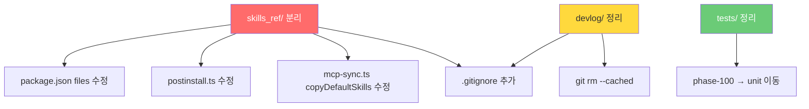

# 260226: Repository Hygiene — skills_ref 분리 + 레포 정리

> 시니어 코드 리뷰 피드백 대응  
> **Status**: 📋 Plan → **구현 대기 (우선순위 3번)**  
> **구현 순서**: ① interface_unify → ② safe_install → **③ repo_hygiene**  
> **선행 조건**: safe_install 완료 후 postinstall.ts 반영 합치

## 목표

1. `skills_ref/`를 별도 GitHub 레포로 분리하고, 출처 명시
2. 메인 레포에서 `skills_ref/`을 git submodule로 참조하되, `.gitignore`로 제외
3. `npm install` 시 `postinstall`에서 `git clone`으로 자동 pull
4. `devlog/`, 바이너리 에셋 정리, 테스트 구조 개선

---

## 현재 상태

> [!IMPORTANT]
> **미반영 항목**: `skills_ref/`가 여전히 publish 대상이고, `.gitignore`에 `devlog/`, `skills_ref/`가 없음.

| 항목                              | 상태                | 현재 코드 위치 |
| --------------------------------- | ------------------- | -------------- |
| `skills_ref/` npm 번들            | ❌ `package.json:36` `files` 배열에 포함   | **13MB** |
| `skills_ref/` 스크립트 참조        | ❌ `package.json:40` `scripts.postinstall`  | — |
| `.gitignore`                      | ❌ `devlog/`, `skills_ref/` 미등록   | `.gitignore:1` |
| `tests/phase-100/`                | ❌ 테스트 1개만 존재 (`employee-session-reuse.test.ts`) | — |
| `canvas-fonts/`                   | `.ttf` 54개        | 5.5MB          |
| `docx/scripts/office/schemas/`    | `.xsd` 39개        | 1.0MB          |
| `devlog/`                         | 소스 트리에 포함    | 2.3MB (255 파일) |

## Phase 1: `skills_ref/` 별도 레포 분리

### 1.1 새 GitHub 레포 생성

- 레포명: `cli-jaw-skills` (또는 `jaw-skills`)
- 현재 `skills_ref/` 내용 그대로 초기 커밋
- `README.md`에 출처 명시:
  - 원본 Codex 스킬: [openai/codex](https://github.com/openai/codex) 출처
  - OpenClaw 커스텀 스킬: bitkyc08-arch 자체 제작
  - 각 스킬 디렉토리에 `LICENSE` / 출처 표기

### 1.2 메인 레포에서 submodule 설정

```bash
# 기존 skills_ref/ 백업 후 삭제
mv skills_ref skills_ref.bak

# submodule로 추가 (개발용)
git submodule add https://github.com/bitkyc08-arch/cli-jaw-skills.git skills_ref

# .gitignore에 skills_ref 추가 (npm publish에서 제외)
echo "skills_ref/" >> .gitignore
```

> ⚠️ submodule과 .gitignore 동시 사용 시, `.gitmodules` 파일은 추적되지만 `skills_ref/` 디렉토리 자체는 무시됨. 개발자는 `git submodule update --init`으로 pull.

### 1.3 `package.json` 수정

```diff
 "files": [
     "dist/",
     "public/",
     "package.json",
-    "skills_ref/"
 ],
```

- `skills_ref/`을 npm 패키지에서 완전 제외
- 패키지 사이즈: **13MB 절감**

### 1.4 `postinstall.ts` 수정

현재 흐름:
```
npm install → postinstall → copyDefaultSkills()
                            → findPackageRoot()/skills_ref/ → ~/.cli-jaw/skills_ref/
```

변경 후:
```
npm install → postinstall → cloneSkillsRepo()
                            → git clone → ~/.cli-jaw/skills_ref/
```

#### 수정할 코드

**`bin/postinstall.ts`** — 새로운 스킬 clone 단계 추가:

```typescript
// 6b. Clone skills_ref repo (instead of bundled copy)
const SKILLS_REPO = 'https://github.com/bitkyc08-arch/cli-jaw-skills.git';
const skillsRefTarget = path.join(jawHome, 'skills_ref');

if (!fs.existsSync(skillsRefTarget)) {
    console.log(`[jaw:init] 📦 cloning skills repo...`);
    try {
        execSync(`git clone --depth 1 ${SKILLS_REPO} ${skillsRefTarget}`, {
            stdio: 'pipe',
            timeout: 120000,
        });
        console.log(`[jaw:init] ✅ skills_ref cloned`);
    } catch (e: any) {
        console.error(`[jaw:init] ⚠️ skills clone failed: ${e?.message?.slice(0, 100)}`);
        console.error(`[jaw:init]    manual: git clone ${SKILLS_REPO} ${skillsRefTarget}`);
    }
} else {
    // Update existing
    console.log(`[jaw:init] ⏭️ skills_ref exists, pulling latest...`);
    try {
        execSync('git pull --ff-only', {
            cwd: skillsRefTarget,
            stdio: 'pipe',
            timeout: 30000,
        });
    } catch {
        console.log(`[jaw:init] ⚠️ skills pull failed (offline?), using cached`);
    }
}
```

**`lib/mcp-sync.ts`** — `copyDefaultSkills()` 수정 (L589-607):

```diff
-    // ─── 2. Bundled skills_ref/ → ~/.cli-jaw/skills_ref/ ───
-    const packageRefDir = join(findPackageRoot(), 'skills_ref');
-    if (fs.existsSync(packageRefDir)) {
-        const entries = fs.readdirSync(packageRefDir, { withFileTypes: true });
-        ...
-    }
+    // ─── 2. skills_ref is now cloned directly to ~/.cli-jaw/skills_ref/ ───
+    // No bundled copy needed — postinstall.ts handles git clone
+    // Only copy registry.json if bundled version exists (offline fallback)
+    const packageRefDir = join(findPackageRoot(), 'skills_ref');
+    const bundledRegistry = join(packageRefDir, 'registry.json');
+    if (fs.existsSync(bundledRegistry)) {
+        const dst = join(refDir, 'registry.json');
+        if (!fs.existsSync(dst)) {
+            fs.copyFileSync(bundledRegistry, dst);
+            console.log(`[skills] fallback: bundled registry.json copied`);
+        }
+    }
```

## Phase 2: 레포 정리

### 2.1 `devlog/` 처리

- `.gitignore`에 `devlog/` 추가
- git에서 추적 해제: `git rm -r --cached devlog/`
- `devlog/`는 로컬에 유지 (삭제하지 않음)
- 히스토리 정리(`git filter-branch`)는 별도 작업

### 2.2 바이너리 에셋 정리

`skills_ref/` 분리 후 자동으로 해결됨. 별도 조치 불필요.

### 2.3 `tests/phase-100/` 정리

```bash
# 테스트 파일 이동
mv tests/phase-100/employee-session-reuse.test.ts tests/unit/
rmdir tests/phase-100
```

### 2.4 `.gitignore` 강화

```gitignore
# Existing
node_modules/
*.db
*.db-shm
*.db-wal
settings.json
.DS_Store
.env
.artifacts/
public/dist/
dist/

# New: Phase 260226
devlog/
skills_ref/
```

## Phase 3: 프론트엔드 TS 마이그레이션 (다음 스프린트)

- 별도 문서로 분리: `docs/frontend-ts-migration.md`
- 이번 작업 범위 밖

---

## 실행 순서 (체크리스트)

- [ ] `cli-jaw-skills` GitHub 레포 생성
- [ ] `skills_ref/` 내용 + 출처 README push
- [ ] 메인 레포: `skills_ref/` gitignore + git rm --cached
- [ ] `package.json` `files` 에서 `skills_ref/` 제거
- [ ] `postinstall.ts` — git clone 로직 추가
- [ ] `lib/mcp-sync.ts` — bundled copy 로직 제거
- [ ] `devlog/` gitignore + git rm --cached
- [ ] `tests/phase-100/` → `tests/unit/` 이동
- [ ] `.gitignore` 업데이트
- [ ] 테스트 통과 확인 (`npm test`, `npm run typecheck`)
- [ ] PR 분리: (1) skills_ref 분리 (2) devlog/test 정리

---

## 영향 범위



## 수정 대상 파일 요약

| 파일                 | 변경 내용                          |
| -------------------- | ---------------------------------- |
| `bin/postinstall.ts` | git clone 로직 추가                |
| `lib/mcp-sync.ts`    | bundled copy → clone 의존으로 변경 |
| `package.json`       | `files`에서 `skills_ref/` 제거     |
| `.gitignore`         | `devlog/`, `skills_ref/` 추가      |
| `tests/unit/`        | `phase-100/` 에서 파일 이동        |
