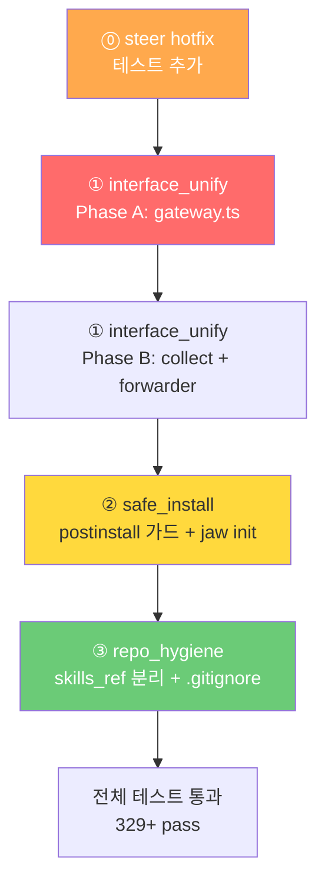

# 260226 Refactor All — 통합 구현 계획

**Date**: 2026-02-26  
**Baseline**: tests 329 / pass 328 / fail 0 / skipped 1

---

## 구현 순서 + 현재 상태

| # | 항목 | 심각도 | 상태 | 핵심 변경 | 상세 |
|:---:|------|:---:|:---:|-----------|------|
| **⓪** | steer_interrupted | 🟠 | **✅ 완료** | 회귀 테스트 15/15 pass | [상세](file:///Users/junny/Documents/BlogProject/cli-jaw/devlog/260226_refactor_all/260226_steer_interrupted/HOTFIX.md) |
| **①** | interface_unify | 🔴 | 계획 완료 | submitMessage 게이트웨이, TG 중복 insert 제거 | [상세](file:///Users/junny/Documents/BlogProject/cli-jaw/devlog/260226_refactor_all/260226_interface_unify/PLAN.md) |
| **②** | safe_install | 🔴 | 계획 완료 | postinstall safe 가드, `jaw init --safe` | [상세](file:///Users/junny/Documents/BlogProject/cli-jaw/devlog/260226_refactor_all/260226_safe_install/PLAN.md) |
| **③** | repo_hygiene | 🟡 | 계획 완료 | skills_ref 분리, .gitignore, tests 정리 | [상세](file:///Users/junny/Documents/BlogProject/cli-jaw/devlog/260226_refactor_all/260226_repo_hygiene/PLAN.md) |

> [!NOTE]
> ⓪ steer_interrupted는 코드 반영 완료 상태. 테스트만 추가하면 되므로 가장 먼저 처리.

---

## ⓪ steer_interrupted hotfix — 회귀 테스트

> 상세: [260226_steer_interrupted/HOTFIX.md](file:///Users/junny/Documents/BlogProject/cli-jaw/devlog/260226_refactor_all/260226_steer_interrupted/HOTFIX.md)

### 배경

코드 구현 완료 (`spawn.ts` L40,393,424-428,545,581-586). 테스트 **15/15 pass** ✅.

### [NEW] `tests/unit/steer-interrupted.test.ts`

| ID | 케이스 |
|---:|--------|
| SI-001 | `killActiveAgent('steer')` → killReason 'steer' 설정 |
| SI-002 | `killActiveAgent('user')` → killReason 'user' 설정 |
| SI-003 | ACP exit (wasSteer+fullText) → `⏹️ [interrupted]` 접두사 |
| SI-004 | ACP exit (wasSteer+trace) → trace에도 접두사 |
| SI-005 | ACP exit (wasSteer, fullText 없음) → fallback 안 함 |
| SI-006 | Standard CLI close (wasSteer) → interrupted 태깅 |
| SI-007 | killReason 소비 확인 (exit 후 null) |

### [NEW] `tests/unit/steer-flow.test.ts`

| ID | 케이스 |
|---:|--------|
| SF-001 | steerAgent() → 기존 agent 종료 대기 + 새 agent 시작 |
| SF-002 | steerAgent() 후 DB → interrupted 메시지 저장됨 |
| SF-003 | buildHistoryBlock() → interrupted 포함 |

---

## ① interface_unify — submitMessage 게이트웨이 + TG 출력 통합

> 상세: [260226_interface_unify/PLAN.md](file:///Users/junny/Documents/BlogProject/cli-jaw/devlog/260226_refactor_all/260226_interface_unify/PLAN.md) · [REVIEW.md](file:///Users/junny/Documents/BlogProject/cli-jaw/devlog/260226_refactor_all/260226_interface_unify/REVIEW.md)

### 배경

메시지 입력/의도판별/큐잉/orchestrate가 **3곳에 중복** 구현 (server.ts WS 41줄, REST 31줄, bot.ts 146줄).
TG busy 경로에서 `insertMessage` + `processQueue` 내 `insertMessage` = **user 메시지 이중 저장 버그**.

### Phase A — 입력 통합

#### [NEW] `src/orchestrator/gateway.ts`

```typescript
export function submitMessage(text: string, meta: {
    origin: 'web' | 'cli' | 'telegram';
    displayText?: string;
}): { action: 'queued' | 'started' | 'rejected'; reason?: string; pending?: number } {
    const trimmed = text.trim();
    if (!trimmed) return { action: 'rejected', reason: 'empty' };

    // Intent: idle에서만 처리
    if (isContinueIntent(trimmed)) {
        if (activeProcess) return { action: 'rejected', reason: 'busy' };
        insertMessage.run('user', meta.displayText || trimmed, meta.origin, '');
        broadcast('new_message', { role: 'user', content: meta.displayText || trimmed, source: meta.origin });
        orchestrateContinue({ origin: meta.origin });
        return { action: 'started' };
    }
    if (isResetIntent(trimmed)) { /* 동일 패턴 */ }

    // Busy → enqueue만 (insert는 processQueue에서 수행 → 이중 저장 해결)
    if (activeProcess) {
        enqueueMessage(trimmed, meta.origin);
        return { action: 'queued', pending: messageQueue.length };
    }

    // Idle → 즉시 실행
    insertMessage.run('user', meta.displayText || trimmed, meta.origin, '');
    broadcast('new_message', { ... });
    orchestrate(trimmed, { origin: meta.origin });
    return { action: 'started' };
}
```

#### [MODIFY] `server.ts` L174-222 (WS handler)

```diff
 if (msg.type === 'send_message' && msg.text) {
-    // 41줄의 intent/queue/orchestrate 로직
+    const result = submitMessage(msg.text, { origin: 'cli' });
+    if (result.action === 'rejected' && result.reason === 'busy') {
+        broadcast('agent_done', { text: t('ws.agentBusy', …), error: true });
+    }
 }
```

#### [MODIFY] `server.ts` L401-432 (REST)

```diff
 app.post('/api/message', (req, res) => {
-    // 31줄 → submitMessage
+    const result = submitMessage(req.body.prompt, { origin: 'web' });
+    res.json({ ok: true, ...result });
 });
```

#### [MODIFY] `bot.ts` L284-308 (TG busy 분기)

```diff
 if (activeProcess) {
     enqueueMessage(prompt, 'telegram');
-    insertMessage.run('user', displayMsg, 'telegram', '');  // ← 이중 저장 제거
     broadcast('new_message', { ... });
     await ctx.reply(queued);
```

또는 전체를 `submitMessage` 호출로 교체:

```diff
+    const result = submitMessage(prompt, { origin: 'telegram', displayText: displayMsg });
+    if (result.action !== 'started') return;  // queued/rejected 시 TG 출력 로직 스킵
```

> [!WARNING]
> **리뷰 피드백 🔴**: `submitMessage()` 결과가 `queued`여도 계속 TG 출력 로직으로 내려가는 분기 누락 주의.
> `tgOrchestrate`에서 `submitMessage` 호출 후 **반드시 `result.action` 기준 early return** 필요.

#### [MODIFY] `server.ts` L454-468

`/api/orchestrate/continue|reset` — **별도 유지** (submitMessage에 포함하지 않음).

### Phase B — TG 출력 개선 + orchestrateAndCollect 분리

#### [NEW] `src/orchestrator/collect.ts`

`orchestrateAndCollect`를 `bot.ts:35-80`에서 분리. heartbeat.ts가 import하므로 제거 불가.

```typescript
// bot.ts에서 이동 — broadcast listener로 orchestrate 결과를 Promise 수집
export function orchestrateAndCollect(prompt, meta) { ... }
```

> [!NOTE]
> **리뷰 피드백 🟡**: `orchestrateAndCollect` 내부에서 `agent_output` 이벤트를 수집하는 분기가 있으나,
> 현재 broadcast 경로에 `agent_output` 이벤트가 없음 (dead branch). `collect.ts` 분리 시 함께 정리.

#### [MODIFY] `bot.ts` L35-80

`orchestrateAndCollect` 함수 본체 제거 → `collect.ts`에서 re-export.

#### [MODIFY] `heartbeat.ts` L5

```diff
-import { orchestrateAndCollect, ... } from '../telegram/bot.js';
+import { orchestrateAndCollect } from '../orchestrator/collect.js';
+import { markdownToTelegramHtml, chunkTelegramMessage, telegramBot, telegramActiveChatIds } from '../telegram/bot.js';
```

#### [MODIFY] `forwarder.ts` L75-105

`createTelegramForwarder` → `createTelegramOutputHandler`로 확장:
- 기존: `agent_done`만 감지
- 변경: `agent_status` → typing, `agent_tool` → status, `orchestrate_done` → 결과 전달
- TG 직접 입력은 기존 `tgOrchestrate` → `ctx.reply()` 경로 유지

### Phase C (선택) — CommandContext 통합

`makeWebCommandCtx` + `makeTelegramCommandCtx` → 팩토리 함수 통합. TG에서 누락된 MCP/browser 기능 활성화.

### 변경 파일 요약

| 파일 | 변경 | 라인 변경 (추정) |
|------|------|:---:|
| [NEW] `src/orchestrator/gateway.ts` | submitMessage() | +35 |
| [NEW] `src/orchestrator/collect.ts` | orchestrateAndCollect 이동 | +50 (이동) |
| `server.ts` | WS+REST → submitMessage | -60 |
| `bot.ts` | busy insert 제거, orchestrateAndCollect 이동 | -47 |
| `forwarder.ts` | output handler 확장 | +40 |
| `heartbeat.ts` | import 경로 변경 | ~1 |

---

## ② safe_install — postinstall safe 가드 + `jaw init`

> 상세: [260226_safe_install/PLAN.md](file:///Users/junny/Documents/BlogProject/cli-jaw/devlog/260226_refactor_all/260226_safe_install/PLAN.md)

### 배경

`postinstall.ts`가 사용자 동의 없이 글로벌 설치/설정 변경 수행:
- L127-147: CLI 5개 글로벌 설치
- L170-207: MCP 서버 글로벌 설치
- L209-242: uv, playwright-core 설치

### 변경

#### [MODIFY] `bin/postinstall.ts` L1 부근 (상단 가드)

```typescript
// postinstall.ts 상단, ensureDir 후에 추가
if (process.env.npm_config_jaw_safe || process.env.JAW_SAFE) {
    ensureDir(jawHome);
    console.log('[jaw:init] 🔒 safe mode — directories created only');
    console.log('[jaw:init] Run `jaw init --safe` to configure interactively');
    process.exit(0);
}
```

#### [MODIFY] `bin/commands/init.ts` — `jaw init [--safe] [--dry-run]`

> [!WARNING]
> **리뷰 피드백 🟠**: `bin/commands/init.ts`는 **이미 존재**하며, 내부에서 `import '../postinstall.js'`로
> 즉시 사이드이펙트를 실행함. safe 모드 설계와 충돌 — 기존 `init.ts`를 **완전 교체** 필요.

```
jaw init          → 자동 모드 (현재 postinstall과 동일)
jaw init --safe   → 대화형 y/n 프롬프트
jaw init --dry-run → 변경 없이 계획만 표시
```

7단계 대화형 흐름:
1. 디렉토리 생성
2. CLI 도구 설치 (현재 상태 표시 + 선택)
3. Skills 심링크
4. MCP 설정
5. Custom Instructions (CLAUDE.md 심링크)
6. Skill Dependencies (uv, playwright-core)
7. Default Skills 복사

#### [MODIFY] `bin/cli-jaw.ts`

`init` 서브커맨드 등록.

#### [MODIFY] `bin/postinstall.ts` L105+ (side-effect 분리)

기존 postinstall의 각 단계를 함수로 분리하여 `init.ts`에서 재사용:

```typescript
// postinstall.ts에서 분리 가능한 함수들:
export function installCliTools() { /* L127-147 */ }
export function installMcpServers() { /* L170-207 */ }
export function installSkillDeps() { /* L209-242 */ }
```

### 변경 파일 요약

| 파일 | 변경 |
|------|------|
| [MODIFY] `bin/commands/init.ts` | jaw init 커맨드 리팩토링 (116줄 기존 파일) |
| `bin/cli-jaw.ts` | init 서브커맨드 등록 |
| `bin/postinstall.ts` | safe 가드 + 함수 분리 |

---

## ③ repo_hygiene — skills_ref 분리 + 레포 정리

> 상세: [260226_repo_hygiene/PLAN.md](file:///Users/junny/Documents/BlogProject/cli-jaw/devlog/260226_refactor_all/260226_repo_hygiene/PLAN.md)

### 선행 조건

safe_install 완료 후 postinstall.ts 변경 합치.

### Phase 1: skills_ref 분리

#### [MODIFY] `package.json` L36-41

```diff
 "files": [
     "dist/",
     "public/",
     "package.json",
-    "skills_ref/"
 ],
```

#### [MODIFY] `bin/postinstall.ts` (또는 분리된 init 함수)

`copyDefaultSkills()` → `cloneSkillsRepo()` : git clone --depth 1 방식.

```typescript
const SKILLS_REPO = 'https://github.com/bitkyc08-arch/cli-jaw-skills.git';
if (!fs.existsSync(skillsRefTarget)) {
    execSync(`git clone --depth 1 ${SKILLS_REPO} ${skillsRefTarget}`, { stdio: 'pipe', timeout: 120000 });
}
```

#### [MODIFY] `lib/mcp-sync.ts` L589-607

bundled copy 로직 → git clone 의존으로 변경. offline fallback으로 registry.json만 유지.

### Phase 2: 레포 정리

#### [MODIFY] `.gitignore`

```diff
 dist/
+
+# Phase 260226
+devlog/
+skills_ref/
```

```bash
git rm -r --cached devlog/
git rm -r --cached skills_ref/   # submodule 설정 후
```

#### [MOVE] `tests/phase-100/employee-session-reuse.test.ts` → `tests/unit/`

```bash
mv tests/phase-100/employee-session-reuse.test.ts tests/unit/
rmdir tests/phase-100
```

### 변경 파일 요약

| 파일 | 변경 |
|------|------|
| `package.json` | files에서 skills_ref 제거 |
| `bin/postinstall.ts` | git clone 로직 |
| `lib/mcp-sync.ts` | bundled copy 제거 |
| `.gitignore` | devlog/, skills_ref/ 추가 |
| `tests/unit/` | phase-100에서 이동 |

---

---

## 검증 계획

### 자동 테스트 — 전체 스위트

```bash
# node:test runner (프로젝트 기본)
npx tsx --test tests/*.test.ts tests/**/*.test.ts
```

기대: 기존 314 + 신규 ~15건 = **329 pass**

### 항목별 신규 테스트

| 항목 | 테스트 파일 | 케이스 | 실행 커맨드 |
|------|------------|:---:|------------|
| interface_unify | `tests/unit/submit-message.test.ts` | SM-001~007 | `npx tsx --test tests/unit/submit-message.test.ts` |
| interface_unify | `tests/telegram-forwarding.test.ts` (확장) | TG-001~005 | `npx tsx --test tests/telegram-forwarding.test.ts` |
| safe_install | `tests/unit/safe-install.test.ts` | SI-01~06 | `npx tsx --test tests/unit/safe-install.test.ts` |
| steer hotfix | `tests/unit/steer-interrupted.test.ts` | SI-001~007 | `npx tsx --test tests/unit/steer-interrupted.test.ts` |
| steer hotfix | `tests/unit/steer-flow.test.ts` | SF-001~003 | `npx tsx --test tests/unit/steer-flow.test.ts` |
| repo_hygiene | (기존 테스트 통과 확인) | — | `npx tsx --test tests/*.test.ts tests/**/*.test.ts` |

### 기존 관련 테스트 (통과 필수)

| 테스트 | 검증 대상 | 커맨드 |
|--------|-----------|--------|
| `tests/unit/bus.test.ts` | broadcast 동작 | `npx tsx --test tests/unit/bus.test.ts` |
| `tests/telegram-forwarding.test.ts` | forwarder 로직 (205줄, 9 케이스) | `npx tsx --test tests/telegram-forwarding.test.ts` |
| `tests/events.test.ts` | 이벤트 흐름 | `npx tsx --test tests/events.test.ts` |
| `tests/integration/api-smoke.test.ts` | REST API | `TEST_PORT=3457 npx tsx --test tests/integration/api-smoke.test.ts` |
| `tests/unit/heartbeat-queue.test.ts` | heartbeat 큐 | `npx tsx --test tests/unit/heartbeat-queue.test.ts` |

### 수동 검증 (구현 후)

1. `jaw serve` 실행 → WebUI에서 메시지 → 정상 응답
2. Telegram에서 메시지 → typing + tool + 응답
3. busy 중 큐잉 → 메시지 1번만 DB 저장 확인 (이중 저장 수정 검증)
4. `JAW_SAFE=1 npm install -g cli-jaw` → postinstall 스킵 확인
5. `jaw init --dry-run` → 출력만, 파일시스템 변경 없음

### Typecheck

```bash
npx tsc --noEmit
```

---

## 실행 흐름 요약



---

## 위험 요소

| 위험 | 확률 | 영향 | 대응 |
|------|:---:|:---:|------|
| submitMessage에서 분기 누락 | 낮음 | 높음 | SM-001~007 테스트 |
| heartbeat import 경로 변경 실패 | 낮음 | 높음 | typecheck + heartbeat-queue.test.ts |
| forwarder 교체 시 기존 테스트 깨짐 | 중간 | 중간 | telegram-forwarding.test.ts 9건 |
| postinstall safe 가드 우회 | 낮음 | 중간 | env 변수 테스트 |
| skills_ref clone 실패 (offline) | 중간 | 낮음 | fallback: bundled registry.json |
