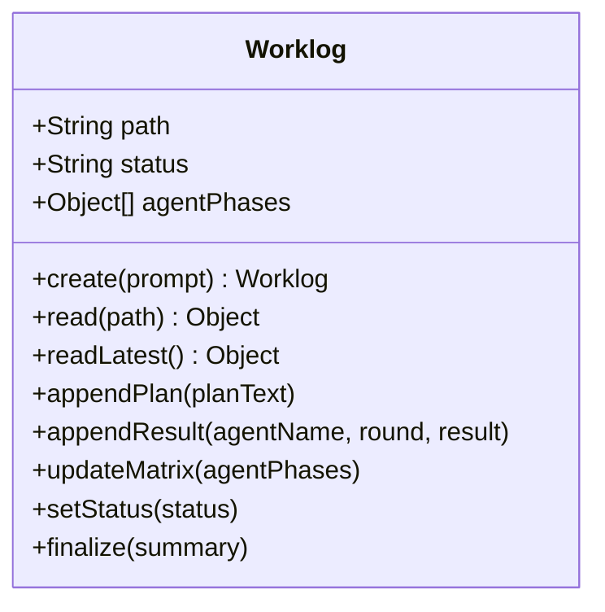

# Phase 1: 기반 모듈 (worklog + dev 스킬 + 역할 정리)

> **의존**: 없음 (독립 작업)
> **검증일**: 2026-02-24
> **산출물**: `src/worklog.js`, `dev`/`dev-frontend`/`dev-backend`/`dev-data`/`dev-testing` 스킬, `public/js/constants.js` 수정, `lib/mcp-sync.js` 수정

---

## 1-A: `src/worklog.js` (NEW)

worklog 생성/읽기/쓰기/symlink 관리를 담당하는 독립 모듈.



```javascript
// src/worklog.js
import fs from 'fs';
import { join } from 'path';
import { CLAW_HOME } from './config.js';

const WORKLOG_DIR = join(CLAW_HOME, 'worklogs');
const LATEST_LINK = join(WORKLOG_DIR, 'latest.md');

// ─── Create ──────────────────────────────────────────
export function createWorklog(prompt) {
  fs.mkdirSync(WORKLOG_DIR, { recursive: true });
  const ts = new Date().toISOString().replace(/[:-]/g, '').slice(0, 15);
  const slug = prompt.slice(0, 30).replace(/[^a-zA-Z가-힣0-9]/g, '_');
  const filename = `${ts}_${slug}.md`;
  const path = join(WORKLOG_DIR, filename);

  const initial = `# Work Log: ${prompt.slice(0, 80)}
- Created: ${new Date().toISOString()}
- Status: planning
- Rounds: 0/3

## Plan
(대기 중)

## Verification Criteria
(대기 중)

## Agent Status Matrix
| Agent | Role | Phase | Gate |
| ----- | ---- | ----- | ---- |

## Execution Log

## Final Summary
(미완료)
`;

  fs.writeFileSync(path, initial);
  // symlink 갱신
  try { fs.unlinkSync(LATEST_LINK); } catch {}
  fs.symlinkSync(path, LATEST_LINK);

  return { path, filename };
}

// ─── Read ────────────────────────────────────────────
export function readLatestWorklog() {
  if (!fs.existsSync(LATEST_LINK)) return null;
  const realPath = fs.realpathSync(LATEST_LINK);
  return { path: realPath, content: fs.readFileSync(realPath, 'utf8') };
}

// ─── Append ──────────────────────────────────────────
export function appendToWorklog(path, section, content) {
  const file = fs.readFileSync(path, 'utf8');
  const marker = `## ${section}`;
  const idx = file.indexOf(marker);
  if (idx === -1) {
    fs.appendFileSync(path, `\n## ${section}\n${content}\n`);
  } else {
    const nextSection = file.indexOf('\n## ', idx + marker.length);
    const insertPos = nextSection === -1 ? file.length : nextSection;
    const updated = file.slice(0, insertPos) + '\n' + content + '\n' + file.slice(insertPos);
    fs.writeFileSync(path, updated);
  }
}

// ─── Matrix Update ───────────────────────────────────
export function updateMatrix(path, agentPhases) {
  const PHASES = { 1: '기획', 2: '기획검증', 3: '개발', 4: '디버깅', 5: '통합검증' };
  const table = agentPhases.map(ap =>
    `| ${ap.agent} | ${ap.role} | Phase ${ap.currentPhase}: ${PHASES[ap.currentPhase]} | ${ap.completed ? '✅ 완료' : '⏳ 진행 중'} |`
  ).join('\n');

  const file = fs.readFileSync(path, 'utf8');
  const header = '## Agent Status Matrix';
  const start = file.indexOf(header);
  const nextSection = file.indexOf('\n## ', start + header.length);
  const replacement = `${header}\n| Agent | Role | Phase | Gate |\n|-------|------|-------|------|\n${table}\n`;
  const updated = file.slice(0, start) + replacement + file.slice(nextSection);
  fs.writeFileSync(path, updated);
}

// ─── Status Update ───────────────────────────────────
export function updateWorklogStatus(path, status, round) {
  const file = fs.readFileSync(path, 'utf8');
  const updated = file
    .replace(/- Status: .*/, `- Status: ${status}`)
    .replace(/- Rounds: .*/, `- Rounds: ${round}/3`);
  fs.writeFileSync(path, updated);
}
```

---

## 1-B: Dev 스킬 생성 (계층 구조)

[개발스킬-설계안.md](file:///Users/jun/Developer/new/_INBOX/개발스킬-설계안.md) §3 기반.

### 구조

```
~/.cli-claw/skills/
├── dev/
│   └── SKILL.md              ← 🔑 공통 개발 가이드 (모든 sub-agent에 주입)
├── dev-frontend/
│   └── SKILL.md              ← frontend 역할 전용 (frontend-design 복사+수정)
├── dev-backend/
│   └── SKILL.md              ← backend 역할 전용 (웹 검색 기반 작성)
├── dev-data/
│   └── SKILL.md              ← data 역할 전용 (웹 검색 기반 작성)
└── dev-testing/
    └── SKILL.md              ← phase 4(디버깅) 전용 (webapp-testing 복사+수정)
```

### `dev/SKILL.md` — 공통 개발 가이드 (핵심)

**모든 sub-agent에게 주입되는 공통 규칙**:

1. **모듈화 개발 필수**: 코드를 반드시 모듈 단위로 작성. 단일 파일 500줄 초과 금지.
2. **Self-reference**: cli-claw 프로젝트 자체 구조를 참고 패턴으로 사용:
   - Browser 스킬 패턴: `browser/SKILL.md` → API 엔드포인트 → CLI 명령어
   - HTML 모듈화 패턴: `public/js/features/*.js` (ES Module 구조)
   - Config 패턴: `src/config.js` (경로, 설정, 감지)
3. **스킬 레퍼런스**: 필요한 기술이 dev 스킬에 없으면 `~/.cli-claw/skills_ref/`에서 관련 스킬 탐색:
   - React 관련 → `react-best-practices/`
   - DB 관련 → `postgres/`
   - 보안 → `security-best-practices/`
   - 정적분석 → `static-analysis/`
4. **변경 로그**: 모든 변경사항을 worklog에 기록 (파일명, 변경 이유, 영향 범위)

### 소스 매핑

| 스킬           | 소스                                              | 작업                  |
| -------------- | ------------------------------------------------- | --------------------- |
| `dev`          | **새로 작성**                                     | 위 공통 규칙 기반     |
| `dev-frontend` | `~/.cli-claw/skills/frontend-design/` **복사**    | name/description 수정 |
| `dev-backend`  | 웹 검색 (Express REST API best practice)          | 새로 작성             |
| `dev-data`     | 웹 검색 + `skills_ref/postgres/` 참고             | 새로 작성             |
| `dev-testing`  | `~/.cli-claw/skills_ref/webapp-testing/` **복사** | name/description 수정 |

### Orchestrator 주입 규칙

```
getSubAgentPromptV2(emp, role, currentPhase):
  1. dev/SKILL.md → 항상 주입 (공통)
  2. dev-{role}/SKILL.md → 역할별 주입 (frontend/backend/data)
  3. dev-testing/SKILL.md → currentPhase === 4일 때 추가 주입 (전 역할)
```

> [!NOTE]
> `dev-testing`은 ROLE_PRESETS에 매핑 안됨. **디버깅 phase(4)에서** 모든 역할에게 자동 주입.
> `dev`는 loadActiveSkills()로 목록에 보이지만, orchestrator가 **명시적으로** 주입하는 용도.

### 구현 기록

**배포 흐름**: `skills_ref/` (프로젝트 소스) → `skill reset` → `~/.cli-claw/skills/` (런타임)

| 스킬           | 실제 작업                                                      | 파일 크기                       |
| -------------- | -------------------------------------------------------------- | ------------------------------- |
| `dev`          | 새로 작성 — 모듈화, self-ref, skill_ref 탐색, 변경로그 규칙    | ~60줄                           |
| `dev-frontend` | `skills/frontend-design/` 복사 → frontmatter name/desc 변경    | 43줄 (원본 유지)                |
| `dev-backend`  | 새로 작성 — Express.js 패턴, better-sqlite3, 에러핸들링, 보안  | ~60줄                           |
| `dev-data`     | 새로 작성 — ETL 패턴, CSV/JSON/SQLite, 분석 출력               | ~60줄                           |
| `dev-testing`  | `skills_ref/webapp-testing/` 복사 → frontmatter name/desc 변경 | 96줄 (scripts/, examples/ 포함) |

**변경된 프로젝트 파일**:
- `skills_ref/dev/SKILL.md` [NEW]
- `skills_ref/dev-frontend/SKILL.md` [NEW] (frontend-design 복사+수정)
- `skills_ref/dev-backend/SKILL.md` [NEW]
- `skills_ref/dev-data/SKILL.md` [NEW]
- `skills_ref/dev-testing/SKILL.md` [NEW] (webapp-testing 복사+수정)
- `skills_ref/registry.json` [MODIFY] `orchestration` 카테고리로 5개 등록

---

## 1-C: `public/js/constants.js` 역할 정리

> 수정 대상: [`public/js/constants.js`](file:///Users/jun/Developer/new/700_projects/cli-claw/public/js/constants.js)

```diff
 export const ROLE_PRESETS = [
-    { value: 'frontend', label: '🎨 프론트엔드', prompt: 'React/Vue 기반 UI 컴포넌트 개발, 스타일링' },
-    { value: 'backend', label: '⚙️ 백엔드', prompt: 'API 서버, DB 스키마, 비즈니스 로직 구현' },
-    { value: 'fullstack', label: '🔄 풀스택', prompt: '프론트엔드와 백엔드 모두 담당' },
-    { value: 'devops', label: '🚀 DevOps', prompt: 'CI/CD, Docker, 인프라 자동화' },
-    { value: 'qa', label: '🧪 QA', prompt: '테스트 작성, 버그 재현, 품질 관리' },
-    { value: 'data', label: '📊 데이터', prompt: '데이터 파이프라인, ETL, 분석 쿼리' },
-    { value: 'docs', label: '📝 테크라이터', prompt: 'API 문서화, README, 가이드 작성' },
-    { value: 'custom', label: '✏️ 커스텀...', prompt: '' },
+    { value: 'frontend', label: '🎨 프런트엔드', prompt: 'UI/UX 구현, CSS, 컴포넌트 개발', skill: 'dev-frontend' },
+    { value: 'backend',  label: '⚙️ 백엔드',     prompt: 'API, DB, 서버 로직 구현',     skill: 'dev-backend' },
+    { value: 'data',     label: '📊 데이터',     prompt: '데이터 파이프라인, 분석, ML',   skill: 'dev-data' },
+    { value: 'docs',     label: '📝 문서작성',   prompt: '문서화, README, API docs',     skill: 'documentation' },
+    { value: 'custom',   label: '✏️ 커스텀...',   prompt: '',                             skill: null },
 ];
```

**변경 포인트:**
- `skill` 필드 추가 → orchestrator가 role에서 주입할 스킬 자동 결정
- fullstack/devops/qa 제거 → 과정(phase)으로 흡수
- DB `role` 컬럼은 기존과 호환 (prompt 텍스트 저장)

---

## 검증된 리스크

### ✅ RESOLVED: Dev 스킬 경로 불일치

~~Hub-and-Spoke 구조에서 발생하던 경로 불일치~~ → **개별 스킬 방식으로 전환하여 해결.**
`dev-frontend/SKILL.md`가 `~/.cli-claw/skills/dev-frontend/SKILL.md`에 위치하므로 `loadActiveSkills()` 기존 로직 그대로 동작.

### 🔴 HIGH: ROLE_PRESETS 변경 시 기존 데이터 깨짐

현재 UI(`employees.js`)는 `ROLE_PRESETS.find(r => r.prompt === a.role)`로 **prompt 텍스트 exact match**:

```javascript
// employees.js:19 (현재 코드)
const matched = ROLE_PRESETS.find(r => r.prompt === a.role);
const presetVal = matched ? matched.value : (a.role ? 'custom' : 'frontend');
```

preset을 삭제/변경하면 → 기존 DB에 저장된 `role` 텍스트가 매치 안 됨 → `custom`으로 폴백.

**해결**:
1. DB 마이그레이션은 불필요 (폴백이 `custom`으로 안전하게 동작)
2. 하지만 기존 직원의 역할이 "풀스택" 등이면 UI에서 `custom`으로 보임
3. **Phase 1에서 UI 업데이트 시 레거시 매핑 추가**:

```javascript
const LEGACY_ROLE_MAP = {
  'React/Vue 기반 UI 컴포넌트 개발, 스타일링': 'frontend',
  'API 서버, DB 스키마, 비즈니스 로직 구현': 'backend',
  '프론트엔드와 백엔드 모두 담당': 'frontend',  // fullstack → frontend
  'CI/CD, Docker, 인프라 자동화': 'backend',     // devops → backend
  '테스트 작성, 버그 재현, 품질 관리': 'custom',
  '데이터 파이프라인, ETL, 분석 쿼리': 'data',
  'API 문서화, README, 가이드 작성': 'docs',
};
```

### ✅ RESOLVED: Worklog 동시 쓰기 레이스

~~Phase 2에서 병렬 sub-agent가 동시에 worklog에 쓸 때 `read-modify-write` 레이스 발생 가능.~~

**해결**: Phase 6에서 `distributeByPhase`를 `for...of` 순차 실행으로 변경.
에이전트가 하나씩 완료 후 즉시 worklog에 기록하므로 동시 쓰기 문제 제거됨.
