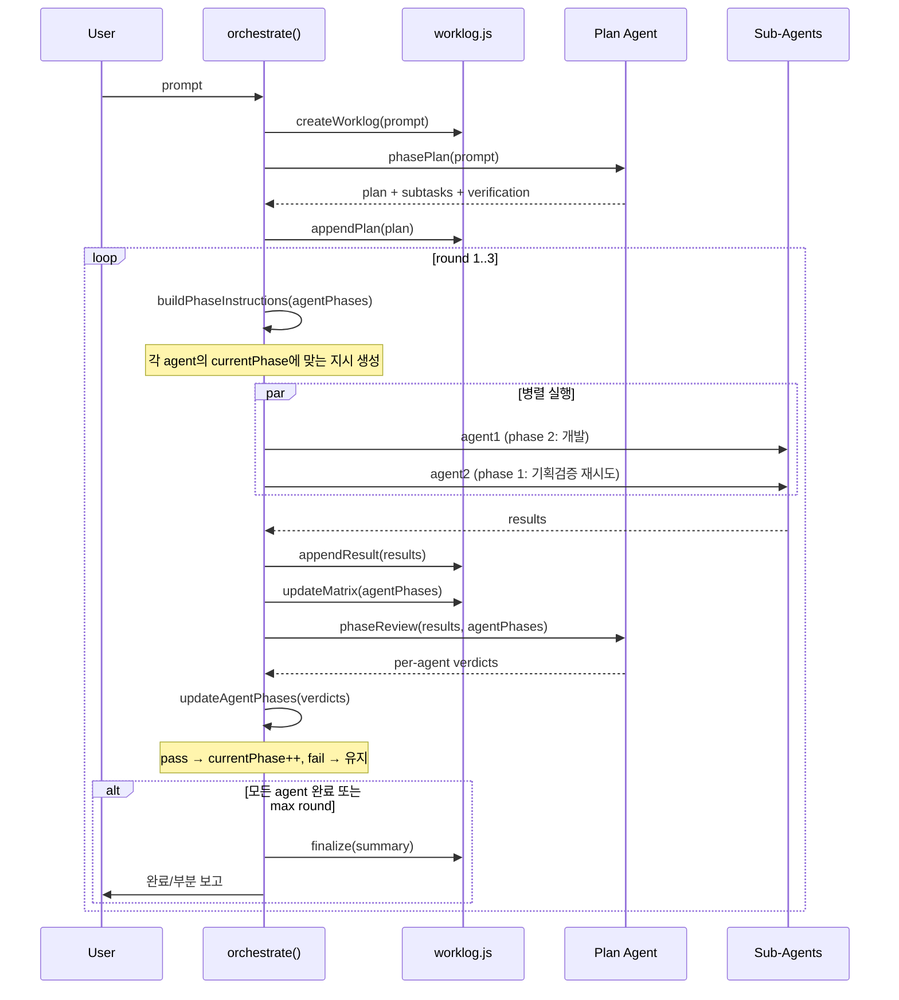

# Phase 2: Orchestrator v2 (핵심 리팩터링)

> **의존**: Phase 1 (`worklog.js`, dev 스킬, 역할 정리)
> **검증일**: 2026-02-24
> **위험도**: 🔴 HIGH — 핵심 오케스트레이터 리팩터링
> **산출물**: `src/orchestrator.js` v2, `src/prompt.js` 확장

---

## 전체 흐름



---

## 코드: `orchestrator.js` v2

```javascript
// src/orchestrator.js v2
import { broadcast } from './bus.js';
import { insertMessage, getEmployees } from './db.js';
import { getSubAgentPromptV2 } from './prompt.js';
import { spawnAgent } from './agent.js';
import { createWorklog, appendToWorklog, updateMatrix, updateWorklogStatus } from './worklog.js';

const MAX_ROUNDS = 3;

// ─── Phase 정의 ──────────────────────────────────────
const PHASES = { 1: '기획', 2: '기획검증', 3: '개발', 4: '디버깅', 5: '통합검증' };

const PHASE_PROFILES = {
  frontend: [1, 2, 3, 4, 5],
  backend:  [1, 2, 3, 4, 5],
  data:     [1, 2, 3, 4, 5],
  docs:     [1, 3, 5],
  custom:   [3],
};

const PHASE_INSTRUCTIONS = {
  1: `[기획] 이 계획의 실현 가능성을 검증하세요. 코드 작성 금지.
     - 필수: 영향 범위 분석 (어떤 파일들이 변경되는가)
     - 필수: 의존성 확인 (import/export 충돌 없는가)
     - 필수: 엣지 케이스 목록 (null/empty/error 처리)
     - worklog에 분석 결과를 기록하세요.`,
  2: `[기획검증] 설계 문서를 검증하고 누락된 부분을 보완하세요.
     - 필수: 파일 변경 목록과 실제 코드 대조 (함수명, 라인 번호)
     - 필수: 충돌 검사 (다른 agent 작업과 같은 파일 수정하는가)
     - 필수: 테스트 전략 수립 (verifyable 기준 정의)
     - worklog에 검증 결과를 기록하세요.`,
  3: `[개발] 문서를 참조하여 코드를 작성하세요.
     - 필수: 변경된 파일 목록과 단위 당 핵심 변경 설명
     - 필수: 기존 export/import 깨뜨리지 않았는지 확인
     - 필수: 코드가 lint/build 에러 없이 동작하는지 검증
     - worklog Execution Log에 변경 로그를 기록하세요.`,
  4: `[디버깅] 코드를 실행/테스트하고 버그를 수정하세요.
     - 필수: 실행 결과 스크린샷/로그 쳊부
     - 필수: 발견된 버그 목록과 수정 내역
     - 필수: 엣지 케이스 테스트 결과 (null/empty/error)
     - worklog에 디버그 로그를 기록하세요.`,
  5: `[통합검증] 다른 영역과의 통합을 검증하세요.
     - 필수: 다른 agent 산출물과의 통합 테스트
     - 필수: 최종 문서 업데이트 (README, 변경로그)
     - 필수: 전체 워크플로우 동작 확인
     - worklog에 최종 검증 결과를 기록하세요.`,
};

// ─── Per-Agent Phase Tracking ────────────────────────
function initAgentPhases(subtasks) {
  return subtasks.map(st => {
    const profile = PHASE_PROFILES[st.role || 'custom'] || [3];
    return {
      agent: st.agent,
      task: st.task,
      role: st.role || 'custom',
      phaseProfile: profile,
      currentPhaseIdx: 0,
      currentPhase: profile[0],
      completed: false,
      history: [],
    };
  });
}

function advancePhase(ap, passed) {
  if (!passed) return;
  if (ap.currentPhaseIdx < ap.phaseProfile.length - 1) {
    ap.currentPhaseIdx++;
    ap.currentPhase = ap.phaseProfile[ap.currentPhaseIdx];
  } else {
    ap.completed = true;
  }
}

// ─── Plan Phase ──────────────────────────────────────
async function phasePlan(prompt, worklog) {
  const planOpts = { agentId: 'planning' };
  broadcast('agent_status', { agentId: 'planning', agentName: '🎯 기획', status: 'planning' });

  const planPrompt = `## 작업 요청
${prompt}

## 출력 형식 (반드시 준수)
1. 자연어로 계획을 설명하세요.
2. **검증 기준을 반드시 포함**하세요. 각 subtask별로:
   - ✅ 성공 기준 (어떻게 되면 통과인가)
   - ❌ 실패 기준 (어떻게 되면 재시도인가)
   - 파일 변경 범위 (어떤 파일들이 영향받는가)
3. subtask JSON을 아래 형식으로 출력하세요:

\`\`\`json
{
  "subtasks": [
    {
      "agent": "직원이름",
      "role": "frontend|backend|data|docs",
      "task": "구체적 지시",
      "verification": {
        "pass_criteria": "통과 기준 (1줄)",
        "fail_criteria": "실패 기준 (1줄)",
        "affected_files": ["src/file.js"]
      }
    }
  ]
}
\`\`\`

worklog 경로: ${worklog.path}
이 파일에 계획을 기록하세요.`;

  const { promise } = spawnAgent(planPrompt, planOpts);
  const result = await promise;

  const planText = stripSubtaskJSON(result.text);
  appendToWorklog(worklog.path, 'Plan', planText || '(Plan Agent 응답 없음)');

  const subtasks = parseSubtasks(result.text);
  return { planText, subtasks };
}

// ─── Distribute Phase (순차 실행, per-agent phase-aware) ──
async function distributeByPhase(agentPhases, worklog, round) {
  const emps = getEmployees.all();
  const results = [];

  const active = agentPhases.filter(ap => !ap.completed);
  if (active.length === 0) return results;

  // 순차 실행: 각 에이전트가 이전 에이전트의 변경을 볼 수 있도록
  for (const ap of active) {
    const emp = emps.find(e =>
      e.name === ap.agent || e.name?.includes(ap.agent) || ap.agent.includes(e.name)
    );
    if (!emp) {
      results.push({ agent: ap.agent, role: ap.role, status: 'skipped', text: 'Agent not found' });
      continue;
    }

    const instruction = PHASE_INSTRUCTIONS[ap.currentPhase];
    const phaseLabel = PHASES[ap.currentPhase];
    const sysPrompt = getSubAgentPromptV2(emp, ap.role, ap.currentPhase);

    // 이전 에이전트 결과 요약 (순차 실행이므로 이미 완료된 것들)
    const priorSummary = results.length > 0
        ? results.map(r => `- ${r.agent} (${r.role}): ${r.status} — ${r.text.slice(0, 150)}`).join('\n')
        : '(첫 번째 에이전트입니다)';

    const taskPrompt = `## 작업 지시 [${phaseLabel}]
${ap.task}

## 현재 Phase: ${ap.currentPhase} (${phaseLabel})
${instruction}

## 순차 실행 규칙
- **이전 에이전트가 이미 수정한 파일은 건드리지 마세요**
- 당신의 담당 영역(${ap.role})에만 집중하세요

### 이전 에이전트 결과
${priorSummary}

## Worklog
이 파일을 먼저 읽으세요: ${worklog.path}
작업 완료 후 반드시 Execution Log 섹션에 결과를 기록하세요.`;

    broadcast('agent_status', {
      agentId: emp.id, agentName: emp.name,
      status: 'running', phase: ap.currentPhase, phaseLabel,
    });

    const { promise } = spawnAgent(taskPrompt, {
      agentId: emp.id, cli: emp.cli, model: emp.model,
      forceNew: true, sysPrompt,
    });

    const r = await promise;
    const result = {
      agent: ap.agent, role: ap.role, id: emp.id,
      phase: ap.currentPhase, phaseLabel,
      status: r.code === 0 ? 'done' : 'error',
      text: r.text || '',
    };
    results.push(result);
    broadcast('agent_status', { agentId: emp.id, agentName: emp.name, status: result.status, phase: ap.currentPhase });

    // 즉시 worklog에 기록
    appendToWorklog(worklog.path, 'Execution Log',
      `### Round ${round} — ${result.agent} (${result.role}, ${result.phaseLabel})\n- Status: ${result.status}\n- Result: ${result.text.slice(0, 500)}`
    );
  }

  return results;
}

// ─── Review Phase (per-agent verdict) ────────────────
async function phaseReview(results, agentPhases, worklog, round) {
  const report = results.map(r =>
    `- **${r.agent}** (${r.role}, ${r.phaseLabel}): ${r.status === 'done' ? '✅' : '❌'}\n  ${r.text.slice(0, 400)}`
  ).join('\n');

  const matrixStr = agentPhases.map(ap =>
    `- ${ap.agent}: role=${ap.role}, phase=${ap.currentPhase}(${PHASES[ap.currentPhase]}), completed=${ap.completed}`
  ).join('\n');

  const reviewPrompt = `## 라운드 ${round} 결과 리뷰

### 실행 결과
${report}

### 현재 Agent 상태
${matrixStr}

### Worklog
${worklog.path} — 이 파일의 변경사항도 확인하세요.

## 판정 (각 agent별로 개별 판정)

### Quality Gate 루브릭
각 agent의 현재 phase에 따라 아래 기준으로 판정:

- **Phase 1 (기획)**: 영향 범위 분석 + 의존성 확인 + 엣지 케이스 목록 있는가?
- **Phase 2 (기획검증)**: 실제 코드와 대조 확인 + 충돌 검사 + 테스트 전략 수립됐는가?
- **Phase 3 (개발)**: 변경 파일 목록 + export/import 무결성 + 빌드 에러 없는가?
- **Phase 4 (디버깅)**: 실행 결과 증거 + 버그 수정 내역 + 엣지 케이스 테스트 결과 있는가?
- **Phase 5 (통합검증)**: 통합 테스트 + 문서 업데이트 + 워크플로우 동작 확인?

### 판정 규칙
- **PASS**: 해당 phase의 필수 항목 모두 충족. 구체적 근거 제시.
- **FAIL**: 필수 항목 중 하나라도 미충족. **구체적 수정 지시** 제공 (“더 노력하세요” 금지, 구체적 행동 제시).

JSON으로 출력:
\`\`\`json
{
  "verdicts": [
    { "agent": "이름", "pass": true, "feedback": "통과 근거: ..." },
    { "agent": "이름", "pass": false, "feedback": "수정 필요: 1. ... 2. ..." }
  ],
  "allDone": false
}
\`\`\`

모든 작업이 완료되면 allDone: true + 사용자에게 보여줄 자연어 요약을 함께 작성.`;

  broadcast('agent_status', { agentId: 'planning', agentName: '🎯 기획', status: 'reviewing' });
  const { promise } = spawnAgent(reviewPrompt, { agentId: 'planning', internal: true });
  const evalR = await promise;

  let verdicts = null;
  try {
    // 전략 1: fenced JSON 파싱
    const fenced = evalR.text.match(/```(?:json)?\n([\s\S]*?)\n```/);
    if (fenced) verdicts = JSON.parse(fenced[1]);
  } catch {}
  if (!verdicts) {
    try {
      // 전략 2: raw JSON 파싱 (fence 없이 JSON만 응답한 경우)
      const raw = evalR.text.match(/\{[\s\S]*"verdicts"[\s\S]*\}/);
      if (raw) verdicts = JSON.parse(raw[0]);
    } catch {}
  }

  return { verdicts, rawText: evalR.text };
}

// ─── Main Orchestrate v2 ────────────────────────────
export async function orchestrate(prompt) {
  const employees = getEmployees.all();

  if (employees.length === 0) {
    const { promise } = spawnAgent(prompt);
    const result = await promise;
    const stripped = stripSubtaskJSON(result.text);
    broadcast('orchestrate_done', { text: stripped || result.text || '' });
    return;
  }

  const worklog = createWorklog(prompt);
  broadcast('worklog_created', { path: worklog.path });

  const { planText, subtasks } = await phasePlan(prompt, worklog);
  if (!subtasks?.length) {
    broadcast('orchestrate_done', { text: planText || '' });
    return;
  }

  const agentPhases = initAgentPhases(subtasks);
  updateMatrix(worklog.path, agentPhases);

  for (let round = 1; round <= MAX_ROUNDS; round++) {
    updateWorklogStatus(worklog.path, 'round_' + round, round);
    broadcast('round_start', { round, agentPhases });

    const results = await distributeByPhase(agentPhases, worklog, round);
    const { verdicts, rawText } = await phaseReview(results, agentPhases, worklog, round);

    if (verdicts?.verdicts) {
      for (const v of verdicts.verdicts) {
        const ap = agentPhases.find(a => a.agent === v.agent);
        if (ap) {
          advancePhase(ap, v.pass);
          ap.history.push({ round, phase: ap.currentPhase, pass: v.pass, feedback: v.feedback });
        }
      }
    }
    updateMatrix(worklog.path, agentPhases);

    const allDone = agentPhases.every(ap => ap.completed);
    if (allDone || verdicts?.allDone) {
      const summary = stripSubtaskJSON(rawText) || '모든 작업 완료';
      appendToWorklog(worklog.path, 'Final Summary', summary);
      updateWorklogStatus(worklog.path, 'done', round);
      insertMessage.run('assistant', summary, 'orchestrator', '');
      broadcast('orchestrate_done', { text: summary, worklog: worklog.path });
      break;
    }

    broadcast('round_done', { round, action: 'next', agentPhases });

    if (round === MAX_ROUNDS) {
      const done = agentPhases.filter(ap => ap.completed);
      const pending = agentPhases.filter(ap => !ap.completed);
      const partial = `## 완료 (${done.length})\n${done.map(a => `- ✅ ${a.agent} (${a.role})`).join('\n')}\n\n` +
        `## 미완료 (${pending.length})\n${pending.map(a => `- ⏳ ${a.agent} (${a.role}) — Phase ${a.currentPhase}: ${PHASES[a.currentPhase]}`).join('\n')}\n\n` +
        `이어서 진행하려면 "이어서 해줘"라고 말씀하세요.\nWorklog: ${worklog.path}`;
      appendToWorklog(worklog.path, 'Final Summary', partial);
      updateWorklogStatus(worklog.path, 'partial', round);
      insertMessage.run('assistant', partial, 'orchestrator', '');
      broadcast('orchestrate_done', { text: partial, worklog: worklog.path });
    }
  }
}
```

---

## 코드: `prompt.js` 확장 — `getSubAgentPromptV2`

```javascript
// prompt.js에 추가
export function getSubAgentPromptV2(emp, role, currentPhase) {
  let prompt = getSubAgentPrompt(emp);

  // ─── 1. 공통 Dev 스킬 (항상 주입)
  const devCommonPath = join(SKILLS_DIR, 'dev', 'SKILL.md');
  if (fs.existsSync(devCommonPath)) {
    prompt += `\n\n## Development Guide (Common)\n${fs.readFileSync(devCommonPath, 'utf8')}`;
  }

  // ─── 2. Role 기반 Dev 스킬 주입 (개별 스킬 방식)
  const ROLE_SKILL_MAP = {
    frontend: join(SKILLS_DIR, 'dev-frontend', 'SKILL.md'),
    backend:  join(SKILLS_DIR, 'dev-backend', 'SKILL.md'),
    data:     join(SKILLS_DIR, 'dev-data', 'SKILL.md'),
    docs:     join(SKILLS_DIR, 'documentation', 'SKILL.md'),  // documentation 스킬
    custom:   null,  // 커스텀 역할은 공통 가이드만 사용
  };

  const skillPath = ROLE_SKILL_MAP[role];
  if (skillPath && fs.existsSync(skillPath)) {
    const skillContent = fs.readFileSync(skillPath, 'utf8');
    prompt += `\n\n## Development Guide (${role})\n${skillContent}`;
  }

  // ─── 3. 디버깅 phase(4)에서 dev-testing 추가 주입 (전 역할)
  if (currentPhase === 4) {
    const testingPath = join(SKILLS_DIR, 'dev-testing', 'SKILL.md');
    if (fs.existsSync(testingPath)) {
      prompt += `\n\n## Testing Guide (Phase 4)\n${fs.readFileSync(testingPath, 'utf8')}`;
    }
  }

  // ─── Phase 컨텍스트 + Quality Gate 기대치
  const PHASES = { 1: '기획', 2: '기획검증', 3: '개발', 4: '디버깅', 5: '통합검증' };
  const PHASE_GATES = {
    1: '통과 조건: 영향범위 분석 + 의존성 확인 + 엣지케이스 목록 완성',
    2: '통과 조건: 코드 대조 확인 + 충돌검사 + 테스트전략 수립',
    3: '통과 조건: 변경파일목록 + export/import 무결성 + 빌드에러 없음',
    4: '통과 조건: 실행결과 증거 + 버그수정내역 + 엣지케이스 테스트 결과',
    5: '통과 조건: 통합테스트 + 문서업데이트 + 워크플로우 동작확인',
  };
  prompt += `\n\n## Current Phase: ${currentPhase} (${PHASES[currentPhase]})`;
  prompt += `\n당신은 지금 "${PHASES[currentPhase]}" 단계를 수행 중입니다.`;
  prompt += `\n${PHASE_GATES[currentPhase]}`;
  prompt += `\n\n## 순차 실행 + Phase Skip`;
  prompt += `\n에이전트는 한 명씩 순서대로 실행됩니다. 이전 에이전트의 작업 결과가 이미 파일에 반영되어 있습니다.`;
  prompt += `\n- worklog를 먼저 읽고 이전 에이전트가 뭘 했는지 파악하세요`;
  prompt += `\n- 이미 수정된 파일은 건드리지 마세요`;
  prompt += `\n- 당신의 담당 영역에만 집중하세요`;
  prompt += `\n- 현재 Phase가 1이 아니라면, 이전 Phase는 이미 완료된 것입니다. 기획/검증을 다시 하지 마세요.`;
  prompt += `\n\n주의: Quality Gate를 통과하려면 위 조건을 모두 충족해야 합니다. 부족한 부분이 있으면 재시도됩니다.`;

  return prompt;
}
```

---

## 검증된 리스크

### 🔴 CRITICAL: `stripSubtaskJSON` / `parseSubtasks` export 유지 필수

`agent.js`가 orchestrator에서 이 함수들을 import:

```javascript
// src/agent.js:193 (현재 코드)
import { stripSubtaskJSON } from './orchestrator.js';

// src/agent.js:319
const stripped = stripSubtaskJSON(ctx.fullText);
```

**v2 리팩터링 시 반드시 export 유지.** 누락하면 `agent.js`가 즉시 깨짐.

**해결**: v2 코드에도 `export function stripSubtaskJSON` / `export function parseSubtasks` 반드시 포함.
위의 v2 코드 스케치에서 이 export가 빠져 있으므로 구현 시 추가 필요.

### ✅ RESOLVED: Worklog 동시 쓰기 레이스

~~`distributeByPhase()`에서 Sub-agents가 병렬 실행되며 각자 worklog에 기록 → 데이터 손실 가능.~~

**해결**: Phase 6에서 `distributeByPhase`를 `for...of` **순차 실행**으로 변경.
각 에이전트가 완료된 후 즉시 worklog에 기록하므로 동시 쓰기 문제가 원천 제거됨.

### ✅ RESOLVED: `SKILLS_DIR` 경로 문제

~~Hub-and-Spoke 구조에서 발생하던 경로 불일치~~ → **개별 스킬 방식(`dev-frontend/SKILL.md`)으로 전환하여 해결.**
`loadActiveSkills()`가 `~/.cli-claw/skills/dev-frontend/SKILL.md`를 자동 로딩.

### 🟡 MEDIUM: Verdict JSON 파서 내구성

Plan Agent가 fenced JSON 없이 raw JSON으로 응답하면 파싱 실패 가능.

**해결**: 이중 파싱 전략 적용완료 (위 코드 스케치 수정됨).
1. fenced code block (``` ```json ... ``` ```) 우선 시도
2. 실패 시 raw `{"verdicts": ...}` 파싱 폴백

### 🟡 MEDIUM: `stripSubtaskJSON` / `parseSubtasks` 스케치에 없음

위 v2 코드 스케치에서 `stripSubtaskJSON`과 `parseSubtasks`의 **구현체**가 빠져 있음.
구현 시 반드시 현재 v1의 해당 함수들을 **그대로 복사**하거나 별도 util로 분리:

```javascript
// 현재 v1의 구현을 그대로 유지 (agent.js가 import)
export function stripSubtaskJSON(text) { ... }  // 기존 코드 복사
export function parseSubtasks(text) { ... }      // 기존 코드 복사
```

