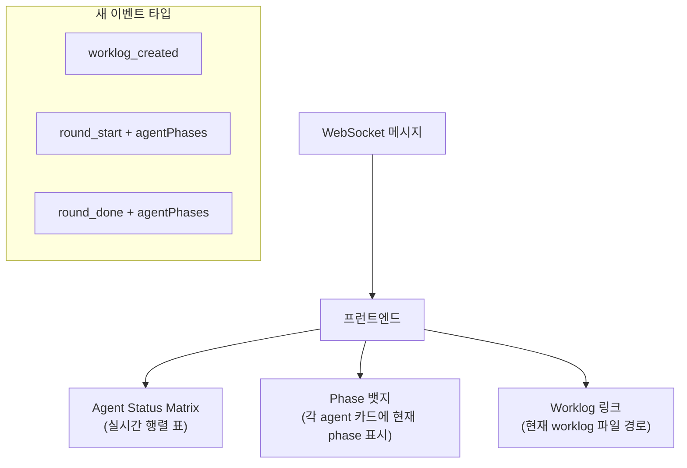
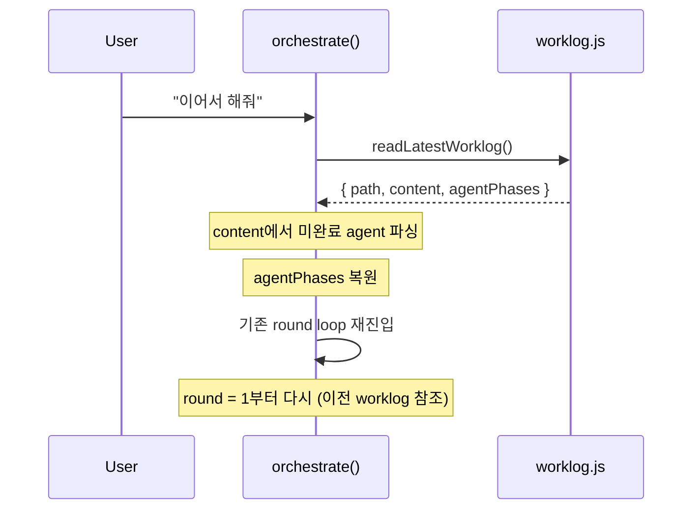

# Phase 3: UX + 연속성

> **의존**: Phase 2 (`orchestrator.js` v2)
> **검증일**: 2026-02-24
> **산출물**: 프런트엔드 행렬 표시, "이어서 해줘" 연속성, 기본 서브에이전트 5명, 새 API 엔드포인트

---

## 3-A: 프런트엔드 행렬 표시



**bus.js**: 기존 브로드캐스트에 `agentPhases` 배열 추가로 전달.

**프런트엔드**: `employees.js`의 각 agent 카드에 phase 뱃지 표시:

```javascript
// public/js/features/employees.js 확장
function renderPhaseBadge(phase, phaseLabel) {
  const colors = { 1: '#60a5fa', 2: '#a78bfa', 3: '#34d399', 4: '#fbbf24', 5: '#f472b6' };
  return `<span style="background:${colors[phase]};color:#000;padding:1px 6px;border-radius:9px;font-size:10px">${phaseLabel}</span>`;
}
```

---

## 3-B: "이어서 해줘" 연속성



```javascript
// orchestrator.js에 추가
export async function orchestrateContinue() {
  const latest = readLatestWorklog();
  if (!latest) {
    broadcast('orchestrate_done', { text: '이어갈 worklog가 없습니다.' });
    return;
  }

  const pending = parseWorklogPending(latest.content);
  if (!pending.length) {
    broadcast('orchestrate_done', { text: '모든 작업이 이미 완료되었습니다.' });
    return;
  }

  const resumePrompt = `## 이어서 작업
이전 worklog를 읽고 미완료 항목을 이어서 진행하세요.

Worklog: ${latest.path}

미완료 항목:
${pending.map(p => `- ${p.agent} (${p.role}): Phase ${p.currentPhase}`).join('\n')}

subtask JSON을 출력하세요.`;

  return orchestrate(resumePrompt);
}
```

---

## 3-C: 기본 서브에이전트 5명 자동 생성

`cli-claw init` 또는 최초 실행 시 기본 서브에이전트 5명을 자동 추가.
`cli-claw employee reset`으로 기본값 재설정 가능.

| #   | 이름   | 역할     | CLI       | 목적              |
| --- | ------ | -------- | --------- | ----------------- |
| 1   | 프런트 | frontend | *default* | UI/UX 개발        |
| 2   | 백엔드 | backend  | *default* | API/서버 로직     |
| 3   | 데이터 | data     | *default* | 데이터 파이프라인 |
| 4   | 문서   | docs     | *default* | 문서화            |
| 5   | 검수   | custom   | *default* | 코드 리뷰/QA      |

> [!IMPORTANT]
> **모든 기본 에이전트는 `settings.cli` (기본 CLI)로만 세팅.**
> 사용자가 CLI를 하나만 연결했을 수 있으므로, 개별 CLI 하드코딩 금지.

```javascript
// src/config.js 또는 bin/commands/init.js
const DEFAULT_EMPLOYEES = [
  { name: '프런트', role: 'UI/UX 구현, CSS, 컴포넌트 개발' },
  { name: '백엔드', role: 'API, DB, 서버 로직 구현' },
  { name: '데이터', role: '데이터 파이프라인, 분석, ML' },
  { name: '문서',   role: '문서화, README, API docs' },
  { name: '검수',   role: '코드 리뷰, 테스트 검증, QA' },
];

function seedDefaultEmployees() {
  const cli = settings.cli;  // 전부 기본 CLI 사용
  for (const emp of DEFAULT_EMPLOYEES) {
    insertEmployee(emp.name, cli, emp.role);
  }
}

// 최초 실행: employees 비어있을 때만
if (!getEmployees().length) seedDefaultEmployees();

// reset: cli-claw employee reset → 전부 삭제 후 재생성
// deleteAllEmployees() + seedDefaultEmployees()
```

---

## 파일 변경 요약

| 파일                              | 작업                                                      |
| --------------------------------- | --------------------------------------------------------- |
| `src/orchestrator.js`             | [MODIFY] `orchestrateContinue` + `isContinueIntent` 추가  |
| `server.js`                       | [MODIFY] continue 라우팅 + `seedDefaultEmployees` + reset |
| `src/agent.js`                    | [MODIFY] processQueue에서 `isContinueIntent` 분기         |
| `src/telegram.js`                 | [MODIFY] `isContinueIntent` → `orchestrateContinue` 분기  |
| `src/commands.js`                 | [MODIFY] `/employee reset` 슬래시 커맨드 추가             |
| `bin/commands/employee.js`        | [NEW] CLI `cli-claw employee reset` 명령                  |
| `bin/cli-claw.js`                 | [MODIFY] employee 서브커맨드 등록                         |
| `bin/commands/chat.js`            | [MODIFY] `resetEmployees` ctx + continued 메시지          |
| `public/js/features/employees.js` | [MODIFY] phase 뱃지 (`getAgentPhase` import)              |
| `public/js/features/chat.js`      | [MODIFY] 에러 핸들링 + `continued` 응답 표시              |
| `public/js/ws.js`                 | [MODIFY] 이벤트 핸들링 + `agentPhaseState` 추적           |

---

## 구현 노트 (리뷰 반영)

### ✅ isContinueIntent — 엄격한 패턴 매칭

기존 `/이어서|계속|continue/i` 광범위 regex → 명시적 짧은 명령만 매칭하도록 공용 함수 분리:

```javascript
// orchestrator.js
const CONTINUE_PATTERNS = [
    /^\/?continue$/i,
    /^이어서(?:\s*해줘)?$/i,
    /^계속(?:\s*해줘)?$/i,
];
export function isContinueIntent(text) { ... }
```

### ✅ Continue-before-Queue 라우팅

모든 진입점에서 `isContinueIntent()` 체크를 **큐 진입 전**에 배치:
- `server.js`: WS 핸들러 + `/api/message` (실행 중이면 안내 메시지)
- `src/agent.js`: `processQueue`에서 dequeue된 메시지도 분기
- `src/telegram.js`: 텔레그램 메시지 경로도 분기

### ✅ seedDefaultEmployees 헬퍼

`server.js`에 `seedDefaultEmployees({ reset, notify })` 함수 추출:
- `reset=false` (기본): employees 비어있을 때만 seed
- `reset=true`: 전체 삭제 후 재생성
- `notify=true`: WebSocket `agent_updated` broadcast
- `DEFAULT_EMPLOYEES` 모듈 레벨 상수로 통합 (중복 제거)
- 호출 경로: startup seed, `POST /api/employees/reset`, `/employee reset`, `makeWebCommandCtx`

### ✅ `/employee reset` 명령

- 슬래시 커맨드: `commands.js`에 `employeeHandler` + `employeeArgumentCompletions` 등록
- CLI 명령: `bin/commands/employee.js` (REST API 호출), `bin/cli-claw.js`에 등록
- 웹 chat.js: `resetEmployees` ctx 연결

---

## 검증된 리스크

### ✅ RESOLVED: `parseWorklogPending`

~~`orchestrateContinue()`에서 사용하는 `parseWorklogPending(latest.content)` 함수가 설계에 정의 안 됨.~~

**해결**: Phase 1에서 `worklog.js`에 구현 완료. fallback도 Phase 1(보수적 재시작)로 수정됨.

### ✅ RESOLVED: `server.js` 경로

파일 변경 요약에 `src/server.js`로 표기되어 있었지만 실제 서버 파일은 **루트 `server.js`**. 수정 완료.

### ✅ RESOLVED: WS 이벤트 프런트엔드 처리

ws.js에 핸들러 추가 완료. `agentPhases` 키 지원, `worklog_created` 표시, `action='next'` 구분.
`agentPhaseState`로 badge 데이터도 실시간 추적.

### ✅ RESOLVED: Continue 오탐 방지

~~`/이어서|계속|continue/i` 광범위 regex로 일반 문장도 resume 트리거.~~

**해결**: `isContinueIntent()` 엄격 패턴 + continue-before-queue 라우팅으로 해결.
