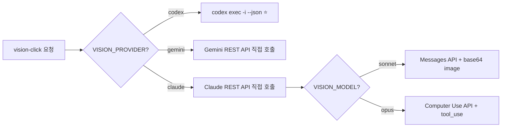

# Vision Click — Claude Code CLI 방식

> Claude Code CLI는 `--print` 모드에서 이미지 비전 불가. **Read 도구로 파일을 읽어도 비전 분석 못함.**

---

## 핵심 요약

| 항목               | 값                                       |
| ------------------ | ---------------------------------------- |
| **CLI 명령**       | `claude -p --output-format json`         |
| **이미지 전달**    | 🔸 `Cmd+V` 붙여넣기 (대화형만)            |
| **--print 모드**   | ❌ 이미지 직접 전달 방법 없음             |
| **파일 경로 방식** | ❌ Read 도구로 읽어도 비전 분석 불가      |
| **추천도**         | ⭐⭐ — headless 비전 미지원, REST API 필요 |

---

## 스모크 테스트 결과

### 테스트: 파일 경로 지정 (--print 모드)

```bash
claude -p --output-format json --dangerously-skip-permissions --model sonnet \
  'Look at /tmp/vision-test-ui.png (800x600). Find LOGIN button center coordinates.
   Return ONLY JSON: { "found": true, "x": int, "y": int, "description": "..." }'
```

**결과:**
```json
{
  "found": false,
  "x": null,
  "y": null,
  "description": "No LOGIN button is visible in the image. The PNG appears to be a mostly blank/white canvas with no discernible UI elements or text rendered at the pixel level."
}
```

**실패 원인:**
- Claude Code의 Read 도구는 **텍스트 파일 읽기** 전용
- PNG 바이너리를 읽어도 **비전 모델로 분석하지 않음**
- `--print` 모드에서는 Cmd+V 이미지 붙여넣기 사용 불가

> [!WARNING]
> Claude Code CLI는 headless(`--print`) 모드에서 **이미지를 AI 비전으로 분석하는 방법이 없음**.
> 대화형 모드의 `Cmd+V` 붙여넣기만 이미지 비전을 지원하지만, 이는 자동화에 사용할 수 없음.

---

## 대안 1: Claude REST API 직접 호출

```javascript
// src/browser/vision.js — Claude REST API 직접 호출
async function claudeAnalyze(screenshotB64, query, viewport) {
    const resp = await fetch('https://api.anthropic.com/v1/messages', {
        method: 'POST',
        headers: {
            'Content-Type': 'application/json',
            'x-api-key': process.env.ANTHROPIC_API_KEY,
            'anthropic-version': '2023-06-01',
        },
        body: JSON.stringify({
            model: process.env.VISION_MODEL || 'claude-sonnet-4-6',
            max_tokens: 256,
            messages: [{
                role: 'user',
                content: [
                    { type: 'image', source: { type: 'base64', media_type: 'image/png', data: screenshotB64 } },
                    { type: 'text', text: `이 스크린샷(${viewport.width}x${viewport.height}px)에서 "${query}"의 중심 픽셀 좌표를 찾아줘.
JSON만 반환: { "found": boolean, "x": number, "y": number, "confidence": "high"|"medium"|"low", "description": "설명" }` },
                ],
            }],
        }),
    });
    const data = await resp.json();
    const text = data.content?.[0]?.text || '{}';
    return JSON.parse(text.match(/\{[\s\S]*\}/)?.[0] || '{"found":false}');
}
```

## 대안 2: Computer Use API (Opus 4.6)

vision-click-claude에서 Opus 4.6 Computer Use API 사용 가능. 단, **비용 20x** + tool_use 흐름 복잡.

자세한 코드는 [vision-click.md](./vision-click.md)의 "Claude Opus 4.6 — Computer Use 접근법" 섹션 참조.

---

## cli-claw 통합 방식



Claude도 CLI wrapper를 거치지 않고 **REST API 직접 호출**이 유일한 방법.

---

## 비교: Claude 접근법

| 방법                          | 가능?              | 정확도                 | 비용   |
| ----------------------------- | ------------------ | ---------------------- | ------ |
| **claude CLI --print**        | ❌ 이미지 비전 불가 | —                      | —      |
| **claude CLI 대화형 (Cmd+V)** | ✅ 수동만           | 미테스트               | —      |
| **REST API (Sonnet)**         | ✅                  | 중간 (~50px 오차 예상) | ~$0.01 |
| **Computer Use API (Opus)**   | ✅                  | 높음 (OSWorld 61.4%)   | ~$0.02 |

---

## 변경 기록

- 2026-02-24: 스모크 테스트 실패. --print 모드 이미지 비전 미지원 확인. REST API 대안 문서화.
