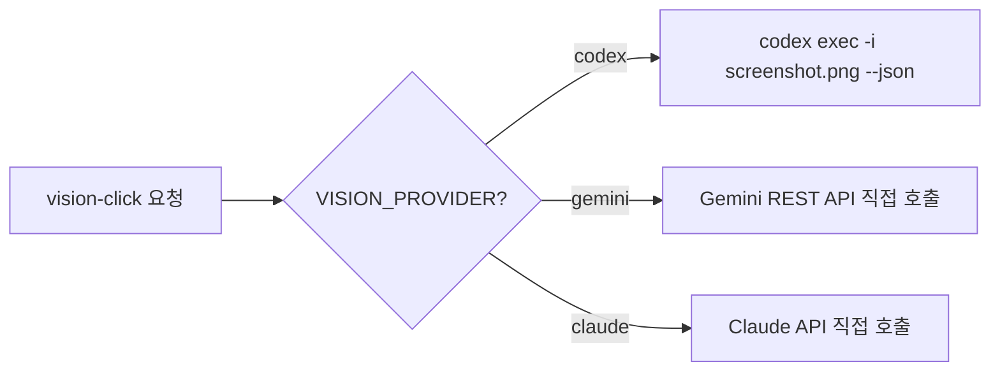

# Vision Click — Gemini CLI 방식

> Gemini CLI는 stdin으로 바이너리 이미지를 받을 수 없음. **파일 경로 기반 우회 필요.**

---

## 핵심 요약

| 항목               | 값                                          |
| ------------------ | ------------------------------------------- |
| **CLI 명령**       | `gemini -p "..." -o json -y`                |
| **이미지 전달**    | ❌ `--image` 플래그 없음                     |
| **stdin pipe**     | ⚠️ 텍스트만 지원 (바이너리 → null byte 에러) |
| **파일 경로 방식** | ✅ `Read` 도구로 파일 읽기 가능 (비전 아님)  |
| **추천도**         | ⭐⭐ — 직접 이미지 입력 불가, 우회 필요       |

---

## 스모크 테스트 결과

### 테스트 1: stdin 바이너리 파이프 (JSON 출력)

```bash
cat /tmp/vision-test-ui.png | gemini -p 'Find LOGIN button (800x600). Return JSON.' -o json -y
```

**결과:** `{"x": 574, "y": 316}` — **실제 (400, 275)에서 ~200px 벗어남** ❌

> Gemini CLI는 stdin PNG 바이너리를 이미지가 아닌 텍스트로 해석. 좌표가 완전히 부정확.

### 테스트 2: stdin 바이너리 파이프 (text 출력)

```bash
cat /tmp/vision-test-ui.png | gemini -p 'Find LOGIN button. Return JSON.' -o text -y
```

**결과:**
- null byte 에러 다수 발생: `The argument 'path' must be a string without null bytes`
- `{"found": true, "x": 400, "y": 386}` — y좌표 ~100px 오차
- binary data가 파일 경로로 오인식됨

### Context7 조사

> Gemini CLI headless docs (context7): stdin은 **text-based** 파이핑만 문서화되어 있음. 이미지 바이너리를 stdin으로 보내는 것은 지원 기능이 아님.
>
> 출처: [gemini-cli headless.md](https://github.com/google-gemini/gemini-cli/blob/main/docs/cli/headless.md)

---

## 대안: Gemini REST API 직접 호출

Gemini CLI로는 불가하지만, **REST API를 직접 호출**하면 네이티브 bbox grounding 사용 가능:

```javascript
// src/browser/vision.js — Gemini REST API 방식 (기존 코드)
async function geminiAnalyze(screenshotB64, query, viewport) {
    const { GoogleGenerativeAI } = await import('@google/generative-ai');
    const genAI = new GoogleGenerativeAI(process.env.GEMINI_API_KEY);
    const model = genAI.getGenerativeModel({
        model: process.env.VISION_MODEL || 'gemini-3-flash-preview',
        generationConfig: { responseMimeType: 'application/json' },
    });

    const result = await model.generateContent([
        { inlineData: { mimeType: 'image/png', data: screenshotB64 } },
        { text: `이 스크린샷(${viewport.width}x${viewport.height}px)에서 "${query}"을 찾아줘.
JSON 응답: { "found": boolean, "bbox": [ymin, xmin, ymax, xmax], "confidence": "high"|"medium"|"low", "description": "설명" }
bbox는 0~1000 정규화 좌표.` },
    ]);

    const parsed = JSON.parse(result.response.text());
    if (!parsed.found) return { found: false };

    const [ymin, xmin, ymax, xmax] = parsed.bbox;
    return {
        found: true,
        x: Math.round(((xmin + xmax) / 2) * viewport.width / 1000),
        y: Math.round(((ymin + ymax) / 2) * viewport.height / 1000),
        confidence: parsed.confidence,
        description: parsed.description,
    };
}
```

### Gemini API 장점

| 항목        | Gemini REST API          | Gemini CLI |
| ----------- | ------------------------ | ---------- |
| 이미지 입력 | ✅ base64 inlineData      | ❌ 불가     |
| bbox 출력   | ✅ 0~1000 정규화 네이티브 | —          |
| JSON 강제   | ✅ responseMimeType       | —          |
| 비용        | ~$0.001/호출             | —          |

> [!IMPORTANT]
> Vision-click에서 Gemini를 쓰려면 **CLI가 아니라 REST API 직접 호출** 방식이 필요. cli-claw의 `VISION_PROVIDER=gemini` 설정 시 `@google/generative-ai` SDK를 통해 직접 호출.

---

## cli-claw 통합 방식



Gemini는 CLI wrapper를 사용하지 않고 direct API call이 유일한 방법.

---

## 변경 기록

- 2026-02-24: 스모크 테스트 실패. stdin 바이너리 파이프 미지원 확인. REST API 대안 문서화.
