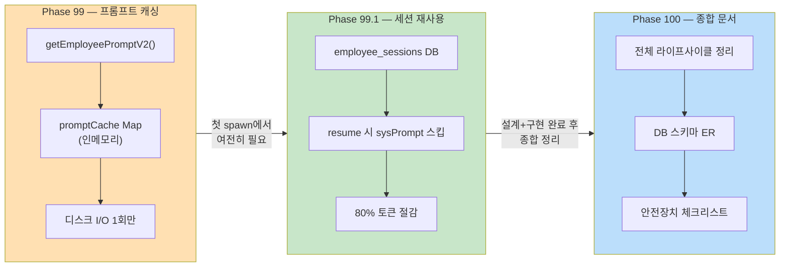
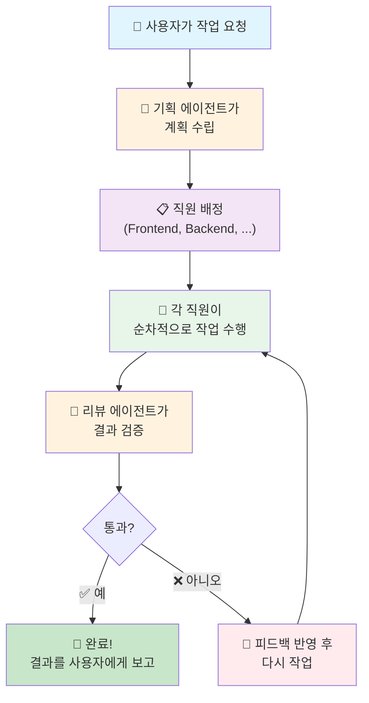
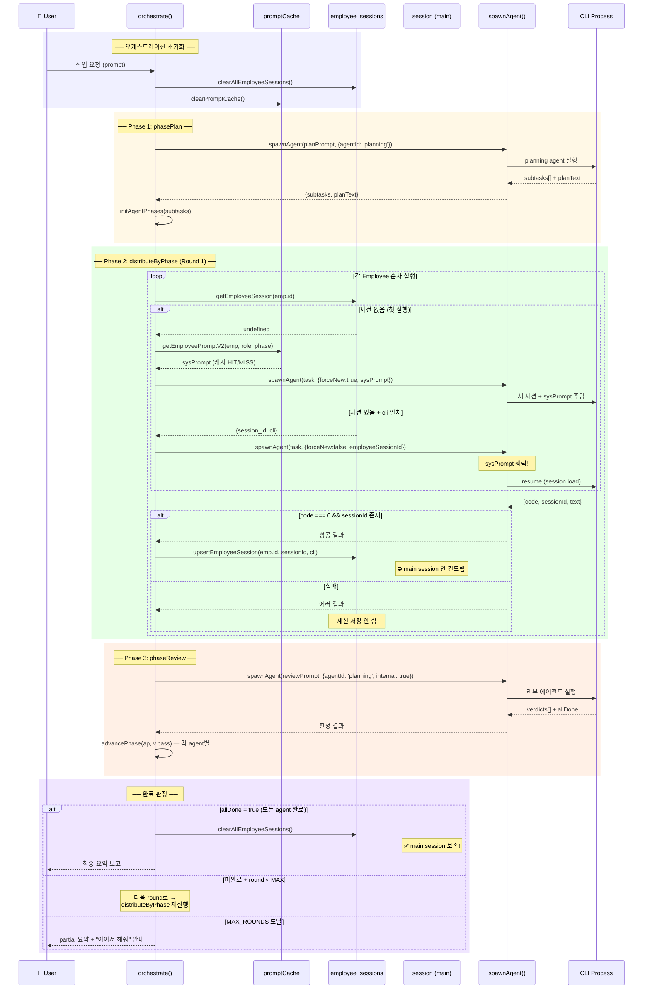
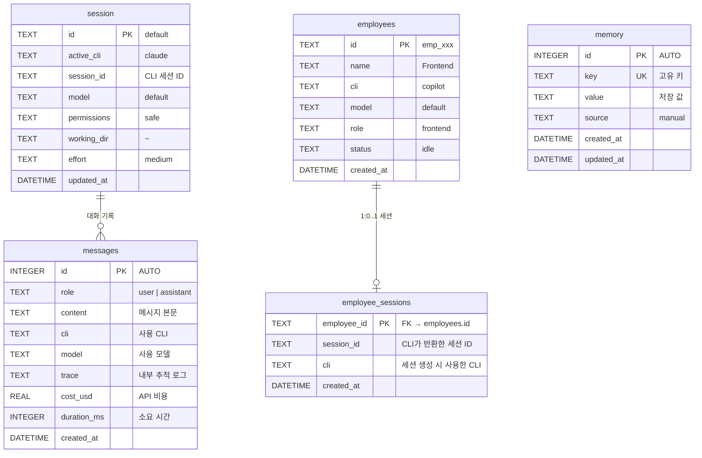
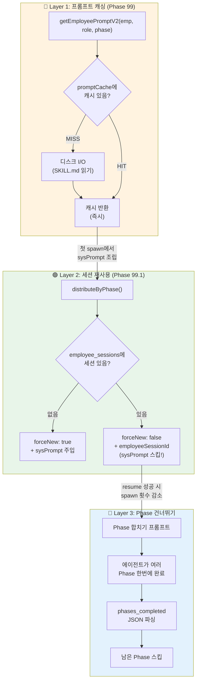
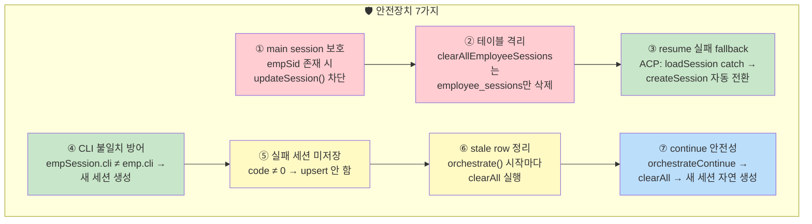
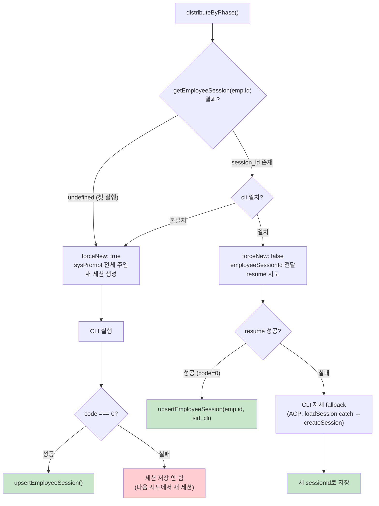

# Phase 100 — 오케스트레이션 세션 아키텍처 종합 문서

> Phase 99(토큰 캐싱) + Phase 99.1(세션 재사용) + Phase 100(종합 아키텍처)
> 작성일: 2026-02-24

---

## 1. 개요

### Phase 99 → 99.1 → 100 관계

- **Phase 99**: `getEmployeePromptV2()`의 SKILL.md 읽기를 인메모리 캐싱 → 같은 role Employee의 반복 디스크 I/O 제거
- **Phase 99.1**: Employee별 CLI 세션을 DB에 저장 → 다음 Phase에서 resume → sysPrompt 재주입 완전 제거
- **Phase 100**: 위 두 Phase를 포함한 전체 오케스트레이션 아키텍처를 종합 문서화

---

## 2. 쉬운 버전: 서브에이전트 호출 요약

> 초보자를 위한 단순 흐름. "사장님이 직원에게 일을 맡기는 과정"

| 단계 | 설명 |
|------|------|
| 사용자 요청 | 자연어로 작업 지시 (예: "로그인 기능 만들어줘") |
| 기획 | Planning Agent가 작업을 분석하고 직원별 subtask 생성 |
| 직원 배정 | DB에 등록된 Employee 중 role에 맞는 직원 매칭 |
| 작업 수행 | 각 직원이 Phase(기획→검증→개발→디버깅→통합) 순서로 실행 |
| 리뷰 | Quality Gate에서 각 직원의 산출물을 pass/fail 판정 |
| 완료 | 모든 직원이 모든 Phase를 통과하면 최종 요약 보고 |

---

## 3. 복잡한 버전: 전체 세션 라이프사이클

> 실제 코드 흐름을 따라간 상세 시퀀스 다이어그램

### main session vs employee session 분리 원칙

| 항목 | main session (`session` 테이블) | employee session (`employee_sessions` 테이블) |
|------|------|------|
| 소유자 | 사용자의 대화 세션 | 오케스트레이션 직원의 CLI 세션 |
| 수명 | 영구 (명시적 리셋까지) | 오케스트레이션 1회 (allDone 시 삭제) |
| 저장 주체 | `spawnAgent()` → `updateSession.run()` | `pipeline.js` → `upsertEmployeeSession.run()` |
| 삭제 조건 | 사용자 명시 요청 | `orchestrate()` 시작 + `allDone=true` |
| 안전장치 | `empSid` 있으면 `updateSession` 차단 | `clearAllEmployeeSessions`는 이 테이블만 |

---

## 4. DB 스키마 ER 다이어그램

### 테이블별 역할

| 테이블 | 용도 | 오케스트레이션 관여 |
|--------|------|-------------------|
| `session` | 사용자 메인 대화 상태 | ❌ 읽기만 (Employee가 건드리지 않음) |
| `employees` | 등록된 직원 목록 | ✅ 배정 대상 조회 |
| `employee_sessions` | 직원별 CLI 세션 ID 캐시 | ✅ 핵심 — resume/저장/삭제 |
| `messages` | 전체 대화 히스토리 | ⚠️ 오케스트레이터 요약만 저장 |
| `memory` | 영구 기억 (key-value) | ❌ 무관 |

---

## 5. 토큰 절감 파이프라인

> Phase 99(캐시) → Phase 99.1(세션) → Phase 건너뛰기: 3단 최적화

### 토큰 절감 수치 비교

| 시나리오 (3 agents × 5 phases) | spawn 횟수 | sysPrompt 주입 | 총 토큰 (추정) |
|------|------|------|------|
| **최적화 없음** | 15회 | 15 × 8,500 = 127,500 chars | ~44K tokens |
| **Phase 99만** (캐시) | 15회 | 15 × 8,500 (조립은 빠르지만 주입은 동일) | ~44K tokens |
| **Phase 99 + 99.1** (캐시 + 세션) | 15회 | 3 × 8,500 = 25,500 chars | ~38K tokens |
| **99 + 99.1 + Phase 건너뛰기** | ~6회 | 3 × 8,500 = 25,500 chars | **~12K tokens** |

---

## 6. Phase별 세션 상태 변화표

> 3 agents (Frontend, Backend, Docs) 오케스트레이션 시 DB 상태 추적

### Round 1 시나리오

| 시점 | `employee_sessions` 상태 | `session` (main) | 비고 |
|------|--------------------------|------------------|------|
| `orchestrate()` 진입 | `DELETE ALL` → 빈 테이블 | 변경 없음 | 잔여 세션 정리 |
| **Phase 1: Frontend 기획** | | | |
| ├ getEmployeeSession("fe") | → undefined | — | 첫 실행 |
| ├ spawnAgent(forceNew:true) | — | — | sysPrompt 주입 |
| └ 성공 → upsert | `fe → sid_aaa (copilot)` | 변경 없음 | empSid로 main 보호 |
| **Phase 1: Backend 기획** | | | |
| ├ getEmployeeSession("be") | → undefined | — | 첫 실행 |
| ├ spawnAgent(forceNew:true) | — | — | sysPrompt 주입 |
| └ 성공 → upsert | `fe→sid_aaa, be→sid_bbb` | 변경 없음 | |
| **Phase 3: Docs 개발** | | | |
| ├ getEmployeeSession("doc") | → undefined | — | docs는 Phase 1,2 스킵 |
| ├ spawnAgent(forceNew:true) | — | — | sysPrompt 주입 |
| └ 성공 → upsert | `fe→aaa, be→bbb, doc→ccc` | 변경 없음 | |
| **Review → 각 agent PASS** | | | |
| └ advancePhase() | 테이블 변경 없음 | — | 메모리상 phase만 전진 |

### Round 2 시나리오 (세션 재사용 발동!)

| 시점 | `employee_sessions` 상태 | 비고 |
|------|--------------------------|------|
| **Phase 2: Frontend 기획검증** | | |
| ├ getEmployeeSession("fe") | → `{sid_aaa, copilot}` ✅ | 세션 있음! |
| ├ spawnAgent(employeeSessionId: "sid_aaa") | — | **sysPrompt 생략!** |
| └ 성공 → upsert | `fe→sid_aaa` (동일) | resume 성공 |
| **Phase 2: Backend 기획검증** | | |
| ├ getEmployeeSession("be") | → `{sid_bbb, codex}` ✅ | 세션 있음! |
| └ resume 성공 | `be→sid_bbb` | **토큰 절감** |
| **Phase 5: Docs 통합검증** | | |
| ├ getEmployeeSession("doc") | → `{sid_ccc, copilot}` ✅ | Docs는 3→5 (Phase 합치기) |
| └ resume 성공 | `doc→sid_ccc` | |
| **Review → allDone = true** | | |
| └ clearAllEmployeeSessions() | → 빈 테이블 | main session 보존 ✅ |

---

## 7. 안전장치 체크리스트

| # | 위험 | 대책 | 구현 위치 | 검증 방법 |
|---|------|------|----------|----------|
| ① | Employee 세션이 main session 덮어쓰기 | `empSid` 존재 시 `updateSession()` 차단 | `spawn.js` (close/exit 핸들러) | 정적 코드 검사 |
| ② | main session 삭제 | `clearAllEmployeeSessions`는 `employee_sessions`만 대상 | `db.js` prepared statement | DB 단위 테스트 |
| ③ | resume 실패 (만료/무효 세션) | ACP: `loadSession` → catch → `createSession` fallback | `spawn.js` ACP 브랜치 | 통합 테스트 |
| ④ | CLI 변경 (copilot→codex 등) | `empSession.cli !== emp.cli` → `canResume=false` | `pipeline.js` distributeByPhase | 조건 분기 테스트 |
| ⑤ | 실패한 세션 재사용 | `r.code === 0` 일 때만 `upsert` | `pipeline.js` 결과 처리 | 정적 검사 |
| ⑥ | 이전 오케스트레이션 잔여 세션 | `orchestrate()` 시작 시 `clearAllEmployeeSessions()` | `pipeline.js` 진입점 | DB 테스트 |
| ⑦ | "이어서 해줘" 호출 시 stale 세션 | `orchestrateContinue()` → `orchestrate()` → clearAll | `pipeline.js` | 흐름 테스트 |

---

## 8. Resume 실패 시 자동 fallback 흐름

---

## 검증 포인트 (테스트 매핑)

| 검증 항목 | 테스트 파일 |
|----------|-----------|
| employee_sessions 테이블 존재 | `tests/employee-session.test.js` #1 |
| getEmployeeSession 빈 조회 | `tests/employee-session.test.js` #2 |
| upsertEmployeeSession 저장/조회 | `tests/employee-session.test.js` #3, #4 |
| clearAllEmployeeSessions 전체 삭제 | `tests/employee-session.test.js` #5 |
| main session 보호 | `tests/employee-session.test.js` #6 |
| Phase 합치기 프롬프트 | `tests/employee-session.test.js` #7 |
| pipeline employeeSessionId 분기 | `tests/phase-100/employee-session-reuse.test.js` #1 |
| spawn empSid main 차단 | `tests/phase-100/employee-session-reuse.test.js` #2 |
| db clearAll export | `tests/phase-100/employee-session-reuse.test.js` #3 |
