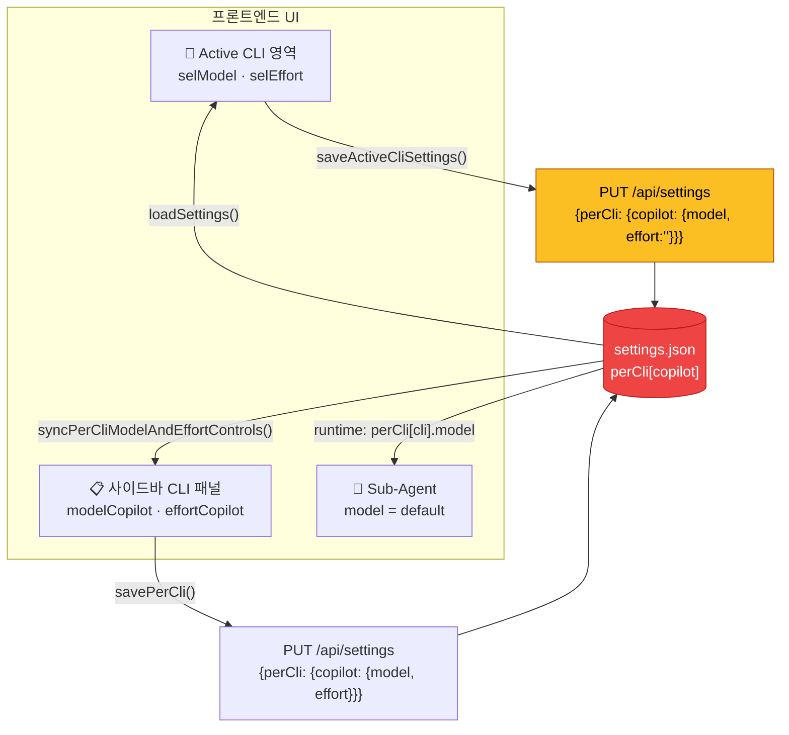
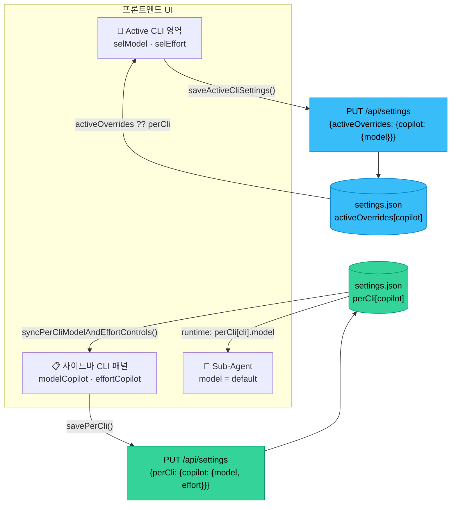

# Phase 8.0: Active CLI ↔ Sidebar perCli 상태 커플링 버그

> 이 문서는 Phase 8의 첫 번째 이슈로, Active CLI 설정과 사이드바(CLI별 패널 + Sub-Agent)의 model/effort 값이 의도치 않게 연동되는 버그를 다룬다.

---

## 현상 (재현)

1. Settings → Active CLI를 **Copilot**으로 선택
2. Model을 `claude-opus-4.6-fast`(또는 아무 모델)로 변경
3. 우측 사이드바 **💙 Copilot** 패널의 Model도 `claude-opus-4.6-fast`로 동기된다
4. **Effort**가 `— none`으로 바뀐다 (원래 저장되어 있던 `high` 등이 사라짐)
5. Sub-Agent(프런트/백엔드)의 Model이 `default`일 때, 이 `default`는 Active CLI의 perCli 값을 그대로 가져오므로 사실상 Active 설정에 종속된다

**기대 동작:** Active CLI 설정 변경은 "현재 세션의 활성 CLI 옵션"만 바꿔야 하며, 사이드바의 CLI별 패널과 Sub-Agent가 독립적으로 관리되어야 한다.

---

## 왜 발생하는가

### 근본 원인: `perCli`가 단일 저장소

Active CLI와 사이드바 CLI별 패널(💙 Copilot, 🔵 Gemini, 🟠 OpenCode 등)이 **동일한 `settings.perCli` 객체**를 읽고 쓴다.

### 현재 흐름 (버그)



> ⚠️ **문제:** 빨간 `settings.json`이 단일 저장소 — Active 변경이 사이드바/Sub-Agent에 연쇄됨

### 개선안 (Option A)



> ✅ **개선:** 파란 `activeOverrides`와 초록 `perCli`가 분리 — Active 변경이 사이드바에 영향 없음

### 코드 흐름 분석

#### 1) `saveActiveCliSettings()` — 부분 덮어쓰기 문제

```js
// settings.js L313-330
export async function saveActiveCliSettings() {
    const cli = document.getElementById('selCli').value;
    const modelSel = document.getElementById('selModel');
    let model = modelSel?.value || 'default';
    // ...
    const perCli = {};
    perCli[cli] = {
        model,
        effort: document.getElementById('selEffort').value,  // ← disabled일 때 ''
    };
    await fetch('/api/settings', {
        method: 'PUT',
        headers: { 'Content-Type': 'application/json' },
        body: JSON.stringify({ perCli }),  // ← 이 CLI의 perCli만 전송
    });
}
```

**문제점:**
- Copilot의 effort는 `effortNote`로 인해 `selEffort`가 **disabled** 상태 → `selEffort.value`는 `''`
- 서버에 `effort: ''`로 저장됨 → 기존에 저장되어 있던 `high` 값이 사라짐
- 사이드바에서 이 perCli를 읽어올 때 effort가 `''`(none)으로 표시됨

#### 2) 사이드바가 같은 perCli를 읽는 구조

```js
// settings.js L66-93 — syncPerCliModelAndEffortControls
for (const cli of getCliKeys()) {
    const selected = settings?.perCli?.[cli]?.model || modelSel.value || '';
    // ...
    const selected = settings?.perCli?.[cli]?.effort || effortSel.value || '';
    // ...
}
```

→ Active CLI에서 방금 저장한 perCli 값이 그대로 사이드바에 반영됨.

#### 3) Sub-Agent의 `default` 해석

```js
// employees.js L66-68
<option value="default"${(!a.model || a.model === 'default') ? ' selected' : ''}>default</option>
```

Sub-Agent의 `default` 모델은 런타임에서 `perCli[cli].model`로 해석된다.
→ Active CLI에서 모델을 바꾸면 Sub-Agent의 실질 모델도 바뀜.

---

## 영향 범위

| 영향 | 설명 | 심각도 |
|---|---|---|
| Effort 손실 | Copilot처럼 `effortNote`가 있는 CLI는 Active에서 저장 시 effort가 `''`로 덮임 | 중 |
| Model 커플링 | Active 모델 변경 → 사이드바 패널에 즉시 반영 | 중 |
| Sub-Agent 연쇄 | `default` 모델을 쓰는 Sub-Agent의 실질 모델이 Active 변경에 의해 변동 | 중 |
| UX 혼란 | 사용자는 독립 패널로 인식하지만 실제는 하나의 저장소를 공유 | 높음 |

---

## 설계 방향 (해결 옵션)

### Option A: Active 전용 필드 분리

```
settings.json
├── cli: 'copilot'              ← 현재 활성 CLI 이름
├── activeOverrides:            ← NEW: Active 전용 일시적 오버라이드
│   └── copilot: {model: 'claude-opus-4.6-fast'}
├── perCli:                     ← 기존: CLI별 기본 설정 (사이드바 + Sub-Agent 참조)
│   └── copilot: {model: 'claude-opus-4.6', effort: 'high'}
```

- Active에서 바꾼 값은 `activeOverrides`에만 기록
- 사이드바/Sub-Agent는 `perCli`만 참조
- 세션 시작 시 `activeOverrides[cli] ?? perCli[cli]`로 해석

### Option B: 저장 시 양방향 동기화 UI 확인

- Active 설정 변경 시 "사이드바 기본값도 함께 변경?" 토글 추가
- 의도적 동기화만 허용

### Option C: perCli를 "기본값" vs "활성값"으로 레이어링

```
perCli[cli].defaults = {model, effort}   // 사이드바/Sub-Agent 참조
perCli[cli].active   = {model, effort}   // Active CLI만 참조
```

**권장: Option A** — 기존 구조 변경 최소, 하위호환 유지 가능.

---

## 충돌 분석

| 대상 파일 | 변경 유형 | 충돌 위험 |
|---|---|---|
| `public/js/features/settings.js` | MODIFY (saveActiveCliSettings, loadSettings, onCliChange) | 중 — 해당 파일이 핵심 |
| `server.js` 또는 `src/config.js` | MODIFY (settings merge logic) | 낮음 |
| `src/agent.js` / `src/orchestrator.js` | MODIFY (default model 해석) | 낮음 |
| `public/js/features/employees.js` | 변경 없음 (default 해석은 런타임 참조) | 없음 |

**Phase 8.1~8.5와 충돌:** 없음 — 보안/응답/라우트 분리와 무관한 UI 상태 관리 이슈.

---

## 즉시 적용 가능한 최소 수정 (hotfix)

effort 덮어쓰기 방지만 먼저 적용:

```diff
 // settings.js — saveActiveCliSettings()
 export async function saveActiveCliSettings() {
     const cli = document.getElementById('selCli').value;
     const modelSel = document.getElementById('selModel');
     let model = modelSel?.value || 'default';
     if (model === '__custom__') {
         model = document.getElementById('selModelCustom')?.value?.trim() || 'default';
     }
+    const effortEl = document.getElementById('selEffort');
     const perCli = {};
     perCli[cli] = {
         model,
-        effort: document.getElementById('selEffort').value,
+        effort: effortEl?.disabled ? undefined : effortEl.value,
     };
     await fetch('/api/settings', {
         method: 'PUT',
         headers: { 'Content-Type': 'application/json' },
         body: JSON.stringify({ perCli }),
     });
 }
```

→ `undefined`는 `JSON.stringify`에서 제외되므로 서버 merge 시 기존 effort를 유지.

---

## 테스트 계획

### 수동 검증

1. Copilot을 Active CLI로 선택 → 모델 변경 → 사이드바 Copilot effort가 유지되는지 확인
2. 사이드바에서 Copilot 모델 변경 → Active CLI 모델이 영향받지 않는지 확인
3. Sub-Agent `default` 모델이 Active 변경에 연쇄되지 않는지 확인

### 자동화 테스트 (향후)

```js
// tests/unit/settings-isolation.test.js
test('saveActiveCliSettings does not overwrite disabled effort', () => {
    // selEffort.disabled = true 일 때 perCli body에 effort 키가 없어야 함
});

test('perCli and activeOverrides are independent', () => {
    // Active 변경이 perCli를 변경하지 않아야 함 (Option A 적용 시)
});
```

---

## 완료 기준

- [x] Copilot Active 모델 변경 시 사이드바 effort가 `''`로 덮이지 않음 (hotfix)
- [x] Active CLI와 사이드바 perCli 패널의 상태가 독립적으로 동작 (Option A 적용)
- [x] Sub-Agent `default`의 해석이 명확히 문서화됨
- [x] 기존 `npm test` 통과 (회귀 없음)

> ✅ **완료됨** — `activeOverrides` 분리가 `settings.js`, `server.js`, `agent.js`에 반영됨 (2026-02-25 확인).
