# Phase 99.1 — Employee 세션 재사용 (설계 문서)

> 목표: 오케스트레이션 동안 같은 Employee가 Phase를 넘어갈 때 CLI 세션을 재사용 → sysPrompt 재주입 제거 → 토큰 대폭 절감
> 상태: ⏳ 설계 완료, 구현 대기 (주니 검증 후 착수)

---

## 1. 현재 문제

Employee spawn은 항상 `forceNew: true` → 매번 새 CLI 세션 생성.


**낭비**: 3 agents × 5 phases = 15번 sysPrompt 재주입 (1 round 기준)

---

## 2. 제안: Employee 세션 DB

### 2.1. 핵심 아이디어

- Employee별로 session_id를 DB에 저장
- 같은 Employee가 다음 Phase 진입 시 → 저장된 세션으로 resume
- `allDone = true` 판정 시 → employee_sessions 테이블 **전체 삭제** (main은 보존)

### 2.2. DB 스키마

```sql
CREATE TABLE IF NOT EXISTS employee_sessions (
    employee_id TEXT PRIMARY KEY,   -- emp.id
    session_id  TEXT,               -- CLI가 반환한 session ID
    cli         TEXT,               -- 세션 생성 시 사용한 CLI
    created_at  DATETIME DEFAULT CURRENT_TIMESTAMP
);
```

> ⚠️ `worklog_id` 컬럼 불필요 — 오케스트레이션은 항상 1개만 순차 실행, allDone 시 전체 삭제.

### 2.3. Prepared Statements

```js
// src/core/db.js에 추가
export const getEmployeeSession = db.prepare(
    'SELECT * FROM employee_sessions WHERE employee_id = ?'
);
export const upsertEmployeeSession = db.prepare(
    'INSERT OR REPLACE INTO employee_sessions (employee_id, session_id, cli) VALUES (?, ?, ?)'
);
export const clearAllEmployeeSessions = db.prepare(
    'DELETE FROM employee_sessions'
);
```

---

## 3. 변경 대상 파일

### 3.1. src/core/db.js — 스키마 + 쿼리 추가

```diff
+ CREATE TABLE IF NOT EXISTS employee_sessions (
+     employee_id TEXT PRIMARY KEY,
+     session_id  TEXT,
+     cli         TEXT,
+     created_at  DATETIME DEFAULT CURRENT_TIMESTAMP
+ );

+ export const getEmployeeSession = db.prepare('SELECT * FROM employee_sessions WHERE employee_id = ?');
+ export const upsertEmployeeSession = db.prepare('INSERT OR REPLACE INTO employee_sessions (employee_id, session_id, cli) VALUES (?, ?, ?)');
+ export const clearAllEmployeeSessions = db.prepare('DELETE FROM employee_sessions');
```

### 3.2. src/agent/spawn.js — opts.employeeSessionId 지원

현재 (L166):
```js
const isResume = !forceNew && session.session_id && session.active_cli === cli;
```

변경 후:
```js
// Employee 세션 resume: opts.employeeSessionId가 있으면 그걸로 resume
// ⚠️ main session (session 테이블)과는 완전 분리
const empSid = opts.employeeSessionId || null;
const isResume = empSid
    ? true                                          // employee resume
    : (!forceNew && session.session_id && session.active_cli === cli);  // main resume (기존)
const resumeSessionId = empSid || session.session_id;
```

세션 저장 분기 (L321, L439):
```js
// 기존: main session 저장
if (!forceNew && ctx.sessionId && code === 0) {
    updateSession.run(cli, ctx.sessionId, ...);
}

// 변경: employee resume인 경우 main session 저장 차단
if (!forceNew && !empSid && ctx.sessionId && code === 0) {
    updateSession.run(cli, ctx.sessionId, ...);  // main만
}
```

> ⚠️ **핵심 안전장치**: `empSid`가 있으면 `updateSession` (main session 테이블) 호출 안 함.
> Employee 세션 저장은 pipeline.js에서 `upsertEmployeeSession()`으로 별도 처리.

### 3.3. src/orchestrator/pipeline.js — 세션 조회/저장/삭제

```diff
  // import 추가
+ import { getEmployeeSession, upsertEmployeeSession, clearAllEmployeeSessions } from '../core/db.js';
```

#### distributeByPhase() 내 spawn 부분:

```js
// 현재
const { promise } = spawnAgent(taskPrompt, {
    agentId: emp.id, cli: emp.cli, model: emp.model,
    forceNew: true, sysPrompt, origin: meta.origin || 'web',
});

// 변경
const empSession = getEmployeeSession.get(emp.id);
const canResume = empSession?.session_id && empSession.cli === emp.cli;

const { promise } = spawnAgent(taskPrompt, {
    agentId: emp.id, cli: emp.cli, model: emp.model,
    forceNew: !canResume,
    employeeSessionId: canResume ? empSession.session_id : undefined,
    sysPrompt: canResume ? undefined : sysPrompt,  // resume이면 sysPrompt 불필요
    origin: meta.origin || 'web',
});

const r = await promise;

// 성공 시 세션 저장
if (r.code === 0 && r.sessionId) {
    upsertEmployeeSession.run(emp.id, r.sessionId, emp.cli);
}
```

#### orchestrate() 시작/완료:

```js
// 시작 시: 이전 잔여 세션 정리
clearAllEmployeeSessions.run();
clearPromptCache();

// allDone = true 블록에서:
clearAllEmployeeSessions.run();  // 전체 삭제 (main은 안 건드림)
```

---

## 4. 세션 흐름 (After)


---

## 5. 안전장치 목록

| # | 위험 | 대책 | 구현 위치 |
|---|------|------|----------|
| 1 | Employee 세션이 main session 덮어쓰기 | `empSid` 존재 시 `updateSession()` 차단 | spawn.js L321, L439 |
| 2 | main session 삭제 | `clearAllEmployeeSessions`는 **employee_sessions** 테이블만 대상 | db.js |
| 3 | resume 실패 (만료/무효 세션) | ACP: `loadSession` catch → `createSession` fallback (기존 패턴) | spawn.js L284-290 |
| 4 | CLI 불일치 | `empSession.cli !== emp.cli` → resume 안 함, 새 세션 | pipeline.js |
| 5 | 중간 실패 (code ≠ 0) | `r.code === 0` 일 때만 upsert → 실패 세션 저장 안 함 | pipeline.js |
| 6 | stale row (중단 후 재시작) | `orchestrate()` 시작 시 `clearAllEmployeeSessions()` | pipeline.js |
| 7 | `orchestrateContinue` 호출 시 | 이어서 하면 세션 없음 → 자연스럽게 새 세션 생성 | pipeline.js |

---

## 6. 토큰 절감 예상

### Before (Phase 99 캐시만 적용)
```
3 agents × 5 phases × 1 round = 15 spawn
매 spawn: sysPrompt 주입 (~8,500 chars)
총 sysPrompt: 15 × 8,500 = 127,500 chars (~32K tokens)
```

### After (Phase 99.1 세션 재사용)
```
3 agents × 5 phases × 1 round = 15 spawn
첫 spawn만 sysPrompt: 3 × 8,500 = 25,500 chars (~6.4K tokens)
나머지 12 spawn: resume (sysPrompt 0)
총 sysPrompt: 25,500 chars (~6.4K tokens)
```


---

## 7. 엣지 케이스 상세

### 7.1. Resume 실패 시 자동 fallback


### 7.2. 오케스트레이션 중단/재시작


---

## 8. Phase 99 캐시와의 관계

> **결론: Phase 99 (인메모리 캐시)는 그대로 유지**

```mermaid
graph TD
    subgraph L1["레이어 1: 프롬프트 조립 (Phase 99)"]
        P1["getEmployeePromptV2()"]
        P2["promptCache Map"]
        P3["디스크 I/O 캐싱"]
        P1 --> P2 --> P3
    end

    subgraph L2["레이어 2: 세션 재사용 (Phase 99.1)"]
        S1["spawnAgent()"]
        S2["employee_sessions DB"]
        S3["sysPrompt 주입 스킵"]
        S1 --> S2 --> S3
    end

    L1 -.->|"첫 spawn에서<br/>여전히 필요"| L2

    style L1 fill:#ffe0b2
    style L2 fill:#c8e6c9
```



| 시나리오 | Phase 99 | Phase 99.1 | 결과 |
|---------|----------|------------|------|
| 첫 spawn (캐시 MISS + 세션 없음) | ✅ 디스크 I/O 캐싱 | ❌ 새 세션 생성 | sysPrompt 조립은 캐시로 빠르게 |
| 같은 role 다른 employee (캐시 HIT + 세션 없음) | ✅ 즉시 반환 | ❌ 새 세션 | sysPrompt 텍스트만 캐시에서 |
| 같은 employee 다음 phase (캐시 HIT + 세션 있음) | ✅ (불필요 — resume이니까) | ✅ resume → sysPrompt 안 보냄 | **최대 절감** |

**두 레이어는 보완 관계 — 99를 삭제하면 첫 spawn에서 매번 디스크 I/O 발생.**

---

## 9. Phase 건너뛰기 프롬프트 개선

### 9.1. 현재 문제

현재 `taskPrompt`의 Phase 유연성 섹션이 **너무 소극적**:

```
## Phase 유연성
현재 Phase의 작업을 수행하되, **자신있다면 다음 Phase까지 한 번에 처리해도 됩니다.**
```

→ Employee가 보수적으로 Phase 1개만 처리하는 경향 → spawn 횟수 증가 → 토큰 낭비

### 9.2. 개선안 (적극 유도)

```diff
- ## Phase 유연성
- 현재 Phase의 작업을 수행하되, **자신있다면 다음 Phase까지 한 번에 처리해도 됩니다.**
- 예: 기획과 개발을 동시에 → 기획 분석 + 코드 작성까지 한 번에 완료.
+ ## Phase 합치기 (적극 권장 ⚡)
+ **가능한 한 여러 Phase를 한 번에 완료하세요.** 한 Phase만 하는 것보다 합쳐서 하는 것이 항상 효율적입니다.
+
+ | 작업 유형 | 권장 합치기 |
+ |----------|-----------|
+ | 간단한 수정/버그픽스 | Phase 3~5 전부 한 번에 |
+ | 명확한 기능 추가 | Phase 1~3 한 번에 (기획+개발) |
+ | 코드 수정 + 테스트 | Phase 3~4 한 번에 |
+ | 문서 작업 | Phase 3+5 한 번에 |
+
+ **1 Phase만 하는 것은 작업이 복잡하거나 불확실할 때만 허용됩니다.**
```

### 9.3. 효과 시뮬레이션


### 9.4. 구현 변경 (pipeline.js)

`distributeByPhase()` 안의 `taskPrompt` 템플릿을 수정:

```js
// 현재 (L228-238)
const taskPrompt = `...
## Phase 유연성
현재 Phase의 작업을 수행하되, **자신있다면 다음 Phase까지 한 번에 처리해도 됩니다.**
...`;

// 변경
const taskPrompt = `...
## Phase 합치기 (적극 권장 ⚡)
**가능한 한 여러 Phase를 한 번에 완료하세요.** 1 Phase만 하는 것은 작업이 불확실할 때만 허용됩니다.
- 간단한 수정/버그픽스 → Phase 3~5 전부 한 번에
- 명확한 기능 추가 → Phase 1~3 한 번에
- 코드 수정 + 테스트 → Phase 3~4 한 번에
...`;
```

> ⚠️ `phases_completed` JSON 파싱 로직 (L278-292)은 이미 구현되어 있으므로 프롬프트만 변경하면 됨.

### 9.5. 99.1과의 시너지

| | 세션 재사용만 | Phase 합치기만 | **둘 다 적용** |
|---|---|---|---|
| spawn 횟수 (3 agents × 5 phases) | 15회 (그대로) | ~6회 (67% 감소) | **~6회** |
| sysPrompt 주입 | 3회 (80% 감소) | 6회 (60% 감소) | **3회 (80% 감소)** |
| 총 토큰 (1 round) | ~38K | ~19K | **~12K** |

---

## 10. 구현 체크리스트 (주니 검증 후 착수)

- [ ] `src/core/db.js` — employee_sessions 테이블 + 쿼리 3개
- [ ] `src/agent/spawn.js` — `opts.employeeSessionId` 분기 + main persist 차단
- [ ] `src/orchestrator/pipeline.js` — 세션 조회/저장/삭제 로직
- [ ] `src/orchestrator/pipeline.js` — Phase 합치기 프롬프트 적극화
- [ ] 기존 테스트 (`npm test`) 통과 확인
- [ ] phase-99.md 업데이트 (99.1 링크 추가)

---

## 11. 주니 확인 사항

1. **Phase 99 유지**: 캐시는 그대로 둠 — 첫 spawn 조립 시 여전히 필요, 99.1과 보완 관계
2. **main session 보존**: `session` 테이블은 절대 안 건드림. `employee_sessions`만 CRUD.
3. **전체 삭제 전략**: `allDone = true` + `orchestrate() 시작` 시 `DELETE FROM employee_sessions` (WHERE 없이 전체)
4. **forceNew 변경**: Employee에 대해서만 `false` 전환, main agent는 기존 로직 유지
5. **resume 실패 시**: CLI가 자체 fallback (새 세션 생성) → 정상 동작
6. **Phase 합치기 프롬프트**: 소극적 → 적극적 유도, phases_completed 파싱 기존 코드 활용
