# Phase 17 — 에이전트 토큰 주입 분석 및 개선 방안

> 목표: 프롬프트가 어떻게 조립/주입되는지 정밀 측정, 왜 토큰이 쌓이는지 보고, 개선안 제시

---

## 1. 프롬프트 조립 파이프라인

```mermaid
graph TD
    A["getSystemPrompt()"] --> B["A1 (hardcoded)"]
    A --> C["A2 (file)"]
    A --> D["Session Memory"]
    A --> E["Core Memory"]
    A --> F["Employees + Dispatch"]
    A --> G["Heartbeat Jobs"]
    A --> H["Skills System"]
    A --> I["Vision-Click Hint"]

    SA["getSubAgentPromptV2()"] --> J["Base Rules"]
    SA --> K["dev SKILL.md"]
    SA --> L["Role SKILL.md"]
    SA --> M["Testing SKILL.md (P4만)"]
    SA --> N["Phase Gate"]
```



---

## 2. 실측 토큰 브레이크다운 (2026-02-25 기준)

### Main Agent (`getSystemPrompt()`)

| 레이어 | 크기 (chars) | ~토큰 | 소스 |
|--------|-------------|-------|------|
| A1 (Core Rules) | 3,990 | ~998 | 하드코딩 (`prompt.js`) |
| A2 (User Config) | 352 | ~88 | `~/.cli-claw/prompts/A-2.md` |
| Session Memory | 186 | ~47 | `~/.claude/projects/.../memory/*.md` (10K cap) |
| Core Memory | 1,394 | ~349 | `~/.cli-claw/memory/MEMORY.md` (1.5K cap) |
| Orchestration System | 1,011 | ~253 | DB employees + dispatch format |
| Heartbeat Jobs | 303 | ~76 | `~/.cli-claw/heartbeat.json` |
| Skills System | 2,495 | ~624 | 17 active 이름 + 104 ref CSV |
| **총계** | **9,394** | **~2,349** | |

### Sub-Agent (`getSubAgentPromptV2()`)

| 구성 | chars | ~토큰 |
|------|-------|-------|
| Base (rules + browser + TG + memory + active skills) | 1,454 | ~364 |
| dev SKILL.md | 3,086 | ~772 |
| dev-frontend SKILL.md | 4,232 | ~1,058 |
| Phase Gate (context + rules) | ~500 | ~125 |
| **Frontend Phase 1-3,5 총계** | **~8,500** | **~2,125** |
| + dev-testing SKILL.md (Phase 4만) | +3,881 | +970 |
| **Frontend Phase 4 총계** | **~12,354** | **~3,089** |

### 참고: 스킬 파일 크기 Top 5

| 스킬 | 크기 |
|------|------|
| docx | 17,091 |
| xlsx | 11,027 |
| notion | 10,138 |
| imagegen | 9,916 |
| github | 5,719 |

---

## 3. 오케스트레이션 토큰 사용 시나리오

### Case: 3 agents × 5 phases × 1 round (최소)

```
Plan spawn:      1 × 9,394 =   9,394 chars
Sub-agent spawn: 3 × 5 × 8,500 = 127,500 chars  ← 핵심 낭비
+ taskPrompt:    15 × ~2,000  =  30,000 chars
Review spawn:    1 × 9,394    =   9,394 chars
────────────────────────────────
총계:                           ~176,000 chars (~44,000 tokens)
```

### Case: 3 agents × 5 phases × 3 rounds (최악)

```
Plan:    3 ×  9,394  =  28,182
Agents: 45 ×  8,500  = 382,500  ← 이게 문제
Task:   45 ×  2,000  =  90,000
Review:  3 ×  9,394  =  28,182
────────────────────────────────
총계:                  ~528,864 chars (~132,000 tokens)
```

---

## 4. 왜 이렇게 쌓이나?

### 핵심: **매 spawn마다 프롬프트 전체 재생성**

```text
distributeByPhase() loop:
  for each active agent:
    sysPrompt = getSubAgentPromptV2(emp, role, phase)  ← 디스크 I/O 3-4회
    taskPrompt = "## 작업 지시..." + worklog + prior results
    spawnAgent(taskPrompt, { sysPrompt, forceNew: true })
      → agent.js: buildArgs(cli, ..., sysPrompt)
        → Claude: --append-system-prompt <sysPrompt 전체>
        → Codex: regenerateB() → AGENTS.md 파일 재작성
        → Gemini: GEMINI_SYSTEM_MD 임시파일 재작성
```

| 낭비 패턴 | 설명 |
|-----------|------|
| **디스크 I/O 반복** | `readFileSync(dev/SKILL.md)` + `readFileSync(dev-frontend/SKILL.md)` 매 phase마다 |
| **동일 sysPrompt 재생성** | 같은 agent(같은 role)는 phase만 바뀌고 스킬 내용 동일 → 그런데 매번 처음부터 조립 |
| **regenerateB() 중복** | Codex/OpenCode 경로에서 `regenerateB()` → B.md + AGENTS.md 재작성, 내용 같아도 |
| **Claude --append 이중 주입** | main agent의 `--append-system-prompt`에 orchestration rules + skills 포함 → sub-agent는 자체 rules + skills 포함 → 둘 다 주입 |

---

## 4.1. 세션 ID 라이프사이클 (핵심 문제 지점)

> **session_id**는 CLI(Claude/Codex/Copilot)와의 대화 연속성을 유지하는 키.
> 이 값이 잘못 관리되면 **이전 대화가 누적되거나**, **세션을 못 찾아 에러**가 발생한다.

### 세션 관련 코드 위치

| 파일 | 라인 | 역할 |
|------|------|------|
| `src/core/db.js` L13 | `session_id TEXT` | DB 스키마 — session 테이블에 저장 |
| `src/core/db.js` L63 | `getSession()` | 현재 세션 정보 조회 (active_cli, session_id, model 등) |
| `src/core/db.js` L64 | `updateSession.run()` | 세션 정보 업데이트 (session_id 포함) |
| `src/agent/spawn.js` L166 | `isResume = !forceNew && session.session_id && ...` | **세션 재사용 판정** — forceNew=false + session_id 있음 + 같은 CLI |
| `src/agent/spawn.js` L174 | `buildResumeArgs(cli, ..., session.session_id, ...)` | 기존 세션으로 이어서 대화 |
| `src/agent/spawn.js` L284-293 | `acp.loadSession()` / `acp.createSession()` | ACP(Copilot): 세션 로드 or 새 세션 생성 |
| `src/agent/spawn.js` L296-301 | `ctx.fullText = ''` 리셋 | **P4 핫픽스**: loadSession 리플레이 후 누적 텍스트 초기화 |
| `src/agent/spawn.js` L321-322 | `updateSession.run(cli, ctx.sessionId, ...)` | 정상 종료 시 session_id 저장 |
| `src/prompt.js` L516-520 | `updateSession.run(..., null, ...)` | **regenerateB()에서 session_id = null로 무효화** |

### 4.1.1. 세션 Resume vs ForceNew 분기

```mermaid
flowchart TD
    SP["spawnAgent(prompt, opts)"] --> GS["getSession() from DB"]
    GS --> CHK{isResume?}

    CHK -- "조건 3개 모두 충족" --> RESUME["세션 재사용"]
    CHK -- "하나라도 미충족" --> NEW["새 세션 생성"]

    subgraph RESUME_COND["isResume 조건 (ALL 필요)"]
        C1["① forceNew === false"]
        C2["② session.session_id 존재 (not null)"]
        C3["③ session.active_cli === 현재 cli"]
    end

    RESUME --> RA["buildResumeArgs(session_id)"]
    RA --> CLI_R{"CLI 종류"}
    CLI_R -- Claude --> CR["claude --resume <session_id>"]
    CLI_R -- Copilot/ACP --> ACP_R["acp.loadSession(session_id)"]
    CLI_R -- Codex --> CX_R["codex --session <session_id>"]

    NEW --> NA["buildNewArgs(sysPrompt)"]
    NA --> CLI_N{"CLI 종류"}
    CLI_N -- Claude --> CN["claude --append-system-prompt ..."]
    CLI_N -- Copilot/ACP --> ACP_N["acp.createSession(workDir)"]
    CLI_N -- Codex --> CX_N["codex (AGENTS.md 재작성)"]

    style CHK fill:#ff9,stroke:#f90,stroke-width:3px
    style C2 fill:#faa,stroke:#f00,stroke-width:2px
```



### 4.1.2. 오케스트레이션에서의 세션 ID 흐름

```mermaid
sequenceDiagram
    participant U as 사용자
    participant O as orchestrate()
    participant DB as session DB
    participant S as spawnAgent()
    participant CLI as CLI 프로세스

    U->>O: 작업 요청
    O->>DB: getSession()
    DB-->>O: {session_id: "abc123", active_cli: "copilot"}

    Note over O: ── Plan Phase ──
    O->>S: spawnAgent(planPrompt, {agentId: "planning"})
    Note over S: forceNew=false → isResume 판정
    S->>DB: getSession()
    DB-->>S: session_id: "abc123"
    S->>CLI: resume session "abc123"
    CLI-->>S: plan 결과
    S->>DB: updateSession(cli, "abc123", ...)
    Note over DB: session_id 유지됨

    Note over O: ── Distribute Phase ──
    loop 각 employee (forceNew: true)
        O->>S: spawnAgent(taskPrompt, {forceNew: true, sysPrompt, cli: emp.cli})
        Note over S: ⚠️ forceNew=true → isResume=false<br/>항상 새 세션 생성!
        S->>CLI: 새 세션 시작
        CLI-->>S: 작업 결과 + 새 sessionId: "xyz789"
        Note over S: forceNew이므로<br/>session_id 저장 안 함 (L321 조건)
    end

    Note over O: ── Review Phase ──
    O->>S: spawnAgent(reviewPrompt, {internal: true})
    Note over S: internal=true, forceNew=false<br/>→ isResume 가능
    S->>DB: getSession()
    DB-->>S: session_id: "abc123" (Plan때 저장된 것)
    S->>CLI: resume "abc123"
    CLI-->>S: 리뷰 결과

    Note over O,DB: ⚠️ 핵심: employee spawn은 forceNew=true<br/>→ 매번 새 세션 (세션 재사용 불가)<br/>→ 시스템 프롬프트 매번 재주입 필요
```



### 4.1.3. regenerateB()의 세션 무효화


### 4.1.4. 세션 ID 문제 요약표

| 문제 | 원인 | 위치 | 영향 |
|------|------|------|------|
| **Employee 세션 재사용 불가** | `forceNew: true` 고정 | orchestrator.js L207 | 매 spawn마다 sysPrompt 전체 재주입 |
| **세션 무효화 시 재생성** | `regenerateB()`에서 `session_id = null` | prompt.js L518 | 설정 변경 후 첫 대화에서 이전 컨텍스트 손실 |
| **ACP loadSession 리플레이** | `acp.loadSession()`이 전체 히스토리 재전송 | spawn.js L286 | P4에서 수정 — `ctx.fullText = ''` 리셋으로 해결 |
| **Plan/Review 세션 공유** | 둘 다 main session_id 사용 | spawn.js L166 | Plan 결과가 Review 컨텍스트에 누적 (의도적) |

---

## 5. 개선안

### Option A: SQLite 세션 캐싱 (주니 제안 ✅ 추천)

```sql
-- db.js에 추가
CREATE TABLE IF NOT EXISTS prompt_cache (
    agent_id    TEXT PRIMARY KEY,      -- 'main' 또는 employee ID
    role        TEXT,
    prompt_hash TEXT,                  -- 입력 변경 감지용
    prompt_text TEXT,                  -- 조립된 프롬프트 캐시
    created_at  DATETIME DEFAULT CURRENT_TIMESTAMP
);
```

**흐름**:
1. `getSubAgentPromptV2()` 호출 전에 DB 캐시에서 `(agent_id, role)` 조회
2. 입력(스킬 목록 + role + phase)의 hash 비교 → 같으면 캐시 반환
3. 다르면 재생성 + 캐시 업데이트

**장점**: 디스크 I/O 제거 + 프롬프트 조립 스킵 + 워크플로우 변경 불필요
**예상 효과**: 15회 readFileSync → 1회 (첫 spawn만)

### Option B: 인메모리 Map 캐싱 (가벼운 대안)

```js
// prompt.js 상단
const promptCache = new Map();  // key: `${role}:${phase}` → value: prompt string

export function getSubAgentPromptV2(emp, role, currentPhase) {
    const cacheKey = `${role}:${currentPhase}`;
    if (promptCache.has(cacheKey)) return promptCache.get(cacheKey);
    // ... 기존 조립 로직 ...
    promptCache.set(cacheKey, prompt);
    return prompt;
}

// orchestrate() 시작 시 캐시 클리어
export function clearPromptCache() { promptCache.clear(); }
```

**장점**: 구현 1분, 코드 5줄
**단점**: 프로세스 재시작 시 사라짐 (but orchestration은 단일 프로세스 내에서 완료)

### Option C: 프롬프트 분리 (중기)

스킬 내용을 프롬프트에서 분리 → 스킬 이름만 주입 + 첫 메시지에서 "이 스킬 파일을 읽어라" 지시

```diff
- prompt += `\n\n## Development Guide (Common)\n${fs.readFileSync(devCommonPath, 'utf8')}`;
+ prompt += `\n\n## Development Guide\nRead: ~/.cli-claw/skills/dev/SKILL.md`;
```

**장점**: 토큰 70% 감소 (8,500 → 2,500)
**단점**: 에이전트가 스킬 파일 읽기 실행해야 함 → latency + 추가 tool use

---

## 6. 추천 실행 순서

| 우선순위 | 작업 | 예상 토큰 절감 | 난이도 |
|---------|------|---------------|--------|
| **P0** | Option B: 인메모리 캐싱 | 15회→1회 I/O | 5줄 |
| **P1** | Option A: SQLite 캐시 테이블 | 프로세스 간 재사용 | 20줄 |
| **P2** | Option C: 스킬 참조화 | ~70% 토큰 절감 | CLI 의존 |

> [!IMPORTANT]
> Option B만으로도 즉각 효과. A는 B 위에 얹으면 되고, C는 별도 검증 필요.

## 7. 워크플로우 다이어그램

### 7-1. Before: 캐시 없는 낭비 패턴

```mermaid
sequenceDiagram
    participant O as orchestrator.js
    participant P as prompt.js
    participant D as 디스크 (SKILL.md)
    participant A as spawnAgent()

    Note over O: distributeByPhase() — 3 agents × 5 phases
    loop 매 spawn (최대 15~45회)
        O->>P: getEmployeePromptV2(emp, role, phase)
        P->>D: readFileSync(dev/SKILL.md)
        D-->>P: 3,086 chars
        P->>D: readFileSync(dev-frontend/SKILL.md)
        D-->>P: 4,232 chars
        P->>D: readFileSync(dev-testing/SKILL.md) [Phase 4만]
        D-->>P: 3,881 chars
        P-->>O: sysPrompt (~8,500 chars)
        O->>A: spawnAgent(taskPrompt, { sysPrompt })
        Note over A: CLI별 재주입<br/>Claude: --append-system-prompt<br/>Codex: AGENTS.md 재작성<br/>Gemini: 임시파일 재작성
    end
    Note over O,A: ❌ 총 I/O: 45회 × 3파일 = 135회 readFileSync
```



### 7-2. After: 인메모리 캐시 적용

```mermaid
sequenceDiagram
    participant O as orchestrator.js
    participant C as promptCache (Map)
    participant P as prompt.js
    participant D as 디스크 (SKILL.md)
    participant A as spawnAgent()

    O->>C: clearPromptCache()
    Note over C: Map.clear()

    rect rgb(200, 255, 200)
        Note over O: 첫 spawn (캐시 MISS)
        O->>P: getEmployeePromptV2(emp, "backend", 3)
        P->>C: has("emp1:backend:3")?
        C-->>P: ❌ MISS
        P->>D: readFileSync(dev/SKILL.md)
        P->>D: readFileSync(dev-backend/SKILL.md)
        P-->>C: set("emp1:backend:3", prompt)
        P-->>O: sysPrompt
        O->>A: spawnAgent()
    end

    rect rgb(200, 230, 255)
        Note over O: 이후 동일 role+phase spawn (캐시 HIT)
        O->>P: getEmployeePromptV2(emp, "backend", 3)
        P->>C: has("emp1:backend:3")?
        C-->>P: ✅ HIT → 즉시 반환
        P-->>O: sysPrompt (디스크 I/O 0회)
        O->>A: spawnAgent()
    end
    Note over O,A: ✅ I/O: role×phase 조합 수만큼 (최대 ~10회)
```



### 7-3. 오케스트레이션 전체 흐름

```mermaid
flowchart TD
    U["👤 사용자 입력"] --> T{needsOrchestration?}
    T -- No --> DA["직접 응답 (spawnAgent)"]
    T -- Yes --> WL["📝 Worklog 생성"]

    WL --> CC["🗑️ clearPromptCache()"]
    CC --> PP["🎯 phasePlan() — 기획 Agent"]

    PP --> DA2{directAnswer?}
    DA2 -- Yes --> END1["💬 직접 응답 반환"]
    DA2 -- No --> INIT["initAgentPhases(subtasks)"]

    INIT --> ROUND["🔄 라운드 시작 (1~3)"]
    ROUND --> DIST["distributeByPhase()"]

    subgraph DIST_DETAIL["distributeByPhase 상세"]
        direction TB
        D1["Agent 1: getEmployeePromptV2()"] --> D1S["spawnAgent()"]
        D1S --> D1R["결과 → worklog 기록"]
        D1R --> D2["Agent 2: getEmployeePromptV2()"]
        D2 --> D2S["spawnAgent()"]
        D2S --> D2R["결과 → worklog 기록"]
        D2R --> D3["Agent N..."]
    end

    DIST --> REV["📋 phaseReview() — 리뷰 Agent"]

    REV --> VERD{모든 Agent PASS?}
    VERD -- Yes --> ADV["advancePhase() → 다음 Phase"]
    VERD -- No --> RETRY["FAIL Agent만 재시도"]
    RETRY --> ROUND

    ADV --> DONE{allDone?}
    DONE -- Yes --> FIN["✅ Final Summary → broadcast"]
    DONE -- No --> ROUND

    ROUND -- "MAX_ROUNDS 도달" --> PARTIAL["⏳ 부분 완료 보고"]

    style CC fill:#ff9,stroke:#f90,stroke-width:2px
    style DA fill:#9f9
    style FIN fill:#9f9
    style PARTIAL fill:#ff9
```



### 7-4. 토큰 사용량 비교 (Before vs After)


### 7-5. 캐시 키 구조와 라이프사이클

```mermaid
stateDiagram-v2
    [*] --> Empty: 서버 시작 / orchestrate() 호출

    Empty --> Building: getEmployeePromptV2() 첫 호출
    Building --> Cached: promptCache.set(key, prompt)

    state Cached {
        [*] --> Hit
        Hit --> Hit: 동일 key 재호출 → 즉시 반환
        Hit --> Miss: 새로운 key 조합
        Miss --> Hit: 빌드 후 캐시 저장
    }

    Cached --> Empty: clearPromptCache()
    note right of Empty
        캐시 키 형식:
        "${emp.id}:${role}:${phase}"
        예: "emp_1:backend:3"
        예: "emp_2:frontend:4"
    end note

    note left of Cached
        최대 엔트리 수:
        agents(~4) × phases(~5)
        = ~20개 (매우 작음)
    end note
```



---

## 8. 구현 결과 (Option B)
- promptCache Map 추가 (prompt.js L8)
- getEmployeePromptV2() 캐시 레이어 (prompt.js L443-496)
- clearPromptCache() export (prompt.js L500)
- orchestrate() 시작 시 캐시 클리어 (orchestrator.js L364)
- 예상 효과: 동일 role spawn 시 디스크 I/O 92% 감소
