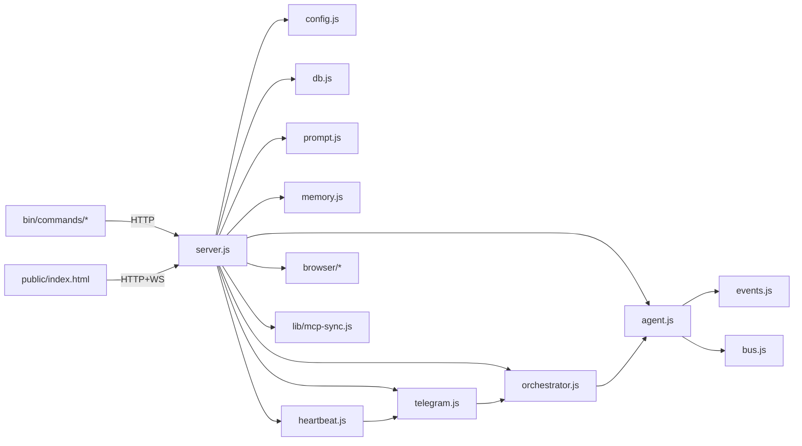

# CLI-Claw — Source Structure & Function Reference

> 모듈화 완료 후 `server.js` + `src/*.js` 구조 기준.  
> 마지막 검증: 2026-02-23 (server.js 593L / agent.js 360L / chat.js 468L / mcp-sync.js 461L / mcp.js 198L / actions.js 170L)

---

## File Tree (실제 리포지토리)

```text
cli-claw/
├── AGENTS.md
├── README.md
├── package.json              ← ESM ("type": "module"), v0.1.0
├── server.js                 ← 라우트 + 글루 (src/ import)
├── lib/
│   ├── mcp-sync.js           ← MCP 통합 + 스킬 복사 + 글로벌 설치 (461L)
│   └── upload.js             ← 파일 업로드 + Telegram 다운로드 (71L)
├── src/                      ← 비즈니스 로직 모듈
│   ├── config.js             ← CLAW_HOME, settings, CLI 탐지, 마이그레이션 (162L)
│   ├── db.js                 ← SQLite 스키마 + prepared statements (76L)
│   ├── bus.js                ← WebSocket + 내부 리스너 브로드캐스트 (19L)
│   ├── events.js             ← NDJSON 이벤트 파싱 (97L)
│   ├── agent.js              ← CLI spawn + 스트림 파싱 + 큐 + 메모리 flush (360L)
│   ├── orchestrator.js       ← Planning → Sub-agent 오케스트레이션 (138L)
│   ├── telegram.js           ← Telegram 봇 + orchestrateAndCollect (267L)
│   ├── heartbeat.js          ← Heartbeat 잡 스케줄 + fs.watch (91L)
│   ├── prompt.js             ← 프롬프트 생성 + 스킬 로딩 + 메모리 주입 (310L)
│   ├── memory.js             ← Persistent Memory (grep 기반 Phase A) (122L)
│   └── browser/              ← Chrome CDP 제어 (Phase 7)
│       ├── index.js           ← 배럴 export
│       ├── connection.js      ← Chrome CDP 연결/관리
│       └── actions.js         ← snapshot/click/type/navigate
├── skills_ref/               ← 번들 스킬 (Phase 6, 20+ 스킬)
│   └── registry.json          ← 스킬 카탈로그
├── public/
│   └── index.html             ← Web UI (SPA, single-file)
├── bin/
│   ├── cli-claw.js            ← CLI 엔트리 (9개 서브커맨드 라우팅)
│   ├── postinstall.js         ← npm install 후 8단계 자동 설정 (139L)
│   └── commands/
│       ├── serve.js           ← 서버 시작 (--port/--host/--open)
│       ├── chat.js            ← 터미널 채팅 TUI (3모드, 468L)
│       ├── init.js            ← 초기화 마법사 (interactive/non-interactive)
│       ├── doctor.js          ← 진단 (11개 체크, --json)
│       ├── status.js          ← 서버 상태 (--json)
│       ├── mcp.js             ← MCP 관리 (install/sync/list/reset, lib import)
│       ├── skill.js           ← 스킬 관리 (install/remove/info/list/reset)
│       ├── memory.js          ← 메모리 CLI (search/read/save/list/init)
│       └── browser.js         ← 브라우저 CLI (15개 서브커맨드)
└── devlog/                    ← 개발 로그 (§ Devlog Structure 참조)
```

### 런타임 데이터 (`~/.cli-claw/`)

| 경로               | 설명                                      |
| ------------------ | ----------------------------------------- |
| `claw.db`          | SQLite DB                                 |
| `settings.json`    | 사용자 설정                               |
| `mcp.json`         | 통합 MCP 설정 (source of truth)           |
| `prompts/`         | A-1, A-2, HEARTBEAT 프롬프트              |
| `uploads/`         | 업로드 파일                               |
| `heartbeat.json`   | 하트비트 잡 정의                          |
| `memory/`          | Persistent memory (`MEMORY.md`, `daily/`) |
| `skills/`          | Active 스킬 (시스템 프롬프트 주입)        |
| `skills_ref/`      | Reference 스킬 (AI 참조용)                |
| `browser-profile/` | Chrome 사용자 프로필                      |
| `screenshots/`     | 브라우저 스크린샷                         |
| `.migrated-v1`     | 마이그레이션 완료 마커                    |

### npm 의존성

| Package                                | 용도                          |
| -------------------------------------- | ----------------------------- |
| `express` ^4.21                        | HTTP 서버 + 라우팅            |
| `ws` ^8.18                             | WebSocket                     |
| `better-sqlite3` ^11.7                 | SQLite DB                     |
| `grammy` ^1.40                         | Telegram Bot                  |
| `@grammyjs/runner` ^2.0                | grammy sequentialize 미들웨어 |
| `@grammyjs/transformer-throttler` ^1.2 | Telegram API 속도 제한        |
| `node-fetch` ^3.3                      | HTTP fetch                    |
| `playwright-core` ^1.58                | Chrome CDP 연결               |

---

## 코드 구조 개요



### 모듈 의존 규칙

| 모듈              | 의존 대상                                            | 설명                           |
| ----------------- | ---------------------------------------------------- | ------------------------------ |
| `bus.js`          | —                                                    | 의존 0, 모든 모듈이 import     |
| `config.js`       | —                                                    | 의존 0 (os/fs/child_process만) |
| `db.js`           | config                                               | DB_PATH만 사용                 |
| `events.js`       | bus                                                  | broadcast만 사용               |
| `memory.js`       | config                                               | CLAW_HOME만 사용, 독립 모듈    |
| `agent.js`        | bus, config, db, events, prompt, orchestrator(strip) | 핵심 허브                      |
| `orchestrator.js` | bus, db, prompt, agent                               | planning ↔ agent 상호 의존     |
| `telegram.js`     | bus, config, db, agent, orchestrator, upload         | 외부 인터페이스                |
| `heartbeat.js`    | config, telegram                                     | telegram re-export 포함        |
| `prompt.js`       | config, db                                           | A-1/A-2 생성 + 스킬 로딩       |
| `browser/*`       | —                                                    | 독립 모듈 (다른 src와 의존 0)  |

---

## src/config.js — 경로, 설정, CLI 탐지

### 상수

| Name                  | 설명                    |
| --------------------- | ----------------------- |
| `CLAW_HOME`           | `~/.cli-claw` 루트      |
| `PROMPTS_DIR`         | 프롬프트 디렉토리       |
| `DB_PATH`             | SQLite DB 경로          |
| `SETTINGS_PATH`       | 설정 파일 경로          |
| `HEARTBEAT_JOBS_PATH` | 하트비트 잡 파일        |
| `UPLOADS_DIR`         | 업로드 파일 경로        |
| `MIGRATION_MARKER`    | `.migrated-v1` 마커     |
| `SKILLS_DIR`          | Active 스킬 디렉토리    |
| `SKILLS_REF_DIR`      | Reference 스킬 디렉토리 |

### 함수

| Function                   | 역할                                                                 |
| -------------------------- | -------------------------------------------------------------------- |
| `getProjectDir()`          | cli-claw 패키지 루트 경로                                            |
| `ensureDirs()`             | 필수 디렉토리 생성                                                   |
| `runMigration(projectDir)` | 레거시 DB/settings → `~/.cli-claw` 1회 이전                          |
| `DEFAULT_SETTINGS`         | 전체 기본 설정 (cli, perCli, heartbeat, telegram, memory, employees) |
| `migrateSettings(s)`       | 과거 `planning` 필드 호환 처리                                       |
| `loadSettings()`           | `settings.json` 로드 + 마이그레이션                                  |
| `saveSettings(s)`          | 설정 저장                                                            |
| `replaceSettings(s)`       | ESM live binding 대체 (API PUT용)                                    |
| `loadHeartbeatFile()`      | `heartbeat.json` 로드                                                |
| `saveHeartbeatFile(data)`  | `heartbeat.json` 저장                                                |
| `detectCli(name)`          | `which` 기반 바이너리 존재 확인                                      |
| `detectAllCli()`           | 4개 CLI 상태 반환                                                    |

DEFAULT_SETTINGS 구조:
```javascript
{
    cli: 'claude',
    permissions: 'auto',
    workingDir: os.homedir(),
    perCli: {
        claude: { model: 'claude-sonnet-4-6', effort: 'medium' },
        codex: { model: 'gpt-5.3-codex', effort: 'medium' },
        gemini: { model: 'gemini-2.5-pro', effort: '' },
        opencode: { model: 'github-copilot/claude-sonnet-4.5', effort: '' },
    },
    heartbeat: { enabled, every, activeHours, target },
    telegram: { enabled, token, allowedChatIds },
    memory: { enabled, flushEvery, cli, model, retentionDays },
    employees: [],
}
```

---

## src/db.js — Database

### Schema

```sql
session   (id='default', active_cli, session_id, model, permissions, working_dir, effort, updated_at)
messages  (id PK, role, content, cli, model, cost_usd, duration_ms, created_at)
memory    (id PK, key UNIQUE, value, source, created_at, updated_at)
employees (id PK, name, cli, model, role, status, created_at)
```

### Prepared Statements

`getSession`, `updateSession`, `insertMessage`, `getMessages`, `getRecentMessages`, `clearMessages`, `getMemory`, `upsertMemory`, `deleteMemory`, `getEmployees`, `insertEmployee`, `deleteEmployee`

---

## src/bus.js — Broadcast Bus

순환 의존 방지 허브. 모든 모듈이 여기서 broadcast import.

| Function                      | 역할                                    |
| ----------------------------- | --------------------------------------- |
| `setWss(w)`                   | WebSocketServer 인스턴스 등록           |
| `addBroadcastListener(fn)`    | 내부 리스너 등록                        |
| `removeBroadcastListener(fn)` | 내부 리스너 해제                        |
| `broadcast(type, data)`       | WS 클라이언트 + 내부 리스너에 동시 전파 |

---

## src/events.js — NDJSON Event Extraction

| Function                                        | 역할                             |
| ----------------------------------------------- | -------------------------------- |
| `extractSessionId(cli, event)`                  | CLI별 session/thread ID 추출     |
| `extractFromEvent(cli, event, ctx, agentLabel)` | 텍스트/토큰/비용/툴로그 누적     |
| `extractToolLabel(cli, event)`                  | 툴 이벤트 → `{icon, label}` 변환 |

CLI별 이벤트 매핑:
- **claude**: `system` → session_id, `assistant` → text, `result` → cost/turns/duration
- **codex**: `thread.started` → thread_id, `item.completed` → text, `turn.completed` → usage
- **gemini**: `init` → session_id, `message` → text, `result` → stats
- **opencode**: `text` → part.text, `step_finish` → tokens/cost/sessionID

---

## src/agent.js — CLI Spawn & Queue

### 상태

| Export               | 설명                      |
| -------------------- | ------------------------- |
| `activeProcess`      | 현재 실행 중 프로세스 ref |
| `memoryFlushCounter` | 메모리 flush 카운터       |
| `messageQueue`       | 대기 메시지 큐            |

### 함수

| Function                                                 | 역할                                  |
| -------------------------------------------------------- | ------------------------------------- |
| `killActiveAgent(reason)`                                | SIGTERM → SIGKILL 종료                |
| `waitForProcessEnd(timeoutMs)`                           | 종료 대기 (default 3s)                |
| `steerAgent(newPrompt, source)`                          | kill → 대기 → 새 프롬프트로 restart   |
| `enqueueMessage(prompt, source)`                         | 큐에 메시지 추가                      |
| `processQueue()`                                         | idle 시 다음 메시지 실행              |
| `makeCleanEnv()`                                         | spawn env 정리                        |
| `buildArgs(cli, model, effort, prompt, sysPrompt)`       | 신규 세션용 CLI args 생성             |
| `buildResumeArgs(cli, model, effort, sessionId, prompt)` | resume용 args 생성                    |
| `saveUpload(buffer, originalName)`                       | 파일 업로드 저장 (lib/upload.js 래핑) |
| `spawnAgent(prompt, opts)`                               | **핵심** — spawn/stream/DB/broadcast  |
| `triggerMemoryFlush()`                                   | 대화 요약 → 메모리 파일 flush         |

### spawnAgent 흐름

1. 실행 중 + `forceNew` 아니면 스킵
2. 세션/설정에서 cli/model/effort 결정
3. resume 가능 → `buildResumeArgs`, 아니면 `buildArgs`
4. Gemini → 임시 system prompt 파일 → `GEMINI_SYSTEM_MD` env
5. child spawn → `agent_status` broadcast
6. stdin 주입: `[Claw Platform Context]` + system prompt + `[Recent History]` 5개 + `[User Message]`
7. stdout NDJSON 라인별 파싱 → extract 함수
8. 종료: session 저장 / agent_done / 에러 처리 / processQueue

주의:
- `forceNew` 작업은 메인 activeProcess 점유 안 함
- `stripSubtaskJSON`으로 planning JSON 제거

---

## src/orchestrator.js — Multi-Agent Orchestration

| Function                      | 역할                                        |
| ----------------------------- | ------------------------------------------- |
| `parseSubtasks(text)`         | fenced JSON 또는 raw JSON에서 subtasks 파싱 |
| `stripSubtaskJSON(text)`      | subtask JSON 제거                           |
| `distributeAndWait(subtasks)` | 직원 매칭 → 병렬 spawnAgent → 결과 수집     |
| `orchestrate(prompt)`         | 라운드 루프 (MAX_ROUNDS=3)                  |

### Flow

1. 직원 0명 → 단일 agent
2. `agentId='planning'` 먼저 실행
3. `while (round <= 3)`: distribute → 결과 보고 → 재평가
4. subtasks 없으면 완료, 라운드 초과 시 fallback

직원 매칭: `name` 기반 exact/includes (양방향).

---

## src/telegram.js — Telegram Bot

### 헬퍼

| Function                            | 역할                                    |
| ----------------------------------- | --------------------------------------- |
| `escapeHtmlTg(text)`                | HTML 특수문자 escape                    |
| `markdownToTelegramHtml(md)`        | Markdown → Telegram HTML                |
| `chunkTelegramMessage(text, limit)` | 4096자 chunk 분할                       |
| `orchestrateAndCollect(prompt)`     | agent_done까지 수집 (idle timeout 리셋) |

### 코어

| Function                                 | 역할                                           |
| ---------------------------------------- | ---------------------------------------------- |
| `initTelegram()`                         | Bot 생성, allowlist, 핸들러 (텍스트/사진/문서) |
| `ipv4Fetch(url, init)`                   | IPv4 강제 fetch (Telegram API 호환)            |
| `tgOrchestrate(ctx, prompt, displayMsg)` | TG → orchestrate → 응답 전송                   |

sequentialize 미들웨어로 채팅별 직렬화 처리.  
활성 agent 있으면 steer(kill 후 대기) 로직 적용.

---

## src/heartbeat.js — Scheduled Jobs

| Function               | 역할                                        |
| ---------------------- | ------------------------------------------- |
| `startHeartbeat()`     | `schedule.kind='every'` job에 setInterval   |
| `stopHeartbeat()`      | 전체 타이머 해제                            |
| `runHeartbeatJob(job)` | 단일 job 실행 (busy guard, `[SILENT]` 처리) |
| `watchHeartbeatFile()` | fs.watch → 변경 시 debounce 재로딩          |

---

## src/prompt.js — System Prompt & Skills

### 스킬 로딩

| Function              | 역할                                         |
| --------------------- | -------------------------------------------- |
| `loadActiveSkills()`  | `~/.cli-claw/skills/` 읽기 → id/name/content |
| `loadSkillRegistry()` | `skills_ref/registry.json` 읽기              |
| `getMergedSkills()`   | active + ref 병합 (API용)                    |

### 프롬프트

| Function               | 역할                                                                     |
| ---------------------- | ------------------------------------------------------------------------ |
| `initPromptFiles()`    | A-1, A-2 프롬프트 파일 초기화                                            |
| `getMemoryDir()`       | Claude 네이티브 메모리 디렉토리                                          |
| `loadRecentMemories()` | 최근 메모리 파일 로드 (프롬프트 주입용)                                  |
| `getSystemPrompt()`    | 전체 시스템 프롬프트 조합 (A-1 + A-2 + 스킬 + 메모리 + 직원 + heartbeat) |
| `regenerateB()`        | B 프롬프트 재생성 (workingDir에 저장)                                    |

시스템 프롬프트 구조: `A-1 (고정)` + `A-2 (사용자 편집)` + Active Skills 내용 + 메모리 + 직원 dispatch 포맷 + heartbeat 사용법

---

## src/memory.js — Persistent Memory

`~/.cli-claw/memory/` 기반 파일형 메모리. Phase A: grep 기반.

| Function                        | 역할                                            |
| ------------------------------- | ----------------------------------------------- |
| `ensureMemoryDir()`             | 디렉토리 + `MEMORY.md` 초기화                   |
| `search(query)`                 | `grep -rni -C 3` 전문 검색                      |
| `read(filename, opts)`          | 파일 읽기 (`--lines N-M` 지원)                  |
| `save(filename, content)`       | append 모드 저장                                |
| `list()`                        | 재귀 walk → `.md` 파일 목록                     |
| `appendDaily(content)`          | `daily/<date>.md`에 타임스탬프 로그             |
| `loadMemoryForPrompt(maxChars)` | MEMORY.md → 시스템 프롬프트 주입 (1500자 limit) |

---

## Browser Module (Phase 7 → 7.2)

`src/browser/` — Chrome CDP 제어, 완전 독립 모듈.

### connection.js

| Function                 | 역할                              |
| ------------------------ | --------------------------------- |
| `findChrome()`           | macOS Chrome/Chromium/Brave 탐지  |
| `launchChrome(port)`     | Chrome 프로세스 spawn (CDP 포트)  |
| `connectCdp(port)`       | CDP 연결 + 캐싱                   |
| `getActivePage(port)`    | 마지막 활성 페이지 반환           |
| `getCdpSession(port)`    | CDPSession 생성 (direct protocol) |
| `listTabs(port)`         | CDP `/json/list` 탭 목록          |
| `getBrowserStatus(port)` | 연결 상태 + 탭 수                 |
| `closeBrowser()`         | 브라우저 + 프로세스 종료          |

### actions.js

| Function                 | 역할                                               |
| ------------------------ | -------------------------------------------------- |
| `snapshot(port, opts)`   | Accessibility 스냅샷 (ariaSnapshot + CDP fallback) |
| `parseAriaYaml(yaml)`    | ariaSnapshot YAML → `{ref,role,name,depth}[]`      |
| `parseCdpAxTree(nodes)`  | CDP AXNode[] → `{ref,role,name,value,depth}[]`     |
| `screenshot(port, opts)` | 전체/요소 스크린샷                                 |
| `click(port, ref, opts)` | ref 기반 클릭                                      |
| `type(port, ref, text)`  | ref 기반 텍스트 입력                               |
| `press(port, key)`       | 키보드 키 입력                                     |
| `hover(port, ref)`       | ref 기반 호버                                      |
| `navigate(port, url)`    | URL 이동                                           |
| `evaluate(port, expr)`   | JS 실행                                            |
| `getPageText(port, fmt)` | 페이지 텍스트/HTML 추출                            |

> **Phase 7.2 변경**: `page.accessibility.snapshot()` 제거 → `locator.ariaSnapshot()` 기반으로 전환.
> CDP 연결에서 `page.accessibility`가 `undefined`인 Playwright 제한사항 우회.

---

## lib/mcp-sync.js — MCP 통합 관리

통합 설정 소스: `~/.cli-claw/mcp.json`

### MCP 설정 I/O

| Function                        | 역할                          |
| ------------------------------- | ----------------------------- |
| `loadUnifiedMcp()`              | 통합 MCP 설정 로드            |
| `saveUnifiedMcp(config)`        | 저장                          |
| `importFromClaudeMcp(filePath)` | Claude `.mcp.json`에서 import |

### CLI별 변환

| Function                | 대상 CLI      | 포맷                            |
| ----------------------- | ------------- | ------------------------------- |
| `toClaudeMcp(config)`   | Claude/Gemini | `.mcp.json` (mcpServers)        |
| `toCodexToml(config)`   | Codex         | `config.toml` ([mcp_servers.*]) |
| `toOpenCodeMcp(config)` | OpenCode      | `opencode.json` (mcp block)     |

### Sync & Patch

| Function                         | 역할                       |
| -------------------------------- | -------------------------- |
| `patchCodexToml(existing, new)`  | TOML 부분 교체             |
| `patchJsonFile(filePath, patch)` | JSON 부분 merge            |
| `syncToAll(config, workingDir)`  | 통합 → 4개 CLI 설정 동기화 |

### 스킬 & 설치

| Function                           | 역할                               |
| ---------------------------------- | ---------------------------------- |
| `ensureSkillsSymlinks(workingDir)` | `.agents/skills` symlink 생성      |
| `copyDefaultSkills()`              | 2×3 Matrix 분류 + 복사             |
| `installMcpServers(config)`        | npx → npm -g, uv → uv tool install |
| `initMcpConfig(workingDir)`        | 첫 설치 시 MCP 설정 초기화         |
| `copyDirRecursive(src, dst)`       | 디렉토리 재귀 복사                 |

### 스킬 분류 (2×3 Matrix)

| 소스                    | Active               | Reference   | 제외              |
| ----------------------- | -------------------- | ----------- | ----------------- |
| Codex (~/.codex/skills) | CODEX_ACTIVE 목록    | 나머지 전부 | CODEX_DELETE 목록 |
| OpenClaw (skills_ref/)  | OPENCLAW_ACTIVE 목록 | 나머지 전부 | —                 |

---

## lib/upload.js — 업로드 헬퍼

| Function                               | 역할                                   |
| -------------------------------------- | -------------------------------------- |
| `saveUpload(uploadsDir, buffer, name)` | 타임스탬프 파일명으로 저장             |
| `buildMediaPrompt(filePath, caption)`  | 파일 전송 프롬프트 생성                |
| `downloadTelegramFile(fileId, token)`  | Telegram 서버에서 파일 다운로드 (IPv4) |

---

## bin/cli-claw.js — CLI Entry Point

9개 서브커맨드 라우팅: `serve`, `init`, `doctor`, `chat`, `mcp`, `skill`, `status`, `browser`, `memory`

---

## bin/postinstall.js — 자동 설정 (8단계)

| 단계 | 작업                                                     |
| ---- | -------------------------------------------------------- |
| 1    | `~/.cli-claw/` 디렉토리 생성                             |
| 2    | Skills symlink (`.agents/skills` → `~/.cli-claw/skills`) |
| 3    | `~/CLAUDE.md` → `~/AGENTS.md` symlink                    |
| 4    | `heartbeat.json` 초기 생성                               |
| 5    | MCP 설정 초기화 (기존 `.mcp.json` import)                |
| 6    | 기본 스킬 복사 (2×3 분류)                                |
| 7    | MCP 서버 글로벌 설치 (context7-mcp)                      |
| 8    | 스킬 의존성 설치 (uv, playwright-core)                   |

---

## bin/commands/ — CLI 명령어 상세

### chat.js (468L) — 터미널 채팅 TUI

**3가지 모드:**

| 모드    | 플래그     | 입력 방식 | 특징                                      |
| ------- | ---------- | --------- | ----------------------------------------- |
| Default | —          | raw stdin | 스크롤 영역 + 고정 footer + CJK 너비 계산 |
| Raw     | `--raw`    | raw stdin | 모든 WS 이벤트를 JSON으로 표시            |
| Simple  | `--simple` | readline  | 단순 REPL (raw stdin 미사용)              |

**기능:**
- **슬래시 명령**: `/quit`, `/clear`, `/file <path>`, `/mcp`, `/mcp sync`
- **멀티라인**: Option+Enter 또는 `\` (backslash continuation)
- **실행 중 입력**: agent running 중에도 타이핑 가능 (queue 방식)
- **Ctrl+D**: agent 중지 (stop 전송)
- **CJK 너비 계산**: `visualWidth()` — 한국어/이모지 2컬럼 처리
- **스크롤 영역**: `setupScrollRegion()` / `cleanupScrollRegion()` — ANSI escape로 footer 고정

### serve.js — 서버 시작

옵션: `--port` (default 3457), `--host` (default 0.0.0.0), `--open` (브라우저 자동 열기)  
`--dns-result-order=ipv4first` 플래그로 Node 시작.

### init.js — 초기화 마법사

Interactive 또는 `--non-interactive` 모드. 설정 항목: workingDir, cli, permissions, telegram, skillsDir.  
완료 후 postinstall.js 실행.

### doctor.js — 진단 (11개 체크)

| 체크                              | 내용                                             |
| --------------------------------- | ------------------------------------------------ |
| Home directory                    | `~/.cli-claw` 쓰기 권한                          |
| settings.json                     | 존재 + CLI 설정                                  |
| claw.db                           | 존재 + 크기                                      |
| heartbeat.json                    | 존재 + 활성 job 수                               |
| CLI: claude/codex/gemini/opencode | `which` 설치 확인                                |
| Telegram                          | enabled + token 포맷                             |
| Skills directory                  | 존재 + symlink 상태                              |
| macOS Accessibility               | osascript 테스트 (실패 시 시스템 설정 자동 열기) |
| uv (Python)                       | 버전 확인                                        |
| playwright-core                   | 설치 확인                                        |
| Google Chrome                     | 앱 존재 확인                                     |

`--json` 출력 지원.

### mcp.js — MCP 관리 (Phase 10 리팩토링)

> Phase 10에서 `syncAll()` 인라인 삭제, `lib/mcp-sync.js`의 `syncToAll()` import로 통합.  
> `loadMcp/saveMcp` → `loadUnifiedMcp/saveUnifiedMcp` 교체.

| 서브커맨드        | 설명                                                     |
| ----------------- | -------------------------------------------------------- |
| `install <pkg>`   | npm/pypi 패키지 설치 + mcp.json 등록 + 4개 CLI sync      |
| `sync`            | mcp.json → 4개 CLI 동기화 (Claude/Codex/Gemini/OpenCode) |
| `list` (기본)     | 등록된 서버 목록                                         |
| `reset [--force]` | mcp.json 초기화 → 재import → 4개 CLI 재동기화            |

PyPI 자동 감지: `mcp-server-*`, `mcp-*` 패턴.

### skill.js — 스킬 관리

| 서브커맨드        | 설명                                    |
| ----------------- | --------------------------------------- |
| `install <name>`  | Codex 스킬 또는 GitHub에서 설치         |
| `remove <name>`   | 삭제                                    |
| `info <name>`     | SKILL.md 표시                           |
| `list` (기본)     | 설치된 스킬 목록                        |
| `reset [--force]` | skills + skills_ref 초기화 → 2×3 재분류 |

GitHub 설치: `npx degit user/repo#branch` 사용.

### browser.js — 브라우저 CLI (15개 서브커맨드)

| 서브커맨드          | 옵션                   | 설명                   |
| ------------------- | ---------------------- | ---------------------- |
| `start`             | `--port`               | Chrome 시작 (CDP)      |
| `stop`              | —                      | Chrome 종료            |
| `status`            | —                      | 연결 상태              |
| `reset`             | `--force`              | 프로필+스크린샷 초기화 |
| `snapshot`          | `--interactive`        | Accessibility tree     |
| `screenshot`        | `--full-page`, `--ref` | 스크린샷               |
| `click`             | `--double`             | 클릭                   |
| `type`              | `--submit`             | 텍스트 입력            |
| `press`             | —                      | 키보드                 |
| `hover`             | —                      | 호버                   |
| `navigate` / `open` | —                      | URL 이동               |
| `tabs`              | —                      | 탭 목록                |
| `text`              | `--format`             | 페이지 텍스트          |
| `evaluate`          | —                      | JS 실행                |

---

## server.js — Glue + API Routes

576L. 모든 비즈니스 로직은 `src/`에 있고, server.js는 라우트 + 초기화만 담당.

### 서버에만 있는 함수 (Quota)

| Function                  | 역할                   |
| ------------------------- | ---------------------- |
| `readClaudeCreds()`       | Claude 인증 파일 읽기  |
| `readCodexTokens()`       | Codex 토큰 읽기        |
| `fetchClaudeUsage(creds)` | Claude API 사용량 조회 |
| `fetchCodexUsage(tokens)` | Codex API 사용량 조회  |
| `readGeminiAccount()`     | Gemini 계정 정보 읽기  |

### 초기화 순서

```
ensureDirs() → runMigration() → loadSettings() → initPromptFiles() → regenerateB()
→ server.listen() → mcp-sync (symlinks + copy) → initTelegram() → startHeartbeat()
```

---

## REST API Endpoints

### Core

| Method | Path            | 설명                          |
| ------ | --------------- | ----------------------------- |
| GET    | `/api/session`  | 현재 session                  |
| GET    | `/api/messages` | 전체 메시지                   |
| POST   | `/api/message`  | 사용자 메시지 (busy 시 queue) |
| POST   | `/api/stop`     | agent 중단                    |
| POST   | `/api/clear`    | 메시지 삭제 + 세션 무효화     |

### Settings & Prompt

| Method  | Path                | 설명                   |
| ------- | ------------------- | ---------------------- |
| GET/PUT | `/api/settings`     | 설정 조회/갱신         |
| GET/PUT | `/api/prompt`       | A-2 prompt 조회/저장   |
| GET/PUT | `/api/heartbeat-md` | HEARTBEAT.md 조회/저장 |

### Memory (DB key-value)

| Method | Path               | 설명      |
| ------ | ------------------ | --------- |
| GET    | `/api/memory`      | 전체 조회 |
| POST   | `/api/memory`      | upsert    |
| DELETE | `/api/memory/:key` | 삭제      |

### Memory Files (Claude native)

| Method | Path                          | 설명      |
| ------ | ----------------------------- | --------- |
| GET    | `/api/memory-files`           | 파일 목록 |
| GET    | `/api/memory-files/:filename` | 파일 조회 |
| DELETE | `/api/memory-files/:filename` | 파일 삭제 |
| PUT    | `/api/memory-files/settings`  | 설정 변경 |

### Claw Memory (grep-based)

| Method | Path                      | 설명            |
| ------ | ------------------------- | --------------- |
| GET    | `/api/claw-memory/search` | grep 검색       |
| GET    | `/api/claw-memory/read`   | 파일 읽기       |
| POST   | `/api/claw-memory/save`   | 파일 저장       |
| GET    | `/api/claw-memory/list`   | 파일 목록       |
| POST   | `/api/claw-memory/init`   | 디렉토리 초기화 |

### Upload & MCP

| Method  | Path               | 설명              |
| ------- | ------------------ | ----------------- |
| POST    | `/api/upload`      | 바이너리 업로드   |
| GET/PUT | `/api/mcp`         | MCP 설정          |
| POST    | `/api/mcp/sync`    | 워크스페이스 sync |
| POST    | `/api/mcp/install` | 글로벌 설치       |
| POST    | `/api/mcp/reset`   | 초기화 + 재동기화 |

### Status & Quota

| Method | Path              | 설명                       |
| ------ | ----------------- | -------------------------- |
| GET    | `/api/cli-status` | CLI 탐지 상태              |
| GET    | `/api/quota`      | Claude/Codex/Gemini 사용량 |

### Employees

| Method     | Path                 | 설명      |
| ---------- | -------------------- | --------- |
| GET/POST   | `/api/employees`     | 조회/추가 |
| PUT/DELETE | `/api/employees/:id` | 수정/삭제 |

### Heartbeat

| Method  | Path             | 설명                  |
| ------- | ---------------- | --------------------- |
| GET/PUT | `/api/heartbeat` | jobs 조회/저장+재시작 |

### Skills

| Method | Path                  | 설명           |
| ------ | --------------------- | -------------- |
| GET    | `/api/skills`         | 병합 스킬 목록 |
| POST   | `/api/skills/enable`  | 활성화         |
| POST   | `/api/skills/disable` | 비활성화       |
| GET    | `/api/skills/:id`     | SKILL.md 조회  |

### Browser

| Method | Path                      | 설명                   |
| ------ | ------------------------- | ---------------------- |
| POST   | `/api/browser/start`      | 시작                   |
| GET    | `/api/browser/status`     | 상태                   |
| POST   | `/api/browser/stop`       | 종료                   |
| GET    | `/api/browser/tabs`       | 탭 목록                |
| GET    | `/api/browser/snapshot`   | Accessibility snapshot |
| POST   | `/api/browser/screenshot` | 스크린샷               |
| POST   | `/api/browser/act`        | 클릭/입력/호버/키      |
| POST   | `/api/browser/navigate`   | URL 이동               |
| POST   | `/api/browser/evaluate`   | JS 실행                |
| GET    | `/api/browser/text`       | 텍스트 추출            |

---

## WebSocket / Broadcast Events

| Type                          | 설명                                          |
| ----------------------------- | --------------------------------------------- |
| `new_message`                 | 새 메시지 (사용자/어시스턴트)                 |
| `queue_update`                | 큐 상태 변경 (pending 수)                     |
| `agent_status`                | 에이전트 상태 (running/done/error/evaluating) |
| `agent_tool`                  | 툴 사용 (`{icon, label}`)                     |
| `agent_done`                  | 완료 + 결과 텍스트                            |
| `round_start`                 | 오케스트레이션 라운드 시작                    |
| `round_done`                  | 라운드 완료 (complete/retry)                  |
| `orchestrate_done`            | 전체 오케스트레이션 완료                      |
| `clear`                       | 메시지 전체 삭제                              |
| `agent_added/updated/deleted` | 직원 CRUD                                     |

---

## 핵심 주의 포인트

1. **큐**: `/api/message` busy 시 queue → agent 종료 후 자동 처리
2. **세션 무효화**: CLI 변경 시 기존 session_id 제거 → reset
3. **직원 dispatch**: B 프롬프트에 JSON subtask 포맷 주입
4. **메모리 flush**: 내부 `forceNew` spawn → 메인 세션 분리
5. **에러 처리**: 429/auth 사용자화 메시지 (spawnAgent close 핸들러)
6. **메모리 주입**: `loadMemoryForPrompt()` → 시스템 프롬프트에 1500자
7. **IPv4 강제**: `--dns-result-order=ipv4first` + Telegram IPv4 fetch
8. **MCP 동기화**: 통합 mcp.json → Claude/Codex/Gemini/OpenCode 4개 포맷 자동 변환

---

## Devlog Structure

### MVP (devlog/mvp/)

12개 Phase, 각 Phase별 별도 폴더:

| Phase | 폴더                  | 주제                         |
| ----- | --------------------- | ---------------------------- |
| 01    | `01_foundation`       | Express 서버 + SQLite        |
| 02    | `02_single-agent`     | 단일 에이전트 실행           |
| 03    | `03_prompt-injection` | 시스템 프롬프트 A-1/A-2      |
| 04    | `04_web-ui`           | Web UI (SPA)                 |
| 05    | `05_orchestration`    | 멀티 에이전트 오케스트레이션 |
| 06    | `06_telegram`         | Telegram 봇                  |
| 07    | `07_integration`      | 통합 테스트 + 버그 수정      |
| 08    | `08_heartbeat`        | 하트비트 스케줄러            |
| 09    | `09_cli`              | CLI 명령어 체계              |
| 10    | `10_photo-input`      | 이미지/파일 입력             |
| 11    | `11_memory`           | 메모리 시스템 (Phase A)      |
| 12    | `12_오류수정_mvp설치` | MVP 오류 수정 + npm 설치     |

### Post-MVP (devlog/260223_*/)

| 폴더                        | 주제                                       | 핵심 파일                     |
| --------------------------- | ------------------------------------------ | ----------------------------- |
| `260223_권한/`              | 권한 + 타임아웃 + 모듈화 + 스킬 + 브라우저 | `plan.md` + `phase_*.md` × 13 |
| `260223_메모리 개선/`       | 메모리 고도화 (Phase B: embedding 계획)    | `plan.md`, `README.md`        |
| `260223_모델/`              | 모델 목록 업데이트 + custom input          | *(계획 단계)*                 |
| `260223_모델.md`            | 모델 업데이트 결과 (`59de662`)             | 단독 파일                     |
| `260223_프론트엔드 모듈화/` | Web UI CSS/JS 모듈 분리                    | `README.md`                   |
| `260224_cmd/`               | 슬래시 커맨드 통합 시스템                  | `slash_commands.md`           |

### Post-MVP 세부 Phase (260223_권한/ 내)

| 파일                            | Phase | 주제                            | 상태        |
| ------------------------------- | ----- | ------------------------------- | ----------- |
| `plan.md`                       | 1~3   | 타임아웃/TG tool use/macOS 권한 | 마스터 플랜 |
| `phase_1.1_heartbeat_prom.md`   | 1.1   | 하트비트 프롬프트 개선          | ✅           |
| `phase_2_sandbox_launchd.md`    | 2     | 샌드박스 + launchd              | 📋           |
| `phase_3_telegram_response.md`  | 3     | Telegram 응답 버그 수정         | ✅           |
| `phase_4_publish.md`            | 4     | GitHub 퍼블리시                 | ✅           |
| `phase_5_modularize.md`         | 5     | server.js → src/*.js 모듈 분리  | ✅           |
| `phase_6_channels.md`           | 6     | 채널 확장 계획                  | 📋           |
| `phase_6.1_skills.md`           | 6.1   | 스킬 시스템 구현                | ✅           |
| `phase_6.2_expansion.md`        | 6.2   | 스킬 확장 + Codex 선별          | ✅           |
| `phase_6.3_deps.md`             | 6.3   | 스킬 의존성 분석                | ✅           |
| `phase_7_browser.md`            | 7     | 브라우저 제어 (CDP)             | ✅           |
| `phase_7_1_browser_fix.md`      | 7.1   | 브라우저 버그 수정              | ✅           |
| `phase_7_2_snapshot_cdp_fix.md` | 7.2   | Snapshot CDP 근본 수정          | ✅           |
| `phase_8_skill_expansion.md`    | 8     | 스킬 대규모 확장                | ✅           |
| `phase_9_auto_deps.md`          | 9     | postinstall 자동 의존성         | ✅           |
| `phase_10_mcp_reset.md`         | 10    | MCP Reset + 코드 중복 제거      | ✅           |

---

> 이 문서는 프로젝트 전체 파일을 검증하여 작성한 완전 레퍼런스입니다.
