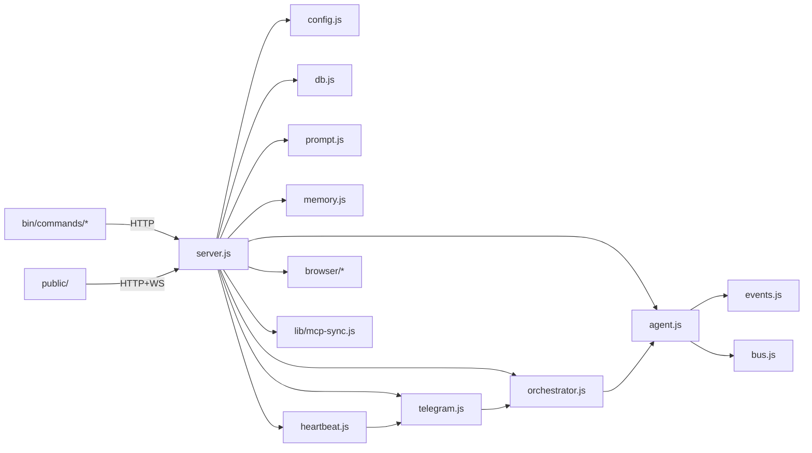

# CLI-Claw — Source Structure & Function Reference

> 마지막 검증: 2026-02-24 (server.js 594L / agent.js 360L / chat.js 468L / mcp-sync.js 461L / prompt.js 348L / public/ 18파일 2504L)

---

## File Tree

```text
cli-claw/
├── server.js                 ← 라우트 + 글루 (src/ import, 594L)
├── lib/
│   ├── mcp-sync.js           ← MCP 통합 + 스킬 복사 + 글로벌 설치 (461L)
│   └── upload.js             ← 파일 업로드 + Telegram 다운로드 (71L)
├── src/
│   ├── config.js             ← CLAW_HOME, settings, CLI 탐지 (162L)
│   ├── db.js                 ← SQLite 스키마 + prepared statements (76L)
│   ├── bus.js                ← WS + 내부 리스너 broadcast (19L)
│   ├── events.js             ← NDJSON 이벤트 파싱 (97L)
│   ├── agent.js              ← CLI spawn + 스트림 + 큐 + 메모리 flush (360L)
│   ├── orchestrator.js       ← Planning → Sub-agent 오케스트레이션 (131L)
│   ├── telegram.js           ← Telegram 봇 + orchestrateAndCollect (267L)
│   ├── heartbeat.js          ← Heartbeat 잡 스케줄 + fs.watch (91L)
│   ├── prompt.js             ← 프롬프트 생성 + 스킬 + 서브에이전트 주입 (348L)
│   ├── memory.js             ← Persistent Memory grep 기반 (122L)
│   └── browser/              ← Chrome CDP 제어
│       ├── connection.js     ← Chrome 탐지/launch/CDP 연결
│       └── actions.js        ← snapshot/click/type/navigate/screenshot
├── public/                   ← Web UI (ES Modules, 18 files, 2504L)
│   ├── index.html            ← HTML 뼈대 (416L, inline JS/CSS 없음)
│   ├── css/
│   │   ├── variables.css     ← CSS 커스텀 프로퍼티, 리셋 (47L)
│   │   ├── layout.css        ← 사이드바, 탭, 세이브바 (162L)
│   │   ├── chat.css          ← 채팅, 메시지, 타이핑, 첨부 (265L)
│   │   ├── sidebar.css       ← 설정, 스킬 카드, 토글 (215L)
│   │   └── modals.css        ← 모달, 하트비트 카드 (171L)
│   └── js/
│       ├── main.js           ← 앱 진입점 + 이벤트 바인딩 (198L)
│       ├── state.js          ← 공유 상태 모듈 (16L)
│       ├── constants.js      ← MODEL_MAP, ROLE_PRESETS (23L)
│       ├── render.js         ← renderMarkdown, escapeHtml (20L)
│       ├── ui.js             ← DOM 조작 유틸 (138L)
│       ├── ws.js             ← WebSocket 연결 + 메시지 라우팅 (41L)
│       └── features/
│           ├── chat.js       ← 전송, 첨부, 드래그앤드롭 (111L)
│           ├── settings.js   ← 설정, CLI 상태, MCP, 프롬프트 (351L)
│           ├── skills.js     ← 로드, 토글, 필터 (65L)
│           ├── employees.js  ← 서브에이전트 CRUD (92L)
│           ├── heartbeat.js  ← 하트비트 모달/작업 (83L)
│           └── memory.js     ← 메모리 모달/설정 (90L)
├── bin/
│   ├── cli-claw.js           ← 9개 서브커맨드 라우팅
│   ├── postinstall.js        ← npm install 후 8단계 자동 설정 (139L)
│   └── commands/
│       ├── serve.js          ← 서버 시작 (--port/--host/--open)
│       ├── chat.js           ← 터미널 채팅 TUI (3모드, 468L)
│       ├── init.js           ← 초기화 마법사
│       ├── doctor.js         ← 진단 (11개 체크, --json)
│       ├── status.js         ← 서버 상태 (--json)
│       ├── mcp.js            ← MCP 관리 (install/sync/list/reset)
│       ├── skill.js          ← 스킬 관리 (install/remove/info/list/reset)
│       ├── memory.js         ← 메모리 CLI (search/read/save/list/init)
│       └── browser.js        ← 브라우저 CLI (15개 서브커맨드)
├── skills_ref/               ← 번들 스킬 (53개: OpenClaw 26 + Codex 27 폴백)
│   └── registry.json
└── devlog/                   ← MVP 12 Phase + Post-MVP 6개 폴더
```

### 런타임 데이터 (`~/.cli-claw/`)

| 경로               | 설명                                      |
| ------------------ | ----------------------------------------- |
| `claw.db`          | SQLite DB                                 |
| `settings.json`    | 사용자 설정                               |
| `mcp.json`         | 통합 MCP 설정 (source of truth)           |
| `prompts/`         | A-1, A-2, HEARTBEAT 프롬프트              |
| `memory/`          | Persistent memory (`MEMORY.md`, `daily/`) |
| `skills/`          | Active 스킬 (시스템 프롬프트 주입)        |
| `skills_ref/`      | Reference 스킬 (AI 참조용)                |
| `browser-profile/` | Chrome 사용자 프로필                      |

npm 의존성: `express` ^4.21 · `ws` ^8.18 · `better-sqlite3` ^11.7 · `grammy` ^1.40 · `node-fetch` ^3.3 · `playwright-core` ^1.58

---

## 코드 구조 개요



### 모듈 의존 규칙

| 모듈              | 의존 대상                                     | 비고                   |
| ----------------- | --------------------------------------------- | ---------------------- |
| `bus.js`          | —                                             | 의존 0, broadcast 허브 |
| `config.js`       | —                                             | 의존 0, 경로/설정만    |
| `db.js`           | config                                        | DB_PATH만 사용         |
| `events.js`       | bus                                           | broadcast만 사용       |
| `memory.js`       | config                                        | CLAW_HOME만, 독립 모듈 |
| `agent.js`        | bus, config, db, events, prompt, orchestrator | 핵심 허브              |
| `orchestrator.js` | bus, db, prompt, agent                        | planning ↔ agent 상호  |
| `telegram.js`     | bus, config, db, agent, orchestrator, upload  | 외부 인터페이스        |
| `heartbeat.js`    | config, telegram                              | telegram re-export     |
| `prompt.js`       | config, db                                    | A-1/A-2 + 스킬         |
| `browser/*`       | —                                             | 독립 모듈              |

---

## src/ 모듈 상세

### config.js — 경로, 설정, CLI 탐지

**상수**: `CLAW_HOME` · `PROMPTS_DIR` · `DB_PATH` · `SETTINGS_PATH` · `HEARTBEAT_JOBS_PATH` · `UPLOADS_DIR` · `SKILLS_DIR` · `SKILLS_REF_DIR`

| Function             | 역할                              |
| -------------------- | --------------------------------- |
| `ensureDirs()`       | 필수 디렉토리 생성                |
| `runMigration()`     | 레거시 DB/settings → ~/.cli-claw  |
| `loadSettings()`     | settings.json 로드 + 마이그레이션 |
| `saveSettings(s)`    | 설정 저장                         |
| `replaceSettings(s)` | ESM live binding 대체 (API PUT용) |
| `detectCli(name)`    | `which` 기반 바이너리 존재 확인   |
| `detectAllCli()`     | 4개 CLI 상태 반환                 |

### db.js — Database

```sql
session   (id='default', active_cli, session_id, model, permissions, working_dir, effort)
messages  (id PK, role, content, cli, model, cost_usd, duration_ms, created_at)
memory    (id PK, key UNIQUE, value, source, created_at, updated_at)
employees (id PK, name, cli, model, role, status, created_at)
```

### bus.js — Broadcast Bus

순환 의존 방지 허브. `setWss(w)` · `broadcast(type, data)` — WS + 내부 리스너 동시 전파 · `addBroadcastListener(fn)` / `removeBroadcastListener(fn)`

### events.js — NDJSON Event Extraction

`extractSessionId(cli, event)` · `extractFromEvent(cli, event, ctx, agentLabel)` · `extractToolLabel(cli, event)`

CLI 매핑: claude(`system/assistant/result`) · codex(`thread.started/item.completed`) · gemini(`init/message/result`) · opencode(`text/step_finish`)

### agent.js — CLI Spawn & Queue

| Function                                   | 역할                                 |
| ------------------------------------------ | ------------------------------------ |
| `killActiveAgent(reason)`                  | SIGTERM → SIGKILL 종료               |
| `steerAgent(newPrompt, source)`            | kill → 대기 → 새 프롬프트로 restart  |
| `enqueueMessage(prompt, source)`           | 큐에 메시지 추가                     |
| `buildArgs(cli, model, effort, prompt, …)` | 신규 세션용 CLI args                 |
| `buildResumeArgs(…)`                       | resume용 args                        |
| `spawnAgent(prompt, opts)`                 | **핵심** — spawn/stream/DB/broadcast |
| `triggerMemoryFlush()`                     | 대화 요약 → 메모리 파일 flush        |

**spawnAgent 흐름**: 실행 중 체크 → cli/model/effort 결정 → resume or new args → child spawn → stdin 주입 (context + prompt + history) → stdout NDJSON 파싱 → 종료: session 저장 / agent_done / processQueue

### orchestrator.js — Multi-Agent

`parseSubtasks(text)` · `stripSubtaskJSON(text)` · `distributeAndWait(subtasks)` · `orchestrate(prompt)` — MAX 3 라운드

Flow: 직원 0명→단일 agent / planning 먼저 실행 / distribute→보고→재평가

### telegram.js — Telegram Bot

| Function                     | 역할                                           |
| ---------------------------- | ---------------------------------------------- |
| `initTelegram()`             | Bot 생성, allowlist, 핸들러 (텍스트/사진/문서) |
| `orchestrateAndCollect()`    | agent_done까지 수집 (idle timeout)             |
| `tgOrchestrate(ctx, prompt)` | TG → orchestrate → 응답 전송                   |
| `ipv4Fetch(url, init)`       | IPv4 강제 fetch                                |

### heartbeat.js — Scheduled Jobs

`startHeartbeat()` · `stopHeartbeat()` · `runHeartbeatJob(job)` — busy guard · `watchHeartbeatFile()` — fs.watch debounce

### prompt.js — System Prompt & Skills

`loadActiveSkills()` · `loadSkillRegistry()` · `getMergedSkills()` · `initPromptFiles()` · `getSystemPrompt()` — A-1 + A-2 + skills + memory + employees + heartbeat · `getSubAgentPrompt(emp)` — 실행자용 경량 프롬프트 (오케스트레이션 규칙 제외, 스킬/브라우저/메모리 명령어 포함) · `regenerateB()`

### memory.js — Persistent Memory

`search(query)` — grep -rni · `read(filename)` · `save(filename, content)` — append · `list()` · `appendDaily(content)` · `loadMemoryForPrompt(maxChars=1500)`

### Browser Module (`src/browser/`)

Chrome CDP 제어, 완전 독립 모듈. Phase 7.2: `ariaSnapshot()` 기반.

| connection.js            | actions.js               |
| ------------------------ | ------------------------ |
| `findChrome()`           | `snapshot(port, opts)`   |
| `launchChrome(port)`     | `screenshot(port, opts)` |
| `connectCdp(port)`       | `click(port, ref, opts)` |
| `getActivePage(port)`    | `type(port, ref, text)`  |
| `getCdpSession(port)`    | `press(port, key)`       |
| `listTabs(port)`         | `hover(port, ref)`       |
| `getBrowserStatus(port)` | `navigate(port, url)`    |
| `closeBrowser()`         | `evaluate(port, expr)`   |

---

## lib/mcp-sync.js — MCP 통합 관리

소스: `~/.cli-claw/mcp.json`

| Function                     | 역할                           |
| ---------------------------- | ------------------------------ |
| `loadUnifiedMcp()`           | 통합 MCP 설정 로드             |
| `toClaudeMcp(config)`        | Claude/Gemini `.mcp.json` 변환 |
| `toCodexToml(config)`        | Codex `config.toml` 변환       |
| `toOpenCodeMcp(config)`      | OpenCode `opencode.json` 변환  |
| `syncToAll(config, workDir)` | 통합 → 4개 CLI 설정 동기화     |
| `copyDefaultSkills()`        | 2×3 분류 + Codex 폴백 자동활성 |
| `installMcpServers(config)`  | npm -g / uv tool install       |

---

## bin/commands/ — CLI 명령어

| 명령어        | 설명                                                              |
| ------------- | ----------------------------------------------------------------- |
| `serve`       | `--port 3457` `--host 0.0.0.0` `--open`, IPv4 first               |
| `chat`        | 3모드 (Default/Raw/Simple), 슬래시명령, 멀티라인, CJK 너비 (468L) |
| `init`        | Interactive/`--non-interactive`, 완료 후 postinstall              |
| `doctor`      | 11개 체크 (CLI/Telegram/Skills/Chrome 등), `--json`               |
| `mcp`         | `install <pkg>` · `sync` · `list` · `reset` (PyPI 자동 감지)      |
| `skill`       | `install` · `remove` · `info` · `list` · `reset` (degit)          |
| `browser`     | 15개 서브커맨드 (start/stop/snapshot/screenshot/click/type/…)     |
| `memory`      | `search` · `read` · `save` · `list` · `init`                      |
| `postinstall` | 8단계: dirs → symlinks → heartbeat → MCP → skills → deps          |

---

## server.js — Glue + API Routes (593L)

라우트 + 초기화만 담당. Quota 함수: `readClaudeCreds()` · `fetchClaudeUsage()` · `readCodexTokens()` · `fetchCodexUsage()` · `readGeminiAccount()`

초기화: `ensureDirs() → runMigration() → loadSettings() → initPromptFiles() → regenerateB() → listen() → mcp-sync → initTelegram() → startHeartbeat()`

### REST API

| Category       | Endpoints                                                                                     |
| -------------- | --------------------------------------------------------------------------------------------- |
| Core           | `GET /api/session` `GET /api/messages` `POST /api/message` `POST /api/stop` `POST /api/clear` |
| Settings       | `GET/PUT /api/settings` `GET/PUT /api/prompt` `GET/PUT /api/heartbeat-md`                     |
| Memory (DB)    | `GET/POST /api/memory` `DELETE /api/memory/:key`                                              |
| Memory Files   | `GET /api/memory-files` `GET/DELETE /api/memory-files/:fn` `PUT /api/memory-files/settings`   |
| Claw Memory    | `GET /api/claw-memory/search,read,list` `POST /api/claw-memory/save,init`                     |
| Upload & MCP   | `POST /api/upload` `GET/PUT /api/mcp` `POST /api/mcp/sync,install,reset`                      |
| Status & Quota | `GET /api/cli-status` `GET /api/quota`                                                        |
| Employees      | `GET/POST /api/employees` `PUT/DELETE /api/employees/:id`                                     |
| Skills         | `GET /api/skills` `POST /api/skills/enable,disable` `GET /api/skills/:id`                     |
| Browser        | `POST start,stop,act,navigate,screenshot,evaluate` `GET status,tabs,snapshot,text`            |

### WebSocket Events

| Type                          | 설명                          |
| ----------------------------- | ----------------------------- |
| `agent_status`                | running/done/error/evaluating |
| `agent_tool` / `agent_done`   | 툴 사용 / 완료 + 결과         |
| `round_start` / `round_done`  | 오케스트레이션 라운드         |
| `new_message` / `clear`       | 메시지 추가 / 전체 삭제       |
| `queue_update`                | 큐 상태 변경                  |
| `agent_added/updated/deleted` | 직원 CRUD                     |

---

## 핵심 주의 포인트

1. **큐**: busy 시 queue → agent 종료 후 자동 처리
2. **세션 무효화**: CLI 변경 시 session_id 제거
3. **직원 dispatch**: B 프롬프트에 JSON subtask 포맷
4. **메모리 flush**: `forceNew` spawn → 메인 세션 분리
5. **에러 처리**: 429/auth 커스텀 메시지
6. **IPv4 강제**: `--dns-result-order=ipv4first` + Telegram
7. **MCP 동기화**: mcp.json → 4개 CLI 포맷 자동 변환

---

## Devlog

**MVP** (`devlog/mvp/`): Phase 01~12 — foundation → single-agent → prompt → web-ui → orchestration → telegram → integration → heartbeat → cli → photo-input → memory → mvp-설치

**Post-MVP** (`devlog/260223_*/`):

| 폴더                              | 주제                                    | 상태 |
| --------------------------------- | --------------------------------------- | ---- |
| `260223_권한/`                    | 권한 + 모듈화 + 스킬 + 브라우저 (P1~11) | ✅    |
| `260223_메모리 개선/`             | 메모리 고도화 (embedding 계획)          | 📋    |
| `260223_모델/`                    | 모델 목록 + custom input                | ✅    |
| `260223_프론트엔드/`              | Web UI ES Modules 모듈화 (Phase 10)     | ✅    |
| `260223_11_서브에이전트프롬프트/` | 서브에이전트 프롬프트 구조화 (Phase 11) | ✅    |
| `260224_cmd/`                     | 슬래시 커맨드 통합 시스템               | 📋    |

---

> 프로젝트 전체 파일 검증 완전 레퍼런스.
