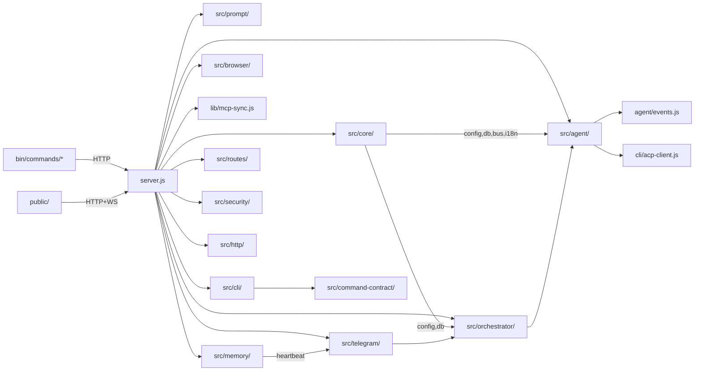

# CLI-CLAW — Source Structure & Function Reference

> 마지막 검증: 2026-02-25T07:44 (Phase 20.6 디렉토리 리팩토링 완료)
> server.js 850L / src/ 35파일 12서브디렉토리 / tests 244 pass
> Phase 9 보안 하드닝 + Phase 17 AI triage + Phase 20.6 모듈 분리 반영
>
> 상세 모듈 문서는 [서브 문서](#서브-문서)를 참조하세요.

---

## File Tree

```text
cli-claw/
├── server.js                 ← Express 라우트 + 글루 + ok/fail + security guards (850L)
├── lib/
│   ├── mcp-sync.js           ← MCP 통합 + 스킬 복사 + DEDUP_EXCLUDED + 글로벌 설치 (645L)
│   ├── upload.js             ← 파일 업로드 + Telegram 다운로드 (70L)
│   └── quota-copilot.js      ← Copilot 할당량 조회 (keychain → API) (67L)
├── src/
│   ├── core/                 ← 의존 0 인프라 계층
│   │   ├── config.js         ← CLAW_HOME, settings, CLI 탐지, APP_VERSION (187L)
│   │   ├── db.js             ← SQLite 스키마 + prepared statements + trace (105L)
│   │   ├── bus.js            ← WS + 내부 리스너 broadcast (18L)
│   │   ├── logger.js         ← 로거 유틸 (11L)
│   │   ├── i18n.js           ← 서버사이드 번역 (90L)
│   │   └── settings-merge.js ← perCli/activeOverrides deep merge (45L)
│   ├── agent/                ← CLI 에이전트 런타임
│   │   ├── spawn.js          ← CLI spawn + ACP 분기 + 큐 + 메모리 flush (567L)
│   │   ├── args.js           ← CLI별 인자 빌더 (67L)
│   │   └── events.js         ← NDJSON 파서 + ACP update + logEventSummary (322L)
│   ├── orchestrator/         ← 직원 오케스트레이션
│   │   ├── pipeline.js       ← Plan → Phase-aware Distribute → Quality Gate (560L)
│   │   └── parser.js         ← triage + subtask JSON + verdict 파싱 (108L)
│   ├── prompt/               ← 프롬프트 조립
│   │   └── builder.js        ← A-1/A-2 + 스킬 + 직원 프롬프트 v2 + promptCache (523L)
│   ├── cli/                  ← 커맨드 시스템
│   │   ├── commands.js       ← 슬래시 커맨드 레지스트리 + 디스패처 (268L)
│   │   ├── handlers.js       ← 18개 커맨드 핸들러 (432L)
│   │   ├── registry.js       ← 5개 CLI/모델 단일 소스 (89L)
│   │   └── acp-client.js     ← Copilot ACP JSON-RPC 클라이언트 (315L)
│   ├── memory/               ← 데이터 영속화
│   │   ├── memory.js         ← Persistent Memory grep 기반 (129L)
│   │   ├── worklog.js        ← Worklog CRUD + phase matrix (153L)
│   │   └── heartbeat.js      ← Heartbeat 잡 스케줄 + fs.watch (107L)
│   ├── telegram/             ← Telegram 인터페이스
│   │   ├── bot.js            ← Telegram 봇 + forwarder lifecycle + origin 필터링 (493L)
│   │   └── forwarder.js      ← 포워딩 헬퍼 (escape, chunk, createForwarder) (105L)
│   ├── browser/              ← Chrome CDP 제어
│   │   ├── connection.js     ← Chrome 탐지/launch/CDP 연결 (71L)
│   │   ├── actions.js        ← snapshot/click/type/navigate/screenshot (179L)
│   │   ├── vision.js         ← vision-click 파이프라인 + Codex provider (138L)
│   │   └── index.js          ← re-export hub (13L)
│   ├── routes/               ← Express 라우트 추출
│   │   ├── quota.js          ← Copilot/Claude/Codex 할당량 (82L)
│   │   └── browser.js        ← 브라우저 API 라우트 (87L)
│   ├── security/             ← 보안 입력 검증
│   │   ├── path-guards.js    ← assertSkillId, assertFilename, safeResolveUnder (64L)
│   │   └── decode.js         ← decodeFilenameSafe (21L)
│   ├── http/                 ← 응답 계약
│   │   ├── response.js       ← ok(), fail() 표준 응답 (23L)
│   │   ├── async-handler.js  ← asyncHandler 래퍼 (12L)
│   │   └── error-middleware.js ← notFoundHandler, errorHandler (25L)
│   └── command-contract/     ← 커맨드 인터페이스 통합
│       ├── catalog.js        ← COMMANDS → capability map 확장 (39L)
│       ├── policy.js         ← getVisibleCommands, getTelegramMenuCommands (37L)
│       └── help-renderer.js  ← renderHelp list/detail mode (44L)
├── public/                   ← Web UI (ES Modules, ~26 files, ~4420L)
│   ├── index.html            ← 뼈대 (456L, data-i18n 완전 한글화)
│   ├── css/                  ← 6 files (1355L)
│   │   ├── variables.css     ← 커스텀 프로퍼티 + 3단 폰트 + 라이트/다크 (140L)
│   │   ├── layout.css        ← 사이드바 + 토글 + 반응형 768px (281L)
│   │   └── markdown.css      ← 렌더링 (테이블·코드·KaTeX·Mermaid) + copy 버튼 (161L)
│   ├── locales/              ← i18n 로케일
│   │   ├── ko.json           ← 한국어 (176키)
│   │   └── en.json           ← 영어 (176키)
│   └── js/                   ← 16 files (~2200L)
│       ├── main.js           ← 앱 진입점 + 5개 모듈 wire (241L)
│       ├── render.js         ← marked+hljs+KaTeX+Mermaid 렌더러 + sanitize (217L)
│       ├── constants.js      ← CLI_REGISTRY 동적 로딩 + ROLE_PRESETS (119L)
│       └── features/
│           ├── i18n.js       ← 프론트엔드 i18n + applyI18n() (126L)
│           ├── sidebar.js    ← 사이드바 접기 (이중 모드) (88L)
│           ├── theme.js      ← 다크/라이트 테마 토글 (38L)
│           └── appname.js    ← Agent Name 커스텀 (43L)
├── bin/
│   ├── cli-claw.js           ← 11개 서브커맨드 라우팅
│   ├── postinstall.js        ← npm install 후 5-CLI 자동설치 + MCP + 스킬 (212L)
│   └── commands/
│       ├── serve.js          ← 서버 시작 (--port/--host/--open)
│       ├── chat.js           ← 터미널 채팅 TUI (3모드, 842L)
│       ├── init.js           ← 초기화 마법사
│       ├── doctor.js         ← 진단 (12개 체크, --json)
│       ├── status.js         ← 서버 상태 (--json)
│       ├── mcp.js            ← MCP 관리 (install/sync/list/reset)
│       ├── skill.js          ← 스킬 관리 (install/remove/info/list/reset)
│       ├── employee.js       ← 직원 관리 (reset, REST API 호출, 67L)
│       ├── reset.js          ← 전체 초기화 (MCP/스킬/직원/세션)
│       ├── memory.js         ← 메모리 CLI (search/read/save/list/init)
│       └── browser.js        ← 브라우저 CLI (17개 서브커맨드, 240L)
├── tests/                    ← 회귀 방지 테스트 (244 pass)
│   ├── events.test.js        ← 이벤트 파서 단위 테스트
│   ├── events-acp.test.js    ← ACP session/update 이벤트 테스트
│   ├── telegram-forwarding.test.js ← Telegram 포워딩 동작 테스트
│   ├── unit/                 ← Tier 1-2 단위 테스트 (~20 files)
│   │   ├── employee-prompt.test.js ← 직원 프롬프트 14건
│   │   ├── orchestrator-parsing.test.js ← subtask 파싱 13건
│   │   ├── orchestrator-triage.test.js  ← triage 판단 10건
│   │   ├── agent-args.test.js        ← CLI args 빌드 16건
│   │   ├── path-guards.test.js       ← 입력 검증 16건
│   │   ├── http-response.test.js     ← ok/fail 6건
│   │   ├── settings-merge.test.js    ← deep merge 5건
│   │   ├── render-sanitize.test.js   ← XSS sanitize 11건
│   │   └── ...
│   └── integration/
│       ├── cli-basic.test.js         ← CLI 기본 통합
│       ├── api-smoke.test.js         ← API 스모크 (서버 기동)
│       └── route-registration.test.js ← 라우트 등록 스모크
├── README.md                 ← 영문 (기본, 언어 스위처)
├── README.ko.md              ← 한국어 번역
├── README.zh-CN.md           ← 중국어 번역
├── TESTS.md                  ← 테스트 상세
├── scripts/                  ← 도구 스크립트
│   ├── check-deps-offline.mjs ← 오프라인 취약 버전 체크
│   └── check-deps-online.sh  ← npm audit + semgrep
├── skills_ref/               ← 번들 스킬 (104개)
└── devlog/                   ← MVP 12 Phase + Post-MVP devlogs
```

### 런타임 데이터 (`~/.cli-claw/`)

| 경로               | 설명                                      |
| ------------------ | ----------------------------------------- |
| `claw.db`          | SQLite DB                                 |
| `settings.json`    | 사용자 설정                               |
| `mcp.json`         | 통합 MCP 설정 (source of truth)           |
| `prompts/`         | A-1, A-2, HEARTBEAT 프롬프트              |
| `memory/`          | Persistent memory (`MEMORY.md`, `daily/`) |
| `skills/`          | Active 스킬 (시스템 프롬프트 주입)        |
| `skills_ref/`      | Reference 스킬 (AI 참조용)                |
| `browser-profile/` | Chrome 사용자 프로필                      |
| `backups/`         | symlink 충돌 시 백업 디렉토리             |

npm 의존성: `express` ^4.21 · `ws` ^8.18 · `better-sqlite3` ^11.7 · `grammy` ^1.40 · `@grammyjs/runner` ^2.0 · `node-fetch` ^3.3 · `playwright-core` ^1.58

---

## 코드 구조 개요



### 디렉토리 의존 규칙 (Phase 20.6)

| 디렉토리 | 의존 대상 | 비고 |
|----------|----------|------|
| `src/core/` | — | 의존 0, 인프라 계층 (config, db, bus, logger, i18n, settings-merge) |
| `src/security/` | — | 의존 0, 입력 검증 |
| `src/http/` | — | 의존 0, 응답 표준화 |
| `src/browser/` | — | 독립 모듈, CDP 제어 |
| `src/cli/` | core, command-contract | 커맨드 레지스트리 + 핸들러 + ACP 클라이언트 |
| `src/command-contract/` | cli/commands | capability map + policy + help |
| `src/prompt/` | core | A-1/A-2 + 스킬 + 직원 프롬프트 v2 |
| `src/memory/` | core | 메모리 + worklog + heartbeat |
| `src/agent/` | core, prompt, orchestrator, cli/acp-client | 핵심 허브 + ACP copilot 분기 |
| `src/orchestrator/` | core, prompt, agent | planning ↔ agent 상호 + phase 관리 |
| `src/telegram/` | core, orchestrator, agent, cli, prompt, memory | 외부 인터페이스 + lifecycle |
| `src/routes/` | core, browser | Express 라우트 추출 |
| `server.js` | 전체 | 글루 레이어 |

---

## 핵심 주의 포인트

1.  **큐**: busy 시 queue → agent 종료 후 자동 처리
2.  **세션 무효화**: CLI 변경 시 session_id 제거
3.  **직원 dispatch**: B 프롬프트에 JSON subtask 포맷
4.  **메모리 flush**: `forceNew` spawn → 메인 세션 분리, threshold개 메시지만 요약 (줄글 1-3문장)
5.  **메모리 주입**: MEMORY.md = 매번, session memory = `injectEvery` cycle마다 (기본 x2)
6.  **에러 처리**: 429/auth 커스텀 메시지
7.  **IPv4 강제**: `--dns-result-order=ipv4first` + Telegram
8.  **MCP 동기화**: mcp.json → 5개 CLI 포맷 자동 변환 (Claude, Codex, Gemini, OpenCode, Copilot)
9.  **이벤트 dedupe**: Claude `stream_event`/`assistant` 중복 방지
10. **Telegram origin**: `origin` 메타 기반으로 포워딩 판단
11. **Forwarder lifecycle**: named handler attach/detach로 중복 등록 방지
12. **symlink 보호**: 실디렉토리 충돌 시 backup 우선
13. **CLI registry**: `src/cli/registry.js`에서 5개 CLI 정의, `/api/cli-registry`로 동기화
14. **Copilot ACP**: JSON-RPC 2.0 over stdio, `session/update` 실시간 스트리밍
15. **Copilot effort**: `~/.copilot/config.json` `reasoning_effort` 직접 수정
16. **Copilot quota**: macOS keychain → `copilot_internal/user` API
17. **ACP ctx reset**: `loadSession()` 전 `ctx.fullText/toolLog/seenToolKeys` 초기화
18. **ACP activityTimeout**: idle 1200s + 절대 1200s 이중 타이머
19. **마크다운 렌더링**: CDN defer, CDN 실패 시 regex fallback
20. **marked v14 주의**: 커스텀 렌더러 API 토큰 기반 변경
21. **Copilot model sync**: `~/.copilot/config.json`에 model + effort 동기화
22. **activeOverrides**: Active CLI → `activeOverrides[cli]`, Employee → `perCli`만 참조
23. **Telegram chatId auto-persist**: `markChatActive()` → `allowedChatIds` 자동 저장
24. **Skills dedup**: `frontend-design`/`webapp-testing` 중복 제거 (104개)
25. **Skills i18n**: `getMergedSkills()` active 스킬에 `name_en`/`desc_en` 필드 통과
26. **[P9] 보안 가드**: path traversal, id injection, filename abuse 차단
27. **[P9] 응답 계약**: `ok(res, data)` / `fail(res, status, error)` 13개 라우트 적용
28. **[P9] settings merge**: `mergeSettingsPatch()` 분리
29. **[P9] command-contract**: capability map + `getTelegramMenuCommands()`
30. **[P9] deps gate**: `check-deps-offline.mjs` + `check-deps-online.sh`
31. **[P17] AI triage**: direct response → subtask JSON 감지 시 orchestration 재진입
32. **[P17.1] Dispatch 정책**: 진짜 여러 전문가 필요할 때만 dispatch
33. **[P17.3] Employee 명칭**: subagent → employee 통일
34. **[P17.4] HTML i18n**: 26키 추가, data-i18n 완전 한글화
35. **[P20.5] XSS 수정**: escapeHtml 인용부호 처리, 4개 모듈 패치
36. **[P20.6] 디렉토리 분리**: flat src/ → 12 subdirs, server.js 850L
37. **[P20.6] promptCache**: `getEmployeePromptV2` 캐싱, orchestrate() 시 clear

---

## 서브 문서

| 문서                                        | 범위                                                          | 파일                                  |
| ------------------------------------------- | ------------------------------------------------------------- | ------------------------------------- |
| [🔧 infra.md](str_func/infra.md)             | core/ (config·db·bus·logger·i18n·settings-merge) + security/ + http/ | 의존 0 계층 + Phase 9 보안/응답  |
| [🌐 server_api.md](str_func/server_api.md)   | server.js · routes/ · REST API · WebSocket                     | 라우트 + 40+ 엔드포인트 + guards |
| [⚡ commands.md](str_func/commands.md)       | cli/ (commands·handlers·registry) + command-contract/          | 레지스트리 + 디스패처 + capability   |
| [🤖 agent_spawn.md](str_func/agent_spawn.md) | agent/ (spawn·args·events) + orchestrator/ (pipeline·parser) + cli/acp-client | spawn + ACP + 오케스트레이션 |
| [📱 telegram.md](str_func/telegram.md)       | telegram/ (bot·forwarder) + memory/heartbeat                   | 외부 인터페이스 + lifecycle + origin   |
| [🎨 frontend.md](str_func/frontend.md)       | public/ 전체 (~25파일, i18n 포함)                              | ES Modules + CSS + 동적 registry      |
| [🧠 prompt_flow.md](str_func/prompt_flow.md) | prompt/builder.js · 직원 프롬프트 · promptCache                | **핵심** — 정적/동적 + Copilot ACP    |
| [📄 prompt_basic_A1.md](str_func/prompt_basic_A1.md) | A-1 기본 프롬프트 원문                                  | EN 기본 프롬프트 레퍼런스 |
| [📄 prompt_basic_A2.md](str_func/prompt_basic_A2.md) | A-2 프롬프트 템플릿                                     | 사용자 편집 가능 |
| [📄 prompt_basic_B.md](str_func/prompt_basic_B.md) | B 프롬프트 원문 (직원 규칙, 위임 정책)                    | 직원 레퍼런스 |

---

## Devlog

**완료 아카이브** (`devlog/_fin/`): MVP P01~12, 260223_권한 P1~13, 260223_모델, 260223_프론트엔드 모듈화, 260223_서브에이전트프롬프트, 260224_cmd P0~P6

**진행 중** (`devlog/`):

| 폴더                          | 주제                                                        | 상태 |
| ----------------------------- | ----------------------------------------------------------- | ---- |
| `260224_skill/`               | 스킬 큐레이션 + Telegram Send + Voice STT (P0~P2)           | 🟡    |
| `260224_vision/`              | Vision Click P1✅ P2✅ — P3 멀티프로바이더 미구현              | 🟡    |
| `260224_orch/`                | 오케스트레이션 v2 P0~P5✅                                     | ✅    |
| `260225_finness/`             | P0~P9✅ + P10~P17✅ + P20~P20.6✅ — 보안, i18n, AI triage, 디렉토리 분리 | ✅    |
| `260225_copilot-cli-integration/` | Copilot ACP 통합 Phase 1~6                              | ✅    |
| `269999_메모리 개선/`          | 메모리 고도화 (flush✅ + vector DB 📋 후순위)                 | 🔜    |

---

> 프로젝트 전체 파일 검증 완전 레퍼런스. 상세는 서브 문서 참조.
