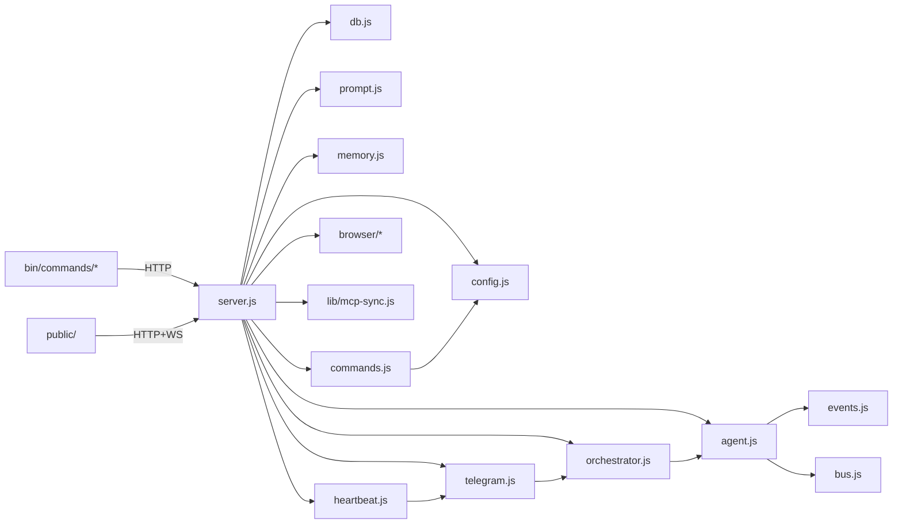

# CLI-Claw — Source Structure & Function Reference

> 마지막 검증: 2026-02-24T15:20 (server.js 757L / agent.js 425L / commands.js 616L / prompt.js 443L / public/ 19파일 ~2982L)
>
> 상세 모듈 문서는 [서브 문서](#서브-문서)를 참조하세요.

---

## File Tree

```text
cli-claw/
├── server.js                 ← 라우트 + 글루 + 슬래시커맨드 ctx (757L)
├── lib/
│   ├── mcp-sync.js           ← MCP 통합 + 스킬 복사 + DEDUP_EXCLUDED + 글로벌 설치 (481L)
│   └── upload.js             ← 파일 업로드 + Telegram 다운로드 (70L)
├── src/
│   ├── config.js             ← CLAW_HOME, settings, CLI 탐지, APP_VERSION (169L)
│   ├── db.js                 ← SQLite 스키마 + prepared statements + trace (84L)
│   ├── bus.js                ← WS + 내부 리스너 broadcast (18L)
│   ├── events.js             ← NDJSON 파싱 + logEventSummary + traceLog + pushTrace (185L)
│   ├── commands.js           ← 슬래시 커맨드 레지스트리 + 디스패쳐 (616L)
│   ├── agent.js              ← CLI spawn + 히스토리빌더 + 스트림 + 큐 + 메모리 flush + 폴백 (425L)
│   ├── orchestrator.js       ← Planning → Sub-agent 오케스트레이션 (131L)
│   ├── telegram.js           ← Telegram 봇 + 슬래시디스패치 + setMyCommands (377L)
│   ├── heartbeat.js          ← Heartbeat 잡 스케줄 + fs.watch (90L)
│   ├── prompt.js             ← 프롬프트 생성 + 스킬 + 서브에이전트 + vision-click + telegram-send 주입 (443L)
│   ├── memory.js             ← Persistent Memory grep 기반 (128L)
│   └── browser/              ← Chrome CDP 제어
│       ├── connection.js     ← Chrome 탐지/launch/CDP 연결 (71L)
│       ├── actions.js        ← snapshot/click/type/navigate/screenshot/mouseClick (179L)
│       ├── vision.js         ← vision-click 파이프라인 + Codex provider (138L)
│       └── index.js          ← re-export hub (13L)
├── public/                   ← Web UI (ES Modules, 19 files, ~2982L)
│   ├── index.html            ← HTML 뼈대 (427L, inline JS/CSS 없음)
│   ├── css/                  ← 5 files (964L)
│   └── js/                   ← 13 files (1597L)
├── bin/
│   ├── cli-claw.js           ← 9개 서브커맨드 라우팅
│   ├── postinstall.js        ← npm install 후 8단계 자동 설정 (138L)
│   └── commands/
│       ├── serve.js          ← 서버 시작 (--port/--host/--open, .env 자동감지)
│       ├── chat.js           ← 터미널 채팅 TUI (3모드, 슬래시커맨드, 자동완성, 832L)
│       ├── init.js           ← 초기화 마법사
│       ├── doctor.js         ← 진단 (11개 체크, --json)
│       ├── status.js         ← 서버 상태 (--json)
│       ├── mcp.js            ← MCP 관리 (install/sync/list/reset)
│       ├── skill.js          ← 스킬 관리 (install/remove/info/list/reset + installFromRef)
│       ├── memory.js         ← 메모리 CLI (search/read/save/list/init)
│       └── browser.js        ← 브라우저 CLI (17개 서브커맨드, +vision-click, 238L)
├── skills_ref/               ← 번들 스킬 (101개: 기존 56 + Phase 0 확장 46개 + 1, registry.json 102항목)
│   └── registry.json
└── devlog/                   ← MVP 12 Phase + Post-MVP 9개 폴더
```

### 런타임 데이터 (`~/.cli-claw/`)

| 경로               | 설명                                      |
| ------------------ | ----------------------------------------- |
| `claw.db`          | SQLite DB                                 |
| `settings.json`    | 사용자 설정                               |
| `mcp.json`         | 통합 MCP 설정 (source of truth)           |
| `prompts/`         | A-1, A-2, HEARTBEAT 프롬프트              |
| `memory/`          | Persistent memory (`MEMORY.md`, `daily/`) |
| `skills/`          | Active 스킬 (시스템 프롬프트 주입)        |
| `skills_ref/`      | Reference 스킬 (AI 참조용)                |
| `browser-profile/` | Chrome 사용자 프로필                      |

npm 의존성: `express` ^4.21 · `ws` ^8.18 · `better-sqlite3` ^11.7 · `grammy` ^1.40 · `@grammyjs/runner` ^2.0 · `@grammyjs/transformer-throttler` ^1.2 · `node-fetch` ^3.3 · `playwright-core` ^1.58

---

## 코드 구조 개요



### 모듈 의존 규칙

| 모듈              | 의존 대상                                              | 비고                         |
| ----------------- | ------------------------------------------------------ | ---------------------------- |
| `bus.js`          | —                                                      | 의존 0, broadcast 허브       |
| `config.js`       | —                                                      | 의존 0, 경로/설정만          |
| `db.js`           | config                                                 | DB_PATH만 사용               |
| `events.js`       | bus                                                    | broadcast만 사용             |
| `memory.js`       | config                                                 | CLAW_HOME만, 독립 모듈       |
| `agent.js`        | bus, config, db, events, prompt, orchestrator          | 핵심 허브                    |
| `orchestrator.js` | bus, db, prompt, agent                                 | planning ↔ agent 상호        |
| `telegram.js`     | bus, config, db, agent, orchestrator, commands, upload | 외부 인터페이스              |
| `heartbeat.js`    | config, telegram                                       | telegram re-export           |
| `prompt.js`       | config, db                                             | A-1/A-2 + 스킬               |
| `commands.js`     | config                                                 | 커맨드 레지스트리 + 디스패쳐 |
| `browser/*`       | —                                                      | 독립 모듈                    |

---

## 핵심 주의 포인트

1. **큐**: busy 시 queue → agent 종료 후 자동 처리
2. **세션 무효화**: CLI 변경 시 session_id 제거
3. **직원 dispatch**: B 프롬프트에 JSON subtask 포맷
4. **메모리 flush**: `forceNew` spawn → 메인 세션 분리, threshold개 메시지만 요약 (줄글 1-3문장)
5. **메모리 주입**: MEMORY.md = 매번, session memory = `injectEvery` cycle마다 (기본 x2)
6. **에러 처리**: 429/auth 커스텀 메시지
7. **IPv4 강제**: `--dns-result-order=ipv4first` + Telegram
8. **MCP 동기화**: mcp.json → 4개 CLI 포맷 자동 변환

---

## 서브 문서

| 문서                                        | 범위                                               | 파일                             |
| ------------------------------------------- | -------------------------------------------------- | -------------------------------- |
| [🔧 infra.md](str_func/infra.md)             | config · db · bus · memory · browser · mcp-sync    | 의존 0 모듈 + 데이터 레이어      |
| [🌐 server_api.md](str_func/server_api.md)   | server.js · REST API · WebSocket · CLI 명령어      | 라우트 + 초기화 + 40+ 엔드포인트 |
| [⚡ commands.md](str_func/commands.md)       | commands.js · 슬래시 커맨드 · slash-commands.js    | 레지스트리 + 디스패쳐 + Web UI   |
| [🤖 agent_spawn.md](str_func/agent_spawn.md) | agent.js · events.js · orchestrator.js · prompt.js | spawn + 스트림 + 오케스트레이션  |
| [📱 telegram.md](str_func/telegram.md)       | telegram.js · heartbeat.js                         | 외부 인터페이스 + 스케줄         |
| [🎨 frontend.md](str_func/frontend.md)       | public/ 전체 (19파일)                              | ES Modules + CSS 시스템          |
| [🧠 prompt_flow.md](str_func/prompt_flow.md) | 프롬프트 조립 · CLI별 삽입 · 직원 프롬프트         | **핵심** — 정적/동적 + Mermaid   |

---

## Devlog

**MVP** (`devlog/mvp/`): Phase 01~12 — foundation → single-agent → prompt → web-ui → orchestration → telegram → integration → heartbeat → cli → photo-input → memory → mvp-설치

**Post-MVP** (`devlog/260223_*/`, `devlog/260224_*/`):

| 폴더                              | 주제                                                      | 상태 |
| --------------------------------- | --------------------------------------------------------- | ---- |
| `260223_권한/`                    | 권한 + 모듈화 + 스킬 + 브라우저 (P1~13)                   | ✅    |
| `260223_메모리 개선/`             | 메모리 고도화 (flush 개선 + 신규 메모리)                  | ✅    |
| `260223_모델/`                    | 모델 목록 + custom input                                  | ✅    |
| `260223_프론트엔드/`              | Web UI ES Modules 모듈화 (Phase 10)                       | ✅    |
| `260223_11_서브에이전트프롬프트/` | 서브에이전트 프롬프트 구조화 (Phase 11)                   | ✅    |
| `260224_cmd/`                     | 슬래시 커맨드 + 프롬프트 정규화 (P1✅ P2✅ P3✅ P4✅ P5✅ P6📋) | 🟡    |
| `260224_skill/`                   | 스킬 큐레이션 + Telegram Send + Voice STT (P0~P2)         | 🟡    |
| `260224_vision/`                  | Vision Click P1✅ P2✅ — 원커맨드 + DPR 자동 보정           | ✅    |
| `260224_orch/`                    | 오케스트레이션 워크플로우 v2 + Fallback 구현 (P0✅)        | 🟡    |

---

> 프로젝트 전체 파일 검증 완전 레퍼런스. 상세는 서브 문서 참조.
