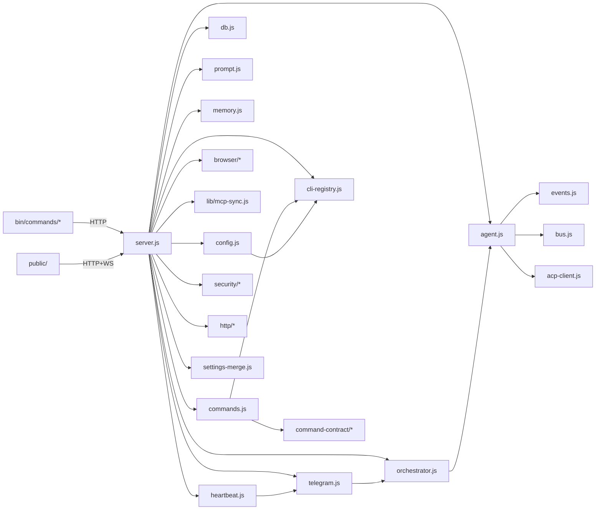

# CLI-CLAW — Source Structure & Function Reference

> 마지막 검증: 2026-02-25T05:56 (server.js 949L / agent.js 619L / orchestrator.js 584L / prompt.js 501L / telegram.js 493L / acp-client.js 315L / cli-registry.js 88L)
> Phase 9 구현 완료: 보안 가드, HTTP 유틸, settings-merge, catch 정책, deps gate, command-contract
>
> 상세 모듈 문서는 [서브 문서](#서브-문서)를 참조하세요.

---

## File Tree

```text
cli-claw/
├── server.js                 ← 라우트 + 글루 + ok/fail + security guards + activeOverrides (962L)
├── lib/
│   ├── mcp-sync.js           ← MCP 통합 + 스킬 복사 + DEDUP_EXCLUDED + 글로벌 설치 + symlink 보호 (645L)
│   ├── upload.js             ← 파일 업로드 + Telegram 다운로드 (70L)
│   └── quota-copilot.js      ← [NEW] Copilot 할당량 조회 (keychain→copilot_internal/user API) (67L)
├── src/
│   ├── cli-registry.js       ← [NEW] 5개 CLI/모델 단일 소스 레지스트리 + effortNote (88L)
│   ├── acp-client.js         ← [NEW] Copilot ACP JSON-RPC 클라이언트 + optionId 폴백 + activityTimeout + _handleLine heartbeat (315L)
│   ├── config.js             ← CLAW_HOME, settings, CLI 탐지 (cli-registry 기반), APP_VERSION (187L)
│   ├── db.js                 ← SQLite 스키마 + prepared statements + trace (84L)
│   ├── bus.js                ← WS + 내부 리스너 broadcast + removeBroadcastListener(fn) (18L)
│   ├── events.js             ← NDJSON 파싱 + dedupe key + ACP update 파싱 + logEventSummary + test helpers (322L)
│   ├── commands.js           ← 슬래시 커맨드 레지스트리 + 디스패쳐 (cli-registry import) (658L)
│   ├── agent.js              ← CLI spawn + ACP 분기 + model+effort config.json 동기화 + activeOverrides + origin 전달 + ctx reset + 스트림 + 큐 + 메모리 flush (624L)
│   ├── orchestrator.js       ← Orchestration v2 + triage + 순차실행 + origin 전달 + phase skip + AI dispatch 재진입 (637L)
│   ├── worklog.js            ← Worklog CRUD + phase matrix + PHASES (153L)
│   ├── telegram.js           ← Telegram 봇 + forwarder lifecycle + origin 필터링 + chatId auto-persist + 디바운스 tool 업데이트 (493L)
│   ├── telegram-forwarder.js ← [NEW] Telegram 포워딩 헬퍼 추출 (escape, chunk, createForwarder) (105L)
│   ├── heartbeat.js          ← Heartbeat 잡 스케줄 + pending queue + fs.watch (107L)
│   ├── prompt.js             ← 프롬프트 + 스킬 + getMergedSkills i18n 필드 통과 + 직원(employee) 프롬프트 v2 + phase skip + EN defaults + 브라우저 커맨드 인라인 + Telegram bot-first + dispatch 정책 교정 (515L)
│   ├── memory.js             ← Persistent Memory grep 기반 (129L)
│   ├── settings-merge.js     ← [P9.4] perCli/activeOverrides deep merge 추출 (46L)
│   ├── security/             ← [P9.1] 보안 입력 검증
│   │   ├── path-guards.js    ← assertSkillId, assertFilename, safeResolveUnder (67L)
│   │   └── decode.js         ← decodeFilenameSafe (22L)
│   ├── http/                 ← [P9.2] 응답 계약
│   │   ├── response.js       ← ok(), fail() 표준 응답 (25L)
│   │   ├── async-handler.js  ← asyncHandler 래퍼 (12L)
│   │   └── error-middleware.js ← notFoundHandler, errorHandler (27L)
│   ├── command-contract/     ← [P9.5] 커맨드 인터페이스 통합
│   │   ├── catalog.js        ← COMMANDS → capability map 확장 (39L)
│   │   ├── policy.js         ← getVisibleCommands, getTelegramMenuCommands (40L)
│   │   └── help-renderer.js  ← renderHelp list/detail mode (46L)
│   └── browser/              ← Chrome CDP 제어
│       ├── connection.js     ← Chrome 탐지/launch/CDP 연결 (71L)
│       ├── actions.js        ← snapshot/click/type/navigate/screenshot/mouseClick (179L)
│       ├── vision.js         ← vision-click 파이프라인 + Codex provider (138L)
│       └── index.js          ← re-export hub (13L)
├── public/                   ← Web UI (ES Modules, 25 files, ~4272L)
│   ├── index.html            ← 뼈대 (443L, CDN 4개 + data-theme + ◀/▶ 토글)
│   ├── css/                  ← 6 files (1355L)
│   │   ├── variables.css     ← 커스텀 프로퍼티 + 3단 폰트 + 라이트 팔레트 + 사이드바 변수 (126L)
│   │   ├── layout.css        ← 사이드바 + 토글 absolute + collapse + 반응형 900px (281L)
│   │   └── markdown.css      ← 렌더링 (테이블·코드·KaTeX·Mermaid) + 시맨틱 색상 var + copy 버튼 (161L)
│   └── js/                   ← 16 files (~2159L)
│       ├── main.js           ← 앱 진입점 + 5개 모듈 wire (241L)
│       ├── render.js         ← marked+hljs+KaTeX+Mermaid 렌더러 + rehighlightAll + copy delegation + sanitize (217L)
│       ├── constants.js      ← CLI_REGISTRY 동적 로딩 + ROLE_PRESETS (119L)
│       └── features/
│           ├── sidebar.js    ← [NEW] 사이드바 접기 (이중 모드 responsive) (88L)
│           ├── theme.js      ← [NEW] 다크/라이트 테마 토글 + hljs 스와프 (38L)
│           └── appname.js    ← [NEW] Agent Name 커스텀 (43L)
├── bin/
│   ├── cli-claw.js           ← 11개 서브커맨드 라우팅
│   ├── postinstall.js        ← npm install 후 5-CLI 자동설치(bun→npm 폴백) + MCP + 스킬 + Copilot (212L)
│   └── commands/
│       ├── serve.js          ← 서버 시작 (--port/--host/--open, .env 자동감지)
│       ├── chat.js           ← 터미널 채팅 TUI (3모드, 슬래시커맨드, 자동완성, 842L)
│       ├── init.js           ← 초기화 마법사
│       ├── doctor.js         ← 진단 (12개 체크 — 5 CLI 포함, --json)
│       ├── status.js         ← 서버 상태 (--json)
│       ├── mcp.js            ← MCP 관리 (install/sync/list/reset)
│       ├── skill.js          ← 스킬 관리 (install/remove/info/list/reset + installFromRef)
│       ├── employee.js       ← 직원 관리 (reset, REST API 호출, 67L)
│       ├── reset.js          ← 전체 초기화 (MCP/스킬/직원/세션, y/N 확인)
│       ├── memory.js         ← 메모리 CLI (search/read/save/list/init)
│       └── browser.js        ← 브라우저 CLI (17개 서브커맨드, +vision-click, 240L)
├── tests/                    ← 회귀 방지 테스트 (216 tests)
│   ├── events.test.js        ← 이벤트 파서 단위 테스트 (dedupe, fallback 등)
│   ├── events-acp.test.js    ← ACP session/update 이벤트 테스트
│   ├── telegram-forwarding.test.js ← Telegram 포워딩 동작 테스트
│   ├── unit/                 ← Tier 1-2 단위 테스트
│   │   ├── cli-registry.test.js
│   │   ├── bus.test.js
│   │   ├── commands-parse.test.js
│   │   ├── commands-policy.test.js   ← [P9.5] capability 정책 5건
│   │   ├── help-renderer.test.js     ← [P9.5] 렌더러 5건
│   │   ├── path-guards.test.js       ← [P9.1] 입력 검증 16건
│   │   ├── decode.test.js            ← [P9.1] 디코딩 5건
│   │   ├── http-response.test.js     ← [P9.2] ok/fail 6건
│   │   ├── async-handler.test.js     ← [P9.2] 래퍼 4건
│   │   ├── orchestrator-parsing.test.js ← [P9.4] subtask 파싱 13건
│   │   ├── orchestrator-triage.test.js  ← [P9.4] triage 판단 10건
│   │   ├── agent-args.test.js        ← [P9.4] CLI args 빌드 16건
│   │   ├── settings-merge.test.js    ← [P9.4] deep merge 5건
│   │   ├── deps-check.test.js        ← [P9.7] semver 검증 10건
│   │   ├── render-sanitize.test.js   ← XSS sanitize 11건
│   │   └── worklog.test.js
│   ├── integration/
│   │   └── route-registration.test.js ← [P9.3] 라우트 등록 스모크
│   └── fixtures/             ← CLI별 이벤트 fixture JSON
├── README.md                 ← 영문 (기본, 언어 스위처)
├── README.ko.md              ← 한국어 번역
├── README.zh-CN.md           ← 중국어 번역
├── TESTS.md                  ← 테스트 상세 (README에서 분리)
├── scripts/                  ← 도구 스크립트
│   ├── check-copilot-gap.js  ← 문서-코드 갭 검사
│   ├── check-deps-offline.mjs ← [P9.7] 오프라인 취약 버전 체크
│   └── check-deps-online.sh  ← [P9.7] npm audit + semgrep
└── skills_ref/               ← 번들 스킬 (104개, registry.json 104항목)
│   └── registry.json
└── devlog/                   ← MVP 12 Phase + Post-MVP 11개 폴더
```

### 런타임 데이터 (`~/.cli-claw/`)

| 경로               | 설명                                      |
| ------------------ | ----------------------------------------- |
| `claw.db`          | SQLite DB                                 |
| `settings.json`    | 사용자 설정                               |
| `mcp.json`         | 통합 MCP 설정 (source of truth)           |
| `prompts/`         | A-1, A-2, HEARTBEAT 프롬프트              |
| `memory/`          | Persistent memory (`MEMORY.md`, `daily/`) |
| `skills/`          | Active 스킬 (시스템 프롬프트 주입)        |
| `skills_ref/`      | Reference 스킬 (AI 참조용)                |
| `browser-profile/` | Chrome 사용자 프로필                      |
| `backups/`         | symlink 충돌 시 백업 디렉토리             |

npm 의존성: `express` ^4.21 · `ws` ^8.18 · `better-sqlite3` ^11.7 · `grammy` ^1.40 · `@grammyjs/runner` ^2.0 · `@grammyjs/transformer-throttler` ^1.2 · `node-fetch` ^3.3 · `playwright-core` ^1.58

---

## 코드 구조 개요



### 모듈 의존 규칙

| 모듈              | 의존 대상                                              | 비고                           |
| ----------------- | ------------------------------------------------------ | ------------------------------ |
| `bus.js`          | —                                                      | 의존 0, broadcast 허브         |
| `config.js`       | cli-registry                                           | registry 기반 CLI 탐지         |
| `cli-registry.js` | —                                                      | 의존 0, CLI/모델 단일 소스     |
| `db.js`           | config                                                 | DB_PATH만 사용                 |
| `events.js`       | bus                                                    | broadcast + dedupe key + ACP   |
| `memory.js`       | config                                                 | CLAW_HOME만, 독립 모듈         |
| `acp-client.js`   | —                                                      | 의존 0, Copilot ACP 클라이언트 |
| `agent.js`        | bus, config, db, events, prompt, orchestrator, acp-client | 핵심 허브 + ACP copilot 분기 |
| `orchestrator.js` | bus, db, prompt, agent                                 | planning ↔ agent 상호 + origin |
| `telegram.js`     | bus, config, db, agent, orchestrator, commands, upload | 외부 인터페이스 + lifecycle    |
| `heartbeat.js`    | config, telegram                                       | telegram re-export             |
| `prompt.js`       | config, db                                             | A-1/A-2 + 스킬                 |
| `commands.js`     | config, cli-registry                                   | 커맨드 레지스트리 + 동적 모델  |
| `command-contract/*` | commands                                             | capability map + policy + help |
| `security/*`      | —                                                      | 입력 검증 (path, id, filename) |
| `http/*`          | —                                                      | 응답 표준화 + 에러 미들웨어    |
| `settings-merge`  | —                                                      | perCli/activeOverrides merge   |
| `browser/*`       | —                                                      | 독립 모듈                      |

---

## 핵심 주의 포인트

1.  **큐**: busy 시 queue → agent 종료 후 자동 처리
2.  **세션 무효화**: CLI 변경 시 session_id 제거
3.  **직원 dispatch**: B 프롬프트에 JSON subtask 포맷
4.  **메모리 flush**: `forceNew` spawn → 메인 세션 분리, threshold개 메시지만 요약 (줄글 1-3문장)
5.  **메모리 주입**: MEMORY.md = 매번, session memory = `injectEvery` cycle마다 (기본 x2)
6.  **에러 처리**: 429/auth 커스텀 메시지
7.  **IPv4 강제**: `--dns-result-order=ipv4first` + Telegram
8.  **MCP 동기화**: mcp.json → 5개 CLI 포맷 자동 변환 (Claude, Codex, Gemini, OpenCode, Copilot)
9.  **이벤트 dedupe**: Claude `stream_event`/`assistant` 중복 방지 (dedupe key + `hasClaudeStreamEvents` 플래그)
10. **Telegram origin**: `tgProcessing` 전역 bool 제거, `origin` 메타 기반으로 포워딩 판단
11. **Forwarder lifecycle**: named handler attach/detach로 `initTelegram()` 재호출 시 중복 등록 방지
12. **symlink 보호**: 실디렉토리 충돌 시 backup 우선 (무조건 삭제 금지)
13. **CLI registry**: `src/cli-registry.js`에서 5개 CLI 정의, 프론트/백엔드가 `/api/cli-registry`로 동기화
14. **Copilot ACP**: JSON-RPC 2.0 over stdio, `session/update` 이벤트로 실시간 스트리밍
15. **Copilot effort**: `--reasoning-effort` 미지원 → `~/.copilot/config.json` `reasoning_effort` 직접 수정
16. **Copilot quota**: macOS keychain `copilot-cli` → `copilot_internal/user` API (캐싱, 서버당 1회 팝업)
17. **ACP ctx reset**: `loadSession()` 히스토리 리플레이 → `prompt()` 전 `ctx.fullText/toolLog/seenToolKeys` 초기화 필수
18. **ACP activityTimeout**: `session/prompt`에 고정 타임아웃 대신 idle 1200s + 절대 1200s 이중 타이머, `_handleLine`에서 모든 JSON-RPC 메시지 + stderr 활동으로 idle 자동 리셋
19. **마크다운 렌더링**: CDN defer (marked v14, hljs v11, KaTeX 0.16, Mermaid v11), CDN 실패 시 regex fallback
20. **marked v14 주의**: 커스텀 렌더러 API 토큰 기반 변경 — `renderer.table({header, body})` 불가, regex 후처리로 대안
21. **Copilot model sync**: `~/.copilot/config.json`에 model + effort 모두 동기화 (spawn 시 자동)
22. **activeOverrides**: Active CLI 모델/effort 변경은 `activeOverrides[cli]`에 저장, Employee는 `perCli`만 참조 → 상호 간섭 없음
23. **Copilot spawn 로그**: `[claw:main] Spawning: copilot --acp --model {model} [{permissions}]` 형태로 실제 ACP args 표시
24. **Telegram chatId auto-persist**: `markChatActive()` → `allowedChatIds` 자동 저장, 서버 재시작 시 pre-seed → web/cli 포워딩 즉시 동작
25. **Skills dedup**: `frontend-design`/`webapp-testing` 중복 제거, `kreuzberg` phantom 정리 (107→104)
26. **Skills i18n pass-through**: `getMergedSkills()` active 스킬에 `name_en`/`desc_en` 필드 통과 → locale 전환 시 영어 표시
27. **[P9.1] 보안 가드**: `assertSkillId`/`assertFilename`/`safeResolveUnder`/`decodeFilenameSafe`로 path traversal, id injection, filename abuse 차단. 4개 라우트 (memory-files, upload, skills, claw-memory) 적용
28. **[P9.2] 응답 계약**: `ok(res, data)` / `fail(res, status, error)` 표준 응답. 13개 라우트 적용. `asyncHandler` 래퍼로 async 에러 전달
29. **[P9.4] settings merge 추출**: `applySettingsPatch` 내 perCli/activeOverrides deep merge → `mergeSettingsPatch()` 함수로 분리
30. **[P9.5] command-contract**: `COMMANDS` 배열을 capability map으로 확장 (full/readonly/hidden/blocked per interface). `getTelegramMenuCommands()`로 Telegram 메뉴 통합
31. **[P9.6] catch 정책**: 상 12건 warn/debug, 중 5건 warn, 낮 5건 `/* expected */` 주석. 총 22건 처리
32. **[P9.7] deps gate**: `check-deps-offline.mjs` (ws/node-fetch advisory 대조, exit 0/1), `check-deps-online.sh` (npm audit + semgrep). `npm run check:deps`
33. **hljs CDN v11**: CDN 404 수정 (`cdnjs.cloudflare.com` → v11.11.1), `rehighlightAll()` 폴링으로 lazy load 후 재하이라이트, 코드 복사 버튼 event delegation
34. **User message markdown**: `ui.js` 유저 메시지에도 `renderMarkdown()` 적용 (agent 전용 → 전체 적용)
35. **Prompt restructure**: Browser 섬션 인라인화 (snapshot→act→verify workflow), Telegram file delivery bot-first 방식, heartbeat `HEARTBEAT_OK` 응답 규칙
36. **[P17] AI-driven triage**: direct response 경로에서 에이전트가 subtask JSON 출력 시 orchestration 재진입 (regex만으로 판단 → AI 자율 dispatch)
37. **[P17.1] Dispatch 정책 교정**: "항상 subtask JSON 출력하라" → "진짜 여러 전문가 필요할 때만 dispatch" + dev 스킬 참조 의무화

---

## 서브 문서

| 문서                                        | 범위                                                          | 파일                                  |
| ------------------------------------------- | ------------------------------------------------------------- | ------------------------------------- |
| [🔧 infra.md](str_func/infra.md)             | config · db · bus · memory · browser · mcp-sync · cli-registry · security · http · settings-merge | 의존 0 모듈 + 데이터 레이어 + Phase 9 보안/응답  |
| [🌐 server_api.md](str_func/server_api.md)   | server.js · REST API · WebSocket · CLI 명령어                  | 라우트 + 40+ 엔드포인트 + ok/fail + guards |
| [⚡ commands.md](str_func/commands.md)       | commands.js · 슬래시 커맨드 · command-contract · slash-commands.js | 레지스트리 + 디스패철 + capability   |
| [🤖 agent_spawn.md](str_func/agent_spawn.md) | agent.js · events.js · orchestrator.js · prompt.js · acp-client | spawn + ACP + 스트림 + 오케스트레이션 |
| [📱 telegram.md](str_func/telegram.md)       | telegram.js · heartbeat.js                                     | 외부 인터페이스 + lifecycle + origin   |
| [🎨 frontend.md](str_func/frontend.md)       | public/ 전체 (23파일)                                          | ES Modules + CSS + 동적 registry      |
| [🧠 prompt_flow.md](str_func/prompt_flow.md) | 프롬프트 조립 · CLI별 삽입 · 직원 프롬프트                      | **핵심** — 정적/동적 + Copilot ACP    |
| [📄 prompt_basic_A1.md](str_func/prompt_basic_A1.md) | A-1 기본 프롬프트 원문 (오케스트레이션 규칙, 브라우저 커맨드, Telegram) | EN 기본 프롬프트 레퍼런스 |
| [📄 prompt_basic_A2.md](str_func/prompt_basic_A2.md) | A-2 프롬프트 템플릿 (heartbeat, 익스텐션)                 | 사용자 편집 가능 테플릿 |
| [📄 prompt_basic_B.md](str_func/prompt_basic_B.md) | B 프롬프트 원문 (직원(employee) 규칙, 직원 프롬프트, 위임 정책) | 직원(employee) 레퍼런스 |

---

## Devlog

**완료 아카이브** (`devlog/_fin/`): MVP P01~12, 260223_권한 P1~13, 260223_모델, 260223_프론트엔드 모듈화, 260223_서브에이전트프롬프트, 260224_cmd P0~P6

**진행 중** (`devlog/`):

| 폴더                          | 주제                                                        | 상태 |
| ----------------------------- | ----------------------------------------------------------- | ---- |
| `260224_skill/`               | 스킬 큐레이션 + Telegram Send + Voice STT (P0~P2)           | 🟡    |
| `260224_vision/`              | Vision Click P1✅ P2✅ — P3 멀티프로바이더 미구현              | 🟡    |
| `260224_orch/`                | 오케스트레이션 v2 P0✅ P1✅ P2✅ P3✅ P4✅ P5✅                   | ✅    |
| `260225_finness/`             | P0~P6.2✅ + P7.9✅ (XSS+Auth) + P12✅ (AGENTS.md) + P13✅ (TG chatId) + P14✅ (스킬 dedup) + P7.1 fix✅ + P16✅ (orchestrate_done UI) + P8✅ (감사) + P9✅ (하드닝) + **P17✅ (AI triage)** | ✅    |
| `260225_copilot-cli-integration/` | Copilot ACP 통합 Phase 1~6 완료 (할당량+effort+브랜딩)  | ✅    |
| `269999_메모리 개선/`          | 메모리 고도화 (flush✅ + vector DB 📋 후순위)                 | 🔜    |

---

> 프로젝트 전체 파일 검증 완전 레퍼런스. 상세는 서브 문서 참조.
