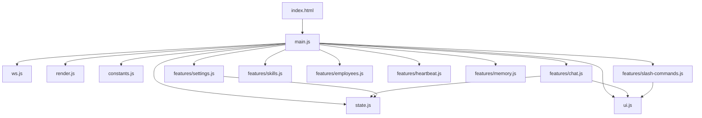

# Frontend — public/ (19 files, ~2907L)

> Web UI — Vanilla HTML + CSS + ES Modules. 인라인 JS/CSS 없음.

---

## 파일 구조

```text
public/
├── index.html            ← HTML 뼈대 (421L, inline JS/CSS 없음)
├── css/
│   ├── variables.css     ← CSS 커스텀 프로퍼티, 리셋 (47L)
│   ├── layout.css        ← 사이드바, 탭, 세이브바 (162L)
│   ├── chat.css          ← 채팅, 메시지, 타이핑, 첨부, 드롭다운, 멈춤 버튼 (369L)
│   ├── sidebar.css       ← 설정, 스킬 카드, 토글 (215L)
│   └── modals.css        ← 모달, 하트비트 카드 (171L)
└── js/
    ├── main.js           ← 앱 진입점 + 이벤트 바인딩 (221L)
    ├── state.js          ← 공유 상태 모듈 (16L)
    ├── constants.js      ← MODEL_MAP, ROLE_PRESETS (23L)
    ├── render.js         ← renderMarkdown, escapeHtml (20L)
    ├── ui.js             ← DOM 조작 유틸 + stop-mode 토글 (142L)
    ├── ws.js             ← WebSocket 연결 + 메시지 라우팅 (41L)
    └── features/
        ├── chat.js       ← 전송, 첨부, 드래그앤드롭, 멈춤, 큐 (154L)
        ├── settings.js   ← 설정, CLI 상태, MCP, 프롬프트 (351L)
        ├── skills.js     ← 로드, 토글, 필터, 기타 카테고리 (69L)
        ├── employees.js  ← 서브에이전트 CRUD (92L)
        ├── heartbeat.js  ← 하트비트 모달/작업 (83L)
        ├── memory.js     ← 메모리 모달/설정 (90L)
        └── slash-commands.js ← 슬래시 커맨드 드롭다운 (220L)
```

---

## 모듈 구성

### Core Layer

| 모듈           | 역할                             | 라인 |
| -------------- | -------------------------------- | ---- |
| `main.js`      | 앱 진입점, 이벤트 바인딩         | 221  |
| `state.js`     | 공유 상태 (`currentMessages` 등) | 16   |
| `constants.js` | `MODEL_MAP`, `ROLE_PRESETS`      | 23   |

### Utility Layer

| 모듈        | 역할                        | 라인 |
| ----------- | --------------------------- | ---- |
| `render.js` | Markdown 렌더 + HTML escape | 20   |
| `ui.js`     | DOM 유틸 + stop-mode        | 142  |
| `ws.js`     | WebSocket + 메시지 라우팅   | 41   |

### Features Layer

| 모듈                | 역할                     | 라인 |
| ------------------- | ------------------------ | ---- |
| `chat.js`           | 전송, 첨부, 드래그앤드롭 | 154  |
| `settings.js`       | 설정 패널 전체           | 351  |
| `skills.js`         | 스킬 카드 UI             | 69   |
| `employees.js`      | 서브에이전트 CRUD        | 92   |
| `heartbeat.js`      | 하트비트 모달            | 83   |
| `memory.js`         | 메모리 모달              | 90   |
| `slash-commands.js` | 슬래시 커맨드 드롭다운   | 220  |

---

## CSS 시스템

| 파일            | 역할                        | 라인 |
| --------------- | --------------------------- | ---- |
| `variables.css` | 커스텀 프로퍼티, 리셋, 테마 | 47   |
| `layout.css`    | 사이드바, 탭, 세이브바      | 162  |
| `chat.css`      | 채팅 영역 전체 스타일       | 369  |
| `sidebar.css`   | 설정, 스킬 카드, 토글       | 215  |
| `modals.css`    | 모달, 하트비트 카드         | 171  |

**총 CSS**: 964L · **총 JS**: 1522L · **HTML**: 421L

---

## 의존 그래프



> ES Module `<script type="module">` 사용. 모든 import는 상대 경로.
