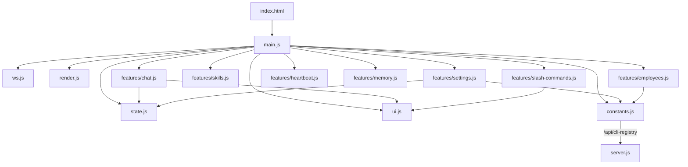

# Frontend — public/ (20 files, ~3500L)

> Web UI — Vanilla HTML + CSS + ES Modules. CDN defer: marked v14, highlight.js v11, KaTeX 0.16, Mermaid v11. CLI/모델은 API에서 동적 로딩.

---

## 파일 구조

```text
public/
├── index.html            ← HTML 뼈대 (422L, CDN defer 4개, 🦞 CLI-CLAW 브랜딩)
├── css/
│   ├── variables.css     ← CSS 커스텀 프로퍼티, 리셋 (47L)
│   ├── layout.css        ← 사이드바, 탭, 세이브바 (162L)
│   ├── chat.css          ← 채팅, 메시지, 타이핑, 첨부, 드롭다운, 멈춤 버튼 (369L)
│   ├── sidebar.css       ← 설정, 스킬 카드, 토글 (215L)
│   ├── modals.css        ← 모달, 하트비트 카드 (171L)
│   └── markdown.css      ← [NEW] 마크다운 렌더링 (테이블·코드·인용·KaTeX·Mermaid) (149L)
└── js/
    ├── main.js           ← 앱 진입점 + 이벤트 바인딩 (233L)
    ├── state.js          ← 공유 상태 모듈 (16L)
    ├── constants.js      ← fetchCliRegistry() 동적 로딩 (119L)
    ├── render.js         ← [REWRITE] marked+hljs+KaTeX+Mermaid 렌더러, CDN 실패시 regex fallback (141L)
    ├── ui.js             ← DOM 조작 유틸 + stop-mode 토글 (142L)
    ├── ws.js             ← WebSocket 연결 + 메시지 라우팅 (60L)
    └── features/
        ├── chat.js       ← 전송, 첨부, 드래그앤드롭, 멈춤, 큐 (160L)
        ├── settings.js   ← 설정, CLI 상태, MCP, 프롬프트, perCli (copilot 포함) (524L)
        ├── skills.js     ← 로드, 토글, 필터, 기타 카테고리 (69L)
        ├── employees.js  ← 서브에이전트 CRUD (CLI 드롭다운 동적 생성) (106L)
        ├── heartbeat.js  ← 하트비트 모달/작업 (83L)
        ├── memory.js     ← 메모리 모달/설정 (90L)
        └── slash-commands.js ← 슬래시 커맨드 드롭다운 (220L)
```

---

## CLI/모델 동적 로딩 (cli-registry 통합)

하드코딩 `MODEL_MAP` 제거 → `/api/cli-registry` API에서 동적 로딩 + 서버 미기동 시 fallback:

```js
// public/js/constants.js (119L)
export const FALLBACK_CLI_REGISTRY = { /* cli-registry.js와 동일 */ };
export let MODEL_MAP = toModelMap(FALLBACK_CLI_REGISTRY);

export async function loadCliRegistry() {
    const data = await (await fetch('/api/cli-registry')).json();
    applyRegistry(data);
}
// settings.js, employees.js, main.js에서 동적 호출
```

### index.html 변경

- CLI 선택 `<select>`: 5개 option (claude, codex, gemini, opencode, **copilot**) — 동적 렌더링 (`loadCliRegistry()`)
- CLI별 모델 `<select>`: 동적 렌더링 (`syncPerCliModelAndEffortControls()`)

---

## 모듈 구성

### Core Layer

| 모듈           | 역할                       | 라인 |
| -------------- | -------------------------- | ---- |
| `main.js`      | 앱 진입점, 이벤트 바인딩   | 233  |
| `state.js`     | 공유 상태                  | 16   |
| `constants.js` | `loadCliRegistry()` + FALLBACK | 119  |

### Utility Layer

| 모듈        | 역할                        | 라인 |
| ----------- | --------------------------- | ---- |
| `render.js` | marked+hljs+KaTeX+Mermaid 렌더러 (CDN fallback) | 141  |
| `ui.js`     | DOM 유틸 + stop-mode        | 142  |
| `ws.js`     | WebSocket + 메시지 라우팅   | 60   |

### Features Layer

| 모듈                | 역할                          | 라인 |
| ------------------- | ----------------------------- | ---- |
| `chat.js`           | 전송, 첨부, 드래그앤드롭      | 160  |
| `settings.js`       | 설정 패널 + perCli (5개 CLI)  | 524  |
| `skills.js`         | 스킬 카드 UI                  | 69   |
| `employees.js`      | 서브에이전트 CRUD (동적 CLI)  | 106  |
| `heartbeat.js`      | 하트비트 모달                 | 83   |
| `memory.js`         | 메모리 모달                   | 90   |
| `slash-commands.js` | 슬래시 커맨드 드롭다운        | 220  |

---

## CSS 시스템

| 파일            | 역할                        | 라인 |
| --------------- | --------------------------- | ---- |
| `variables.css` | 커스텀 프로퍼티, 리셋, 테마 | 47   |
| `layout.css`    | 사이드바, 탭, 세이브바      | 162  |
| `chat.css`      | 채팅 영역 전체 스타일       | 369  |
| `sidebar.css`   | 설정, 스킬 카드, 토글       | 215  |
| `modals.css`    | 모달, 하트비트 카드         | 171  |
| `markdown.css`  | 마크다운 렌더링 (테이블·코드·KaTeX·Mermaid) | 149  |

**총 CSS**: 1113L · **총 JS**: ~1960L · **HTML**: 422L

---

## 의존 그래프



> ES Module `<script type="module">` 사용. 모든 import는 상대 경로. CLI/모델 데이터는 서버 API에서 동적 로딩.
