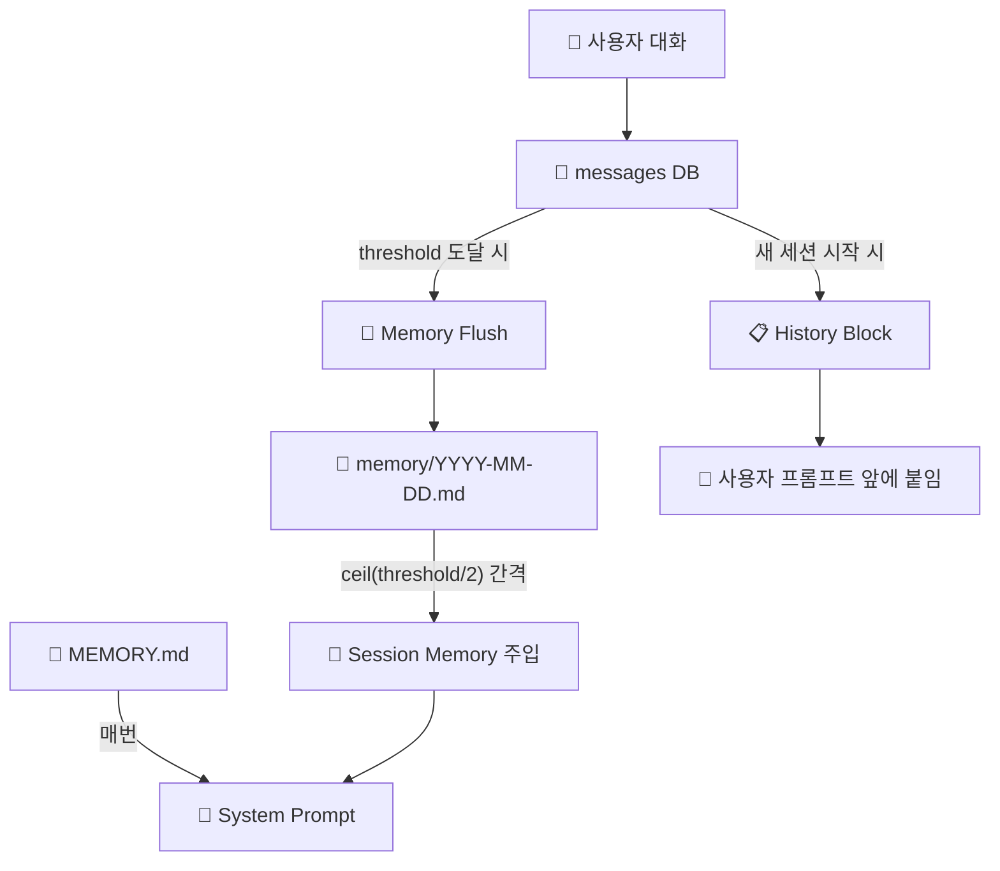

# Memory Architecture — 3계층 메모리 시스템

> 최종 갱신: 2026-02-25
> 소스: `src/agent/spawn.ts`, `src/prompt/builder.ts`

---

## 전체 구조 요약



---

## 1계층: History Block (대화 원문 주입)

| 항목 | 값 |
|------|-----|
| **소스** | `spawn.ts` L123 `buildHistoryBlock()` |
| **저장소** | `messages` DB 테이블 |
| **트리거** | `!isResume` (새 세션 시작 시에만) |
| **주입 위치** | 사용자 프롬프트 **앞**에 `[Recent Context]`로 붙임 |
| **maxSessions** | `10` (DB에서 `LIMIT 20`으로 조회) |
| **maxTotalChars** | `8000` (초과 시 잘림) |
| **assistant 메시지** | `trace` 필드 우선 사용 (요약문), 없으면 content |

### 주입 위치별 분기

| CLI | 주입 방식 | 코드 |
|-----|----------|------|
| **claude** | `stdin.write(historyBlock + prompt)` | spawn.ts L478 |
| **codex** | `stdin.write(historyBlock + [User Message] + prompt)` | spawn.ts L480 |
| **gemini / opencode** | `args`에 포함 (CLI 인자로 전달) | spawn.ts L239 |
| **copilot (ACP)** | `acp.prompt(historyBlock + prompt)` | spawn.ts L374 |

---

## 2계층: Memory Flush (대화 → 요약 저장)

| 항목 | 값 |
|------|-----|
| **소스** | `spawn.ts` L624 `triggerMemoryFlush()` |
| **저장소** | `~/.claude/projects/{hash}/memory/YYYY-MM-DD.md` |
| **트리거** | `memoryFlushCounter >= threshold` |
| **threshold** | `settings.memory.flushEvery` (기본 `20`) |
| **플러시 CLI** | `settings.memory.cli` (기본: 현재 활성 CLI) |
| **플러시 모델** | `settings.memory.model` (기본: 해당 CLI 기본 모델) |
| **최소 대화 수** | 4 미만이면 스킵 |

### 플러시 프로세스

```
대화 20번 → memoryFlushCounter == 20 → triggerMemoryFlush()
   → DB에서 최근 20개 메시지 읽기
   → AI에게 "요약해라" 프롬프트 전송 (internal spawn)
   → AI가 memory/2026-02-25.md에 ## HH:MM 형식으로 append
   → memoryFlushCounter = 0, flushCycleCount++
```

### 저장 형식

```markdown
## 15:30

User discussed refactoring the auth module. Decided to use JWT tokens.
Prefers ES Module only, no CommonJS.
```

---

## 3계층: Memory Injection (요약 → 시스템 프롬프트)

### 3-A: Session Memory (주기적 주입)

| 항목 | 값 |
|------|-----|
| **소스** | `builder.ts` L269 `getSystemPrompt()` 내부 |
| **읽기 함수** | `builder.ts` L229 `loadRecentMemories()` |
| **저장소** | `~/.claude/projects/{hash}/memory/*.md` |
| **주입 빈도** | `ceil(threshold/2)` 턴마다 (threshold=20이면 **매 10턴**) |
| **CHAR_BUDGET** | `10000자` |
| **주입 형태** | `## Recent Session Memories` 섹션으로 시스템 프롬프트에 추가 |
| **정렬** | 파일명 역순 (최신 먼저), 섹션도 역순 |

#### 주입 주기 계산

```
threshold = settings.memory.flushEvery (기본 20)
injectInterval = ceil(threshold / 2) = ceil(20/2) = 10

주입 조건: memoryFlushCounter % injectInterval === 0
→ 0번째, 10번째, 20번째, 30번째... 대화에서 주입
```

### 3-B: Core Memory (항상 주입)

| 항목 | 값 |
|------|-----|
| **소스** | `builder.ts` L288 |
| **저장소** | `~/.cli-claw/memory/MEMORY.md` |
| **주입 빈도** | **매번** (50자 이상일 때) |
| **최대 크기** | `1500자` (초과 시 잘림 + 안내 메시지) |
| **주입 형태** | `## Core Memory` 섹션으로 시스템 프롬프트에 추가 |
| **용도** | 사용자 선호도, 핵심 결정사항, 프로젝트 팩트 |

---

## 비교표

| | History Block | Memory Flush | Session Memory 주입 | Core Memory |
|---|---|---|---|---|
| **역할** | 최근 대화 원문 전달 | 대화 → 요약 저장 | 요약 → 프롬프트 주입 | 핵심 기억 상시 주입 |
| **타이밍** | 새 세션만 | 20턴마다 | 10턴마다 | 매번 |
| **크기 제한** | 8000자 | - | 10000자 | 1500자 |
| **저장소** | DB messages | memory/*.md | memory/*.md (읽기) | MEMORY.md |
| **코드** | spawn.ts L123 | spawn.ts L624 | builder.ts L269 | builder.ts L288 |
| **resume 시** | ❌ 스킵 | ✅ 정상 동작 | ✅ 정상 동작 | ✅ 정상 동작 |

---

## settings.json 설정

```json
{
  "memory": {
    "enabled": true,
    "flushEvery": 20,
    "cli": "claude",
    "model": "haiku"
  }
}
```

| 키 | 기본값 | 설명 |
|---|---|---|
| `enabled` | `true` | `false`면 flush 자체를 안 함 |
| `flushEvery` | `20` | N번 대화마다 flush + `ceil(N/2)` 간격으로 주입 |
| `cli` | 현재 CLI | flush용 별도 CLI 지정 가능 |
| `model` | CLI 기본 모델 | flush용 경량 모델 지정 (예: haiku) |
