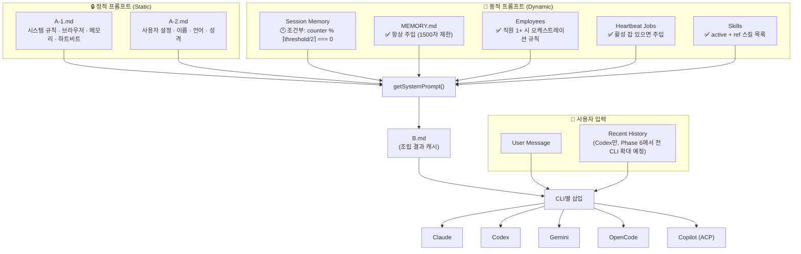
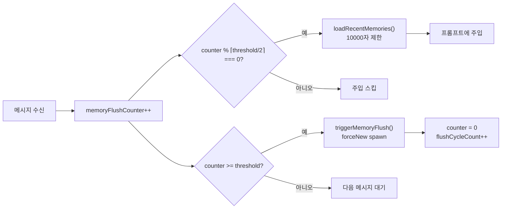
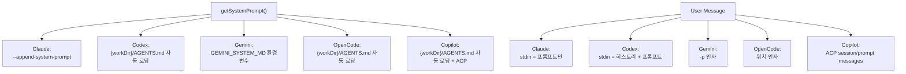
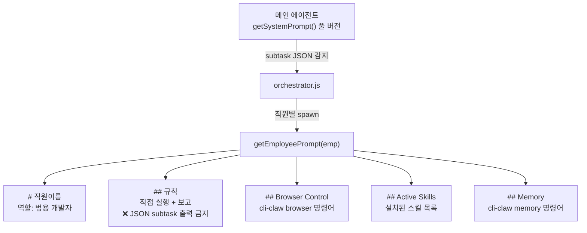

# 프롬프트 삽입 흐름 — Prompt Injection Flow

> CLI-Claw의 프롬프트 조립 + 주입 전체 흐름. 에이전트 빌딩의 핵심 레퍼런스.
> Phase 20.6: prompt.js → prompt/builder.js (523L) + promptCache 추가

---

## 전체 구조 — 30,000ft View



---

## Layer 1 — 정적 프롬프트

### A-1.md (시스템 규칙)

경로: `~/.cli-claw/prompts/A-1.md`

| 섹션             | 내용                                               |
| ---------------- | -------------------------------------------------- |
| Rules            | 지시 따르기, 사용자 언어, 결과 보고, 모호하면 질문 |
| Browser Control  | `cli-claw browser` 패턴: snapshot → act → verify   |
| Long-term Memory | MEMORY.md 읽기, 검색, 저장 규칙                    |
| Heartbeat System | heartbeat.json 포맷 + 규칙                         |

**수정 방법**: Web UI 설정 → 시스템 프롬프트 편집, 또는 직접 파일 편집

### A-2.md (사용자 설정)

경로: `~/.cli-claw/prompts/A-2.md`

| 섹션        | 내용                  | 예시          |
| ----------- | --------------------- | ------------- |
| Identity    | 에이전트 이름/이모지  | Claw 🦞        |
| User        | 사용자 이름, 언어, TZ | Korean, UTC+9 |
| Vibe        | 톤/말투               | 친절, 따뜻    |
| Working Dir | 기본 작업 디렉토리    | ~/Developer   |

### 조립 순서

```js
// prompt/builder.js
const a1 = fs.readFileSync(A1_PATH, 'utf8');
const a2 = fs.readFileSync(A2_PATH, 'utf8');
let prompt = `${a1}\n\n${a2}`;
```

**A1 + A2는 항상 프롬프트 최상단에 위치. 이 부분은 절대 조건부가 아님.**

---

## Layer 2 — 동적 프롬프트

### Session Memory (조건부 주입 ⚠️)



**핵심 숫자 예시** (threshold=20):
- `injectInterval = Math.ceil(20/2) = 10`
- 주입 시점: 메시지 #0, #10, #20, #30...
- flush 시점: 메시지 #20, #40, #60...
- flush 후 counter 리셋 → 다시 #0부터

**Session Memory 소스**: `~/.claude/projects/<hash>/memory/*.md`
- `triggerMemoryFlush()`가 최근 threshold개 메시지를 1-3문장 영문 요약
- `forceNew: true` spawn → 메인 세션과 분리된 별도 CLI 프로세스

### MEMORY.md (항상 주입 ✅)

경로: `~/.cli-claw/memory/MEMORY.md`

```js
// prompt/builder.js — 항상 주입, 조건 없음
const coreMem = fs.readFileSync(memPath, 'utf8').trim();
if (coreMem && coreMem.length > 50) {
    const truncated = coreMem.length > 1500
        ? coreMem.slice(0, 1500) + '\n...(use `cli-claw memory read MEMORY.md` for full)'
        : coreMem;
    prompt += '\n\n---\n## Core Memory\n' + truncated;
}
```

- 50자 미만이면 스킵 (초기 빈 파일 보호)
- 1500자 초과 시 잘림 + 안내 메시지
- **Session Memory와 달리 매번 무조건 주입**

### Employees — 오케스트레이션 규칙 (조건부)

직원 1명 이상 등록 시 주입:

```text
## Orchestration System
You have external employees (separate CLI processes).
The middleware detects your JSON output and AUTOMATICALLY spawns employees.

### Available Employees
- "개발자A" (CLI: claude) — 프론트엔드
- "검수자B" (CLI: codex) — 코드 리뷰

### Dispatch Format
```json
{
  "subtasks": [
    { "agent": "개발자A", "task": "구체적인 작업 지시", "priority": 1 }
  ]
}
```

### CRITICAL RULES
1. JSON은 반드시 ```json ... ``` 코드블럭으로 감싸야 함
2. agent 이름은 목록과 정확히 일치
3. 결과 보고 받으면 자연어 요약
4. 직접 답변 가능하면 JSON 없이 자연어
```

**직원 0명이면 이 섹션 전체 생략** → 불필요한 오케스트레이션 토큰 절약

### Heartbeat Jobs & Skills

| 섹션             | 주입 조건                 | 내용                        |
| ---------------- | ------------------------- | --------------------------- |
| Heartbeat        | `jobs.length > 0`         | ✅/⏸️ 목록 + 간격             |
| Active Skills    | `activeSkills.length > 0` | 이름 목록 (CLI가 트리거)    |
| Available Skills | `availableRef.length > 0` | ID 목록 (compact CSV)       |
| Skill Discovery  | 항상                      | 없으면 검색/생성 안내       |

---

## Layer 3 — B.md 캐시 + CLI별 삽입

### regenerateB()

`getSystemPrompt()` 결과를 2곳에 저장:

| 대상        | 경로                         | 용도                                         |
| ----------- | ---------------------------- | -------------------------------------------- |
| `B.md`      | `~/.cli-claw/prompts/B.md`   | 디버그/참조용                                |
| `AGENTS.md` | `{workDir}/AGENTS.md`        | **Codex + Copilot + OpenCode** — 자동 로딩   |

**세션 무효화**: B.md 변경 시 `session_id = null` → 다음 메시지에서 신규 세션 생성

### CLI별 삽입 방식



| CLI          | 시스템 프롬프트 전달                 | role        | 매 턴 포함 | 압축 보호                  |
| ------------ | ------------------------------------ | ----------- | ---------- | -------------------------- |
| **Claude**   | `--append-system-prompt` 플래그      | `system`    | ✅          | ✅ cache_control breakpoint |
| **Codex**    | `{workDir}/AGENTS.md` 자동 로딩      | `developer` | ✅          | ✅ 매 call 파일 재로딩      |
| **Gemini**   | `GEMINI_SYSTEM_MD` env (tmpfile)     | `system`    | ✅          | ✅ system_instruction 분리  |
| **OpenCode** | `{workDir}/AGENTS.md` 자동 로딩      | 혼합        | ✅          | ✅ 매 call 파일 재로딩      |
| **Copilot**  | `{workDir}/AGENTS.md` 자동 로딩 + ACP | `system`   | ✅          | ✅ ACP 세션 단위            |

> **Phase 12에서 통합**: `regenerateB()`가 `{workDir}/AGENTS.md`에 B 프롬프트를 쓰므로 Codex, Copilot, OpenCode 전부 자동으로 읽음.
> Ref 스킬은 compact CSV 형식으로 (이모지/설명/경로 제거, ~68% 크기 감소).

### Claude — 중복 방지 핵심

```js
// agent.js:209-212
if (cli === 'claude') {
    // sysPrompt already in --append-system-prompt (compact-protected)
    // Only send user message via stdin to avoid duplication
    stdinContent = prompt;  // ← 사용자 메시지만!
}
```

### Codex — stdin 전문 구조 (⚠️ 중복, Phase 6 제거 예정)

```text
[Claw Platform Context]      ← ⚠️ AGENTS.md와 100% 중복!
{getSystemPrompt() 전체}     ← ⚠️ 매 턴 developer role로 이미 들어감

[Recent History]
[user] 이전 메시지 1
[assistant] 이전 응답 1
...

[User Message]
{현재 프롬프트}
```

### Copilot — ACP JSON-RPC

```js
// agent.js — copilot 분기
if (cli === 'copilot') {
    const acp = new AcpClient(model, workingDir, permissions);
    await acp.initialize();
    const session = await acp.createSession(workingDir);
    // AGENTS.md는 workDir에 이미 존재 → 자동 로딩
    // session/prompt로 사용자 메시지 전달
    acp.prompt(session.sessionId, userMessage);
}
```

### Gemini — tmpfile 환경변수

```js
// agent.js:189-193
if (cli === 'gemini' && sysPrompt) {
    const tmpSysFile = join(os.tmpdir(), `claw-gemini-sys-${agentLabel}.md`);
    fs.writeFileSync(tmpSysFile, sysPrompt);
    spawnEnv.GEMINI_SYSTEM_MD = tmpSysFile;
}
```

---

## Layer 4 — 직원(Employee) 프롬프트



### 메인 vs 직원 프롬프트 비교

| 항목               | 메인 에이전트   | 직원 (Employee)  |
| ------------------ | --------------- | ----------------- |
| A-1 (시스템 규칙)  | ✅ 전체          | ❌ 경량 규칙만     |
| A-2 (사용자 설정)  | ✅               | ❌                 |
| Session Memory     | ✅ 조건부        | ❌                 |
| MEMORY.md          | ✅ 항상          | ❌ (명령어 안내만) |
| Orchestration 규칙 | ✅ dispatch 포맷 | ❌ **의도적 제외** |
| Heartbeat          | ✅               | ❌                 |
| Skills (active)    | ✅ 이름 목록     | ✅ 이름 목록       |
| Skills (ref)       | ✅ 경로 포함     | ❌                 |
| Browser 명령어     | ✅ (A-1 안)      | ✅ (요약)          |
| Memory 명령어      | ✅ (A-1 안)      | ✅ (요약)          |

> **핵심**: 직원 프롬프트에서 **Orchestration 규칙을 의도적으로 제외** → 직원이 다시 subtask JSON을 출력하는 재귀 루프 방지

### 직원 spawn 흐름

```text
1. 메인 에이전트 응답에서 ```json { "subtasks": [...] } ``` 감지
2. orchestrator.js → parseSubtasks() → 직원 목록 매칭
3. 각 직원에 대해:
   spawnAgent(task, {
     forceNew: true,        ← 메인 세션과 분리
     agentId: emp.name,     ← 로그 식별
     cli: emp.cli,          ← 직원별 CLI (copilot 포함 가능)
     model: emp.model,      ← 직원별 모델
     origin: meta.origin,   ← origin 전달
     sysPrompt: getEmployeePrompt(emp)  ← 경량 프롬프트
   })
4. 모든 직원 완료 대기 → 보고 수집 → 메인에 재주입
5. 최대 3라운드 반복
```

---

## 전체 조립 순서 요약

```text
┌──────────────────────────────────────────────────────┐
│ getSystemPrompt() 조립 순서                           │
├──────────────────────────────────────────────────────┤
│ 1. A-1.md (시스템 규칙)                     ← 항상   │
│ 2. A-2.md (사용자 설정)                     ← 항상   │
│ 3. Session Memory                           ← 조건부 │
│    └ counter % ⌈threshold/2⌉ === 0 일 때만          │
│ 4. MEMORY.md (Core Memory)                  ← 항상   │
│    └ 50자↑, 1500자 제한                              │
│ 5. Employees + Orchestration                ← 조건부 │
│    └ 직원 1+ 명일 때만                               │
│ 6. Heartbeat Jobs                           ← 조건부 │
│    └ 잡 1+ 개일 때만                                 │
│ 7. Skills (Active + Ref + Discovery)        ← 조건부 │
│    └ 스킬 1+ 개일 때만                               │
├──────────────────────────────────────────────────────┤
│ → B.md 캐시 저장                                     │
│ → {workDir}/AGENTS.md (Codex+Copilot+OpenCode 통합)  │
│ → CLI별 삽입 방식으로 전달 (5개 CLI)                  │
└──────────────────────────────────────────────────────┘
```
