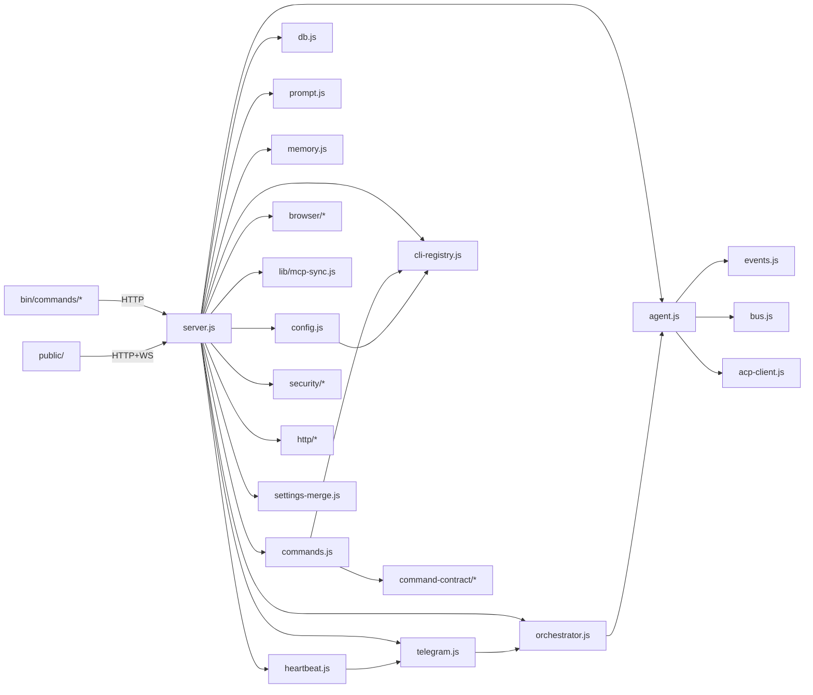

# 🏗️ CLI-CLAW Architecture

> Technical reference for developers and contributors.
> For user-facing docs, see [README.md](../README.md).

---

## System Overview

```
┌─────────────────────────────────────────────────────────────┐
│                     USER INTERFACES                         │
│  ┌──────────┐  ┌──────────┐  ┌──────────────┐              │
│  │ Web UI   │  │ Terminal  │  │ Telegram Bot │              │
│  │ (ES Mod) │  │ TUI      │  │ (Grammy)     │              │
│  └────┬─────┘  └────┬─────┘  └──────┬───────┘              │
│       │HTTP+WS      │HTTP           │Grammy                │
├───────┴──────────────┴───────────────┴──────────────────────┤
│                    EXPRESS SERVER (server.js)                │
│  Routes(40+) · WebSocket · ok/fail · Security Guards        │
├─────────────────────────────────────────────────────────────┤
│                     CORE ENGINE                             │
│  ┌─────────┐  ┌──────────────┐  ┌───────────┐              │
│  │ agent.js│  │orchestrator.js│  │commands.js│              │
│  │ spawn + │  │ triage +     │  │ slash cmd │              │
│  │ ACP     │  │ 5-phase pipe │  │ registry  │              │
│  └────┬────┘  └──────┬───────┘  └───────────┘              │
│       │              │                                      │
│  ┌────┴────────────┐ │                                      │
│  │  events.js      │ │  ┌──────────────────────────┐        │
│  │  NDJSON + ACP   │ │  │ prompt.js                │        │
│  │  dedupe         │ │  │ System + SubAgent prompt │        │
│  └─────────────────┘ │  └──────────────────────────┘        │
├──────────────────────┴──────────────────────────────────────┤
│                   INFRASTRUCTURE                            │
│  config · db · bus · memory · mcp-sync · cli-registry       │
│  security/* · http/* · settings-merge · command-contract/*  │
│  browser/* · heartbeat · telegram-forwarder                 │
├─────────────────────────────────────────────────────────────┤
│                   CLI BINARIES (spawned)                     │
│  claude · codex · gemini · opencode · copilot (ACP)         │
└─────────────────────────────────────────────────────────────┘
```

---

## Module Dependency Graph



### Dependency Rules

| Module | Dependencies | Notes |
|--------|-------------|-------|
| `bus.js` | — | Zero deps, broadcast hub |
| `config.js` | cli-registry | Registry-based CLI detection |
| `cli-registry.js` | — | Zero deps, CLI/model single source |
| `db.js` | config | DB_PATH only |
| `events.js` | bus | Broadcast + dedupe + ACP |
| `memory.js` | config | CLAW_HOME only, independent |
| `acp-client.js` | — | Zero deps, Copilot ACP client |
| `agent.js` | bus, config, db, events, prompt, orchestrator, acp-client | Core hub |
| `orchestrator.js` | bus, db, prompt, agent | Planning ↔ agent mutual |
| `telegram.js` | bus, config, db, agent, orchestrator, commands, upload | External interface |
| `heartbeat.js` | config, telegram | Telegram re-export |
| `prompt.js` | config, db | A-1/A-2 + skills |
| `commands.js` | config, cli-registry | Command registry + dynamic models |
| `security/*` | — | Input validation (path, id, filename) |
| `http/*` | — | Response standardization + error middleware |
| `settings-merge.js` | — | perCli/activeOverrides merge |
| `browser/*` | — | Independent Chrome CDP module |

---

## File Structure & Line Counts

> Verified by `devlog/verify-counts.sh`. Run `bash devlog/verify-counts.sh` to check accuracy.
> Detailed function-level reference: `devlog/str_func.md` + `devlog/str_func/*.md`

### Core (`src/`)

| File | Lines | Responsibility |
|------|------:|----------------|
| `config.js` | ~177 | CLAW_HOME, settings, CLI detection |
| `db.js` | ~84 | SQLite schema + prepared statements |
| `bus.js` | ~18 | WS + internal listener broadcast |
| `events.js` | ~322 | NDJSON parsing + dedupe + ACP updates |
| `commands.js` | ~639 | Slash command registry + dispatcher |
| `agent.js` | ~619 | CLI spawn + ACP + queue + memory flush |
| `orchestrator.js` | ~637 | Triage + 5-phase pipeline + AI dispatch |
| `prompt.js` | ~515 | System prompt + sub-agent prompt |
| `telegram.js` | ~493 | Telegram bot + forwarder lifecycle |
| `telegram-forwarder.js` | ~105 | Forwarding helpers |
| `heartbeat.js` | ~107 | Heartbeat job scheduling |
| `memory.js` | ~128 | Persistent memory (grep-based) |
| `worklog.js` | ~153 | Worklog CRUD + phase matrix |
| `cli-registry.js` | ~88 | 5 CLI/model single source |
| `acp-client.js` | ~315 | Copilot ACP JSON-RPC client |
| `settings-merge.js` | ~46 | Deep merge for perCli/activeOverrides |

### Security & HTTP (`src/security/`, `src/http/`)

| File | Lines | Added In |
|------|------:|----------|
| `security/path-guards.js` | ~67 | Phase 9.1 |
| `security/decode.js` | ~22 | Phase 9.1 |
| `http/response.js` | ~25 | Phase 9.2 |
| `http/async-handler.js` | ~12 | Phase 9.2 |
| `http/error-middleware.js` | ~27 | Phase 9.2 |
| `command-contract/catalog.js` | ~39 | Phase 9.5 |
| `command-contract/policy.js` | ~40 | Phase 9.5 |
| `command-contract/help-renderer.js` | ~46 | Phase 9.5 |

### Server

| File | Lines | Notes |
|------|------:|-------|
| `server.js` | ~949 | Routes + WebSocket + glue (Phase 20.3 splits planned) |

### Frontend (`public/`)

| Area | Files | Lines | Notes |
|------|------:|------:|-------|
| HTML | 1 | ~443 | `index.html` — CDN 4개, data-theme, sidebar toggles |
| CSS | 6 | ~1355 | variables, layout, markdown, modals, themes, sidebar |
| JS | 16 | ~2159 | ES Modules — main, render, constants, 11 feature modules |

### CLI (`bin/`)

| File | Lines | Notes |
|------|------:|-------|
| `cli-claw.js` | — | 11 subcommand routing |
| `postinstall.js` | ~212 | Auto-install 5 CLIs + MCP + skills |
| `commands/chat.js` | ~844 | Terminal TUI (Phase 20.3 splits planned) |
| `commands/browser.js` | ~239 | 17 subcommands + vision-click |
| Other commands | ~30-70ea | serve, init, doctor, status, mcp, skill, etc. |

---

## Key Architectural Patterns

### 1. CLI-Native Spawning

All AI interactions go through official CLI binaries via stdio:

```
agent.js → spawn('claude', [...args]) → NDJSON stdout → events.js → broadcast
agent.js → spawn('copilot', ['--acp']) → JSON-RPC stdin/stdout → acp-client.js
```

- **No API keys** — uses vendor authentication (OAuth, keychain)
- **No ban risk** — same binary the vendor ships
- **5 CLIs**: claude, codex, gemini, opencode, copilot

### 2. Event Deduplication

Claude emits overlapping `stream_event` and `assistant` blocks. The `events.js` dedupe system:
- Tracks `hasClaudeStreamEvents` flag per session
- Once stream events seen → blocks duplicate assistant blocks
- Tool labels use deterministic keys for dedup

### 3. Orchestration Pipeline

```
User Request → needsOrchestration() → triage
  → Simple: Direct agent spawn
  → Complex: Planning agent → subtask JSON → distribute to employees
     → Phase 1 (Planning) → Phase 2 (Review) → Phase 3 (Dev)
     → Phase 4 (Debug) → Phase 5 (Integration)
     → Gate review between each phase
```

Phase 17 addition: Direct response path detects agent-generated subtask JSON → re-enters orchestration.

### 4. MCP Sync

One `mcp.json` → auto-converts to 5 CLI formats:
- Claude: `~/.claude/mcp.json`
- Codex: `~/.codex/codex.toml` (TOML)
- Gemini: `~/.gemini/settings.json`
- OpenCode: `~/.opencode/opencode-mcp.json`
- Copilot: per-session injection

### 5. Frontend ES Modules

```
main.js (entry)
  ├── render.js (marked + hljs + KaTeX + Mermaid)
  ├── constants.js (dynamic CLI registry)
  ├── ws.js (WebSocket + reconnect)
  ├── ui.js (DOM manipulation)
  └── features/
      ├── chat.js, settings.js, employees.js
      ├── heartbeat.js, memory.js, skills.js
      ├── sidebar.js, theme.js, appname.js
      ├── i18n.js, slash-commands.js
      └── modals.js (planned)
```

### 6. Security Layers (Phase 9)

| Layer | Module | Protection |
|-------|--------|-----------|
| Input | `path-guards.js` | Path traversal, ID injection, filename abuse |
| Input | `decode.js` | Safe URL decoding |
| Response | `response.js` | Standardized `ok()`/`fail()` format |
| Error | `async-handler.js` | Async route error catching |
| Error | `error-middleware.js` | 404 + global error handler |
| Commands | `command-contract/*` | Capability-based access control |

---

## Runtime Data (`~/.cli-claw/`)

| Path | Description |
|------|-------------|
| `claw.db` | SQLite DB (sessions, messages) |
| `settings.json` | User settings (CLI, model, permissions, perCli) |
| `mcp.json` | Unified MCP config (source of truth) |
| `prompts/` | A-1, A-2, HEARTBEAT prompt templates |
| `memory/` | Persistent memory (`MEMORY.md`, `daily/`) |
| `skills/` | Active skills (injected into system prompt) |
| `skills_ref/` | Reference skills (AI reads on demand) |
| `browser-profile/` | Chrome user profile |
| `backups/` | Symlink conflict backups |
| `heartbeat.json` | Scheduled job definitions |
| `worklogs/` | Orchestration work logs |

---

## Phase History

| Phase | Area | Summary |
|-------|------|---------|
| 1-12 | MVP | Core platform — server, agent, UI, MCP, skills, memory |
| P0-P7 | Finness | Stabilization, tests, i18n, themes, sidebar, XSS hardening |
| P8 | Audit | Code quality audit (500+ line files, security gaps) |
| P9 | Hardening | Security guards, HTTP contracts, settings merge, catch policy, deps gate |
| P10-P11 | Reliability | Activity-based timeout, heartbeat pending queue |
| P12 | Docs | AGENTS.md unification for 5 CLIs |
| P13-P16 | Polish | Telegram chatId persist, skill dedup, orchestrate UI, prompt fixes |
| P17 | Triage | AI-driven dispatch — direct response subtask re-entry |
| P20 | Audit v2 | Project-wide audit: graceful shutdown, fetch wrapper, file splitting, tests, XSS |

---

## Development Guidelines

> See also: `devlog/str_func.md` for function-level reference.

- **500-line limit** per file — split when exceeded
- **ESM only** — `import`/`export`, no CommonJS
- **Never delete exports** — other modules may import them
- **try/catch mandatory** — no silent failures
- **Config centralized** — `config.js` or `settings.json`, never hardcode
- **Verify with** `bash devlog/verify-counts.sh` — ensures doc/code line count sync

---

## Related Documentation

| Document | Description |
|----------|-------------|
| [README.md](../README.md) | User-facing documentation |
| [TESTS.md](../TESTS.md) | Test coverage details + Phase 20 test plan |
| [devlog/str_func.md](../devlog/str_func.md) | Full function-level reference |
| [devlog/str_func/*.md](../devlog/str_func/) | Per-module detailed docs (8 files) |
| [devlog/verify-counts.sh](../devlog/verify-counts.sh) | Line count verification script |
| [devlog/260225_finness/](../devlog/260225_finness/) | Phase 0-20 implementation logs |
