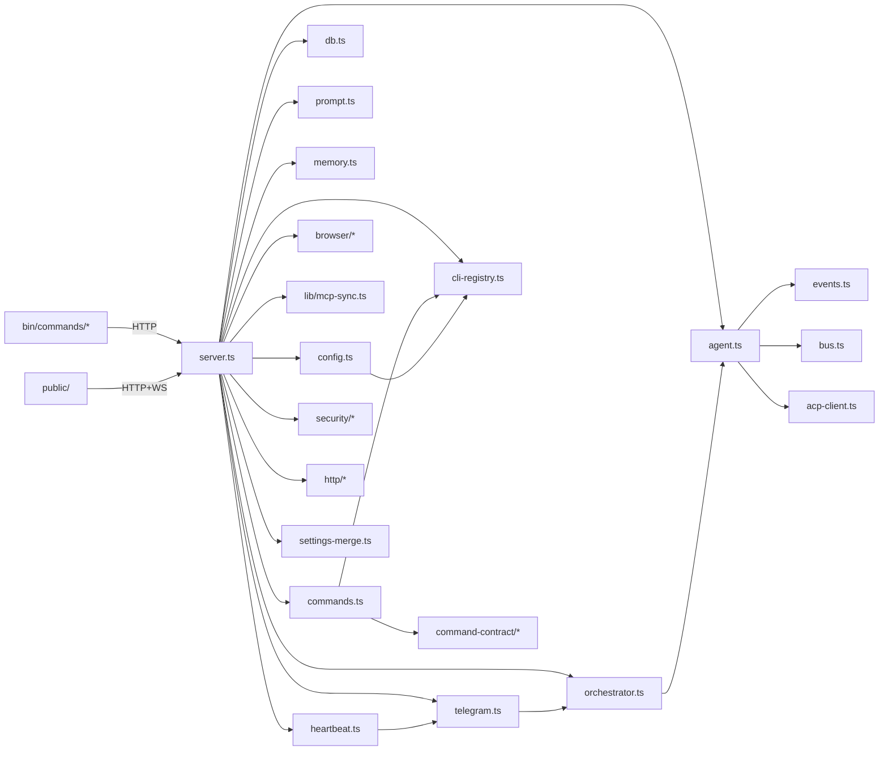

# 🏗️ CLI-JAW Architecture

> Technical reference for developers and contributors.
> For user-facing docs, see [README.md](../README.md).

---

## System Overview

```
┌─────────────────────────────────────────────────────────────┐
│                     USER INTERFACES                         │
│  ┌──────────┐  ┌──────────┐  ┌──────────────┐              │
│  │ Web UI   │  │ Terminal  │  │ Telegram Bot │              │
│  │ (ES Mod) │  │ TUI      │  │ (Grammy)     │              │
│  └────┬─────┘  └────┬─────┘  └──────┬───────┘              │
│       │HTTP+WS      │HTTP           │Grammy                │
├───────┴──────────────┴───────────────┴──────────────────────┤
│                    EXPRESS SERVER (server.ts)                │
│  Routes(40+) · WebSocket · ok/fail · Security Guards        │
├─────────────────────────────────────────────────────────────┤
│                     CORE ENGINE                             │
│  ┌─────────┐  ┌──────────────┐  ┌───────────┐              │
│  │ agent.ts│  │orchestrator.ts│  │commands.ts│              │
│  │ spawn + │  │ triage +     │  │ slash cmd │              │
│  │ ACP     │  │ 5-phase pipe │  │ registry  │              │
│  └────┬────┘  └──────┬───────┘  └───────────┘              │
│       │              │                                      │
│  ┌────┴────────────┐ │                                      │
│  │  events.ts      │ │  ┌──────────────────────────┐        │
│  │  NDJSON + ACP   │ │  │ prompt.ts                │        │
│  │  dedupe         │ │  │ System + SubAgent prompt │        │
│  └─────────────────┘ │  └──────────────────────────┘        │
├──────────────────────┴──────────────────────────────────────┤
│                   INFRASTRUCTURE                            │
│  config · db · bus · memory · mcp-sync · cli-registry       │
│  security/* · http/* · settings-merge · command-contract/*  │
│  browser/* · heartbeat · telegram-forwarder                 │
├─────────────────────────────────────────────────────────────┤
│                   CLI BINARIES (spawned)                     │
│  claude · codex · gemini · opencode · copilot (ACP)         │
└─────────────────────────────────────────────────────────────┘
```

---

## Module Dependency Graph


```mermaid
graph LR
    CLI["bin/commands/*"] -->|HTTP| SRV["server.ts"]
    WEB["public/"] -->|HTTP+WS| SRV
    SRV --> CFG["config.ts"]
    SRV --> DB["db.ts"]
    SRV --> AGT["agent.ts"]
    SRV --> ORC["orchestrator.ts"]
    SRV --> PRM["prompt.ts"]
    SRV --> MEM["memory.ts"]
    SRV --> TG["telegram.ts"]
    SRV --> HB["heartbeat.ts"]
    SRV --> BR["browser/*"]
    SRV --> MCP["lib/mcp-sync.ts"]
    SRV --> CMD["commands.ts"]
    SRV --> REG["cli-registry.ts"]
    SRV --> SEC["security/*"]
    SRV --> HTTP["http/*"]
    SRV --> SM["settings-merge.ts"]
    CMD --> REG
    CMD --> CC["command-contract/*"]
    CFG --> REG
    AGT --> EVT["events.ts"]
    AGT --> BUS["bus.ts"]
    AGT --> ACP["acp-client.ts"]
    ORC --> AGT
    TG --> ORC
    HB --> TG
```

### Dependency Rules

| Module | Dependencies | Notes |
|--------|-------------|-------|
| `bus.ts` | — | Zero deps, broadcast hub |
| `config.ts` | cli-registry | Registry-based CLI detection |
| `cli-registry.ts` | — | Zero deps, CLI/model single source |
| `db.ts` | config | DB_PATH only |
| `events.ts` | bus | Broadcast + dedupe + ACP |
| `memory.ts` | config | JAW_HOME only, independent |
| `acp-client.ts` | — | Zero deps, Copilot ACP client |
| `agent.ts` | bus, config, db, events, prompt, orchestrator, acp-client | Core hub |
| `orchestrator.ts` | bus, db, prompt, agent | Planning ↔ agent mutual |
| `telegram.ts` | bus, config, db, agent, orchestrator, commands, upload | External interface |
| `heartbeat.ts` | config, telegram | Telegram re-export |
| `prompt.ts` | config, db | A-1/A-2 + skills |
| `commands.ts` | config, cli-registry | Command registry + dynamic models |
| `security/*` | — | Input validation (path, id, filename) |
| `http/*` | — | Response standardization + error middleware |
| `settings-merge.ts` | — | perCli/activeOverrides merge |
| `browser/*` | — | Independent Chrome CDP module |

---

## File Structure & Line Counts

> Verified by `devlog/structure/verify-counts.sh` when the private `devlog/` submodule is available.
> In public or submodule-light checkouts, treat the counts in this section as approximate snapshots rather than a hard source of truth.
> Detailed function-level reference: `devlog/structure/str_func.md` + `devlog/structure/*.md`

### Core (`src/`)

| File | Lines | Responsibility |
|------|------:|----------------|
| `config.ts` | ~177 | JAW_HOME, settings, CLI detection |
| `db.ts` | ~84 | SQLite schema + prepared statements |
| `bus.ts` | ~18 | WS + internal listener broadcast |
| `events.ts` | ~322 | NDJSON parsing + dedupe + ACP updates |
| `commands.ts` | ~639 | Slash command registry + dispatcher |
| `agent.ts` | ~619 | CLI spawn + ACP + queue + memory flush |
| `orchestrator.ts` | ~637 | Triage + 5-phase pipeline + AI dispatch |
| `prompt.ts` | ~515 | System prompt + sub-agent prompt |
| `telegram.ts` | ~493 | Telegram bot + forwarder lifecycle |
| `telegram-forwarder.ts` | ~105 | Forwarding helpers |
| `heartbeat.ts` | ~107 | Heartbeat job scheduling |
| `memory.ts` | ~128 | Persistent memory (grep-based) |
| `worklog.ts` | ~153 | Worklog CRUD + phase matrix |
| `cli-registry.ts` | ~88 | 5 CLI/model single source |
| `acp-client.ts` | ~315 | Copilot ACP JSON-RPC client |
| `settings-merge.ts` | ~46 | Deep merge for perCli/activeOverrides |

### Security & HTTP (`src/security/`, `src/http/`)

| File | Lines | Added In |
|------|------:|----------|
| `security/path-guards.ts` | ~67 | Phase 9.1 |
| `security/decode.ts` | ~22 | Phase 9.1 |
| `http/response.ts` | ~25 | Phase 9.2 |
| `http/async-handler.ts` | ~12 | Phase 9.2 |
| `http/error-middleware.ts` | ~27 | Phase 9.2 |
| `command-contract/catalog.ts` | ~39 | Phase 9.5 |
| `command-contract/policy.ts` | ~40 | Phase 9.5 |
| `command-contract/help-renderer.ts` | ~46 | Phase 9.5 |

### Server

| File | Lines | Notes |
|------|------:|-------|
| `server.ts` | ~949 | Routes + WebSocket + glue (Phase 20.3 splits planned) |

### Frontend (`public/`)

| Area | Files | Lines | Notes |
|------|------:|------:|-------|
| HTML | 1 | ~443 | `index.html` — CDN 4개, data-theme, sidebar toggles |
| CSS | 6 | ~1355 | variables, layout, markdown, modals, themes, sidebar |
| JS | 16 | ~2159 | ES Modules — main, render, constants, 11 feature modules |

### CLI (`bin/`)

| File | Lines | Notes |
|------|------:|-------|
| `cli-jaw.ts` | — | 11 subcommand routing |
| `postinstall.ts` | ~212 | Auto-install 5 CLIs + MCP + skills |
| `commands/chat.ts` | ~844 | Terminal TUI (Phase 20.3 splits planned) |
| `commands/browser.ts` | ~239 | 17 subcommands + vision-click |
| Other commands | ~30-70ea | serve, init, doctor, status, mcp, skill, etc. |

---

## Key Architectural Patterns

### 1. CLI-Native Spawning

All AI interactions go through official CLI binaries via stdio:

```
agent.ts → spawn('claude', [...args]) → NDJSON stdout → events.ts → broadcast
agent.ts → spawn('copilot', ['--acp']) → JSON-RPC stdin/stdout → acp-client.ts
```

- **No API keys** — uses vendor authentication (OAuth, keychain)
- **No ban risk** — same binary the vendor ships
- **5 CLIs**: claude, codex, gemini, opencode, copilot

### 2. Event Deduplication

Claude emits overlapping `stream_event` and `assistant` blocks. The `events.ts` dedupe system:
- Tracks `hasClaudeStreamEvents` flag per session
- Once stream events seen → blocks duplicate assistant blocks
- Tool labels use deterministic keys for dedup

### 3. Orchestration Pipeline

```
User Request → orchestrate() → triage
  → Simple: Direct agent spawn
  → Complex: Planning agent → subtask JSON → distribute to employees
     → PABCD phases (explicit entry via /orchestrate or LLM tool call)
```

Phase 17 addition: Direct response path detects agent-generated subtask JSON → re-enters orchestration.

### 4. MCP Sync

One `mcp.json` → auto-converts to 5 CLI formats:
- Claude: `~/.claude/mcp.json`
- Codex: `~/.codex/codex.toml` (TOML)
- Gemini: `~/.gemini/settings.json`
- OpenCode: `~/.opencode/opencode-mcp.json`
- Copilot: per-session injection

### 5. Frontend ES Modules

```
main.js (entry)
  ├── render.js (marked + hljs + KaTeX + Mermaid)
  ├── constants.js (dynamic CLI registry)
  ├── ws.js (WebSocket + reconnect)
  ├── ui.js (DOM manipulation)
  └── features/
      ├── chat.js, settings.js, employees.js
      ├── heartbeat.js, memory.js, skills.js
      ├── sidebar.js, theme.js, appname.js
      ├── i18n.ts, slash-commands.ts
      └── modals.js (planned)
```

### 6. Security Layers (Phase 9)

| Layer | Module | Protection |
|-------|--------|-----------|
| Input | `path-guards.ts` | Path traversal, ID injection, filename abuse |
| Input | `decode.ts` | Safe URL decoding |
| Response | `response.ts` | Standardized `ok()`/`fail()` format |
| Error | `async-handler.ts` | Async route error catching |
| Error | `error-middleware.ts` | 404 + global error handler |
| Commands | `command-contract/*` | Capability-based access control |

---

## Runtime Data (`~/.cli-jaw/`)

| Path | Description |
|------|-------------|
| `jaw.db` | SQLite DB (sessions, messages) |
| `settings.json` | User settings (CLI, model, permissions, perCli) |
| `mcp.json` | Unified MCP config (source of truth) |
| `prompts/` | A-1, A-2, HEARTBEAT prompt templates |
| `memory/` | Persistent memory (`MEMORY.md`, `daily/`) |
| `skills/` | Active skills (injected into system prompt) |
| `skills_ref/` | Reference skills (AI reads on demand) |
| `browser-profile/` | Chrome user profile |
| `backups/` | Symlink conflict backups |
| `heartbeat.json` | Scheduled job definitions |
| `worklogs/` | Orchestration work logs |

---

## Phase History

| Phase | Area | Summary |
|-------|------|---------|
| 1-12 | MVP | Core platform — server, agent, UI, MCP, skills, memory |
| P0-P7 | Finness | Stabilization, tests, i18n, themes, sidebar, XSS hardening |
| P8 | Audit | Code quality audit (500+ line files, security gaps) |
| P9 | Hardening | Security guards, HTTP contracts, settings merge, catch policy, deps gate |
| P10-P11 | Reliability | Activity-based timeout, heartbeat pending queue |
| P12 | Docs | AGENTS.md unification for 5 CLIs |
| P13-P16 | Polish | Telegram chatId persist, skill dedup, orchestrate UI, prompt fixes |
| P17 | Triage | AI-driven dispatch — direct response subtask re-entry |
| P20 | Audit v2 | Project-wide audit: graceful shutdown, fetch wrapper, file splitting, tests, XSS |
| P21-P26 | Voice & Templates | STT multi-provider, prompt templates, quota UI, IDE diff, PABCD UI, WSL installer |

---

## Development Guidelines

> See also: `devlog/structure/str_func.md` for function-level reference.

- **500-line limit** per file — split when exceeded
- **ESM only** — `import`/`export`, no CommonJS
- **Never delete exports** — other modules may import them
- **try/catch mandatory** — no silent failures
- **Config centralized** — `config.ts` or `settings.json`, never hardcode
- **Verify with** `bash devlog/structure/verify-counts.sh` — ensures doc/code line count sync

---

## Feature Inventory

> Detailed feature list with complexity ratings. For user-facing summary, see [README.md](../README.md).

### ✅ Implemented

| Feature | Description | Complexity |
|---------|-------------|:----------:|
| **Multi-CLI Engine** | Claude, Codex, Gemini, OpenCode, Copilot — unified spawn | ⭐⭐⭐⭐ |
| **Copilot ACP** | JSON-RPC 2.0 over stdio, real-time streaming, activity timeout | ⭐⭐⭐⭐ |
| **Orchestration v2** | Triage → role dispatch → 5-phase pipeline → gate reviews | ⭐⭐⭐⭐⭐ |
| **AI-Driven Triage** | Agent autonomously decides dispatch vs direct response | ⭐⭐⭐ |
| **MCP Sync** | `mcp.json` → 5 CLI formats auto-conversion + symlink protection | ⭐⭐⭐⭐ |
| **Skill System** | 100+ bundled skills, 2-tier classification | ⭐⭐⭐ |
| **CLI Registry** | Single source of truth — modify one file, auto-propagate everywhere | ⭐⭐⭐ |
| **Slash Commands** | Unified across CLI / Web / Telegram with autocomplete + dropdowns | ⭐⭐⭐ |
| **Command Contract** | Capability-based access control per interface (Web/CLI/Telegram) | ⭐⭐⭐ |
| **Telegram Bot** | Bidirectional forwarding, origin-based routing, lifecycle mgmt | ⭐⭐⭐⭐ |
| **Persistent Memory** | `MEMORY.md` + daily auto-log + session flush + prompt injection | ⭐⭐⭐ |
| **Browser Automation** | Chrome CDP: snapshot, click, navigate, screenshot | ⭐⭐⭐ |
| **Vision Click** | Screenshot → AI coordinate → DPR correction → click (one cmd) | ⭐⭐⭐⭐ |
| **Heartbeat** | Scheduled auto-execution + pending queue + active/quiet hours | ⭐⭐ |
| **Fallback Chains** | `claude → codex → gemini` automatic retry on failure | ⭐⭐⭐ |
| **Event Deduplication** | Claude `stream_event`/`assistant` overlap prevention | ⭐⭐⭐ |
| **Security Guards** | Path traversal, ID injection, filename abuse prevention (Phase 9) | ⭐⭐⭐ |
| **HTTP Contracts** | `ok()`/`fail()` standardized responses + async error handler | ⭐⭐ |
| **Dependency Audit** | Offline vulnerability check + online npm audit script | ⭐⭐ |
| **i18n** | KO/EN locale toggle — UI, API, CLI, Telegram, skill registry | ⭐⭐⭐ |
| **Dark/Light Theme** | ☀️/🌙 toggle, 13 semantic CSS vars, highlight.js sync | ⭐⭐ |
| **Responsive Sidebar** | Collapsible ◀/▶, auto-collapse <900px, localStorage persist | ⭐⭐ |
| **Voice & STT** | Web mic button + Telegram voice transcription, multi-provider (OpenAI, Vertex AI) | ⭐⭐⭐ |
| **Prompt Templates** | CRUD API + node-map UI editor for reusable prompt templates | ⭐⭐⭐ |
| **Quota Dashboard** | Compact quota bars with reset time, 429 rate-limit caching | ⭐⭐ |
| **IDE Diff View** | Fingerprint-based change detection, VS Code / Antigravity auto-detect | ⭐⭐⭐ |
| **PABCD UI** | Live roadmap bar, shark runner animation, glow/pulse/badge feedback | ⭐⭐ |
| **Cross-Platform Service** | `jaw service install` — auto-detects systemd, launchd, Docker | ⭐⭐⭐ |
| **Test Coverage** | See `TESTS.md` for the current automated counts and coverage inventory | ⭐⭐⭐ |
| **Unified AGENTS.md** | `{workDir}/AGENTS.md` — Codex + Copilot + OpenCode unified system prompt | ⭐⭐⭐ |
| **XSS Hardening** | DOMPurify + escapeHtml (with quote escaping) + Mermaid strict mode | ⭐⭐ |
| **Auto-Expand Input** | Chat textarea grows up to 8 lines, resets on send | ⭐ |

### 🔜 Planned (Phase 20)

| Feature | Description | Priority |
|---------|-------------|:--------:|
| **Graceful Shutdown** | SIGTERM/SIGINT handler with active process cleanup | 🔴 P0 |
| **Frontend API Wrapper** | Centralized `api()` fetch wrapper with error handling | 🔴 P0 |
| **WS Reconnect Restore** | Clear + reload messages on WebSocket reconnection | 🟡 P1 |
| **Backend Logger** | Level-aware `log.info/warn/error` replacing raw `console.log` | 🟡 P1 |
| **500-Line File Splitting** | Split 7 oversized files (chat, commands, mcp-sync, etc.) | 🟡 P1 |
| **Express Security** | helmet + CORS (exact match) + rate limiting | 🟡 P1 |
| **API Smoke Tests** | 12 endpoint tests + 4 CLI basic tests | 🟢 P2 |
| **Mobile Responsive** | 768px breakpoint + bottom nav bar + sidebar toggle | 🟢 P2 |
| **Accessibility** | ARIA roles/labels + focus-visible + Escape-to-close | 🟢 P2 |
| **Vector DB Memory** | Embedding-based semantic retrieval (replacing grep) | 📋 |
| **Vision Multi-Provider** | Extend vision-click to Claude, Gemini | 📋 |

---

## REST API

<details>
<summary><b>40+ endpoints</b></summary>

| Category | Endpoints |
|----------|-----------|
| Core | `GET /api/session`, `POST /api/message`, `POST /api/stop` |
| Registry | `GET /api/cli-registry` — CLI/model single source |
| Orchestration | `POST /api/orchestrate/continue`, `POST /api/employees/reset` |
| Commands | `POST /api/command`, `GET /api/commands?interface=` |
| Settings | `GET/PUT /api/settings`, `GET/PUT /api/prompt` |
| Memory | `GET/POST /api/memory`, `GET /api/jaw-memory/search` |
| MCP | `GET/PUT /api/mcp`, `POST /api/mcp/sync,install,reset` |
| Skills | `GET /api/skills`, `POST /api/skills/enable,disable` |
| Browser | `POST /api/browser/start,stop,act,navigate,screenshot` |
| Employees | `GET/POST /api/employees`, `PUT/DELETE /api/employees/:id` |
| Quota | `GET /api/quota` (Claude/Codex/Gemini/Copilot usage) |

</details>

---

## Related Documentation

| Document | Description |
|----------|-------------|
| [README.md](../README.md) | User-facing documentation |
| [TESTS.md](../TESTS.md) | Test coverage details + Phase 20 test plan |
| [devlog/structure/str_func.md](../devlog/structure/str_func.md) | Full function-level reference |
| [devlog/structure/*.md](../devlog/structure/) | Per-module detailed docs |
| [devlog/structure/verify-counts.sh](../devlog/structure/verify-counts.sh) | Line count verification script |
| [devlog/260225_finness/](../devlog/260225_finness/) | Phase 0-20 implementation logs |
