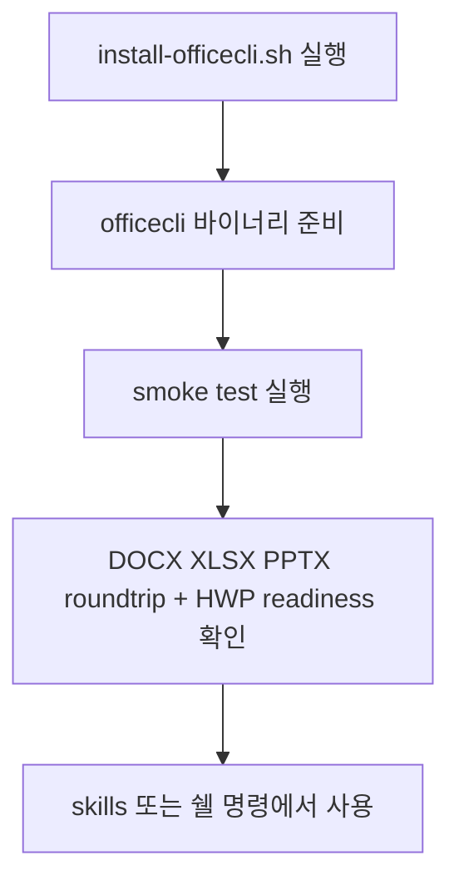
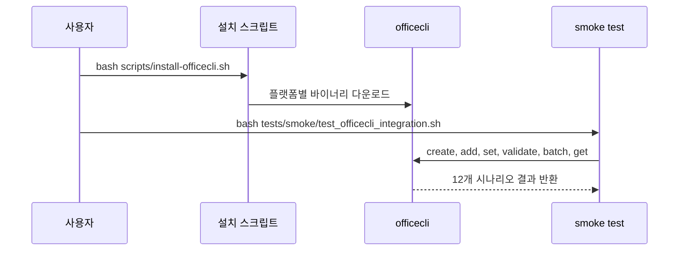

# OfficeCLI 연동 가이드

OfficeCLI는 cli-jaw에서 오피스 문서를 직접 다룰 때 쓰는 기본 런타임 도구이다. Word, Excel, PowerPoint 파일을 열고, 읽고, 수정하고, 검증하는 일을 하나의 바이너리로 처리한다. Microsoft Office를 따로 설치하지 않아도 된다.

이 통합이 중요한 이유는 에이전트가 문서 작업을 쉘 명령 한 번으로 끝낼 수 있기 때문이다. `.docx`, `.xlsx`, `.pptx`를 각각 다른 툴로 나누지 않아도 되고, `--json` 출력으로 결과를 바로 후속 자동화에 연결할 수 있다. smoke test까지 함께 두었기 때문에 “설치만 되었는가”가 아니라 “실제로 문서 편집이 되는가”를 바로 확인할 수 있다.

사용 흐름은 단순하다. `npm install -g cli-jaw` 또는 `bash scripts/install-officecli.sh`로 전역 OfficeCLI를 준비한다. 그다음 `bash tests/smoke/test_officecli_integration.sh`를 실행해 12개 기본 시나리오를 검증한다. 이 smoke test는 `OFFICECLI_BIN`이 없으면 먼저 PATH의 `officecli`를 찾고, 그래도 없을 때만 저장소 안의 `officecli/bin/release/officecli-*` publish output을 찾는다. 마지막 호환 fallback으로만 기존 `officecli/build-local/officecli`를 사용한다. 다른 바이너리를 강제로 시험하고 싶으면 `OFFICECLI_BIN=/path/to/officecli bash tests/smoke/test_officecli_integration.sh`처럼 실행한다.

실무에서는 아래처럼 바로 시작하면 된다.

```bash
bash scripts/install-officecli.sh
officecli create report.docx
officecli add report.docx /body --type paragraph --prop text="분기 요약"
officecli view report.docx text
officecli validate report.docx
```

엑셀과 프레젠테이션도 같은 흐름이다. 셀 하나를 바꾸고 싶으면 `set`, 새 슬라이드를 넣고 싶으면 `add`, 구조를 JSON으로 받고 싶으면 `get --json`을 쓴다. 여러 편집을 한 번에 묶고 싶으면 `batch`에 JSON 배열을 넘기면 된다. CJK 또는 HWP 작업이 중요하면 최신 publish output을 명시적으로 지정하는 편이 안전하다.

자주 쓰는 호출 문장은 다음과 같다.

- `"officecli 설치해줘"`, `"install officecli"`, `"오피스 문서 툴 깔자"`
- `"DOCX 만들어"`, `"엑셀 값 넣어"`, `"PPT 슬라이드 추가해"`
- `"officecli smoke test 돌려"`, `"Run officecli smoke test"`, `"문서 통합 테스트 확인해"`





---

## 기술 참고

### 설치 명령

| 작업 | 명령 |
| --- | --- |
| cli-jaw 글로벌 설치 | `npm install -g cli-jaw` |
| 기본 설치 (CJK fork) | `bash scripts/install-officecli.sh` |
| upstream 설치 | `bash scripts/install-officecli.sh --upstream` |
| 강제 재설치 | `bash scripts/install-officecli.sh --force` |
| 오래된 경우만 갱신 | `bash scripts/install-officecli.sh --update` |
| 커스텀 소스 | `OFFICECLI_REPO=other/repo bash scripts/install-officecli.sh` |
| 버전 확인 | `officecli --version` |
| smoke test | `bash tests/smoke/test_officecli_integration.sh` |
| 특정 바이너리 지정 테스트 | `OFFICECLI_BIN=/path/to/officecli bash tests/smoke/test_officecli_integration.sh` |

### 설치 스크립트 동작

| 항목 | 내용 |
| --- | --- |
| 대상 릴리스 | `lidge-jun/OfficeCLI` latest release (fork-first) |
| upstream 전환 | `--upstream` 플래그로 `iOfficeAI/OfficeCLI` 사용 가능 |
| 소스 오버라이드 | `OFFICECLI_REPO=other/repo` 환경변수로 임의 소스 지정 |
| 우선순위 규칙 | `OFFICECLI_REPO`와 `--upstream`은 함께 쓰지 않는다 |
| 설치 위치 | `~/.local/bin/officecli` |
| HWP sidecar | 릴리스에 플랫폼별 `*-rhwp-field-bridge`, `*-rhwp-officecli-bridge` asset이 있으면 `officecli` 옆에 설치 |
| 지원 플랫폼 | macOS arm64/x64, Linux x64/arm64, Alpine musl 변형 |
| 재실행 처리 | 기본은 idempotent, `--update`는 오래된 경우만 갱신, `--force`는 무조건 재설치 |
| 검증 | 다운로드 후 실행 가능 여부 확인, checksum 항목이 있으면 mismatch 시 실패 |
| 설치 후 출력 | 설치된 버전과 실제 다운로드 소스를 함께 출력 |

HWP/rhwp 기능은 일반 OOXML 기능과 다르게 sidecar에 의해 operation-gated 된다. 설치 후 아래를 먼저 확인한다.

```bash
officecli hwp doctor --json
officecli capabilities --json
officecli hwp --json
```

`rhwp-field-bridge`가 있으면 `officecli create file.hwp --json`이 blank binary `.hwp` 생성 경로로 동작한다. `rhwp-officecli-bridge`와 `rhwp-field-bridge`가 함께 있고 API help에 `insert-text`, `export-pdf`, `dump-controls`, `native-op`가 노출되면 body text insertion, PDF/PNG/markdown/thumbnail/info/diagnostic export, table scan/cell read, editable conversion, and generic native rhwp operations도 capability-gated surface로 동작한다. sidecar가 없거나 너무 오래됐으면 명령이 몰래 `.hwpx`로 우회하지 않고 `hwp_create_dependency_missing`, `rhwp_api_missing_or_too_old`, 또는 capability blocked reason을 반환해야 한다.

### smoke test 12종

| 번호 | 항목 | 확인 내용 |
| --- | --- | --- |
| 1 | Binary availability | `officecli --version` 실행 가능 |
| 2 | DOCX roundtrip | create → add → view |
| 3 | XLSX roundtrip | create → set → view |
| 4 | PPTX roundtrip | create → add slide → outline |
| 5 | Validation | docx/xlsx/pptx validate |
| 6 | CJK roundtrip | 한글·일본어·중국어 문장 유지 |
| 7 | Batch operations | JSON batch 편집 적용 |
| 8 | JSON output | `get --json` 성공 응답 |
| 9 | HWP doctor/capabilities parity | `hwp doctor --json`과 `capabilities --json`의 operation readiness 일치 |
| 10 | HWP blank create contract | `create_blank` ready면 실제 `.hwp` 생성, 아니면 명시적 dependency error |
| 11 | HWP fixture read | read capability ready일 때 fixture text readback |
| 12 | HWP fixture mutation | mutation capability ready일 때 output-first mutation과 source hash 보존 |

### 빠른 명령 레퍼런스

| 작업 | 명령 |
| --- | --- |
| 빈 문서 생성 | `officecli create report.docx` |
| 본문 텍스트 보기 | `officecli view report.docx text` |
| PPT 개요 보기 | `officecli view report.pptx outline` |
| JSON 조회 | `officecli get report.docx /body --json` |
| 문단 추가 | `officecli add report.docx /body --type paragraph --prop text="..."` |
| 셀 값 변경 | `officecli set data.xlsx /Sheet1/A1 --prop value="42"` |
| 슬라이드 추가 | `officecli add deck.pptx / --type slide --prop title="Title"` |
| 선택자 조회 | `officecli query report.docx "paragraph[style=Heading1]"` |
| 문서 검증 | `officecli validate report.docx` |
| 배치 편집 | `officecli batch data.xlsx --json <<< '[...]'` |
| HWP readiness | `officecli hwp doctor --json` |
| HWP recipes | `officecli hwp --json` |
| 빈 HWP 생성 | `officecli create file.hwp --json` |
| HWP export/read | `officecli view file.hwp pdf --out out.pdf --json`; `officecli view file.hwp dump --json` |
| HWP native rhwp op | `officecli view file.hwp native --op get-style-list --json`; `officecli set file.hwp /native-op --prop op=split-paragraph --prop output=out.hwp --json` |

### upstream / fork 차이

설치 스크립트는 **fork-first**로 동작한다. 기본 소스가 `lidge-jun/OfficeCLI`이며, CJK 폰트 처리가 강화되어 있다. vanilla upstream이 필요하면 `--upstream` 플래그를 사용한다.

| 항목 | 기본 설치 (fork) | `--upstream` 설치 |
| --- | --- | --- |
| GitHub 소스 | `lidge-jun/OfficeCLI` | `iOfficeAI/OfficeCLI` |
| 설치 위치 | `~/.local/bin/officecli` | `~/.local/bin/officecli` |
| 일반 OOXML 작업 | 지원 | 지원 |
| CJK 폰트 처리 | 강화됨 (우선 권장) | 제한적일 수 있음 |
| smoke test 호환 | 완전 호환 | 완전 호환 |

### 관련 스킬

| 스킬 | 역할 |
| --- | --- |
| `docx` | Word 문서 생성/편집 (CJK·접근성 포함) |
| `xlsx` | Excel 시트 편집 (데이터 파이프라인·CJK·접근성 포함) |
| `pptx` | PowerPoint 슬라이드 생성 (CJK·접근성 포함) |
| `hwp` | HWP/HWPX 생성·편집, rhwp-backed binary HWP readiness gate |

### 공유 reference

| 파일 | 역할 |
| --- | --- |
| `skills_ref/references/officecli-cjk.md` | DOCX/XLSX/PPTX 공통 CJK 규칙 |
| `skills_ref/references/officecli-accessibility.md` | DOCX/XLSX/PPTX 공통 접근성 기준 |

## 변경 기록

- 2026-05-15: HWP/rhwp doctor/capabilities parity, sidecar 설치, `.hwp create` 계약, HWP fixture smoke를 통합했다
- 2026-04-02: Phase 20 — overlay routing을 제거하고 공통 규칙을 `skills_ref/references/`로 이동했다
- 2026-04-02: narrative-first 구조와 frontmatter를 추가하고 smoke test의 바이너리 선택 규칙을 문서와 맞췄다
